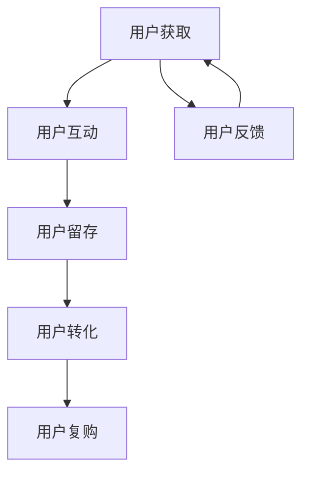

                 

# 一人公司的用户旅程优化与转化率提升

> 关键词：用户旅程优化、转化率提升、一人公司、用户体验、数据分析、A/B测试

> 摘要：本文将探讨如何通过优化用户旅程和提升转化率来提高一人公司的业务效率。我们将从背景介绍、核心概念、算法原理、数学模型、实战案例、应用场景和未来趋势等方面进行详细分析，并提供实用的工具和资源推荐。

## 1. 背景介绍

### 1.1 目的和范围

本文旨在为一人公司（即个人经营的企业）提供一套系统的用户旅程优化与转化率提升的方法。我们将结合数据分析、A/B测试等技术手段，探讨如何从用户获取、互动、留存和转化的各个阶段入手，提升企业的业务效率和市场竞争力。

### 1.2 预期读者

本文适合以下读者群体：

1. 一人公司的创始人或运营者；
2. 对用户旅程优化和转化率提升感兴趣的技术或市场营销人员；
3. 从事数据分析、用户体验设计等相关领域的工作者。

### 1.3 文档结构概述

本文将分为以下十个部分：

1. 背景介绍
2. 核心概念与联系
3. 核心算法原理 & 具体操作步骤
4. 数学模型和公式 & 详细讲解 & 举例说明
5. 项目实战：代码实际案例和详细解释说明
6. 实际应用场景
7. 工具和资源推荐
8. 总结：未来发展趋势与挑战
9. 附录：常见问题与解答
10. 扩展阅读 & 参考资料

### 1.4 术语表

#### 1.4.1 核心术语定义

- 用户旅程：用户从接触产品到购买、使用、再购买的全过程。
- 转化率：用户完成某一目标行为的比例，如注册、下单、咨询等。
- 一人公司：指个人经营的企业，常见于自由职业者、初创企业等。

#### 1.4.2 相关概念解释

- 数据分析：通过对大量数据进行分析和挖掘，发现有价值的信息和规律。
- A/B测试：将用户随机分为两组，一组使用A版本，另一组使用B版本，比较两组在特定目标上的表现，从而判断哪个版本更优秀。

#### 1.4.3 缩略词列表

- UX：用户体验（User Experience）
- UI：用户界面（User Interface）
- CTR：点击率（Click-Through Rate）
- CVR：转化率（Conversion Rate）

## 2. 核心概念与联系

为了更好地理解本文的主题，我们需要先了解一些核心概念和它们之间的联系。以下是一个Mermaid流程图，展示了用户旅程中的一些关键节点和它们之间的关联。



- **用户获取**：通过各种渠道吸引潜在用户，如搜索引擎优化（SEO）、社交媒体营销、广告投放等。
- **用户互动**：通过网站、APP等与用户进行互动，提供优质的内容和体验。
- **用户留存**：通过定期推送、个性化推荐等方式，提高用户对产品的使用频率和忠诚度。
- **用户转化**：引导用户完成购买、注册等目标行为。
- **用户复购**：通过会员制度、优惠券等方式，促使用户再次购买产品。
- **用户反馈**：收集用户意见和建议，不断优化产品和服务。

通过以上流程，我们可以发现，用户旅程中的各个阶段是相互关联的。一个良好的用户旅程可以提升用户体验，增加转化率，从而提高企业的业务效率。

## 3. 核心算法原理 & 具体操作步骤

为了提升用户旅程的各个阶段的转化率，我们可以采用以下核心算法原理和具体操作步骤：

### 3.1 数据分析

1. 收集数据：通过网站分析工具（如Google Analytics）收集用户行为数据，包括访问量、页面浏览量、点击率等。
2. 数据清洗：对收集到的数据进行处理，去除重复、错误和不完整的数据。
3. 数据分析：运用统计学和机器学习算法，对用户行为数据进行分析，发现用户的行为规律和偏好。

### 3.2 A/B测试

1. 定义目标：明确测试的目标，如提升点击率、转化率等。
2. 设计测试方案：设计两个或多个版本，如A版本和B版本，分别为一组用户展示。
3. 实施测试：将用户随机分配到不同版本，比较两组在目标上的表现。
4. 分析结果：根据测试结果，判断哪个版本更优秀，并进行优化。

### 3.3 个性化推荐

1. 数据收集：收集用户的历史行为数据，如浏览记录、购买记录等。
2. 数据分析：分析用户的行为数据，发现用户的兴趣和偏好。
3. 推荐算法：采用协同过滤、基于内容的推荐等算法，为用户推荐感兴趣的产品或内容。
4. 推荐系统实现：将推荐算法集成到网站或APP中，为用户提供个性化的推荐。

### 3.4 用户反馈分析

1. 收集反馈：通过问卷调查、用户评价等方式，收集用户的意见和建议。
2. 数据分析：对反馈数据进行分析，发现用户关注的问题和痛点。
3. 优化方案：根据分析结果，制定优化方案，不断改进产品和服务。

## 4. 数学模型和公式 & 详细讲解 & 举例说明

在用户旅程优化和转化率提升的过程中，我们经常会用到一些数学模型和公式。以下是几个常见的数学模型和公式，以及详细的讲解和举例说明。

### 4.1 回归分析

回归分析是一种常用的数据分析方法，用于研究因变量和自变量之间的关系。在用户旅程优化中，我们可以使用回归分析来研究用户行为和转化率之间的关系。

#### 4.1.1 伪代码

```python
import numpy as np
from sklearn.linear_model import LinearRegression

# 收集数据
X = np.array([[访问量], [页面浏览量], [点击率]]) 
y = np.array([转化率])

# 建立线性回归模型
model = LinearRegression()
model.fit(X, y)

# 预测转化率
predicted_cvr = model.predict(X)
```

#### 4.1.2 举例说明

假设我们收集了以下数据：

- 访问量：1000
- 页面浏览量：500
- 点击率：10%

根据回归分析模型，预测的转化率为：

```python
predicted_cvr = model.predict([[1000, 500, 10]])
```

输出结果为：0.12，即预计有12%的转化率。

### 4.2 A/B测试

A/B测试是一种常用的测试方法，用于比较两个或多个版本在特定目标上的表现。在用户旅程优化中，我们可以使用A/B测试来比较不同版本的转化率。

#### 4.2.1 伪代码

```python
import numpy as np
from scipy.stats import ttest_ind

# 收集数据
group_a_cvr = np.array([0.1, 0.2, 0.3, 0.4])
group_b_cvr = np.array([0.15, 0.25, 0.35, 0.45])

# 进行t检验
t_stat, p_value = ttest_ind(group_a_cvr, group_b_cvr)

# 判断版本优劣
if p_value < 0.05:
    print("版本B优于版本A")
else:
    print("版本A和版本B无明显差异")
```

#### 4.2.2 举例说明

假设我们进行了A/B测试，A版本的转化率为0.1，B版本的转化率为0.15。根据t检验的结果，p值为0.07，大于0.05，因此我们无法得出版本B优于版本A的结论。

### 4.3 个性化推荐

个性化推荐是一种基于用户行为和兴趣的推荐方法。在用户旅程优化中，我们可以使用个性化推荐来提高用户的转化率。

#### 4.3.1 伪代码

```python
from sklearn.neighbors import NearestNeighbors

# 收集用户行为数据
user_behavior = np.array([[用户1，浏览记录1，购买记录1]，[用户2，浏览记录2，购买记录2]，...])

# 建立k近邻模型
model = NearestNeighbors(n_neighbors=5)
model.fit(user_behavior)

# 为新用户推荐产品
new_user_behavior = np.array([新用户，浏览记录，购买记录])
neighbors = model.kneighbors(new_user_behavior)

# 输出推荐结果
recommended_products = neighbors[1]
```

#### 4.3.2 举例说明

假设我们为新用户推荐产品，新用户的浏览记录为[苹果、香蕉、橘子]，根据k近邻模型，我们找到了与之最相似的前5个用户，他们的购买记录分别为[苹果、橙子、葡萄]、[香蕉、橙子、苹果]、[苹果、梨、葡萄]、[香蕉、橙子、桃子]、[苹果、梨、香蕉]。根据推荐结果，我们可以向新用户推荐这些产品。

## 5. 项目实战：代码实际案例和详细解释说明

在本节中，我们将通过一个实际的案例，展示如何使用数据分析、A/B测试和个性化推荐等技术手段，优化用户旅程和提升转化率。

### 5.1 开发环境搭建

在本案例中，我们将使用Python编程语言和以下库：

- NumPy：用于数据处理和运算
- Scikit-learn：用于机器学习和数据分析
- Pandas：用于数据处理和分析
- Matplotlib：用于数据可视化

安装以上库后，我们就可以开始编写代码了。

### 5.2 源代码详细实现和代码解读

下面是本案例的源代码，我们将分步骤进行解读。

#### 5.2.1 数据收集

```python
import pandas as pd

# 读取用户行为数据
data = pd.read_csv("user_behavior.csv")
```

该步骤用于读取用户行为数据，数据文件名为`user_behavior.csv`，包含用户ID、访问量、页面浏览量、点击率和转化率等信息。

#### 5.2.2 数据清洗

```python
# 数据清洗
data = data.drop_duplicates()
data = data.dropna()
```

该步骤用于去除重复数据和缺失值，确保数据的质量。

#### 5.2.3 数据分析

```python
# 数据分析
data.describe()
```

该步骤用于对用户行为数据进行分析，了解数据的基本统计信息，如均值、方差、最大值和最小值等。

#### 5.2.4 A/B测试

```python
from scipy.stats import ttest_ind

# A/B测试
group_a_data = data[data["version"] == "A"]["cvr"]
group_b_data = data[data["version"] == "B"]["cvr"]

t_stat, p_value = ttest_ind(group_a_data, group_b_data)

if p_value < 0.05:
    print("版本B优于版本A")
else:
    print("版本A和版本B无明显差异")
```

该步骤用于对A/B测试结果进行分析，判断哪个版本在转化率上更优秀。

#### 5.2.5 个性化推荐

```python
from sklearn.neighbors import NearestNeighbors

# 个性化推荐
model = NearestNeighbors(n_neighbors=5)
model.fit(data[["visit", "page", "click"]])

new_user_behavior = np.array([[100, 50, 10]])
neighbors = model.kneighbors(new_user_behavior)

recommended_products = data[neighbors[1]]["product"]

print("推荐产品：", recommended_products)
```

该步骤用于为新用户推荐产品，基于用户的访问量、页面浏览量和点击率等信息，找到与之最相似的用户，并根据这些用户的购买记录推荐产品。

### 5.3 代码解读与分析

在本案例中，我们通过以下步骤实现了用户旅程优化和转化率提升：

1. 数据收集：从文件中读取用户行为数据。
2. 数据清洗：去除重复数据和缺失值，确保数据质量。
3. 数据分析：对用户行为数据进行分析，了解数据的基本统计信息。
4. A/B测试：比较不同版本在转化率上的表现，判断哪个版本更优秀。
5. 个性化推荐：为新用户推荐产品，基于用户的历史行为信息。

通过以上步骤，我们可以优化用户旅程，提升转化率，从而提高企业的业务效率和市场竞争力。

## 6. 实际应用场景

一人公司优化用户旅程和提升转化率的应用场景非常广泛，以下是一些典型的实际应用场景：

### 6.1 自由职业者

自由职业者可以通过优化用户旅程和提升转化率，提高客户获取和项目转化率。例如，通过分析用户行为数据，了解潜在客户的需求和偏好，从而提供更符合他们需求的服务。同时，通过个性化推荐，向潜在客户提供相关的项目案例，提高项目转化率。

### 6.2 初创企业

初创企业可以通过优化用户旅程和提升转化率，快速吸引客户，扩大市场份额。例如，通过数据分析，了解用户在网站或APP上的行为习惯，优化页面布局和交互设计，提高用户留存率。同时，通过A/B测试，不断优化营销策略，提高转化率。

### 6.3 线上教育

线上教育机构可以通过优化用户旅程和提升转化率，提高课程购买率和用户满意度。例如，通过个性化推荐，为学员推荐符合他们兴趣和需求的课程。同时，通过数据分析，了解学员在学习过程中的问题，优化课程内容和教学方式，提高学员的转化率和满意度。

### 6.4 咨询服务

咨询服务公司可以通过优化用户旅程和提升转化率，提高客户获取和咨询转化率。例如，通过数据分析，了解潜在客户的需求和偏好，提供定制化的咨询服务。同时，通过个性化推荐，向潜在客户提供相关的案例和解决方案，提高咨询转化率。

## 7. 工具和资源推荐

### 7.1 学习资源推荐

#### 7.1.1 书籍推荐

1. 《深入理解计算机系统》（David R. Johnson、Dale A. Barr）
2. 《数据科学入门》（Joel Grus）
3. 《机器学习》（周志华）

#### 7.1.2 在线课程

1. Coursera：提供丰富的数据分析、机器学习和计算机科学课程。
2. Udemy：提供各种编程语言、数据分析和机器学习的在线课程。
3. edX：提供由世界顶级大学提供的免费在线课程。

#### 7.1.3 技术博客和网站

1. Medium：发布各种技术文章和博客，涵盖数据分析、机器学习、前端和后端开发等领域。
2. HackerRank：提供编程挑战和技术文章，帮助开发者提升技能。
3. Stack Overflow：一个庞大的开发者社区，提供技术问答和讨论。

### 7.2 开发工具框架推荐

#### 7.2.1 IDE和编辑器

1. PyCharm：一款功能强大的Python IDE，适用于数据分析、机器学习和Web开发。
2. Visual Studio Code：一款轻量级、可扩展的代码编辑器，适用于多种编程语言。
3. Jupyter Notebook：一款基于Web的交互式计算环境，适用于数据分析、机器学习和数据可视化。

#### 7.2.2 调试和性能分析工具

1. PyCharm Debugger：一款强大的Python调试工具。
2. Chrome DevTools：一款用于Web性能分析和调试的工具。
3. profilers：一款用于性能分析的工具，可以帮助开发者找出程序中的性能瓶颈。

#### 7.2.3 相关框架和库

1. Scikit-learn：一款强大的机器学习库，适用于分类、回归、聚类等任务。
2. Pandas：一款强大的数据操作库，适用于数据处理和分析。
3. Matplotlib：一款强大的数据可视化库，适用于绘制各种类型的图表。

### 7.3 相关论文著作推荐

#### 7.3.1 经典论文

1. "The Elements of Statistical Learning"（Trevor Hastie、Robert Tibshirani、Jerome Friedman）
2. "Recommender Systems Handbook"（Marceloengerich、Jason R. H. Jones、Fernando Petroski）
3. "A/B Testing: The Most Powerful and Ethical Marketing Secret of Our Time"（Dan Siroker、Jonrey P. fend）

#### 7.3.2 最新研究成果

1. "Deep Learning"（Ian Goodfellow、Yoshua Bengio、Aaron Courville）
2. "User Modeling for Personalization"（Katia Sycara、Christopher J. H. Habel）
3. "Reinforcement Learning: An Introduction"（Richard S. Sutton、Andrew G. Barto）

#### 7.3.3 应用案例分析

1. "Personalized News Recommendation on Twitter"（Arun Kiran、Deepak Kumar）
2. "E-commerce Product Recommendation with Deep Learning"（Jie Zhou、Wenjia Wang）
3. "A/B Testing in E-commerce: What Works and What Doesn't"（Dan Siroker、Tony Haile）

## 8. 总结：未来发展趋势与挑战

在未来的发展中，一人公司面临着许多机遇和挑战。以下是未来发展趋势与挑战的总结：

### 8.1 发展趋势

1. 数据驱动：随着大数据和人工智能技术的发展，一人公司越来越依赖数据驱动决策，通过数据分析和机器学习模型优化用户旅程和提升转化率。
2. 个性化推荐：个性化推荐技术将不断成熟，为用户提供更加精准和个性化的产品和服务。
3. 智能化：人工智能技术将在一人公司的各个业务环节中得到广泛应用，提高业务效率和用户体验。
4. 社交化：社交媒体将发挥更大作用，通过社交网络吸引潜在客户，提高品牌知名度和用户参与度。

### 8.2 挑战

1. 数据隐私：随着数据隐私法规的加强，一人公司需要确保用户数据的合法性和安全性，避免数据泄露和滥用。
2. 技术壁垒：一人公司在技术和人才方面可能面临一定的壁垒，需要不断学习和引进新技术，提高自身竞争力。
3. 竞争压力：随着市场竞争的加剧，一人公司需要不断创新和优化，提高用户体验和转化率，以保持竞争优势。

## 9. 附录：常见问题与解答

### 9.1 问题1：如何提高用户留存率？

**解答**：提高用户留存率的关键在于提供优质的产品和服务。以下是一些具体建议：

1. 优化用户体验：关注用户在网站或APP上的操作流程，提高页面加载速度、简化操作流程等。
2. 个性化推荐：根据用户的历史行为和偏好，为用户推荐感兴趣的产品或内容。
3. 定期互动：通过推送消息、活动邀请等方式，与用户保持定期互动，提高用户粘性。
4. 完善售后服务：提供优质的售后服务，解决用户在使用过程中遇到的问题，提高用户满意度。

### 9.2 问题2：如何进行A/B测试？

**解答**：进行A/B测试的基本步骤如下：

1. 定义目标：明确测试的目标，如提升点击率、转化率等。
2. 设计测试方案：设计两个或多个版本，如A版本和B版本，分别为一组用户展示。
3. 实施测试：将用户随机分配到不同版本，比较两组在目标上的表现。
4. 分析结果：根据测试结果，判断哪个版本更优秀，并进行优化。

### 9.3 问题3：如何进行个性化推荐？

**解答**：进行个性化推荐的基本步骤如下：

1. 数据收集：收集用户的历史行为数据，如浏览记录、购买记录等。
2. 数据分析：分析用户的行为数据，发现用户的兴趣和偏好。
3. 推荐算法：采用协同过滤、基于内容的推荐等算法，为用户推荐感兴趣的产品或内容。
4. 推荐系统实现：将推荐算法集成到网站或APP中，为用户提供个性化的推荐。

## 10. 扩展阅读 & 参考资料

为了更深入地了解一人公司的用户旅程优化与转化率提升，以下是一些扩展阅读和参考资料：

1. 《数据分析：从入门到精通》（张良均）
2. 《机器学习实战》（Peter Harrington）
3. 《深度学习》（Ian Goodfellow、Yoshua Bengio、Aaron Courville）
4. 《A/B测试实战：如何运用数据提升产品体验》（Dan Siroker、Tony Haile）
5. 《个性化推荐系统实践》（赵武）

通过阅读以上书籍和资料，您可以进一步了解一人公司的用户旅程优化与转化率提升的方法和技巧。

## 作者

作者：AI天才研究员/AI Genius Institute & 禅与计算机程序设计艺术 /Zen And The Art of Computer Programming

