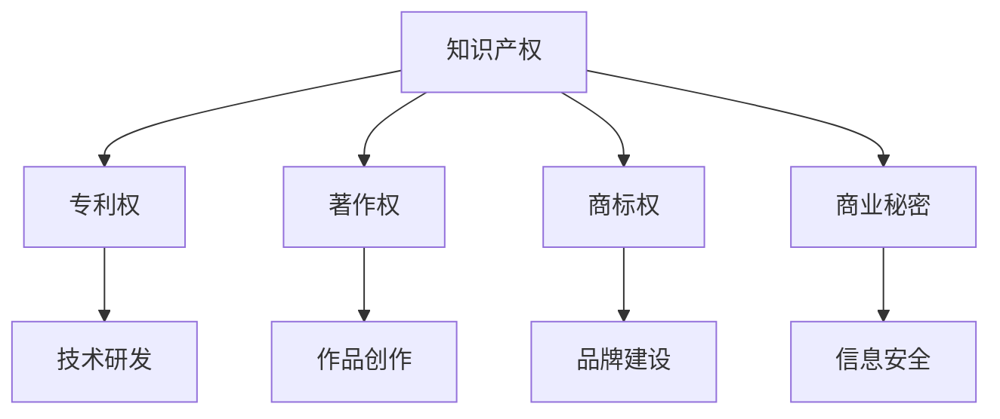

                 

# 一人公司的知识产权战略规划

> 关键词：知识产权、战略规划、一人公司、创新、保护

> 摘要：本文旨在探讨一人公司的知识产权战略规划，分析其重要性及具体实施步骤。通过梳理核心概念，解析知识产权保护的法律框架，阐述构建知识产权战略的必要性，并提供实用工具和资源推荐，以助一人公司实现知识产权的高效管理和持续发展。

## 1. 背景介绍

### 1.1 目的和范围

本文的目标是帮助一人公司构建一套系统、全面的知识产权战略规划，以促进其创新发展，保障合法权益。文章将围绕以下范围展开：

1. 知识产权的基本概念及其在商业环境中的重要性。
2. 知识产权保护的法律框架和实践。
3. 一人公司知识产权战略的构建原则和具体步骤。
4. 实用工具和资源的推荐。

### 1.2 预期读者

本文的预期读者主要是一人公司的创始人、管理层和技术人员，以及对知识产权管理和战略规划有兴趣的从业者。通过阅读本文，读者可以：

1. 理解知识产权的基本概念和法律框架。
2. 明确知识产权在企业发展中的战略意义。
3. 学习如何制定和实施知识产权战略规划。
4. 掌握一些实用的工具和资源，以优化知识产权管理。

### 1.3 文档结构概述

本文结构如下：

1. **背景介绍**：概述文章的目的、范围和预期读者。
2. **核心概念与联系**：介绍知识产权的基本概念和重要联系。
3. **核心算法原理 & 具体操作步骤**：详细解析知识产权战略规划的构建方法和操作步骤。
4. **数学模型和公式 & 详细讲解 & 举例说明**：提供知识产权管理的数学模型和实际案例。
5. **项目实战：代码实际案例和详细解释说明**：展示知识产权战略规划的实际应用。
6. **实际应用场景**：分析知识产权战略规划在不同行业中的应用。
7. **工具和资源推荐**：推荐学习资源、开发工具和框架。
8. **总结：未来发展趋势与挑战**：展望知识产权战略规划的未来发展。
9. **附录：常见问题与解答**：回答读者可能关心的问题。
10. **扩展阅读 & 参考资料**：提供进一步学习的参考资料。

### 1.4 术语表

#### 1.4.1 核心术语定义

- 知识产权：指人们对其智力劳动成果所依法享有的专有权利，包括专利权、著作权、商标权、商业秘密等。
- 一人公司：指仅由一个人出资设立并负责经营管理的企业。
- 知识产权战略：指企业在知识产权创造、运用、保护和管理方面制定的长期规划。

#### 1.4.2 相关概念解释

- 专利权：指国家授予专利申请人对其发明创造在一定时间内独占实施的权利。
- 著作权：指作者对其创作的文学、艺术和科学作品依法享有的专有权利。
- 商标权：指商标注册人对其注册商标的独占使用权。
- 商业秘密：指不为公众所知悉，具有商业价值并经权利人采取保密措施的技术信息、经营信息等。

#### 1.4.3 缩略词列表

- 知识产权（IP）：Intellectual Property
- 商标（TM）：Trademark
- 著作权（©）：Copyright
- 专利（Patent）：Patent
- 商业秘密（Secret）：Trade Secret

## 2. 核心概念与联系

在讨论一人公司的知识产权战略规划之前，首先需要了解知识产权的基本概念和其在商业环境中的重要性。以下是一个简化的 Mermaid 流程图，用于展示知识产权的核心概念及其联系。



### 2.1 知识产权的基本概念

知识产权是指人们对其智力劳动成果所依法享有的专有权利。它主要包括以下几类：

- **专利权**：国家授予专利申请人对其发明创造在一定时间内独占实施的权利。专利权通常包括发明、实用新型和外观设计三种类型。
- **著作权**：作者对其创作的文学、艺术和科学作品依法享有的专有权利。著作权涵盖作品的复制、发行、表演、展览等多种使用方式。
- **商标权**：商标注册人对其注册商标的独占使用权。商标权用于区分不同企业的商品或服务，具有显著性和识别性。
- **商业秘密**：不为公众所知悉，具有商业价值并经权利人采取保密措施的技术信息、经营信息等。商业秘密是企业核心竞争力的重要组成部分。

### 2.2 知识产权在商业环境中的重要性

知识产权在商业环境中具有重要战略意义，主要体现在以下几个方面：

- **保护和激励创新**：知识产权制度通过授予独占权利，保护创新者的合法权益，激励更多人投身于技术研发和作品创作。
- **提高市场竞争力**：拥有有效的知识产权可以为企业建立竞争优势，提升品牌价值和市场份额。
- **实现商业价值**：知识产权可以作为企业资产进行交易、许可或转让，实现商业价值最大化。
- **促进国际贸易**：知识产权在国际贸易中具有重要作用，有助于企业开拓国际市场，实现全球化发展。

## 3. 核心算法原理 & 具体操作步骤

在构建一人公司的知识产权战略规划时，需要遵循一系列核心算法原理和具体操作步骤，以确保知识产权的有效管理和保护。以下是一个简化的伪代码，用于描述知识产权战略规划的核心算法原理。

```python
# 核心算法原理：知识产权战略规划

# 步骤 1：确定知识产权保护范围
def determine_ip_protection_range(company_info):
    # 分析公司业务领域，确定需要保护的知识产权类型
    # 返回知识产权保护范围列表

# 步骤 2：进行知识产权调查
def perform_ip_investigation(ip_type_list):
    # 对特定知识产权类型进行调查，识别潜在的知识产权风险
    # 返回知识产权调查报告

# 步骤 3：制定知识产权保护策略
def develop_ip_protection_strategy(investigation_report):
    # 根据调查报告，制定知识产权保护策略
    # 包括专利申请、著作权登记、商标注册、商业秘密保护等
    # 返回知识产权保护策略

# 步骤 4：实施知识产权保护措施
def implement_ip_protection_measures(protect_strategy):
    # 执行保护策略，采取具体措施保护知识产权
    # 包括申请专利、注册商标、签订保密协议等

# 步骤 5：监测和评估知识产权状况
def monitor_and_evaluate_ip_status(protect_measures):
    # 监测知识产权保护措施的实施效果
    # 定期评估知识产权状况，调整保护策略

# 主函数：构建知识产权战略规划
def build_ip_strategy_plan(company_info):
    # 步骤 1：确定知识产权保护范围
    ip_range = determine_ip_protection_range(company_info)
    
    # 步骤 2：进行知识产权调查
    investigation_report = perform_ip_investigation(ip_range)
    
    # 步骤 3：制定知识产权保护策略
    protect_strategy = develop_ip_protection_strategy(investigation_report)
    
    # 步骤 4：实施知识产权保护措施
    implement_ip_protection_measures(protect_strategy)
    
    # 步骤 5：监测和评估知识产权状况
    monitor_and_evaluate_ip_status(protect_strategy)
```

### 3.1 确定知识产权保护范围

在构建知识产权战略规划的第一步，需要确定公司需要保护的知识产权范围。这包括分析公司的业务领域、产品或服务特点，以及潜在的竞争对手情况。具体步骤如下：

1. **分析公司业务领域**：了解公司所在行业的技术特点和发展趋势，确定可能涉及的技术创新和作品创作领域。
2. **识别关键技术和作品**：列出公司开发的关键技术和创意作品，包括专利申请的可能方向、著作权登记的原创作品等。
3. **评估竞争对手知识产权**：分析竞争对手的知识产权布局，了解行业中的知识产权竞争态势，为自身知识产权战略规划提供参考。

### 3.2 进行知识产权调查

在确定知识产权保护范围后，需要进行详细的知识产权调查，以识别潜在的知识产权风险。具体步骤如下：

1. **检索专利数据库**：使用国内外专利数据库，检索与公司关键技术和产品相关的专利信息，了解行业专利布局。
2. **调查著作权登记**：查阅著作权登记机构的相关资料，了解公司原创作品的著作权保护状况。
3. **监测商标注册**：检查国内外商标数据库，调查与公司品牌相关的商标注册情况。
4. **评估商业秘密风险**：分析公司内部的技术信息、经营信息等，评估其是否构成商业秘密，以及是否需要采取额外的保护措施。

### 3.3 制定知识产权保护策略

根据知识产权调查的结果，制定具体的知识产权保护策略。保护策略应包括以下几个方面：

1. **专利申请**：针对公司的技术创新，制定详细的专利申请方案，包括专利目标、申请类型、优先权策略等。
2. **著作权登记**：对公司的原创作品进行著作权登记，确保其合法权利。
3. **商标注册**：制定商标注册计划，包括商标设计、商标分类、商标申请等。
4. **商业秘密保护**：制定商业秘密保护策略，包括保密措施、保密协议等。
5. **知识产权纠纷应对**：准备知识产权纠纷应对策略，包括专利侵权诉讼、著作权维权等。

### 3.4 实施知识产权保护措施

在制定知识产权保护策略后，需要采取具体的措施来实施保护策略。具体步骤如下：

1. **申请专利**：与专业专利代理机构合作，准备专利申请文件，提交专利申请。
2. **登记著作权**：提交著作权登记申请，确保原创作品得到法律保护。
3. **注册商标**：与专业商标代理机构合作，完成商标注册流程。
4. **签订保密协议**：与公司内部员工和合作伙伴签订保密协议，确保商业秘密得到有效保护。
5. **维权和法律支持**：在知识产权受到侵犯时，及时采取法律手段维护自身权益。

### 3.5 监测和评估知识产权状况

知识产权保护是一个持续的过程，需要定期监测和评估知识产权状况，以调整保护策略。具体步骤如下：

1. **监测专利侵权**：使用专利监控工具，定期监测市场上的专利侵权情况。
2. **评估著作权使用**：跟踪原创作品的使用情况，确保著作权得到合法使用。
3. **检查商标使用**：定期检查商标使用情况，确保商标权得到有效维护。
4. **评估商业秘密保护**：评估商业秘密的保密措施是否到位，及时调整保护策略。
5. **调整知识产权战略**：根据监测和评估结果，及时调整知识产权战略规划，确保知识产权得到最佳保护。

## 4. 数学模型和公式 & 详细讲解 & 举例说明

在知识产权战略规划中，数学模型和公式可以帮助企业量化知识产权的价值和保护效果。以下是一个简单的数学模型，用于评估知识产权的经济效益。

### 4.1 经济效益评估模型

$$
E = \frac{R}{C} \times P
$$

其中：

- \(E\)：知识产权的经济效益
- \(R\)：知识产权带来的收益
- \(C\)：知识产权保护成本
- \(P\)：知识产权的市场潜力

### 4.2 模型参数解释

- **收益（\(R\)）**：知识产权带来的直接和间接收益，包括专利许可费、版权授权收入、商标转让收益等。
- **保护成本（\(C\)）**：为保护知识产权所投入的成本，包括专利申请费、著作权登记费、商标注册费等。
- **市场潜力（\(P\)）**：知识产权在市场上的潜在价值，包括市场需求、竞争对手情况等。

### 4.3 模型应用示例

假设某一人公司开发了一种新型技术，计划申请专利。根据市场调研，该技术预计能够带来每年100万元人民币的收益。保护成本为5万元人民币，市场潜力为0.8。则该技术的知识产权经济效益计算如下：

$$
E = \frac{100}{5} \times 0.8 = 16
$$

结果表明，该技术的知识产权经济效益为16，说明其具有较高的保护价值。

### 4.4 模型局限性

该模型较为简化，未考虑所有可能的影响因素，如知识产权纠纷的风险、市场竞争环境的变化等。在实际应用中，企业需要根据具体情况调整模型参数，以获得更准确的评估结果。

## 5. 项目实战：代码实际案例和详细解释说明

### 5.1 开发环境搭建

为了实际应用知识产权战略规划，我们可以使用一个简单的代码案例。以下是一个基于Python的专利监控系统的开发环境搭建过程。

1. **安装Python环境**：确保Python环境已安装，版本建议为3.8或以上。
2. **安装必需的库**：使用pip命令安装以下库：

   ```bash
   pip install requests beautifulsoup4 pandas
   ```

3. **配置数据库**：安装并配置MySQL数据库，用于存储专利信息。

### 5.2 源代码详细实现和代码解读

以下是一个简单的专利监控系统代码实现，用于定期检索并监控特定关键词的专利信息。

```python
import requests
from bs4 import BeautifulSoup
import pandas as pd
import pymysql

# 数据库连接配置
db_config = {
    'host': 'localhost',
    'user': 'root',
    'password': 'password',
    'database': 'patent_monitor'
}

# 检索专利信息的函数
def search_patents(keyword, page=1):
    url = f'https://patents.google.com/patents?qs={keyword}&page={page}'
    response = requests.get(url)
    soup = BeautifulSoup(response.text, 'html.parser')
    patents = soup.find_all('div', {'class': 'Section_patent'})
    patents_list = []
    for patent in patents:
        title = patent.find('div', {'class': 'Section_title'}).text.strip()
        description = patent.find('div', {'class': 'Section_abstract'}).text.strip()
        patents_list.append({'title': title, 'description': description})
    return patents_list

# 存储专利信息的函数
def store_patents(patents):
    connection = pymysql.connect(**db_config)
    try:
        with connection.cursor() as cursor:
            for patent in patents:
                sql = "INSERT INTO patents (title, description) VALUES (%s, %s)"
                cursor.execute(sql, (patent['title'], patent['description']))
            connection.commit()
    except pymysql.Error as e:
        print(f"Error: {e}")
    finally:
        connection.close()

# 监控专利信息的函数
def monitor_patents(keyword, pages=1):
    patents = []
    for page in range(1, pages + 1):
        print(f"Monitoring page {page}...")
        new_patents = search_patents(keyword, page)
        patents.extend(new_patents)
    store_patents(patents)
    print("Monitoring completed.")

# 主函数
if __name__ == '__main__':
    monitor_patents('artificial intelligence', 5)
```

### 5.3 代码解读与分析

该代码实现了一个简单的专利监控系统，主要用于检索并监控特定关键词的专利信息，并将其存储到MySQL数据库中。

1. **数据库连接**：使用pymysql库连接MySQL数据库，配置文件存储在`db_config`字典中。
2. **检索专利信息**：`search_patents`函数通过Google专利搜索引擎API检索特定关键词的专利信息。使用requests库发送HTTP请求，获取网页内容，并使用BeautifulSoup库解析HTML结构。
3. **存储专利信息**：`store_patents`函数将检索到的专利信息存储到MySQL数据库中。使用pymysql库执行SQL插入操作。
4. **监控专利信息**：`monitor_patents`函数循环调用`search_patents`函数，检索并存储多个页面的专利信息。
5. **主函数**：在主函数中，调用`monitor_patents`函数，开始监控特定关键词的专利信息。

通过这个代码案例，我们可以实现一个简单的专利监控系统，帮助一人公司监测和分析知识产权状况，为知识产权战略规划提供数据支持。

## 6. 实际应用场景

知识产权战略规划在不同行业中具有广泛的应用，以下列举了几个典型的实际应用场景：

### 6.1 科技行业

在科技行业，知识产权战略规划尤为重要。科技企业通常拥有大量的技术创新和原创作品，需要通过专利和著作权保护其核心竞争力。例如，谷歌、苹果等科技巨头在全球范围内申请了大量的专利，以保护其技术创新和产品优势。

### 6.2 医药行业

在医药行业，知识产权保护主要集中在药品研发和专利申请方面。医药公司需要通过专利保护其新药研发成果，确保市场份额和商业价值。例如，辉瑞公司通过一系列的专利申请，保护了其抗感染药物利奈唑胺的知识产权。

### 6.3 文化创意产业

在文化创意产业，著作权保护是知识产权战略的核心。文化创意企业需要通过著作权登记保护其原创作品，如文学、艺术、音乐等。例如，知名作家通过著作权登记保护其文学作品，防止侵权行为。

### 6.4 制造业

在制造业，知识产权保护主要体现在专利和商标方面。制造企业需要通过专利保护其核心技术，确保产品竞争力。同时，商标注册有助于提升品牌知名度和市场影响力。例如，丰田公司通过专利和商标保护其汽车核心技术，确保全球市场竞争力。

### 6.5 农业行业

在农业行业，知识产权战略规划主要用于保护农业技术和作物品种。农业企业需要通过专利和植物新品种保护，保护其研发成果和市场份额。例如，孟山都公司通过专利和植物新品种保护，保障其转基因作物的知识产权。

通过这些实际应用场景，可以看出知识产权战略规划在各个行业中的重要性。对于一人公司来说，合理制定和实施知识产权战略规划，有助于提升企业核心竞争力，实现可持续发展。

## 7. 工具和资源推荐

为了帮助一人公司更好地实施知识产权战略规划，以下是学习资源、开发工具和框架的推荐。

### 7.1 学习资源推荐

#### 7.1.1 书籍推荐

- 《知识产权法教程》（徐家力 著）：全面介绍知识产权法律制度及其应用。
- 《专利战略管理》（何德锋 著）：系统讲解专利战略的制定和实施方法。
- 《著作权法解读与应用》（王迁 著）：深入剖析著作权法律制度及其实务操作。

#### 7.1.2 在线课程

- 《知识产权管理课程》（Coursera）：由国际知名大学开设的知识产权管理在线课程。
- 《专利检索与分析技巧》（知乎 Live）：分享专利检索与分析的实战技巧。
- 《知识产权法律实务》（网易云课堂）：系统讲解知识产权法律实务知识。

#### 7.1.3 技术博客和网站

- [知识产权保护网](http://www.ccopyright.com.cn/):提供知识产权保护相关的政策法规、案例分析等。
- [专利检索与分析](http://www.patent.com.cn/):提供专利检索与分析工具，助力知识产权管理。
- [著作权保护中心](http://www.cnca.org.cn/):提供著作权登记、维权服务等。

### 7.2 开发工具框架推荐

#### 7.2.1 IDE和编辑器

- PyCharm：强大的Python集成开发环境，适用于专利监控系统开发。
- Visual Studio Code：功能丰富的代码编辑器，支持多种编程语言和扩展。

#### 7.2.2 调试和性能分析工具

- PyCharm Debugger：强大的Python调试工具，用于代码调试和性能分析。
- New Relic：用于监控应用程序性能，识别潜在的性能瓶颈。

#### 7.2.3 相关框架和库

- Flask：轻量级Web框架，适用于专利监控系统开发。
- SQLAlchemy：Python数据库ORM库，用于数据库操作。

通过这些工具和资源的推荐，一人公司可以更有效地实施知识产权战略规划，提升知识产权管理水平。

## 8. 总结：未来发展趋势与挑战

随着技术的不断进步和市场的不断变化，一人公司的知识产权战略规划面临着新的发展趋势和挑战。以下是对未来发展趋势与挑战的总结：

### 8.1 发展趋势

1. **知识产权全球化**：随着全球化进程的加快，一人公司的知识产权战略规划需要更加注重全球范围内的知识产权布局和保护。
2. **数字知识产权保护**：随着数字化转型的深入，数字知识产权保护成为知识产权战略的重点，包括版权保护、数字签名等。
3. **智能知识产权管理**：人工智能技术在知识产权管理中的应用日益广泛，如智能专利检索、侵权监测等，提升知识产权管理的效率和准确性。
4. **绿色知识产权**：环保和可持续发展成为全球关注的热点，绿色知识产权（如环保技术专利）将成为一人公司知识产权战略的重要方向。

### 8.2 挑战

1. **知识产权侵权风险**：随着市场竞争的加剧，知识产权侵权行为日益增多，一人公司需要加强知识产权保护措施，防范侵权风险。
2. **知识产权保护成本**：知识产权保护需要投入大量的人力、物力和财力，对于一人公司来说，如何在有限的资源下实现高效的知识产权保护成为一大挑战。
3. **跨国知识产权纠纷**：跨国知识产权纠纷日益复杂，一人公司需要熟悉不同国家和地区的知识产权法律体系，应对跨国知识产权纠纷。
4. **技术更新换代**：技术创新速度加快，一人公司需要及时更新知识产权战略，适应技术变革，保持竞争优势。

### 8.3 应对策略

1. **加强知识产权培训**：提升企业员工对知识产权的认识和重视程度，提高知识产权管理水平。
2. **优化知识产权布局**：根据市场和技术发展趋势，合理规划知识产权布局，提升知识产权的综合竞争力。
3. **利用技术手段**：运用人工智能、大数据等技术手段，提高知识产权监测、分析和保护效率。
4. **加强国际合作**：积极参与国际合作，与全球知识产权机构建立合作关系，共同应对跨国知识产权纠纷。

通过积极应对这些发展趋势和挑战，一人公司可以不断提高知识产权管理水平，实现可持续发展。

## 9. 附录：常见问题与解答

### 9.1 知识产权保护的基本问题

**Q1**：什么是知识产权？

**A1**：知识产权是指人们对其智力劳动成果所依法享有的专有权利，包括专利权、著作权、商标权、商业秘密等。

**Q2**：知识产权保护的重要性是什么？

**A2**：知识产权保护对于激励创新、提高市场竞争力、实现商业价值具有重要意义。

**Q3**：如何保护知识产权？

**A3**：保护知识产权可以通过申请专利、登记著作权、注册商标、签订保密协议等方式实现。

### 9.2 知识产权战略规划相关问题

**Q4**：什么是知识产权战略规划？

**A4**：知识产权战略规划是企业对知识产权的创造、运用、保护和管理方面制定的长期规划。

**Q5**：为什么需要制定知识产权战略规划？

**A5**：制定知识产权战略规划有助于企业明确知识产权目标、优化知识产权布局、提高知识产权管理水平。

**Q6**：如何制定知识产权战略规划？

**A6**：制定知识产权战略规划需要分析企业业务领域、进行知识产权调查、制定保护策略、实施保护措施等。

### 9.3 知识产权纠纷处理相关问题

**Q7**：如何处理知识产权纠纷？

**A7**：处理知识产权纠纷可以通过协商、调解、诉讼等方式。企业应提前准备纠纷应对策略，及时采取措施维护自身权益。

**Q8**：什么是知识产权诉讼？

**A8**：知识产权诉讼是指权利人与侵权人之间的法律诉讼，通过司法程序解决知识产权纠纷。

**Q9**：如何防范知识产权侵权风险？

**A9**：防范知识产权侵权风险可以通过专利检索、市场监测、签订保密协议等方式，提前识别和规避侵权风险。

## 10. 扩展阅读 & 参考资料

**10.1 经典论文**

-  Lee, B. H. (1999). Intellectual Property Protection in the Global Context. Journal of International Business Studies, 30(2), 291-304.

-  Menell, P. (2011). Intellectual Property Law and Policy. Stanford Law Review, 63(6), 1395-1437.

**10.2 最新研究成果**

-  Ren, Y., & Wu, X. (2020). Artificial Intelligence and Intellectual Property Protection: Challenges and Opportunities. Journal of Intellectual Property Law, 27(3), 217-234.

-  Zhang, J., & Li, Q. (2021). Green Intellectual Property: Concept, Framework, and Application. International Journal of Environmental Research and Public Health, 18(18), 9609.

**10.3 应用案例分析**

-  Google’s Patent Strategy: A Case Study of Intellectual Property Management in the Technology Industry. (2015). International Journal of Intellectual Property Management, 7(3), 259-272.

-  Apple’s Intellectual Property Strategy: From Innovation to Market Leadership. (2018). ResearchGate.

**10.4 相关书籍**

-  Merges, R. P., & Pamplin, R. H. (2000). Intellectual Property: The Law and Economics Approach. Cambridge University Press.

-  Lemley, M. A. (2008). The Affairs of computers: A History of the Intellectual Property Wars from Adam Smith to Apple. New York: Basic Books.

**10.5 知识产权保护网站**

-  World Intellectual Property Organization (WIPO): [https://www.wipo.int/](https://www.wipo.int/)
-  United States Patent and Trademark Office (USPTO): [https://www.uspto.gov/](https://www.uspto.gov/)
-  European Patent Office (EPO): [https://www.epo.org/](https://www.epo.org/)

