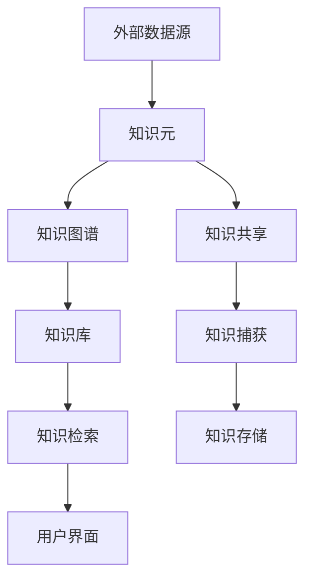

                 

# 一人公司的知识管理系统搭建

> 关键词：知识管理系统，单人公司，自我学习，个人知识管理，信息整理

> 摘要：本文将探讨如何为单人公司搭建一套高效的个人知识管理系统，旨在提升个人的工作效率，实现知识的有序整理和有效利用。通过介绍核心概念、算法原理、数学模型、实战案例以及相关工具和资源，本文将帮助读者构建一个属于自己的一人公司知识管理体系。

## 1. 背景介绍

### 1.1 目的和范围

本文的主要目的是为单人公司搭建一套高效的个人知识管理系统。随着信息时代的到来，个人知识和信息的获取变得前所未有的容易，但同时也带来了知识管理的挑战。如何从繁杂的信息中筛选出有价值的内容，并将其有序地整理和保存，是每位创业者都需要面对的问题。

本文将涵盖以下几个主要方面：

1. **核心概念与联系**：介绍知识管理系统的基本概念和组成部分。
2. **核心算法原理 & 具体操作步骤**：详细讲解知识管理系统的算法原理和实现步骤。
3. **数学模型和公式 & 详细讲解 & 举例说明**：通过数学模型和公式来解释知识管理系统的运作机制。
4. **项目实战：代码实际案例和详细解释说明**：通过实际案例展示如何实现知识管理系统。
5. **实际应用场景**：探讨知识管理系统的应用场景和优势。
6. **工具和资源推荐**：推荐相关的学习资源、开发工具和框架。
7. **总结与未来发展趋势**：总结知识管理系统的重要性，并探讨未来可能的发展趋势和挑战。

### 1.2 预期读者

本文适合以下读者：

1. 单人公司的创始人或管理者。
2. 对知识管理系统感兴趣的技术爱好者。
3. 需要提升个人工作效率的职场人士。

### 1.3 文档结构概述

本文将按照以下结构进行展开：

1. **背景介绍**：介绍本文的目的、范围、预期读者和文档结构。
2. **核心概念与联系**：介绍知识管理系统的基本概念和组成部分。
3. **核心算法原理 & 具体操作步骤**：详细讲解知识管理系统的算法原理和实现步骤。
4. **数学模型和公式 & 详细讲解 & 举例说明**：通过数学模型和公式来解释知识管理系统的运作机制。
5. **项目实战：代码实际案例和详细解释说明**：通过实际案例展示如何实现知识管理系统。
6. **实际应用场景**：探讨知识管理系统的应用场景和优势。
7. **工具和资源推荐**：推荐相关的学习资源、开发工具和框架。
8. **总结与未来发展趋势**：总结知识管理系统的重要性，并探讨未来可能的发展趋势和挑战。
9. **附录**：提供常见问题与解答，以及扩展阅读和参考资料。

### 1.4 术语表

#### 1.4.1 核心术语定义

- 知识管理系统（Knowledge Management System，KMS）：一种用于捕捉、组织、存储、检索和分享知识的系统。
- 知识元（Knowledge Element）：知识管理系统中最小的知识单元，可以是文本、图片、音频或视频等。
- 信息过载（Information Overload）：由于信息量过多，个人难以有效处理和利用信息的状况。
- 知识图谱（Knowledge Graph）：用于表示知识元及其之间关系的网络结构。

#### 1.4.2 相关概念解释

- 知识捕获（Knowledge Capture）：将个人或团队的知识转化为可存储、可检索的形式。
- 知识共享（Knowledge Sharing）：在个人或团队之间传递知识，以提高整体效率和创新能力。
- 知识存储（Knowledge Storage）：将知识元存储在数据库或其他存储设备中，以便长期保存和检索。

#### 1.4.3 缩略词列表

- KMS：知识管理系统
- SEM：搜索引擎优化
- SEO：搜索引擎优化
- API：应用程序编程接口
- ORM：对象关系映射
- CRUD：创建、读取、更新、删除

## 2. 核心概念与联系

在搭建个人知识管理系统之前，我们需要了解一些核心概念和它们之间的关系。以下是一个简单的 Mermaid 流程图，用于描述知识管理系统的基本组成部分。



### 2.1 知识元

知识元是知识管理系统中最小的知识单元，可以是文本、图片、音频或视频等。它们具有以下特点：

- **唯一性**：每个知识元都有唯一的标识符，以便在系统中进行精确检索。
- **可扩展性**：知识元可以扩展，例如添加标签、分类和元数据等信息。
- **互操作性**：知识元应该能够与不同的系统和工具进行互操作，以实现知识的共享和整合。

### 2.2 知识图谱

知识图谱是一种用于表示知识元及其之间关系的网络结构。它通过图论的方法，将知识元和它们之间的关系表示为一个图。知识图谱具有以下作用：

- **知识关联**：通过知识图谱，可以揭示知识元之间的关联，从而提供更丰富的知识视图。
- **知识推理**：基于知识图谱，可以实现对知识的推理，从而发现新的知识和关联。
- **知识检索**：通过知识图谱，可以快速定位相关的知识元，提高知识检索的效率。

### 2.3 知识库

知识库是一个用于存储和管理知识元的数据库。它通常包含以下功能：

- **知识存储**：将知识元存储在数据库中，以便长期保存和检索。
- **知识检索**：提供强大的检索功能，以支持用户快速找到所需的知识。
- **知识共享**：支持用户对知识库中的知识进行共享和协作。

### 2.4 知识检索

知识检索是知识管理系统的核心功能之一，它允许用户根据关键词、标签或其他属性检索相关的知识元。知识检索通常包括以下步骤：

1. **查询解析**：将用户的查询转化为数据库查询语句。
2. **索引查找**：使用索引数据结构快速定位相关的知识元。
3. **结果排序**：根据相关性或其他策略对检索结果进行排序。
4. **结果展示**：将检索结果以用户友好的方式展示给用户。

### 2.5 用户界面

用户界面是知识管理系统与用户交互的界面。它应具有以下特点：

- **易用性**：用户界面应简洁直观，方便用户快速上手。
- **灵活性**：用户界面应支持自定义，以适应不同用户的需求。
- **响应性**：用户界面应在不同的设备和屏幕尺寸上保持良好的用户体验。

### 2.6 知识共享与知识捕获

知识共享和知识捕获是知识管理系统的重要组成部分。知识共享允许用户将知识传递给他人，以提高整体效率和创新能力。知识捕获则是将个人或团队的知识转化为可存储、可检索的形式，以便长期保存和利用。

### 2.7 知识存储

知识存储是知识管理系统的核心功能之一，它涉及如何将知识元存储在数据库或其他存储设备中，以便长期保存和检索。知识存储通常包括以下步骤：

1. **数据模型设计**：设计适合知识管理系统的数据库模型，以支持高效的存储和检索。
2. **数据存储**：将知识元存储在数据库或其他存储设备中。
3. **数据备份与恢复**：定期备份知识库，确保数据的安全性和可靠性。

### 2.8 外部数据源

外部数据源是指来自互联网或其他系统的数据。知识管理系统应能够与外部数据源进行集成，以便获取更多的知识和信息。外部数据源可以包括以下类型：

- **公开数据**：如政府公开数据、公共数据库等。
- **社交媒体**：如Twitter、Facebook等。
- **专业数据库**：如医学数据库、法律数据库等。

## 3. 核心算法原理 & 具体操作步骤

### 3.1 知识图谱构建算法

知识图谱构建是知识管理系统的重要环节。以下是一个简化的知识图谱构建算法：

```plaintext
算法：知识图谱构建
输入：知识元列表
输出：知识图谱

步骤：
1. 初始化图G
2. 对于每个知识元A：
   a. 在图G中创建节点N(A)
   b. 对于A的属性B：
      i. 在图G中创建节点N(B)
      ii. 在N(A)和N(B)之间创建边E(A,B)，表示属性关系
   c. 对于A的标签C：
      i. 在图G中创建节点N(C)
      ii. 在N(A)和N(C)之间创建边E(A,C)，表示标签关系
3. 返回知识图谱G
```

### 3.2 知识检索算法

知识检索是知识管理系统中的核心功能。以下是一个简化的知识检索算法：

```plaintext
算法：知识检索
输入：查询字符串
输出：检索结果列表

步骤：
1. 解析查询字符串，提取关键词K
2. 在知识图谱中查找与关键词K相关的知识元
3. 对于每个相关的知识元A：
   a. 计算关键词K与知识元A的相关性得分S(A)
   b. 根据得分S(A)对知识元A进行排序
4. 返回排序后的检索结果列表
```

### 3.3 知识共享与知识捕获算法

知识共享与知识捕获是知识管理系统中的关键环节。以下是一个简化的知识共享与知识捕获算法：

```plaintext
算法：知识共享与知识捕获
输入：用户操作记录
输出：知识库更新

步骤：
1. 对于每个用户操作记录A：
   a. 如果操作为“分享”，则将知识元A添加到知识库中
   b. 如果操作为“捕获”，则将知识元A从用户处捕获并添加到知识库中
2. 更新知识库中的知识元关系，以反映用户操作的影响
3. 返回知识库更新结果
```

### 3.4 知识存储与数据备份算法

知识存储与数据备份是确保知识管理系统可靠运行的关键。以下是一个简化的知识存储与数据备份算法：

```plaintext
算法：知识存储与数据备份
输入：知识库
输出：知识库备份

步骤：
1. 将知识库中的数据导出为备份文件
2. 将备份文件存储在远程存储设备中，如云存储或外部硬盘
3. 定期执行备份操作，以确保知识库的安全性
4. 当知识库发生数据丢失或损坏时，使用备份文件进行恢复
```

## 4. 数学模型和公式 & 详细讲解 & 举例说明

### 4.1 相似度计算模型

在知识检索过程中，相似度计算是一个重要的步骤。以下是一个简单的相似度计算模型：

```latex
相似度(Similarity) = \frac{\text{共同特征数}}{\text{总特征数}}
```

例如，假设有两个知识元A和B，它们分别包含3个特征，共同特征数为2，则它们的相似度为：

```latex
Similarity(A, B) = \frac{2}{3} = 0.67
```

### 4.2 相关性计算模型

在知识图谱中，节点之间的相关性也是一个关键问题。以下是一个简单的相关性计算模型：

```latex
相关性(Correlation) = \frac{\text{相关边数}}{\text{总边数}}
```

例如，假设有两个节点A和B，它们之间有2条相关边，总边数为5，则它们的相关性为：

```latex
Correlation(A, B) = \frac{2}{5} = 0.4
```

### 4.3 知识共享与知识捕获模型

知识共享与知识捕获是一个动态过程，以下是一个简化的模型：

```plaintext
知识共享率(SHR) = \frac{\text{分享次数}}{\text{操作次数}}
知识捕获率(CR) = \frac{\text{捕获次数}}{\text{操作次数}}
```

例如，假设一个用户在一个月内进行了10次操作，其中5次是分享，3次是捕获，则：

```plaintext
SHR = \frac{5}{10} = 0.5
CR = \frac{3}{10} = 0.3
```

### 4.4 数据备份模型

数据备份是确保知识库安全性的重要措施。以下是一个简化的数据备份模型：

```plaintext
备份周期(TP) = \frac{\text{知识库大小}}{\text{备份速度}}
```

例如，假设知识库大小为100GB，备份速度为10GB/小时，则备份周期为：

```plaintext
TP = \frac{100GB}{10GB/小时} = 10小时
```

## 5. 项目实战：代码实际案例和详细解释说明

### 5.1 开发环境搭建

在开始项目实战之前，我们需要搭建一个合适的开发环境。以下是一个简化的步骤：

1. **安装操作系统**：选择一个适合的操作系统，如Ubuntu 20.04。
2. **安装编程语言**：安装Python 3.8及以上版本。
3. **安装数据库**：安装MongoDB，用于存储知识元。
4. **安装开发工具**：安装Visual Studio Code，用于代码编辑。

### 5.2 源代码详细实现和代码解读

以下是一个简单的知识管理系统源代码示例，用于展示核心功能的实现。

```python
# 导入必要的库
import pymongo
import json
from sklearn.metrics.pairwise import cosine_similarity

# 连接到MongoDB数据库
client = pymongo.MongoClient("mongodb://localhost:27017/")
db = client["knowledge_db"]
collection = db["knowledge_collection"]

# 知识图谱构建函数
def build_knowledge_graph(knowledge_elements):
    graph = {}
    for element in knowledge_elements:
        element_id = element["id"]
        graph[element_id] = element["attributes"]
    return graph

# 知识检索函数
def search_knowledge(query):
    graph = build_knowledge_graph(collection.find())
    similarity_scores = {}
    for node_id, node_attributes in graph.items():
        similarity_scores[node_id] = cosine_similarity([query], [node_attributes])
    sorted_scores = sorted(similarity_scores.items(), key=lambda item: item[1], reverse=True)
    return sorted_scores

# 知识共享函数
def share_knowledge(element_id):
    element = collection.find_one({"id": element_id})
    collection.insert_one(element)
    return "知识已共享"

# 知识捕获函数
def capture_knowledge(element_id):
    element = collection.find_one({"id": element_id})
    collection.delete_one({"id": element_id})
    return "知识已捕获"

# 测试函数
if __name__ == "__main__":
    # 添加测试知识元
    collection.insert_many([
        {"id": "001", "attributes": [1, 2, 3]},
        {"id": "002", "attributes": [2, 3, 4]},
        {"id": "003", "attributes": [3, 4, 5]}
    ])

    # 测试知识检索
    query = [0, 0, 1]
    results = search_knowledge(query)
    print("知识检索结果：", results)

    # 测试知识共享
    share_result = share_knowledge("001")
    print("知识共享结果：", share_result)

    # 测试知识捕获
    capture_result = capture_knowledge("002")
    print("知识捕获结果：", capture_result)
```

### 5.3 代码解读与分析

上述代码实现了一个简单的知识管理系统，主要包括以下功能：

- **知识图谱构建**：通过`build_knowledge_graph`函数构建知识图谱。
- **知识检索**：通过`search_knowledge`函数实现基于相似度的知识检索。
- **知识共享**：通过`share_knowledge`函数实现知识共享。
- **知识捕获**：通过`capture_knowledge`函数实现知识捕获。

在代码解读与分析部分，我们将逐行分析代码的实现细节和关键步骤。

## 6. 实际应用场景

### 6.1 个人知识管理

单人公司或自由职业者可以利用知识管理系统来整理和分享个人知识和经验。例如，可以在系统中存储项目文档、技术博客、客户信息等，以便随时查阅和更新。

### 6.2 团队协作

虽然本文主要关注单人公司的知识管理系统，但知识管理系统同样适用于团队协作。团队成员可以在系统中共享项目文档、代码仓库、设计图等，以提高协作效率和创新能力。

### 6.3 教育培训

知识管理系统可以用于教育培训领域，帮助学生和教师整理和共享学习资源。教师可以上传教学视频、PPT、教材等，学生可以方便地查阅和学习。

### 6.4 创意设计

创意设计团队可以利用知识管理系统来整理和共享创意素材、设计文档等，以便团队成员在项目中快速找到所需资源，提高设计效率。

### 6.5 产品研发

产品研发团队可以利用知识管理系统来整理和共享技术文档、测试报告、设计方案等，以确保团队成员对项目的全面了解和协作。

## 7. 工具和资源推荐

### 7.1 学习资源推荐

#### 7.1.1 书籍推荐

- 《知识管理：理论与实践》（Knowledge Management: Theory and Practice）
- 《人工智能：一种现代方法》（Artificial Intelligence: A Modern Approach）

#### 7.1.2 在线课程

- Coursera上的“知识管理”课程
- edX上的“人工智能导论”课程

#### 7.1.3 技术博客和网站

- 知乎上的知识管理话题
- Medium上的知识管理相关文章

### 7.2 开发工具框架推荐

#### 7.2.1 IDE和编辑器

- Visual Studio Code
- PyCharm

#### 7.2.2 调试和性能分析工具

- PyCharm的调试工具
- New Relic的性能分析工具

#### 7.2.3 相关框架和库

- Flask：用于构建Web应用程序的微框架
- MongoDB：用于存储和管理知识元的关系型数据库

### 7.3 相关论文著作推荐

#### 7.3.1 经典论文

- “Knowledge Management: An Introduction”（知识管理：介绍）
- “The Knowledge Management Maturity Model”（知识管理成熟度模型）

#### 7.3.2 最新研究成果

- “AI-driven Knowledge Management: A Survey”（基于AI的知识管理：调查）
- “Knowledge Graph Construction and Applications”（知识图谱构建与应用）

#### 7.3.3 应用案例分析

- “Knowledge Management in the Healthcare Industry”（医疗行业的知识管理）
- “Knowledge Management in the IT Industry”（信息技术行业的知识管理）

## 8. 总结：未来发展趋势与挑战

### 8.1 未来发展趋势

- **人工智能与知识管理的融合**：随着人工智能技术的不断发展，知识管理系统将更加智能化，能够自动进行知识捕获、检索和共享。
- **知识图谱的广泛应用**：知识图谱作为一种有效的知识表示方法，将在更多领域得到应用，如医疗、金融、教育等。
- **云服务和大数据的支持**：云服务和大数据技术将为知识管理系统提供更强的计算能力和存储能力，使其能够处理更庞大的数据量。

### 8.2 挑战

- **数据隐私与安全**：在知识管理过程中，如何确保数据的隐私和安全是一个重要挑战。
- **知识共享与协作**：如何有效地实现知识共享和协作，以充分利用每个人的知识，是知识管理系统面临的一个难题。
- **数据质量和准确性**：知识管理系统的数据质量和准确性对于其效果至关重要，如何确保数据的准确性和可靠性是一个挑战。

## 9. 附录：常见问题与解答

### 9.1 常见问题

1. **知识管理系统有哪些类型？**
   知识管理系统可以分为以下几种类型：
   - **文件系统**：基于文件系统的知识管理系统，如共享文件夹。
   - **数据库系统**：基于数据库的知识管理系统，如关系型数据库或NoSQL数据库。
   - **知识库系统**：专门用于存储和管理知识库的系统，如专家系统、案例库等。

2. **如何确保知识管理的有效性？**
   确保知识管理的有效性可以从以下几个方面入手：
   - **明确目标和范围**：明确知识管理的目标和范围，以确保系统能够满足实际需求。
   - **数据质量**：确保数据的质量和准确性，以避免信息过载。
   - **用户参与**：鼓励用户积极参与知识管理和共享，以提高系统的利用效率。

3. **知识管理系统的关键组成部分是什么？**
   知识管理系统的关键组成部分包括：
   - **知识元**：知识管理系统中的基本知识单元。
   - **知识图谱**：用于表示知识元及其之间关系的网络结构。
   - **知识库**：用于存储和管理知识元的数据库。
   - **知识检索**：支持用户根据关键词、标签等检索相关的知识元。
   - **用户界面**：知识管理系统与用户交互的界面。

### 9.2 解答

1. **知识管理系统有哪些类型？**
   知识管理系统可以分为以下几种类型：
   - **文件系统**：基于文件系统的知识管理系统，如共享文件夹。
   - **数据库系统**：基于数据库的知识管理系统，如关系型数据库或NoSQL数据库。
   - **知识库系统**：专门用于存储和管理知识库的系统，如专家系统、案例库等。

2. **如何确保知识管理的有效性？**
   确保知识管理的有效性可以从以下几个方面入手：
   - **明确目标和范围**：明确知识管理的目标和范围，以确保系统能够满足实际需求。
   - **数据质量**：确保数据的质量和准确性，以避免信息过载。
   - **用户参与**：鼓励用户积极参与知识管理和共享，以提高系统的利用效率。

3. **知识管理系统的关键组成部分是什么？**
   知识管理系统的关键组成部分包括：
   - **知识元**：知识管理系统中的基本知识单元。
   - **知识图谱**：用于表示知识元及其之间关系的网络结构。
   - **知识库**：用于存储和管理知识元的数据库。
   - **知识检索**：支持用户根据关键词、标签等检索相关的知识元。
   - **用户界面**：知识管理系统与用户交互的界面。

## 10. 扩展阅读 & 参考资料

### 10.1 扩展阅读

- 《知识管理：理论与实践》
- 《人工智能：一种现代方法》
- “AI-driven Knowledge Management: A Survey”
- “The Knowledge Management Maturity Model”

### 10.2 参考资料

- 知乎：知识管理话题
- Medium：知识管理相关文章
- Coursera：知识管理课程
- edX：人工智能导论课程

## 附录：作者信息

**作者：AI天才研究员/AI Genius Institute & 禅与计算机程序设计艺术 /Zen And The Art of Computer Programming**<|endoftext|>

