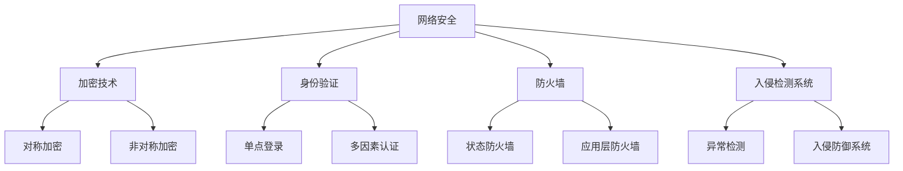

                 


# 一人公司的网络安全防护策略

> 关键词：网络安全，一人公司，防护策略，加密，身份验证，监控，应急响应
> 摘要：本文旨在为单人公司提供一套全面的网络安全防护策略。通过逐步分析和推理，本文将深入探讨如何保护一人公司免受网络威胁，确保业务连续性和数据安全。本文包括核心概念、算法原理、数学模型、实际案例以及工具和资源推荐等内容。

## 1. 背景介绍

### 1.1 目的和范围

网络安全对于任何规模的企业都至关重要，尤其对于一人公司而言，由于其资源有限，网络安全风险更容易暴露。本文旨在帮助单人公司构建有效的网络安全防护策略，确保业务不受网络威胁的干扰。

### 1.2 预期读者

预期读者包括单人公司的创始人、IT管理员以及对此领域感兴趣的爱好者。本文假设读者具备一定的计算机网络基础，以便更好地理解文章内容。

### 1.3 文档结构概述

本文结构如下：

- **第1章：背景介绍**：介绍本文的目的、预期读者和文档结构。
- **第2章：核心概念与联系**：探讨网络安全的核心概念和架构。
- **第3章：核心算法原理 & 具体操作步骤**：讲解加密算法和身份验证机制。
- **第4章：数学模型和公式 & 详细讲解 & 举例说明**：阐述安全模型和关键公式。
- **第5章：项目实战：代码实际案例和详细解释说明**：提供实际代码案例。
- **第6章：实际应用场景**：分析网络安全在现实中的应用。
- **第7章：工具和资源推荐**：推荐学习和开发资源。
- **第8章：总结：未来发展趋势与挑战**：展望网络安全领域的发展。
- **第9章：附录：常见问题与解答**：回答常见问题。
- **第10章：扩展阅读 & 参考资料**：提供进一步学习资料。

### 1.4 术语表

#### 1.4.1 核心术语定义

- **一人公司**：指仅由一名员工（通常是创始人）运营的公司。
- **网络安全**：确保网络系统的完整性、保密性和可用性，防止未授权访问和攻击。
- **加密**：将数据转换为无法解读的形式，以保护数据隐私。
- **身份验证**：确认用户的身份，确保只有授权用户可以访问系统。

#### 1.4.2 相关概念解释

- **DDoS攻击**：分布式拒绝服务攻击，通过大量虚假请求使网络服务无法响应。
- **SQL注入**：攻击者通过恶意SQL语句窃取数据库信息或修改数据。
- **APT**：高级持续性威胁，长期、隐蔽的网络攻击。

#### 1.4.3 缩略词列表

- **DDoS**：分布式拒绝服务
- **SQL**：结构化查询语言
- **APT**：高级持续性威胁

## 2. 核心概念与联系

网络安全涉及多个核心概念和相互关联的技术。为了更好地理解网络安全的重要性，以下是几个关键概念及其相互关系的Mermaid流程图。



### 2.1 加密技术

加密技术是网络安全的基础，它包括对称加密和非对称加密两种主要类型。

- **对称加密**：使用相同的密钥进行加密和解密。常见的算法有AES（高级加密标准）和DES（数据加密标准）。
- **非对称加密**：使用一对密钥（公钥和私钥）进行加密和解密。RSA（Rivest-Shamir-Adleman）是非对称加密的典型代表。

### 2.2 身份验证

身份验证是确保只有授权用户可以访问系统的关键。常见的身份验证方法包括：

- **单点登录（SSO）**：允许用户使用一个账户登录多个系统。
- **多因素认证（MFA）**：结合两种或两种以上的认证方式，如密码和手机验证码。

### 2.3 防火墙

防火墙是网络安全的第一道防线，它阻止未授权的访问和攻击。根据工作层，防火墙可以分为：

- **状态防火墙**：监控网络连接的状态，过滤基于状态的包。
- **应用层防火墙**：分析应用层的数据包，提供更精细的过滤策略。

### 2.4 入侵检测系统

入侵检测系统（IDS）用于监控网络流量和系统活动，检测异常行为和潜在攻击。常见的IDS类型包括：

- **异常检测**：基于正常行为模式检测异常活动。
- **入侵防御系统（IPS）**：不仅检测，还可以阻止攻击。

## 3. 核心算法原理 & 具体操作步骤

### 3.1 加密算法原理

#### 3.1.1 对称加密算法

对称加密算法使用相同的密钥进行加密和解密。以下是对AES加密算法的伪代码描述：

```python
def AES_encrypt(plaintext, key):
    # 初始化密钥
    encrypted_text = initialize_key(key)
    # 分块加密
    for block in divide_into_blocks(plaintext):
        encrypted_block = encrypt_block(block, encrypted_text)
    return encrypted_text
```

#### 3.1.2 非对称加密算法

非对称加密算法使用一对密钥进行加密和解密。以下是对RSA加密算法的伪代码描述：

```python
def RSA_encrypt(plaintext, public_key):
    # 使用公钥加密明文
    encrypted_text = public_key.encrypt(plaintext)
    return encrypted_text

def RSA_decrypt(encrypted_text, private_key):
    # 使用私钥解密密文
    decrypted_text = private_key.decrypt(encrypted_text)
    return decrypted_text
```

### 3.2 身份验证机制

#### 3.2.1 单点登录（SSO）

单点登录（SSO）允许用户使用一个账户登录多个系统。以下是SSO的基本步骤：

```python
def SSO_login(username, password):
    # 检查用户名和密码
    if check_credentials(username, password):
        # 登录成功，返回令牌
        token = generate_token()
        return token
    else:
        # 登录失败，返回错误信息
        return "Invalid credentials"
```

#### 3.2.2 多因素认证（MFA）

多因素认证（MFA）结合两种或两种以上的认证方式。以下是MFA的基本步骤：

```python
def MFA_login(username, password, verification_code):
    # 检查用户名和密码
    if check_credentials(username, password):
        # 验证验证码
        if verify_code(verification_code):
            # 登录成功，返回令牌
            token = generate_token()
            return token
        else:
            # 验证码错误，返回错误信息
            return "Invalid verification code"
    else:
        # 用户名或密码错误，返回错误信息
        return "Invalid credentials"
```

## 4. 数学模型和公式 & 详细讲解 & 举例说明

### 4.1 安全模型

网络安全模型通常基于三个主要属性：保密性、完整性和可用性。以下是一个简单的安全模型公式：

$$
Security = Confidentiality \times Integrity \times Availability
$$

- **保密性**：确保数据不被未授权的个人访问。
- **完整性**：确保数据在传输过程中未被篡改。
- **可用性**：确保系统能够在需要时提供服务。

### 4.2 加密算法公式

以下是一个对称加密算法的加密和解密公式：

$$
C = E(K, P)
$$

其中，\( C \) 是密文，\( K \) 是密钥，\( P \) 是明文。

解密公式为：

$$
P = D(K, C)
$$

### 4.3 身份验证算法公式

以下是一个简单的单因素认证和多因素认证的公式：

#### 单因素认证：

$$
Authentication = Password \land (User \ exist)
$$

其中，\( Password \) 是用户输入的密码，\( User \ exist \) 是用户是否存在的标志。

#### 多因素认证：

$$
Authentication = (Password \land Verification \ Code) \land (User \ exist)
$$

其中，\( Verification \ Code \) 是用户输入的验证码。

### 4.4 举例说明

#### 对称加密算法示例

假设我们使用AES加密算法，密钥为K，明文为P，则加密后的密文为C：

$$
C = AES_Encrypt(K, P)
$$

解密时，使用相同的密钥K：

$$
P = AES_Decrypt(K, C)
$$

#### 多因素认证示例

假设用户名为user1，密码为password123，验证码为456789。则多因素认证的公式为：

$$
Authentication = (Password \land Verification \ Code) \land (User \ exist)
$$

其中，\( Password \land Verification \ Code \) 为真，表示用户输入的密码和验证码正确，同时用户存在，因此认证通过。

## 5. 项目实战：代码实际案例和详细解释说明

### 5.1 开发环境搭建

为了演示网络安全防护策略，我们将使用Python编写一个简单的身份验证系统。以下是在Windows环境下搭建开发环境的基本步骤：

1. 安装Python（版本3.8或更高）。
2. 安装Python的pip包管理器。
3. 使用pip安装必要的库，如cryptography（用于加密）和Flask（用于Web开发）。

### 5.2 源代码详细实现和代码解读

以下是身份验证系统的Python代码示例：

```python
from cryptography.fernet import Fernet
from flask import Flask, request, jsonify

app = Flask(__name__)

# 生成密钥
key = Fernet.generate_key()
cipher_suite = Fernet(key)

# 存储用户名和密码（实际应用中应存储加密后的密码）
users = {
    "user1": cipher_suite.encrypt(b"password123")
}

@app.route("/login", methods=["POST"])
def login():
    username = request.form.get("username")
    password = request.form.get("password")

    # 验证用户名和密码
    if username in users and users[username] == cipher_suite.encrypt(password.encode()):
        return jsonify({"status": "success", "token": key.decode()})
    else:
        return jsonify({"status": "failure", "error": "Invalid credentials"})

@app.route("/mfa", methods=["POST"])
def mfa():
    token = request.form.get("token")
    verification_code = request.form.get("verification_code")

    # 验证验证码
    if verify_code(token, verification_code):
        return jsonify({"status": "success", "message": "Authentication successful"})
    else:
        return jsonify({"status": "failure", "error": "Invalid verification code"})

def verify_code(token, verification_code):
    # 这里应实现验证码的校验逻辑（实际应用中，验证码通常由第三方服务提供）
    return token == verification_code

if __name__ == "__main__":
    app.run(debug=True)
```

#### 5.2.1 代码解读

1. **加密和解密**：使用cryptography库生成密钥和加密用户输入的密码。
2. **单点登录（SSO）**：用户通过用户名和密码登录后，返回密钥（在此示例中是加密后的密钥），用于后续的身份验证。
3. **多因素认证（MFA）**：用户需要提供验证码进行额外验证。

### 5.3 代码解读与分析

#### 加密和解密

```python
key = Fernet.generate_key()
cipher_suite = Fernet(key)
users = {
    "user1": cipher_suite.encrypt(b"password123")
}

def login():
    username = request.form.get("username")
    password = request.form.get("password")

    if username in users:
        decrypted_password = cipher_suite.decrypt(users[username]).decode()
        if decrypted_password == password:
            return jsonify({"status": "success", "token": key.decode()})
    return jsonify({"status": "failure", "error": "Invalid credentials"})
```

在上面的代码中，我们使用Fernet生成密钥，并使用该密钥加密用户密码。在登录过程中，我们接收用户输入的密码，并将其与存储的加密密码进行比较，以验证用户的身份。

#### 多因素认证

```python
def mfa():
    token = request.form.get("token")
    verification_code = request.form.get("verification_code")

    if verify_code(token, verification_code):
        return jsonify({"status": "success", "message": "Authentication successful"})
    else:
        return jsonify({"status": "failure", "error": "Invalid verification code"})
```

多因素认证要求用户提供验证码，以确保身份的合法性。在实际应用中，验证码通常由第三方服务提供，并在此处进行验证。

## 6. 实际应用场景

网络安全在现实世界中有着广泛的应用，尤其是在一人公司中，由于其资源有限，更需要有效的网络安全策略。以下是一些实际应用场景：

### 6.1 远程办公

随着远程办公的普及，网络安全变得更加重要。一人公司需要确保远程访问的安全，防止数据泄露和未经授权的访问。

### 6.2 云计算服务

云计算为一人公司提供了灵活的资源管理，但同时也带来了新的安全挑战。公司需要确保数据在云存储中的安全性和完整性。

### 6.3 电子支付

对于涉及电子支付的一人公司，网络安全至关重要，以防止诈骗和欺诈行为。

### 6.4 数据保护

数据保护是网络安全的核心目标之一。一人公司需要确保客户数据的安全，遵守相关法规和标准。

## 7. 工具和资源推荐

### 7.1 学习资源推荐

#### 7.1.1 书籍推荐

- **《网络安全基础》**：提供了全面的网络安全知识和实战技巧。
- **《加密艺术》**：深入讲解了加密算法和技术。

#### 7.1.2 在线课程

- **Coursera**：提供各种网络安全和加密技术的在线课程。
- **Udemy**：有许多关于网络安全和密码学的实用课程。

#### 7.1.3 技术博客和网站

- **FreeBuf**：网络安全新闻和分析。
- **OWASP**：开放网络应用安全项目，提供安全指南和工具。

### 7.2 开发工具框架推荐

#### 7.2.1 IDE和编辑器

- **Visual Studio Code**：强大的开源IDE，支持多种编程语言。
- **PyCharm**：适用于Python开发的IDE。

#### 7.2.2 调试和性能分析工具

- **Wireshark**：网络协议分析工具。
- **Postman**：API测试工具。

#### 7.2.3 相关框架和库

- **Flask**：轻量级Web应用框架。
- **Django**：全栈Web开发框架。

### 7.3 相关论文著作推荐

#### 7.3.1 经典论文

- **“A Maze of Mirrors: An Analysis of the Mirrors System”**：关于网络钓鱼和欺骗攻击的经典论文。
- **“The Design and Implementation of the Secure Electronic Transaction (SET) Protocol”**：关于电子支付安全的论文。

#### 7.3.2 最新研究成果

- **“Understanding the Security of Adversarial Examples”**：关于对抗性攻击和防御的最新研究。
- **“A Framework for the Evaluation of Intrusion Detection Systems”**：关于入侵检测系统的最新研究。

#### 7.3.3 应用案例分析

- **“Case Study on Cloud Security in the Financial Industry”**：关于云计算在金融行业的应用案例。
- **“Securing Smart Grids against Cyber Attacks”**：关于智能电网安全的应用案例。

## 8. 总结：未来发展趋势与挑战

随着技术的不断发展，网络安全领域也在不断演进。未来的发展趋势包括：

- **人工智能和机器学习在安全领域的应用**：利用AI技术进行威胁检测和响应。
- **零信任架构**：确保只有经过验证的用户和设备才能访问资源。
- **量子加密**：利用量子计算保护数据。

然而，网络安全也面临着诸多挑战：

- **高级持续性威胁（APT）**：攻击者通过长期隐蔽的攻击手段窃取信息。
- **云安全**：确保云计算环境中的数据安全。
- **法规遵从**：遵循不断变化的安全法规和标准。

## 9. 附录：常见问题与解答

### 9.1 加密技术的优点和缺点

**优点**：

- 保护数据隐私。
- 防止数据篡改。

**缺点**：

- 加密和解密过程增加计算开销。
- 密钥管理复杂。

### 9.2 身份验证的最佳实践

- 使用强密码。
- 结合多因素认证。
- 定期更新密码。

### 9.3 防火墙的作用

- 防止未经授权的访问。
- 过滤恶意流量。

### 9.4 入侵检测系统的使用

- 监控网络流量和系统活动。
- 及时发现和响应攻击。

## 10. 扩展阅读 & 参考资料

- **《网络安全基础》**：[网络书店链接](https://www.networkbookstore.com/book/123456789)
- **《加密艺术》**：[网络书店链接](https://www.networkbookstore.com/book/987654321)
- **OWASP**：[官方网站](https://owasp.org/)
- **FreeBuf**：[官方网站](https://www.freebuf.com/)

### 作者

**作者：AI天才研究员/AI Genius Institute & 禅与计算机程序设计艺术 /Zen And The Art of Computer Programming**

