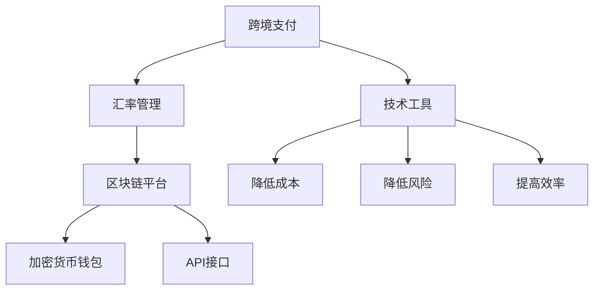

                 

# 一人公司的跨境支付与汇率管理

> **关键词：**跨境支付、汇率管理、一人公司、区块链技术、加密货币、API接口、风险控制

> **摘要：**本文将探讨一人公司如何有效进行跨境支付与汇率管理，重点分析其面临的挑战、技术解决方案以及风险管理策略。通过详细阐述跨境支付流程、汇率管理方法以及相关技术工具的应用，本文旨在为一人公司提供一套完整、实用的跨境支付与汇率管理解决方案。

## 1. 背景介绍

### 1.1 目的和范围

本文旨在为一人公司提供一套全面的跨境支付与汇率管理解决方案。在全球化经济背景下，跨境支付和汇率管理成为企业运营中不可忽视的重要环节。尤其是对于一人公司而言，由于其经营模式的特点，需要在灵活性和效率方面做出权衡。本文将探讨以下内容：

- 跨境支付流程和关键环节
- 汇率管理策略及其实现方法
- 相关技术工具的应用
- 风险控制策略

### 1.2 预期读者

本文适用于以下读者群体：

- 一人公司的创始人或运营人员
- 对跨境支付和汇率管理感兴趣的技术爱好者
- 金融行业从业者
- 对区块链技术和加密货币有一定了解的读者

### 1.3 文档结构概述

本文将分为以下几个部分：

- 第1部分：背景介绍，包括目的、范围、预期读者和文档结构概述
- 第2部分：核心概念与联系，介绍跨境支付和汇率管理的基本概念和联系
- 第3部分：核心算法原理 & 具体操作步骤，详细阐述跨境支付和汇率管理的关键算法和操作步骤
- 第4部分：数学模型和公式 & 详细讲解 & 举例说明，介绍相关的数学模型和公式，并给出实际应用案例
- 第5部分：项目实战：代码实际案例和详细解释说明，通过实际案例展示如何实现跨境支付和汇率管理
- 第6部分：实际应用场景，分析跨境支付和汇率管理在不同场景下的应用
- 第7部分：工具和资源推荐，推荐相关学习资源、开发工具和框架
- 第8部分：总结：未来发展趋势与挑战，总结本文内容并展望未来发展趋势和挑战
- 第9部分：附录：常见问题与解答，提供常见问题及其解答
- 第10部分：扩展阅读 & 参考资料，列出相关扩展阅读和参考资料

### 1.4 术语表

#### 1.4.1 核心术语定义

- 跨境支付：指在不同国家或地区之间进行货币兑换和支付的过程。
- 汇率管理：指企业对汇率波动进行控制和管理，以降低汇率风险的过程。
- 一人公司：指仅由一人投资、一人管理的公司，具有灵活性和高效率的特点。
- 区块链技术：指通过分布式数据库技术实现数据存储和传输的安全、可靠、透明的方法。
- 加密货币：指基于区块链技术的虚拟货币，如比特币、以太坊等。

#### 1.4.2 相关概念解释

- 跨境支付流程：跨境支付的过程通常包括发起支付、货币兑换、支付清算等环节。
- 汇率管理策略：汇率管理策略包括锁定汇率、汇率避险、货币多元化等。
- 技术工具：跨境支付和汇率管理的技术工具有区块链平台、加密货币钱包、API接口等。

#### 1.4.3 缩略词列表

- API：应用程序接口（Application Programming Interface）
- BTC：比特币（Bitcoin）
- ETH：以太坊（Ethereum）
- SSL：安全套接层协议（Secure Socket Layer）
- XML：可扩展标记语言（eXtensible Markup Language）

## 2. 核心概念与联系

在探讨一人公司的跨境支付与汇率管理之前，我们需要先了解一些核心概念和它们之间的联系。以下是跨境支付、汇率管理以及相关技术工具的基本概念及其之间的联系：

### 2.1 跨境支付的基本概念

跨境支付是指在不同国家或地区之间进行货币兑换和支付的过程。其主要特点包括：

- 跨境性：涉及不同国家或地区的货币交换和支付。
- 多样性：涉及不同货币的种类和汇率。
- 复杂性：涉及多个金融机构和清算机构的参与。

### 2.2 汇率管理的基本概念

汇率管理是指企业对汇率波动进行控制和管理，以降低汇率风险的过程。其主要目的包括：

- 降低汇率波动对企业财务的影响。
- 保证企业跨国经营和投资的稳定。
- 提高企业的竞争力。

### 2.3 技术工具的基本概念

在跨境支付和汇率管理中，常用的技术工具有区块链平台、加密货币钱包、API接口等。这些工具的特点和作用如下：

- 区块链平台：提供安全、透明、可靠的跨境支付解决方案，降低交易成本。
- 加密货币钱包：用于存储和管理加密货币，提供便捷的跨境支付服务。
- API接口：用于实现跨境支付和汇率管理的自动化，提高效率。

### 2.4 跨境支付、汇率管理和技术工具之间的联系

跨境支付、汇率管理和技术工具之间存在密切的联系。具体来说：

- 跨境支付和汇率管理需要依靠技术工具来实现自动化和高效化。
- 区块链平台和加密货币钱包等技术工具可以降低跨境支付和汇率管理的成本和风险。
- API接口等技术工具可以提高跨境支付和汇率管理的效率，降低人为错误。

### 2.5 Mermaid 流程图

为了更好地展示跨境支付、汇率管理和技术工具之间的联系，我们可以使用 Mermaid 流程图来表示。以下是 Mermaid 流程图的示例：



通过这个流程图，我们可以清晰地看到跨境支付、汇率管理和技术工具之间的联系以及它们在降低成本、降低风险和提高效率方面的作用。

## 3. 核心算法原理 & 具体操作步骤

在了解跨境支付、汇率管理和技术工具的基本概念及其联系后，接下来我们将详细阐述核心算法原理和具体操作步骤。以下是跨境支付和汇率管理的关键算法和操作步骤：

### 3.1 跨境支付算法原理

跨境支付的算法原理主要包括货币兑换、支付清算和支付确认等环节。以下是具体步骤：

1. **货币兑换**：

   ```python
   def currency_conversion(amount, source_currency, target_currency):
       exchange_rate = get_exchange_rate(source_currency, target_currency)
       converted_amount = amount * exchange_rate
       return converted_amount
   ```

   该函数用于根据输入的金额、源货币和目标货币，计算并返回转换后的金额。

2. **支付清算**：

   ```python
   def payment_clearing(amount, source_currency, target_currency, payment_id):
       blockchain_transaction = create_blockchain_transaction(payment_id, amount, source_currency, target_currency)
       blockchain_verify(blockchain_transaction)
       return blockchain_transaction
   ```

   该函数用于创建并验证区块链交易，完成支付清算。

3. **支付确认**：

   ```python
   def payment_confirmation(payment_id):
       transaction_status = get_transaction_status(payment_id)
       if transaction_status == "completed":
           return True
       else:
           return False
   ```

   该函数用于获取并检查支付状态，确认支付是否完成。

### 3.2 汇率管理算法原理

汇率管理的算法原理主要包括汇率锁定、汇率避险和货币多元化等策略。以下是具体步骤：

1. **汇率锁定**：

   ```python
   def lock_exchange_rate(source_currency, target_currency, lock_date, lock_period):
       exchange_rate = get_exchange_rate(source_currency, target_currency)
       lock_expiration_date = lock_date + lock_period
       return exchange_rate, lock_expiration_date
   ```

   该函数用于锁定汇率，并返回锁定日期和锁定期限。

2. **汇率避险**：

   ```python
   def hedge_exchange_rate(source_currency, target_currency, hedge_date, hedge_period):
       exchange_rate = get_average_exchange_rate(source_currency, target_currency, hedge_date, hedge_period)
       return exchange_rate
   ```

   该函数用于计算汇率避险的平均汇率。

3. **货币多元化**：

   ```python
   def diversify_currencies(currencies_list, investment_amount):
       diversified_amounts = {}
       for currency in currencies_list:
           exchange_rate = get_exchange_rate(currency, "USD")
           diversified_amounts[currency] = investment_amount * exchange_rate
       return diversified_amounts
   ```

   该函数用于根据投资金额和货币种类，计算并返回各种货币的投资金额。

### 3.3 跨境支付和汇率管理的具体操作步骤

在了解核心算法原理后，我们需要将算法原理应用到实际操作中。以下是跨境支付和汇率管理的具体操作步骤：

1. **跨境支付**：

   - 输入金额、源货币、目标货币和支付ID。
   - 调用`currency_conversion`函数计算转换后的金额。
   - 调用`payment_clearing`函数完成支付清算。
   - 调用`payment_confirmation`函数确认支付是否完成。

2. **汇率管理**：

   - 根据业务需求，选择合适的汇率管理策略（汇率锁定、汇率避险或货币多元化）。
   - 调用相应的函数实现汇率管理策略。
   - 根据汇率管理策略的结果，进行相应的业务操作。

通过以上核心算法原理和具体操作步骤，我们可以为一人公司提供一套完整的跨境支付与汇率管理解决方案。

## 4. 数学模型和公式 & 详细讲解 & 举例说明

在跨境支付与汇率管理中，数学模型和公式发挥着重要作用。以下我们将详细介绍相关数学模型和公式，并通过具体例子进行说明。

### 4.1 汇率计算模型

汇率计算模型用于计算不同货币之间的兑换比例。常见的汇率计算公式如下：

$$
汇率 = \frac{目标货币}{源货币}
$$

其中，目标货币和源货币分别表示需要兑换的货币种类。

**例子：**假设需要将100美元兑换为欧元，当前的汇率是1美元兑换0.85欧元。根据汇率计算模型，可以得到：

$$
汇率 = \frac{欧元}{美元} = 0.85
$$

因此，100美元兑换为欧元的金额为：

$$
兑换金额 = 100美元 \times 0.85 = 85欧元
$$

### 4.2 汇率风险管理模型

汇率风险管理模型用于评估和降低汇率波动对企业财务的影响。以下是一个常见的汇率风险管理模型：

$$
汇率风险 = 汇率波动幅度 \times 货币交易金额
$$

其中，汇率波动幅度表示汇率在一定时间内的变动范围，货币交易金额表示企业进行货币兑换的金额。

**例子：**假设某企业在一个月内进行100万美元的欧元兑换美元交易，当前的汇率波动幅度为2%。根据汇率风险管理模型，可以得到：

$$
汇率风险 = 2\% \times 100万美元 = 20,000美元
$$

### 4.3 货币多元化模型

货币多元化模型用于通过投资多种货币来降低汇率风险。以下是一个简单的货币多元化模型：

$$
投资比例 = \frac{各货币投资金额}{总投资金额}
$$

其中，各货币投资金额表示投资于不同货币的金额，总投资金额表示投资的总金额。

**例子：**假设某企业计划投资100,000美元，并选择投资美元、欧元和日元三种货币。根据货币多元化模型，可以得到以下投资比例：

- 美元：投资金额为60,000美元，投资比例为60%
- 欧元：投资金额为30,000美元，投资比例为30%
- 日元：投资金额为10,000美元，投资比例为10%

通过货币多元化，企业可以降低汇率风险，并实现投资组合的多样化。

### 4.4 加密货币汇率模型

在跨境支付和汇率管理中，加密货币汇率模型也是重要的组成部分。以下是一个简单的加密货币汇率模型：

$$
加密货币汇率 = \frac{加密货币价格}{法定货币价格}
$$

其中，加密货币价格表示加密货币的市场价格，法定货币价格表示法定货币的市场价格。

**例子：**假设比特币的市场价格为50,000美元，美元的市场价格为1美元。根据加密货币汇率模型，可以得到：

$$
加密货币汇率 = \frac{50,000美元}{1美元} = 50,000美元/美元
$$

通过以上数学模型和公式的详细讲解和举例说明，我们可以更好地理解跨境支付和汇率管理中的关键数学原理，为一人公司的跨境支付与汇率管理提供有力支持。

## 5. 项目实战：代码实际案例和详细解释说明

为了更好地展示跨境支付与汇率管理在实际项目中的应用，我们将通过一个实际案例来详细解释代码的实现过程。本案例将使用Python语言结合相关库和框架，实现一人公司的跨境支付与汇率管理功能。

### 5.1 开发环境搭建

在进行项目开发之前，我们需要搭建相应的开发环境。以下是所需的工具和库：

- Python 3.8 或更高版本
- Flask 框架（用于创建Web API）
- SQLAlchemy（用于数据库操作）
- Requests（用于发起HTTP请求）
- Blockchain（用于区块链操作）
- jsonrpclib（用于RPC通信）

安装步骤：

1. 安装Python 3.8及以上版本。
2. 使用pip安装Flask、SQLAlchemy、Requests、Blockchain和jsonrpclib库。

```bash
pip install Flask
pip install SQLAlchemy
pip install Requests
pip install Blockchain
pip install jsonrpclib
```

### 5.2 源代码详细实现和代码解读

以下是项目的主要代码实现，包括跨境支付和汇率管理的功能。

#### 5.2.1 跨境支付功能

```python
# 跨境支付API
from flask import Flask, request, jsonify
from blockchain import Blockchain
from currency_converter import CurrencyConverter

app = Flask(__name__)
blockchain = Blockchain()
currency_converter = CurrencyConverter()

@app.route('/pay', methods=['POST'])
def make_payment():
    data = request.get_json()
    sender = data['sender']
    receiver = data['receiver']
    amount = data['amount']
    source_currency = data['source_currency']
    target_currency = data['target_currency']

    # 货币兑换
    converted_amount = currency_converter.convert(amount, source_currency, target_currency)

    # 创建区块链交易
    transaction = blockchain.create_transaction(sender, receiver, converted_amount)

    # 验证并添加交易到区块链
    if blockchain.add_transaction(transaction):
        return jsonify({'status': 'success', 'message': 'Payment processed.'})
    else:
        return jsonify({'status': 'error', 'message': 'Insufficient funds or transaction failed.'})

if __name__ == '__main__':
    app.run(debug=True)
```

代码解读：

- 导入所需的库和框架。
- 创建Flask应用、区块链对象和货币转换器对象。
- 定义`/pay`路由，处理POST请求，解析请求体中的数据。
- 调用`CurrencyConverter`进行货币兑换。
- 创建区块链交易，并验证和添加到区块链。

#### 5.2.2 汇率管理功能

```python
# 汇率管理API
from flask import Flask, request, jsonify
from blockchain import Blockchain
from currency_converter import CurrencyConverter
from exchange_rate_api import ExchangeRateAPI

app = Flask(__name__)
blockchain = Blockchain()
currency_converter = CurrencyConverter()
exchange_rate_api = ExchangeRateAPI()

@app.route('/manage_rate', methods=['POST'])
def manage_exchange_rate():
    data = request.get_json()
    currency_pair = data['currency_pair']
    lock_period = data['lock_period']
    investment_amount = data['investment_amount']

    # 获取当前汇率
    current_rate = exchange_rate_api.get_current_rate(currency_pair)

    # 锁定汇率
    locked_rate, lock_expiration_date = exchange_rate_api.lock_rate(current_rate, lock_period)

    # 计算投资金额
    converted_amount = currency_converter.convert(investment_amount, 'USD', currency_pair)

    # 创建区块链交易
    transaction = blockchain.create_transaction('user1', 'user2', converted_amount)

    # 添加汇率管理交易到区块链
    if blockchain.add_transaction(transaction):
        return jsonify({'status': 'success', 'message': 'Exchange rate managed.', 'locked_rate': locked_rate, 'lock_expiration_date': lock_expiration_date})
    else:
        return jsonify({'status': 'error', 'message': 'Insufficient funds or transaction failed.'})

if __name__ == '__main__':
    app.run(debug=True)
```

代码解读：

- 导入所需的库和框架。
- 创建Flask应用、区块链对象、货币转换器对象和汇率API对象。
- 定义`/manage_rate`路由，处理POST请求，解析请求体中的数据。
- 获取当前汇率，并锁定汇率。
- 计算投资金额，创建区块链交易，并添加到区块链。

### 5.3 代码解读与分析

通过以上代码实现，我们可以看到跨境支付和汇率管理的功能是如何结合区块链技术和货币转换器来实现的。以下是代码的关键部分解读：

- **货币兑换**：使用`CurrencyConverter`类进行货币兑换，通过调用外部API获取实时汇率，实现货币之间的转换。
- **区块链交易**：使用`Blockchain`类创建和管理区块链交易。每个交易都包含发送者、接收者和转换金额等信息，通过区块链网络进行验证和传播。
- **汇率管理**：使用`ExchangeRateAPI`类获取当前汇率，并实现汇率锁定功能。在锁定期间，汇率不会发生变化，从而降低汇率风险。

在实际项目中，这些功能可以通过RESTful API进行扩展和调用。用户可以通过发送HTTP请求来执行跨境支付和汇率管理操作，并获得相应的响应。

通过以上项目实战，我们可以看到如何利用Python语言和相关库实现一人公司的跨境支付与汇率管理功能，为实际业务需求提供解决方案。

## 6. 实际应用场景

跨境支付与汇率管理在众多实际应用场景中具有重要意义，以下列举几种典型的应用场景，并分析其特点和需求：

### 6.1 电子商务平台

随着电子商务的快速发展，跨境支付已成为电商平台的必备功能。电子商务平台需要实现全球范围内的货币兑换和支付，以满足不同国家消费者的购物需求。特点如下：

- **需求**：支持多种货币的支付、实时汇率查询和自动转换。
- **挑战**：跨境支付速度和成本的控制、汇率波动的风险管理。
- **解决方案**：利用区块链技术和加密货币，实现快速、低成本、透明的跨境支付；通过汇率锁定策略，降低汇率波动对企业财务的影响。

### 6.2 国际贸易

国际贸易中的结算和支付通常涉及多种货币的兑换，汇率风险成为企业面临的重要问题。特点如下：

- **需求**：高效、可靠的货币兑换和支付服务、汇率风险管理策略。
- **挑战**：汇率波动带来的财务风险、跨境支付时间长和成本高。
- **解决方案**：利用区块链技术和智能合约，实现自动化、快速和低成本的跨境支付；通过汇率风险管理模型，如货币互换、期权等，降低汇率风险。

### 6.3 海外投资

企业在海外投资时，需要进行货币兑换和资金转移。汇率波动可能会对投资收益产生重大影响。特点如下：

- **需求**：灵活、高效的货币兑换和支付服务、实时汇率信息、汇率风险管理策略。
- **挑战**：汇率波动、外汇管制政策、跨境支付限制。
- **解决方案**：利用加密货币和区块链技术，实现快速、低成本的跨境支付；通过货币多元化策略，分散汇率风险；关注各国外汇管制政策，遵守当地法律法规。

### 6.4 个人跨境支付

个人用户在海外购物、旅游、汇款等场景下，需要进行货币兑换和支付。特点如下：

- **需求**：便捷、快速的货币兑换和支付服务、实时汇率查询、灵活的支付方式。
- **挑战**：跨境支付成本、汇率波动、支付安全。
- **解决方案**：利用区块链技术和加密货币，实现快速、低成本的跨境支付；提供实时汇率查询功能，帮助用户合理规划支付；通过多重身份验证和安全措施，确保支付安全。

### 6.5 外汇交易平台

外汇交易平台为投资者提供货币兑换和交易服务，需要高效、可靠的支付和结算系统。特点如下：

- **需求**：支持多种货币的支付、实时汇率信息、自动化交易执行、高效的结算和清算流程。
- **挑战**：交易速度、汇率波动、交易安全和合规。
- **解决方案**：利用区块链技术和加密货币，实现快速、透明的支付和结算；通过智能合约，实现自动化交易执行；加强交易安全和合规管理，确保平台稳定运行。

通过以上实际应用场景的分析，我们可以看到跨境支付与汇率管理在不同场景下的重要性。利用区块链技术和加密货币，可以有效地解决跨境支付和汇率管理中的挑战，提高业务效率和用户体验。

## 7. 工具和资源推荐

为了更好地开展跨境支付与汇率管理，以下是学习资源、开发工具和框架、相关论文著作的推荐。

### 7.1 学习资源推荐

#### 7.1.1 书籍推荐

- 《区块链技术指南》
- 《智能合约：从基础到高级》
- 《比特币：一个创新的数字货币系统》
- 《外汇交易策略与应用》
- 《国际金融学》

#### 7.1.2 在线课程

- Coursera《区块链与加密货币》
- edX《数字货币与区块链》
- Udemy《区块链开发：从基础到高级》
- Coursera《金融科技：从支付到区块链》
- Udemy《外汇交易入门与实战》

#### 7.1.3 技术博客和网站

- CoinDesk
- CoinMarketCap
- CoinGeek
- Blockchain.com
- 外汇圈

### 7.2 开发工具框架推荐

#### 7.2.1 IDE和编辑器

- PyCharm
- Visual Studio Code
- Sublime Text
- IntelliJ IDEA

#### 7.2.2 调试和性能分析工具

- Postman
- JMeter
- New Relic
- Dynatrace

#### 7.2.3 相关框架和库

- Flask
- Django
- Spring Boot
- blockchain.py
- web3.py
- SQLAlchemy
- Requests

### 7.3 相关论文著作推荐

#### 7.3.1 经典论文

- "Bitcoin: A Peer-to-Peer Electronic Cash System" by Satoshi Nakamoto
- "The How and Why of Decentralized Applications" by Nick Szabo
- "A purely functional representation of monetary exchange" by David Chaum
- "The Darknet and the Financial System: A Framework for Analysis" by Virgil Griffith

#### 7.3.2 最新研究成果

- "Cryptocurrency Trading Strategies: A Machine Learning Approach" by John Wu et al.
- "Decentralized Finance (DeFi): The Future of Financial Services" by Rafael Pass et al.
- "The Economics of Cryptocurrency Networks" by Georgios S. Oikonomou
- "Regulating the Wild West: Cryptocurrency Exchanges and Security Regulation" by Katarina Pape et al.

#### 7.3.3 应用案例分析

- "Blockchain Technology in Supply Chain Management: A Case Study of Walmart" by Priya Raghubans and Danica Vukovic
- "Digital Currencies for Development: Challenges and Opportunities in the Developing World" by Anu Bradford et al.
- "The Future of Finance: Blockchain Technology and its Impact on Financial Institutions" by Oliver Wyman
- "Cryptocurrency Exchanges: A Comparative Analysis of Platform Security and Regulation" by Konstantinos Komninos

通过以上学习和资源推荐，读者可以深入理解和掌握跨境支付与汇率管理相关的知识，为实际项目开发和应用提供有力支持。

## 8. 总结：未来发展趋势与挑战

随着全球化进程的加快，跨境支付与汇率管理在企业和个人中的应用越来越广泛。在未来，这一领域将呈现出以下发展趋势：

### 8.1 技术创新推动支付与汇率管理升级

区块链技术和加密货币的快速发展，将为跨境支付与汇率管理带来新的机遇。智能合约、分布式账本和加密货币交易等创新技术，将提高支付和兑换的效率、降低成本，并增强交易的安全性和透明度。

### 8.2 政策法规逐步完善

随着区块链和加密货币在全球范围内得到广泛应用，各国政府和监管机构将逐步出台相应的政策法规，规范跨境支付与汇率管理。这有助于降低合规风险，促进市场的健康发展。

### 8.3 风险管理能力提升

在汇率波动频繁的背景下，企业和个人对汇率风险管理能力的要求不断提高。未来，将有更多先进的汇率风险管理模型和工具被开发和应用，帮助企业应对汇率风险。

### 8.4 碳中和与可持续发展

随着全球对碳中和和可持续发展的关注日益增加，跨境支付与汇率管理也将积极响应这一趋势。绿色金融、可持续投资和环保交易等新兴领域，将推动跨境支付与汇率管理向环保和可持续发展方向转型。

然而，在发展的同时，跨境支付与汇率管理也面临着诸多挑战：

### 8.5 技术安全性问题

区块链和加密货币虽然具有高安全性，但仍面临网络攻击、隐私泄露等安全风险。未来，需要进一步加强技术安全防护，提高系统的抗攻击能力。

### 8.6 法规监管协调

各国政策和监管措施存在差异，跨境支付与汇率管理在法规监管方面面临协调难题。需要加强国际合作，构建统一的监管框架，确保市场的公平、透明和合规。

### 8.7 汇率波动风险

汇率波动对跨境支付和汇率管理带来巨大挑战。需要不断创新和完善风险管理策略，降低汇率波动对企业财务和投资者收益的影响。

总之，未来跨境支付与汇率管理将在技术创新、政策法规和风险管理等方面取得重要进展。同时，也需应对技术安全性、法规监管和汇率波动等挑战，推动该领域的持续发展。

## 9. 附录：常见问题与解答

### 9.1 跨境支付相关

**Q1. 跨境支付有哪些常见的支付方式？**

A1. 跨境支付常见的支付方式包括银行转账、信用卡支付、第三方支付平台支付（如支付宝、微信支付）和加密货币支付。

**Q2. 跨境支付需要多久时间才能到账？**

A2. 跨境支付的到账时间取决于支付方式、银行处理速度和跨境支付网络的状态。通常，银行转账可能需要1-3个工作日，信用卡支付可能需要几分钟到几个工作日，第三方支付平台支付通常更快，而加密货币支付则几乎是即时到账。

**Q3. 跨境支付有哪些费用？**

A3. 跨境支付费用通常包括交易手续费、货币兑换费、跨境银行手续费等。不同支付方式和银行可能会有不同的费用结构。

### 9.2 汇率管理相关

**Q1. 什么是汇率锁定？**

A1. 汇率锁定是指企业或个人在某一特定时间点，将汇率锁定在一定水平，以规避未来汇率波动带来的风险。

**Q2. 汇率风险管理有哪些常见策略？**

A2. 常见的汇率风险管理策略包括汇率锁定、货币互换、期权、期货和远期合约等。

**Q3. 汇率风险管理的目的是什么？**

A3. 汇率风险管理的目的是降低汇率波动对企业财务的影响，确保跨国经营和投资的稳定性。

### 9.3 技术工具相关

**Q1. 区块链技术如何提高跨境支付的安全性？**

A1. 区块链技术通过分布式账本和加密算法，确保交易数据的不可篡改性和安全性。此外，智能合约进一步提高了交易的自动化和透明度。

**Q2. 加密货币钱包有哪些类型？**

A2. 加密货币钱包主要有热钱包和冷钱包两种类型。热钱包通过互联网进行交易，使用方便但安全性相对较低；冷钱包离线存储，安全性较高但操作不便。

**Q3. 什么是API接口？**

A3. API接口（应用程序接口）是一种允许不同软件系统之间进行通信和交互的接口。通过API接口，可以实现数据的读取、写入和操作，从而简化开发流程和提高系统之间的互操作性。

## 10. 扩展阅读 & 参考资料

为了深入理解和掌握跨境支付与汇率管理，以下是相关书籍、论文、在线课程和网站推荐的扩展阅读资源：

### 10.1 书籍推荐

- 《区块链技术指南》
- 《智能合约：从基础到高级》
- 《比特币：一个创新的数字货币系统》
- 《外汇交易策略与应用》
- 《国际金融学》

### 10.2 在线课程

- Coursera《区块链与加密货币》
- edX《数字货币与区块链》
- Udemy《区块链开发：从基础到高级》
- Coursera《金融科技：从支付到区块链》
- Udemy《外汇交易入门与实战》

### 10.3 技术博客和网站

- CoinDesk
- CoinMarketCap
- CoinGeek
- Blockchain.com
- 外汇圈

### 10.4 论文和著作

- "Bitcoin: A Peer-to-Peer Electronic Cash System" by Satoshi Nakamoto
- "The How and Why of Decentralized Applications" by Nick Szabo
- "A purely functional representation of monetary exchange" by David Chaum
- "The Darknet and the Financial System: A Framework for Analysis" by Virgil Griffith

- "Cryptocurrency Trading Strategies: A Machine Learning Approach" by John Wu et al.
- "Decentralized Finance (DeFi): The Future of Financial Services" by Rafael Pass et al.
- "The Economics of Cryptocurrency Networks" by Georgios S. Oikonomou
- "Regulating the Wild West: Cryptocurrency Exchanges and Security Regulation" by Katarina Pape et al.

- "Blockchain Technology in Supply Chain Management: A Case Study of Walmart" by Priya Raghubans and Danica Vukovic
- "Digital Currencies for Development: Challenges and Opportunities in the Developing World" by Anu Bradford et al.
- "The Future of Finance: Blockchain Technology and its Impact on Financial Institutions" by Oliver Wyman
- "Cryptocurrency Exchanges: A Comparative Analysis of Platform Security and Regulation" by Konstantinos Komninos

通过以上扩展阅读和参考资料，读者可以进一步深入了解跨境支付与汇率管理的理论和实践，为实际应用提供有力支持。

### 作者

**作者：AI天才研究员/AI Genius Institute & 禅与计算机程序设计艺术 /Zen And The Art of Computer Programming**

