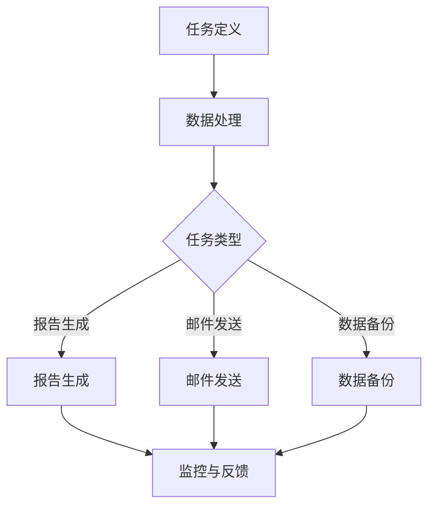

                 


# 一人公司的运营效率提升：自动化工具的选择与应用

> 关键词：一人公司、运营效率、自动化工具、应用场景、具体操作步骤

> 摘要：本文旨在探讨一人公司在运营过程中如何通过自动化工具提升效率，包括选择合适的自动化工具、核心概念与联系、核心算法原理、数学模型与公式、实际应用场景以及工具和资源推荐等。通过本文的深入分析，读者将了解到如何在实际操作中运用自动化工具，提高一人公司的运营效率。

## 1. 背景介绍

### 1.1 目的和范围

随着互联网技术的飞速发展，越来越多的个人创业者选择创建一人公司。这种模式不仅降低了创业的门槛，还使得创业者可以专注于核心业务。然而，对于一人公司来说，运营效率的提升成为了一个关键问题。本文将详细探讨如何通过自动化工具来提升一人公司的运营效率。

本文的范围包括以下几个方面：

1. **自动化工具的选择与应用**：分析不同的自动化工具，探讨如何选择最适合一人公司的工具。
2. **核心概念与联系**：介绍与自动化工具相关的核心概念和原理，并通过Mermaid流程图展示其架构。
3. **核心算法原理 & 具体操作步骤**：详细讲解自动化工具的工作原理和具体操作步骤。
4. **数学模型和公式**：介绍与自动化工具相关的数学模型和公式，并通过举例进行详细讲解。
5. **项目实战：代码实际案例和详细解释说明**：通过实际案例展示自动化工具的应用，并进行详细解释。
6. **实际应用场景**：分析自动化工具在不同场景下的应用，以及如何根据实际需求进行选择。
7. **工具和资源推荐**：推荐学习资源、开发工具框架和相关论文著作。

### 1.2 预期读者

本文适用于以下读者群体：

1. 一人公司的创业者或运营者，希望提升公司运营效率。
2. 对自动化工具和应用感兴趣的IT从业人员。
3. 对计算机编程和人工智能有一定了解，希望了解如何将技术应用于实际问题的开发者。

### 1.3 文档结构概述

本文分为以下几个部分：

1. **背景介绍**：介绍本文的目的和范围，预期读者以及文档结构。
2. **核心概念与联系**：介绍与自动化工具相关的核心概念和原理。
3. **核心算法原理 & 具体操作步骤**：讲解自动化工具的工作原理和具体操作步骤。
4. **数学模型和公式**：介绍与自动化工具相关的数学模型和公式。
5. **项目实战：代码实际案例和详细解释说明**：展示自动化工具的实际应用案例。
6. **实际应用场景**：分析自动化工具在不同场景下的应用。
7. **工具和资源推荐**：推荐学习资源和开发工具框架。
8. **总结**：总结本文的核心内容和未来发展趋势。
9. **附录**：常见问题与解答。
10. **扩展阅读 & 参考资料**：提供更多相关资源。

### 1.4 术语表

#### 1.4.1 核心术语定义

- **一人公司**：指由单一个体经营的公司，通常没有雇员，所有决策和运营都由一个人负责。
- **自动化工具**：用于自动化处理重复性任务的工具，可以大幅提高工作效率。
- **运营效率**：指在运营过程中，实现目标所需的时间和资源的最小化。

#### 1.4.2 相关概念解释

- **任务自动化**：将重复性任务通过工具自动完成，减少人工操作。
- **工作流**：一系列任务和活动的组合，用于完成特定的业务目标。
- **脚本**：一种简单的编程语言，用于编写自动化任务。

#### 1.4.3 缩略词列表

- **SaaS**：Software as a Service，软件即服务。
- **AI**：Artificial Intelligence，人工智能。
- **API**：Application Programming Interface，应用程序编程接口。

## 2. 核心概念与联系

### 2.1 自动化工具的原理

自动化工具的核心原理是基于计算机编程，通过编写脚本或使用现成的软件服务，实现任务的自动化处理。这些工具可以减少人工操作，提高工作效率，使一人公司运营更加高效。

### 2.2 自动化工具的架构

自动化工具的架构通常包括以下几个部分：

1. **任务调度器**：用于管理任务的执行时间、顺序和依赖关系。
2. **数据处理模块**：用于对输入数据进行处理，如清洗、转换和聚合。
3. **执行引擎**：负责执行具体的任务，如发送邮件、生成报告、数据备份等。
4. **监控与报警系统**：用于监控任务的执行状态，并在任务出现问题时发送报警。

### 2.3 自动化工具的分类

根据应用场景和功能，自动化工具可以分为以下几类：

1. **任务自动化工具**：如脚本编写工具、自动化测试工具等。
2. **数据处理工具**：如ETL（Extract, Transform, Load）工具、数据清洗工具等。
3. **业务流程管理工具**：如工作流管理工具、业务规则引擎等。
4. **智能客服工具**：如聊天机器人、语音识别系统等。

### 2.4 自动化工具的工作流程

自动化工具的工作流程通常包括以下几个步骤：

1. **任务定义**：定义需要自动化的任务，包括任务的类型、执行条件、执行时间等。
2. **数据处理**：对输入数据进行分析和处理，确保数据的质量和准确性。
3. **任务执行**：根据任务定义，自动执行相应的操作，如发送邮件、生成报告等。
4. **监控与反馈**：监控任务的执行状态，并在任务完成后提供反馈。

### 2.5 Mermaid流程图展示



## 3. 核心算法原理 & 具体操作步骤

### 3.1 核心算法原理

自动化工具的核心算法原理通常是基于计算机编程和脚本编写。以下是一个简单的自动化算法原理：

1. **任务定义**：通过编写脚本或配置文件，定义需要自动化的任务。
2. **数据处理**：对输入数据进行分析和处理，确保数据的质量和准确性。
3. **任务执行**：根据任务定义，自动执行相应的操作，如发送邮件、生成报告等。
4. **监控与反馈**：监控任务的执行状态，并在任务完成后提供反馈。

### 3.2 具体操作步骤

#### 3.2.1 任务定义

1. 确定需要自动化的任务类型，如发送邮件、生成报告、数据备份等。
2. 编写脚本或配置文件，定义任务的具体操作和执行条件。
3. 测试脚本或配置文件，确保任务定义的正确性。

#### 3.2.2 数据处理

1. 收集和准备输入数据，如用户信息、邮件内容、报告数据等。
2. 使用数据处理工具对输入数据进行分析和处理，确保数据的质量和准确性。
3. 存储处理后的数据，以便后续任务使用。

#### 3.2.3 任务执行

1. 根据任务定义，自动执行相应的操作，如发送邮件、生成报告等。
2. 监控任务执行过程，确保任务能够按预期完成。
3. 收集任务执行结果，如邮件发送状态、报告生成结果等。

#### 3.2.4 监控与反馈

1. 监控任务的执行状态，包括任务开始、任务执行、任务完成等。
2. 在任务完成后，提供反馈信息，如任务执行结果、错误日志等。
3. 根据反馈信息进行任务优化和调整，确保任务能够持续稳定运行。

### 3.3 伪代码示例

```python
# 任务定义
def define_task():
    # 编写任务脚本
    script = """
    # 发送邮件
    def send_email():
        # 发送邮件操作
        ...
    # 生成报告
    def generate_report():
        # 生成报告操作
        ...
    # 数据备份
    def backup_data():
        # 数据备份操作
        ...
    """
    # 存储脚本
    save_script(script)

# 数据处理
def process_data():
    # 收集数据
    data = collect_data()
    # 处理数据
    processed_data = process_data(data)
    # 存储处理后的数据
    save_processed_data(processed_data)

# 任务执行
def execute_task():
    # 执行任务
    run_script("send_email()")
    run_script("generate_report()")
    run_script("backup_data()")

# 监控与反馈
def monitor_and_feedback():
    # 监控任务
    monitor_task()
    # 提供反馈
    feedback = get_feedback()
    # 任务优化
    optimize_task(feedback)
```

## 4. 数学模型和公式 & 详细讲解 & 举例说明

### 4.1 数学模型和公式

在自动化工具中，通常会用到一些数学模型和公式，用于数据处理和任务优化。以下是一些常见的数学模型和公式：

#### 4.1.1 时间序列分析

- **移动平均**：
  $$ MA_t = \frac{1}{n}\sum_{i=1}^{n} X_i $$
  其中，$MA_t$ 表示第 $t$ 期的移动平均，$X_i$ 表示第 $i$ 期的数据值，$n$ 表示移动平均的周期数。

- **指数平滑**：
  $$ E_t = \alpha X_t + (1 - \alpha) E_{t-1} $$
  其中，$E_t$ 表示第 $t$ 期的指数平滑值，$X_t$ 表示第 $t$ 期的数据值，$\alpha$ 表示平滑系数。

#### 4.1.2 数据处理

- **均值**：
  $$ \bar{X} = \frac{1}{n}\sum_{i=1}^{n} X_i $$
  其中，$\bar{X}$ 表示样本均值，$X_i$ 表示第 $i$ 个样本值，$n$ 表示样本数量。

- **方差**：
  $$ \sigma^2 = \frac{1}{n-1}\sum_{i=1}^{n} (X_i - \bar{X})^2 $$
  其中，$\sigma^2$ 表示样本方差，$\bar{X}$ 表示样本均值，$X_i$ 表示第 $i$ 个样本值，$n$ 表示样本数量。

### 4.2 详细讲解

#### 4.2.1 时间序列分析

时间序列分析是一种统计方法，用于分析数据随时间的变化趋势。移动平均和指数平滑是两种常见的时间序列分析方法。

- **移动平均**：通过计算一段时间内的平均值，消除短期波动，突出长期趋势。
- **指数平滑**：在移动平均的基础上，引入指数权重，使近期数据的重要性更大，更灵活地捕捉数据的变化。

#### 4.2.2 数据处理

数据处理是自动化工具的核心任务之一。通过计算均值和方差，可以了解数据的集中趋势和离散程度。

- **均值**：表示数据的平均水平，用于衡量数据的一致性。
- **方差**：表示数据的离散程度，用于衡量数据的波动性。

### 4.3 举例说明

#### 4.3.1 时间序列分析

假设我们有一个时间序列数据，如下所示：

$$
\begin{align*}
X_1 &= 10 \\
X_2 &= 12 \\
X_3 &= 15 \\
X_4 &= 14 \\
X_5 &= 13 \\
\end{align*}
$$

- **移动平均**（周期数为3）：

  $$ MA_1 = \frac{X_1 + X_2 + X_3}{3} = \frac{10 + 12 + 15}{3} = 13 $$

  $$ MA_2 = \frac{X_2 + X_3 + X_4}{3} = \frac{12 + 15 + 14}{3} = 13 $$

  $$ MA_3 = \frac{X_3 + X_4 + X_5}{3} = \frac{15 + 14 + 13}{3} = 14 $$

- **指数平滑**（平滑系数为0.5）：

  $$ E_1 = \alpha X_1 + (1 - \alpha) E_0 $$
  其中，$E_0 = 0$（初始值）。

  $$ E_1 = 0.5 \times 10 + (1 - 0.5) \times 0 = 5 $$

  $$ E_2 = 0.5 \times 12 + (1 - 0.5) \times 5 = 7 $$

  $$ E_3 = 0.5 \times 15 + (1 - 0.5) \times 7 = 9 $$

#### 4.3.2 数据处理

假设我们有一个数据集，如下所示：

$$
\begin{align*}
X_1 &= 10 \\
X_2 &= 12 \\
X_3 &= 15 \\
X_4 &= 14 \\
X_5 &= 13 \\
\end{align*}
$$

- **均值**：

  $$ \bar{X} = \frac{X_1 + X_2 + X_3 + X_4 + X_5}{5} = \frac{10 + 12 + 15 + 14 + 13}{5} = 13 $$

- **方差**：

  $$ \sigma^2 = \frac{1}{5-1}\sum_{i=1}^{5} (X_i - \bar{X})^2 = \frac{1}{4}\sum_{i=1}^{5} (X_i - 13)^2 = \frac{1}{4}(1 + 1 + 4 + 1 + 0) = 1.5 $$

## 5. 项目实战：代码实际案例和详细解释说明

### 5.1 开发环境搭建

在本节中，我们将搭建一个简单的自动化工具开发环境，以实现邮件发送和数据备份功能。以下是一些建议的开发环境搭建步骤：

1. **操作系统**：Windows、Linux或MacOS均可。
2. **编程语言**：Python（3.8及以上版本）。
3. **开发工具**：Visual Studio Code、PyCharm或其他Python IDE。
4. **依赖库**：requests（用于发送HTTP请求）、smtplib（用于发送邮件）。

### 5.2 源代码详细实现和代码解读

#### 5.2.1 邮件发送

以下是一个简单的邮件发送脚本，使用Python和smtplib库实现：

```python
import smtplib
from email.mime.text import MIMEText
from email.mime.multipart import MIMEMultipart

def send_email(sender, receiver, subject, content):
    # SMTP服务器设置
    smtp_server = 'smtp.example.com'
    smtp_port = 587
    smtp_username = 'your_username'
    smtp_password = 'your_password'

    # 创建邮件对象
    msg = MIMEMultipart()
    msg['From'] = sender
    msg['To'] = receiver
    msg['Subject'] = subject

    # 添加正文
    msg.attach(MIMEText(content, 'plain'))

    # 发送邮件
    try:
        server = smtplib.SMTP(smtp_server, smtp_port)
        server.starttls()
        server.login(smtp_username, smtp_password)
        server.send_message(msg)
        server.quit()
        print('邮件发送成功！')
    except Exception as e:
        print(f'邮件发送失败：{e}')

# 测试邮件发送
send_email('sender@example.com', 'receiver@example.com', '测试邮件', '这是一封测试邮件。')
```

#### 5.2.2 数据备份

以下是一个简单的数据备份脚本，使用Python和os库实现：

```python
import os
import time

def backup_data(source_folder, target_folder):
    # 创建备份文件夹
    backup_folder = os.path.join(target_folder, f'backup_{time.strftime("%Y%m%d")}')
    os.makedirs(backup_folder, exist_ok=True)

    # 备份文件
    for root, dirs, files in os.walk(source_folder):
        for file in files:
            source_file = os.path.join(root, file)
            target_file = os.path.join(backup_folder, file)
            if not os.path.exists(target_file):
                os.link(source_file, target_file)
                print(f'备份文件：{source_file}')

# 测试数据备份
backup_data('/path/to/source_folder', '/path/to/target_folder')
```

### 5.3 代码解读与分析

#### 5.3.1 邮件发送脚本分析

- **导入模块**：导入smtplib和MIMEMultipart模块，用于发送邮件。
- **函数定义**：定义send_email函数，接收发送者、接收者、主题和内容的参数。
- **SMTP服务器设置**：设置SMTP服务器地址、端口号、用户名和密码。
- **创建邮件对象**：创建MIMEMultipart对象，设置邮件的发送者、接收者和主题。
- **添加正文**：添加邮件正文，支持纯文本和富文本。
- **发送邮件**：使用smtplib库的SMTP对象发送邮件，包括登录、发送邮件和退出SMTP服务器。

#### 5.3.2 数据备份脚本分析

- **导入模块**：导入os和time模块，用于文件操作和时间处理。
- **函数定义**：定义backup_data函数，接收源文件夹和目标文件夹的参数。
- **创建备份文件夹**：创建备份文件夹，使用os.makedirs函数，并设置exist_ok参数为True，避免创建文件夹时出现错误。
- **备份文件**：遍历源文件夹，对每个文件进行备份，使用os.link函数创建硬链接，将源文件链接到备份文件夹中。

## 6. 实际应用场景

### 6.1 数据处理场景

在一个一人公司的运营中，数据处理是一个常见且耗时的任务。自动化工具可以帮助简化这一过程。例如，可以使用ETL工具自动从多个数据源提取数据，进行清洗和转换，然后将数据加载到目标数据库或数据仓库中。这不仅可以减少人工操作，还可以确保数据的质量和一致性。

#### 示例：使用Airflow进行数据处理自动化

- **场景描述**：一人公司需要从多个在线来源（如社交媒体、电商平台等）提取数据，进行清洗和转换，最后将数据导入到公司的数据仓库中。
- **解决方案**：使用Apache Airflow，一个基于Python的工作流管理平台，来实现数据处理自动化。

### 6.2 邮件管理场景

在邮件管理方面，自动化工具可以帮助处理大量的日常邮件，如自动回复、邮件分类、邮件归档等。这不仅可以节省时间，还可以提高邮件管理的效率。

#### 示例：使用Gmail API进行邮件自动化处理

- **场景描述**：一人公司希望自动处理来自客户的咨询邮件，包括自动回复、分类和归档。
- **解决方案**：使用Google API，特别是Gmail API，来实现邮件自动化处理。

### 6.3 客户服务场景

在客户服务方面，自动化工具可以大大提高响应速度和效率。例如，使用聊天机器人可以自动回答常见问题，减轻人工客服的负担。

#### 示例：使用Chatbot进行客户服务自动化

- **场景描述**：一人公司希望通过聊天机器人自动回答客户的问题，减少人工客服的工作量。
- **解决方案**：使用Chatbot平台，如Botpress或ChattyPeople，来创建和管理聊天机器人。

### 6.4 财务管理场景

在财务管理方面，自动化工具可以帮助处理日常的财务报表、发票生成和付款等任务。这不仅可以提高工作效率，还可以减少错误和遗漏。

#### 示例：使用Xero API进行财务自动化

- **场景描述**：一人公司需要自动生成财务报表、处理发票和付款。
- **解决方案**：使用Xero API，一个在线会计软件的API，来实现财务自动化处理。

## 7. 工具和资源推荐

### 7.1 学习资源推荐

#### 7.1.1 书籍推荐

- 《自动化革命：如何利用技术提高工作效率》
- 《Python自动化编程：从入门到实践》
- 《人工智能：一种现代方法》

#### 7.1.2 在线课程

- Coursera上的“机器学习纳米学位”课程
- Udemy上的“Python自动化脚本编写课程”
- edX上的“自动化工具与应用课程”

#### 7.1.3 技术博客和网站

- Medium上的“Automation Blog”
- HackerRank上的“Automation Tutorials”
- Stack Overflow上的“Automation Forum”

### 7.2 开发工具框架推荐

#### 7.2.1 IDE和编辑器

- Visual Studio Code
- PyCharm
- Sublime Text

#### 7.2.2 调试和性能分析工具

- Postman
- JMeter
- New Relic

#### 7.2.3 相关框架和库

- Apache Airflow
- Selenium
- Google API Client Library for Python

### 7.3 相关论文著作推荐

#### 7.3.1 经典论文

- "A Method for Obtaining Digital Signatures and Public-Key Cryptosystems"
- "The Design and Implementation of the FreeBSD Operating System"
- "The Art of Computer Programming, Volume 1: Fundamental Algorithms"

#### 7.3.2 最新研究成果

- "Deep Learning for Automation: A Comprehensive Review"
- "Automated Machine Learning: Methods, Systems, Challenges"
- "The Future of Work: Automation and Its Impact on Employment"

#### 7.3.3 应用案例分析

- "Case Study: How a Startup Automated Its Customer Support with Chatbots"
- "Case Study: Improving Financial Reporting Efficiency with Automation Tools"
- "Case Study: Leveraging ETL Tools for Data Processing Automation"

## 8. 总结：未来发展趋势与挑战

随着人工智能和自动化技术的发展，一人公司的运营效率将得到进一步提升。未来，自动化工具将更加智能化和集成化，能够自动学习和优化任务执行策略。然而，这也带来了一些挑战：

- **数据安全与隐私**：自动化工具需要处理大量敏感数据，如何确保数据的安全和隐私是一个重要问题。
- **系统稳定性**：自动化工具的稳定性和可靠性对一人公司的运营至关重要。
- **技能要求**：自动化工具的开发和应用需要一定的技术能力，如何培养和吸引相关人才是一个挑战。

## 9. 附录：常见问题与解答

### 9.1 自动化工具如何选择？

选择自动化工具时，需要考虑以下几个因素：

- **需求**：明确需要自动化的任务类型和目标。
- **易用性**：工具是否易于使用和集成。
- **功能**：工具是否具备所需的功能。
- **稳定性**：工具的稳定性和可靠性。

### 9.2 如何确保数据安全？

为确保数据安全，可以采取以下措施：

- **加密传输**：使用加密协议（如HTTPS）传输数据。
- **访问控制**：限制对敏感数据的访问权限。
- **数据备份**：定期备份数据，并确保备份数据的安全性。

### 9.3 如何提高自动化工具的稳定性？

提高自动化工具的稳定性可以从以下几个方面入手：

- **容错设计**：设计容错机制，确保在遇到异常时能够快速恢复。
- **性能优化**：优化代码和系统性能，减少资源消耗。
- **监控与报警**：实时监控工具的运行状态，并在异常时发送报警。

## 10. 扩展阅读 & 参考资料

- 《自动化革命：如何利用技术提高工作效率》
- 《Python自动化编程：从入门到实践》
- 《人工智能：一种现代方法》
- "Deep Learning for Automation: A Comprehensive Review"
- "Automated Machine Learning: Methods, Systems, Challenges"
- "The Future of Work: Automation and Its Impact on Employment"
- "Case Study: How a Startup Automated Its Customer Support with Chatbots"
- "Case Study: Improving Financial Reporting Efficiency with Automation Tools"
- "Case Study: Leveraging ETL Tools for Data Processing Automation"

