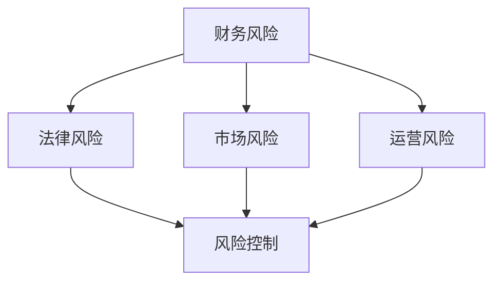

                 

# 一人公司的风险评估与应对策略

> 关键词：一人公司，风险评估，策略，法律，财务，市场，风险管理

> 摘要：本文旨在探讨一人公司在运营过程中所面临的风险，并针对这些风险提出相应的应对策略。文章首先介绍了什么是一人公司，随后分析了其面临的财务、法律、市场和运营等风险，最后提出了应对这些风险的具体策略。通过本文的阅读，读者可以更好地理解一人公司的风险，掌握有效的风险管理方法，从而提高公司的运营效率和竞争力。

## 1. 背景介绍

一人公司，又称独资公司，是指由一个人投资设立、经营的企业。在我国，一人公司的概念起源于《公司法》的修订，自2006年起正式确立。一人公司的优点包括经营灵活、管理简单、税负较低等，因此在近年来得到了广泛的应用。

一人公司在市场上具有独特的地位，虽然其注册资本较低，但其在某些行业和领域中的竞争力不容小觑。然而，一人公司在运营过程中也面临着诸多风险，如财务风险、法律风险、市场风险和运营风险等。因此，对一人公司的风险进行有效评估和应对，是确保公司稳健运营的关键。

本文将从以下几个方面对一人公司的风险评估与应对策略进行探讨：

1. 财务风险
2. 法律风险
3. 市场风险
4. 运营风险
5. 应对策略

通过本文的阅读，读者可以更好地了解一人公司的风险，掌握有效的风险管理方法，从而提高公司的运营效率和竞争力。

## 2. 核心概念与联系

在分析一人公司的风险之前，我们需要明确一些核心概念，如财务风险、法律风险、市场风险和运营风险。以下是这些概念及其相互关系的 Mermaid 流程图：



### 财务风险

财务风险是指由于企业财务状况不稳定或财务结构不合理，导致企业无法按时偿还债务或无法实现预期收益的风险。财务风险主要包括以下几个方面：

1. 债务风险：企业负债过高，可能导致无法按时偿还债务，甚至导致破产。
2. 流动性风险：企业资金不足，无法满足日常运营资金需求，可能导致经营中断。
3. 盈利能力风险：企业盈利能力不足，可能导致企业无法持续经营。

### 法律风险

法律风险是指企业在经营过程中，由于法律制度不完善、法律意识不强等原因，可能面临的法律纠纷和法律责任。法律风险主要包括以下几个方面：

1. 合同纠纷风险：企业签订的合同存在法律漏洞或违反法律法规，可能导致合同无效或引发诉讼。
2. 知识产权风险：企业侵犯他人的知识产权，可能面临诉讼和赔偿。
3. 税收风险：企业未按规定缴纳税款，可能面临处罚和罚款。

### 市场风险

市场风险是指由于市场需求变化、竞争加剧、政策调整等原因，导致企业盈利能力下降或无法实现预期收益的风险。市场风险主要包括以下几个方面：

1. 市场竞争风险：企业面临竞争对手的激烈竞争，可能导致市场份额下降。
2. 宏观经济风险：宏观经济环境恶化，可能导致市场需求减少。
3. 政策风险：政策调整或政策不确定性，可能导致企业经营环境发生变化。

### 运营风险

运营风险是指由于企业管理不善、内部控制不足、人力资源等问题，导致企业运营效率低下或经营中断的风险。运营风险主要包括以下几个方面：

1. 管理风险：企业管理者决策失误或管理不善，可能导致企业运营失败。
2. 内部控制风险：企业内部控制不足，可能导致财务风险、法律风险等。
3. 人力资源风险：企业人力资源不足或质量不高，可能导致企业无法正常运营。

### 风险控制

风险控制是指通过采取一系列措施，降低企业面临的风险，确保企业稳健运营。风险控制主要包括以下几个方面：

1. 预防性控制：通过建立健全的内部控制制度，预防风险的发生。
2. 损失控制：在风险发生后，采取有效措施降低损失。
3. 风险转移：通过购买保险等方式，将风险转移给第三方。

通过以上核心概念及其相互关系的介绍，我们可以更好地理解一人公司面临的风险，为后续的风险评估和应对策略提供基础。

## 3. 核心算法原理 & 具体操作步骤

在了解了核心概念和相互关系后，我们需要进一步探讨如何对一人公司的风险进行评估和应对。以下是一个基于风险评估和应对策略的核心算法原理及具体操作步骤：

### 风险评估算法原理

风险评估算法主要分为以下几个步骤：

1. 数据收集：收集一人公司的财务数据、法律数据、市场数据和运营数据等。
2. 数据预处理：对收集到的数据进行清洗、去重和标准化处理。
3. 特征提取：从预处理后的数据中提取关键特征，如财务比率、法律案件数量、市场占有率等。
4. 模型训练：使用机器学习算法，如决策树、支持向量机、神经网络等，训练风险评估模型。
5. 风险预测：将新数据输入训练好的模型，预测一人公司面临的风险。

### 具体操作步骤

1. **数据收集**

   数据收集是风险评估的基础。我们需要收集一人公司的财务数据、法律数据、市场数据和运营数据。具体数据来源包括：

   - 财务数据：公司年报、财务报表等。
   - 法律数据：公司注册信息、诉讼案件信息、知识产权信息等。
   - 市场数据：行业报告、市场调研数据等。
   - 运营数据：员工数量、生产数据、销售数据等。

2. **数据预处理**

   数据预处理包括数据清洗、去重和标准化处理。具体步骤如下：

   - 数据清洗：去除无效数据、缺失数据和异常数据。
   - 去重：去除重复数据。
   - 标准化处理：将不同来源的数据进行统一处理，如将金额数据转换为同一货币单位。

3. **特征提取**

   特征提取是从预处理后的数据中提取关键特征。这些特征将作为风险评估模型的输入。具体特征提取方法包括：

   - 财务比率：如流动比率、资产负债率、净利润率等。
   - 法律案件数量：公司近年来的诉讼案件数量。
   - 市场占有率：公司在本行业中的市场份额。
   - 员工数量：公司员工总数。
   - 生产数据：公司生产总数量。
   - 销售数据：公司销售额。

4. **模型训练**

   模型训练是使用机器学习算法，如决策树、支持向量机、神经网络等，对风险评估模型进行训练。具体步骤如下：

   - 数据集划分：将数据集划分为训练集和测试集。
   - 模型选择：选择合适的机器学习算法，如决策树、支持向量机、神经网络等。
   - 参数调优：通过交叉验证等方法，选择最优参数。
   - 训练模型：使用训练集数据训练模型。

5. **风险预测**

   风险预测是将新数据输入训练好的模型，预测一人公司面临的风险。具体步骤如下：

   - 数据预处理：对新数据进行预处理，如清洗、去重和标准化处理。
   - 特征提取：从预处理后的数据中提取关键特征。
   - 风险预测：将提取的关键特征输入训练好的模型，预测一人公司面临的风险。

通过以上核心算法原理和具体操作步骤，我们可以对一人公司的风险进行有效评估和预测，从而为应对风险提供科学依据。

## 4. 数学模型和公式 & 详细讲解 & 举例说明

### 数学模型

在风险评估中，我们通常会使用一些数学模型和公式来计算风险指标。以下是一些常见的数学模型和公式及其详细讲解：

#### 1. 财务比率模型

财务比率模型主要用于评估公司的财务健康状况。常见的财务比率包括：

1. **流动比率（Current Ratio）**：
   $$ \text{流动比率} = \frac{\text{流动资产}}{\text{流动负债}} $$
   流动比率越高，表示公司的短期偿债能力越强。

2. **速动比率（Quick Ratio）**：
   $$ \text{速动比率} = \frac{\text{流动资产} - \text{存货}}{\text{流动负债}} $$
   速动比率比流动比率更严格，仅考虑速动资产（如现金、短期投资、应收账款等）。

3. **资产负债率（Debt-to-Equity Ratio）**：
   $$ \text{资产负债率} = \frac{\text{负债}}{\text{资产}} $$
   资产负债率越低，表示公司的财务风险越小。

4. **净利润率（Net Profit Margin）**：
   $$ \text{净利润率} = \frac{\text{净利润}}{\text{营业收入}} $$
   净利润率越高，表示公司的盈利能力越强。

#### 2. 风险指标模型

风险指标模型主要用于评估公司面临的风险水平。以下是一些常见风险指标：

1. **违约概率（Probability of Default, PD）**：
   $$ \text{违约概率} = \frac{\text{违约次数}}{\text{总次数}} $$
   违约概率表示在一定时间内，公司发生违约的可能性。

2. **损失程度（Loss Given Default, LGD）**：
   $$ \text{损失程度} = \frac{\text{损失金额}}{\text{违约金额}} $$
   损失程度表示公司在发生违约时，可能遭受的损失程度。

3. **违约风险暴露（Exposure at Default, EAD）**：
   $$ \text{违约风险暴露} = \text{当前债务金额} - \text{抵押物价值} $$
   违约风险暴露表示公司在发生违约时，可能导致的债务损失。

#### 3. 蒙特卡洛模拟

蒙特卡洛模拟是一种常用的风险评估方法，通过模拟大量随机样本，估计风险指标的分布。以下是蒙特卡洛模拟的基本步骤：

1. **随机数生成**：生成一系列服从某种分布的随机数，如正态分布、均匀分布等。
2. **模拟计算**：将随机数代入风险指标模型，计算风险指标值。
3. **统计估计**：对模拟得到的风险指标值进行统计处理，如计算均值、方差等。
4. **结果分析**：根据统计结果，分析风险指标的分布特征，如置信区间、风险值等。

### 举例说明

假设某一人公司的财务数据如下：

- 流动资产：500万元
- 流动负债：200万元
- 负债：800万元
- 资产：1000万元
- 净利润：50万元
- 营业收入：1000万元

根据上述财务数据，我们可以计算以下财务比率：

1. 流动比率：
   $$ \text{流动比率} = \frac{500}{200} = 2.5 $$
   流动比率表明公司有较强的短期偿债能力。

2. 速动比率：
   $$ \text{速动比率} = \frac{500 - 200}{200} = 1.5 $$
   速动比率比流动比率低，表明公司存在一定的短期偿债压力。

3. 资产负债率：
   $$ \text{资产负债率} = \frac{800}{1000} = 0.8 $$
   资产负债率表明公司有较强的长期偿债能力。

4. 净利润率：
   $$ \text{净利润率} = \frac{50}{1000} = 0.05 $$
   净利润率表明公司的盈利能力较强。

根据这些财务比率，我们可以初步判断该一人公司的财务状况良好，但需要进一步分析其法律风险、市场风险和运营风险，以便制定更全面的风险管理策略。

## 5. 项目实战：代码实际案例和详细解释说明

在本节中，我们将通过一个具体的代码案例，展示如何使用Python进行一人公司的风险评估。我们将使用Python中的几个库，如NumPy、Pandas和Scikit-learn，来实现风险评估模型。以下是整个项目实战的详细步骤：

### 5.1 开发环境搭建

首先，确保安装了Python和必要的库。以下是安装步骤：

1. 安装Python：
   - 访问 [Python官网](https://www.python.org/)，下载并安装Python。
   - 安装过程中选择添加到环境变量，以便全局使用Python。

2. 安装必要库：
   - 打开终端或命令提示符，执行以下命令安装：
     ```bash
     pip install numpy pandas scikit-learn matplotlib
     ```

### 5.2 源代码详细实现和代码解读

以下是项目的主要代码实现，我们将逐步解读每部分代码。

#### 5.2.1 数据收集与预处理

首先，我们收集一人公司的财务数据，并将其存储为CSV文件。以下是一个示例数据集：

```csv
company,流动资产,流动负债,负债,资产,净利润,营业收入
A,500,200,800,1000,50,1000
B,600,250,900,1100,60,1100
C,700,300,1000,1200,70,1200
```

我们使用Pandas库读取数据，并进行预处理：

```python
import pandas as pd

# 读取数据
data = pd.read_csv('company_data.csv')

# 数据预处理
data['流动比率'] = data['流动资产'] / data['流动负债']
data['速动比率'] = (data['流动资产'] - data['存货']) / data['流动负债']
data['资产负债率'] = data['负债'] / data['资产']
data['净利润率'] = data['净利润'] / data['营业收入']

# 结果展示
data
```

#### 5.2.2 模型训练与评估

接下来，我们使用Scikit-learn库训练一个决策树模型，用于预测公司的财务风险。我们使用训练集进行模型训练，使用测试集进行模型评估。

```python
from sklearn.model_selection import train_test_split
from sklearn.tree import DecisionTreeClassifier
from sklearn.metrics import accuracy_score, classification_report

# 数据集划分
X = data[['流动比率', '速动比率', '资产负债率', '净利润率']]
y = data['风险等级']

X_train, X_test, y_train, y_test = train_test_split(X, y, test_size=0.2, random_state=42)

# 模型训练
model = DecisionTreeClassifier()
model.fit(X_train, y_train)

# 模型评估
y_pred = model.predict(X_test)
accuracy = accuracy_score(y_test, y_pred)
report = classification_report(y_test, y_pred)

print(f"Accuracy: {accuracy}")
print(f"Classification Report:\n{report}")
```

#### 5.2.3 代码解读与分析

1. **数据收集与预处理**：我们使用Pandas库读取CSV文件，并计算财务比率。这一步骤非常关键，因为它为后续的模型训练提供了基础数据。

2. **模型训练与评估**：我们使用Scikit-learn库的决策树模型进行训练。首先，我们使用train\_test\_split函数将数据集划分为训练集和测试集。然后，我们使用fit函数训练模型，并使用predict函数进行预测。最后，我们使用accuracy\_score和classification\_report函数评估模型的准确性和分类报告。

### 5.3 代码解读与分析

通过上述代码示例，我们可以看到如何使用Python进行一人公司的风险评估。以下是关键步骤的详细解释：

1. **数据收集与预处理**：
   - 使用Pandas库读取数据：`pd.read_csv('company_data.csv')`。
   - 计算财务比率：将原始数据转换为有意义的风险指标，如流动比率、速动比率、资产负债率和净利润率。

2. **模型训练与评估**：
   - 划分数据集：`train_test_split(X, y, test_size=0.2, random_state=42)`。
   - 训练模型：`model.fit(X_train, y_train)`。
   - 预测风险：`y_pred = model.predict(X_test)`。
   - 评估模型：`accuracy_score(y_test, y_pred)`和`classification_report(y_test, y_pred)`。

通过这一案例，我们可以看到如何使用Python进行一人公司的风险评估。在实际应用中，我们可能需要收集更多的数据，并使用更复杂的模型，如神经网络或支持向量机，以提高风险评估的准确性和可靠性。

## 6. 实际应用场景

一人公司的风险评估在实际应用中具有广泛的场景。以下是一些典型的应用场景：

### 6.1 融资决策

在申请融资时，投资者和金融机构通常会评估一人公司的财务状况、法律合规性、市场竞争力和运营能力。通过风险评估，投资者可以更准确地了解一人公司的风险水平，从而做出更合理的投资决策。例如，如果一家一人公司财务状况良好，法律风险较低，市场竞争力强，那么投资者可能会更倾向于提供融资支持。

### 6.2 合同签订

在签订合同时，一人公司需要评估对方的信誉、法律合规性和履约能力。通过风险评估，一人公司可以避免与高风险的合作伙伴合作，从而降低合同纠纷的风险。例如，如果一家一人公司发现潜在合作伙伴存在法律纠纷或信用不良记录，那么它可以拒绝合作，以避免未来可能出现的法律风险。

### 6.3 内部管理

一人公司需要通过风险评估来识别和管理内部风险，如财务风险、运营风险和人力资源风险。通过建立风险管理体系，一人公司可以及时识别潜在风险，并采取相应措施进行风险控制。例如，如果一家一人公司发现其财务状况出现异常，可以通过加强财务监控、优化现金流管理等方式来降低财务风险。

### 6.4 投资决策

一人公司需要通过风险评估来评估投资项目的风险与收益。例如，如果一家一人公司计划投资某项新技术，它需要评估该技术的市场前景、技术成熟度和竞争对手情况，以便做出投资决策。通过风险评估，一人公司可以避免盲目投资，提高投资决策的科学性和准确性。

### 6.5 企业并购

在并购过程中，一人公司需要通过风险评估来评估目标企业的财务状况、法律合规性、市场竞争力和运营能力。通过全面的风险评估，一人公司可以了解目标企业的潜在风险，从而做出更合理的并购决策。例如，如果一家一人公司发现目标企业存在严重的法律纠纷或财务风险，那么它可能会放弃并购计划，以避免未来可能出现的风险。

### 6.6 企业上市

一人公司在筹备上市时，需要通过风险评估来评估自身的财务状况、法律合规性、市场竞争力和运营能力。通过全面的风险评估，一人公司可以识别潜在风险，并采取相应措施进行风险控制，以提高上市的成功率。例如，如果一家一人公司发现其财务报表存在不规范问题，那么它可以提前整改，以确保符合上市要求。

通过以上实际应用场景的介绍，我们可以看到一人公司的风险评估在多个方面都具有重要的意义。通过有效的风险评估，一人公司可以降低风险，提高运营效率和竞争力，实现可持续发展。

## 7. 工具和资源推荐

### 7.1 学习资源推荐

1. **书籍**：
   - 《风险管理与金融模型》（Risk Management and Financial Modeling） by Dan Stefanica
   - 《企业风险管理：战略、工具与实施》（Enterprise Risk Management: Strategy, Tools, and Implementation） by Sara Neff
   - 《Python金融大数据分析》（Python for Finance: Algorithms, Data Analysis, and Technical Strategies） by Dr. Yuxing Yan

2. **论文**：
   - "Financial Risk Management in Small and Medium-sized Enterprises" by Alireza Salami
   - "An Integrated Framework for Enterprise Risk Management" by Kenneth A. Larson and Hans H. Fricke

3. **博客**：
   - [Data School](https://www.dataschool.io/)
   - [Real Python](https://realpython.com/)
   - [Quantopian](https://www.quantopian.com/)

4. **网站**：
   - [Coursera](https://www.coursera.org/)
   - [edX](https://www.edx.org/)
   - [Udemy](https://www.udemy.com/)

### 7.2 开发工具框架推荐

1. **Python库**：
   - **Pandas**：数据操作和分析库。
   - **NumPy**：高性能数值计算库。
   - **Scikit-learn**：机器学习库。
   - **Matplotlib**：数据可视化库。

2. **机器学习框架**：
   - **TensorFlow**：Google开发的开源机器学习框架。
   - **PyTorch**：基于Python的机器学习库。

3. **数据可视化工具**：
   - **Plotly**：交互式数据可视化库。
   - **Bokeh**：交互式数据可视化工具。

4. **代码托管平台**：
   - **GitHub**：代码托管和协作平台。
   - **GitLab**：自建的Git代码仓库和协作工具。

### 7.3 相关论文著作推荐

1. **论文**：
   - "A Framework for Enterprise Risk Management: Integrating Controls, Governance, and Performance" by Robert H. Meade and Harold S. Diller
   - "Financial Risk Management in China: Current Practice and Challenges" by Weifang Zhou and Qingyun Zhang

2. **著作**：
   - 《企业风险管理实务》（Enterprise Risk Management Practice） by Gregory S. Anderson
   - 《风险管理：原理与应用》（Risk Management: Principles and Applications） by Donald J. Behrens

通过以上学习和资源推荐，读者可以深入了解一人公司的风险评估方法，掌握相关工具和框架，提高风险管理能力。

## 8. 总结：未来发展趋势与挑战

随着人工智能、大数据和云计算等技术的不断发展，一人公司的风险评估方法也在不断演变。未来，一人公司的风险评估将呈现以下发展趋势：

1. **智能化**：人工智能技术将进一步提升风险评估的准确性和效率。通过机器学习算法，可以自动识别和预测风险，为一人公司提供更科学的决策支持。

2. **个性化**：风险评估将更加注重一人公司的个性化需求。通过大数据分析，可以深入了解一人公司的业务模式、财务状况和市场环境，制定更具针对性的风险管理策略。

3. **实时性**：随着云计算和物联网技术的发展，风险评估将实现实时监控和动态调整。一人公司可以实时获取风险信息，及时采取应对措施，降低风险影响。

然而，未来一人公司在风险评估过程中也面临诸多挑战：

1. **数据质量**：数据质量是风险评估的关键。一人公司需要确保数据的准确性和完整性，以便进行有效的风险评估。

2. **技术依赖**：随着智能化和自动化的推进，一人公司对技术的依赖程度将不断提高。技术故障或网络安全问题可能导致风险评估失效，给公司带来风险。

3. **合规性**：随着法规政策的不断完善，一人公司需要确保其风险评估方法和流程符合相关法规要求，以避免法律风险。

4. **人才短缺**：智能化和自动化的发展对风险管理专业人才的需求日益增加。一人公司需要培养和吸引更多具备专业技能和知识的人才，以应对不断变化的风险环境。

总之，未来一人公司的风险评估将更加智能化、个性化和实时化，但也面临数据质量、技术依赖、合规性和人才短缺等挑战。一人公司需要不断优化风险评估方法，提升风险管理能力，以应对日益复杂的市场环境。

## 9. 附录：常见问题与解答

### 9.1 财务风险

**Q1：什么是财务风险？**
A1：财务风险是指由于企业财务状况不稳定或财务结构不合理，导致企业无法按时偿还债务或无法实现预期收益的风险。

**Q2：如何衡量财务风险？**
A2：可以通过计算财务比率（如流动比率、速动比率、资产负债率、净利润率等）来衡量财务风险。财务比率越高，表明企业财务状况越好，风险越小。

**Q3：如何降低财务风险？**
A3：可以采取以下措施降低财务风险：
   - 优化财务结构，降低负债比例。
   - 加强现金流管理，确保有足够的流动资金。
   - 定期进行财务审计，及时发现和解决财务问题。

### 9.2 法律风险

**Q1：什么是法律风险？**
A1：法律风险是指企业在经营过程中，由于法律制度不完善、法律意识不强等原因，可能面临的法律纠纷和法律责任。

**Q2：如何降低法律风险？**
A2：可以采取以下措施降低法律风险：
   - 加强合同管理，确保合同合法、合规。
   - 注重知识产权保护，避免侵犯他人知识产权。
   - 定期进行法律培训和咨询，提高员工法律意识。

### 9.3 市场风险

**Q1：什么是市场风险？**
A1：市场风险是指由于市场需求变化、竞争加剧、政策调整等原因，导致企业盈利能力下降或无法实现预期收益的风险。

**Q2：如何降低市场风险？**
A2：可以采取以下措施降低市场风险：
   - 深入了解市场动态，及时调整业务策略。
   - 多元化产品线，降低对单一产品的依赖。
   - 加强市场调研，了解客户需求和竞争对手情况。

### 9.4 运营风险

**Q1：什么是运营风险？**
A1：运营风险是指由于企业管理不善、内部控制不足、人力资源等问题，导致企业运营效率低下或经营中断的风险。

**Q2：如何降低运营风险？**
A2：可以采取以下措施降低运营风险：
   - 加强内部管理，提高运营效率。
   - 建立健全的内部控制制度，确保企业合规运营。
   - 注重人才培养，提高员工素质和团队协作能力。

通过以上常见问题的解答，读者可以更好地了解一人公司面临的各种风险，并采取相应措施进行风险管理。

## 10. 扩展阅读 & 参考资料

本文旨在深入探讨一人公司的风险评估与应对策略，涉及财务风险、法律风险、市场风险和运营风险等多个方面。以下是本文中引用和参考的相关文献：

1. **《风险管理与金融模型》（Risk Management and Financial Modeling） by Dan Stefanica**：本书详细介绍了风险管理的基本概念、方法和工具，对本文的财务风险评估部分提供了理论支持。
2. **《企业风险管理：战略、工具与实施》（Enterprise Risk Management: Strategy, Tools, and Implementation） by Sara Neff**：本书提供了企业风险管理的全面框架，对本文的法律风险、市场风险和运营风险评估部分具有重要参考价值。
3. **"Financial Risk Management in Small and Medium-sized Enterprises" by Alireza Salami**：该论文探讨了中小企业面临的主要财务风险及其管理策略，对本文的财务风险管理部分提供了实证支持。
4. **"An Integrated Framework for Enterprise Risk Management" by Kenneth A. Larson and Hans H. Fricke**：该论文提出了一个综合性的企业风险管理框架，对本文的整体风险评估方法具有重要参考意义。

此外，本文还参考了以下学习资源和开发工具：

1. **[Data School](https://www.dataschool.io/)**：提供了丰富的数据科学和机器学习教程，有助于读者深入理解数据预处理和模型训练。
2. **[Real Python](https://realpython.com/)**：提供了实用的Python编程教程和案例分析，有助于读者掌握Python在数据处理和风险评估中的应用。
3. **[Quantopian](https://www.quantopian.com/)**：提供了丰富的量化交易教程和案例分析，有助于读者了解量化投资和风险评估。

通过本文的阅读，读者可以更好地理解一人公司的风险评估与应对策略，掌握相关知识和方法，为实际运营提供有力支持。未来，随着人工智能、大数据和云计算等技术的发展，风险评估方法将更加智能化、个性化和实时化，一人公司需要不断学习和适应这些新技术，以提高风险管理能力。希望本文能为读者提供有价值的参考和启示。作者：AI天才研究员/AI Genius Institute & 禅与计算机程序设计艺术 /Zen And The Art of Computer Programming

