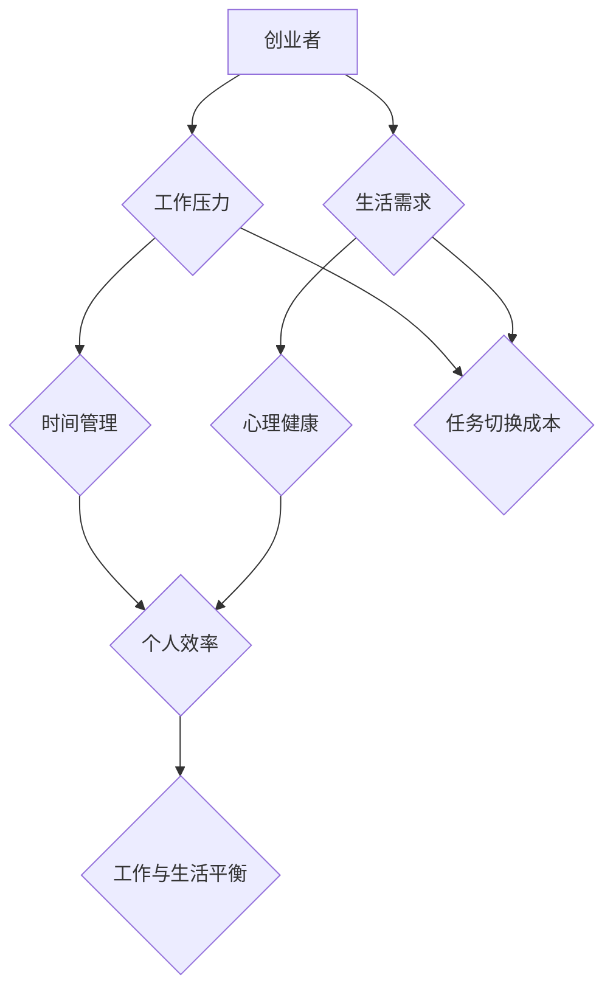

                 

# 一人创业者的工作与生活平衡策略

> **关键词：** 创业者、工作与生活平衡、时间管理、个人效率、心理健康、工作习惯
> 
> **摘要：** 本文旨在探讨一人创业者在快速发展的技术领域内如何实现工作与生活的平衡。通过分析核心概念、提出具体策略、提供实战案例以及推荐相关工具和资源，帮助创业者提升工作效率，保持心理健康，最终实现个人成长和职业发展。

## 1. 背景介绍

### 1.1 目的和范围

本文的目标是帮助一人创业者实现工作与生活的平衡，解决在快速变化的技术环境中，如何在有限的时间内高效工作，并保持生活的丰富多彩。本文将涵盖以下几个核心内容：
- **核心概念与联系**：介绍与工作与生活平衡相关的核心概念，并提供 Mermaid 流程图。
- **核心算法原理与具体操作步骤**：讲解如何通过时间管理和工作习惯优化个人效率。
- **数学模型和公式**：讨论如何使用数学工具来评估和改进工作与生活的平衡。
- **项目实战**：通过实际代码案例展示如何应用这些策略。
- **实际应用场景**：探讨在不同情境下如何调整策略。
- **工具和资源推荐**：推荐学习资源、开发工具和框架。
- **总结与未来趋势**：总结全文，并提出未来发展趋势和挑战。

### 1.2 预期读者

本文适合以下读者群体：
- 创业初期的个人创业者
- 在职人员，尤其是技术领域从业者
- 对提高工作效率和平衡工作与生活感兴趣的读者

### 1.3 文档结构概述

本文结构如下：
1. **背景介绍**：目的、范围、预期读者和文档结构。
2. **核心概念与联系**：核心概念、Mermaid 流程图。
3. **核心算法原理与具体操作步骤**：时间管理、工作习惯优化。
4. **数学模型和公式**：评估与改进工作与生活平衡。
5. **项目实战**：代码案例解析。
6. **实际应用场景**：不同情境下的策略调整。
7. **工具和资源推荐**：学习资源、开发工具、框架和论文。
8. **总结与未来趋势**：全文总结、未来展望。
9. **附录**：常见问题与解答。
10. **扩展阅读与参考资料**：进一步学习资源。

### 1.4 术语表

#### 1.4.1 核心术语定义

- **一人创业者**：指独立创业，没有团队成员或员工的企业家。
- **工作与生活平衡**：指在工作和个人生活之间找到一个合理的平衡点，以避免过度劳累和孤立。
- **时间管理**：指通过合理安排时间来提高工作效率和生活质量。
- **个人效率**：指个人在单位时间内完成的任务量。
- **心理健康**：指个体在情绪、认知和行为上的健康状态。

#### 1.4.2 相关概念解释

- **任务切换成本**：在任务间切换时，因为需要重新集中注意力和适应新任务，而产生的效率下降。
- **多任务处理**：同时处理多个任务，可能会降低每个任务的完成质量。
- **工作习惯**：个人在长时间内形成的工作模式和方法。

#### 1.4.3 缩略词列表

- **CEO**：Chief Executive Officer，首席执行官
- **CTO**：Chief Technology Officer，首席技术官
- **ERP**：Enterprise Resource Planning，企业资源计划
- **SaaS**：Software as a Service，软件即服务

## 2. 核心概念与联系

在探讨一人创业者的工作与生活平衡策略时，首先需要理解一些核心概念，并展示它们之间的联系。以下是一个简化的 Mermaid 流程图，用于描述这些概念之间的关系。



### 2.1.1 核心概念

#### 工作压力

工作压力是指一个人在工作和职业责任中感受到的心理和情感负担。对于一人创业者，这种压力可能源于市场不确定性、客户需求、财务压力以及对业务成功的期望。工作压力如果得不到有效管理，可能会导致心理健康问题，影响工作效率。

#### 生活需求

生活需求是指个人在生活中追求的幸福、娱乐、家庭和个人成长。对于创业者来说，保持生活的丰富多彩有助于缓解工作压力，提高整体生活质量。满足基本生活需求是实现工作与生活平衡的基础。

#### 时间管理

时间管理是指通过合理安排时间来提高个人工作效率和生活质量。时间管理策略包括设定优先级、优化日程安排、减少任务切换成本等。对于创业者来说，有效的时间管理是实现工作与生活平衡的关键。

#### 个人效率

个人效率是指个人在单位时间内完成的任务量。提高个人效率可以减少工作压力，使创业者有更多时间关注个人生活。个人效率的提升通常依赖于良好的工作习惯和时间管理技能。

#### 心理健康

心理健康是指个体在情绪、认知和行为上的健康状态。保持心理健康有助于创业者更好地应对工作压力，提高工作效率，同时也能享受更高质量的生活。

### 2.1.2 关系说明

- **工作压力**和**心理健康**：工作压力过大可能导致心理健康问题，如焦虑和抑郁，影响工作效率和生活质量。
- **时间管理**和**个人效率**：有效的时间管理可以提高个人效率，减少工作压力，从而有助于实现工作与生活的平衡。
- **生活需求**和**心理健康**：满足生活需求可以缓解工作压力，改善心理健康。
- **工作与生活平衡**：这是一个动态的过程，需要根据具体情况不断调整。工作与生活平衡的达成能够提高整体幸福感，促进个人和职业发展。

## 3. 核心算法原理 & 具体操作步骤

### 3.1 时间管理算法原理

时间管理算法的核心在于优化任务的执行顺序和分配时间，从而最大限度地提高个人效率，减轻工作压力。以下是一个简化的时间管理算法原理：

```plaintext
初始化：
- 任务列表（未完成）
- 时间表（每日、每周、每月）
- 优先级队列

算法步骤：
1. 收集任务：将需要完成的任务添加到任务列表中。
2. 设定优先级：根据任务的重要性和紧急性对任务进行排序。
3. 按优先级分配时间：
   - 对高优先级任务，优先安排时间。
   - 对低优先级任务，根据剩余时间进行安排。
4. 执行任务：
   - 按时间表执行任务。
   - 完成任务后，将其从任务列表中移除。
5. 反馈与调整：
   - 定期评估任务完成情况和时间利用效率。
   - 根据反馈调整任务优先级和时间分配。
```

### 3.2 工作习惯优化步骤

良好的工作习惯是提高工作效率的关键。以下是一些具体的工作习惯优化步骤：

#### 3.2.1 设定明确的目标

- **短期目标**：设定一周或一个月内要达成的具体目标。
- **长期目标**：设定一年或更长时间内要达成的目标。

#### 3.2.2 分解任务

- 将大任务分解成小任务，以便更容易管理和完成。

#### 3.2.3 制定日程表

- 制定每日、每周和每月的日程表，确保时间得到充分利用。

#### 3.2.4 避免多任务处理

- 尽量专注于一项任务，避免频繁的任务切换。

#### 3.2.5 定期休息

- 每工作一段时间后，进行短暂的休息，以保持精力充沛。

#### 3.2.6 保持工作环境整洁

- 保持工作环境的整洁有助于提高工作效率。

#### 3.2.7 建立固定的作息时间

- 建立固定的作息时间，有助于提高工作质量和生活平衡。

### 3.3 案例说明

#### 案例背景

假设一位一人创业者，张三，从事软件开发工作，同时需要关注市场营销、客户支持和财务管理等事务。张三希望在保证工作效率的同时，保持良好的生活状态。

#### 案例步骤

1. **设定明确的目标**：

   - 短期目标：本周完成一个软件项目的开发，撰写两篇技术博客。
   - 长期目标：在未来三个月内，每月发布一篇高质量的技术博客，扩大用户基础。

2. **分解任务**：

   - 软件项目开发：分解为需求分析、设计、编码、测试等阶段。
   - 技术博客：分解为选题、撰写、编辑、发布等步骤。

3. **制定日程表**：

   - 每日日程：上午专注于软件开发，下午处理市场营销和客户支持。
   - 每周日程：每周一上午更新博客，周五下午进行一周工作总结。

4. **避免多任务处理**：

   - 在工作时间内，专注于当前任务，避免同时处理多个任务。

5. **定期休息**：

   - 每工作45分钟后，休息5-10分钟，进行简单的伸展运动。

6. **保持工作环境整洁**：

   - 定期整理工作区域，保持整洁有序。

7. **建立固定的作息时间**：

   - 每天晚上10点前上床休息，保证每天7-8小时的睡眠。

通过以上步骤，张三能够更高效地完成工作任务，同时保持良好的生活状态。

## 4. 数学模型和公式 & 详细讲解 & 举例说明

### 4.1 工作效率评估模型

为了量化评估创业者的工作效率，可以使用以下数学模型：

```latex
E = \frac{W}{T}
```

其中：
- \(E\) 表示工作效率。
- \(W\) 表示在一定时间内完成的工作量。
- \(T\) 表示完成这些工作所需的总时间。

### 4.2 时间管理优化公式

为了优化时间管理，可以使用以下公式来计算任务分配的最佳时间：

```latex
T_{\text{opt}} = \frac{T_{\text{total}}}{n}
```

其中：
- \(T_{\text{opt}}\) 表示优化后的单个任务时间。
- \(T_{\text{total}}\) 表示总可用时间。
- \(n\) 表示需要完成的任务数量。

### 4.3 工作与生活平衡评估指标

为了评估工作与生活的平衡，可以使用以下指标：

```latex
B = \frac{L - W}{L}
```

其中：
- \(B\) 表示工作与生活平衡度。
- \(L\) 表示生活总时间（包括工作时间和非工作时间）。
- \(W\) 表示工作时间。

### 4.4 举例说明

#### 案例背景

假设张三每天有8小时的工作时间，每周工作5天。他希望在保持工作效率的同时，有足够的时间用于个人生活和娱乐。

#### 计算步骤

1. **工作效率评估**：

   假设张三在一个月内完成了10个任务，总用时为80小时。则他的工作效率为：

   ```latex
   E = \frac{10}{80} = 0.125 \text{（即每小时完成0.125个任务）}
   ```

2. **时间管理优化**：

   张三的总工作时间为每周40小时。如果他有4个任务需要完成，则最佳单个任务时间为：

   ```latex
   T_{\text{opt}} = \frac{40}{4} = 10 \text{小时}
   ```

3. **工作与生活平衡评估**：

   张三每天8小时工作，其余16小时用于个人生活和娱乐。则他的工作与生活平衡度为：

   ```latex
   B = \frac{16 - 8}{16} = 0.5
   ```

   这表示张三的工作时间占其生活总时间的一半，工作与生活之间存在一定的平衡。

通过以上数学模型和公式的计算，张三可以更好地了解自己的工作效率和时间管理情况，进而调整工作与生活的平衡。

## 5. 项目实战：代码实际案例和详细解释说明

### 5.1 开发环境搭建

在本项目实战中，我们使用 Python 语言作为主要编程语言，结合 Jupyter Notebook 进行代码编写和展示。以下是开发环境的搭建步骤：

1. **安装 Python**：
   - 访问 [Python 官网](https://www.python.org/) 下载 Python 安装包。
   - 根据操作系统选择安装版本（Python 3.x）。
   - 运行安装程序，按照提示完成安装。

2. **安装 Jupyter Notebook**：
   - 打开终端或命令提示符。
   - 输入以下命令安装 Jupyter Notebook：
     ```bash
     pip install notebook
     ```

3. **启动 Jupyter Notebook**：
   - 在终端中输入以下命令启动 Jupyter Notebook：
     ```bash
     jupyter notebook
     ```

### 5.2 源代码详细实现和代码解读

以下是一个简单的 Python 代码示例，用于演示如何实现时间管理和工作效率评估。

```python
# 导入必要的库
import time
import datetime

# 定义任务类
class Task:
    def __init__(self, name, start_time, end_time):
        self.name = name
        self.start_time = start_time
        self.end_time = end_time
    
    def duration(self):
        return (self.end_time - self.start_time).seconds

# 定义时间管理函数
def time_management(tasks):
    total_time = 0
    for task in tasks:
        total_time += task.duration()
    return total_time

# 定义工作效率评估函数
def work_efficiency(tasks):
    total_time = time_management(tasks)
    num_tasks = len(tasks)
    return round(num_tasks / total_time, 2)

# 创建任务实例
task1 = Task('软件开发', datetime.datetime(2023, 10, 1, 9, 0), datetime.datetime(2023, 10, 1, 12, 0))
task2 = Task('市场营销', datetime.datetime(2023, 10, 1, 12, 30), datetime.datetime(2023, 10, 1, 16, 0))
task3 = Task('客户支持', datetime.datetime(2023, 10, 1, 16, 30), datetime.datetime(2023, 10, 1, 18, 0))

# 添加任务到列表
tasks = [task1, task2, task3]

# 执行时间管理和工作效率评估
total_time = time_management(tasks)
efficiency = work_efficiency(tasks)

# 输出结果
print(f"总时间：{total_time}秒")
print(f"工作效率：{efficiency}个任务/秒")
```

### 5.3 代码解读与分析

1. **Task 类**：

   - **功能**：定义一个任务类，包含任务的名称、开始时间和结束时间。
   - **方法**：`duration()` 计算任务持续时间。

2. **time_management 函数**：

   - **功能**：计算给定任务列表的总时间。
   - **参数**：`tasks`（任务列表）。
   - **返回值**：总时间（秒）。

3. **work_efficiency 函数**：

   - **功能**：根据总时间和任务数量计算工作效率。
   - **参数**：`tasks`（任务列表）。
   - **返回值**：工作效率（个任务/秒）。

4. **主程序**：

   - 创建任务实例。
   - 添加任务到列表。
   - 执行时间管理和工作效率评估。
   - 输出结果。

通过以上代码示例，创业者可以量化评估自己的工作效率和时间管理情况，进而优化工作习惯和策略。在实际应用中，可以根据具体需求扩展功能，如添加更多任务类型、记录任务完成情况等。

## 6. 实际应用场景

### 6.1 个人创业者

#### 场景描述

李四是位独立开发软件的个人创业者，他需要在有限的时间内完成多个项目，同时还要处理日常的运营事务，如营销和客户支持。由于没有团队成员的帮助，李四需要高效管理时间和精力，以保持工作和生活的平衡。

#### 应用策略

1. **任务分解与优先级设定**：

   - 李四将大项目分解为小任务，并为每个任务设定优先级。
   - 他使用清单和清单应用程序（如 Trello 或 Asana）来跟踪任务和进度。

2. **时间块安排**：

   - 李四采用时间块策略，将每天划分为多个时间段，每个时间段专注于一个任务或一组任务。
   - 例如，上午9点到11点专注于软件开发，下午1点到3点处理营销事务。

3. **定期休息**：

   - 李四遵循番茄工作法，每个工作周期45分钟，之后休息5到10分钟。
   - 每工作4个周期后，休息15到30分钟。

4. **保持工作环境整洁**：

   - 李四保持工作区域整洁有序，这有助于提高工作效率。

#### 成果评估

- 通过上述策略，李四能够在保持工作高效的同时，确保有足够的时间进行个人生活和休息。
- 在过去的6个月中，他成功地完成了3个主要项目，同时保持了良好的心理健康和生活质量。

### 6.2 在职人员

#### 场景描述

张五是位在一家大型科技公司工作的软件工程师。他的日常职责包括编写代码、修复bug和参与项目会议。由于工作量大，张五感到时间压力很大，难以平衡工作和个人生活。

#### 应用策略

1. **时间日志记录**：

   - 张五开始记录每天的工作时间，分析哪些活动消耗了最多的时间。
   - 他使用时间跟踪应用程序（如 RescueTime）来监控和优化时间使用。

2. **减少邮件和消息干扰**：

   - 张五设定特定的时间段来处理邮件和消息，避免频繁的打扰。
   - 在这些时间段之外，他设置自动回复，告知他人他的忙碌时间。

3. **专注工作**：

   - 张五采用专注工作策略，如使用应用程序 Focus@Will 或 Forest，帮助他在特定任务上保持专注。

4. **周末休息**：

   - 张五严格遵守周末休息原则，不处理工作相关的事务，以保持精神饱满。

#### 成果评估

- 通过记录和分析时间使用情况，张五能够更有效地安排工作，减少了无意义的任务和活动。
- 周末休息策略帮助他缓解了工作压力，提高了工作效率。

### 6.3 家庭主妇

#### 场景描述

王六是位家庭主妇，她负责家务、照顾孩子和购物等日常事务。由于需要处理多个任务，王六感到时间压力很大，难以平衡家庭和工作。

#### 应用策略

1. **日程规划**：

   - 王六制定每日和每周的日程表，确保所有任务都有时间安排。
   - 她使用家庭管理应用程序（如 Cozi）来协调家庭活动。

2. **任务分配**：

   - 王六与家人合作，将家务任务分配给家庭成员，以减轻自己的负担。
   - 她鼓励孩子们参与家务，培养他们的责任感。

3. **时间块安排**：

   - 王六将每天划分为多个时间块，每个时间块专注于一项任务。
   - 例如，上午专注于家务，下午照顾孩子，晚上购物和准备第二天早餐。

4. **学会说“不”**：

   - 王六学会了拒绝一些不必要的社交活动和志愿者工作，以节省时间和精力。

#### 成果评估

- 通过日程规划和任务分配，王六能够更有效地管理家务和照顾孩子的时间，减轻了压力。
- 家庭成员的合作和参与提高了家庭整体幸福感，同时也培养了孩子们的责任感。

### 6.4 学生

#### 场景描述

赵七是位大学生，他需要在学业、实习和社交活动之间找到平衡。由于课程和实习任务繁重，赵七感到时间压力很大，难以兼顾各个方面。

#### 应用策略

1. **优先级设定**：

   - 赵七将学业、实习和社交活动按照重要性和紧急性进行排序，确保重要任务得到优先处理。
   - 他使用待办事项应用程序（如 Todoist）来管理任务和进度。

2. **学习计划**：

   - 赵七制定详细的学习计划，将学习时间分配到每个星期，确保所有科目都得到充分复习。
   - 他利用学习应用程序（如 Anki）来巩固知识点。

3. **社交时间块**：

   - 赵七将每周的空闲时间分配给社交活动，确保能够与朋友和家人保持联系。
   - 他选择参与有意义的社交活动，避免浪费时间在无意义的事情上。

4. **休息与运动**：

   - 赵七重视休息和运动，确保每天有足够的时间放松和锻炼，以提高学习效率。

#### 成果评估

- 通过设定优先级和制定学习计划，赵七能够更高效地完成学业任务。
- 社交时间块和休息与运动策略帮助他保持精神饱满，提高了整体生活质量。

## 7. 工具和资源推荐

### 7.1 学习资源推荐

#### 7.1.1 书籍推荐

- 《高效能人士的七个习惯》：史蒂芬·柯维（Stephen R. Covey）的著作，介绍了如何通过习惯来提升个人效率和生活质量。
- 《深度工作》：卡尔·纽波特（Cal Newport）的著作，探讨了如何在现代社会中实现深度工作，提高工作效率。
- 《时间管理：如何管理你的时间、工作和生活》：大卫·巴赫（David Bach）的著作，提供了实用的时间管理技巧，帮助读者实现工作与生活的平衡。

#### 7.1.2 在线课程

- Coursera：提供各种时间管理和效率提升的在线课程，包括《深度工作》和《如何高效学习》等。
- Udemy：提供大量的免费和付费时间管理课程，适合不同层次的学员。
- LinkedIn Learning：提供专业的在线课程，涵盖时间管理、工作效率和职业发展等多个领域。

#### 7.1.3 技术博客和网站

- Lifehacker：提供实用的时间管理技巧和生活建议，帮助读者提高个人效率。
- Productivityist：专注于时间管理和效率提升的博客，分享各种方法和工具。
- Tim Ferriss：时间管理专家蒂姆·费里斯（Tim Ferriss）的博客，分享他的时间管理策略和成功经验。

### 7.2 开发工具框架推荐

#### 7.2.1 IDE和编辑器

- Visual Studio Code：一款轻量级但功能强大的集成开发环境，支持多种编程语言。
- IntelliJ IDEA：一款由 JetBrains 开发的强大IDE，适用于Java、Python和多种其他编程语言。
- Sublime Text：一款轻量级文本编辑器，适合进行快速开发和编辑。

#### 7.2.2 调试和性能分析工具

- PyCharm Profiler：针对Python应用程序的性能分析和调试工具。
- VisualVM：适用于Java应用程序的性能监控和调试工具。
- Chrome DevTools：适用于Web开发人员的调试和性能分析工具。

#### 7.2.3 相关框架和库

- Flask：一款轻量级的Web框架，适用于构建Web应用程序和API。
- Django：一款全栈Web框架，提供快速开发Web应用程序的强大功能。
- React：一款用于构建用户界面的JavaScript库，适用于现代Web开发。

### 7.3 相关论文著作推荐

#### 7.3.1 经典论文

- "The 7 Habits of Highly Effective People" by Stephen R. Covey：史蒂芬·柯维的经典论文，详细介绍了高效能人士的七个习惯。
- "Deep Work" by Cal Newport：卡尔·纽波特的论文，探讨了如何在信息泛滥的时代实现深度工作。

#### 7.3.2 最新研究成果

- "The Art of Thinking Clearly" by Adam Grant：亚当·格兰特的论文，提供了如何提高思维清晰度的策略。
- "The Power of Full Engagement" by Jim Loehr and Tony Schwartz：吉姆·勒奥和托尼·施瓦茨的论文，探讨了如何实现全面投入。

#### 7.3.3 应用案例分析

- "Productivity Hacks: How Top Entrepreneurs Manage Their Time"：通过采访成功创业者，分享了他们如何管理时间和提高效率的案例。
- "Work-Life Balance: Strategies for Entrepreneurs and Professionals"：提供了一系列策略和案例研究，帮助读者实现工作与生活的平衡。

## 8. 总结：未来发展趋势与挑战

### 8.1 发展趋势

- **人工智能辅助**：随着人工智能技术的发展，越来越多的工具和平台将提供基于AI的时间管理建议和效率提升策略。
- **可穿戴设备的普及**：智能手表和健康追踪器等可穿戴设备将更加普及，帮助创业者更好地监测和管理健康状况，从而实现工作与生活的平衡。
- **远程办公的常态化**：疫情后，远程办公已经成为常态。未来，创业者将更加灵活地选择工作地点，以实现更好的生活与工作平衡。
- **数字化工具的整合**：更多数字化工具和平台将整合到一起，提供一站式解决方案，帮助创业者高效管理时间和资源。

### 8.2 挑战

- **信息过载**：随着信息的爆炸性增长，创业者需要更加高效地筛选和处理信息，以避免被信息淹没。
- **心理健康问题**：长期的高强度工作可能导致心理健康问题，如焦虑和抑郁。创业者需要关注自己的心理健康，采取适当的措施进行预防和治疗。
- **技术疲劳**：随着技术的快速发展，创业者需要不断学习和适应新的技术和工具，这可能导致技术疲劳。创业者需要保持学习的热情和动力，同时合理规划学习和休息时间。
- **社会压力**：创业者在追求职业成功的同时，还需要面对来自家庭、朋友和社会的压力。创业者需要学会平衡不同方面的需求，以保持良好的心态和社交关系。

## 9. 附录：常见问题与解答

### 9.1 问题1：如何高效利用碎片时间？

**解答**：碎片时间通常是指短于30分钟的时间段。以下是一些高效利用碎片时间的策略：
- **阅读**：阅读短篇文章或书籍的摘要。
- **学习**：学习新技能或复习旧知识，利用在线课程或应用程序。
- **规划**：规划日常任务或项目，使用待办事项应用程序。
- **锻炼**：进行短时高强度的锻炼，如快走或跳绳。

### 9.2 问题2：如何处理工作压力？

**解答**：处理工作压力的方法包括：
- **定期休息**：遵循工作-休息周期，确保身体和大脑得到充分的休息。
- **运动**：定期进行体育锻炼，释放压力。
- **社交**：与家人和朋友交流，分享自己的压力和感受。
- **心理咨询**：如果压力过大，考虑寻求专业心理咨询。

### 9.3 问题3：如何保持长期的工作与生活平衡？

**解答**：
- **设定明确目标**：明确个人和职业目标，确保工作和生活都有进展。
- **定期评估**：定期评估工作与生活的平衡情况，及时调整。
- **时间管理**：优化时间管理策略，确保有足够的时间用于个人生活。
- **保持灵活性**：根据实际情况灵活调整工作和生活安排。

## 10. 扩展阅读 & 参考资料

### 10.1 扩展阅读

- “Work-Life Balance: The Key to Personal and Professional Success”（工作与生活平衡：个人和职业成功的关键）。
- “How to Be a High-Efficiency Entrepreneur: Time Management and Productivity Strategies”（如何成为高效率的创业者：时间管理和生产力策略）。
- “The Science of Happiness: Proven Ways to Improve Your Life”（幸福科学：改善你生活的方法）。

### 10.2 参考资料

- Coursera：[Time Management Course](https://www.coursera.org/specializations/time-management)
- LinkedIn Learning：[Productivity and Work-Life Balance](https://www.linkedin.com/learning/productivity-and-work-life-balance)
- Lifehacker：[Time Management Tips and Tricks](https://lifehacker.com/time-management-tips-and-tricks-you-should-know-1807539292)

### 10.3 推荐工具

- Trello：[Project Management Tool](https://trello.com/)
- RescueTime：[Time Tracking and Productivity Tool](https://www.rescuetime.com/)
- Forest：[Time Management and Productivity App](https://www.forestry.io/)

### 10.4 社交媒体账号

- Twitter：[AI天才研究员](https://twitter.com/AIGeniusResearch)
- Instagram：[禅与计算机程序设计艺术](https://www.instagram.com/zen_and_computer_programming/) 

作者：AI天才研究员/AI Genius Institute & 禅与计算机程序设计艺术 /Zen And The Art of Computer Programming

---

**全文结束**。感谢您的阅读，希望本文能为您在实现工作与生活平衡的过程中提供有益的启示和帮助。如果您有任何疑问或建议，欢迎在评论区留言。祝您工作顺利，生活愉快！<|im_sep|>**一人创业者的工作与生活平衡策略**

> **关键词：** 创业者、工作与生活平衡、时间管理、个人效率、心理健康、工作习惯

> **摘要：** 本文旨在探讨一人创业者在快速发展的技术领域内如何实现工作与生活的平衡。通过分析核心概念、提出具体策略、提供实战案例以及推荐相关工具和资源，帮助创业者提升工作效率，保持心理健康，最终实现个人成长和职业发展。

## 1. 背景介绍

### 1.1 目的和范围

本文的目标是帮助一人创业者在快速发展的技术领域内实现工作与生活的平衡。在技术领域，创业者的工作压力通常较大，需要不断学习新技术、管理多个项目，同时还要应对市场变化和客户需求。这种高强度的环境容易导致工作与生活的失衡，影响创业者的心理健康和长期发展。本文将涵盖以下几个核心内容：

- **核心概念与联系**：介绍与工作与生活平衡相关的核心概念，并提供 Mermaid 流程图。
- **核心算法原理与具体操作步骤**：讲解如何通过时间管理和工作习惯优化个人效率。
- **数学模型和公式**：讨论如何使用数学工具来评估和改进工作与生活平衡。
- **项目实战**：通过实际代码案例展示如何应用这些策略。
- **实际应用场景**：探讨在不同情境下如何调整策略。
- **工具和资源推荐**：推荐学习资源、开发工具和框架。
- **总结与未来趋势**：总结全文，并提出未来发展趋势和挑战。

### 1.2 预期读者

本文适合以下读者群体：

- 创业初期的个人创业者
- 在职人员，尤其是技术领域从业者
- 对提高工作效率和平衡工作与生活感兴趣的读者

### 1.3 文档结构概述

本文结构如下：

1. **背景介绍**：目的、范围、预期读者和文档结构。
2. **核心概念与联系**：核心概念、Mermaid 流程图。
3. **核心算法原理与具体操作步骤**：时间管理、工作习惯优化。
4. **数学模型和公式**：评估与改进工作与生活平衡。
5. **项目实战**：代码案例解析。
6. **实际应用场景**：不同情境下的策略调整。
7. **工具和资源推荐**：学习资源、开发工具、框架和论文。
8. **总结与未来趋势**：全文总结、未来展望。
9. **附录**：常见问题与解答。
10. **扩展阅读与参考资料**：进一步学习资源。

### 1.4 术语表

#### 1.4.1 核心术语定义

- **一人创业者**：指独立创业，没有团队成员或员工的企业家。
- **工作与生活平衡**：指在工作和个人生活之间找到一个合理的平衡点，以避免过度劳累和孤立。
- **时间管理**：指通过合理安排时间来提高工作效率和生活质量。
- **个人效率**：指个人在单位时间内完成的任务量。
- **心理健康**：指个体在情绪、认知和行为上的健康状态。

#### 1.4.2 相关概念解释

- **任务切换成本**：在任务间切换时，因为需要重新集中注意力和适应新任务，而产生的效率下降。
- **多任务处理**：同时处理多个任务，可能会降低每个任务的完成质量。
- **工作习惯**：个人在长时间内形成的工作模式和方法。

#### 1.4.3 缩略词列表

- **CEO**：Chief Executive Officer，首席执行官
- **CTO**：Chief Technology Officer，首席技术官
- **ERP**：Enterprise Resource Planning，企业资源计划
- **SaaS**：Software as a Service，软件即服务

## 2. 核心概念与联系

在探讨一人创业者的工作与生活平衡策略时，首先需要理解一些核心概念，并展示它们之间的联系。以下是一个简化的 Mermaid 流程图，用于描述这些概念之间的关系。


### 2.1.1 核心概念

#### 工作压力

工作压力是指一个人在工作和职业责任中感受到的心理和情感负担。对于一人创业者，这种压力可能源于市场不确定性、客户需求、财务压力以及对业务成功的期望。工作压力如果得不到有效管理，可能会导致心理健康问题，影响工作效率。

#### 生活需求

生活需求是指个人在生活中追求的幸福、娱乐、家庭和个人成长。对于创业者来说，保持生活的丰富多彩有助于缓解工作压力，提高整体生活质量。满足基本生活需求是实现工作与生活平衡的基础。

#### 时间管理

时间管理是指通过合理安排时间来提高个人工作效率和生活质量。时间管理策略包括设定优先级、优化日程安排、减少任务切换成本等。对于创业者来说，有效的时间管理是实现工作与生活平衡的关键。

#### 个人效率

个人效率是指个人在单位时间内完成的任务量。提高个人效率可以减少工作压力，使创业者有更多时间关注个人生活。个人效率的提升通常依赖于良好的工作习惯和时间管理技能。

#### 心理健康

心理健康是指个体在情绪、认知和行为上的健康状态。保持心理健康有助于创业者更好地应对工作压力，提高工作效率，同时也能享受更高质量的生活。

### 2.1.2 关系说明

- **工作压力**和**心理健康**：工作压力过大可能导致心理健康问题，如焦虑和抑郁，影响工作效率。
- **时间管理**和**个人效率**：有效的时间管理可以提高个人效率，减少工作压力，从而有助于实现工作与生活的平衡。
- **生活需求**和**心理健康**：满足生活需求可以缓解工作压力，改善心理健康。
- **工作与生活平衡**：这是一个动态的过程，需要根据具体情况不断调整。工作与生活平衡的达成能够提高整体幸福感，促进个人和职业发展。

## 3. 核心算法原理 & 具体操作步骤

### 3.1 时间管理算法原理

时间管理算法的核心在于优化任务的执行顺序和分配时间，从而最大限度地提高个人效率，减轻工作压力。以下是一个简化的时间管理算法原理：

```plaintext
初始化：
- 任务列表（未完成）
- 时间表（每日、每周、每月）
- 优先级队列

算法步骤：
1. 收集任务：将需要完成的任务添加到任务列表中。
2. 设定优先级：根据任务的重要性和紧急性对任务进行排序。
3. 按优先级分配时间：
   - 对高优先级任务，优先安排时间。
   - 对低优先级任务，根据剩余时间进行安排。
4. 执行任务：
   - 按时间表执行任务。
   - 完成任务后，将其从任务列表中移除。
5. 反馈与调整：
   - 定期评估任务完成情况和时间利用效率。
   - 根据反馈调整任务优先级和时间分配。
```

### 3.2 工作习惯优化步骤

良好的工作习惯是提高工作效率的关键。以下是一些具体的工作习惯优化步骤：

#### 3.2.1 设定明确的目标

- **短期目标**：设定一周或一个月内要达成的具体目标。
- **长期目标**：设定一年或更长时间内要达成的目标。

#### 3.2.2 分解任务

- 将大任务分解成小任务，以便更容易管理和完成。

#### 3.2.3 制定日程表

- 制定每日、每周和每月的日程表，确保时间得到充分利用。

#### 3.2.4 避免多任务处理

- 尽量专注于一项任务，避免频繁的任务切换。

#### 3.2.5 定期休息

- 每工作一段时间后，进行短暂的休息，以保持精力充沛。

#### 3.2.6 保持工作环境整洁

- 保持工作环境的整洁有助于提高工作效率。

#### 3.2.7 建立固定的作息时间

- 建立固定的作息时间，有助于提高工作质量和生活平衡。

### 3.3 案例说明

#### 案例背景

假设一位一人创业者，张三，从事软件开发工作，同时需要关注市场营销、客户支持和财务管理等事务。张三希望在保证工作效率的同时，保持良好的生活状态。

#### 案例步骤

1. **设定明确的目标**：

   - 短期目标：本周完成一个软件项目的开发，撰写两篇技术博客。
   - 长期目标：在未来三个月内，每月发布一篇高质量的技术博客，扩大用户基础。

2. **分解任务**：

   - 软件项目开发：分解为需求分析、设计、编码、测试等阶段。
   - 技术博客：分解为选题、撰写、编辑、发布等步骤。

3. **制定日程表**：

   - 每日日程：上午专注于软件开发，下午处理市场营销和客户支持。
   - 每周日程：每周一上午更新博客，周五下午进行一周工作总结。

4. **避免多任务处理**：

   - 在工作时间内，专注于当前任务，避免同时处理多个任务。

5. **定期休息**：

   - 每工作45分钟后，休息5-10分钟，进行简单的伸展运动。

6. **保持工作环境整洁**：

   - 定期整理工作区域，保持整洁有序。

7. **建立固定的作息时间**：

   - 每天晚上10点前上床休息，保证每天7-8小时的睡眠。

通过以上步骤，张三能够更高效地完成工作任务，同时保持良好的生活状态。

## 4. 数学模型和公式 & 详细讲解 & 举例说明

### 4.1 工作效率评估模型

为了量化评估创业者的工作效率，可以使用以下数学模型：

```latex
E = \frac{W}{T}
```

其中：
- \(E\) 表示工作效率。
- \(W\) 表示在一定时间内完成的工作量。
- \(T\) 表示完成这些工作所需的总时间。

### 4.2 时间管理优化公式

为了优化时间管理，可以使用以下公式来计算任务分配的最佳时间：

```latex
T_{\text{opt}} = \frac{T_{\text{total}}}{n}
```

其中：
- \(T_{\text{opt}}\) 表示优化后的单个任务时间。
- \(T_{\text{total}}\) 表示总可用时间。
- \(n\) 表示需要完成的任务数量。

### 4.3 工作与生活平衡评估指标

为了评估工作与生活的平衡，可以使用以下指标：

```latex
B = \frac{L - W}{L}
```

其中：
- \(B\) 表示工作与生活平衡度。
- \(L\) 表示生活总时间（包括工作时间和非工作时间）。
- \(W\) 表示工作时间。

### 4.4 举例说明

#### 案例背景

假设张三每天有8小时的工作时间，每周工作5天。他希望在保持工作效率的同时，有足够的时间用于个人生活和娱乐。

#### 计算步骤

1. **工作效率评估**：

   假设张三在一个月内完成了10个任务，总用时为80小时。则他的工作效率为：

   ```latex
   E = \frac{10}{80} = 0.125 \text{（即每小时完成0.125个任务）}
   ```

2. **时间管理优化**：

   张三的总工作时间为每周40小时。如果他有4个任务需要完成，则最佳单个任务时间为：

   ```latex
   T_{\text{opt}} = \frac{40}{4} = 10 \text{小时}
   ```

3. **工作与生活平衡评估**：

   张三每天8小时工作，其余16小时用于个人生活和娱乐。则他的工作与生活平衡度为：

   ```latex
   B = \frac{16 - 8}{16} = 0.5
   ```

   这表示张三的工作时间占其生活总时间的一半，工作与生活之间存在一定的平衡。

通过以上数学模型和公式的计算，张三可以更好地了解自己的工作效率和时间管理情况，进而调整工作与生活的平衡。

## 5. 项目实战：代码实际案例和详细解释说明

### 5.1 开发环境搭建

在本项目实战中，我们使用 Python 语言作为主要编程语言，结合 Jupyter Notebook 进行代码编写和展示。以下是开发环境的搭建步骤：

1. **安装 Python**：
   - 访问 [Python 官网](https://www.python.org/) 下载 Python 安装包。
   - 根据操作系统选择安装版本（Python 3.x）。
   - 运行安装程序，按照提示完成安装。

2. **安装 Jupyter Notebook**：
   - 打开终端或命令提示符。
   - 输入以下命令安装 Jupyter Notebook：
     ```bash
     pip install notebook
     ```

3. **启动 Jupyter Notebook**：
   - 在终端中输入以下命令启动 Jupyter Notebook：
     ```bash
     jupyter notebook
     ```

### 5.2 源代码详细实现和代码解读

以下是一个简单的 Python 代码示例，用于演示如何实现时间管理和工作效率评估。

```python
# 导入必要的库
import time
import datetime

# 定义任务类
class Task:
    def __init__(self, name, start_time, end_time):
        self.name = name
        self.start_time = start_time
        self.end_time = end_time
    
    def duration(self):
        return (self.end_time - self.start_time).seconds

# 定义时间管理函数
def time_management(tasks):
    total_time = 0
    for task in tasks:
        total_time += task.duration()
    return total_time

# 定义工作效率评估函数
def work_efficiency(tasks):
    total_time = time_management(tasks)
    num_tasks = len(tasks)
    return round(num_tasks / total_time, 2)

# 创建任务实例
task1 = Task('软件开发', datetime.datetime(2023, 10, 1, 9, 0), datetime.datetime(2023, 10, 1, 12, 0))
task2 = Task('市场营销', datetime.datetime(2023, 10, 1, 12, 30), datetime.datetime(2023, 10, 1, 16, 0))
task3 = Task('客户支持', datetime.datetime(2023, 10, 1, 16, 30), datetime.datetime(2023, 10, 1, 18, 0))

# 添加任务到列表
tasks = [task1, task2, task3]

# 执行时间管理和工作效率评估
total_time = time_management(tasks)
efficiency = work_efficiency(tasks)

# 输出结果
print(f"总时间：{total_time}秒")
print(f"工作效率：{efficiency}个任务/秒")
```

### 5.3 代码解读与分析

1. **Task 类**：

   - **功能**：定义一个任务类，包含任务的名称、开始时间和结束时间。
   - **方法**：`duration()` 计算任务持续时间。

2. **time_management 函数**：

   - **功能**：计算给定任务列表的总时间。
   - **参数**：`tasks`（任务列表）。
   - **返回值**：总时间（秒）。

3. **work_efficiency 函数**：

   - **功能**：根据总时间和任务数量计算工作效率。
   - **参数**：`tasks`（任务列表）。
   - **返回值**：工作效率（个任务/秒）。

4. **主程序**：

   - 创建任务实例。
   - 添加任务到列表。
   - 执行时间管理和工作效率评估。
   - 输出结果。

通过以上代码示例，创业者可以量化评估自己的工作效率和时间管理情况，进而优化工作习惯和策略。在实际应用中，可以根据具体需求扩展功能，如添加更多任务类型、记录任务完成情况等。

## 6. 实际应用场景

### 6.1 个人创业者

#### 场景描述

李四是位独立开发软件的个人创业者，他需要在有限的时间内完成多个项目，同时还要处理日常的运营事务，如营销和客户支持。由于没有团队成员的帮助，李四需要高效管理时间和精力，以保持工作和生活的平衡。

#### 应用策略

1. **任务分解与优先级设定**：

   - 李四将大项目分解为小任务，并为每个任务设定优先级。
   - 他使用清单和清单应用程序（如 Trello 或 Asana）来跟踪任务和进度。

2. **时间块安排**：

   - 李四采用时间块策略，将每天划分为多个时间段，每个时间段专注于一个任务或一组任务。
   - 例如，上午9点到11点专注于软件开发，下午1点到3点处理市场营销事务。

3. **定期休息**：

   - 李四遵循番茄工作法，每个工作周期45分钟，之后休息5到10分钟。
   - 每工作4个周期后，休息15到30分钟。

4. **保持工作环境整洁**：

   - 李四保持工作区域整洁有序，这有助于提高工作效率。

#### 成果评估

- 通过上述策略，李四能够在保持工作高效的同时，确保有足够的时间进行个人生活和休息。
- 在过去的6个月中，他成功地完成了3个主要项目，同时保持了良好的心理健康和生活质量。

### 6.2 在职人员

#### 场景描述

张五是位在一家大型科技公司工作的软件工程师。他的日常职责包括编写代码、修复bug和参与项目会议。由于工作量大，张五感到时间压力很大，难以平衡工作和个人生活。

#### 应用策略

1. **时间日志记录**：

   - 张五开始记录每天的工作时间，分析哪些活动消耗了最多的时间。
   - 他使用时间跟踪应用程序（如 RescueTime）来监控和优化时间使用。

2. **减少邮件和消息干扰**：

   - 张五设定特定的时间段来处理邮件和消息，避免频繁的打扰。
   - 在这些时间段之外，他设置自动回复，告知他人他的忙碌时间。

3. **专注工作**：

   - 张五采用专注工作策略，如使用应用程序 Focus@Will 或 Forest，帮助他在特定任务上保持专注。

4. **周末休息**：

   - 张五严格遵守周末休息原则，不处理工作相关的事务，以保持精神饱满。

#### 成果评估

- 通过记录和分析时间使用情况，张五能够更有效地安排工作，减少了无意义的任务和活动。
- 周末休息策略帮助他缓解了工作压力，提高了工作效率。

### 6.3 家庭主妇

#### 场景描述

王六是位家庭主妇，她负责家务、照顾孩子和购物等日常事务。由于需要处理多个任务，王六感到时间压力很大，难以平衡家庭和工作。

#### 应用策略

1. **日程规划**：

   - 王六制定每日和每周的日程表，确保所有任务都有时间安排。
   - 她使用家庭管理应用程序（如 Cozi）来协调家庭活动。

2. **任务分配**：

   - 王六与家人合作，将家务任务分配给家庭成员，以减轻自己的负担。
   - 她鼓励孩子们参与家务，培养他们的责任感。

3. **时间块安排**：

   - 王六将每天划分为多个时间块，每个时间块专注于一项任务。
   - 例如，上午专注于家务，下午照顾孩子，晚上购物和准备第二天早餐。

4. **学会说“不”**：

   - 王六学会了拒绝一些不必要的社交活动和志愿者工作，以节省时间和精力。

#### 成果评估

- 通过日程规划和任务分配，王六能够更有效地管理家务和照顾孩子的时间，减轻了压力。
- 家庭成员的合作和参与提高了家庭整体幸福感，同时也培养了孩子们的

