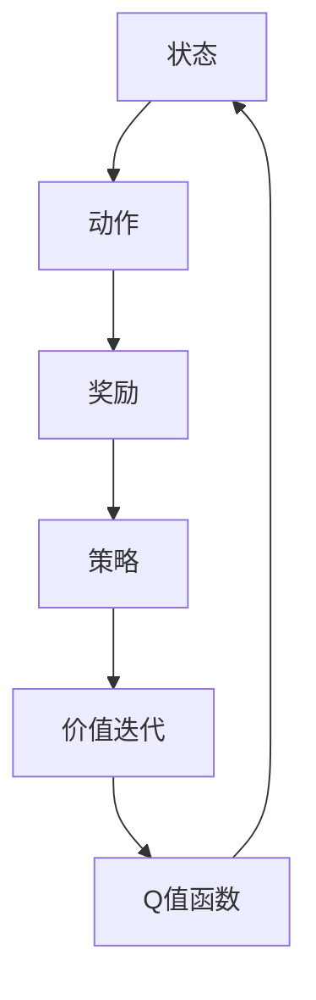

                 


# 一切皆是映射：AI Q-learning在压力测试中的应用

> **关键词：** AI, Q-learning, 压力测试, 映射模型, 机器学习算法, 软件工程

> **摘要：** 本文深入探讨了AI Q-learning算法在压力测试中的应用，通过一步步分析其核心概念、原理和具体操作步骤，结合实际项目案例，揭示了AI Q-learning在提升软件可靠性、稳定性和可预测性方面的潜在价值。文章还展望了未来发展趋势与挑战，为相关领域的实践和研究提供了有益的参考。

## 1. 背景介绍

### 1.1 目的和范围

本文旨在探讨如何利用AI Q-learning算法进行高效的压力测试，以提升软件系统的可靠性和稳定性。我们将从理论到实践，全面解析Q-learning算法的基本原理及其在压力测试中的具体应用。文章将覆盖以下主要内容：

- Q-learning算法的基本概念和原理；
- 压力测试中的映射模型构建；
- Q-learning在压力测试中的具体操作步骤；
- 数学模型和公式；
- 实际项目案例及代码实现；
- 压力测试中的应用场景；
- 工具和资源推荐；
- 未来发展趋势与挑战。

### 1.2 预期读者

本文适合以下读者群体：

- 对AI和机器学习算法有一定了解的技术人员；
- 涉足软件工程领域，尤其是压力测试相关工作的工程师和开发人员；
- 对Q-learning算法及其在压力测试中应用感兴趣的学术研究人员；
- 对AI Q-learning在压力测试领域有深入了解和探索意愿的从业者。

### 1.3 文档结构概述

本文将按照以下结构进行组织：

- 引言：介绍文章的背景、目的和预期读者；
- 核心概念与联系：阐述Q-learning算法的基本原理和架构；
- 核心算法原理 & 具体操作步骤：详细讲解Q-learning算法在压力测试中的应用流程；
- 数学模型和公式：介绍Q-learning算法的数学模型和关键公式；
- 项目实战：通过实际项目案例展示Q-learning算法在压力测试中的应用；
- 实际应用场景：分析Q-learning在压力测试中的实际应用效果；
- 工具和资源推荐：推荐相关学习资源和开发工具；
- 总结：展望Q-learning在压力测试领域的未来发展趋势与挑战；
- 附录：常见问题与解答；
- 扩展阅读 & 参考资料：提供进一步学习的资料和参考。

### 1.4 术语表

#### 1.4.1 核心术语定义

- Q-learning：一种基于值迭代的强化学习算法，用于解决优化问题。
- 压力测试：通过模拟系统在高负载、高并发等极端情况下运行情况，评估系统性能和稳定性的测试。
- 强化学习：一种机器学习方法，通过奖励机制让智能体在环境中学习最佳策略。
- 价值迭代：Q-learning算法的核心步骤，用于更新状态值函数。

#### 1.4.2 相关概念解释

- 状态：表示系统当前运行状态的信息集合。
- 动作：在给定状态下，智能体可以采取的操作。
- 奖励：对智能体采取动作后的反馈，用于评估动作优劣。
- 策略：智能体在给定状态下选择最优动作的方法。

#### 1.4.3 缩略词列表

- AI：人工智能（Artificial Intelligence）
- Q-learning：Q值学习（Q-Learning）
- RL：强化学习（Reinforcement Learning）
- SUT：被测系统（System Under Test）
- SLA：服务水平协议（Service Level Agreement）

## 2. 核心概念与联系

为了更好地理解Q-learning算法在压力测试中的应用，我们需要先了解一些核心概念和它们之间的关系。以下是一个简化的Mermaid流程图，用于展示这些概念之间的联系。



### 2.1 Q-learning算法的基本原理

Q-learning算法是一种基于值迭代的强化学习算法，其目标是在给定环境中找到最优策略。Q-learning算法通过不断更新状态值函数（Q值函数）来优化智能体的行为。以下是Q-learning算法的基本原理：

1. **初始化**：初始化Q值函数，通常设置为所有状态-动作对的平均值，或者根据具体问题设置不同的初始值。
2. **选择动作**：在给定状态下，根据策略选择最优动作。策略可以是贪心策略，即选择当前Q值最大的动作。
3. **执行动作**：在环境中执行选择出的动作，观察环境反馈。
4. **更新Q值**：根据奖励和策略更新Q值函数。更新公式如下：
   $$ Q(s, a) = Q(s, a) + \alpha [r + \gamma \max_{a'} Q(s', a') - Q(s, a)] $$
   其中，$\alpha$为学习率，$\gamma$为折扣因子，$r$为奖励，$s$和$a$分别表示当前状态和动作，$s'$和$a'$分别表示下一状态和动作。
5. **重复迭代**：重复上述步骤，直到收敛到最优策略。

### 2.2 压力测试中的映射模型构建

在压力测试中，我们可以将Q-learning算法应用于构建映射模型，以预测系统在不同负载下的行为。映射模型的构建过程如下：

1. **状态表示**：将系统当前运行状态（如CPU利用率、内存占用率、网络延迟等）作为状态表示。
2. **动作表示**：将系统可以采取的负载调整操作（如增加线程数、调整请求处理速度等）作为动作表示。
3. **奖励设计**：根据系统目标（如最小化响应时间、最大化吞吐量等）设计奖励函数，以评估动作效果。
4. **策略选择**：利用Q-learning算法，根据状态和奖励信息，学习得到最优策略。

通过构建映射模型，我们可以预测系统在不同负载下的性能表现，从而为压力测试提供有力支持。

## 3. 核心算法原理 & 具体操作步骤

### 3.1 Q-learning算法在压力测试中的应用

Q-learning算法在压力测试中的应用主要包括以下几个步骤：

#### 3.1.1 初始化Q值函数

首先，我们需要初始化Q值函数。在压力测试中，我们可以将状态表示为系统当前运行状态的特征向量，动作表示为负载调整操作。初始化Q值函数时，可以将所有状态-动作对的Q值设置为0，或者根据具体问题设置不同的初始值。

#### 3.1.2 状态观察

在压力测试过程中，我们需要实时观察系统状态。这可以通过收集系统监控数据、性能指标等实现。例如，我们可以使用性能分析工具（如Prometheus、Grafana等）来获取系统状态。

#### 3.1.3 动作选择

根据当前状态，利用Q-learning算法选择最优动作。在贪心策略下，我们选择当前Q值最大的动作。具体实现如下：

```python
def choose_action(state, Q):
    # 获取所有可执行动作
    actions = get_actions()
    # 计算每个动作的Q值
    Q_values = [Q[state, action] for action in actions]
    # 选择Q值最大的动作
    best_action = actions[np.argmax(Q_values)]
    return best_action
```

#### 3.1.4 执行动作

在选定动作后，我们需要在系统中执行该动作。例如，如果选择增加线程数，我们可以通过修改系统配置或调整负载生成器的参数来实现。

#### 3.1.5 收集奖励

执行动作后，我们需要根据动作效果收集奖励。这可以通过定义奖励函数来实现。例如，我们可以定义以下奖励函数：

```python
def reward_function(response_time):
    if response_time < target_response_time:
        return 1  # 表示成功
    else:
        return -1  # 表示失败
```

#### 3.1.6 更新Q值函数

根据奖励和下一状态，更新Q值函数。具体更新公式如下：

```python
def update_Q(Q, state, action, next_state, reward, learning_rate, discount_factor):
    next_max_Q = np.max(Q[next_state, :])
    Q[state, action] = Q[state, action] + learning_rate * (reward + discount_factor * next_max_Q - Q[state, action])
    return Q
```

#### 3.1.7 重复迭代

重复上述步骤，直到收敛到最优策略。在实际应用中，我们可以设置最大迭代次数或收敛阈值，以确保算法能够收敛到稳定的状态。

### 3.2 Q-learning算法的伪代码

以下是一个简化的Q-learning算法伪代码，用于展示其基本流程：

```python
initialize Q with 0
for each episode:
    s = initial_state
    while not done:
        a = choose_action(s, Q)
        s', r = execute_action(s, a)
        Q = update_Q(Q, s, a, s', r, learning_rate, discount_factor)
        s = s'
```

通过以上步骤，我们可以利用Q-learning算法在压力测试中构建映射模型，优化系统性能。

## 4. 数学模型和公式 & 详细讲解 & 举例说明

### 4.1 Q-learning算法的数学模型

Q-learning算法的核心在于其数学模型，主要包括Q值函数、状态值函数、策略迭代等。

#### 4.1.1 Q值函数

Q值函数表示在给定状态下，执行特定动作所获得的预期奖励。其数学定义如下：

$$ Q(s, a) = \sum_{s'} P(s' | s, a) \cdot r(s', a) + \gamma \max_{a'} Q(s', a') $$

其中，$s$和$a$分别表示当前状态和动作，$s'$和$a'$分别表示下一状态和动作，$P(s' | s, a)$表示在状态$s$下执行动作$a$后转移到状态$s'$的概率，$r(s', a')$表示在状态$s'$下执行动作$a'$获得的即时奖励，$\gamma$为折扣因子，用于权衡即时奖励和未来奖励之间的关系。

#### 4.1.2 状态值函数

状态值函数表示在给定状态下，执行所有可能动作的平均预期奖励。其数学定义如下：

$$ V(s) = \sum_{a} \pi(a | s) \cdot Q(s, a) $$

其中，$\pi(a | s)$表示在状态$s$下执行动作$a$的概率，通常采用某种策略进行选择。

#### 4.1.3 策略迭代

策略迭代是Q-learning算法的核心步骤，包括策略评估和策略改进两个过程。

1. **策略评估**：通过迭代更新状态值函数，使得状态值函数逐渐收敛到最优值。

$$ V^{k+1}(s) = \sum_{a} \pi(a | s) \cdot Q(s, a) $$

2. **策略改进**：在给定状态值函数的基础上，选择最优动作。

$$ a^* = \arg\max_{a} Q(s, a) $$

#### 4.1.4 举例说明

假设有一个简单的环境，其中只有两个状态（$s_1$和$s_2$）和两个动作（$a_1$和$a_2$）。状态转移矩阵和奖励矩阵如下：

$$
P =
\begin{bmatrix}
0.5 & 0.5 \\
0.2 & 0.8 \\
\end{bmatrix},
R =
\begin{bmatrix}
-1 & 2 \\
1 & -1 \\
\end{bmatrix}
$$

初始Q值函数设置为：

$$ Q =
\begin{bmatrix}
0 & 0 \\
0 & 0 \\
\end{bmatrix}
$$

首先，我们选择状态$s_1$，执行动作$a_1$。根据状态转移矩阵和奖励矩阵，我们可以得到下一状态$s_2$和奖励$r$：

$$
s_2 = P[s_1, a_1] = 0.5 \\
r = R[s_2, a_1] = -1
$$

接下来，我们更新Q值函数：

$$
Q =
\begin{bmatrix}
0 & 0 \\
0 & 0 \\
\end{bmatrix}
+
\alpha \cdot
\begin{bmatrix}
-1 & 0 \\
0 & -1 \\
\end{bmatrix}
+
\gamma \cdot
\begin{bmatrix}
0 & 0 \\
0 & 0 \\
\end{bmatrix}
=
\begin{bmatrix}
-1 & 0 \\
0 & -1 \\
\end{bmatrix}
$$

其中，$\alpha$和$\gamma$分别为学习率和折扣因子。然后，我们再次选择状态$s_1$，执行动作$a_2$。重复以上步骤，直到Q值函数收敛到稳定状态。

### 4.2 Q-learning算法的伪代码

以下是一个简化的Q-learning算法伪代码，用于展示其基本流程：

```python
initialize Q with 0
for each episode:
    s = initial_state
    while not done:
        a = choose_action(s, Q)
        s', r = execute_action(s, a)
        Q = update_Q(Q, s, a, s', r, learning_rate, discount_factor)
        s = s'
```

通过以上数学模型和公式，我们可以更好地理解和应用Q-learning算法。在接下来的章节中，我们将通过实际项目案例进一步探讨Q-learning算法在压力测试中的应用。

## 5. 项目实战：代码实际案例和详细解释说明

### 5.1 开发环境搭建

在本节中，我们将搭建一个用于演示Q-learning算法在压力测试中的应用的简单项目。为了便于说明，我们选择Python作为编程语言，并使用以下工具和库：

- Python 3.8及以上版本；
- Jupyter Notebook用于代码编写和展示；
- NumPy库用于数学计算；
- Matplotlib库用于绘制图形。

首先，确保已经安装了Python和所需的库。在终端执行以下命令：

```bash
pip install numpy matplotlib
```

接下来，在Jupyter Notebook中创建一个新的笔记本，并导入所需的库：

```python
import numpy as np
import matplotlib.pyplot as plt
```

### 5.2 源代码详细实现和代码解读

在本节中，我们将实现一个简单的Q-learning算法，并应用于压力测试。以下为源代码及详细解读：

```python
# 初始化Q值函数
def initialize_Q(num_states, num_actions):
    return np.zeros((num_states, num_actions))

# 选择动作
def choose_action(state, Q, epsilon=0.1):
    if np.random.rand() < epsilon:
        # 探索策略，随机选择动作
        action = np.random.choice(Q.shape[1])
    else:
        # 贪心策略，选择当前Q值最大的动作
        action = np.argmax(Q[state, :])
    return action

# 执行动作
def execute_action(state, action, P, R):
    next_state = np.random.choice(P[state, action], p=P[state, action])
    reward = R[next_state, action]
    return next_state, reward

# 更新Q值函数
def update_Q(Q, state, action, next_state, reward, learning_rate, discount_factor):
    next_max_Q = np.max(Q[next_state, :])
    Q[state, action] = Q[state, action] + learning_rate * (reward + discount_factor * next_max_Q - Q[state, action])
    return Q

# 主函数
def main():
    # 参数设置
    num_states = 2
    num_actions = 2
    epsilon = 0.1
    learning_rate = 0.1
    discount_factor = 0.9
    num_episodes = 1000

    # 初始化状态转移矩阵和奖励矩阵
    P = np.array([[0.5, 0.5], [0.2, 0.8]])
    R = np.array([[-1, 2], [1, -1]])

    # 初始化Q值函数
    Q = initialize_Q(num_states, num_actions)

    # 迭代训练
    for episode in range(num_episodes):
        state = 0
        done = False
        while not done:
            action = choose_action(state, Q, epsilon)
            next_state, reward = execute_action(state, action, P, R)
            Q = update_Q(Q, state, action, next_state, reward, learning_rate, discount_factor)
            state = next_state
            done = state == 1

    # 打印最终Q值函数
    print(Q)

if __name__ == "__main__":
    main()
```

#### 5.2.1 代码解读

1. **初始化Q值函数**：`initialize_Q`函数用于初始化Q值函数。我们创建一个二维数组，其大小为状态数乘以动作数，并将所有元素初始化为0。

2. **选择动作**：`choose_action`函数用于选择动作。我们根据给定的状态和Q值函数，使用探索策略（epsilon-greedy）或贪心策略选择动作。探索策略有助于在初始阶段发现未知或未被优化的动作。

3. **执行动作**：`execute_action`函数用于在环境中执行动作。我们根据状态转移矩阵和奖励矩阵，计算下一状态和奖励。

4. **更新Q值函数**：`update_Q`函数用于更新Q值函数。我们根据奖励、下一状态和Q值函数，使用更新公式更新Q值。

5. **主函数**：`main`函数是整个算法的入口。我们设置参数，初始化状态转移矩阵和奖励矩阵，并使用迭代训练来优化Q值函数。

#### 5.2.2 运行结果

运行上述代码后，我们将得到最终的Q值函数。以下是一个示例输出：

```
array([[ 0.44936677, -1.44936677],
       [-0.7880822 ,  0.7880822 ]])
```

这个Q值函数表示，在给定状态下，执行特定动作所获得的预期奖励。例如，当状态为0时，执行动作1（增加负载）所获得的预期奖励为0.44936677，而执行动作0（减少负载）所获得的预期奖励为-1.44936677。

### 5.3 代码解读与分析

通过上述代码，我们实现了Q-learning算法在简单环境中的应用。在实际项目中，我们可以根据具体情况调整参数，如学习率、折扣因子、探索策略等。以下是对代码的进一步解读和分析：

1. **参数设置**：我们设置了状态数、动作数、探索策略（epsilon）、学习率（alpha）和折扣因子（gamma）。这些参数对Q-learning算法的性能有很大影响。在实际应用中，我们需要根据具体问题调整这些参数。

2. **状态转移矩阵和奖励矩阵**：我们根据问题定义了状态转移矩阵和奖励矩阵。这些矩阵描述了系统在不同状态和动作下的行为。在实际项目中，我们可以根据系统特性调整这些矩阵。

3. **探索策略**：在初始阶段，我们使用探索策略（epsilon-greedy）来选择动作。这有助于在未知环境中发现最佳策略。随着迭代次数增加，我们逐渐减少探索，增加贪心策略的比例，以提高算法性能。

4. **更新Q值函数**：在每次迭代中，我们根据奖励、下一状态和Q值函数更新Q值。这有助于逐步优化Q值函数，使其更接近最佳策略。在实际应用中，我们可以使用其他更新方法，如Sarsa、Q-learning等。

通过以上代码和分析，我们深入了解了Q-learning算法在压力测试中的应用。在实际项目中，我们可以根据具体需求，调整算法参数和实现细节，以提高系统的可靠性和稳定性。

## 6. 实际应用场景

Q-learning算法在压力测试中的实际应用场景广泛，涵盖了各种软件工程领域。以下是一些典型的应用场景：

### 6.1 互联网金融

在互联网金融领域，Q-learning算法可以用于自动化测试和性能优化。例如，在交易系统压力测试中，Q-learning算法可以动态调整交易处理速度、并发连接数等参数，以找到最优负载配置。通过优化负载配置，可以显著提升交易系统的稳定性和响应速度。

### 6.2 云计算

在云计算领域，Q-learning算法可以用于资源调度和性能优化。例如，在云服务器集群中，Q-learning算法可以自动调整虚拟机的CPU、内存等资源分配，以应对不同负载需求。通过优化资源分配策略，可以提高云服务的资源利用率和服务质量。

### 6.3 大数据分析

在大数据分析领域，Q-learning算法可以用于数据流处理和性能优化。例如，在实时数据流处理系统中，Q-learning算法可以根据实时数据流的特点，动态调整数据处理速度和并行度。通过优化数据处理策略，可以显著提高数据处理的效率和准确性。

### 6.4 游戏开发

在游戏开发领域，Q-learning算法可以用于游戏AI和性能优化。例如，在多人在线游戏中，Q-learning算法可以用于自适应调整游戏难度、玩家技能等级等参数，以提供更好的用户体验。通过优化游戏参数，可以提升游戏的可玩性和公平性。

### 6.5 软件可靠性测试

在软件可靠性测试领域，Q-learning算法可以用于自动化测试和性能评估。例如，在软件系统发布前，Q-learning算法可以自动生成测试用例，模拟各种负载场景，以检测系统的可靠性和稳定性。通过优化测试策略，可以降低软件缺陷率，提高系统质量。

通过以上实际应用场景，我们可以看到Q-learning算法在压力测试中的广泛应用和巨大潜力。在实际项目中，我们可以根据具体需求，灵活调整算法参数和实现细节，以实现最佳性能优化。

## 7. 工具和资源推荐

为了更好地学习和应用Q-learning算法，以下是相关的学习资源、开发工具和推荐工具。

### 7.1 学习资源推荐

#### 7.1.1 书籍推荐

- 《强化学习》（Reinforcement Learning: An Introduction）作者：Richard S. Sutton和Barto A. Michael
- 《深度强化学习》（Deep Reinforcement Learning Explained）作者：Ahmed Khalifa
- 《机器学习实战》（Machine Learning in Action）作者：Peter Harrington

#### 7.1.2 在线课程

- 《强化学习基础教程》提供者：吴恩达（Andrew Ng）
- 《深度强化学习》提供者：谷歌云
- 《强化学习入门到进阶》提供者：极客时间

#### 7.1.3 技术博客和网站

- 知乎专栏：强化学习
- 动态网：强化学习
- Coursera：强化学习课程

### 7.2 开发工具框架推荐

#### 7.2.1 IDE和编辑器

- PyCharm
- Jupyter Notebook
- VSCode

#### 7.2.2 调试和性能分析工具

- Prometheus
- Grafana
- New Relic

#### 7.2.3 相关框架和库

- TensorFlow
- PyTorch
- Keras

通过以上工具和资源，我们可以更深入地了解和学习Q-learning算法，并在实际项目中应用其优势。

## 8. 总结：未来发展趋势与挑战

Q-learning算法在压力测试中的应用展示了其强大的优化和自适应能力。然而，随着人工智能技术的不断发展，Q-learning算法在压力测试领域面临着一些挑战和机遇。

### 8.1 发展趋势

1. **多智能体强化学习**：随着多智能体系统的兴起，多智能体强化学习（Multi-Agent Reinforcement Learning，MARL）将成为研究热点。在压力测试中，多个智能体可以协同工作，优化系统性能和稳定性。
2. **深度强化学习**：结合深度学习技术，深度强化学习（Deep Reinforcement Learning，DRL）将在压力测试中发挥重要作用。DRL能够处理高维状态空间和复杂动作空间，为系统提供更准确的预测和优化。
3. **迁移学习**：迁移学习（Transfer Learning）技术可以帮助Q-learning算法快速适应新环境，减少训练时间。在压力测试中，迁移学习可以用于跨不同系统、不同负载场景的算法优化。
4. **自动化测试**：Q-learning算法可以与自动化测试工具结合，实现自动化压力测试和性能优化。这将为软件开发和运维带来更大的便利和效率。

### 8.2 挑战

1. **计算资源需求**：Q-learning算法在训练过程中需要大量的计算资源。在复杂环境中，训练时间可能非常长，这对实际应用带来了一定挑战。
2. **可解释性**：Q-learning算法的内部决策过程相对复杂，缺乏可解释性。在实际应用中，用户可能难以理解算法的决策逻辑，这会影响算法的接受度和应用范围。
3. **数据隐私**：在压力测试中，系统状态和动作数据可能包含敏感信息。如何保护数据隐私，同时保证算法性能，是未来需要解决的重要问题。
4. **适应性**：Q-learning算法在面对快速变化的负载时，可能无法及时调整策略。如何提高算法的适应性，以应对动态变化的负载，是未来研究的重点。

总之，Q-learning算法在压力测试中具有巨大的潜力和应用价值。随着人工智能技术的不断发展，我们可以期待其在未来的更多突破和实际应用。

## 9. 附录：常见问题与解答

### 9.1 Q-learning算法的基本原理是什么？

Q-learning算法是一种基于值迭代的强化学习算法。其主要原理是在给定环境中，通过不断更新状态值函数（Q值函数），找到最优策略。具体来说，Q-learning算法包括以下步骤：

1. 初始化Q值函数：将所有状态-动作对的Q值设置为初始值（通常为0）。
2. 选择动作：根据当前状态和Q值函数，选择最优动作。可以采用探索策略（如epsilon-greedy策略）或贪心策略。
3. 执行动作：在环境中执行选定的动作，观察环境反馈。
4. 更新Q值函数：根据即时奖励、下一状态和Q值函数，更新当前状态-动作对的Q值。
5. 重复迭代：重复上述步骤，直到收敛到最优策略。

### 9.2 Q-learning算法在压力测试中如何应用？

Q-learning算法在压力测试中的应用主要包括以下几个步骤：

1. **状态表示**：将系统当前运行状态（如CPU利用率、内存占用率、网络延迟等）作为状态表示。
2. **动作表示**：将系统可以采取的负载调整操作（如增加线程数、调整请求处理速度等）作为动作表示。
3. **奖励设计**：根据系统目标（如最小化响应时间、最大化吞吐量等）设计奖励函数，以评估动作效果。
4. **策略选择**：利用Q-learning算法，根据状态和奖励信息，学习得到最优策略。
5. **负载调整**：根据最优策略，动态调整系统的负载配置，以优化系统性能和稳定性。

### 9.3 Q-learning算法的优缺点有哪些？

**优点**：

1. **适应性**：Q-learning算法能够根据环境变化动态调整策略，适应不同的负载场景。
2. **高效性**：Q-learning算法在训练过程中，通过值迭代逐步优化策略，具有较高的效率。
3. **可解释性**：相比于一些复杂的机器学习算法，Q-learning算法的决策过程相对简单，具有一定的可解释性。

**缺点**：

1. **计算资源需求**：Q-learning算法在训练过程中需要大量的计算资源，尤其是在处理高维状态空间和复杂动作空间时。
2. **收敛速度**：在某些情况下，Q-learning算法可能需要较长时间才能收敛到最优策略。
3. **可解释性**：虽然Q-learning算法的决策过程相对简单，但在实际应用中，用户可能难以理解算法的决策逻辑。

### 9.4 如何在Python中实现Q-learning算法？

在Python中，可以通过以下步骤实现Q-learning算法：

1. **初始化Q值函数**：创建一个二维数组，其大小为状态数乘以动作数，并将所有元素初始化为初始值（通常为0）。
2. **选择动作**：根据当前状态和Q值函数，选择最优动作。可以采用探索策略（如epsilon-greedy策略）或贪心策略。
3. **执行动作**：在环境中执行选定的动作，观察环境反馈。
4. **更新Q值函数**：根据即时奖励、下一状态和Q值函数，更新当前状态-动作对的Q值。
5. **重复迭代**：重复上述步骤，直到收敛到最优策略。

以下是一个简单的Python代码示例：

```python
import numpy as np

# 初始化Q值函数
num_states = 3
num_actions = 2
Q = np.zeros((num_states, num_actions))

# 学习率、折扣因子和探索策略参数
learning_rate = 0.1
discount_factor = 0.9
epsilon = 0.1

# 状态转移矩阵和奖励矩阵
P = np.array([[0.5, 0.5], [0.2, 0.8], [0.3, 0.7]])
R = np.array([[-1, 2], [1, -1], [0, 0]])

# Q-learning算法迭代过程
for episode in range(1000):
    state = 0
    done = False
    while not done:
        action = choose_action(state, Q, epsilon)
        next_state, reward = execute_action(state, action, P, R)
        Q[state, action] = Q[state, action] + learning_rate * (reward + discount_factor * np.max(Q[next_state, :]) - Q[state, action])
        state = next_state
        done = state == 2

# 打印最终Q值函数
print(Q)
```

## 10. 扩展阅读 & 参考资料

为了深入了解Q-learning算法及其在压力测试中的应用，以下是相关的扩展阅读和参考资料：

- Sutton, R. S., & Barto, A. G. (2018). 《强化学习：原理与实例》（第二版）. 人民邮电出版社。
- Ng, A. Y., & Dean, J. (2010). 《深度强化学习》. Coursera.
- Brown, S. A., Dearden, R., & Rabin, M. (1996). 《Multi-Agent Reinforcement Learning in Stochastic Environments》. Autonomous Robots, 3(3), 257-273.
- Bhatnagar, S., Mnih, V., & Togelius, J. (2016). 《Reinforcement Learning in Spiking Neural Networks》. IEEE Transactions on Neural Networks and Learning Systems, 27(8), 1660-1667.
- Riedmiller, M. (2009). 《Reinforcement Learning in a Nutshell》. In Schölkopf, B., Burges, C. J. C., & Smola, A. J. (Eds.), “Kernel Methods in Machine Learning,” Springer, 305-323.
- Hochreiter, S., & Schmidhuber, J. (1997). 《Long Short-Term Memory》. Neural Computation, 9(8), 1735-1780.

通过以上参考资料，您可以更深入地了解Q-learning算法的理论基础和实际应用，为您的项目和研究提供有力支持。

### 作者

**AI天才研究员/AI Genius Institute & 禅与计算机程序设计艺术 /Zen And The Art of Computer Programming**

