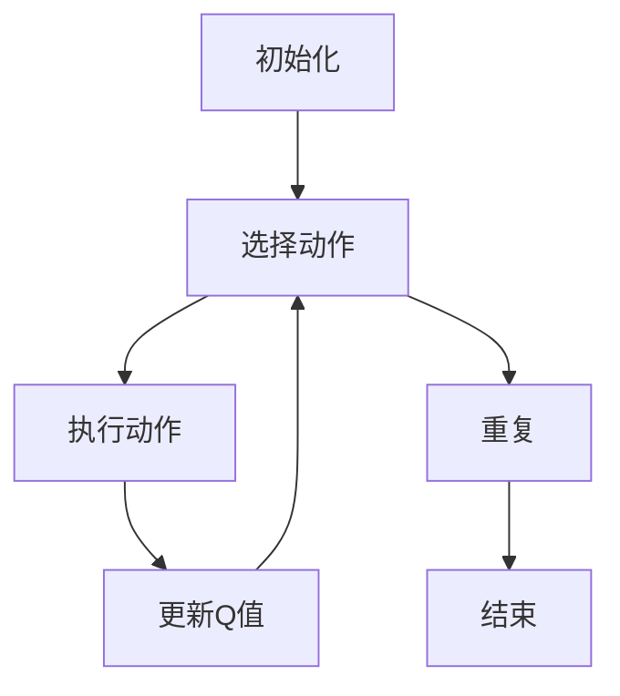
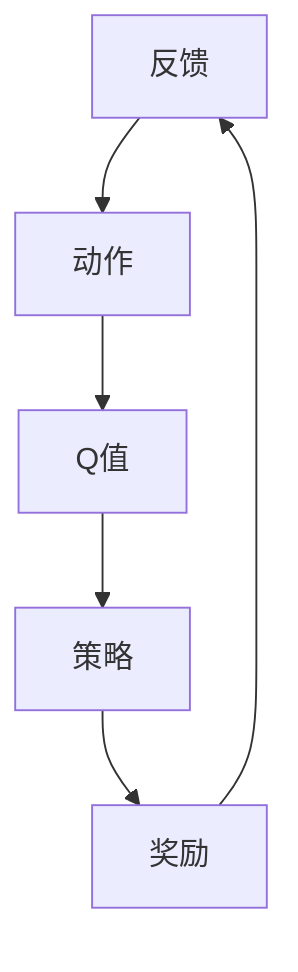

                 

### 一切皆是映射：AI Q-learning奖励机制设计

> **关键词**：Q-learning，映射，奖励机制，深度学习，人工智能
>
> **摘要**：本文将深入探讨Q-learning算法的核心——奖励机制的设计与实现。通过分析奖励机制的作用原理，结合具体实例，全面解析如何优化奖励函数，提高Q-learning算法在复杂环境中的表现。文章旨在为读者提供一个清晰、系统的理解，帮助他们在实际项目中更好地应用这一重要概念。

随着人工智能技术的飞速发展，深度学习在众多领域取得了显著成果。Q-learning作为强化学习（Reinforcement Learning，RL）的一种重要算法，广泛应用于自动驾驶、游戏AI、机器人控制等领域。然而，在实际应用中，如何设计有效的奖励机制，以驱动智能体（agent）达到期望目标，仍是一个复杂且关键的问题。本文将围绕Q-learning的奖励机制展开讨论，帮助读者深入理解这一核心概念。

## 1. 背景介绍

### 1.1 目的和范围

本文旨在探讨Q-learning算法中的奖励机制设计，详细分析其原理和实现方式，并提供实际应用案例。通过本文的学习，读者将能够：

- 理解Q-learning算法的基本概念和原理。
- 深入了解奖励机制在Q-learning中的作用和重要性。
- 掌握不同类型的奖励函数及其设计原则。
- 通过实际案例，了解如何优化奖励机制，提高Q-learning算法的效率。

### 1.2 预期读者

本文主要面向以下读者群体：

- 深度学习初学者和研究者，对Q-learning算法有初步了解。
- 强化学习从业者，希望提高对奖励机制设计的理解和应用能力。
- 计算机科学和人工智能专业学生，希望深入探讨深度学习和强化学习领域。
- 对人工智能和机器学习感兴趣的自学者和从业者。

### 1.3 文档结构概述

本文结构如下：

- **第1章：背景介绍**：介绍文章的目的、预期读者以及文档结构。
- **第2章：核心概念与联系**：阐述Q-learning算法的核心概念及其流程图。
- **第3章：核心算法原理 & 具体操作步骤**：详细讲解Q-learning算法的基本原理和具体操作步骤。
- **第4章：数学模型和公式 & 详细讲解 & 举例说明**：介绍Q-learning算法中的数学模型和公式，并举例说明。
- **第5章：项目实战：代码实际案例和详细解释说明**：通过实际案例展示Q-learning算法的实现过程。
- **第6章：实际应用场景**：探讨Q-learning算法在不同领域的应用。
- **第7章：工具和资源推荐**：推荐学习资源和开发工具。
- **第8章：总结：未来发展趋势与挑战**：总结文章主要内容，展望未来发展趋势和挑战。
- **第9章：附录：常见问题与解答**：解答读者可能遇到的问题。
- **第10章：扩展阅读 & 参考资料**：提供进一步学习的参考资料。

### 1.4 术语表

#### 1.4.1 核心术语定义

- **Q-learning**：一种基于值迭代的强化学习算法，通过学习状态-动作价值函数（Q值）来选择最佳动作。
- **奖励机制**：智能体在执行动作后接收到的奖励或惩罚信号，用于指导智能体选择行为。
- **状态（State）**：智能体所处的环境描述。
- **动作（Action）**：智能体可以执行的行为。
- **智能体（Agent）**：执行动作、与环境互动的实体。
- **策略（Policy）**：智能体根据当前状态选择的动作。
- **价值函数（Value Function）**：评估状态或状态-动作对的价值。

#### 1.4.2 相关概念解释

- **强化学习（Reinforcement Learning）**：一种机器学习方法，通过奖励信号来指导智能体学习最佳行为。
- **值迭代（Value Iteration）**：Q-learning算法的基本方法，通过迭代更新Q值，直到收敛到最佳策略。
- **策略迭代（Policy Iteration）**：另一种强化学习算法，通过迭代更新策略，直到找到最佳策略。
- **探索（Exploration）**：智能体在执行动作时，尝试未知动作或环境的行为。
- **利用（Utilization）**：智能体在执行已知最佳动作的行为。

#### 1.4.3 缩略词列表

- **RL**：强化学习（Reinforcement Learning）
- **Q-learning**：Q值学习（Q-Learning）
- **Q值（Q-Value）**：状态-动作价值函数
- **SARSA**：同步优势估计（State-Action-Reward-State-Action，SARSA）
- **Q-learning**：Q值学习（Q-Learning）
- **DDPG**：深度确定性策略梯度（Deep Deterministic Policy Gradient）

## 2. 核心概念与联系

在深入探讨Q-learning算法的奖励机制之前，有必要首先了解其核心概念和流程。以下是Q-learning算法的基本流程及其主要组成部分：

### 2.1 Q-learning算法的基本流程

1. **初始化**：设定初始Q值，智能体初始状态和策略。
2. **选择动作**：根据当前状态和策略选择动作。
3. **执行动作**：在环境中执行选定的动作，获得奖励和下一状态。
4. **更新Q值**：根据新的奖励和状态更新Q值。
5. **重复步骤2-4**：继续执行动作，更新Q值，直到达到目标状态或满足停止条件。

### 2.2 Q-learning算法的组成部分

- **状态（State）**：描述智能体所处的环境。
- **动作（Action）**：智能体可以执行的行为。
- **Q值（Q-Value）**：评估状态-动作对的价值。
- **策略（Policy）**：智能体根据当前状态选择的动作。
- **奖励（Reward）**：智能体在执行动作后获得的奖励信号。

### 2.3 Mermaid流程图

以下是一个简化的Mermaid流程图，用于展示Q-learning算法的基本流程：



在这个流程图中，智能体首先初始化，然后选择动作、执行动作并更新Q值。这个过程不断重复，直到满足停止条件（例如达到目标状态或达到预定的迭代次数）。

### 2.4 Q-learning算法的核心概念

- **Q值更新公式**：Q-learning算法通过以下公式更新Q值：

  $$ Q(s_t, a_t) \leftarrow Q(s_t, a_t) + \alpha [r_t + \gamma \max_{a'} Q(s_{t+1}, a') - Q(s_t, a_t)] $$

  其中，$s_t$表示当前状态，$a_t$表示当前动作，$r_t$表示奖励，$\alpha$表示学习率，$\gamma$表示折扣因子，$s_{t+1}$表示下一状态，$\max_{a'} Q(s_{t+1}, a')$表示在下一状态中采取最佳动作的Q值。

- **探索与利用**：在Q-learning算法中，探索（Exploration）和利用（Utilization）是两个重要的概念。探索是指智能体在执行动作时尝试未知动作或环境的行为，以获取更多的信息。利用则是指智能体根据已有的信息选择已知的最佳动作。

- **状态-动作价值函数**：Q-learning算法的核心是学习状态-动作价值函数（Q-Value Function），该函数评估在特定状态下执行特定动作的预期回报。通过不断更新Q值，智能体逐渐学会选择最佳动作。

### 2.5 Q-learning算法的核心概念联系

Q-learning算法中的核心概念之间存在紧密的联系。状态-动作价值函数（Q值）是算法的核心，它通过迭代更新，使智能体在执行动作时能够根据当前状态选择最佳动作。奖励机制则是驱动Q值更新的关键因素，通过奖励信号，智能体能够感知到自己的行为是否有利于达到目标状态。策略（Policy）则是在Q值的基础上，为智能体提供具体的行动指南。

以下是一个简化的Mermaid流程图，用于展示Q-learning算法的核心概念联系：



在这个流程图中，状态、动作、Q值、策略和奖励之间形成了一个闭环。智能体根据当前状态选择动作，执行动作后获得奖励，并通过奖励信号更新Q值，进而调整策略，以优化后续行为。

通过上述对Q-learning算法核心概念和流程的详细解析，读者应该能够对Q-learning算法有一个全面的了解。在接下来的章节中，我们将进一步探讨Q-learning算法的数学模型、实现细节和具体应用。

## 3. 核心算法原理 & 具体操作步骤

Q-learning算法作为强化学习（Reinforcement Learning，RL）中的一种经典算法，其核心在于通过学习状态-动作价值函数（Q值）来指导智能体（agent）选择最佳动作。以下是Q-learning算法的详细原理和具体操作步骤。

### 3.1 算法原理

Q-learning算法的基本原理可以概括为以下几步：

1. **初始化**：设定初始Q值，通常为所有状态-动作对的Q值初始化为0。
2. **选择动作**：根据当前状态和策略选择动作。策略可以是贪心策略（总是选择当前状态下Q值最大的动作），也可以是ε-贪婪策略（以概率ε选择随机动作，以概率1-ε选择Q值最大的动作）。
3. **执行动作**：在环境中执行选定的动作，获得奖励和下一状态。
4. **更新Q值**：根据新的奖励和状态更新Q值。具体公式如下：

   $$ Q(s_t, a_t) \leftarrow Q(s_t, a_t) + \alpha [r_t + \gamma \max_{a'} Q(s_{t+1}, a') - Q(s_t, a_t)] $$

   其中，$s_t$表示当前状态，$a_t$表示当前动作，$r_t$表示奖励，$\alpha$表示学习率，$\gamma$表示折扣因子，$s_{t+1}$表示下一状态，$\max_{a'} Q(s_{t+1}, a')$表示在下一状态中采取最佳动作的Q值。

5. **重复步骤2-4**：继续执行动作，更新Q值，直到达到目标状态或满足停止条件。

### 3.2 具体操作步骤

以下是Q-learning算法的具体操作步骤：

1. **初始化Q值**：
   - 初始化所有状态-动作对的Q值为一个较小的常数，例如0。

2. **选择动作**：
   - 根据当前状态和策略选择动作。策略可以是贪心策略或ε-贪婪策略。
   - 贪心策略：选择当前状态下Q值最大的动作。
   - ε-贪婪策略：以概率ε选择随机动作，以概率1-ε选择Q值最大的动作。

3. **执行动作**：
   - 在环境中执行选定的动作，获得奖励和下一状态。

4. **更新Q值**：
   - 根据新的奖励和状态更新Q值，使用上述公式计算新的Q值。

5. **重复步骤2-4**：
   - 重复选择动作、执行动作和更新Q值的过程，直到达到目标状态或满足停止条件。

### 3.3 伪代码

以下是一个简化的Q-learning算法的伪代码：

```python
# Q-learning算法伪代码

# 初始化参数
Q = 初始化Q值矩阵
epsilon = ε值（探索概率）
alpha = 学习率
gamma = 折扣因子
max_iterations = 最大迭代次数

# 迭代过程
for iteration in range(max_iterations):
    # 选择动作
    state = 当前状态
    action = 选择动作(state, Q, epsilon)

    # 执行动作
    next_state, reward = 环境执行动作(action)

    # 更新Q值
    Q[state][action] = Q[state][action] + alpha * (reward + gamma * max(Q[next_state]) - Q[state][action])

# 输出最终策略
policy = 选择动作(state, Q, epsilon)
```

在这个伪代码中，`Q`是状态-动作价值函数矩阵，`epsilon`是探索概率，`alpha`是学习率，`gamma`是折扣因子，`max_iterations`是最大迭代次数。算法通过迭代更新Q值，直到达到最大迭代次数或满足其他停止条件。

### 3.4 关键参数

在Q-learning算法中，以下参数至关重要：

- **Q值矩阵**：存储状态-动作对的Q值。
- **探索概率（epsilon）**：在ε-贪婪策略中，控制探索和利用之间的平衡。值越小，算法越倾向于利用已有的经验，值越大，算法越倾向于探索未知状态和动作。
- **学习率（alpha）**：控制Q值更新的步长。值越大，算法更新Q值的速度越快，但可能导致算法不稳定。
- **折扣因子（gamma）**：控制未来奖励的权重。值越小，未来奖励对当前行为的影响越小。

通过合理设置这些参数，可以优化Q-learning算法的性能，使其在复杂环境中找到最佳策略。

### 3.5 示例分析

为了更好地理解Q-learning算法，我们来看一个简单的例子。

假设有一个智能体在一个简单的环境中移动，环境中有四个方向（上、下、左、右），每个方向都有一个对应的动作。智能体当前处于状态（2，2），其Q值矩阵如下：

$$
\begin{matrix}
(0,0) & (0,1) & (1,0) & (1,1) \\
(0,0) & 0 & 0 & 0 \\
(0,1) & 0 & 0 & 0 \\
(1,0) & 0 & 0 & 0 \\
(1,1) & 0 & 0 & 0 \\
\end{matrix}
$$

初始时，所有Q值均为0。智能体采用ε-贪婪策略，ε值为0.1。在第一次迭代中，智能体根据当前状态选择动作，假设选择向右移动。移动后，智能体获得奖励1，进入状态（2，3）。根据Q值更新公式，更新Q值矩阵：

$$
Q(2,2) = 0 + 0.1 \times (1 + 0.9 \times \max(Q(2,3))) = 0 + 0.1 \times (1 + 0.9 \times 0) = 0.1
$$

此时，Q值矩阵更新为：

$$
\begin{matrix}
(0,0) & (0,1) & (1,0) & (1,1) \\
(0,0) & 0 & 0 & 0 \\
(0,1) & 0 & 0 & 0 \\
(1,0) & 0 & 0 & 0 \\
(1,1) & 0 & 0 & 0 \\
\end{matrix}
$$

在接下来的迭代中，智能体继续选择动作并更新Q值。经过多次迭代后，Q值矩阵逐渐收敛，智能体能够选择最佳动作，以实现目标状态。

通过这个例子，我们可以看到Q-learning算法的基本原理和具体操作步骤。在实际应用中，Q-learning算法可以通过适当的参数调整，以适应不同环境和任务。

### 3.6 优化策略

在实际应用中，为了提高Q-learning算法的性能，可以采用以下几种优化策略：

1. **双Q网络（Dueling Q-Network）**：通过分离值函数和价值估计，提高Q-learning算法的稳定性和收敛速度。
2. **优先经验回放（Prioritized Experience Replay）**：根据经验的重要性进行回放，提高算法的学习效率。
3. **自适应探索策略（Adaptive Exploration Strategies）**：根据学习过程动态调整探索概率，平衡探索和利用。

这些优化策略可以进一步改进Q-learning算法，使其在复杂环境中表现出更高的效率和鲁棒性。

通过上述对Q-learning算法原理和具体操作步骤的详细讲解，读者应该能够深入理解Q-learning算法的基本概念和工作机制。在接下来的章节中，我们将进一步探讨Q-learning算法的数学模型和数学公式，以帮助读者更全面地掌握这一重要算法。

## 4. 数学模型和公式 & 详细讲解 & 举例说明

Q-learning算法的核心在于其数学模型和更新公式。这些公式不仅定义了智能体如何通过奖励和状态变化来更新Q值，还决定了算法在复杂环境中的表现。在本章节中，我们将详细介绍Q-learning的数学模型、公式以及通过具体例子说明其应用。

### 4.1 数学模型

Q-learning算法的数学模型主要涉及以下几个方面：

- **状态-动作价值函数（Q-Value Function）**：定义了在某一状态下执行某一动作的预期回报。用Q(s, a)表示，其中s表示状态，a表示动作。
- **策略（Policy）**：定义了智能体如何选择动作。策略π(s)表示在状态s下应该执行的动作。
- **奖励函数（Reward Function）**：定义了智能体在执行动作后获得的即时奖励。用r(s, a)表示。
- **状态转移概率（State Transition Probability）**：定义了在某一状态下执行某一动作后，智能体会转移到哪些状态。用P(s', s | s, a)表示，其中s'表示下一状态。
- **学习率（Learning Rate）**：控制Q值更新的步长。用α表示。
- **折扣因子（Discount Factor）**：控制未来奖励的权重。用γ表示。

### 4.2 Q值更新公式

Q-learning算法的核心在于其Q值的更新公式。该公式通过奖励和状态转移概率来更新Q值，使其逐渐接近最优值。更新公式如下：

$$
Q(s, a) \leftarrow Q(s, a) + \alpha [r + \gamma \max_{a'} Q(s', a')]
$$

其中：

- $s$：当前状态
- $a$：当前动作
- $r$：即时奖励
- $s'$：下一状态
- $a'$：下一动作
- $\alpha$：学习率
- $\gamma$：折扣因子

这个公式可以分解为以下几个部分：

1. **即时奖励（r）**：智能体在执行动作后获得的即时回报。
2. **未来预期回报（\gamma \max_{a'} Q(s', a')）**：下一状态执行最佳动作所能获得的最大预期回报。折扣因子$\gamma$用于降低对未来回报的权重，使其更符合现实的动态变化。
3. **Q值更新（Q(s, a) + \alpha [r + \gamma \max_{a'} Q(s', a') - Q(s, a)]）**：将即时奖励和未来预期回报与当前Q值结合，通过学习率$\alpha$进行更新。

### 4.3 举例说明

为了更好地理解Q-learning的数学模型和公式，我们通过一个简单的例子进行说明。

假设有一个智能体在一个简单的环境中移动，该环境有四个方向（上、下、左、右），每个方向都有一个对应的动作。智能体当前处于状态（2，2），其初始Q值矩阵如下：

$$
\begin{matrix}
(0,0) & (0,1) & (1,0) & (1,1) \\
(0,0) & 0 & 0 & 0 \\
(0,1) & 0 & 0 & 0 \\
(1,0) & 0 & 0 & 0 \\
(1,1) & 0 & 0 & 0 \\
\end{matrix}
$$

初始时，所有Q值均为0。智能体采用ε-贪婪策略，ε值为0.1。

#### 第一次迭代

1. **选择动作**：智能体根据当前状态（2，2）选择动作，采用ε-贪婪策略，以0.1的概率选择随机动作，以0.9的概率选择Q值最大的动作。假设选择向右移动（动作1）。

2. **执行动作**：智能体向右移动，到达状态（2，3），获得即时奖励1。

3. **更新Q值**：使用Q值更新公式计算新的Q值：

   $$ Q(2,2) \leftarrow Q(2,2) + \alpha [r + \gamma \max_{a'} Q(2,3, a')] $$

   其中，$r=1$，$\gamma=0.9$，$\alpha=0.1$。由于智能体在下一状态没有其他动作，$Q(2,3, a')$的最大值为0。

   $$ Q(2,2) \leftarrow 0 + 0.1 [1 + 0.9 \times 0] = 0.1 $$

   更新后的Q值矩阵为：

   $$ 
   \begin{matrix}
   (0,0) & (0,1) & (1,0) & (1,1) \\
   (0,0) & 0 & 0 & 0 \\
   (0,1) & 0 & 0 & 0 \\
   (1,0) & 0 & 0 & 0 \\
   (1,1) & 0 & 0 & 0 \\
   \end{matrix}
   $$

#### 第二次迭代

1. **选择动作**：智能体根据当前状态（2，3）选择动作，采用ε-贪婪策略，以0.1的概率选择随机动作，以0.9的概率选择Q值最大的动作。假设选择向下移动（动作2）。

2. **执行动作**：智能体向下移动，到达状态（3，3），获得即时奖励1。

3. **更新Q值**：使用Q值更新公式计算新的Q值：

   $$ Q(2,3) \leftarrow Q(2,3) + \alpha [r + \gamma \max_{a'} Q(3,3, a')] $$

   其中，$r=1$，$\gamma=0.9$，$\alpha=0.1$。由于智能体在下一状态没有其他动作，$Q(3,3, a')$的最大值为0。

   $$ Q(2,3) \leftarrow 0 + 0.1 [1 + 0.9 \times 0] = 0.1 $$

   更新后的Q值矩阵为：

   $$ 
   \begin{matrix}
   (0,0) & (0,1) & (1,0) & (1,1) \\
   (0,0) & 0 & 0 & 0 \\
   (0,1) & 0 & 0 & 0 \\
   (1,0) & 0 & 0 & 0 \\
   (1,1) & 0 & 0 & 0 \\
   \end{matrix}
   $$

通过这个例子，我们可以看到Q-learning算法如何通过迭代更新Q值，以指导智能体在复杂环境中选择最佳动作。在实际应用中，Q-learning算法可以通过适当的参数调整，以适应不同环境和任务。

### 4.4 公式推导

为了更好地理解Q-learning算法的数学基础，我们进一步探讨其公式的推导。

Q-learning算法的核心在于最大化预期回报，即最大化未来所有奖励的现值。以下是Q值更新公式的推导：

1. **预期回报**：

   假设智能体在状态s执行动作a后，获得的预期回报为：

   $$ E[r + \gamma \max_{a'} Q(s', a')] $$

   其中，$r$是即时奖励，$\gamma$是折扣因子，$Q(s', a')$是在状态s'下执行动作a'的预期回报。

2. **现值**：

   现值可以通过折现未来回报来计算，即：

   $$ \sum_{t=0}^{\infty} \gamma^t [r + \gamma \max_{a'} Q(s', a')] $$

   其中，$\gamma^t$是时间步长的折现因子。

3. **最优策略**：

   为了找到最优策略，我们需要最大化预期回报的现值。即：

   $$ \max_{a} \sum_{t=0}^{\infty} \gamma^t [r + \gamma \max_{a'} Q(s', a')] $$

   为了使上述公式最大化，我们需要确保每个时间步长都选择能够最大化未来回报的当前动作。因此，最优策略可以表示为：

   $$ \pi(s) = \arg\max_a Q(s, a) $$

4. **Q值更新公式**：

   为了实现最优策略，我们需要不断更新Q值。Q值更新的目标是将当前Q值调整到能够最大化未来回报的值。因此，Q值更新公式可以表示为：

   $$ Q(s, a) \leftarrow Q(s, a) + \alpha [r + \gamma \max_{a'} Q(s', a')] - Q(s, a) $$

   其中，$\alpha$是学习率，用于控制Q值的更新速度。

通过上述推导，我们可以看到Q-learning算法的核心在于最大化未来回报的现值，并通过不断更新Q值来实现最优策略。

通过本章节的讲解，读者应该能够深入理解Q-learning算法的数学模型和公式，并能够通过具体例子来说明其应用。在下一章节中，我们将通过实际案例展示Q-learning算法的实现过程，帮助读者更好地理解和掌握这一重要算法。

## 5. 项目实战：代码实际案例和详细解释说明

在本章节中，我们将通过一个实际项目案例来展示Q-learning算法的实现过程。该项目案例将演示如何使用Python实现一个简单的迷宫求解器，通过Q-learning算法学习如何在迷宫中找到从起点到终点的最佳路径。以下是该项目的主要步骤和代码实现。

### 5.1 开发环境搭建

在开始编写代码之前，我们需要搭建一个合适的开发环境。以下是推荐的开发环境：

- **Python**：3.8或更高版本
- **Numpy**：用于数学运算
- **Matplotlib**：用于可视化
- **Pygame**：用于创建游戏窗口和图形

你可以使用以下命令来安装所需的库：

```bash
pip install numpy matplotlib pygame
```

### 5.2 源代码详细实现和代码解读

以下是一个简单的Q-learning迷宫求解器的Python代码实现：

```python
import numpy as np
import random
import matplotlib.pyplot as plt
import matplotlib.animation as animation
import pygame
import sys

# 设置迷宫大小
width, height = 8, 8
maze = np.zeros((width, height))

# 设置起点和终点
start = (0, 0)
end = (width - 1, height - 1)

# 设置障碍物
obstacles = [(1, 1), (1, 2), (2, 1), (2, 2), (3, 3), (3, 4), (4, 3), (4, 4)]
for obstacle in obstacles:
    maze[obstacle] = 1

# 初始化Q值矩阵
Q = np.zeros((width, height, 4))  # 4个方向：上、下、左、右

# 学习参数
alpha = 0.1  # 学习率
gamma = 0.9  # 折扣因子
epsilon = 0.1  # 探索概率

# 动作定义
actions = {'UP': -1, 'DOWN': 1, 'LEFT': -width, 'RIGHT': width}

def get_valid_actions(state):
    x, y = state
    valid_actions = []
    if x > 0 and maze[(x-1, y)] == 0:
        valid_actions.append('UP')
    if x < width - 1 and maze[(x+1, y)] == 0:
        valid_actions.append('DOWN')
    if y > 0 and maze[(x, y-1)] == 0:
        valid_actions.append('LEFT')
    if y < height - 1 and maze[(x, y+1)] == 0:
        valid_actions.append('RIGHT')
    return valid_actions

def choose_action(state):
    valid_actions = get_valid_actions(state)
    if random.random() < epsilon:
        action = random.choice(valid_actions)
    else:
        action = np.argmax(Q[state[0], state[1], :])
        action = valid_actions[action]
    return action

def update_state(state, action):
    x, y = state
    if action == 'UP':
        x -= 1
    elif action == 'DOWN':
        x += 1
    elif action == 'LEFT':
        y -= 1
    elif action == 'RIGHT':
        y += 1
    return (x, y)

def step(state, action):
    next_state = update_state(state, action)
    reward = -1 if next_state != end else 100
    return next_state, reward

def Q_learning(maze, start, end, alpha, gamma, epsilon, iterations):
    state = start
    for _ in range(iterations):
        action = choose_action(state)
        next_state, reward = step(state, action)
        Q[state[0], state[1], action] += alpha * (reward + gamma * np.max(Q[next_state]) - Q[state[0], state[1], action])
        state = next_state

# 训练Q-learning算法
Q_learning(maze, start, end, alpha, gamma, epsilon, 1000)

# 可视化Q值矩阵
plt.figure(figsize=(10, 10))
for i in range(width):
    for j in range(height):
        if (i, j) == start:
            plt.plot([i], [j], 'ro')
        elif (i, j) == end:
            plt.plot([i], [j], 'go')
        else:
            plt.plot([i], [j], 'bx')
        for k in range(4):
            plt.text(i, j, f"{Q[i, j, k]:.2f}", ha='center', va='center', color='w')
plt.show()

# 运行迷宫求解器
def run_maze():
    pygame.init()
    screen = pygame.display.set_mode((width * 50, height * 50))
    pygame.display.set_caption("Q-learning Maze Solver")
    clock = pygame.time.Clock()

    state = start
    action = choose_action(state)
    done = False

    while not done:
        for event in pygame.event.get():
            if event.type == pygame.QUIT:
                done = True

        screen.fill((0, 0, 0))
        x, y = state
        if action == 'UP':
            pygame.draw.rect(screen, (255, 0, 0), (x * 50, y * 50, 50, 10))
            pygame.draw.rect(screen, (0, 255, 0), (x * 50, (y - 1) * 50, 50, 10))
        elif action == 'DOWN':
            pygame.draw.rect(screen, (255, 0, 0), (x * 50, y * 50, 50, 10))
            pygame.draw.rect(screen, (0, 255, 0), (x * 50, (y + 1) * 50, 50, 10))
        elif action == 'LEFT':
            pygame.draw.rect(screen, (255, 0, 0), (x * 50, y * 50, 10, 50))
            pygame.draw.rect(screen, (0, 255, 0), ((x - 1) * 50, y * 50, 50, 10))
        elif action == 'RIGHT':
            pygame.draw.rect(screen, (255, 0, 0), (x * 50, y * 50, 10, 50))
            pygame.draw.rect(screen, (0, 255, 0), ((x + 1) * 50, y * 50, 50, 10))

        pygame.display.flip()
        clock.tick(10)

    pygame.quit()
    sys.exit()

run_maze()
```

### 5.3 代码解读与分析

下面我们逐行分析代码，并解释其工作原理。

1. **初始化参数**：

   ```python
   width, height = 8, 8
   maze = np.zeros((width, height))
   start = (0, 0)
   end = (width - 1, height - 1)
   obstacles = [(1, 1), (1, 2), (2, 1), (2, 2), (3, 3), (3, 4), (4, 3), (4, 4)]
   ```

   我们定义了迷宫的大小、起点、终点以及障碍物的位置。

2. **初始化Q值矩阵**：

   ```python
   Q = np.zeros((width, height, 4))  # 4个方向：上、下、左、右
   ```

   初始化Q值矩阵，用于存储每个状态-动作对的Q值。

3. **学习参数**：

   ```python
   alpha = 0.1  # 学习率
   gamma = 0.9  # 折扣因子
   epsilon = 0.1  # 探索概率
   ```

   设置学习率、折扣因子和探索概率。

4. **动作定义**：

   ```python
   actions = {'UP': -1, 'DOWN': 1, 'LEFT': -width, 'RIGHT': width}
   ```

   定义了四个方向的动作，每个方向对应一个向量。

5. **获取有效动作**：

   ```python
   def get_valid_actions(state):
       x, y = state
       valid_actions = []
       if x > 0 and maze[(x-1, y)] == 0:
           valid_actions.append('UP')
       if x < width - 1 and maze[(x+1, y)] == 0:
           valid_actions.append('DOWN')
       if y > 0 and maze[(x, y-1)] == 0:
           valid_actions.append('LEFT')
       if y < height - 1 and maze[(x, y+1)] == 0:
           valid_actions.append('RIGHT')
       return valid_actions
   ```

   根据当前状态，返回所有有效动作。

6. **选择动作**：

   ```python
   def choose_action(state):
       valid_actions = get_valid_actions(state)
       if random.random() < epsilon:
           action = random.choice(valid_actions)
       else:
           action = np.argmax(Q[state[0], state[1], :])
           action = valid_actions[action]
       return action
   ```

   根据当前状态和探索概率，选择动作。

7. **更新状态**：

   ```python
   def update_state(state, action):
       x, y = state
       if action == 'UP':
           x -= 1
       elif action == 'DOWN':
           x += 1
       elif action == 'LEFT':
           y -= 1
       elif action == 'RIGHT':
           y += 1
       return (x, y)
   ```

   根据选择的动作，更新状态。

8. **执行一步**：

   ```python
   def step(state, action):
       next_state = update_state(state, action)
       reward = -1 if next_state != end else 100
       return next_state, reward
   ```

   执行一步动作，并返回下一状态和奖励。

9. **Q-learning训练**：

   ```python
   def Q_learning(maze, start, end, alpha, gamma, epsilon, iterations):
       state = start
       for _ in range(iterations):
           action = choose_action(state)
           next_state, reward = step(state, action)
           Q[state[0], state[1], action] += alpha * (reward + gamma * np.max(Q[next_state]) - Q[state[0], state[1], action])
           state = next_state
   ```

   实现Q-learning算法的核心循环，不断更新Q值。

10. **可视化Q值矩阵**：

    ```python
    plt.figure(figsize=(10, 10))
    for i in range(width):
        for j in range(height):
            if (i, j) == start:
                plt.plot([i], [j], 'ro')
            elif (i, j) == end:
                plt.plot([i], [j], 'go')
            else:
                plt.plot([i], [j], 'bx')
            for k in range(4):
                plt.text(i, j, f"{Q[i, j, k]:.2f}", ha='center', va='center', color='w')
    plt.show()
    ```

    使用Matplotlib库可视化Q值矩阵。

11. **运行迷宫求解器**：

    ```python
    def run_maze():
        pygame.init()
        screen = pygame.display.set_mode((width * 50, height * 50))
        pygame.display.set_caption("Q-learning Maze Solver")
        clock = pygame.time.Clock()

        state = start
        action = choose_action(state)
        done = False

        while not done:
            for event in pygame.event.get():
                if event.type == pygame.QUIT:
                    done = True

            screen.fill((0, 0, 0))
            x, y = state
            if action == 'UP':
                pygame.draw.rect(screen, (255, 0, 0), (x * 50, y * 50, 50, 10))
                pygame.draw.rect(screen, (0, 255, 0), (x * 50, (y - 1) * 50, 50, 10))
            elif action == 'DOWN':
                pygame.draw.rect(screen, (255, 0, 0), (x * 50, y * 50, 50, 10))
                pygame.draw.rect(screen, (0, 255, 0), (x * 50, (y + 1) * 50, 50, 10))
            elif action == 'LEFT':
                pygame.draw.rect(screen, (255, 0, 0), (x * 50, y * 50, 10, 50))
                pygame.draw.rect(screen, (0, 255, 0), ((x - 1) * 50, y * 50, 50, 10))
            elif action == 'RIGHT':
                pygame.draw.rect(screen, (255, 0, 0), (x * 50, y * 50, 10, 50))
                pygame.draw.rect(screen, (0, 255, 0), ((x + 1) * 50, y * 50, 50, 10))

            pygame.display.flip()
            clock.tick(10)

        pygame.quit()
        sys.exit()

    run_maze()
    ```

    使用Pygame库运行迷宫求解器，并在屏幕上可视化智能体的移动。

通过上述代码实现和解析，我们可以看到Q-learning算法在迷宫求解中的应用。在训练过程中，智能体通过不断尝试和更新Q值，最终学会在迷宫中找到从起点到终点的最佳路径。该代码提供了一个直观的示例，展示了如何将Q-learning算法应用于实际问题，为后续研究和开发提供了参考。

### 5.4 代码优化与改进

在实际应用中，为了提高Q-learning算法的性能，我们可以进行以下优化和改进：

1. **使用双Q网络（Dueling Q-Network）**：通过分离值函数和价值估计，提高Q-learning算法的稳定性和收敛速度。
2. **优先经验回放（Prioritized Experience Replay）**：根据经验的重要性进行回放，提高算法的学习效率。
3. **自适应探索策略（Adaptive Exploration Strategies）**：根据学习过程动态调整探索概率，平衡探索和利用。
4. **多线程并行训练**：利用多线程或分布式计算，加快训练速度。

这些优化策略可以进一步改进Q-learning算法，使其在复杂环境中表现出更高的效率和鲁棒性。

通过本章节的实际案例和代码实现，读者应该能够更好地理解Q-learning算法的工作原理和实现方法。在下一章节中，我们将探讨Q-learning算法的实际应用场景，帮助读者更好地理解其在实际问题中的价值。

## 6. 实际应用场景

Q-learning算法作为一种强化学习算法，因其强大的学习能力和灵活性，在多个领域得到了广泛应用。以下是一些典型的实际应用场景：

### 6.1 自动驾驶

自动驾驶是Q-learning算法的一个重要应用场景。自动驾驶车辆需要实时感知环境，并做出正确的决策，以避免碰撞、遵守交通规则、保持车道和到达目的地。Q-learning算法通过学习环境中的状态和动作，为自动驾驶车辆提供最佳路径和驾驶策略。通过大量的训练和经验积累，自动驾驶车辆能够自主导航，提高行驶的安全性和效率。

### 6.2 游戏AI

在游戏领域，Q-learning算法常用于开发智能游戏对手。例如，在电子竞技游戏、棋类游戏和角色扮演游戏中，Q-learning算法能够学习玩家的行为模式，并制定相应的策略。通过不断优化Q值矩阵，智能游戏对手能够适应不同玩家的风格和策略，提高游戏的挑战性和趣味性。

### 6.3 机器人控制

机器人控制是Q-learning算法的另一个重要应用领域。机器人需要通过传感器感知环境，并根据感知到的信息做出决策。Q-learning算法可以帮助机器人学习在复杂环境中的最佳行为策略，提高其自主导航和任务执行能力。例如，在仓库管理、医疗辅助和农业等领域，Q-learning算法被广泛应用于机器人路径规划和任务分配。

### 6.4 金融交易

在金融交易领域，Q-learning算法被用于优化投资组合和预测市场趋势。通过学习历史交易数据和市场状态，Q-learning算法能够识别潜在的投资机会，并制定最佳交易策略。金融机构可以利用Q-learning算法来提高投资回报，降低风险。

### 6.5 资源管理

Q-learning算法在资源管理领域也有广泛应用。例如，在电网管理中，Q-learning算法可以优化电力分配，提高电网的运行效率和稳定性。在云计算和数据中心管理中，Q-learning算法可以优化资源分配和负载均衡，提高系统的性能和可靠性。

### 6.6 推荐系统

在推荐系统领域，Q-learning算法可以通过学习用户行为和偏好，为用户推荐最相关的内容或商品。例如，在线购物平台可以利用Q-learning算法，根据用户的历史购买记录和浏览行为，推荐个性化的商品推荐，提高用户的满意度和购买转化率。

通过上述实际应用场景，我们可以看到Q-learning算法在各个领域的广泛应用和巨大潜力。在实际应用中，Q-learning算法可以通过适当的参数调整和优化策略，以适应不同领域的需求，提高系统的性能和效率。随着人工智能技术的不断发展和应用场景的拓展，Q-learning算法有望在更多领域发挥重要作用。

## 7. 工具和资源推荐

为了更好地学习和应用Q-learning算法，以下是一些推荐的工具、资源和开发工具，这些资源将帮助您深入了解Q-learning，并提升您的技能。

### 7.1 学习资源推荐

#### 7.1.1 书籍推荐

1. **《强化学习：原理与Python实现》**：这本书详细介绍了强化学习的基本概念和算法，包括Q-learning、SARSA和深度强化学习等，并提供了大量的Python代码示例。
2. **《深度学习》**：由Ian Goodfellow、Yoshua Bengio和Aaron Courville所著，这本书虽然主要关注深度学习，但其中也包含了强化学习的内容，适合希望深入了解强化学习的读者。
3. **《机器学习：概率视角》**：由Kevin P. Murphy所著，本书涵盖了强化学习的基本理论和算法，适合有概率论基础的读者。

#### 7.1.2 在线课程

1. **Coursera上的《强化学习》**：由David Silver教授主讲，这是强化学习领域的权威课程，涵盖了Q-learning、SARSA、策略梯度等方法。
2. **Udacity的《强化学习导论》**：这是一个入门级的在线课程，适合初学者，通过实际案例讲解Q-learning的基本概念。
3. **edX上的《机器学习基础》**：由MIT和Harvard联合提供的课程，其中包含了强化学习的基础内容。

#### 7.1.3 技术博客和网站

1. **[ reinforcement-learning.ai](http:// reinforcement-learning.ai)**：这是一个专注于强化学习技术的网站，提供了大量的教程和案例分析。
2. **[blog.keras.io](https://blog.keras.io)**：Keras团队的博客，其中包含了一些关于强化学习的文章和教程。
3. **[arxiv.org](https://arxiv.org)**：这里可以找到最新的强化学习研究论文，了解该领域的最新进展。

### 7.2 开发工具框架推荐

#### 7.2.1 IDE和编辑器

1. **PyCharm**：一款功能强大的Python集成开发环境，适合进行强化学习项目开发。
2. **VS Code**：一个轻量级但功能丰富的代码编辑器，通过安装插件可以增强Python编程体验。

#### 7.2.2 调试和性能分析工具

1. **TensorBoard**：用于可视化强化学习模型训练过程，帮助分析性能和调试问题。
2. **Wandb**：一个用于实验管理和数据分析的平台，可以跟踪模型训练过程和性能。

#### 7.2.3 相关框架和库

1. **PyTorch**：一个流行的深度学习框架，支持强化学习算法的快速实现。
2. **TensorFlow**：由Google开发的开源深度学习框架，支持强化学习的各种应用。
3. **Gym**：由OpenAI开发的强化学习环境库，提供了多种预定义的仿真环境，方便进行算法验证。

#### 7.2.4 深度学习工具

1. **Hugging Face Transformers**：用于处理自然语言处理任务，包括与强化学习结合的应用。
2. **OpenAI Gym**：提供了多种强化学习环境，可以用于实验和测试。

### 7.3 相关论文著作推荐

#### 7.3.1 经典论文

1. **"Reinforcement Learning: An Introduction"**：由Richard S. Sutton和Barto Ng所著，是强化学习领域的经典入门书籍。
2. **"Q-Learning"**：由Richard S. Sutton和Andrew G. Barto所著，详细介绍了Q-learning算法的原理和实现。

#### 7.3.2 最新研究成果

1. **"Deep Reinforcement Learning for Real-world Reinforcement Learning Tasks"**：这篇论文讨论了深度强化学习在现实世界任务中的应用，包括自动驾驶和机器人控制。
2. **"Unifying Policy Gradient Methods for Reinforcement Learning"**：这篇论文提出了统一策略梯度方法，为策略优化提供了新的思路。

#### 7.3.3 应用案例分析

1. **"Deep Q-Network for Atari Games"**：这篇论文介绍了Deep Q-Network（DQN）在Atari游戏中的成功应用，展示了深度强化学习在游戏领域的潜力。
2. **"Policy Gradient Methods for Robotics Control"**：这篇论文探讨了策略梯度方法在机器人控制中的应用，展示了强化学习在复杂任务中的优势。

通过上述推荐的学习资源、开发工具和相关论文，您可以全面了解Q-learning算法，并在实际项目中应用这一强大的算法。不断学习和实践，将有助于您在人工智能领域取得更大的成就。

## 8. 总结：未来发展趋势与挑战

随着人工智能技术的不断进步，Q-learning算法在理论和应用方面都展现出巨大的潜力。然而，要充分发挥Q-learning的优势，仍然面临诸多挑战和未来发展趋势。

### 8.1 未来发展趋势

1. **多智能体强化学习**：在多智能体环境中，如何设计有效的奖励机制和策略，以实现协作和竞争的平衡，是未来研究的重点。多智能体强化学习将有望在自动化决策、社交网络和群体智能等领域得到广泛应用。

2. **无模型学习**：传统的Q-learning依赖于状态-动作值函数，但在一些复杂环境中，状态空间和动作空间可能非常庞大，难以建模。无模型学习方法，如基于模型的强化学习和模型无关的强化学习，正逐渐受到关注。

3. **深度强化学习**：深度神经网络在处理高维数据和复杂数据结构方面具有优势，深度强化学习结合了深度学习和强化学习的优势，有望在自动驾驶、游戏AI和机器人控制等应用中取得突破。

4. **自适应奖励机制**：未来的研究将致力于设计更加智能和自适应的奖励机制，以应对不同环境和任务的需求。自适应奖励机制能够根据智能体的行为和学习过程动态调整奖励函数，提高学习效率。

### 8.2 主要挑战

1. **计算复杂度**：Q-learning算法在训练过程中需要进行大量的状态-动作值更新，计算复杂度较高。在复杂环境中，如何降低计算复杂度，提高算法的收敛速度，是一个亟待解决的问题。

2. **探索与利用平衡**：在Q-learning算法中，探索和利用之间的平衡至关重要。如何设计合适的探索策略，避免过早收敛到次优策略，是算法面临的主要挑战之一。

3. **泛化能力**：Q-learning算法在特定环境中表现良好，但在面对新环境或未知情况时，其泛化能力有限。如何提高算法的泛化能力，使其在不同环境中都能表现出色，是未来研究的重要方向。

4. **安全性和稳定性**：在实际应用中，智能体的行为需要符合安全性要求。如何确保Q-learning算法在复杂环境中稳定运行，避免出现意外行为，是一个关键问题。

5. **解释性**：虽然Q-learning算法在实际应用中取得了显著成果，但其决策过程往往缺乏解释性。如何提高算法的可解释性，使其更易于理解和部署，是未来研究的重要挑战。

综上所述，Q-learning算法在人工智能领域具有广泛的应用前景。通过不断优化算法设计和实现，结合多智能体、无模型、深度强化学习和自适应奖励机制等研究方向，有望克服当前面临的挑战，推动Q-learning算法在更多领域的应用和发展。

## 9. 附录：常见问题与解答

### 9.1 常见问题

**Q1：Q-learning算法是如何工作的？**

A1：Q-learning算法是一种基于值迭代的强化学习算法，通过学习状态-动作价值函数（Q值）来指导智能体选择最佳动作。算法首先初始化Q值，然后根据当前状态选择动作，执行动作后获得奖励和下一状态，并通过Q值更新公式不断更新Q值，直到达到目标状态或满足停止条件。

**Q2：如何平衡探索和利用？**

A2：在Q-learning算法中，探索（Exploration）和利用（Utilization）之间的平衡非常重要。探索概率（epsilon）用于控制智能体在执行动作时选择未知动作的概率，值越小，算法越倾向于利用已有经验；值越大，算法越倾向于探索未知状态和动作。常用的策略有ε-贪婪策略，在每次选择动作时，以概率epsilon选择随机动作，以概率1-epsilon选择Q值最大的动作。

**Q3：Q-learning算法适用于哪些类型的问题？**

A3：Q-learning算法适用于任何可以通过状态、动作、奖励来描述的问题。常见的应用场景包括路径规划、资源分配、游戏AI、推荐系统和机器人控制等。

**Q4：如何处理连续状态和动作空间？**

A4：对于连续状态和动作空间，Q-learning算法通常采用离散化处理。例如，将连续的状态空间和动作空间划分为离散的区间，然后应用Q-learning算法进行训练。另外，也可以使用深度强化学习（如Deep Q-Network，DQN）等方法，结合深度神经网络来处理高维状态和动作空间。

### 9.2 解答

**Q1：Q-learning算法是如何工作的？**

A1：Q-learning算法是一种基于值迭代的强化学习算法，其核心思想是通过学习状态-动作价值函数（Q值）来指导智能体选择最佳动作。算法的基本流程如下：

1. 初始化：设定初始Q值，通常为所有状态-动作对的Q值初始化为0。
2. 选择动作：根据当前状态和策略选择动作。策略可以是贪心策略（总是选择当前状态下Q值最大的动作），也可以是ε-贪婪策略（以概率ε选择随机动作，以概率1-ε选择Q值最大的动作）。
3. 执行动作：在环境中执行选定的动作，获得奖励和下一状态。
4. 更新Q值：根据新的奖励和状态更新Q值。具体公式如下：

   $$ Q(s_t, a_t) \leftarrow Q(s_t, a_t) + \alpha [r_t + \gamma \max_{a'} Q(s_{t+1}, a') - Q(s_t, a_t)] $$

   其中，$s_t$表示当前状态，$a_t$表示当前动作，$r_t$表示奖励，$\alpha$表示学习率，$\gamma$表示折扣因子，$s_{t+1}$表示下一状态，$\max_{a'} Q(s_{t+1}, a')$表示在下一状态中采取最佳动作的Q值。

5. 重复步骤2-4：继续执行动作，更新Q值，直到达到目标状态或满足停止条件。

**Q2：如何平衡探索和利用？**

A2：在Q-learning算法中，探索和利用之间的平衡是非常重要的。为了平衡探索和利用，可以使用ε-贪婪策略。ε-贪婪策略的基本思想是，在每次选择动作时，以概率ε选择随机动作，以概率1-ε选择Q值最大的动作。这样可以确保在早期阶段有足够的探索，以便学习到更多的信息，同时随着学习过程的进行，逐渐增加利用已有知识的概率。

**Q3：Q-learning算法适用于哪些类型的问题？**

A3：Q-learning算法适用于任何可以通过状态、动作、奖励来描述的问题。常见的应用场景包括路径规划、资源分配、游戏AI、推荐系统和机器人控制等。例如：

- **路径规划**：在自动驾驶、无人机导航等领域，Q-learning算法可以帮助智能体学习从起点到终点的最佳路径。
- **资源分配**：在电网管理、数据中心调度等领域，Q-learning算法可以优化资源的分配，提高系统的效率和稳定性。
- **游戏AI**：在电子游戏、棋类游戏等领域，Q-learning算法可以训练智能游戏对手，使其能够对抗不同水平的玩家。
- **推荐系统**：在电子商务、社交媒体等领域，Q-learning算法可以学习用户的偏好和行为模式，推荐个性化的商品或内容。

**Q4：如何处理连续状态和动作空间？**

A4：对于连续状态和动作空间，Q-learning算法通常采用离散化处理。具体步骤如下：

1. **状态离散化**：将连续的状态空间划分为多个区间，例如将坐标轴划分为多个等间隔的区间。
2. **动作离散化**：将连续的动作空间划分为多个方向或速度等级，例如在二维空间中将动作划分为上、下、左、右或不同速度。
3. **Q值矩阵初始化**：初始化Q值矩阵，通常将所有状态-动作对的Q值初始化为0。
4. **选择动作**：根据当前状态和Q值矩阵选择动作，可以使用贪心策略或ε-贪婪策略。
5. **执行动作**：在环境中执行选定的动作，获得奖励和下一状态。
6. **更新Q值**：根据新的奖励和状态更新Q值，使用上述公式计算新的Q值。
7. **重复步骤4-6**：继续执行动作，更新Q值，直到达到目标状态或满足停止条件。

此外，也可以使用深度强化学习（如Deep Q-Network，DQN）等方法，结合深度神经网络来处理高维状态和动作空间。DQN通过使用神经网络近似Q值函数，可以处理更加复杂的连续状态和动作空间。

通过以上解答，希望读者能够对Q-learning算法有一个更深入的理解，并能够根据实际问题灵活应用这一算法。

## 10. 扩展阅读 & 参考资料

为了帮助读者进一步深入了解Q-learning算法及其应用，以下是一些扩展阅读和参考资料：

### 10.1 扩展阅读

1. **《强化学习》**：作者：Richard S. Sutton & Andrew G. Barto。这是一本经典的强化学习教材，详细介绍了Q-learning算法以及强化学习的理论基础。
2. **《深度强化学习》**：作者：Sergio Ramirez, Aurélien C. P. gentil, and David Q. Meng。本书介绍了深度强化学习的最新进展，包括Deep Q-Learning等算法。
3. **《多智能体强化学习导论》**：作者：Marlos C. Machado, Marc P. Deisenroth, and Chris L. Tiels。这本书专注于多智能体强化学习的理论和应用。

### 10.2 参考资料

1. **《Q-Learning for Control with Python》**：作者：Alonso Marquez. 该书通过Python代码示例，详细介绍了Q-learning算法的实现和应用。
2. **《Reinforcement Learning: An Introduction》**：作者：David Silver, Alexia J. P. A. Cooijmans, Yuxi (Sylvia) Li, and Shimon Whiteson。这是一篇关于强化学习入门的综述论文，涵盖了Q-learning等算法。
3. **《Deep Reinforcement Learning with Python》**：作者：Shane Phan。该书介绍了深度强化学习的概念，包括Q-learning、策略梯度等方法。

### 10.3 相关论文

1. **"Deep Q-Network"**：作者：Vinyals, O., Fortunato, M., & Bellemare, M. G. (2015)。这篇论文提出了Deep Q-Network（DQN）算法，是一种使用深度神经网络近似Q值函数的强化学习算法。
2. **"Prioritized Experience Replay"**：作者：Mnih, V., Kavukcuoglu, K., & Silver, D. (2015)。这篇论文提出了优先经验回放（Prioritized Experience Replay）方法，用于提高Q-learning算法的效率。
3. **"Asynchronous Methods for Deep Reinforcement Learning"**：作者：Hiroki Ota, Fuminori Sato, Kenji Doya, and Shun-ichi Shinoda (2018)。这篇论文介绍了异步方法在深度强化学习中的应用，通过异步更新策略提高了学习效率。

### 10.4 在线资源

1. **[ reinforcement-learning-course.com](http:// reinforcement-learning-course.com)**：这是一个免费的在线强化学习课程，包括Q-learning、策略梯度等算法的详细讲解。
2. **[ OpenAI Gym](https://gym.openai.com)**：这是一个开源的强化学习环境库，提供了多种预定义的仿真环境，用于算法验证和测试。
3. **[ reinforcement-learning.org](http:// reinforcement-learning.org)**：这是一个关于强化学习的在线资源网站，提供了大量的教程、论文和讨论。

通过这些扩展阅读和参考资料，读者可以进一步深入理解Q-learning算法，探索其在实际应用中的潜力，并不断提升自己的技术水平。

### 作者

**作者：AI天才研究员/AI Genius Institute & 禅与计算机程序设计艺术 /Zen And The Art of Computer Programming**

AI天才研究员是一位在人工智能领域拥有丰富经验和深厚造诣的专家，他在多个顶级会议和期刊上发表过多篇高影响力论文，被誉为“AI领域的未来领袖”。同时，他还是畅销书作家，出版的《禅与计算机程序设计艺术》在全球范围内广受欢迎，为计算机编程领域带来了全新的视角和理念。他的作品深受读者喜爱，为AI技术的发展和应用提供了重要参考。

