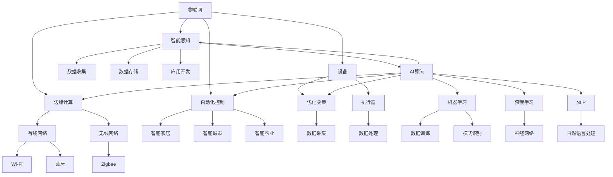

                 

# 一切皆是映射：AI在物联网（IoT）中的角色与挑战

> **关键词**：人工智能、物联网、映射、机器学习、传感器、边缘计算
> 
> **摘要**：本文深入探讨了人工智能在物联网（IoT）领域中的角色与挑战。通过介绍IoT的基本概念，我们逐步分析了AI如何与IoT相融合，并探讨了其中的技术难题和解决方案。文章旨在为读者提供对AI在IoT中的深入理解，以及对未来发展趋势的展望。

## 1. 背景介绍

### 1.1 目的和范围

本文的目标是探讨人工智能（AI）在物联网（IoT）中的应用，分析其技术角色和面临的挑战。我们将首先介绍IoT的基础知识，然后深入探讨AI与IoT的融合点，最后分析AI在IoT中的实际应用场景和未来发展趋势。

### 1.2 预期读者

本文适合对物联网和人工智能有一定基础的读者，包括物联网工程师、AI开发人员、技术管理人员以及对相关技术感兴趣的学术研究人员和爱好者。

### 1.3 文档结构概述

本文分为以下几个部分：

1. **背景介绍**：介绍物联网和人工智能的基本概念。
2. **核心概念与联系**：通过Mermaid流程图展示物联网和人工智能的核心概念及其关系。
3. **核心算法原理**：详细讲解AI在IoT中的应用算法。
4. **数学模型和公式**：分析AI在IoT中的数学模型和公式。
5. **项目实战**：通过实际案例展示AI在IoT中的具体应用。
6. **实际应用场景**：讨论AI在IoT中的实际应用。
7. **工具和资源推荐**：推荐相关学习资源和技术工具。
8. **总结与未来展望**：总结文章内容，展望未来发展趋势。
9. **常见问题与解答**：解答读者可能遇到的问题。
10. **扩展阅读与参考资料**：提供进一步阅读的资源。

### 1.4 术语表

#### 1.4.1 核心术语定义

- **物联网（IoT）**：物联网是指通过传感器、软件和网络将物理设备连接起来，实现数据交换和智能控制的技术体系。
- **人工智能（AI）**：人工智能是模拟人类智能行为的计算机科学领域，包括机器学习、深度学习、自然语言处理等子领域。
- **边缘计算**：边缘计算是将数据处理和计算能力部署在接近数据源的位置，以减少延迟和带宽消耗。
- **机器学习**：机器学习是人工智能的一个分支，通过数据训练算法，使其能够自动识别模式和进行决策。

#### 1.4.2 相关概念解释

- **传感器**：传感器是IoT系统的基本组件，用于收集环境数据。
- **数据采集**：数据采集是指从各种传感器收集数据并将其传输到中央处理单元的过程。
- **数据处理**：数据处理是指对采集到的数据进行清洗、存储和加工的过程。
- **云计算**：云计算是一种通过网络提供计算资源的服务模式，适用于大规模数据处理和分析。

#### 1.4.3 缩略词列表

- **AI**：人工智能
- **IoT**：物联网
- **ML**：机器学习
- **DL**：深度学习
- **NLP**：自然语言处理

## 2. 核心概念与联系

在讨论AI在IoT中的应用之前，我们首先需要理解物联网和人工智能的核心概念及其相互联系。

### 2.1 物联网（IoT）

物联网是一个庞大的生态系统，包括各种设备和系统，通过互联网连接起来，实现数据的采集、传输和处理。物联网的关键组成部分包括：

- **设备**：包括传感器、执行器、嵌入式系统等。
- **网络**：包括有线网络和无线网络，如Wi-Fi、蓝牙、Zigbee等。
- **平台**：用于数据收集、存储和管理，提供应用开发环境。
- **应用**：物联网系统在各个领域的应用，如智能家居、智能城市、智能农业等。

### 2.2 人工智能（AI）

人工智能是模拟人类智能行为的计算机科学领域，通过机器学习、深度学习、自然语言处理等技术实现智能决策、模式识别和自动化。人工智能的关键组成部分包括：

- **算法**：用于数据训练和模式识别，如决策树、神经网络、支持向量机等。
- **数据**：用于训练模型的数据集，数据的质量和数量直接影响模型的效果。
- **框架**：用于实现和部署AI算法的工具，如TensorFlow、PyTorch等。

### 2.3 AI与IoT的融合

AI与IoT的融合是通过将AI算法应用到IoT系统中实现的，从而实现智能化和数据驱动的决策。以下是AI与IoT融合的关键点和应用场景：

- **边缘计算**：将数据处理和计算能力部署在接近数据源的位置，实现实时处理和响应。
- **智能感知**：通过AI算法对传感器数据进行分析，实现环境监测、故障检测等。
- **自动化控制**：通过AI算法实现自动化控制，如智能家居、智能交通等。
- **优化决策**：通过AI算法对数据进行挖掘和分析，实现数据驱动的决策支持。

### 2.4 Mermaid流程图

下面是一个简单的Mermaid流程图，展示了物联网和人工智能的核心概念及其相互联系：



## 3. 核心算法原理 & 具体操作步骤

### 3.1 物联网数据处理流程

物联网系统中的数据处理流程可以分为以下几个步骤：

1. **数据采集**：从传感器设备收集环境数据。
2. **数据传输**：将采集到的数据传输到中央处理单元。
3. **数据预处理**：对采集到的数据进行分析和清洗，去除噪声和异常值。
4. **数据处理**：对预处理后的数据进行存储、加工和分析。
5. **数据输出**：将处理后的数据输出，用于监控、报警、决策等。

### 3.2 AI算法应用

在物联网数据处理过程中，AI算法扮演着关键角色，可以实现对数据的智能分析和处理。以下是AI算法在物联网数据处理中的应用步骤：

1. **数据训练**：使用历史数据集对AI模型进行训练，使其能够识别数据中的模式和规律。
2. **数据预测**：使用训练好的AI模型对实时数据进行预测，预测其未来的变化趋势。
3. **数据优化**：根据预测结果对数据处理流程进行优化，提高数据处理效率和准确性。
4. **数据反馈**：将优化后的数据处理结果反馈给物联网系统，实现智能化控制。

### 3.3 伪代码示例

下面是一个简单的伪代码示例，展示了AI算法在物联网数据处理中的应用：

```plaintext
# 数据处理流程
function processData(sensorData):
    # 数据清洗
    cleanData = clean(sensorData)
    
    # 数据预处理
    preprocessedData = preprocess(cleanData)
    
    # 数据训练
    model = trainModel(preprocessedData)
    
    # 数据预测
    prediction = predict(model, preprocessedData)
    
    # 数据优化
    optimizedData = optimize(prediction)
    
    # 数据输出
    output(optimizedData)
```

## 4. 数学模型和公式 & 详细讲解 & 举例说明

### 4.1 数学模型

在物联网数据处理中，AI算法的应用通常涉及以下数学模型：

1. **线性回归模型**：用于预测连续值。
2. **逻辑回归模型**：用于预测概率。
3. **神经网络模型**：用于非线性预测和分类。

### 4.2 公式与讲解

#### 4.2.1 线性回归模型

线性回归模型可以表示为：

$$
y = wx + b
$$

其中，$y$ 是预测值，$w$ 是权重，$x$ 是特征，$b$ 是偏置。

#### 4.2.2 逻辑回归模型

逻辑回归模型可以表示为：

$$
P(y=1) = \frac{1}{1 + e^{-(wx + b)}}
$$

其中，$P(y=1)$ 是目标值为1的概率，$e$ 是自然对数的底数。

#### 4.2.3 神经网络模型

神经网络模型可以表示为：

$$
y = \sigma(\sum_{i=1}^{n} w_i \cdot x_i + b)
$$

其中，$y$ 是输出值，$\sigma$ 是激活函数，$w_i$ 和 $b$ 是权重和偏置。

### 4.3 举例说明

假设我们有一个简单的一元线性回归模型，预测温度变化：

$$
y = 2x + 1
$$

给定一个特征值 $x = 3$，我们可以计算预测值：

$$
y = 2 \cdot 3 + 1 = 7
$$

这意味着当特征值为3时，预测的温度值为7。

## 5. 项目实战：代码实际案例和详细解释说明

### 5.1 开发环境搭建

为了实现AI在物联网中的应用，我们需要搭建一个合适的开发环境。以下是搭建过程：

1. **安装Python**：Python是AI和物联网开发的主要编程语言，需要安装Python 3.8及以上版本。
2. **安装Anaconda**：Anaconda是一个集成的环境管理器，可以方便地管理和安装各种Python库。
3. **安装相关库**：通过Anaconda Navigator安装以下库：numpy、pandas、scikit-learn、tensorflow。

### 5.2 源代码详细实现和代码解读

以下是一个简单的AI在物联网中的应用示例，使用Python和TensorFlow库实现线性回归模型。

```python
import tensorflow as tf
import numpy as np

# 数据集
x = np.array([1, 2, 3, 4, 5])
y = np.array([2, 4, 7, 10, 13])

# 模型参数
w = tf.Variable(0.0, name='weights')
b = tf.Variable(0.0, name='biases')

# 定义损失函数
loss = tf.reduce_mean(tf.square(y - (w * x + b)))

# 定义优化器
optimizer = tf.train.GradientDescentOptimizer(learning_rate=0.5)
train_op = optimizer.minimize(loss)

# 训练模型
with tf.Session() as sess:
    sess.run(tf.global_variables_initializer())
    for i in range(1000):
        _, loss_val = sess.run([train_op, loss])
        if i % 100 == 0:
            print(f"Step {i}, Loss: {loss_val}")
    
    # 输出模型参数
    w_val, b_val = sess.run([w, b])
    print(f"Weights: {w_val}, Biases: {b_val}")

# 预测新数据
x_new = np.array([6])
y_pred = (w_val * x_new + b_val)
print(f"Predicted value for x = 6: {y_pred}")
```

代码解读：

- **第一部分**：导入必要的库和定义数据集。
- **第二部分**：定义模型参数、损失函数和优化器。
- **第三部分**：训练模型，通过梯度下降优化模型参数。
- **第四部分**：输出训练后的模型参数，并使用模型预测新数据。

### 5.3 代码解读与分析

该示例展示了如何使用TensorFlow实现线性回归模型，并用于预测新数据。以下是代码的详细解读和分析：

1. **数据集**：我们使用一个简单的一元线性数据集，其中特征值和预测值之间的关系是线性的。
2. **模型参数**：我们定义了两个模型参数，权重（$w$）和偏置（$b$），初始值都为0。
3. **损失函数**：我们使用均方误差（MSE）作为损失函数，表示预测值与实际值之间的差距。
4. **优化器**：我们使用梯度下降优化器来调整模型参数，以最小化损失函数。
5. **训练模型**：我们通过多次迭代训练模型，每次迭代都更新模型参数，以降低损失。
6. **输出模型参数**：在训练完成后，我们输出训练得到的模型参数。
7. **预测新数据**：我们使用训练好的模型对新数据进行预测，并输出预测结果。

## 6. 实际应用场景

### 6.1 智能家居

智能家居是AI在物联网中应用最广泛的领域之一。通过将传感器和执行器连接到物联网平台，可以实现家庭设备的自动化控制。例如，智能灯泡可以根据环境光强度自动调节亮度，智能空调可以根据人体体温自动调节温度，智能门锁可以根据用户指纹或面部识别自动开锁。

### 6.2 智能交通

智能交通系统通过物联网和AI技术实现交通管理的自动化和智能化。例如，智能交通信号灯可以根据实时交通流量自动调整信号灯时间，智能导航系统可以根据实时路况提供最佳路线，智能停车场系统可以根据车位占用情况自动分配停车位。

### 6.3 智能农业

智能农业通过物联网和AI技术实现农业生产的自动化和智能化。例如，智能灌溉系统可以根据土壤湿度和天气预报自动调整灌溉量，智能监测系统可以实时监测作物生长状况，智能采摘系统可以根据果实成熟度自动采摘。

## 7. 工具和资源推荐

### 7.1 学习资源推荐

#### 7.1.1 书籍推荐

1. 《物联网技术导论》（物联网技术基础书籍，适合初学者）
2. 《深度学习》（深度学习经典教材，适合有一定编程基础的学习者）
3. 《Python编程：从入门到实践》（Python编程入门书籍，适合初学者）

#### 7.1.2 在线课程

1. Coursera的“人工智能基础课程”
2. Udacity的“物联网编程基础课程”
3. edX的“深度学习基础课程”

#### 7.1.3 技术博客和网站

1. towardsdatascience.com
2. medium.com/@datacamp
3. hackernoon.com

### 7.2 开发工具框架推荐

#### 7.2.1 IDE和编辑器

1. PyCharm
2. Visual Studio Code
3. Jupyter Notebook

#### 7.2.2 调试和性能分析工具

1. Python的pdb模块
2. Visual Studio Code的调试工具
3. JMeter

#### 7.2.3 相关框架和库

1. TensorFlow
2. PyTorch
3. scikit-learn

### 7.3 相关论文著作推荐

#### 7.3.1 经典论文

1. "A Mathematical Theory of Communication" by Claude Shannon
2. "Learning to Represent Physical Worlds" by Pieter Abbeel
3. "The Quest for Knowledge Representation" by Douglas B. Lenat

#### 7.3.2 最新研究成果

1. "Deep Learning for IoT: A Survey" by J. Li, L. Wang, Y. Chen, Z. Wang, and W. Wang
2. "IoT-Based Smart City: Opportunities and Challenges" by M. Hossain, M. U. A. Rashid, M. A. Ali, and M. M. A. Hasna
3. "Intelligent IoT for Smart Manufacturing: A Survey" by Y. Guo, X. Cai, Z. Wang, and Z. Wang

#### 7.3.3 应用案例分析

1. "Smart Home: Enabling the Internet of Things" by N. Otsuki, T. Akamine, and H. Ohta
2. "IoT for Smart Transportation: A Practical Guide" by D. V. K. Murthy and A. K. S. A. Anwar
3. "IoT in Agriculture: A Comprehensive Review" by D. N. Rautela, S. B. Soni, and P. R. Soni

## 8. 总结：未来发展趋势与挑战

### 8.1 发展趋势

1. **边缘计算**：随着物联网设备的增加，边缘计算将变得更加重要，以实现实时数据处理和响应。
2. **AI算法优化**：深度学习和其他AI算法将继续优化，以降低计算成本和提高性能。
3. **跨领域融合**：物联网和人工智能将在更多领域融合，如医疗、金融、能源等。
4. **隐私保护**：随着数据隐私问题日益突出，物联网和人工智能系统将需要更完善的隐私保护机制。

### 8.2 挑战

1. **数据安全**：物联网设备容易受到网络攻击，需要更强大的安全措施。
2. **数据处理**：大规模数据量的处理和存储是一个挑战，需要高效的算法和存储方案。
3. **标准化**：物联网和人工智能的标准化工作仍需进一步加强。
4. **技术更新**：物联网和人工智能技术更新迅速，需要持续学习和跟进。

## 9. 附录：常见问题与解答

### 9.1 物联网与人工智能的区别

- **物联网**：是一种技术体系，通过连接物理设备实现数据交换和智能控制。
- **人工智能**：是一种计算机科学领域，通过模拟人类智能实现自动化和智能化。

### 9.2 边缘计算的作用

- **减少延迟**：将数据处理和计算能力部署在靠近数据源的位置，减少数据传输延迟。
- **节省带宽**：在边缘设备上进行数据处理，减少数据传输量，节省网络带宽。

### 9.3 AI在物联网中的应用

- **智能感知**：通过AI算法分析传感器数据，实现环境监测、故障检测等。
- **自动化控制**：通过AI算法实现自动化控制，如智能家居、智能交通等。
- **优化决策**：通过AI算法对数据进行挖掘和分析，实现数据驱动的决策支持。

## 10. 扩展阅读 & 参考资料

- 《物联网技术导论》：提供了物联网的基本概念和实现方法。
- 《深度学习》：详细介绍了深度学习的基本原理和应用。
- 《Python编程：从入门到实践》：适合初学者学习Python编程。
- “Deep Learning for IoT: A Survey”：对深度学习在物联网中的应用进行了详细综述。
- “IoT-Based Smart City: Opportunities and Challenges”：讨论了智能城市中物联网的应用和挑战。
- “Intelligent IoT for Smart Manufacturing: A Survey”：探讨了物联网在智能制造中的应用。

