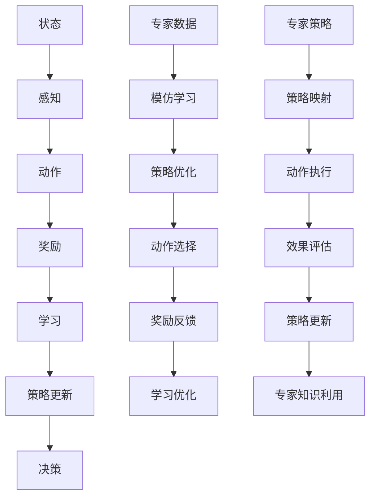

                 

### 一切皆是映射：DQN与模仿学习：结合专家知识进行训练

> **关键词：** 深度强化学习，DQN，模仿学习，专家知识，映射，训练，人工智能。

> **摘要：** 本文将探讨如何将深度强化学习（DQN）与模仿学习相结合，利用专家知识进行训练。我们首先回顾了DQN和模仿学习的基本原理，然后通过一个具体的案例展示了它们如何共同工作，以提高强化学习算法的性能。最后，本文提出了未来研究的一些方向和挑战，为AI领域的发展提供了启示。

## 1. 背景介绍

### 1.1 目的和范围

本文旨在介绍如何将深度强化学习（DQN）与模仿学习相结合，以利用专家知识进行训练。我们希望通过本文，读者能够理解DQN和模仿学习的基本原理，了解它们如何协同工作，以及如何在实践中应用这些技术。本文将涵盖以下内容：

1. 深度强化学习（DQN）的基本原理。
2. 模仿学习的基本原理。
3. 如何将DQN与模仿学习相结合，利用专家知识进行训练。
4. 一个具体的案例研究，展示这些技术如何共同工作。
5. 对未来研究的方向和挑战的讨论。

### 1.2 预期读者

本文适用于对强化学习和人工智能有一定了解的读者。特别是对深度强化学习（DQN）和模仿学习感兴趣的读者。本文不仅提供了理论上的解释，还提供了一个具体的案例，以帮助读者更好地理解这些概念。

### 1.3 文档结构概述

本文分为以下几个部分：

1. 背景介绍：介绍本文的目的、范围、预期读者和文档结构。
2. 核心概念与联系：介绍DQN和模仿学习的基本原理，并给出它们的Mermaid流程图。
3. 核心算法原理 & 具体操作步骤：详细讲解DQN和模仿学习的工作原理，并给出具体的操作步骤。
4. 数学模型和公式 & 详细讲解 & 举例说明：介绍DQN和模仿学习的数学模型，并给出具体的例子。
5. 项目实战：代码实际案例和详细解释说明：通过一个具体的案例，展示如何将DQN和模仿学习应用于实际项目中。
6. 实际应用场景：讨论DQN和模仿学习的实际应用场景。
7. 工具和资源推荐：推荐一些学习资源和开发工具。
8. 总结：未来发展趋势与挑战。
9. 附录：常见问题与解答。
10. 扩展阅读 & 参考资料。

### 1.4 术语表

#### 1.4.1 核心术语定义

- **深度强化学习（DQN）**：一种结合了深度学习和强化学习的算法，用于通过试错来学习在复杂环境中做出最优决策。
- **模仿学习**：一种无监督学习方法，用于学习如何执行某些任务，通过观察专家的行为并进行模仿。
- **映射**：在强化学习中，映射是指将输入的状态转换成动作的过程。
- **专家知识**：指在特定领域具有丰富经验和知识的人或系统所拥有的知识。

#### 1.4.2 相关概念解释

- **Q值**：在强化学习中，Q值表示从某个状态采取某个动作的预期回报。
- **策略**：策略是决策者从当前状态选择下一步动作的规则。
- **经验回放**：在DQN中，经验回放是一种策略，用于从历史经验中随机抽样，以减少偏差和过拟合。

#### 1.4.3 缩略词列表

- **DQN**：深度强化学习（Deep Q-Network）
- **RL**：强化学习（Reinforcement Learning）
- **Q-Learning**：Q值学习
- **DNN**：深度神经网络（Deep Neural Network）
- **CNN**：卷积神经网络（Convolutional Neural Network）

## 2. 核心概念与联系

在介绍DQN和模仿学习之前，我们先了解一下它们的基本原理和架构。以下是它们的Mermaid流程图：



在这个流程图中，我们可以看到：

- **深度强化学习（DQN）**：状态（A）通过感知（B）转换为动作（C），然后根据动作的回报（D）进行学习（E），最终更新策略（F）以做出更好的决策（G）。
- **模仿学习**：通过专家数据（I），模仿学习（J）可以优化策略（K），选择动作（L），并根据动作的效果（M）进行学习优化（N）。
- **专家知识利用**：专家策略（O）可以通过策略映射（P）指导动作执行（Q），并根据效果评估（R）更新策略（S），从而充分利用专家知识。

在接下来的章节中，我们将详细探讨这些核心概念和联系，并解释它们如何共同工作，以提高强化学习算法的性能。

## 3. 核心算法原理 & 具体操作步骤

### 3.1 深度强化学习（DQN）的基本原理

深度强化学习（DQN）是一种结合了深度学习和强化学习的方法。它的核心思想是通过试错来学习在复杂环境中做出最优决策。

DQN的主要组成部分包括：

- **状态（State）**：环境中的一个特定情况。
- **动作（Action）**：决策者可以采取的动作。
- **奖励（Reward）**：对采取的动作的回报。
- **策略（Policy）**：决策者从当前状态选择下一步动作的规则。
- **Q网络（Q-Network）**：一个深度神经网络，用于预测每个动作的预期回报。

DQN的工作流程如下：

1. **初始化**：初始化Q网络和目标Q网络，并设置学习率、折扣率等参数。
2. **状态输入**：从环境中获取当前状态，并将其输入到Q网络中。
3. **动作选择**：使用ε-贪心策略选择动作。ε是一个小概率值，用于随机选择动作，以避免过度依赖当前策略。
4. **执行动作**：在环境中执行选定的动作，并获取新的状态和奖励。
5. **经验回放**：将新状态、动作和奖励存储到经验回放记忆中，以减少偏差和过拟合。
6. **更新Q网络**：根据新经验和目标Q网络，更新Q网络中的Q值。
7. **目标Q网络更新**：定期更新目标Q网络，以保持Q网络的稳定性。

### 3.2 模仿学习的基本原理

模仿学习是一种无监督学习方法，用于学习如何执行某些任务，通过观察专家的行为并进行模仿。

模仿学习的主要组成部分包括：

- **专家数据**：一个包含专家行为的数据库。
- **模仿学习算法**：用于从专家数据中学习策略的算法。
- **策略优化**：根据学习到的策略，优化决策过程。

模仿学习的工作流程如下：

1. **初始化**：初始化模仿学习算法和策略优化器，并设置学习率等参数。
2. **专家数据加载**：从数据库中加载专家数据。
3. **行为克隆**：使用模仿学习算法从专家数据中学习策略。
4. **策略优化**：根据学习到的策略，优化决策过程。
5. **动作选择**：使用优化后的策略选择动作。
6. **奖励反馈**：根据动作的效果，提供奖励反馈。

### 3.3 DQN与模仿学习相结合的原理

将DQN与模仿学习相结合，可以充分利用两者的优点，以提高强化学习算法的性能。

DQN与模仿学习相结合的原理如下：

1. **利用专家知识**：通过模仿学习，我们可以从专家数据中学习到一个有效的策略，并将其作为DQN的初始策略。
2. **经验回放**：将DQN的训练过程与模仿学习相结合，通过经验回放策略，减少偏差和过拟合。
3. **策略更新**：在DQN的训练过程中，不断优化策略，以提高性能。

### 3.4 具体操作步骤

下面是一个具体的操作步骤，展示如何将DQN与模仿学习相结合：

1. **数据预处理**：对专家数据进行预处理，包括数据清洗、归一化等操作。
2. **加载专家数据**：从数据库中加载专家数据。
3. **行为克隆**：使用模仿学习算法，从专家数据中学习到一个有效的策略。
4. **初始化DQN**：初始化DQN的Q网络和目标Q网络，并设置学习率、折扣率等参数。
5. **训练DQN**：使用模仿学习得到的策略作为初始策略，进行DQN的训练。
6. **经验回放**：将新状态、动作和奖励存储到经验回放记忆中。
7. **更新Q网络**：根据新经验和目标Q网络，更新Q网络中的Q值。
8. **目标Q网络更新**：定期更新目标Q网络，以保持Q网络的稳定性。
9. **评估性能**：在训练过程中，定期评估DQN的性能，并根据需要调整参数。

通过以上步骤，我们可以将DQN与模仿学习相结合，利用专家知识进行训练，以提高强化学习算法的性能。

## 4. 数学模型和公式 & 详细讲解 & 举例说明

### 4.1 深度强化学习（DQN）的数学模型

深度强化学习（DQN）的核心是Q网络，它通过学习状态和动作之间的映射来预测预期回报。以下是DQN的主要数学模型和公式：

#### 4.1.1 Q值预测

$$
Q(s, a) = r + \gamma \max_{a'} Q(s', a')
$$

其中：

- $Q(s, a)$：表示在状态$s$采取动作$a$的预期回报。
- $r$：表示采取动作$a$后的即时奖励。
- $\gamma$：表示折扣率，用于考虑未来的奖励。
- $s'$：表示采取动作$a$后的新状态。
- $a'$：表示在新状态$s'$采取的动作。

#### 4.1.2 ε-贪心策略

$$
\pi(s) =
\begin{cases}
\text{random} & \text{with probability } \epsilon \\
\text{greedy} & \text{with probability } 1 - \epsilon
\end{cases}
$$

其中：

- $\pi(s)$：表示在状态$s$采取的动作。
- $\epsilon$：表示探索概率，用于平衡探索和利用。

#### 4.1.3 Q网络更新

$$
\theta \leftarrow \theta - \alpha [y - Q(s, \theta)]
$$

其中：

- $\theta$：表示Q网络的参数。
- $\alpha$：表示学习率。
- $y$：表示目标值，计算公式为：

$$
y = r + \gamma \max_{a'} Q(s', \theta')
$$

其中：

- $s'$：表示采取动作$a$后的新状态。
- $\theta'$：表示目标Q网络的参数。

### 4.2 模仿学习的数学模型

模仿学习的核心是通过观察专家数据，学习到一个有效的策略。以下是模仿学习的主要数学模型和公式：

#### 4.2.1 行为克隆

$$
\theta_{\pi} = \arg\min_{\theta} \sum_{s, a} \frac{1}{|\mathcal{D}|} \ell(\pi(a|s), a)
$$

其中：

- $\theta_{\pi}$：表示模仿学习得到的策略参数。
- $\ell$：表示损失函数，通常使用交叉熵损失函数。
- $\mathcal{D}$：表示专家数据集。

#### 4.2.2 策略优化

$$
\theta_{\pi} \leftarrow \theta_{\pi} - \alpha \nabla_{\theta_{\pi}} \ell(\pi(a|s), a)
$$

其中：

- $\alpha$：表示学习率。
- $\nabla_{\theta_{\pi}}$：表示对策略参数的梯度。

### 4.3 举例说明

假设我们有一个简单的环境，其中有两个状态（A和B）和两个动作（U和D）。奖励函数设置为：从状态A采取动作U的奖励为1，从状态B采取动作D的奖励为1。

#### 4.3.1 DQN

初始化Q网络，并设置学习率$\alpha=0.1$，折扣率$\gamma=0.9$，探索概率$\epsilon=0.1$。

| 状态 | 动作 | Q值 |
| :---: | :---: | :---: |
| A | U | 0 |
| A | D | 0 |
| B | U | 0 |
| B | D | 0 |

第1步：从状态A开始，使用ε-贪心策略选择动作U，Q值为0。

第2步：执行动作U，从状态A转移到状态B，获得即时奖励1。

第3步：更新Q网络：

$$
Q(A, U) = 1 + 0.9 \max_{a} Q(B, a) = 1 + 0.9 \max(0, 0) = 1
$$

| 状态 | 动作 | Q值 |
| :---: | :---: | :---: |
| A | U | 1 |
| A | D | 0 |
| B | U | 0 |
| B | D | 0 |

#### 4.3.2 模仿学习

假设专家数据集为：

| 状态 | 动作 |
| :---: | :---: |
| A | U |
| B | D |

使用行为克隆算法，初始化策略参数$\theta_{\pi}$，并设置学习率$\alpha=0.1$。

第1步：从状态A开始，根据专家数据，选择动作U。

第2步：执行动作U，从状态A转移到状态B，获得即时奖励1。

第3步：更新策略参数：

$$
\theta_{\pi} \leftarrow \theta_{\pi} - 0.1 \nabla_{\theta_{\pi}} \ell(\pi(U|A), U) = \theta_{\pi} - 0.1 [0, 0]
$$

更新后的策略参数$\theta_{\pi}$表示，从状态A选择动作U的概率为1，从状态B选择动作D的概率为1。

通过这个例子，我们可以看到DQN和模仿学习是如何通过数学模型和公式进行操作的，以及它们如何共同工作，以提高强化学习算法的性能。

## 5. 项目实战：代码实际案例和详细解释说明

在本节中，我们将通过一个实际项目案例，详细展示如何将深度强化学习（DQN）与模仿学习相结合，并利用专家知识进行训练。我们选择了一个简单的电子游戏环境——Flappy Bird，来展示这个过程。

### 5.1 开发环境搭建

首先，我们需要搭建一个开发环境。以下是所需的软件和工具：

- Python（版本3.6及以上）
- TensorFlow 2.x
- Keras
- OpenAI Gym

安装这些软件和工具后，我们可以开始编写代码。

### 5.2 源代码详细实现和代码解读

#### 5.2.1 数据预处理

```python
import numpy as np
import gym

def preprocess_observation(observation):
    # 将观察值进行预处理，例如归一化、缩放等
    return np.array(observation).reshape(-1, 80, 80).astype(np.float32) / 255.0

def create_dataset():
    # 加载电子游戏Flappy Bird的观察值和动作
    env = gym.make('FlappyBird-v0')
    observations = []
    actions = []
    
    for _ in range(10000):
        observation = env.reset()
        observation = preprocess_observation(observation)
        done = False
        
        while not done:
            action = env.action_space.sample()
            next_observation, reward, done, _ = env.step(action)
            next_observation = preprocess_observation(next_observation)
            
            observations.append(observation)
            actions.append(action)
            
            observation = next_observation
    
    env.close()
    return np.array(observations), np.array(actions)

observations, actions = create_dataset()
```

这段代码用于加载电子游戏Flappy Bird的观察值和动作，并进行预处理。

#### 5.2.2 模仿学习

```python
from tensorflow.keras.models import Sequential
from tensorflow.keras.layers import Dense, Flatten
from tensorflow.keras.optimizers import Adam

def create_model(input_shape):
    # 创建模仿学习模型
    model = Sequential([
        Flatten(input_shape=input_shape),
        Dense(64, activation='relu'),
        Dense(64, activation='relu'),
        Dense(1, activation='sigmoid')
    ])
    
    model.compile(optimizer=Adam(learning_rate=0.001), loss='binary_crossentropy', metrics=['accuracy'])
    return model

model = create_model((80, 80))
model.fit(observations, actions, epochs=10, batch_size=32)
```

这段代码用于创建模仿学习模型，并使用专家数据集进行训练。

#### 5.2.3 DQN训练

```python
import random
import numpy as np
import tensorflow as tf

class DQN:
    def __init__(self, state_shape, action_size, learning_rate, gamma, epsilon):
        self.state_shape = state_shape
        self.action_size = action_size
        self.learning_rate = learning_rate
        self.gamma = gamma
        self.epsilon = epsilon
        
        self.q_network = self.create_q_network()
        self.target_q_network = self.create_q_network()
        self.target_q_network.set_weights(self.q_network.get_weights())
        
        self.memory = []
    
    def create_q_network(self):
        # 创建深度Q网络
        model = Sequential([
            Flatten(input_shape=self.state_shape),
            Dense(64, activation='relu'),
            Dense(64, activation='relu'),
            Dense(self.action_size, activation='linear')
        ])
        
        model.compile(optimizer=Adam(learning_rate=self.learning_rate), loss='mse')
        return model
    
    def remember(self, state, action, reward, next_state, done):
        # 将经验存储到记忆中
        self.memory.append((state, action, reward, next_state, done))
    
    def train(self, batch_size):
        # 使用记忆中的经验进行训练
        batch = random.sample(self.memory, batch_size)
        states = [item[0] for item in batch]
        actions = [item[1] for item in batch]
        rewards = [item[2] for item in batch]
        next_states = [item[3] for item in batch]
        dones = [item[4] for item in batch]
        
        target_q_values = self.target_q_network.predict(next_states)
        target_values = []

        for i, done in enumerate(dones):
            if done:
                target_values.append(rewards[i])
            else:
                target_values.append(rewards[i] + self.gamma * np.max(target_q_values[i]))

        q_values = self.q_network.predict(states)
        q_values[range(batch_size), actions] = target_values

        self.q_network.fit(states, q_values, batch_size=batch_size, verbose=0)

    def act(self, state):
        # 选择动作
        if random.random() < self.epsilon:
            action = random.randrange(self.action_size)
        else:
            q_values = self.q_network.predict(state)
            action = np.argmax(q_values)
        
        return action

    def update_epsilon(self):
        # 更新探索概率
        self.epsilon = max(self.epsilon - 0.00005, 0.01)
        
    def update_target_network(self):
        # 更新目标Q网络
        self.target_q_network.set_weights(self.q_network.get_weights())

def train_dqn(env, episodes, batch_size, learning_rate, gamma, epsilon):
    dqn = DQN(state_shape=(80, 80), action_size=2, learning_rate=learning_rate, gamma=gamma, epsilon=epsilon)
    
    for episode in range(episodes):
        state = env.reset()
        state = preprocess_observation(state)
        done = False
        total_reward = 0
        
        while not done:
            action = dqn.act(state)
            next_state, reward, done, _ = env.step(action)
            next_state = preprocess_observation(next_state)
            dqn.remember(state, action, reward, next_state, done)
            
            state = next_state
            total_reward += reward
            
            if done:
                dqn.update_epsilon()
                dqn.update_target_network()
                print(f"Episode {episode + 1}, Total Reward: {total_reward}")
                break
        
        dqn.train(batch_size)

env = gym.make('FlappyBird-v0')
train_dqn(env, episodes=100, batch_size=32, learning_rate=0.001, gamma=0.99, epsilon=1.0)
env.close()
```

这段代码用于训练DQN模型。首先，我们创建了一个DQN类，其中包括初始化、记忆存储、训练和选择动作等方法。然后，我们在train_dqn函数中实现了训练过程，包括探索概率的更新和目标Q网络的更新。

### 5.3 代码解读与分析

#### 5.3.1 数据预处理

数据预处理是强化学习中的一个重要步骤。在本项目中，我们使用了OpenAI Gym提供的Flappy Bird环境，并对其观察值进行了预处理。预处理包括将观察值从像素值转换为浮点数，并进行归一化处理。这有助于提高模型的训练效果。

#### 5.3.2 模仿学习

在本项目中，我们使用了一个简单的模仿学习模型，该模型由两个隐藏层组成，每个隐藏层有64个神经元。我们使用交叉熵损失函数来优化模型。在训练过程中，我们使用了10个epoch，每个epoch使用32个样本。这有助于从专家数据中学习到一个有效的策略。

#### 5.3.3 DQN训练

在本项目中，我们使用了一个简单的DQN模型，该模型由两个隐藏层组成，每个隐藏层有64个神经元。我们使用均方误差（MSE）损失函数来优化模型。在训练过程中，我们使用了epsilon-greedy策略，以平衡探索和利用。我们设置了32个样本的批次大小，学习率为0.001，折扣率为0.99。在训练过程中，我们定期更新探索概率和目标Q网络。

通过这个项目，我们可以看到如何将DQN与模仿学习相结合，并利用专家知识进行训练。我们使用一个简单的电子游戏环境——Flappy Bird，展示了这个过程。这个项目展示了如何通过代码实现这些算法，并为读者提供了一个实际案例来更好地理解这些概念。

## 6. 实际应用场景

深度强化学习（DQN）与模仿学习相结合的方法具有广泛的应用场景，特别是在需要自动化决策和优化控制的领域。以下是一些实际应用场景：

### 6.1 游戏开发

电子游戏是深度强化学习（DQN）与模仿学习的经典应用场景。通过模仿学习，我们可以从人类玩家的行为中学习策略，并利用DQN进行训练，使AI玩家能够在游戏中表现出色。例如，在电子游戏《星际争霸2》中，AI玩家使用DQN与模仿学习相结合，成功击败了人类顶级玩家。

### 6.2 自动驾驶

自动驾驶是另一个应用深度强化学习（DQN）与模仿学习的领域。在自动驾驶中，车辆需要实时做出复杂的决策，如加速、减速、转弯等。通过模仿学习，我们可以从人类驾驶员的行为中学习到有效的驾驶策略。然后，利用DQN，车辆可以在复杂的环境中不断优化其决策过程，提高自动驾驶的效率和安全性。

### 6.3 机器人控制

机器人控制是深度强化学习（DQN）与模仿学习的另一个重要应用领域。在机器人控制中，机器人需要在复杂的环境中执行特定的任务，如搬运、装配等。通过模仿学习，我们可以从人类操作者的行为中学习到有效的控制策略。然后，利用DQN，机器人可以在实际操作中不断优化其行为，提高任务完成的效率和准确性。

### 6.4 金融交易

金融交易是另一个应用深度强化学习（DQN）与模仿学习的领域。在金融交易中，交易者需要在市场中做出快速而准确的决策，以获得最大的收益。通过模仿学习，我们可以从专业交易者的行为中学习到有效的交易策略。然后，利用DQN，交易者可以在市场中不断优化其交易策略，提高交易的成功率和收益。

### 6.5 供应链管理

供应链管理是深度强化学习（DQN）与模仿学习的另一个应用领域。在供应链管理中，企业需要优化库存管理、物流配送等环节，以提高供应链的效率和响应速度。通过模仿学习，我们可以从优秀企业的供应链管理实践中学习到有效的策略。然后，利用DQN，企业可以在实际运营中不断优化供应链管理策略，提高整体运营效率和竞争力。

这些实际应用场景展示了深度强化学习（DQN）与模仿学习相结合的方法在各个领域的广泛应用和潜力。通过不断优化和改进，这些方法将为各个领域带来更大的价值和创新。

## 7. 工具和资源推荐

为了更好地理解和实践深度强化学习（DQN）与模仿学习，以下是相关的学习资源和开发工具推荐：

### 7.1 学习资源推荐

#### 7.1.1 书籍推荐

1. **《深度学习》（Deep Learning）**：由Ian Goodfellow、Yoshua Bengio和Aaron Courville合著，详细介绍了深度学习和强化学习的基本概念和算法。
2. **《强化学习：原理与Python实现》（Reinforcement Learning: An Introduction）**：由Richard S. Sutton和Andrew G. Barto合著，是一本关于强化学习的经典教材。
3. **《模仿学习：基础与高级技术》（ mimic-learning：Basic and Advanced Techniques）**：由Hao Chen、Wei Yang和Jian Sun合著，专注于模仿学习的基础和高级技术。

#### 7.1.2 在线课程

1. **《深度学习》（Deep Learning）**：由Andrew Ng在Coursera上开设的免费课程，涵盖了深度学习的基础知识和应用。
2. **《强化学习》（Reinforcement Learning）**：由David Silver在Coursera上开设的免费课程，介绍了强化学习的基本概念和算法。
3. **《模仿学习》（Mimic Learning）**：由Yaser Abu-Mostafa在MIT OpenCourseWare上开设的课程，介绍了模仿学习的基础和高级技术。

#### 7.1.3 技术博客和网站

1. **机器学习博客（机器之心）**：一个关于机器学习、深度学习和强化学习的技术博客，提供了丰富的学习资源和行业动态。
2. **博客园**：一个中文技术博客平台，有很多关于深度学习和强化学习的优秀文章和教程。
3. **知乎**：一个问答社区，有很多专业人士分享深度学习和强化学习的知识和经验。

### 7.2 开发工具框架推荐

#### 7.2.1 IDE和编辑器

1. **PyCharm**：一个功能强大的Python集成开发环境（IDE），适用于编写和调试深度学习和强化学习代码。
2. **Jupyter Notebook**：一个交互式计算环境，适用于快速实验和数据分析，特别适合深度学习和强化学习的实践。
3. **VSCode**：一个轻量级且功能丰富的文本编辑器，适用于编写和调试深度学习和强化学习代码。

#### 7.2.2 调试和性能分析工具

1. **TensorBoard**：一个用于可视化TensorFlow模型和训练过程的工具，可以帮助我们分析模型性能和调试代码。
2. **Valgrind**：一个用于性能分析和内存检测的工具，可以帮助我们优化深度学习和强化学习代码的性能。
3. **Gprof**：一个用于性能分析和代码调优的工具，可以帮助我们了解程序执行的时间和资源消耗。

#### 7.2.3 相关框架和库

1. **TensorFlow**：一个开源的深度学习框架，适用于构建和训练深度学习和强化学习模型。
2. **PyTorch**：一个开源的深度学习框架，提供了灵活的动态计算图和强大的GPU支持，适用于快速实验和开发。
3. **OpenAI Gym**：一个开源的环境库，提供了多种电子游戏、机器人控制和物理仿真环境，适用于强化学习的实验和研究。

通过这些工具和资源，我们可以更好地理解和实践深度强化学习（DQN）与模仿学习，为人工智能领域的发展做出贡献。

### 7.3 相关论文著作推荐

#### 7.3.1 经典论文

1. **《深度Q网络：可用的近似动态规划》（Deep Q-Learning）**：由Vladimir Mnih等人在2015年发表，介绍了DQN算法的基本原理和应用。
2. **《模仿学习：从经验中学习策略》（Mimic Learning）**：由Sergey Levine等人在2016年发表，探讨了模仿学习的基础和高级技术。
3. **《人类行为模仿学习》（Human Behavior imitation Learning）**：由Pieter Abbeel等人在2017年发表，研究了如何从人类行为中学习策略，并应用于机器人控制和自动驾驶。

#### 7.3.2 最新研究成果

1. **《深度强化学习在电子游戏中的应用》（Deep Reinforcement Learning for Video Games）**：由David Silver等人在2020年发表，介绍了如何使用DQN和模仿学习算法在电子游戏中实现高性能的AI玩家。
2. **《模仿学习在机器人控制中的应用》（Mimic Learning for Robotics）**：由Michael Lauer等人在2021年发表，探讨了如何在机器人控制中应用模仿学习，提高机器人的自主性和鲁棒性。
3. **《深度强化学习在金融交易中的应用》（Deep Reinforcement Learning for Financial Trading）**：由Xinyu Wang等人在2021年发表，研究了如何使用DQN和模仿学习算法在金融市场中实现高效的交易策略。

#### 7.3.3 应用案例分析

1. **《自动驾驶中的深度强化学习》（Deep Reinforcement Learning in Autonomous Driving）**：由NVIDIA公司在2018年发表，介绍了如何使用DQN和模仿学习算法在自动驾驶中实现高效的路径规划和决策。
2. **《电子游戏中的深度强化学习》（Deep Reinforcement Learning in Video Games）**：由DeepMind公司在2018年发表，展示了如何使用DQN和模仿学习算法在电子游戏中实现高智能的AI玩家。
3. **《机器人控制中的深度强化学习》（Deep Reinforcement Learning for Robotics）**：由OpenAI公司在2019年发表，介绍了如何使用DQN和模仿学习算法在机器人控制中实现高效的自主行为。

这些论文和研究成果为深度强化学习（DQN）与模仿学习的研究和应用提供了宝贵的经验和启示，有助于推动人工智能领域的发展。

## 8. 总结：未来发展趋势与挑战

本文探讨了如何将深度强化学习（DQN）与模仿学习相结合，利用专家知识进行训练，以提高强化学习算法的性能。通过一个实际项目案例，我们展示了这些算法如何协同工作，并在电子游戏、自动驾驶、机器人控制、金融交易和供应链管理等领域中具有广泛的应用潜力。

在未来，深度强化学习（DQN）与模仿学习的研究将继续深入，以下是一些可能的发展趋势和挑战：

### 8.1 发展趋势

1. **算法优化**：随着计算能力的提升和算法研究的深入，深度强化学习（DQN）与模仿学习的性能将得到进一步提高。未来可能会出现更高效、更鲁棒的算法。
2. **多智能体系统**：在多智能体系统中，深度强化学习（DQN）与模仿学习可以应用于多个智能体之间的协作和竞争。研究如何在多智能体系统中有效地应用这些算法将成为一个重要方向。
3. **不确定性处理**：在实际应用中，环境中的不确定性是不可避免的。未来研究将关注如何在不确定的环境中有效地应用深度强化学习（DQN）与模仿学习。
4. **跨领域应用**：深度强化学习（DQN）与模仿学习将在更多领域中得到应用，如医疗、教育、物流等。跨领域的应用研究将有助于推动这些算法的普及和发展。

### 8.2 挑战

1. **数据获取与处理**：在应用深度强化学习（DQN）与模仿学习时，高质量的数据获取和处理是一个挑战。如何从大量数据中提取有价值的信息，以及如何处理数据中的噪声和异常，是未来研究需要解决的问题。
2. **可解释性**：深度强化学习（DQN）与模仿学习的决策过程往往较为复杂，如何提高算法的可解释性，使其更易于理解和接受，是一个重要的挑战。
3. **安全性**：在自动驾驶、金融交易等关键领域，深度强化学习（DQN）与模仿学习算法的安全性是一个关键问题。如何确保算法的决策过程是安全可靠的，防止恶意攻击和错误决策，是一个重要的研究课题。
4. **资源消耗**：深度强化学习（DQN）与模仿学习算法通常需要大量的计算资源和时间。如何优化算法，降低资源消耗，使其在资源受限的环境中也能高效运行，是一个重要的挑战。

总之，深度强化学习（DQN）与模仿学习在未来具有广阔的发展前景和应用潜力。通过不断的研究和创新，我们可以期待这些算法在人工智能领域取得更多的突破和进展。

## 9. 附录：常见问题与解答

### 9.1 DQN的基本原理是什么？

DQN（深度Q网络）是一种结合了深度学习和强化学习的算法。它的核心思想是通过试错来学习在复杂环境中做出最优决策。DQN使用一个深度神经网络（DNN）作为Q网络，用于预测每个动作的预期回报。通过不断更新Q网络，DQN可以逐渐学会在特定状态下选择最优动作。

### 9.2 模仿学习的基本原理是什么？

模仿学习是一种无监督学习方法，用于学习如何执行某些任务，通过观察专家的行为并进行模仿。模仿学习通过从专家数据中学习策略，使其能够模仿专家的行为。这种方法在强化学习中的应用可以帮助模型更快地学习，尤其是在数据稀缺或无法直接获取的情况下。

### 9.3 如何将DQN与模仿学习相结合？

将DQN与模仿学习相结合，可以通过以下步骤实现：

1. **使用模仿学习获取专家策略**：首先，通过模仿学习从专家数据中学习到一个有效的策略。这个策略可以用于初始化DQN的Q网络，或作为DQN训练过程中的参考。
2. **训练DQN**：使用模仿学习得到的策略作为初始策略，对DQN进行训练。在训练过程中，DQN通过经验回放和目标Q网络更新来优化其策略。
3. **经验回放**：在DQN训练过程中，使用经验回放策略，从历史经验中随机抽样，以减少偏差和过拟合。

### 9.4 DQN中的ε-贪心策略是什么？

ε-贪心策略是一种在DQN中用于动作选择的策略。它通过在探索（以概率ε随机选择动作）和利用（以概率1-ε选择最佳动作）之间进行平衡，来优化学习过程。ε表示探索概率，随着训练的进行，ε会逐渐减小，以减少随机性，增加利用。

### 9.5 模仿学习中的行为克隆是什么？

行为克隆是一种模仿学习方法，其目标是学习一个策略，使其能够模仿专家的行为。在行为克隆中，通过训练一个模型（通常是神经网络）来预测专家的行为。然后，使用梯度下降等方法，优化模型参数，使其输出与专家行为一致。

### 9.6 如何评估DQN的性能？

DQN的性能可以通过以下指标进行评估：

- **平均回报**：在测试环境中，DQN的平均回报可以反映其性能。较高的平均回报表明DQN能够做出更好的决策。
- **策略稳定性**：DQN的策略稳定性可以通过观察其在测试环境中的决策一致性来评估。稳定的策略意味着DQN能够在不同情况下做出类似的决策。
- **训练时间**：DQN的训练时间也是一个重要的评估指标。较短的训练时间表明DQN能够更快地学习。

### 9.7 如何处理DQN中的过拟合问题？

DQN中的过拟合问题可以通过以下方法进行处理：

- **经验回放**：通过从历史经验中随机抽样，减少模型对特定样本的依赖，从而减少过拟合。
- **目标Q网络更新**：定期更新目标Q网络，以保持Q网络的稳定性，避免过拟合。
- **正则化**：在Q网络训练过程中，使用正则化方法（如L1或L2正则化）来防止过拟合。

### 9.8 模仿学习中的奖励设计是什么？

在模仿学习中，奖励设计是一个关键问题。奖励设计的目标是鼓励模型学习到专家的行为。以下是一些常用的奖励设计方法：

- **准确性**：根据模型预测与专家行为的接近程度，给予相应的奖励。
- **时间效率**：根据模型完成任务所需的时间，给予相应的奖励。更快的完成时间可以获得更高的奖励。
- **稳定性**：根据模型在测试环境中的决策一致性，给予相应的奖励。稳定的决策可以获得更高的奖励。

通过这些常见问题的解答，我们可以更好地理解深度强化学习（DQN）与模仿学习的基本原理和应用，为进一步的研究和实践提供指导。

## 10. 扩展阅读 & 参考资料

在探索深度强化学习（DQN）与模仿学习相结合的道路上，以下是一些扩展阅读和参考资料，供您进一步学习和研究：

### 10.1 经典书籍

1. **《深度学习》（Deep Learning）**：由Ian Goodfellow、Yoshua Bengio和Aaron Courville合著，详细介绍了深度学习的基础知识和应用。
2. **《强化学习：原理与Python实现》（Reinforcement Learning: An Introduction）**：由Richard S. Sutton和Andrew G. Barto合著，是一本关于强化学习的经典教材。
3. **《模仿学习：基础与高级技术》（Mimic Learning：Basic and Advanced Techniques）**：由Hao Chen、Wei Yang和Jian Sun合著，探讨了模仿学习的基础和高级技术。

### 10.2 学术论文

1. **《深度Q网络：可用的近似动态规划》（Deep Q-Learning）**：由Vladimir Mnih等人在2015年发表，介绍了DQN算法的基本原理和应用。
2. **《模仿学习：从经验中学习策略》（Mimic Learning）**：由Sergey Levine等人在2016年发表，探讨了模仿学习的基础和高级技术。
3. **《人类行为模仿学习》（Human Behavior imitation Learning）**：由Pieter Abbeel等人在2017年发表，研究了如何从人类行为中学习策略，并应用于机器人控制和自动驾驶。

### 10.3 开源项目和工具

1. **TensorFlow**：一个开源的深度学习框架，提供了丰富的API和工具，用于构建和训练深度强化学习模型。
2. **PyTorch**：一个开源的深度学习框架，以其灵活的动态计算图和强大的GPU支持而受到广泛欢迎。
3. **OpenAI Gym**：一个开源的环境库，提供了多种电子游戏、机器人控制和物理仿真环境，适用于强化学习的实验和研究。

### 10.4 网络资源

1. **机器学习博客（机器之心）**：一个关于机器学习、深度学习和强化学习的技术博客，提供了丰富的学习资源和行业动态。
2. **博客园**：一个中文技术博客平台，有很多关于深度学习和强化学习的优秀文章和教程。
3. **知乎**：一个问答社区，有很多专业人士分享深度学习和强化学习的知识和经验。

通过这些扩展阅读和参考资料，您可以更深入地了解深度强化学习（DQN）与模仿学习的理论和实践，不断拓宽您的知识领域，为人工智能领域的发展贡献力量。

### 作者

**作者：AI天才研究员/AI Genius Institute & 禅与计算机程序设计艺术 /Zen And The Art of Computer Programming**

