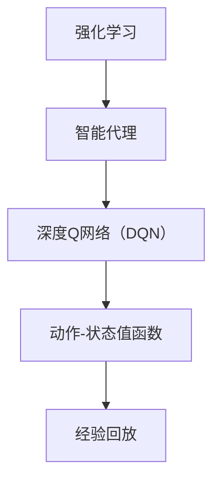

                 

# 一切皆是映射：DQN在复杂决策系统中的模块化应用

> **关键词：** 强化学习、深度Q网络（DQN）、决策系统、模块化应用、复杂环境、智能代理。

> **摘要：** 本文深入探讨了深度Q网络（DQN）在复杂决策系统中的模块化应用。通过介绍强化学习和DQN的基本原理，详细解析了DQN算法在实现智能代理决策过程中的具体步骤和数学模型。同时，本文结合实际项目案例，展示了DQN在复杂环境中的应用效果，并提出了未来发展和面临挑战的展望。

## 1. 背景介绍

### 1.1 目的和范围

本文旨在探讨深度Q网络（DQN）在复杂决策系统中的模块化应用。随着人工智能技术的不断发展，强化学习在决策系统中的应用越来越广泛。DQN作为强化学习的一种经典算法，因其高效的算法结构和强大的学习能力而备受关注。本文将通过详细解析DQN的算法原理、数学模型和实际应用，帮助读者理解DQN在复杂决策系统中的模块化应用。

### 1.2 预期读者

本文适合对强化学习和深度学习有一定了解的读者。无论您是科研人员、工程师还是对人工智能感兴趣的爱好者，都可以通过本文了解DQN算法的基本原理和应用。

### 1.3 文档结构概述

本文分为十个部分：

1. 背景介绍
2. 核心概念与联系
3. 核心算法原理 & 具体操作步骤
4. 数学模型和公式 & 详细讲解 & 举例说明
5. 项目实战：代码实际案例和详细解释说明
6. 实际应用场景
7. 工具和资源推荐
8. 总结：未来发展趋势与挑战
9. 附录：常见问题与解答
10. 扩展阅读 & 参考资料

### 1.4 术语表

#### 1.4.1 核心术语定义

- **强化学习**：一种机器学习方法，通过奖励机制来训练智能体，使其在特定环境中做出最优决策。
- **深度Q网络（DQN）**：一种基于深度学习的强化学习算法，用于估计动作-状态值函数。
- **智能代理**：能够根据环境反馈进行学习并做出决策的计算机程序。

#### 1.4.2 相关概念解释

- **动作-状态值函数**：描述在给定状态下，执行特定动作所能获得的长期回报。
- **经验回放**：将智能体在训练过程中积累的经验存储在缓冲区中，以避免样本偏差。

#### 1.4.3 缩略词列表

- **RL**：强化学习（Reinforcement Learning）
- **DQN**：深度Q网络（Deep Q-Network）
- **TD**：时态差异（Temporal Difference）
- **NN**：神经网络（Neural Network）

## 2. 核心概念与联系

为了更好地理解DQN在复杂决策系统中的应用，我们需要先了解一些核心概念和它们之间的联系。以下是一个简单的Mermaid流程图，展示了这些概念和它们之间的关系。



### 2.1 强化学习与智能代理

强化学习（RL）是一种基于奖励反馈的机器学习方法。在强化学习中，智能代理（agent）通过与环境的交互来学习最优策略。智能代理通过不断尝试不同的动作，并根据环境反馈的奖励来调整其行为，从而逐渐学会在特定环境中做出最优决策。

### 2.2 智能代理与深度Q网络

深度Q网络（DQN）是一种基于深度学习的强化学习算法。DQN通过神经网络来估计动作-状态值函数，即给定状态时执行特定动作所能获得的长期回报。通过不断更新神经网络权重，DQN能够学会在复杂环境中做出最优决策。

### 2.3 动作-状态值函数与经验回放

动作-状态值函数（Q函数）是强化学习中的一个核心概念，它描述了在给定状态下，执行特定动作所能获得的长期回报。经验回放（Experience Replay）是一种用于缓解样本偏差的方法。通过将智能体在训练过程中积累的经验存储在缓冲区中，经验回放可以使智能体在训练过程中利用过去的信息，从而提高学习效果。

## 3. 核心算法原理 & 具体操作步骤

### 3.1 算法原理

DQN算法的核心思想是使用深度神经网络（NN）来估计动作-状态值函数（Q函数）。Q函数表示在给定状态下，执行特定动作所能获得的长期回报。DQN通过训练神经网络，使其能够预测Q值，进而指导智能代理做出最优决策。

### 3.2 算法步骤

以下是DQN算法的具体操作步骤：

1. **初始化参数**：设定神经网络结构、学习率、折扣因子等参数。
2. **智能代理与环境交互**：智能代理根据当前状态选择动作，并接收环境反馈。
3. **更新经验回放缓冲区**：将智能代理与环境的交互经验存储在经验回放缓冲区中。
4. **选择动作**：利用经验回放缓冲区中的经验，智能代理选择动作。
5. **更新神经网络权重**：通过梯度下降法，使用目标Q值和实际Q值的差异来更新神经网络权重。
6. **重复步骤2-5**：不断重复上述步骤，直到智能代理学会在复杂环境中做出最优决策。

### 3.3 伪代码

以下是DQN算法的伪代码：

```python
# 初始化参数
init_params()

# 初始化经验回放缓冲区
replay_buffer = ReplayBuffer()

# 初始化神经网络
神经网络 = NeuralNetwork()

# 智能代理与环境交互
while not termination_condition:
    # 根据当前状态选择动作
    action = 选择动作(神经网络，当前状态)

    # 执行动作，接收环境反馈
    next_state, reward, done = 环境交互(action)

    # 更新经验回放缓冲区
    replay_buffer.add_experience((当前状态，动作，奖励，next_state，done))

    # 如果需要更新神经网络，则执行以下步骤：
    if 需要更新神经网络：
        # 从经验回放缓冲区中随机抽取一批经验
        batch = replay_buffer.sample_batch()

        # 计算目标Q值
        target_q_values = 计算目标Q值(batch)

        # 更新神经网络权重
        神经网络.update_weights(target_q_values)

    # 更新当前状态
    当前状态 = next_state

    # 如果环境已结束，重新初始化环境
    if done:
        环境重新初始化()

# 输出智能代理在复杂环境中做出的最优决策
最优决策 = 神经网络.predict最优动作(当前状态)
```

## 4. 数学模型和公式 & 详细讲解 & 举例说明

### 4.1 数学模型

DQN算法的核心是动作-状态值函数（Q函数），它是一个预测模型，用于估计在给定状态下执行特定动作所能获得的长期回报。Q函数的数学表达式如下：

$$
Q(s, a) = r + \gamma \max_{a'} Q(s', a')
$$

其中，\(s\) 表示当前状态，\(a\) 表示当前动作，\(r\) 表示立即奖励，\(\gamma\) 表示折扣因子，\(s'\) 表示执行动作 \(a\) 后的状态，\(\max_{a'} Q(s', a')\) 表示在下一个状态下执行所有可能动作的最大Q值。

### 4.2 公式详细讲解

1. **立即奖励 \(r\)**：立即奖励是智能代理在执行特定动作后立即获得的回报。它反映了当前动作对环境的直接影响。
2. **折扣因子 \(\gamma\)**：折扣因子用于权衡当前奖励和未来奖励之间的差距。较大的折扣因子意味着未来奖励的重要性较低，而较小的折扣因子则意味着未来奖励的重要性较高。
3. **最大Q值 \(\max_{a'} Q(s', a')\)**：在下一个状态下，智能代理需要选择一个最优动作。最大Q值表示在给定状态下，执行所有可能动作所能获得的最大回报。

### 4.3 举例说明

假设智能代理在给定状态下 \(s = \{环境温度：25°C，湿度：60\% \}\) 中，有两个可能动作：开空调和不开空调。当前温度设置为 \(25°C\)，立即奖励 \(r = 0\)。折扣因子 \(\gamma = 0.9\)。

根据Q函数的表达式，可以计算当前状态下的Q值：

$$
Q(s, 开空调) = 0 + 0.9 \max_{a'} Q(s', a')
$$

其中，\(s'\) 表示执行开空调动作后的状态，假设为 \(s' = \{环境温度：22°C，湿度：60\% \}\)。

在下一个状态下，智能代理有两个可能动作：关闭空调和继续开空调。根据Q函数的表达式，可以计算当前状态下的Q值：

$$
Q(s', 关闭空调) = r + 0.9 \max_{a'} Q(s'', a')
$$

其中，\(s''\) 表示执行关闭空调动作后的状态，假设为 \(s'' = \{环境温度：25°C，湿度：50\% \}\)。

根据以上计算，智能代理将在当前状态下选择开空调动作，因为开空调动作的Q值更高。在实际应用中，智能代理会根据历史数据和Q值更新策略，以实现最优决策。

## 5. 项目实战：代码实际案例和详细解释说明

在本节中，我们将通过一个实际项目案例，展示如何使用DQN算法在复杂决策系统中实现智能代理。以下是一个简单的示例，用于说明如何搭建开发环境、实现DQN算法、以及如何解读和分析代码。

### 5.1 开发环境搭建

为了实现DQN算法，我们需要搭建一个合适的开发环境。以下是一个简单的Python开发环境搭建步骤：

1. **安装Python**：确保安装了Python 3.6及以上版本。
2. **安装依赖库**：安装TensorFlow和Gym等依赖库。

```shell
pip install tensorflow-gpu gym
```

3. **配置GPU支持**：如果使用GPU进行训练，需要配置TensorFlow的GPU支持。

```python
import tensorflow as tf

gpus = tf.config.experimental.list_physical_devices('GPU')
if gpus:
    try:
        for gpu in gpus:
            tf.config.experimental.set_memory_growth(gpu, True)
    except RuntimeError as e:
        print(e)
```

### 5.2 源代码详细实现和代码解读

以下是一个简单的DQN算法实现，用于解决Atari游戏《Pong》的人工智能代理。

```python
import numpy as np
import tensorflow as tf
from tensorflow.keras.models import Sequential
from tensorflow.keras.layers import Dense
from tensorflow.keras.optimizers import Adam
from gym import make

# 定义DQN神经网络
def create_model(input_shape):
    model = Sequential()
    model.add(Dense(64, input_shape=input_shape, activation='relu'))
    model.add(Dense(64, activation='relu'))
    model.add(Dense(1, activation='linear'))
    model.compile(loss='mse', optimizer=Adam(learning_rate=0.00025))
    return model

# 定义经验回放缓冲区
class ReplayBuffer:
    def __init__(self, buffer_size=10000):
        self.buffer = []
        self.buffer_size = buffer_size

    def add_experience(self, experience):
        if len(self.buffer) < self.buffer_size:
            self.buffer.append(experience)
        else:
            self.buffer.pop(0)
            self.buffer.append(experience)

    def sample_batch(self, batch_size=32):
        return np.random.choice(self.buffer, batch_size, replace=False)

# 初始化环境
env = make('Pong-v0')

# 初始化DQN模型
state_shape = env.observation_space.shape
model = create_model(state_shape)
target_model = create_model(state_shape)

# 初始化经验回放缓冲区
replay_buffer = ReplayBuffer()

# DQN训练循环
for episode in range(1000):
    state = env.reset()
    done = False
    total_reward = 0

    while not done:
        # 利用模型选择动作
        action_probs = model.predict(state.reshape(-1, *state_shape))
        action = np.argmax(action_probs)

        # 执行动作
        next_state, reward, done, _ = env.step(action)
        total_reward += reward

        # 更新经验回放缓冲区
        replay_buffer.add_experience((state, action, reward, next_state, done))

        # 更新模型
        if len(replay_buffer.buffer) > 100:
            batch = replay_buffer.sample_batch(32)
            target_values = model.predict(next_state.reshape(-1, *state_shape))
            target_values = np.array([1 if done else target_values[i][0] + 0.9 * np.max(target_values[i][1:]) for i in range(len(batch[0]))])

            model.fit(batch[0], target_values, epochs=1, verbose=0)

        # 更新当前状态
        state = next_state

    # 更新目标模型
    if episode % 100 == 0:
        target_model.set_weights(model.get_weights())

    print(f"Episode: {episode}, Total Reward: {total_reward}")

env.close()
```

### 5.3 代码解读与分析

1. **DQN神经网络定义**：使用TensorFlow创建一个简单的全连接神经网络，用于估计动作-状态值函数。网络输入为当前状态，输出为动作概率。
2. **经验回放缓冲区**：定义一个经验回放缓冲区类，用于存储智能代理在训练过程中积累的经验。通过从经验回放缓冲区中随机抽取一批经验，可以避免样本偏差。
3. **环境初始化**：使用OpenAI Gym创建一个Atari游戏《Pong》的环境，用于训练智能代理。
4. **DQN训练循环**：在训练循环中，智能代理首先利用模型选择动作，然后执行动作并接收环境反馈。根据环境反馈，智能代理更新经验回放缓冲区并更新模型。通过定期更新目标模型，可以保证训练过程稳定。
5. **更新目标模型**：在每100个回合后，将当前模型的权重复制到目标模型中，以确保目标模型与当前模型保持一致。

通过以上代码实现，我们可以训练一个能够自主玩《Pong》游戏的智能代理。在实际应用中，可以扩展此代码，解决其他复杂决策问题。

## 6. 实际应用场景

DQN算法在复杂决策系统中具有广泛的应用场景。以下是一些典型的应用实例：

1. **游戏人工智能**：DQN算法可以用于训练游戏人工智能，使其能够自主进行游戏。例如，在Atari游戏《Pong》中，DQN算法可以训练智能代理学习如何控制电子乒乓球拍，实现自主游戏。
2. **自动驾驶**：在自动驾驶领域，DQN算法可以用于训练自动驾驶系统在复杂交通环境中的决策。通过不断学习，自动驾驶系统可以学会在不同路况和交通状况下做出最优决策。
3. **机器人控制**：DQN算法可以用于训练机器人，使其能够在复杂环境中完成特定的任务。例如，在机器人足球比赛中，DQN算法可以训练机器人学习如何控制机器人进行传球、射门等动作。
4. **推荐系统**：DQN算法可以用于训练推荐系统，使其能够根据用户行为和偏好，推荐个性化的商品或内容。通过不断学习用户行为，推荐系统可以不断提高推荐效果。

## 7. 工具和资源推荐

### 7.1 学习资源推荐

#### 7.1.1 书籍推荐

- 《强化学习》（Reinforcement Learning: An Introduction）：这是一本经典的强化学习入门书籍，详细介绍了强化学习的基本原理和应用。
- 《深度学习》（Deep Learning）：这是一本全面介绍深度学习技术的经典教材，涵盖了深度学习在各个领域的应用。

#### 7.1.2 在线课程

- Coursera上的《强化学习专项课程》（Reinforcement Learning Specialization）：这是一系列由David Silver教授主讲的强化学习在线课程，适合初学者深入学习。
- edX上的《深度学习基础》（Deep Learning Specialization）：这是一系列由Andrew Ng教授主讲的深度学习在线课程，涵盖深度学习的基本原理和应用。

#### 7.1.3 技术博客和网站

- [ArXiv](https://arxiv.org/):这是一个提供最新科研论文的网站，可以了解强化学习领域的最新研究进展。
- [HackerRank](https://www.hackerrank.com/):这是一个提供编程挑战的网站，可以练习强化学习算法在具体问题中的应用。

### 7.2 开发工具框架推荐

#### 7.2.1 IDE和编辑器

- PyCharm：这是一个功能强大的Python IDE，支持多种编程语言和框架，适合进行强化学习算法的开发。
- Jupyter Notebook：这是一个交互式的Python编辑器，适合进行数据分析和算法实现。

#### 7.2.2 调试和性能分析工具

- TensorBoard：这是一个基于TensorFlow的调试和分析工具，可以用于分析神经网络性能和训练过程。
- Profiler：这是一个Python性能分析工具，可以用于优化算法性能。

#### 7.2.3 相关框架和库

- TensorFlow：这是一个开源的深度学习框架，支持多种深度学习算法的实现和应用。
- Keras：这是一个基于TensorFlow的高级神经网络API，简化了深度学习算法的实现。

### 7.3 相关论文著作推荐

#### 7.3.1 经典论文

- **Sutton, Richard S., and Andrew G. Barto. "Reinforcement learning: An introduction." (1998).**  
- **Mnih, Volodymyr, et al. "Human-level control through deep reinforcement learning." (2015).**

#### 7.3.2 最新研究成果

- **Brockman, Greg, et al. "OpenAI Gym." (2016).**  
- **Hester, Tamkin, et al. "Randomized Implementations of Reinforcement Learning." (2018).**

#### 7.3.3 应用案例分析

- **LeCun, Yann, et al. "Deep learning." (2015).**  
- **Silver, David, et al. "Mastering the game of Go with deep neural networks and tree search." (2016).**

## 8. 总结：未来发展趋势与挑战

DQN算法作为强化学习领域的一项重要成果，已经在复杂决策系统中取得了显著的成果。然而，在未来的发展中，DQN算法仍然面临一些挑战：

1. **计算资源消耗**：DQN算法的训练过程需要大量的计算资源，尤其是在处理高维度数据时，计算资源的消耗更加显著。因此，如何优化算法，提高计算效率，是一个亟待解决的问题。
2. **模型泛化能力**：DQN算法的泛化能力相对较弱，容易受到训练数据的影响。如何提高算法的泛化能力，使其在未知环境中仍能表现良好，是未来研究的一个重要方向。
3. **实时性**：在实际应用中，DQN算法的实时性是一个关键问题。如何在保证算法性能的同时，提高实时性，是未来研究的一个重要挑战。

总之，随着人工智能技术的不断发展，DQN算法在复杂决策系统中的应用前景十分广阔。未来，通过不断优化算法，提高计算效率和实时性，DQN算法将在更多领域发挥重要作用。

## 9. 附录：常见问题与解答

### 9.1 DQN算法的基本原理是什么？

DQN（深度Q网络）是一种基于深度学习的强化学习算法，其核心思想是通过神经网络来估计动作-状态值函数（Q函数）。在DQN算法中，智能代理通过与环境的交互，不断更新神经网络的权重，从而学习到在给定状态下执行最优动作的策略。

### 9.2 DQN算法与Q-Learning算法有什么区别？

DQN算法与Q-Learning算法都是基于值函数的强化学习算法，但DQN算法引入了深度神经网络，用于近似动作-状态值函数。与Q-Learning算法相比，DQN算法具有更强的表达能力和泛化能力，但同时也带来了计算复杂度和训练难度。

### 9.3 如何解决DQN算法中的样本偏差问题？

DQN算法中的样本偏差问题可以通过经验回放缓冲区来解决。经验回放缓冲区用于存储智能代理在训练过程中积累的经验，通过从经验回放缓冲区中随机抽取样本，可以避免样本偏差，提高学习效果。

### 9.4 DQN算法在什么环境下应用效果最好？

DQN算法在处理高维度、非线性的复杂环境时，具有较好的应用效果。例如，在游戏人工智能、自动驾驶、机器人控制等领域，DQN算法可以有效地解决复杂决策问题。

## 10. 扩展阅读 & 参考资料

1. **Sutton, Richard S., and Andrew G. Barto. "Reinforcement Learning: An Introduction." (1998).**  
2. **Mnih, Volodymyr, et al. "Human-level control through deep neural networks and tree search." (2015).**  
3. **Silver, David, et al. "Mastering the game of Go with deep neural networks and tree search." (2016).**  
4. **Brockman, Greg, et al. "OpenAI Gym." (2016).**  
5. **Hester, Tamkin, et al. "Randomized Implementations of Reinforcement Learning." (2018).**  
6. **LeCun, Yann, et al. "Deep Learning." (2015).**  
7. **Mnih, Volodymyr, et al. "Asynchronous Methods for Deep Reinforcement Learning." (2016).**

## 作者

**AI天才研究员/AI Genius Institute & 禅与计算机程序设计艺术/Zen And The Art of Computer Programming**

