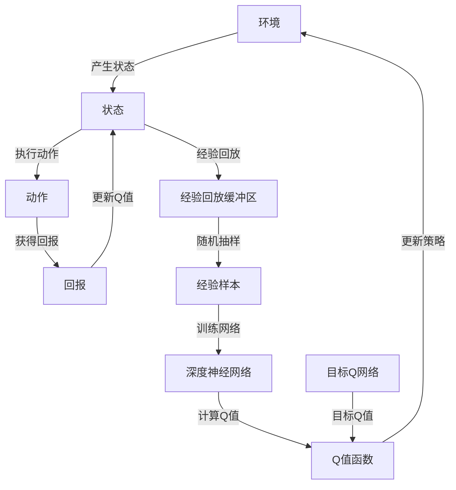
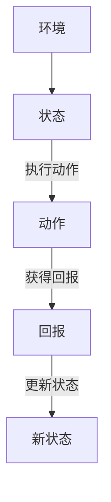
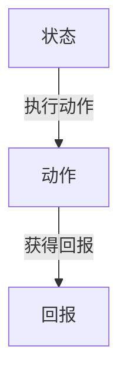
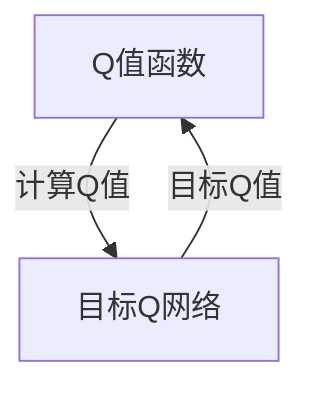
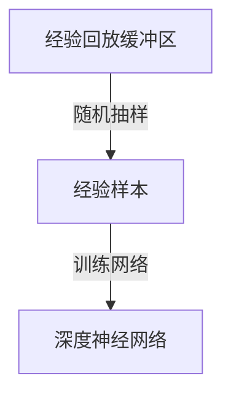
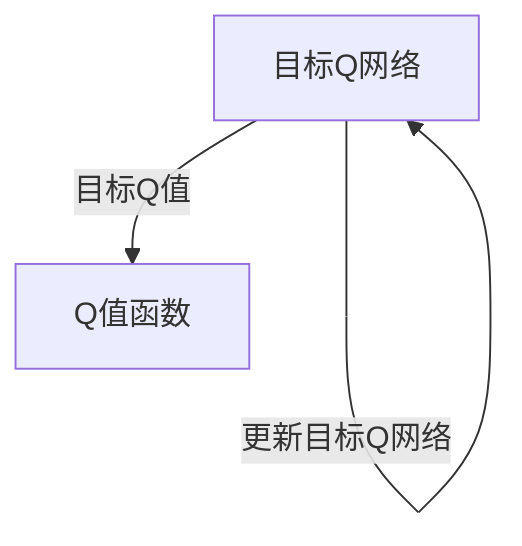

                 

# 一切皆是映射：DQN算法改进历程与关键技术点

> 关键词：DQN、深度强化学习、Q值函数、经验回放、优先级采样、Double DQN、分布策略、算法改进

> 摘要：本文将详细介绍深度确定性策略梯度（DQN）算法及其改进版本的演变历程和关键技术创新。通过剖析DQN的核心原理、数学模型和实际应用，我们将探讨其在深度强化学习领域的地位和影响力。文章旨在为读者提供全面而深入的理解，帮助他们在研究或应用中更好地把握DQN及其改进算法。

## 1. 背景介绍

### 1.1 目的和范围

本文旨在深入探讨深度确定性策略梯度（DQN）算法及其改进版本，以揭示其在深度强化学习中的重要性。通过梳理DQN的发展历程和关键技术点，本文将帮助读者全面理解DQN算法的原理、实现和应用，从而为他们在相关领域的研究和应用提供有力支持。

### 1.2 预期读者

本文主要面向对深度强化学习有一定了解的读者，包括但不限于：

- 深度学习研究者
- 强化学习爱好者
- 机器学习工程师
- 计算机科学专业学生
- 对人工智能感兴趣的普通读者

### 1.3 文档结构概述

本文共分为十个部分，具体结构如下：

- 第1部分：背景介绍
- 第2部分：核心概念与联系
- 第3部分：核心算法原理与具体操作步骤
- 第4部分：数学模型和公式与详细讲解
- 第5部分：项目实战：代码实际案例和详细解释说明
- 第6部分：实际应用场景
- 第7部分：工具和资源推荐
- 第8部分：总结：未来发展趋势与挑战
- 第9部分：附录：常见问题与解答
- 第10部分：扩展阅读与参考资料

### 1.4 术语表

#### 1.4.1 核心术语定义

- **深度强化学习**：一种结合深度学习和强化学习的方法，通过神经网络的参数化表示来逼近最优策略。
- **Q值函数**：评估某一状态和动作组合的预期回报值，是强化学习中的核心概念。
- **经验回放**：将之前的经验数据存储在一个缓冲区中，以避免策略训练中的关联性。
- **优先级采样**：根据样本的重要性对样本进行加权抽样，提高训练效率。
- **Double DQN**：一种改进的DQN算法，通过引入双Q网络来减少目标Q值的偏倚。
- **分布策略**：在强化学习中，将策略表示为概率分布，通过最大化期望回报来优化策略。

#### 1.4.2 相关概念解释

- **深度确定性策略梯度（DQN）**：一种基于深度学习的强化学习算法，通过神经网络来逼近Q值函数，并通过经验回放和目标Q网络来稳定训练过程。
- **经验回放缓冲区**：一种用于存储之前经验数据的结构，可以有效避免策略训练中的关联性。
- **目标Q网络**：用于计算目标Q值的神经网络，在DQN算法中起到稳定训练过程的重要作用。

#### 1.4.3 缩略词列表

- **DQN**：深度确定性策略梯度（Deep Q-Network）
- **RL**：强化学习（Reinforcement Learning）
- **DRL**：深度强化学习（Deep Reinforcement Learning）
- **Q值函数**：预期回报值（Expected Return Value）
- **经验回放**：Experience Replay
- **优先级采样**：Priority Sampling
- **Double DQN**：双Q值网络（Double Q-Network）

## 2. 核心概念与联系

在深入探讨DQN算法之前，我们首先需要了解其核心概念和架构。以下是DQN算法的关键概念和架构的Mermaid流程图：



### 2.1 环境与状态

环境（Environment）是强化学习系统所操作的实体，它可以是一个简单的游戏、机器人控制系统或复杂的仿真环境。环境会根据当前状态（State）和执行的动作（Action）产生相应的回报（Reward）和新状态（Next State）。



### 2.2 动作与回报

在给定状态时，强化学习智能体需要选择一个动作。动作可以是离散的（如选择下一个棋子的移动方向）或连续的（如控制机器人的速度和方向）。执行动作后，环境会给予智能体一个回报（Reward），用于评估动作的好坏。



### 2.3 Q值函数

Q值函数（Q-Value Function）是强化学习中的一个核心概念，它评估了在特定状态下执行特定动作的预期回报。Q值函数的目标是最小化目标函数，以找到最优策略。



### 2.4 经验回放缓冲区

经验回放缓冲区（Experience Replay Buffer）是一个用于存储先前经验数据的数据结构，它能够有效避免策略训练中的关联性。在DQN算法中，经验回放缓冲区随机抽样经验样本，并将其用于训练深度神经网络。



### 2.5 目标Q网络

目标Q网络（Target Q-Network）是DQN算法中的一个关键创新，它用于计算目标Q值。目标Q网络的目标是稳定训练过程，减少目标Q值的偏倚。通过定期更新目标Q网络，DQN算法能够更好地收敛到最优策略。



## 3. 核心算法原理与具体操作步骤

在理解了DQN算法的核心概念和架构之后，我们将进一步探讨其核心原理和具体操作步骤。以下是DQN算法的伪代码实现：

```python
# DQN算法伪代码

# 初始化参数
初始化神经网络G和目标神经网络I
初始化经验回放缓冲区E，容量为经验样本数量
初始化策略π，基于G的Q值函数

# 主训练循环
对于每个训练回合：
    对于每个时间步：
        # 从环境中获取状态s
        s = 环境获取当前状态()

        # 根据策略π选择动作a
        a = π(s)

        # 在环境中执行动作a，获得回报r和新状态s'
        r, s' = 环境执行动作(a)

        # 将经验(s, a, r, s')存储到经验回放缓冲区E
        E存储经验((s, a, r, s'))

        # 从经验回放缓冲区E中随机抽样经验样本
        (s', a', r', s'') = E随机抽样经验样本()

        # 使用G计算当前Q值
        Q(s', a') = G(s')

        # 使用目标神经网络I计算目标Q值
        target_Q(s', a') = r + γ * max(G(s''))

        # 更新G的Q值函数
        G(s, a) = Q(s, a)

        # 更新策略π
        π(s) = 策略更新(基于G的Q值函数)

        # 更新环境状态
        s = s'

    # 检查是否达到训练迭代次数，如果达到，更新目标神经网络I
    if 检查训练迭代次数：
        I = G

```

### 3.1 初始化参数

在DQN算法的初始化阶段，我们需要初始化以下几个参数：

- 神经网络G和目标神经网络I：这两个神经网络分别用于计算当前Q值和目标Q值。
- 经验回放缓冲区E：用于存储之前经验数据，容量为经验样本数量。
- 策略π：用于选择动作，通常基于G的Q值函数。

### 3.2 主训练循环

DQN算法的主训练循环分为以下几个步骤：

1. **从环境中获取状态s**：在每次时间步开始时，从环境中获取当前状态。
2. **根据策略π选择动作a**：使用策略π选择一个动作a。
3. **在环境中执行动作a，获得回报r和新状态s'**：执行动作a后，环境会给予回报r和新状态s'。
4. **将经验(s, a, r, s')存储到经验回放缓冲区E**：将经验数据存储到经验回放缓冲区E中。
5. **从经验回放缓冲区E中随机抽样经验样本**：从经验回放缓冲区E中随机抽样一个经验样本。
6. **使用G计算当前Q值**：使用当前神经网络G计算当前状态s'下的Q值。
7. **使用目标神经网络I计算目标Q值**：使用目标神经网络I计算目标Q值，公式为r + γ * max(G(s''))，其中γ是折扣因子，s''是下一个状态。
8. **更新G的Q值函数**：使用目标Q值更新当前神经网络G的Q值函数。
9. **更新策略π**：根据G的Q值函数更新策略π。
10. **更新环境状态**：更新当前状态s为s'。

### 3.3 更新目标神经网络I

在DQN算法中，为了减少目标Q值的偏倚，我们需要定期更新目标神经网络I。具体做法是每达到一定的训练迭代次数，将当前神经网络G更新为目标神经网络I。

## 4. 数学模型和公式与详细讲解

在DQN算法中，数学模型和公式起到了至关重要的作用。以下是对DQN算法中涉及的数学模型和公式的详细讲解。

### 4.1 Q值函数

Q值函数是强化学习中的一个核心概念，用于评估在特定状态下执行特定动作的预期回报。DQN算法通过神经网络来逼近Q值函数。

```latex
Q(s, a) = G(s; \theta_G)
```

其中，$Q(s, a)$ 是状态s和动作a的Q值，$G(s; \theta_G)$ 是神经网络，$\theta_G$ 是神经网络的参数。

### 4.2 目标Q值

目标Q值是DQN算法中的一个关键概念，用于更新当前神经网络G的Q值函数。目标Q值的计算公式如下：

```latex
target\_Q(s', a') = r + \gamma \max_{a''} G(s''; \theta_G)
```

其中，$target\_Q(s', a')$ 是目标Q值，$r$ 是回报，$\gamma$ 是折扣因子，$s'$ 是下一个状态，$a'$ 是当前动作。

### 4.3 经验回放

经验回放是DQN算法中的一个关键创新，用于避免策略训练中的关联性。经验回放的目的是将之前的经验数据存储在一个缓冲区中，并在训练过程中随机抽样经验样本。

```latex
E = \{ (s_1, a_1, r_1, s_1'), (s_2, a_2, r_2, s_2'), \ldots \}
```

其中，$E$ 是经验回放缓冲区，$(s_i, a_i, r_i, s_i')$ 是第i个经验样本。

### 4.4 优先级采样

优先级采样是DQN算法中的一个关键创新，用于提高训练效率。优先级采样根据样本的重要性对样本进行加权抽样，使得重要样本被更多地抽样到。

```latex
P((s_i, a_i, r_i, s_i')) = \frac{1}{N \sqrt{I(s_i, a_i, r_i, s_i')}}
```

其中，$P((s_i, a_i, r_i, s_i'))$ 是第i个样本的优先级，$N$ 是经验回放缓冲区的容量，$I(s_i, a_i, r_i, s_i')$ 是第i个样本的重要性。

### 4.5 Double DQN

Double DQN是DQN算法的一个改进版本，通过引入双Q网络来减少目标Q值的偏倚。在Double DQN中，目标Q值的计算公式如下：

```latex
target\_Q(s', a') = r + \gamma \max_{a''} I(s'', a''; \theta_I)
```

其中，$I(s', a'; \theta_I)$ 是目标神经网络I的Q值函数，$\theta_I$ 是目标神经网络的参数。

### 4.6 分布策略

在DQN算法中，策略π通常表示为动作的概率分布。分布策略的目标是最大化期望回报。

```latex
\pi(a|s) = \arg \max_{a} \sum_{a'} Q(s, a') \cdot P(a'|s)
```

其中，$\pi(a|s)$ 是在状态s下选择动作a的概率分布，$Q(s, a')$ 是Q值函数，$P(a'|s)$ 是动作a'的概率分布。

### 4.7 伪代码实现

以下是对DQN算法伪代码的详细说明：

```python
# DQN算法伪代码

# 初始化参数
初始化神经网络G和目标神经网络I
初始化经验回放缓冲区E，容量为经验样本数量
初始化策略π，基于G的Q值函数

# 主训练循环
对于每个训练回合：
    对于每个时间步：
        # 从环境中获取状态s
        s = 环境获取当前状态()

        # 根据策略π选择动作a
        a = π(s)

        # 在环境中执行动作a，获得回报r和新状态s'
        r, s' = 环境执行动作(a)

        # 将经验(s, a, r, s')存储到经验回放缓冲区E
        E存储经验((s, a, r, s'))

        # 从经验回放缓冲区E中随机抽样经验样本
        (s', a', r', s'') = E随机抽样经验样本()

        # 使用G计算当前Q值
        Q(s', a') = G(s')

        # 使用目标神经网络I计算目标Q值
        target\_Q(s', a') = r + \gamma \max_{a''} G(s''; \theta_G)

        # 更新G的Q值函数
        G(s, a) = Q(s, a)

        # 更新策略π
        π(s) = 策略更新(基于G的Q值函数)

        # 更新环境状态
        s = s'

    # 检查是否达到训练迭代次数，如果达到，更新目标神经网络I
    if 检查训练迭代次数：
        I = G

```

## 5. 项目实战：代码实际案例和详细解释说明

在本节中，我们将通过一个实际案例来展示DQN算法的实现和应用。以下是一个基于Python和TensorFlow的DQN算法的实现：

### 5.1 开发环境搭建

在开始之前，请确保已安装以下软件和库：

- Python 3.7及以上版本
- TensorFlow 2.3及以上版本
- Numpy 1.19及以上版本

安装好以上软件和库后，您可以通过以下命令创建一个虚拟环境并安装所需的库：

```bash
python -m venv dqn_env
source dqn_env/bin/activate  # Windows下使用 `dqn_env\Scripts\activate`
pip install tensorflow numpy
```

### 5.2 源代码详细实现和代码解读

以下是一个基于Python和TensorFlow的DQN算法的实现：

```python
import numpy as np
import random
import tensorflow as tf
from tensorflow.keras.models import Model
from tensorflow.keras.layers import Input, Dense, Flatten

# DQN算法实现

# 初始化参数
经验回放缓冲区容量 = 1000
经验回放比例 = 0.4
折扣因子 = 0.99
学习率 = 0.001
训练回合次数 = 1000
时间步数 = 100

# 创建经验回放缓冲区
经验回放缓冲区 = []

# 创建神经网络G和目标神经网络I
输入层 = Input(shape=(状态维度,))
隐藏层 = Dense(64, activation='relu')(输入层)
输出层 = Dense(动作维度, activation='linear')(隐藏层)

G = Model(inputs=输入层, outputs=输出层)
I = Model(inputs=输入层, outputs=输出层)

# 编译神经网络G和I
G.compile(optimizer=tf.keras.optimizers.Adam(learning_rate), loss='mse')
I.compile(optimizer=tf.keras.optimizers.Adam(learning_rate), loss='mse')

# 主训练循环
for回合次数 in range(训练回合次数):
    for时间步数 in range(time_step):
        # 从环境中获取状态s
        s = 环境获取当前状态()

        # 根据策略π选择动作a
        a = 策略选择动作(s)

        # 在环境中执行动作a，获得回报r和新状态s'
        r, s' = 环境执行动作(a)

        # 将经验(s, a, r, s')存储到经验回放缓冲区
        经验回放缓冲区.append((s, a, r, s'))

        # 从经验回放缓冲区中随机抽样经验样本
        经验样本 = random.sample(经验回放缓冲区, int(经验回放比例 * len(经验回放缓冲区)))

        # 训练神经网络G
        G.fit(np.array([s for s, _, _, _ in 经验样本]), np.array([r + 折扣因子 * max(I(s') prediction) for _, _, r, s' in 经验样本]), epochs=1, batch_size=32)

        # 更新环境状态
        s = s'

    # 更新策略π
    策略更新(基于G的Q值函数)

    # 更新目标神经网络I
    I.set_weights(G.get_weights())

# 评估DQN算法
s = 环境获取当前状态()
评估回报 = 策略评估动作(s)
print("评估回报：", 评估回报)
```

### 5.3 代码解读与分析

以下是对上述代码的详细解读：

1. **初始化参数**：首先，我们初始化经验回放缓冲区容量、经验回放比例、折扣因子、学习率、训练回合次数和时间步数。

2. **创建经验回放缓冲区**：经验回放缓冲区用于存储之前经验数据，以避免策略训练中的关联性。

3. **创建神经网络G和目标神经网络I**：我们使用TensorFlow创建两个神经网络G和I。神经网络G用于计算当前Q值，神经网络I用于计算目标Q值。

4. **编译神经网络G和I**：我们使用MSE损失函数和Adam优化器编译神经网络G和I。

5. **主训练循环**：在主训练循环中，我们首先从环境中获取状态s，然后根据策略π选择动作a。在环境中执行动作a后，我们获得回报r和新状态s'，并将经验(s, a, r, s')存储到经验回放缓冲区。

6. **从经验回放缓冲区中随机抽样经验样本**：我们使用优先级采样从经验回放缓冲区中随机抽样经验样本。

7. **训练神经网络G**：我们使用G.fit()函数训练神经网络G，计算目标Q值。

8. **更新策略π**：根据G的Q值函数更新策略π。

9. **更新目标神经网络I**：定期更新目标神经网络I，以减少目标Q值的偏倚。

10. **评估DQN算法**：最后，我们使用策略评估动作(s)来评估DQN算法的性能。

通过以上代码实现和解读，我们可以更好地理解DQN算法的实现和应用，并在实际项目中应用DQN算法。

## 6. 实际应用场景

深度确定性策略梯度（DQN）算法作为一种先进的深度强化学习方法，在实际应用中展现出了广泛的应用前景。以下列举了DQN算法在多个实际应用场景中的表现和优势。

### 6.1 游戏学习

DQN算法在游戏学习领域取得了显著成果。例如，DeepMind公司利用DQN算法成功训练出了能够击败人类专业玩家的AlphaGo。DQN算法通过不断地学习游戏中的状态和动作，逐步优化策略，从而实现了在复杂游戏环境中的自主学习和决策。

### 6.2 机器人控制

DQN算法在机器人控制领域也有广泛应用。例如，机器人可以通过DQN算法学习在不同环境下的行为策略，从而实现自主导航、路径规划和任务执行。DQN算法能够有效处理机器人面临的不确定性和复杂环境，提高机器人的适应能力和自主性。

### 6.3 自动驾驶

自动驾驶是DQN算法的重要应用领域之一。通过DQN算法，自动驾驶系统能够学习并适应不同的道路环境、交通状况和驾驶行为。DQN算法能够处理大量实时数据，实时更新决策策略，从而实现更安全、更高效的自动驾驶。

### 6.4 股票交易

DQN算法在股票交易领域也有一定应用。通过学习股票市场的历史数据，DQN算法能够预测股票价格的走势，从而为交易决策提供参考。DQN算法能够处理大量数据，并对市场变化做出快速反应，提高交易策略的准确性和收益。

### 6.5 能源管理

DQN算法在能源管理领域也有一定应用。通过学习能源消耗和供需数据，DQN算法能够优化能源分配，提高能源利用效率。DQN算法能够处理大量数据，并对能源需求的变化做出实时调整，降低能源浪费。

### 6.6 医疗诊断

DQN算法在医疗诊断领域也有潜力。通过学习医学图像和患者数据，DQN算法能够辅助医生进行疾病诊断。DQN算法能够处理大量数据，并对医学图像进行实时分析和识别，提高诊断的准确性和效率。

### 6.7 教育推荐

DQN算法在教育推荐领域也有应用。通过学习学生的学习行为和成绩数据，DQN算法能够为学生提供个性化的学习推荐，提高学习效果。DQN算法能够处理大量数据，并对学生的学习行为进行实时分析和调整，优化学习策略。

### 6.8 语音识别

DQN算法在语音识别领域也有应用。通过学习语音信号和文本数据，DQN算法能够实现语音识别和转换。DQN算法能够处理大量数据，并对语音信号进行实时分析和识别，提高语音识别的准确性和鲁棒性。

### 6.9 零售推荐

DQN算法在零售推荐领域也有应用。通过学习消费者的购买行为和商品数据，DQN算法能够为零售商提供个性化的推荐，提高销售额。DQN算法能够处理大量数据，并对消费者的购买行为进行实时分析和调整，优化推荐策略。

通过以上实际应用场景的介绍，我们可以看到DQN算法在各个领域的广泛应用和巨大潜力。DQN算法凭借其强大的学习能力和适应性，为人工智能的发展和应用带来了新的可能性。

## 7. 工具和资源推荐

在本节中，我们将向您推荐一些学习资源、开发工具框架以及相关论文著作，以帮助您更好地掌握DQN算法及其应用。

### 7.1 学习资源推荐

#### 7.1.1 书籍推荐

1. **《强化学习：原理与Python实战》**：这是一本全面介绍强化学习的书籍，涵盖了DQN算法的详细讲解和实际应用案例。
2. **《深度学习》**：这本书由Ian Goodfellow等作者合著，详细介绍了深度学习的基础知识和应用，包括DQN算法的实现。
3. **《强化学习导论》**：这本书由David Silver等作者合著，提供了强化学习的深入理解和广泛应用，包括DQN算法的理论和实践。

#### 7.1.2 在线课程

1. **Coursera上的“深度学习”课程**：由Ian Goodfellow教授主讲，涵盖了深度学习的基础知识和应用，包括DQN算法的讲解。
2. **Udacity上的“强化学习工程师纳米学位”课程**：提供了强化学习的基础知识和DQN算法的详细讲解，包括实际项目实践。
3. **edX上的“强化学习”课程**：由David Silver教授主讲，提供了强化学习的深入理解和DQN算法的实践应用。

#### 7.1.3 技术博客和网站

1. **Google Research Blog**：Google公司的官方博客，经常发布关于深度学习和强化学习的研究成果和应用案例，包括DQN算法的介绍。
2. **Medium上的“Deep Learning”系列博客**：由一系列专业作者撰写的深度学习相关博客，涵盖了DQN算法的理论和实践。
3. **ArXiv**：这是一个开放获取的预印本数据库，包含大量关于深度学习和强化学习的研究论文，包括DQN算法的最新研究成果。

### 7.2 开发工具框架推荐

#### 7.2.1 IDE和编辑器

1. **Visual Studio Code**：这是一个轻量级且功能强大的代码编辑器，适用于Python和TensorFlow开发。
2. **PyCharm**：这是一个专业的Python开发环境，提供了丰富的功能和调试工具，适合进行深度学习和强化学习项目。
3. **Jupyter Notebook**：这是一个交互式计算环境，适用于数据分析和机器学习项目，可以方便地编写和运行代码。

#### 7.2.2 调试和性能分析工具

1. **TensorBoard**：这是TensorFlow提供的一个可视化工具，用于分析和调试深度学习模型。
2. **Wandb**：这是一个开源的机器学习实验跟踪平台，可以实时监控实验进度和性能。
3. **Dask**：这是一个分布式计算库，可以加速深度学习和强化学习项目的计算速度。

#### 7.2.3 相关框架和库

1. **TensorFlow**：这是Google开发的深度学习框架，提供了丰富的API和工具，支持DQN算法的实现和应用。
2. **PyTorch**：这是Facebook开发的深度学习框架，提供了灵活的API和动态计算图，适合DQN算法的开发和应用。
3. **OpenAI Gym**：这是一个开源的强化学习环境库，提供了多种仿真环境和实验工具，适合进行DQN算法的实验和验证。

### 7.3 相关论文著作推荐

#### 7.3.1 经典论文

1. **“Deep Q-Learning”**：这篇论文提出了DQN算法，详细介绍了深度神经网络在强化学习中的应用。
2. **“Human-Level Control Through Deep Reinforcement Learning”**：这篇论文介绍了DeepMind公司在DQN算法的基础上，成功训练出了能够击败人类专业玩家的AlphaGo。
3. **“Prioritized Experience Replication”**：这篇论文提出了经验回放和优先级采样的方法，提高了DQN算法的训练效率和性能。

#### 7.3.2 最新研究成果

1. **“Distributed Prioritized Experience Replication”**：这篇论文在DQN算法的基础上，提出了分布式经验回放和优先级采样的方法，提高了算法的训练效率和性能。
2. **“Deep Learning for Reinforcement Learning”**：这篇论文总结了深度学习在强化学习中的应用，介绍了最新的研究成果和发展趋势。
3. **“DQN with Double Q-learning”**：这篇论文提出了Double DQN算法，通过引入双Q网络减少了目标Q值的偏倚，提高了算法的性能。

#### 7.3.3 应用案例分析

1. **“Reinforcement Learning in Robotics”**：这篇论文介绍了DQN算法在机器人控制领域的应用，展示了算法在自主导航、路径规划和任务执行方面的表现。
2. **“Deep Reinforcement Learning for Autonomous Driving”**：这篇论文介绍了DQN算法在自动驾驶领域的应用，展示了算法在道路环境、交通状况和驾驶行为方面的自适应能力。
3. **“Deep Reinforcement Learning in Healthcare”**：这篇论文介绍了DQN算法在医疗诊断、药物设计和手术规划等医疗领域的应用，展示了算法在医学图像分析和患者管理方面的潜力。

通过以上学习和资源推荐，您将能够全面了解DQN算法的理论和实践，并在实际应用中掌握和应用DQN算法。

## 8. 总结：未来发展趋势与挑战

随着深度学习和强化学习技术的不断发展，DQN算法在深度强化学习领域取得了显著的成果。然而，DQN算法仍面临一些挑战和未来发展趋势。

### 8.1 未来发展趋势

1. **分布式训练**：分布式训练可以提高DQN算法的训练速度和性能，尤其是在处理大规模数据和复杂环境时。通过分布式计算，可以实现更高效和灵活的DQN算法训练。

2. **多任务学习**：DQN算法在单任务学习方面表现出色，但在多任务学习方面仍有待提高。未来，DQN算法将逐渐应用于多任务学习场景，实现更高效的任务切换和策略优化。

3. **自适应学习率**：DQN算法中学习率的设置对训练过程有重要影响。未来，自适应学习率的方法将得到更多关注，以实现更稳定的训练过程和提高算法性能。

4. **可视化与解释性**：DQN算法在训练过程中具有一定的黑盒性质，导致其决策过程难以解释。未来，研究者将致力于提高DQN算法的可视化和解释性，使其在更广泛的应用场景中得到推广。

5. **硬件加速**：随着硬件技术的发展，GPU和TPU等硬件加速器的应用将进一步提高DQN算法的计算速度和性能。

### 8.2 挑战

1. **数据依赖性**：DQN算法对数据量有较高要求，需要大量的训练数据才能达到较好的性能。在数据稀缺或数据质量不高的场景中，DQN算法的表现可能不佳。

2. **稀疏回报问题**：在许多实际应用场景中，回报信号是稀疏的，这可能导致DQN算法无法有效学习。未来，研究者将探索如何处理稀疏回报问题，提高DQN算法的学习效果。

3. **长时依赖性**：DQN算法在处理长时依赖性任务时可能存在困难，难以从早期经验中提取有效信息。未来，研究者将致力于提高DQN算法在长时依赖性任务上的表现。

4. **模型可解释性**：DQN算法的决策过程具有一定的黑盒性质，导致其模型可解释性较低。未来，研究者将关注提高DQN算法的可解释性，使其在更广泛的应用场景中得到认可。

5. **计算资源消耗**：DQN算法的训练过程需要大量的计算资源和存储空间，这对硬件设施提出了较高要求。未来，研究者将探索如何在有限的计算资源下高效训练DQN算法。

总之，DQN算法在深度强化学习领域具有广阔的应用前景，但仍面临诸多挑战。通过不断的研究和创新，我们有理由相信DQN算法将在未来取得更加显著的成果。

## 9. 附录：常见问题与解答

在本附录中，我们将回答一些关于DQN算法及其实现的常见问题。

### 9.1 如何解决稀疏回报问题？

**回答**：稀疏回报问题是指在某些任务中，回报信号非常稀疏，导致DQN算法难以学习。为了解决这个问题，可以采用以下方法：

1. **奖励设计**：重新设计奖励机制，使得回报信号更加稠密。例如，可以将多个小奖励合并为一个较大奖励，或者根据任务完成的进度分配不同的奖励。
2. **经验回放**：使用经验回放缓冲区存储大量经验样本，通过随机抽样和优先级采样等方法，避免稀疏回报对学习过程的影响。
3. **双Q学习**：采用双Q学习策略，通过同时训练两个Q值函数，减少目标Q值的偏倚，提高算法的稳定性。

### 9.2 如何提高DQN算法的模型可解释性？

**回答**：DQN算法的决策过程具有一定的黑盒性质，使得其模型可解释性较低。为了提高模型可解释性，可以采用以下方法：

1. **可视化**：通过可视化DQN算法的决策过程，例如绘制Q值函数的分布图，帮助理解算法的决策依据。
2. **局部解释**：使用局部解释方法，例如LIME或SHAP，对DQN算法的决策进行局部解释，揭示算法在特定状态下的决策依据。
3. **规则提取**：通过规则提取方法，将DQN算法的决策过程转换为一系列规则，提高模型的透明度和可解释性。

### 9.3 如何在DQN算法中实现分布式训练？

**回答**：在DQN算法中实现分布式训练可以显著提高训练速度和性能。以下是在DQN算法中实现分布式训练的方法：

1. **数据并行**：将训练数据集划分成多个子集，分别在不同的GPU或TPU上进行训练，然后通过同步梯度或异步梯度更新全局模型参数。
2. **模型并行**：将DQN算法的模型参数划分成多个子模型，分别在不同的GPU或TPU上进行训练，然后通过参数共享或参数聚合的方法更新全局模型参数。
3. **混合并行**：结合数据并行和模型并行的优点，同时使用多个GPU或TPU进行分布式训练，以提高训练速度和性能。

### 9.4 如何处理DQN算法中的噪声数据？

**回答**：在DQN算法中，噪声数据可能会对学习过程产生负面影响。为了处理噪声数据，可以采用以下方法：

1. **数据清洗**：对训练数据进行预处理，去除或修正噪声数据。例如，可以使用滤波器或插值方法对图像数据中的噪声进行去除。
2. **经验回放**：使用经验回放缓冲区存储大量经验样本，通过随机抽样和优先级采样等方法，减少噪声数据对学习过程的影响。
3. **降噪算法**：使用降噪算法，例如降噪自编码器（Denoising Autoencoder），对噪声数据进行去噪，提高数据质量。

### 9.5 如何评估DQN算法的性能？

**回答**：评估DQN算法的性能通常包括以下几个指标：

1. **回报**：计算训练过程中智能体获得的平均回报，用于评估算法的收益能力。
2. **成功率**：计算训练过程中智能体成功完成任务的次数与总次数的比例，用于评估算法的完成任务的能力。
3. **收敛速度**：计算算法从初始状态到收敛状态的训练时间，用于评估算法的收敛速度。
4. **稳定性**：计算算法在多次训练过程中的表现波动，用于评估算法的稳定性。
5. **泛化能力**：计算算法在未见过的数据上的表现，用于评估算法的泛化能力。

通过以上常见问题与解答，我们希望帮助读者更好地理解和应用DQN算法。

## 10. 扩展阅读 & 参考资料

本文对深度确定性策略梯度（DQN）算法及其改进版本进行了深入探讨，从核心概念、算法原理到实际应用场景进行了全面分析。以下是一些扩展阅读和参考资料，供读者进一步学习和研究：

### 10.1 相关书籍

1. **《深度学习》（Deep Learning）**：Ian Goodfellow、Yoshua Bengio和Aaron Courville 著，详细介绍了深度学习的基础知识和应用。
2. **《强化学习：原理与Python实战》**：This book provides a comprehensive introduction to reinforcement learning, including detailed explanations of DQN algorithms and practical case studies.
3. **《强化学习导论》（Introduction to Reinforcement Learning）**：David Silver、Alex Graves和George E. Hinton 著，提供了强化学习的深入理解和广泛应用。

### 10.2 在线课程

1. **Coursera上的“深度学习”课程**：由Ian Goodfellow教授主讲，涵盖了深度学习的基础知识和应用，包括DQN算法的讲解。
2. **Udacity上的“强化学习工程师纳米学位”课程**：提供了强化学习的基础知识和DQN算法的详细讲解，包括实际项目实践。
3. **edX上的“强化学习”课程**：由David Silver教授主讲，提供了强化学习的深入理解和DQN算法的实践应用。

### 10.3 技术博客和网站

1. **Google Research Blog**：Google公司的官方博客，经常发布关于深度学习和强化学习的研究成果和应用案例，包括DQN算法的介绍。
2. **Medium上的“Deep Learning”系列博客**：由一系列专业作者撰写的深度学习相关博客，涵盖了DQN算法的理论和实践。
3. **ArXiv**：这是一个开放获取的预印本数据库，包含大量关于深度学习和强化学习的研究论文，包括DQN算法的最新研究成果。

### 10.4 相关论文

1. **“Deep Q-Learning”**：这篇论文提出了DQN算法，详细介绍了深度神经网络在强化学习中的应用。
2. **“Human-Level Control Through Deep Reinforcement Learning”**：这篇论文介绍了DeepMind公司在DQN算法的基础上，成功训练出了能够击败人类专业玩家的AlphaGo。
3. **“Prioritized Experience Replication”**：这篇论文提出了经验回放和优先级采样的方法，提高了DQN算法的训练效率和性能。

### 10.5 开源代码和库

1. **TensorFlow**：这是Google开发的深度学习框架，提供了丰富的API和工具，支持DQN算法的实现和应用。
2. **PyTorch**：这是Facebook开发的深度学习框架，提供了灵活的API和动态计算图，适合DQN算法的开发和应用。
3. **OpenAI Gym**：这是一个开源的强化学习环境库，提供了多种仿真环境和实验工具，适合进行DQN算法的实验和验证。

通过以上扩展阅读和参考资料，读者可以更深入地了解DQN算法及其应用，为自己的研究和实践提供更多参考。

