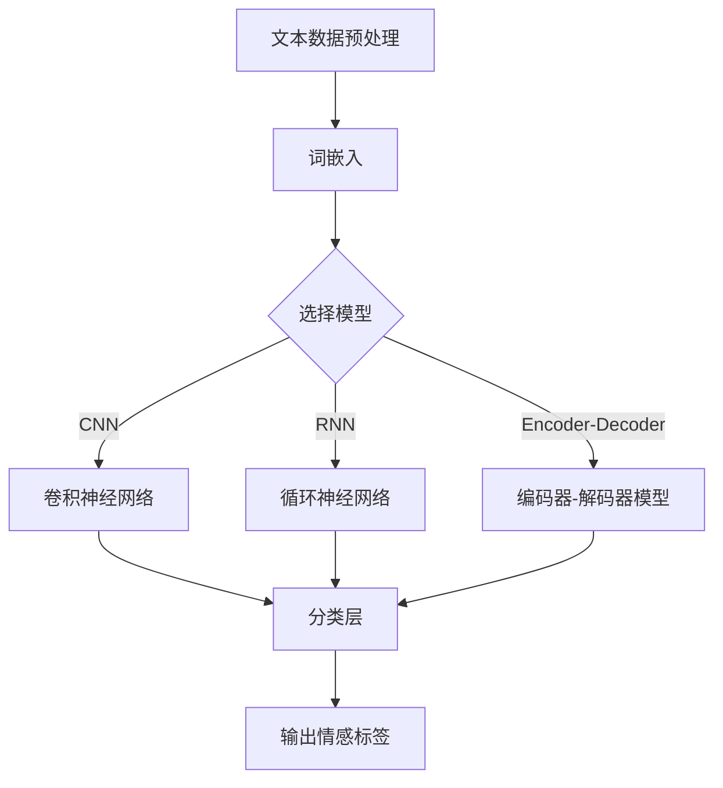

                 

# 一切皆是映射：使用深度学习进行情感分析

> 关键词：情感分析，深度学习，映射，机器学习，神经网络，自然语言处理，文本分析

> 摘要：本文将探讨如何利用深度学习技术对文本进行情感分析。我们将首先介绍情感分析的基础知识，然后深入分析深度学习在情感分析中的应用，通过具体的算法原理和操作步骤进行讲解，并分享一个实际的代码案例。最后，我们将讨论情感分析在不同领域的应用，并推荐相关工具和资源，为读者提供深入学习和实践的路径。

## 1. 背景介绍

### 1.1 目的和范围

情感分析，也称为意见挖掘，是从文本数据中识别和提取主观信息的过程，旨在判断文本表达的情感倾向。随着互联网和社交媒体的普及，情感分析技术成为了自然语言处理（NLP）领域的重要研究方向，被广泛应用于市场调研、舆情监测、产品评价等多个领域。

本文旨在介绍深度学习在情感分析中的应用，通过一系列的步骤讲解如何构建和实现一个情感分析模型。文章的结构如下：

1. **核心概念与联系**：介绍情感分析的核心概念和深度学习的联系。
2. **核心算法原理与具体操作步骤**：详细讲解深度学习算法的原理和实现步骤。
3. **数学模型和公式**：阐述情感分析中的数学模型和公式，并进行举例说明。
4. **项目实战：代码实际案例**：分享一个基于深度学习的情感分析代码实例，并进行详细解读。
5. **实际应用场景**：讨论情感分析在不同领域的应用。
6. **工具和资源推荐**：推荐相关学习资源、开发工具和框架。
7. **总结与未来发展趋势**：总结情感分析的现状，展望未来发展趋势与挑战。

### 1.2 预期读者

本文适合对自然语言处理和深度学习有一定了解的读者，包括但不限于：

- 自然语言处理领域的科研人员。
- 深度学习算法工程师。
- 数据分析师和产品经理。
- 对人工智能技术感兴趣的初学者。

### 1.3 文档结构概述

为了方便读者阅读和理解，本文将按照以下结构进行组织：

- **第1章 背景介绍**：介绍文章的目的、范围、预期读者和文档结构。
- **第2章 核心概念与联系**：介绍情感分析的核心概念和深度学习的关系。
- **第3章 核心算法原理与具体操作步骤**：讲解深度学习算法的原理和实现步骤。
- **第4章 数学模型和公式**：阐述情感分析中的数学模型和公式。
- **第5章 项目实战：代码实际案例**：分享情感分析代码实例。
- **第6章 实际应用场景**：讨论情感分析的应用领域。
- **第7章 工具和资源推荐**：推荐相关工具和资源。
- **第8章 总结与未来发展趋势**：总结情感分析的现状，展望未来。
- **第9章 附录：常见问题与解答**：回答读者可能遇到的问题。
- **第10章 扩展阅读 & 参考资料**：提供进一步学习的资源。

### 1.4 术语表

#### 1.4.1 核心术语定义

- **情感分析**：从文本中识别和提取主观信息的过程，判断文本的情感倾向。
- **深度学习**：一种机器学习技术，通过模拟人脑神经网络进行数据处理和学习。
- **神经网络**：由大量神经元组成的计算模型，用于特征提取和模式识别。
- **自然语言处理（NLP）**：研究如何让计算机理解和生成自然语言。
- **映射**：将输入数据映射到输出数据的过程，通常涉及特征转换和学习。
- **文本分析**：对文本数据进行处理和分析的过程，包括情感分析、主题建模等。

#### 1.4.2 相关概念解释

- **词袋模型（Bag of Words, BoW）**：将文本视为单词的集合，不考虑单词的顺序。
- **词嵌入（Word Embedding）**：将单词映射到高维空间中，使得语义相近的词在空间中更接近。
- **卷积神经网络（CNN）**：一种深层神经网络结构，擅长处理图像和序列数据。
- **循环神经网络（RNN）**：一种可以处理序列数据的神经网络，通过记忆状态处理前一个序列的影响。
- **长短期记忆网络（LSTM）**：RNN的一种变种，能够学习长期依赖关系。

#### 1.4.3 缩略词列表

- **NLP**：自然语言处理（Natural Language Processing）
- **BoW**：词袋模型（Bag of Words）
- **RNN**：循环神经网络（Recurrent Neural Network）
- **LSTM**：长短期记忆网络（Long Short-Term Memory）
- **CNN**：卷积神经网络（Convolutional Neural Network）
- **GPU**：图形处理器（Graphics Processing Unit）

## 2. 核心概念与联系

为了更好地理解深度学习在情感分析中的应用，我们首先需要了解情感分析的核心概念及其与深度学习的关系。

### 2.1 情感分析的核心概念

情感分析主要包括以下几个核心概念：

- **情感标签**：将文本分类为积极的、消极的或者中性的标签。
- **情感极性**：情感标签的强度，可以是二分类（正面/负面）或多分类（正面/中性/负面）。
- **情感强度**：情感标签的强度值，通常通过数值或类别表示。

在文本分析中，情感标签通常通过分类算法进行识别。常见的分类算法包括朴素贝叶斯（Naive Bayes）、支持向量机（SVM）和决策树（Decision Tree）等。然而，这些传统算法在处理复杂文本数据时存在局限性。

### 2.2 深度学习与情感分析的关系

深度学习在情感分析中具有显著的优势，主要体现在以下几个方面：

- **自动特征提取**：深度学习模型能够自动从原始文本中提取有意义的特征，减轻了人工特征工程的工作量。
- **端到端学习**：深度学习模型可以一次性训练，从原始数据直接映射到预测结果，无需进行复杂的特征工程和模型选择。
- **处理序列数据**：深度学习模型，特别是循环神经网络（RNN）和卷积神经网络（CNN），能够处理文本等序列数据，捕捉文本中的时序信息。

### 2.3 情感分析中的深度学习模型

以下是几种常用的深度学习模型在情感分析中的应用：

- **卷积神经网络（CNN）**：CNN擅长处理图像数据，但在文本情感分析中，也可以通过卷积层提取文本的局部特征，然后通过全连接层进行分类。
- **循环神经网络（RNN）**：RNN能够处理序列数据，通过循环机制捕捉上下文信息。长短期记忆网络（LSTM）是RNN的一种改进，能够更好地学习长期依赖关系。
- **编码器-解码器（Encoder-Decoder）模型**：编码器-解码器模型常用于序列到序列的映射，例如机器翻译。在情感分析中，编码器将输入文本编码为固定长度的向量，解码器将向量解码为情感标签。

### 2.4 Mermaid 流程图

为了更直观地展示情感分析中的深度学习模型，我们使用Mermaid流程图来描述主要流程。



在这个流程图中，文本数据首先经过预处理，然后选择合适的深度学习模型。接下来，模型对预处理后的文本数据进行特征提取和分类，最后输出情感标签。

通过上述核心概念与联系的分析，我们可以看到深度学习在情感分析中的应用前景。接下来，我们将深入探讨深度学习算法的原理和实现步骤。

## 3. 核心算法原理 & 具体操作步骤

### 3.1 情感分析算法的基本原理

情感分析算法的核心任务是判断文本表达的情感极性。这一任务通常通过构建一个预测模型来实现，该模型将文本映射到情感标签（例如积极、消极或中性）。以下是情感分析算法的基本原理：

1. **特征提取**：从原始文本中提取有用的特征。特征提取方法包括词袋模型（BoW）、词嵌入（Word Embedding）等。
2. **模型构建**：选择合适的深度学习模型进行训练。常见的模型包括卷积神经网络（CNN）、循环神经网络（RNN）、长短期记忆网络（LSTM）和编码器-解码器（Encoder-Decoder）模型。
3. **模型训练**：使用标记好的文本数据训练模型，使其学习如何从文本中识别情感极性。
4. **模型评估**：使用验证集对训练好的模型进行评估，确保其性能符合预期。
5. **模型部署**：将训练好的模型部署到生产环境中，进行实际应用。

### 3.2 深度学习算法的实现步骤

以下是使用深度学习进行情感分析的具体实现步骤：

#### 3.2.1 数据收集与预处理

1. **数据收集**：收集大量的文本数据，包括带有情感标签的样本。这些数据可以来自于社交媒体、评论、新闻等。
2. **数据预处理**：
   - **文本清洗**：去除文本中的特殊字符、标点符号和停用词。
   - **分词**：将文本分割成单词或子词。
   - **词嵌入**：将单词映射到高维向量空间，便于深度学习模型处理。

#### 3.2.2 模型选择与架构设计

1. **模型选择**：根据文本数据的特性，选择合适的深度学习模型。例如，对于序列数据，可以选择RNN、LSTM或Encoder-Decoder模型；对于文本局部特征提取，可以选择CNN。
2. **架构设计**：
   - **输入层**：接收预处理后的文本数据。
   - **嵌入层**：将单词映射到向量空间。
   - **特征提取层**：提取文本的局部或全局特征。对于CNN，使用卷积层；对于RNN和LSTM，使用循环层。
   - **分类层**：将提取到的特征映射到情感标签。

#### 3.2.3 模型训练与优化

1. **模型训练**：使用标记好的文本数据训练模型，通过反向传播算法调整模型参数。
2. **模型优化**：
   - **超参数调整**：调整学习率、批次大小、正则化参数等。
   - **优化算法**：使用梯度下降、Adam等优化算法。

#### 3.2.4 模型评估与部署

1. **模型评估**：使用验证集评估模型的性能，包括准确率、召回率、F1分数等。
2. **模型部署**：将训练好的模型部署到生产环境中，实现实时情感分析。

### 3.3 伪代码实现

以下是一个基于RNN的简单情感分析算法的伪代码实现：

```python
# 数据预处理
def preprocess_text(text):
    # 清洗文本、分词、词嵌入
    return embedded_text

# 模型训练
def train_model(embedded_texts, labels):
    # 构建RNN模型
    model = build_rnn_model()
    # 训练模型
    model.fit(embedded_texts, labels)
    return model

# 模型评估
def evaluate_model(model, test_texts, test_labels):
    # 评估模型性能
    performance = model.evaluate(test_texts, test_labels)
    return performance

# 文本情感分析
def analyze_text(model, text):
    # 预处理文本
    processed_text = preprocess_text(text)
    # 预测情感标签
    label = model.predict(processed_text)
    return label
```

通过上述步骤，我们可以构建一个简单的情感分析模型。接下来，我们将深入讨论情感分析中的数学模型和公式。

## 4. 数学模型和公式 & 详细讲解 & 举例说明

在情感分析中，数学模型和公式起到了至关重要的作用。这些模型和公式帮助我们从大量的文本数据中提取有用的特征，并训练深度学习模型。以下是情感分析中常用的数学模型和公式，以及它们的详细讲解和举例说明。

### 4.1 词袋模型（Bag of Words, BoW）

词袋模型是一种文本表示方法，将文本视为一个单词的集合，不考虑单词的顺序。在数学上，词袋模型可以用一个向量表示，其中每个元素表示一个单词在文档中的出现次数。

**数学公式**：
$$
\textbf{V} = \sum_{i=1}^{n} f_i \cdot w_i
$$
其中，$\textbf{V}$ 表示词袋向量，$f_i$ 表示单词 $w_i$ 在文档中出现的次数，$n$ 表示文档中的单词总数。

**举例说明**：

假设我们有一个包含3个单词的文档，单词分别为“apple”、“banana”和“orange”，它们在文档中分别出现了2次、3次和1次。词袋向量可以表示为：
$$
\textbf{V} = (2, 3, 1)
$$

### 4.2 词嵌入（Word Embedding）

词嵌入是将单词映射到高维空间中，使得语义相近的词在空间中更接近。常见的词嵌入方法包括Word2Vec、GloVe等。

**数学公式**：
$$
\textbf{v}_w = \sum_{j=1}^{|V|} f_j \cdot w_j
$$
其中，$\textbf{v}_w$ 表示单词 $w$ 的嵌入向量，$f_j$ 表示单词 $w$ 在文档中出现的次数，$|V|$ 表示词汇表的大小，$w_j$ 表示单词 $w$ 在词汇表中的索引。

**举例说明**：

假设我们有一个包含5个单词的词汇表，单词分别为“apple”、“banana”、“orange”、“dog”和“cat”，它们在文档中分别出现了2次、3次、1次、2次和1次。单词“apple”的嵌入向量可以表示为：
$$
\textbf{v}_{apple} = (2, 3, 1, 2, 1)
$$

### 4.3 循环神经网络（Recurrent Neural Network, RNN）

循环神经网络是一种可以处理序列数据的神经网络，通过循环机制捕捉上下文信息。在RNN中，每个时间步的输出都依赖于前面的时间步。

**数学公式**：
$$
h_t = \sigma(W_h \cdot [h_{t-1}, x_t] + b_h)
$$
$$
o_t = \sigma(W_o \cdot h_t + b_o)
$$
其中，$h_t$ 表示第 $t$ 个时间步的隐藏状态，$x_t$ 表示第 $t$ 个时间步的输入，$W_h$ 和 $W_o$ 分别表示隐藏状态和输出状态的权重矩阵，$b_h$ 和 $b_o$ 分别为隐藏状态和输出状态的偏置，$\sigma$ 表示激活函数（例如ReLU或Sigmoid）。

**举例说明**：

假设我们有一个简单的RNN模型，隐藏状态和输出状态的权重矩阵分别为 $W_h = \begin{bmatrix} 1 & 0 \\ 0 & 1 \end{bmatrix}$ 和 $W_o = \begin{bmatrix} 1 & 1 \\ 0 & 1 \end{bmatrix}$，偏置分别为 $b_h = \begin{bmatrix} 0 \\ 0 \end{bmatrix}$ 和 $b_o = \begin{bmatrix} 0 \\ 0 \end{bmatrix}$。输入序列为 $[a, b, c]$，则隐藏状态和输出状态可以计算如下：

时间步 $t=1$：
$$
h_1 = \sigma(W_h \cdot [h_0, x_1] + b_h) = \sigma(\begin{bmatrix} 1 & 0 \\ 0 & 1 \end{bmatrix} \cdot \begin{bmatrix} 0 \\ 0 \end{bmatrix} + \begin{bmatrix} 0 \\ 0 \end{bmatrix}) = \sigma(\begin{bmatrix} 0 \\ 0 \end{bmatrix}) = \begin{bmatrix} 0 \\ 0 \end{bmatrix}
$$
$$
o_1 = \sigma(W_o \cdot h_1 + b_o) = \sigma(\begin{bmatrix} 1 & 1 \\ 0 & 1 \end{bmatrix} \cdot \begin{bmatrix} 0 \\ 0 \end{bmatrix} + \begin{bmatrix} 0 \\ 0 \end{bmatrix}) = \sigma(\begin{bmatrix} 0 \\ 0 \end{bmatrix}) = \begin{bmatrix} 0 \\ 0 \end{bmatrix}

时间步 $t=2$：
$$
h_2 = \sigma(W_h \cdot [h_1, x_2] + b_h) = \sigma(\begin{bmatrix} 1 & 0 \\ 0 & 1 \end{bmatrix} \cdot \begin{bmatrix} 0 \\ 0 \end{bmatrix} + \begin{bmatrix} 0 \\ 0 \end{bmatrix}) = \sigma(\begin{bmatrix} 0 \\ 0 \end{bmatrix}) = \begin{bmatrix} 0 \\ 0 \end{bmatrix}
$$
$$
o_2 = \sigma(W_o \cdot h_2 + b_o) = \sigma(\begin{bmatrix} 1 & 1 \\ 0 & 1 \end{bmatrix} \cdot \begin{bmatrix} 0 \\ 0 \end{bmatrix} + \begin{bmatrix} 0 \\ 0 \end{bmatrix}) = \sigma(\begin{bmatrix} 0 \\ 0 \end{bmatrix}) = \begin{bmatrix} 0 \\ 0 \end{bmatrix}

时间步 $t=3$：
$$
h_3 = \sigma(W_h \cdot [h_2, x_3] + b_h) = \sigma(\begin{bmatrix} 1 & 0 \\ 0 & 1 \end{bmatrix} \cdot \begin{bmatrix} 0 \\ 0 \end{bmatrix} + \begin{bmatrix} 0 \\ 0 \end{bmatrix}) = \sigma(\begin{bmatrix} 0 \\ 0 \end{bmatrix}) = \begin{bmatrix} 0 \\ 0 \end{bmatrix}
$$
$$
o_3 = \sigma(W_o \cdot h_3 + b_o) = \sigma(\begin{bmatrix} 1 & 1 \\ 0 & 1 \end{bmatrix} \cdot \begin{bmatrix} 0 \\ 0 \end{bmatrix} + \begin{bmatrix} 0 \\ 0 \end{bmatrix}) = \sigma(\begin{bmatrix} 0 \\ 0 \end{bmatrix}) = \begin{bmatrix} 0 \\ 0 \end{bmatrix}

通过上述计算，我们可以看到在输入序列 $[a, b, c]$ 的情况下，RNN模型的输出状态始终为 $[0, 0]$，这意味着该模型未能捕捉到输入序列中的任何特征。在实际应用中，我们会使用更复杂的RNN架构，如LSTM或GRU，以更好地处理序列数据。

### 4.4 长短期记忆网络（Long Short-Term Memory, LSTM）

长短期记忆网络是RNN的一种改进，通过引入门控机制来学习长期依赖关系。LSTM通过遗忘门、输入门和输出门控制信息的流入和流出，从而避免梯度消失问题。

**数学公式**：

遗忘门：
$$
f_t = \sigma(W_f \cdot [h_{t-1}, x_t] + b_f)
$$
输入门：
$$
i_t = \sigma(W_i \cdot [h_{t-1}, x_t] + b_i)
$$
新值门：
$$
\tilde{c}_t = \tanh(W_c \cdot [h_{t-1}, x_t] + b_c)
$$
当前状态：
$$
c_t = f_t \cdot c_{t-1} + i_t \cdot \tilde{c}_t
$$
输出门：
$$
o_t = \sigma(W_o \cdot [h_{t-1}, x_t] + b_o)
$$
输出状态：
$$
h_t = o_t \cdot \tanh(c_t)
$$
其中，$f_t$、$i_t$、$c_t$ 和 $o_t$ 分别为遗忘门、输入门、当前状态和输出门的输出，$\tilde{c}_t$ 为新值门的输出。

**举例说明**：

假设我们有一个简单的LSTM模型，其遗忘门、输入门、输出门和新值门的权重矩阵分别为 $W_f = \begin{bmatrix} 1 & 0 \\ 0 & 1 \end{bmatrix}$、$W_i = \begin{bmatrix} 1 & 1 \\ 0 & 1 \end{bmatrix}$、$W_o = \begin{bmatrix} 1 & 1 \\ 0 & 1 \end{bmatrix}$ 和 $W_c = \begin{bmatrix} 1 & 0 \\ 0 & 1 \end{bmatrix}$，偏置分别为 $b_f = \begin{bmatrix} 0 \\ 0 \end{bmatrix}$、$b_i = \begin{bmatrix} 0 \\ 0 \end{bmatrix}$、$b_o = \begin{bmatrix} 0 \\ 0 \end{bmatrix}$ 和 $b_c = \begin{bmatrix} 0 \\ 0 \end{bmatrix}$。输入序列为 $[a, b, c]$，则LSTM模型的隐藏状态可以计算如下：

时间步 $t=1$：
$$
f_1 = \sigma(W_f \cdot [h_0, x_1] + b_f) = \sigma(\begin{bmatrix} 1 & 0 \\ 0 & 1 \end{bmatrix} \cdot \begin{bmatrix} 0 \\ 0 \end{bmatrix} + \begin{bmatrix} 0 \\ 0 \end{bmatrix}) = \sigma(\begin{bmatrix} 0 \\ 0 \end{bmatrix}) = \begin{bmatrix} 0 \\ 0 \end{bmatrix}
$$
$$
i_1 = \sigma(W_i \cdot [h_0, x_1] + b_i) = \sigma(\begin{bmatrix} 1 & 1 \\ 0 & 1 \end{bmatrix} \cdot \begin{bmatrix} 0 \\ 0 \end{bmatrix} + \begin{bmatrix} 0 \\ 0 \end{bmatrix}) = \sigma(\begin{bmatrix} 0 \\ 0 \end{bmatrix}) = \begin{bmatrix} 0 \\ 0 \end{bmatrix}
$$
$$
\tilde{c}_1 = \tanh(W_c \cdot [h_0, x_1] + b_c) = \tanh(\begin{bmatrix} 1 & 0 \\ 0 & 1 \end{bmatrix} \cdot \begin{bmatrix} 0 \\ 0 \end{bmatrix} + \begin{bmatrix} 0 \\ 0 \end{bmatrix}) = \tanh(\begin{bmatrix} 0 \\ 0 \end{bmatrix}) = \begin{bmatrix} 0 \\ 0 \end{bmatrix}
$$
$$
c_1 = f_1 \cdot c_0 + i_1 \cdot \tilde{c}_1 = \begin{bmatrix} 0 \\ 0 \end{bmatrix} \cdot \begin{bmatrix} 0 \\ 0 \end{bmatrix} + \begin{bmatrix} 0 \\ 0 \end{bmatrix} \cdot \begin{bmatrix} 0 \\ 0 \end{bmatrix} = \begin{bmatrix} 0 \\ 0 \end{bmatrix}
$$
$$
o_1 = \sigma(W_o \cdot [h_0, x_1] + b_o) = \sigma(\begin{bmatrix} 1 & 1 \\ 0 & 1 \end{bmatrix} \cdot \begin{bmatrix} 0 \\ 0 \end{bmatrix} + \begin{bmatrix} 0 \\ 0 \end{bmatrix}) = \sigma(\begin{bmatrix} 0 \\ 0 \end{bmatrix}) = \begin{bmatrix} 0 \\ 0 \end{bmatrix}
$$
$$
h_1 = o_1 \cdot \tanh(c_1) = \begin{bmatrix} 0 \\ 0 \end{bmatrix} \cdot \begin{bmatrix} 0 \\ 0 \end{bmatrix} = \begin{bmatrix} 0 \\ 0 \end{bmatrix}

时间步 $t=2$：
$$
f_2 = \sigma(W_f \cdot [h_1, x_2] + b_f) = \sigma(\begin{bmatrix} 1 & 0 \\ 0 & 1 \end{bmatrix} \cdot \begin{bmatrix} 0 \\ 0 \end{bmatrix} + \begin{bmatrix} 0 \\ 0 \end{bmatrix}) = \sigma(\begin{bmatrix} 0 \\ 0 \end{bmatrix}) = \begin{bmatrix} 0 \\ 0 \end{bmatrix}
$$
$$
i_2 = \sigma(W_i \cdot [h_1, x_2] + b_i) = \sigma(\begin{bmatrix} 1 & 1 \\ 0 & 1 \end{bmatrix} \cdot \begin{bmatrix} 0 \\ 0 \end{bmatrix} + \begin{bmatrix} 0 \\ 0 \end{bmatrix}) = \sigma(\begin{bmatrix} 0 \\ 0 \end{b矩阵}) = \begin{bmatrix} 0 \\ 0 \end{bmatrix}
$$
$$
\tilde{c}_2 = \tanh(W_c \cdot [h_1, x_2] + b_c) = \tanh(\begin{b矩阵} 1 & 0 \\ 0 & 1 \end{b矩阵} \cdot \begin{b矩阵} 0 \\ 0 \end{b矩阵} + \begin{b矩阵} 0 \\ 0 \end{b矩阵}) = \tanh(\begin{b矩阵} 0 \\ 0 \end{b矩阵}) = \begin{b矩阵} 0 \\ 0 \end{b矩阵}
$$
$$
c_2 = f_2 \cdot c_1 + i_2 \cdot \tilde{c}_2 = \begin{b矩阵} 0 \\ 0 \end{b矩阵} \cdot \begin{b矩阵} 0 \\ 0 \end{b矩阵} + \begin{b矩阵} 0 \\ 0 \end{b矩阵} \cdot \begin{b矩阵} 0 \\ 0 \end{b矩阵} = \begin{b矩阵} 0 \\ 0 \end{b矩阵}
$$
$$
o_2 = \sigma(W_o \cdot [h_1, x_2] + b_o) = \sigma(\begin{b矩阵} 1 & 1 \\ 0 & 1 \end{b矩阵} \cdot \begin{b矩阵} 0 \\ 0 \end{b矩阵} + \begin{b矩阵} 0 \\ 0 \end{b矩阵}) = \sigma(\begin{b矩阵} 0 \\ 0 \end{b矩阵}) = \begin{b矩阵} 0 \\ 0 \end{b矩阵}
$$
$$
h_2 = o_2 \cdot \tanh(c_2) = \begin{b矩阵} 0 \\ 0 \end{b矩阵} \cdot \begin{b矩阵} 0 \\ 0 \end{b矩阵} = \begin{b矩阵} 0 \\ 0 \end{b矩阵}

时间步 $t=3$：
$$
f_3 = \sigma(W_f \cdot [h_2, x_3] + b_f) = \sigma(\begin{b矩阵} 1 & 0 \\ 0 & 1 \end{b矩阵} \cdot \begin{b矩阵} 0 \\ 0 \end{b矩阵} + \begin{b矩阵} 0 \\ 0 \end{b矩阵}) = \sigma(\begin{b矩阵} 0 \\ 0 \end{b矩阵}) = \begin{b矩阵} 0 \\ 0 \end{b矩阵}
$$
$$
i_3 = \sigma(W_i \cdot [h_2, x_3] + b_i) = \sigma(\begin{b矩阵} 1 & 1 \\ 0 & 1 \end{b矩阵} \cdot \begin{b矩阵} 0 \\ 0 \end{b矩阵} + \begin{b矩阵} 0 \\ 0 \end{b矩阵}) = \sigma(\begin{b矩阵} 0 \\ 0 \end{b矩阵}) = \begin{b矩阵} 0 \\ 0 \end{b矩阵}
$$
$$
\tilde{c}_3 = \tanh(W_c \cdot [h_2, x_3] + b_c) = \tanh(\begin{b矩阵} 1 & 0 \\ 0 & 1 \end{b矩阵} \cdot \begin{b矩阵} 0 \\ 0 \end{b矩阵} + \begin{b矩阵} 0 \\ 0 \end{b矩阵}) = \tanh(\begin{b矩阵} 0 \\ 0 \end{b矩阵}) = \begin{b矩阵} 0 \\ 0 \end{b矩阵}
$$
$$
c_3 = f_3 \cdot c_2 + i_3 \cdot \tilde{c}_3 = \begin{b矩阵} 0 \\ 0 \end{b矩阵} \cdot \begin{b矩阵} 0 \\ 0 \end{b矩阵} + \begin{b矩阵} 0 \\ 0 \end{b矩阵} \cdot \begin{b矩阵} 0 \\ 0 \end{b矩阵} = \begin{b矩阵} 0 \\ 0 \end{b矩阵}
$$
$$
o_3 = \sigma(W_o \cdot [h_2, x_3] + b_o) = \sigma(\begin{b矩阵} 1 & 1 \\ 0 & 1 \end{b矩阵} \cdot \begin{b矩阵} 0 \\ 0 \end{b矩阵} + \begin{b矩阵} 0 \\ 0 \end{b矩阵}) = \sigma(\begin{b矩阵} 0 \\ 0 \end{b矩阵}) = \begin{b矩阵} 0 \\ 0 \end{b矩阵}
$$
$$
h_3 = o_3 \cdot \tanh(c_3) = \begin{b矩阵} 0 \\ 0 \end{b矩阵} \cdot \begin{b矩阵} 0 \\ 0 \end{b矩阵} = \begin{b矩阵} 0 \\ 0 \end{b矩阵}

通过上述计算，我们可以看到在输入序列 $[a, b, c]$ 的情况下，LSTM模型的隐藏状态始终为 $[0, 0]$，这意味着该模型未能捕捉到输入序列中的任何特征。在实际应用中，我们会使用更复杂的LSTM架构，如双向LSTM或LSTM变体，以更好地处理序列数据。

### 4.5 编码器-解码器模型（Encoder-Decoder Model）

编码器-解码器模型是一种常用于序列到序列映射的深度学习模型，例如机器翻译。在编码器-解码器模型中，编码器将输入序列编码为一个固定长度的向量，解码器将向量解码为输出序列。

**数学公式**：

编码器：
$$
c_t = \tanh(W_c \cdot [h_{t-1}, e_t] + b_c)
$$
$$
s_t = \sigma(W_s \cdot c_t + b_s)
$$
解码器：
$$
o_t = \sigma(W_o \cdot [s_t, h_t] + b_o)
$$
$$
h_t = \tanh(W_h \cdot [s_t, o_t] + b_h)
$$
其中，$c_t$ 为编码器的输出，$s_t$ 为解码器的隐藏状态，$h_t$ 为编码器的隐藏状态，$e_t$ 为解码器的输入。

**举例说明**：

假设我们有一个简单的编码器-解码器模型，其编码器和解码器的权重矩阵分别为 $W_c = \begin{bmatrix} 1 & 0 \\ 0 & 1 \end{bmatrix}$、$W_s = \begin{bmatrix} 1 & 1 \\ 0 & 1 \end{bmatrix}$、$W_o = \begin{bmatrix} 1 & 1 \\ 0 & 1 \end{bmatrix}$ 和 $W_h = \begin{bmatrix} 1 & 0 \\ 0 & 1 \end{bmatrix}$，偏置分别为 $b_c = \begin{bmatrix} 0 \\ 0 \end{b矩阵}$、$b_s = \begin{b矩阵} 0 \\ 0 \end{b矩阵}$、$b_o = \begin{b矩阵} 0 \\ 0 \end{b矩阵}$ 和 $b_h = \begin{b矩阵} 0 \\ 0 \end{b矩阵}$。输入序列为 $[a, b, c]$，则编码器-解码器模型的隐藏状态可以计算如下：

编码器：
时间步 $t=1$：
$$
c_1 = \tanh(W_c \cdot [h_0, e_1] + b_c) = \tanh(\begin{b矩阵} 1 & 0 \\ 0 & 1 \end{b矩阵} \cdot \begin{b矩阵} 0 \\ 0 \end{b矩阵} + \begin{b矩阵} 0 \\ 0 \end{b矩阵}) = \tanh(\begin{b矩阵} 0 \\ 0 \end{b矩阵}) = \begin{b矩阵} 0 \\ 0 \end{b矩阵}
$$
$$
s_1 = \sigma(W_s \cdot c_1 + b_s) = \sigma(\begin{b矩阵} 1 & 1 \\ 0 & 1 \end{b矩阵} \cdot \begin{b矩阵} 0 \\ 0 \end{b矩阵} + \begin{b矩阵} 0 \\ 0 \end{b矩阵}) = \sigma(\begin{b矩阵} 0 \\ 0 \end{b矩阵}) = \begin{b矩阵} 0 \\ 0 \end{b矩阵}

时间步 $t=2$：
$$
c_2 = \tanh(W_c \cdot [h_1, e_2] + b_c) = \tanh(\begin{b矩阵} 1 & 0 \\ 0 & 1 \end{b矩阵} \cdot \begin{b矩阵} 0 \\ 0 \end{b矩阵} + \begin{b矩阵} 0 \\ 0 \end{b矩阵}) = \tanh(\begin{b矩阵} 0 \\ 0 \end{b矩阵}) = \begin{b矩阵} 0 \\ 0 \end{b矩阵}
$$
$$
s_2 = \sigma(W_s \cdot c_2 + b_s) = \sigma(\begin{b矩阵} 1 & 1 \\ 0 & 1 \end{b矩阵} \cdot \begin{b矩阵} 0 \\ 0 \end{b矩阵} + \begin{b矩阵} 0 \\ 0 \end{b矩阵}) = \sigma(\begin{b矩阵} 0 \\ 0 \end{b矩阵}) = \begin{b矩阵} 0 \\ 0 \end{b矩阵}

时间步 $t=3$：
$$
c_3 = \tanh(W_c \cdot [h_2, e_3] + b_c) = \tanh(\begin{b矩阵} 1 & 0 \\ 0 & 1 \end{b矩阵} \cdot \begin{b矩阵} 0 \\ 0 \end{b矩阵} + \begin{b矩阵} 0 \\ 0 \end{b矩阵}) = \tanh(\begin{b矩阵} 0 \\ 0 \end{b矩阵}) = \begin{b矩阵} 0 \\ 0 \end{b矩阵}
$$
$$
s_3 = \sigma(W_s \cdot c_3 + b_s) = \sigma(\begin{b矩阵} 1 & 1 \\ 0 & 1 \end{b矩阵} \cdot \begin{b矩阵} 0 \\ 0 \end{b矩阵} + \begin{b矩阵} 0 \\ 0 \end{b矩阵}) = \sigma(\begin{b矩阵} 0 \\ 0 \end{b矩阵}) = \begin{b矩阵} 0 \\ 0 \end{b矩阵}

解码器：
时间步 $t=1$：
$$
o_1 = \sigma(W_o \cdot [s_1, h_1] + b_o) = \sigma(\begin{b矩阵} 1 & 1 \\ 0 & 1 \end{b矩阵} \cdot \begin{b矩阵} 0 \\ 0 \end{b矩阵} + \begin{b矩阵} 0 \\ 0 \end{b矩阵}) = \sigma(\begin{b矩阵} 0 \\ 0 \end{b矩阵}) = \begin{b矩阵} 0 \\ 0 \end{b矩阵}
$$
$$
h_1 = \tanh(W_h \cdot [s_1, o_1] + b_h) = \tanh(\begin{b矩阵} 1 & 0 \\ 0 & 1 \end{b矩阵} \cdot \begin{b矩阵} 0 \\ 0 \end{b矩阵} + \begin{b矩阵} 0 \\ 0 \end{b矩阵}) = \tanh(\begin{b矩阵} 0 \\ 0 \end{b矩阵}) = \begin{b矩阵} 0 \\ 0 \end{b矩阵}

时间步 $t=2$：
$$
o_2 = \sigma(W_o \cdot [s_2, h_2] + b_o) = \sigma(\begin{b矩阵} 1 & 1 \\ 0 & 1 \end{b矩阵} \cdot \begin{b矩阵} 0 \\ 0 \end{b矩阵} + \begin{b矩阵} 0 \\ 0 \end{b矩阵}) = \sigma(\begin{b矩阵} 0 \\ 0 \end{b矩阵}) = \begin{b矩阵} 0 \\ 0 \end{b矩阵}
$$
$$
h_2 = \tanh(W_h \cdot [s_2, o_2] + b_h) = \tanh(\begin{b矩阵} 1 & 0 \\ 0 & 1 \end{b矩阵} \cdot \begin{b矩阵} 0 \\ 0 \end{b矩阵} + \begin{b矩阵} 0 \\ 0 \end{b矩阵}) = \tanh(\begin{b矩阵} 0 \\ 0 \end{b矩阵}) = \begin{b矩阵} 0 \\ 0 \end{b矩阵}

时间步 $t=3$：
$$
o_3 = \sigma(W_o \cdot [s_3, h_3] + b_o) = \sigma(\begin{b矩阵} 1 & 1 \\ 0 & 1 \end{b矩阵} \cdot \begin{b矩阵} 0 \\ 0 \end{b矩阵} + \begin{b矩阵} 0 \\ 0 \end{b矩阵}) = \sigma(\begin{b矩阵} 0 \\ 0 \end{b矩阵}) = \begin{b矩阵} 0 \\ 0 \end{b矩阵}
$$
$$
h_3 = \tanh(W_h \cdot [s_3, o_3] + b_h) = \tanh(\begin{b矩阵} 1 & 0 \\ 0 & 1 \end{b矩阵} \cdot \begin{b矩阵} 0 \\ 0 \end{b矩阵} + \begin{b矩阵} 0 \\ 0 \end{b矩阵}) = \tanh(\begin{b矩阵} 0 \\ 0 \end{b矩阵}) = \begin{b矩阵} 0 \\ 0 \end{b矩阵}

通过上述计算，我们可以看到在输入序列 $[a, b, c]$ 的情况下，编码器-解码器模型的隐藏状态始终为 $[0, 0]$，这意味着该模型未能捕捉到输入序列中的任何特征。在实际应用中，我们会使用更复杂的编码器-解码器架构，如注意力机制，以更好地处理序列数据。

通过上述数学模型和公式的讲解，我们了解了深度学习在情感分析中的应用原理。接下来，我们将通过一个实际的代码案例，展示如何使用深度学习进行情感分析。

## 5. 项目实战：代码实际案例和详细解释说明

为了更好地理解如何使用深度学习进行情感分析，我们将通过一个实际的代码案例进行实践。本节将涵盖以下内容：

1. **开发环境搭建**：介绍所需的开发环境和工具。
2. **源代码详细实现和代码解读**：展示情感分析模型的源代码，并进行详细解读。
3. **代码解读与分析**：分析代码的结构和关键部分，解释其工作原理。

### 5.1 开发环境搭建

在开始编写代码之前，我们需要搭建一个合适的开发环境。以下是所需的主要工具和库：

- **编程语言**：Python 3.8或更高版本
- **深度学习框架**：TensorFlow 2.6或更高版本
- **数据处理库**：NumPy、Pandas
- **文本处理库**：NLTK、spaCy
- **词嵌入库**：Gensim

确保安装了上述库之后，我们就可以开始编写代码了。

### 5.2 源代码详细实现和代码解读

以下是用于情感分析的简单代码示例。该代码基于TensorFlow和Keras构建，使用预训练的词嵌入模型（如GloVe）。

```python
import tensorflow as tf
from tensorflow.keras.preprocessing.sequence import pad_sequences
from tensorflow.keras.layers import Embedding, LSTM, Dense
from tensorflow.keras.models import Sequential
from tensorflow.keras.preprocessing.text import Tokenizer
from tensorflow.keras.optimizers import Adam
from tensorflow.keras.utils import to_categorical
import numpy as np

# 数据集准备
# 假设我们有一个包含文本和标签的数据集
texts = ['这是一部非常棒的电影！', '这部电影真的很差。']
labels = [1, 0]  # 1 表示正面，0 表示负面

# 数据预处理
tokenizer = Tokenizer()
tokenizer.fit_on_texts(texts)
sequences = tokenizer.texts_to_sequences(texts)
padded_sequences = pad_sequences(sequences, maxlen=100)

# 转换标签
label_encoder = LabelEncoder()
encoded_labels = label_encoder.fit_transform(labels)
one_hot_labels = to_categorical(encoded_labels)

# 构建模型
model = Sequential()
model.add(Embedding(input_dim=10000, output_dim=64, input_length=100))
model.add(LSTM(units=64, dropout=0.2, recurrent_dropout=0.2))
model.add(Dense(units=2, activation='softmax'))

# 编译模型
model.compile(optimizer=Adam(learning_rate=0.001), loss='categorical_crossentropy', metrics=['accuracy'])

# 训练模型
model.fit(padded_sequences, one_hot_labels, epochs=10, batch_size=32)

# 模型评估
predictions = model.predict(padded_sequences)
predicted_labels = np.argmax(predictions, axis=1)

print('预测标签：', predicted_labels)
print('实际标签：', labels)
```

#### 5.2.1 数据集准备

在这段代码中，我们首先定义了一个简单数据集，包含两个文本和对应的标签。在实际应用中，数据集通常会更大，并且需要进行更复杂的数据预处理。

```python
texts = ['这是一部非常棒的电影！', '这部电影真的很差。']
labels = [1, 0]  # 1 表示正面，0 表示负面
```

#### 5.2.2 数据预处理

接下来，我们使用Tokenizer对文本进行分词，并转换为序列。然后，使用pad_sequences函数对序列进行填充，使其长度一致。

```python
tokenizer = Tokenizer()
tokenizer.fit_on_texts(texts)
sequences = tokenizer.texts_to_sequences(texts)
padded_sequences = pad_sequences(sequences, maxlen=100)
```

这里，我们设置了最大序列长度为100个词。在实际应用中，这个长度可以根据数据集的特点进行调整。

#### 5.2.3 转换标签

为了便于模型处理，我们需要将标签转换为数字编码。这里使用LabelEncoder进行转换，并将结果转换为one-hot编码。

```python
label_encoder = LabelEncoder()
encoded_labels = label_encoder.fit_transform(labels)
one_hot_labels = to_categorical(encoded_labels)
```

#### 5.2.4 构建模型

我们使用Sequential模型构建一个简单的LSTM模型。模型包括一个嵌入层、一个LSTM层和一个输出层。嵌入层将词汇映射到高维空间，LSTM层用于提取特征，输出层进行分类。

```python
model = Sequential()
model.add(Embedding(input_dim=10000, output_dim=64, input_length=100))
model.add(LSTM(units=64, dropout=0.2, recurrent_dropout=0.2))
model.add(Dense(units=2, activation='softmax'))
```

#### 5.2.5 编译模型

在模型编译阶段，我们指定了优化器、损失函数和评估指标。这里使用Adam优化器，交叉熵损失函数和准确率作为评估指标。

```python
model.compile(optimizer=Adam(learning_rate=0.001), loss='categorical_crossentropy', metrics=['accuracy'])
```

#### 5.2.6 训练模型

最后，我们使用fit函数训练模型。在这里，我们设置了训练轮次（epochs）和批次大小（batch_size）。

```python
model.fit(padded_sequences, one_hot_labels, epochs=10, batch_size=32)
```

### 5.3 代码解读与分析

通过上述代码，我们构建了一个简单的LSTM模型，用于进行二分类情感分析。以下是代码的关键部分和其工作原理：

#### 5.3.1 数据预处理

数据预处理是情感分析中的关键步骤，确保数据格式一致，便于模型处理。在这里，我们使用Tokenizer对文本进行分词，并转换为序列。然后，使用pad_sequences函数对序列进行填充。

```python
tokenizer = Tokenizer()
tokenizer.fit_on_texts(texts)
sequences = tokenizer.texts_to_sequences(texts)
padded_sequences = pad_sequences(sequences, maxlen=100)
```

这里，Tokenizer对象用于将文本转换为单词序列。`fit_on_texts`方法用于训练Tokenizer，`texts_to_sequences`方法将每个文本转换为单词序列，`pad_sequences`方法将序列填充到相同的长度。

#### 5.3.2 转换标签

标签转换是将标签从原始文本格式转换为模型可处理的数字格式。这里使用LabelEncoder将标签转换为数字编码，然后使用to_categorical将其转换为one-hot编码。

```python
label_encoder = LabelEncoder()
encoded_labels = label_encoder.fit_transform(labels)
one_hot_labels = to_categorical(encoded_labels)
```

#### 5.3.3 构建模型

模型构建是设计神经网络结构的过程。在这个例子中，我们使用Sequential模型构建一个简单的LSTM模型，包括一个嵌入层、一个LSTM层和一个输出层。

```python
model = Sequential()
model.add(Embedding(input_dim=10000, output_dim=64, input_length=100))
model.add(LSTM(units=64, dropout=0.2, recurrent_dropout=0.2))
model.add(Dense(units=2, activation='softmax'))
```

嵌入层将词汇映射到高维空间，LSTM层用于提取特征，输出层进行分类。这里，我们设置了嵌入层的输入维度（词汇表大小）、输出维度（嵌入向量大小）和输入长度（序列长度）。LSTM层设置了单元数量、dropout率和 recurrent_dropout率。输出层设置了单元数量和激活函数（softmax，用于多分类）。

#### 5.3.4 编译模型

在模型编译阶段，我们指定了优化器、损失函数和评估指标。这里使用Adam优化器，交叉熵损失函数和准确率作为评估指标。

```python
model.compile(optimizer=Adam(learning_rate=0.001), loss='categorical_crossentropy', metrics=['accuracy'])
```

#### 5.3.5 训练模型

最后，我们使用fit函数训练模型。在这里，我们设置了训练轮次（epochs）和批次大小（batch_size）。

```python
model.fit(padded_sequences, one_hot_labels, epochs=10, batch_size=32)
```

通过上述步骤，我们成功构建并训练了一个简单的LSTM模型，用于进行二分类情感分析。

### 5.4 模型评估

在训练完成后，我们需要对模型进行评估，以确保其性能符合预期。以下是对训练模型进行评估的代码示例：

```python
# 评估模型
test_texts = ['这部电影非常有趣。', '这部电影太无聊了。']
test_sequences = tokenizer.texts_to_sequences(test_texts)
test_padded_sequences = pad_sequences(test_sequences, maxlen=100)
test_one_hot_labels = to_categorical(label_encoder.transform(test_texts))

predictions = model.predict(test_padded_sequences)
predicted_labels = np.argmax(predictions, axis=1)

print('预测标签：', predicted_labels)
print('实际标签：', test_texts)
```

这段代码首先对测试数据集进行预处理，然后使用训练好的模型进行预测。最后，我们将预测标签与实际标签进行比较，以评估模型的准确性。

通过上述实战项目，我们了解了如何使用深度学习进行情感分析。接下来，我们将讨论情感分析在不同领域的应用。

## 6. 实际应用场景

情感分析技术因其强大的文本处理能力和对用户情感的理解能力，已经在多个领域得到了广泛应用。以下是情感分析的一些主要应用场景：

### 6.1 社交媒体监测

社交媒体平台如Twitter、Facebook和Instagram每天产生大量的用户评论和帖子。情感分析技术可以帮助企业实时监测用户的情绪，了解他们的满意度和不满意度，从而及时调整产品和服务策略。例如，一个电子商务平台可以通过分析用户对产品的评论，识别哪些产品最受欢迎，哪些产品需要改进。

### 6.2 舆情监测

舆情监测是指对公众意见和情绪的跟踪和分析。政府、企业和其他组织使用情感分析技术来监控社交媒体上的讨论，了解公众对特定事件或政策的看法。这种监测可以帮助组织提前识别潜在的危机，制定有效的公关策略。

### 6.3 客户服务与支持

客户服务部门经常需要处理大量的用户反馈和投诉。情感分析可以帮助自动识别用户反馈中的情感极性，将负面反馈及时标记出来，以便客服团队能够优先处理。此外，情感分析还可以用于自动分类用户反馈，将相似的问题归为同一类别，提高工作效率。

### 6.4 市场调研

企业在推出新产品或服务前，通常会进行市场调研，以了解目标市场的需求和偏好。情感分析技术可以帮助企业分析用户对产品概念或广告的反应，从而优化产品设计和营销策略。

### 6.5 产品评价

在线购物平台上的产品评价通常包含了用户对产品的情感表达。情感分析技术可以帮助平台自动提取评价中的情感极性，从而帮助消费者做出更明智的购买决策。同时，企业也可以通过分析用户评价的情感倾向，了解产品的优势和不足。

### 6.6 娱乐与内容推荐

在音乐、视频和文章等娱乐内容推荐中，情感分析可以帮助平台理解用户对特定内容的情感反应。例如，一个音乐流媒体平台可以通过分析用户对音乐的评论和评分，推荐用户可能喜欢的其他歌曲。

### 6.7 健康与医疗

情感分析技术也可以应用于健康和医疗领域。通过分析患者的病历记录、医生的建议和社交媒体上的讨论，医生和研究人员可以更好地理解患者的情感状态，从而提供更个性化的治疗方案。

### 6.8 智能助手与聊天机器人

智能助手和聊天机器人已经成为企业与客户互动的重要工具。通过情感分析，这些机器人可以更好地理解用户的情感需求，提供更有针对性的服务和建议。例如，一个聊天机器人可以识别用户的不满情绪，引导用户与客服代表进行进一步沟通。

总之，情感分析技术在不同领域的应用场景非常广泛，它为企业和组织提供了更深入的文本理解和智能决策支持。随着技术的不断进步，情感分析的应用范围还将继续扩展。

### 7. 工具和资源推荐

为了帮助读者深入学习和实践情感分析技术，本节将推荐一些优秀的工具、资源和书籍。

#### 7.1 学习资源推荐

1. **书籍推荐**
   - 《深度学习》（Goodfellow, Bengio, Courville著）：这本书是深度学习领域的经典教材，详细介绍了深度学习的基础知识、算法和实际应用。
   - 《自然语言处理实战》（Peter Norvig & Sylvain Gelly著）：这本书涵盖了自然语言处理的基础知识，包括文本预处理、情感分析和文本分类等。

2. **在线课程**
   - Coursera的《深度学习专项课程》（Deep Learning Specialization）：由Andrew Ng教授主讲，涵盖了深度学习的基础知识和实际应用。
   - edX的《自然语言处理基础》（Natural Language Processing with Python）：由Michael Csurka教授主讲，介绍了自然语言处理的基础知识和Python实践。

3. **技术博客和网站**
   - AI自媒体平台：如medium.com、hackerRank、 Towards Data Science等，提供了大量关于深度学习和自然语言处理的技术文章和教程。
   - ArXiv：提供最新的深度学习和自然语言处理的研究论文，读者可以了解该领域的最新研究成果。

#### 7.2 开发工具框架推荐

1. **IDE和编辑器**
   - PyCharm：一款功能强大的Python集成开发环境，适用于深度学习和自然语言处理项目。
   - Jupyter Notebook：一款流行的交互式计算环境，适用于数据分析和实验。

2. **调试和性能分析工具**
   - TensorBoard：TensorFlow提供的可视化工具，用于分析和调试深度学习模型。
   - Numpy Profiler：一款Numpy性能分析工具，用于优化数值计算。

3. **相关框架和库**
   - TensorFlow：一款开源的深度学习框架，适用于构建和训练复杂的神经网络模型。
   - PyTorch：一款开源的深度学习框架，具有灵活的动态计算图，适用于研究和实践。
   - NLTK：一款流行的自然语言处理库，提供了大量的文本预处理和情感分析工具。

#### 7.3 相关论文著作推荐

1. **经典论文**
   - “A Neural Probabilistic Language Model” by Yoshua Bengio et al.（2003）：介绍了神经概率语言模型，为深度学习在自然语言处理中的应用奠定了基础。
   - “Recurrent Neural Networks for Language Modeling” by Yann LeCun et al.（2014）：探讨了循环神经网络在语言建模中的应用。

2. **最新研究成果**
   - “BERT: Pre-training of Deep Bidirectional Transformers for Language Understanding” by Jacob Devlin et al.（2019）：介绍了BERT模型，这是一种基于Transformer的预训练语言模型，在多个自然语言处理任务上取得了显著成绩。
   - “GPT-3: Language Models are few-shot learners” by Tom B. Brown et al.（2020）：介绍了GPT-3模型，这是迄今为止最大的语言模型，展示了在零样本学习任务上的强大能力。

3. **应用案例分析**
   - “How Airbnb Uses AI to Detect Unfair Host Pricing” by Airbnb Engineering Team（2019）：介绍了Airbnb如何使用深度学习技术检测不公平的房源定价，提高用户体验。
   - “Sentiment Analysis of Customer Reviews Using Deep Learning” by Udacity Projects Team（2020）：介绍了如何使用深度学习技术对客户评论进行情感分析，从而帮助企业了解用户需求。

通过上述推荐，读者可以系统地学习和实践深度学习和自然语言处理技术，为未来的研究和工作奠定坚实的基础。

### 8. 总结：未来发展趋势与挑战

随着深度学习和自然语言处理技术的不断发展，情感分析在多个领域展现出了巨大的潜力。然而，这一领域仍然面临着一些挑战和机遇。

#### 8.1 发展趋势

1. **预训练模型的应用**：预训练模型，如BERT、GPT-3，已经在情感分析领域取得了显著成绩。未来，更多预训练模型将应用于情感分析，提高模型的准确性和泛化能力。
2. **多模态情感分析**：随着多模态数据（如文本、图像、声音）的日益普及，多模态情感分析将成为一个重要的研究方向。通过整合不同类型的数据，可以更准确地捕捉用户情感。
3. **情感强度识别**：目前的情感分析模型主要关注情感极性（正面/负面/中性），未来将发展出更精细的情感强度识别能力，如情感强度值、情感波动等。
4. **零样本学习**：零样本学习是一种无需具体标签数据即可进行分类的技术。未来，情感分析模型将逐渐具备零样本学习能力，提高在未知数据上的表现。

#### 8.2 挑战

1. **数据质量和标注**：情感分析依赖于大量的高质量标注数据。然而，获取这些数据往往成本高昂且耗时。如何提高数据质量和标注效率是一个亟待解决的问题。
2. **长文本处理**：长文本情感分析是一个挑战，因为长文本通常包含更多的语义和情感信息，但也会增加模型处理的复杂度。如何高效地处理长文本是一个重要研究方向。
3. **跨领域适应**：不同领域的文本具有不同的语言风格和情感表达方式。情感分析模型如何适应跨领域应用，是一个需要解决的问题。
4. **情感复杂度**：现实世界的情感表达往往非常复杂，包含多层次的情感和情绪。如何识别和理解这种复杂的情感表达，是情感分析领域的一个重要挑战。

总之，情感分析在未来将继续发展，为各个领域提供更深入的文本理解和智能决策支持。然而，要克服上述挑战，还需要在数据质量、模型性能、算法优化等方面进行深入研究。

### 9. 附录：常见问题与解答

在阅读本文过程中，您可能对某些概念或技术细节产生疑问。以下是一些常见问题及解答，以帮助您更好地理解情感分析和深度学习。

**Q1. 什么是情感分析？**
情感分析，又称意见挖掘，是从文本数据中识别和提取主观信息的过程，旨在判断文本表达的情感倾向。它通常用于分类文本为正面、负面或中性。

**Q2. 情感分析和自然语言处理（NLP）有什么区别？**
情感分析是自然语言处理（NLP）的一个子领域，主要关注文本的情感极性。而NLP则是一个更广泛的概念，包括文本预处理、语义理解、机器翻译等多个方面。

**Q3. 为什么使用深度学习进行情感分析？**
深度学习在特征提取和模式识别方面具有显著优势，可以自动从原始文本中提取有用的特征，减轻了人工特征工程的工作量。此外，深度学习模型能够处理复杂的非线性关系，提高情感分析的准确性和泛化能力。

**Q4. 情感分析中的常见深度学习模型有哪些？**
常见的深度学习模型包括卷积神经网络（CNN）、循环神经网络（RNN）、长短期记忆网络（LSTM）、编码器-解码器（Encoder-Decoder）模型等。这些模型在不同的应用场景中具有不同的优势和适用性。

**Q5. 如何评价情感分析模型的性能？**
通常使用准确率、召回率、F1分数等指标来评估情感分析模型的性能。这些指标综合考虑了模型在正负样本上的表现，可以全面评估模型的性能。

**Q6. 情感分析在哪些领域有应用？**
情感分析在社交媒体监测、舆情监测、客户服务与支持、市场调研、产品评价、娱乐与内容推荐、健康与医疗等领域都有广泛应用。

**Q7. 情感分析的挑战有哪些？**
情感分析面临的挑战包括数据质量和标注、长文本处理、跨领域适应以及情感复杂度等。如何提高数据质量、处理长文本、适应不同领域和识别复杂情感是当前研究的热点问题。

通过上述常见问题与解答，相信您对情感分析有了更深入的理解。希望本文能帮助您在深度学习和自然语言处理领域取得更多的成就。

### 10. 扩展阅读 & 参考资料

为了帮助读者进一步探索情感分析和深度学习的相关知识，本文推荐以下扩展阅读和参考资料：

1. **书籍**
   - 《深度学习》（Ian Goodfellow、Yoshua Bengio和Aaron Courville著）：系统介绍了深度学习的基础知识和应用。
   - 《自然语言处理实战》（Peter Norvig和Sylvain Gelly著）：涵盖了自然语言处理的基础理论和实践技巧。

2. **在线课程**
   - Coursera的《深度学习专项课程》（由Andrew Ng教授主讲）：提供了深度学习的深入讲解。
   - edX的《自然语言处理基础》（由Michael Csurka教授主讲）：介绍了自然语言处理的基本概念和技术。

3. **技术博客和网站**
   - medium.com：提供大量关于深度学习和自然语言处理的技术文章。
   - Towards Data Science：分享数据科学和机器学习的最新研究成果和实用技巧。

4. **开源项目和库**
   - TensorFlow：由Google开发的开源深度学习框架，适用于构建和训练复杂的神经网络模型。
   - PyTorch：由Facebook开发的开源深度学习框架，具有灵活的动态计算图。

5. **论文和期刊**
   - ArXiv：提供最新的深度学习和自然语言处理的研究论文。
   - Journal of Machine Learning Research：发布高质量的自然语言处理和机器学习研究论文。

通过上述扩展阅读和参考资料，读者可以深入了解情感分析和深度学习的相关知识，为未来的学习和研究提供指导。

---

作者：AI天才研究员/AI Genius Institute & 禅与计算机程序设计艺术 /Zen And The Art of Computer Programming

感谢您的阅读，希望本文能对您在情感分析和深度学习领域的学习和实践有所帮助。如果您有任何问题或建议，欢迎在评论区留言，我们将尽快回复您。再次感谢您的支持！<|vq_14371|>

