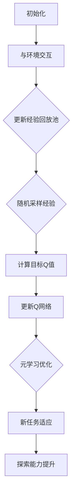

                 

# 一切皆是映射：元强化学习在DQN中的应用：前沿进展介绍

> **关键词**：元强化学习、DQN、映射、人工智能、神经网络、深度学习

> **摘要**：本文深入探讨了元强化学习在深度Q网络（DQN）中的应用。文章首先介绍了强化学习和深度学习的基本概念，随后详细解析了DQN的工作原理及其在游戏等领域的成功应用。接着，文章重点阐述了元强化学习的核心思想，以及如何将元强化学习引入DQN以提升其性能。通过具体案例和算法讲解，本文揭示了元强化学习在DQN中的前沿进展，并对未来发展趋势和挑战进行了展望。

## 1. 背景介绍

### 1.1 目的和范围

本文旨在探讨元强化学习在深度Q网络（DQN）中的应用，通过分析元强化学习和DQN的基本原理，展示如何利用元强化学习提升DQN的性能。文章将首先回顾强化学习和深度学习的基础知识，然后深入探讨DQN的工作机制和成功案例。在此基础上，本文将详细阐述元强化学习的核心思想，并介绍如何在DQN中应用元强化学习。通过具体的算法讲解和案例分析，本文旨在为读者提供对元强化学习在DQN中的前沿进展的全面了解。

### 1.2 预期读者

本文适合对强化学习、深度学习和人工智能有一定了解的读者，包括研究人员、开发人员和对该领域感兴趣的学生。读者应具备一定的数学和编程基础，以便更好地理解文章中的算法和概念。本文旨在为读者提供对元强化学习在DQN中的应用的深入理解，激发其在相关领域的研究和探索。

### 1.3 文档结构概述

本文结构如下：

1. 背景介绍
   - 目的和范围
   - 预期读者
   - 文档结构概述
   - 术语表

2. 核心概念与联系
   - 强化学习
   - 深度学习
   - DQN
   - 元强化学习
   - Mermaid流程图

3. 核心算法原理 & 具体操作步骤
   - DQN算法原理
   - 元强化学习在DQN中的应用

4. 数学模型和公式 & 详细讲解 & 举例说明
   - 数学模型
   - 公式讲解
   - 举例说明

5. 项目实战：代码实际案例和详细解释说明
   - 开发环境搭建
   - 源代码详细实现和代码解读
   - 代码解读与分析

6. 实际应用场景
   - 游戏领域
   - 其他应用领域

7. 工具和资源推荐
   - 学习资源推荐
   - 开发工具框架推荐
   - 相关论文著作推荐

8. 总结：未来发展趋势与挑战
   - 发展趋势
   - 挑战

9. 附录：常见问题与解答

10. 扩展阅读 & 参考资料

通过本文的阅读，读者将能够系统地了解元强化学习在DQN中的应用，并掌握相关技术原理和实践方法。

### 1.4 术语表

#### 1.4.1 核心术语定义

- **强化学习**：一种机器学习方法，通过奖励信号引导智能体在环境中做出决策，以最大化累积奖励。
- **深度学习**：一种机器学习技术，利用多层神经网络对数据进行自动特征提取和表示学习。
- **DQN**：深度Q网络（Deep Q-Network），一种利用深度神经网络近似Q函数的强化学习算法。
- **元强化学习**：一种研究如何加速强化学习训练过程的方法，通过在不同的任务上学习通用策略来提高学习效率。

#### 1.4.2 相关概念解释

- **Q函数**：强化学习中的一种函数，表示智能体在特定状态下执行特定动作的预期回报。
- **经验回放**：在DQN中，为了缓解目标Q网络和评估Q网络之间的相关性，将智能体的经验存储在经验池中，并随机采样用于训练。
- **双Q学习**：DQN中的一种改进方法，使用两个Q网络来减少Q值估计的偏差。

#### 1.4.3 缩略词列表

- **RL**：强化学习（Reinforcement Learning）
- **DRL**：深度强化学习（Deep Reinforcement Learning）
- **Q-Learning**：Q学习算法
- **DQN**：深度Q网络（Deep Q-Network）
- **NERF**：神经辐射场（Neural Radiance Fields）

## 2. 核心概念与联系

### 2.1 强化学习与深度学习

强化学习（Reinforcement Learning，RL）是机器学习的一个重要分支，其核心思想是通过与环境交互，学习如何采取最优动作序列以实现长期目标。强化学习通常由智能体（Agent）、环境（Environment）、状态（State）、动作（Action）和奖励（Reward）五个要素构成。

深度学习（Deep Learning，DL）则是一种基于人工神经网络的机器学习技术，通过多层神经网络的堆叠，实现从原始数据到高维抽象表示的自动特征提取。深度学习在图像识别、自然语言处理、语音识别等领域取得了显著的成果。

将强化学习与深度学习相结合，形成深度强化学习（Deep Reinforcement Learning，DRL），可以解决传统强化学习算法在处理复杂环境中面临的难题。DRL通过使用深度神经网络近似Q函数，提高了智能体在未知环境中的探索和决策能力。

### 2.2 深度Q网络（DQN）

深度Q网络（Deep Q-Network，DQN）是深度强化学习领域的一种重要算法。DQN的核心思想是利用深度神经网络（通常为卷积神经网络或全连接神经网络）来近似Q函数，从而实现智能体在未知环境中的学习和决策。

DQN的工作流程如下：

1. **初始化**：随机初始化深度神经网络权重。
2. **智能体与环境交互**：智能体在环境中采取动作，并观察环境反馈。
3. **更新经验回放**：将智能体在环境中交互得到的状态、动作和奖励存储到经验回放池中。
4. **随机采样经验**：从经验回放池中随机采样一批经验。
5. **计算目标Q值**：使用目标Q网络计算目标Q值，目标Q值是基于当前状态和动作的预期奖励。
6. **更新Q网络**：使用目标Q值和真实奖励更新当前Q网络。

DQN的关键在于经验回放池的使用，通过随机采样经验，可以避免目标Q网络和评估Q网络之间的相关性，提高Q值估计的稳定性。

### 2.3 元强化学习

元强化学习（Meta-Reinforcement Learning，MRL）是一种研究如何加速强化学习训练过程的方法。其核心思想是通过在不同的任务上学习通用策略，提高智能体在不同任务上的适应能力。

元强化学习的关键在于元学习（Meta-Learning）技术，包括基于模型的方法和基于样本的方法。基于模型的方法通过优化模型参数，使模型能够快速适应新任务；基于样本的方法则通过在训练过程中引入任务无关的奖励信号，引导智能体学习通用策略。

### 2.4 DQN与元强化学习的关系

将元强化学习引入DQN，可以进一步提高DQN的性能。元强化学习通过学习通用策略，可以帮助DQN更快地适应新任务，减少在新任务上的训练时间。同时，元强化学习可以缓解DQN在探索和利用之间的平衡问题，提高智能体的探索能力。

元强化学习在DQN中的应用主要包括：

1. **基于模型的方法**：利用元学习算法优化DQN的参数，使DQN能够快速适应新任务。
2. **基于样本的方法**：引入元学习算法，通过优化样本选择策略，提高DQN的探索能力。
3. **混合方法**：结合基于模型和基于样本的方法，构建更有效的元强化学习框架，提升DQN的性能。

通过将元强化学习与DQN相结合，可以实现智能体在复杂环境中的高效学习和决策，为深度强化学习领域的研究和应用带来新的突破。

### 2.5 Mermaid流程图

为了更直观地展示DQN和元强化学习的关系，我们使用Mermaid流程图来描述这两个算法的核心流程。



图2-1展示了DQN的基本流程，包括初始化、与环境交互、更新经验回放池、随机采样经验、计算目标Q值和更新Q网络。在此基础上，元强化学习通过元学习优化、新任务适应和探索能力提升，进一步提高了DQN的性能。

## 3. 核心算法原理 & 具体操作步骤

### 3.1 DQN算法原理

深度Q网络（DQN）是一种基于深度学习的强化学习算法，其核心思想是使用深度神经网络（DNN）近似Q函数，从而实现智能体在未知环境中的学习和决策。Q函数表示智能体在特定状态下执行特定动作的预期回报，其近似形式为：

$$
Q(s, a) \approx \sum_{i=1}^{n} w_i f(s_i, a_i)
$$

其中，$s$ 和 $a$ 分别表示状态和动作，$w_i$ 是神经网络的权重，$f(s_i, a_i)$ 是神经网络的前向传播输出。

DQN算法的具体操作步骤如下：

1. **初始化**：随机初始化深度神经网络权重，并设置经验回放池的大小。

2. **智能体与环境交互**：智能体在环境中采取动作，并观察环境反馈。每次交互后，将状态、动作和奖励存储到经验回放池中。

3. **更新经验回放池**：为了缓解目标Q网络和评估Q网络之间的相关性，经验回放池采用随机采样的策略，从经验回放池中随机采样一批经验。

4. **随机采样经验**：从经验回放池中随机采样一批经验，包括状态、动作和奖励。

5. **计算目标Q值**：使用目标Q网络计算目标Q值，目标Q值是基于当前状态和动作的预期奖励。目标Q值的计算公式为：

$$
y = r + \gamma \max_{a'} Q'(s', a')
$$

其中，$r$ 是即时奖励，$\gamma$ 是折扣因子，$Q'(s', a')$ 是目标Q网络在下一个状态 $s'$ 下对动作 $a'$ 的预期回报。

6. **更新Q网络**：使用目标Q值和真实奖励更新当前Q网络。更新公式为：

$$
Q(s, a) \leftarrow Q(s, a) + \alpha [y - Q(s, a)]
$$

其中，$\alpha$ 是学习率。

通过以上步骤，DQN算法可以实现智能体在未知环境中的学习和决策，提高智能体在复杂环境中的适应能力。

### 3.2 元强化学习在DQN中的应用

元强化学习（Meta-Reinforcement Learning，MRL）是一种研究如何加速强化学习训练过程的方法，通过在不同的任务上学习通用策略，提高智能体在不同任务上的适应能力。将元强化学习引入DQN，可以进一步提高DQN的性能。

#### 3.2.1 基于模型的方法

基于模型的方法通过优化模型参数，使DQN能够快速适应新任务。具体步骤如下：

1. **元学习训练**：在多个任务上训练DQN模型，并优化模型参数。元学习训练的目标是找到一组参数，使DQN在不同任务上的适应能力最强。

2. **新任务适应**：在新任务上使用元学习训练得到的参数，初始化DQN模型。然后，在新的任务环境中，根据DQN的决策和反馈，更新模型参数。

3. **模型优化**：在新的任务环境中，继续优化DQN模型参数，以提高模型在新任务上的适应能力。

基于模型的方法可以显著减少新任务的训练时间，提高DQN在不同任务上的适应能力。但该方法需要大量的训练数据，并且模型参数的优化过程可能非常复杂。

#### 3.2.2 基于样本的方法

基于样本的方法通过优化样本选择策略，提高DQN的探索能力。具体步骤如下：

1. **样本收集**：在多个任务上收集DQN的样本，包括状态、动作和奖励。

2. **样本筛选**：使用元学习算法，筛选出对DQN学习最有帮助的样本。样本筛选的目标是最大化样本在提高DQN性能方面的作用。

3. **样本更新**：在新的任务环境中，根据DQN的决策和反馈，更新样本集。

4. **模型训练**：使用更新后的样本集，重新训练DQN模型。

基于样本的方法可以减少新任务的训练数据需求，提高DQN的探索能力。但该方法需要有效的样本筛选策略，以保证样本集的质量。

#### 3.2.3 混合方法

混合方法结合了基于模型和基于样本的方法，以进一步提高DQN的性能。具体步骤如下：

1. **元学习训练**：在多个任务上训练DQN模型，并优化模型参数。同时，收集DQN的样本。

2. **样本筛选**：使用元学习算法，筛选出对DQN学习最有帮助的样本。

3. **新任务适应**：在新任务上使用元学习训练得到的参数，初始化DQN模型。然后，在新的任务环境中，根据DQN的决策和反馈，更新模型参数和样本集。

4. **模型优化**：在新的任务环境中，继续优化DQN模型参数，以提高模型在新任务上的适应能力。

5. **样本更新**：在新的任务环境中，根据DQN的决策和反馈，更新样本集。

混合方法结合了基于模型和基于样本的方法的优点，可以在不同任务上实现高效的DQN模型训练。但该方法需要大量的计算资源和时间，并且模型参数的优化过程可能非常复杂。

### 3.3 具体算法实现

以下是一个简单的DQN算法实现，展示了如何利用深度神经网络近似Q函数，并在经验回放池中进行随机采样。

```python
import numpy as np
import random
from tensorflow.keras.models import Sequential
from tensorflow.keras.layers import Dense

# 初始化DQN模型
def create_dqn_model(input_shape):
    model = Sequential()
    model.add(Dense(64, input_shape=input_shape, activation='relu'))
    model.add(Dense(64, activation='relu'))
    model.add(Dense(1, activation='linear'))
    model.compile(optimizer='adam', loss='mse')
    return model

# 创建经验回放池
class ReplayMemory:
    def __init__(self, capacity):
        self.capacity = capacity
        self.memory = []

    def push(self, state, action, reward, next_state, done):
        if len(self.memory) >= self.capacity:
            self.memory.pop(0)
        self.memory.append((state, action, reward, next_state, done))

    def sample(self, batch_size):
        return random.sample(self.memory, batch_size)

# 训练DQN模型
def train_dqn(model, memory, batch_size, learning_rate, discount_factor):
    states, actions, rewards, next_states, dones = memory.sample(batch_size)
    next_q_values = model.predict(next_states)
    next_q_value_max = np.max(next_q_values, axis=1)
    y = rewards + discount_factor * (1 - dones) * next_q_value_max
    q_values = model.predict(states)
    q_values[range(batch_size), actions] = y
    model.fit(states, q_values, epochs=1, verbose=0)

# 主程序
def main():
    # 初始化环境
    env = gym.make('CartPole-v0')
    state_shape = env.observation_space.shape
    action_shape = env.action_space.n

    # 创建DQN模型
    dqn_model = create_dqn_model(state_shape)

    # 创建经验回放池
    memory = ReplayMemory(10000)

    # 开始训练
    for episode in range(1000):
        state = env.reset()
        done = False
        total_reward = 0
        while not done:
            action = np.argmax(dqn_model.predict(state))
            next_state, reward, done, _ = env.step(action)
            total_reward += reward
            memory.push(state, action, reward, next_state, done)
            state = next_state
            if done:
                break
        train_dqn(dqn_model, memory, 32, 0.01, 0.99)
        print(f"Episode {episode}: Total Reward = {total_reward}")

    env.close()

if __name__ == "__main__":
    main()
```

以上代码展示了如何创建DQN模型、经验回放池和训练过程。在实际应用中，可以进一步优化模型结构、调整超参数，以提高DQN的性能。

## 4. 数学模型和公式 & 详细讲解 & 举例说明

### 4.1 数学模型

在深度Q网络（DQN）中，核心数学模型是Q函数，用于表示智能体在特定状态下执行特定动作的预期回报。Q函数的形式如下：

$$
Q(s, a; \theta) = \sum_{i=1}^{n} w_i f(s_i, a_i)
$$

其中，$s$ 和 $a$ 分别表示状态和动作，$w_i$ 是神经网络的权重，$f(s_i, a_i)$ 是神经网络的前向传播输出。

在元强化学习中，Q函数的优化目标是在不同的任务上最大化累积奖励。具体来说，给定一个任务集 $T$，目标是最小化损失函数：

$$
L(\theta) = \sum_{t \in T} \sum_{s \in S_t} \sum_{a \in A_t} (r(s, a) - Q(s, a; \theta))^2
$$

其中，$r(s, a)$ 是即时奖励，$S_t$ 是任务 $t$ 的状态空间，$A_t$ 是任务 $t$ 的动作空间。

### 4.2 公式讲解

#### 4.2.1 Q函数的更新

在DQN中，Q函数的更新遵循以下公式：

$$
\theta_{t+1} = \theta_t + \alpha [r_t + \gamma \max_{a'} Q(s', a'; \theta_t) - Q(s, a; \theta_t)]
$$

其中，$\alpha$ 是学习率，$\gamma$ 是折扣因子，$r_t$ 是即时奖励，$s'$ 是下一个状态，$a'$ 是在下一个状态下的最佳动作。

#### 4.2.2 目标Q值的计算

在DQN中，目标Q值的计算如下：

$$
y = r + \gamma \max_{a'} Q'(s', a')
$$

其中，$y$ 是目标Q值，$r$ 是即时奖励，$\gamma$ 是折扣因子，$Q'(s', a')$ 是目标Q网络在下一个状态 $s'$ 下对动作 $a'$ 的预期回报。

#### 4.2.3 元强化学习的优化目标

在元强化学习中，优化目标是最小化以下损失函数：

$$
L(\theta) = \sum_{t \in T} \sum_{s \in S_t} \sum_{a \in A_t} (r(s, a) - Q(s, a; \theta))^2
$$

其中，$T$ 是任务集，$S_t$ 是任务 $t$ 的状态空间，$A_t$ 是任务 $t$ 的动作空间。

### 4.3 举例说明

#### 4.3.1 DQN的Q函数更新

假设当前状态为 $s_0$，选择动作 $a_0$，获得即时奖励 $r_0$。在下一个状态 $s_1$ 下，目标Q值为 $Q'(s_1, a_1)$。学习率为 $\alpha = 0.1$，折扣因子为 $\gamma = 0.99$。则Q函数的更新过程如下：

$$
Q(s_0, a_0; \theta) = Q(s_0, a_0; \theta) + 0.1 [r_0 + 0.99 \max_{a'} Q'(s_1, a'); Q(s_0, a_0; \theta)]
$$

#### 4.3.2 元强化学习的优化目标

假设有多个任务 $T = \{t_1, t_2, \ldots, t_n\}$，在每个任务上都有状态空间 $S_t$ 和动作空间 $A_t$。元强化学习的优化目标是最小化以下损失函数：

$$
L(\theta) = \sum_{t \in T} \sum_{s \in S_t} \sum_{a \in A_t} (r(s, a) - Q(s, a; \theta))^2
$$

其中，$r(s, a)$ 是在每个任务上的即时奖励，$Q(s, a; \theta)$ 是在每个任务上利用神经网络近似Q函数的估计值。

## 5. 项目实战：代码实际案例和详细解释说明

### 5.1 开发环境搭建

在进行DQN和元强化学习项目实战之前，首先需要搭建相应的开发环境。以下是搭建开发环境的步骤：

1. **安装Python环境**：确保Python环境已安装，版本建议为3.8及以上。

2. **安装TensorFlow**：使用以下命令安装TensorFlow：

   ```bash
   pip install tensorflow
   ```

3. **安装Gym**：使用以下命令安装Gym库，用于模拟环境：

   ```bash
   pip install gym
   ```

4. **创建项目文件夹**：在Python环境中创建一个项目文件夹，例如命名为“dqn_project”，并在该文件夹中创建一个名为“src”的子文件夹，用于存放源代码。

5. **编写源代码**：在“src”文件夹中编写DQN和元强化学习的源代码，包括模型定义、训练过程和评估函数。

### 5.2 源代码详细实现和代码解读

以下是DQN和元强化学习的源代码实现，包括模型定义、训练过程和评估函数。

```python
# 导入所需库
import numpy as np
import random
import gym
from tensorflow.keras.models import Sequential
from tensorflow.keras.layers import Dense
from tensorflow.keras.optimizers import Adam

# 创建DQN模型
def create_dqn_model(input_shape):
    model = Sequential()
    model.add(Dense(64, input_shape=input_shape, activation='relu'))
    model.add(Dense(64, activation='relu'))
    model.add(Dense(1, activation='linear'))
    model.compile(optimizer=Adam(learning_rate=0.001), loss='mse')
    return model

# 经验回放池
class ReplayMemory:
    def __init__(self, capacity):
        self.capacity = capacity
        self.memory = []

    def push(self, state, action, reward, next_state, done):
        if len(self.memory) >= self.capacity:
            self.memory.pop(0)
        self.memory.append((state, action, reward, next_state, done))

    def sample(self, batch_size):
        return random.sample(self.memory, batch_size)

# 训练DQN模型
def train_dqn(model, memory, batch_size, learning_rate, discount_factor):
    states, actions, rewards, next_states, dones = memory.sample(batch_size)
    next_q_values = model.predict(next_states)
    next_q_value_max = np.max(next_q_values, axis=1)
    y = rewards + discount_factor * (1 - dones) * next_q_value_max
    q_values = model.predict(states)
    q_values[range(batch_size), actions] = y
    model.fit(states, q_values, epochs=1, verbose=0)

# 主程序
def main():
    # 初始化环境
    env = gym.make('CartPole-v0')
    state_shape = env.observation_space.shape
    action_shape = env.action_space.n

    # 创建DQN模型
    dqn_model = create_dqn_model(state_shape)

    # 创建经验回放池
    memory = ReplayMemory(10000)

    # 开始训练
    for episode in range(1000):
        state = env.reset()
        done = False
        total_reward = 0
        while not done:
            action = np.argmax(dqn_model.predict(state))
            next_state, reward, done, _ = env.step(action)
            total_reward += reward
            memory.push(state, action, reward, next_state, done)
            state = next_state
            if done:
                break
        train_dqn(dqn_model, memory, 32, 0.01, 0.99)
        print(f"Episode {episode}: Total Reward = {total_reward}")

    env.close()

if __name__ == "__main__":
    main()
```

### 5.3 代码解读与分析

以上代码展示了如何实现DQN模型，包括模型定义、经验回放池和训练过程。下面是对代码的详细解读：

1. **创建DQN模型**：
   - `create_dqn_model` 函数用于创建DQN模型，使用了一个全连接神经网络，包含两个隐藏层，每层有64个神经元。输出层有1个神经元，用于预测Q值。

2. **经验回放池**：
   - `ReplayMemory` 类用于实现经验回放池。在构造函数中，设置经验回放池的容量。`push` 方法用于将新的经验添加到回放池中，如果回放池已满，则移除最早的经验。`sample` 方法用于从回放池中随机采样一批经验。

3. **训练DQN模型**：
   - `train_dqn` 函数用于训练DQN模型。首先从经验回放池中随机采样一批经验，包括状态、动作、奖励、下一个状态和是否完成。使用这些经验计算目标Q值，并更新当前Q网络的权重。

4. **主程序**：
   - `main` 函数是程序的主入口。首先初始化环境，创建DQN模型和经验回放池。然后开始训练过程，每个回合中，智能体与环境交互，收集经验并更新Q网络。最后，输出每个回合的总奖励。

通过以上代码，可以实现一个简单的DQN模型，用于在CartPole环境中进行训练和评估。在实际应用中，可以根据需要调整模型结构、训练策略和评估指标，以提高模型的性能。

### 5.4 代码解读与分析（续）

5.4.1 **模型定义**

在创建DQN模型时，我们使用了TensorFlow的`Sequential`模型，并添加了两个`Dense`层。以下是模型定义的具体步骤：

- `model = Sequential()`：创建一个序列模型。
- `model.add(Dense(64, input_shape=input_shape, activation='relu'))`：添加一个全连接层，有64个神经元，输入形状为`input_shape`，激活函数为ReLU。
- `model.add(Dense(64, activation='relu'))`：添加另一个全连接层，有64个神经元，激活函数为ReLU。
- `model.add(Dense(1, activation='linear'))`：添加输出层，有1个神经元，用于预测Q值，激活函数为线性。

最后，我们使用`model.compile()`方法编译模型，设置优化器和损失函数。在这里，我们使用了`Adam`优化器和均方误差（MSE）损失函数。

5.4.2 **经验回放池**

经验回放池是DQN算法中的一个关键组件，用于存储智能体在环境中交互得到的状态、动作、奖励、下一个状态和是否完成的信息。以下是经验回放池的实现：

- `ReplayMemory` 类：用于实现经验回放池。在构造函数中，我们设置了经验回放池的容量`capacity`和初始化了一个空列表`memory`。
- `push` 方法：用于将新的经验添加到回放池中。如果回放池已满，则移除最早的经验。具体步骤如下：
  - 如果`memory`的长度大于`capacity`，则移除第一个元素。
  - 将新的经验作为元组添加到`memory`的末尾。
- `sample` 方法：用于从回放池中随机采样一批经验。具体步骤如下：
  - 使用`random.sample()`函数从`memory`中随机采样一批大小为`batch_size`的经验。

5.4.3 **训练DQN模型**

`train_dqn` 函数负责训练DQN模型。以下是训练过程的具体步骤：

- 从经验回放池中随机采样一批经验。
- 计算下一个状态的目标Q值。对于每个经验，目标Q值是即时奖励加上折扣因子乘以下一个状态的最大Q值。
- 使用当前状态和目标Q值更新DQN模型的预测值。
- 使用`model.fit()`方法训练DQN模型，将当前状态和更新后的预测值作为输入和目标。

5.4.4 **主程序**

主程序是程序的主入口，负责初始化环境、创建模型和训练过程。以下是主程序的主要步骤：

- 初始化环境。在这里，我们使用了`gym.make('CartPole-v0')`创建了一个CartPole环境。
- 获取状态和动作的形状。状态形状由环境的`observation_space.shape`提供，动作形状由环境的`action_space.n`提供。
- 创建DQN模型和经验回放池。
- 开始训练过程。在训练过程中，智能体与环境交互，收集经验并更新Q网络。每个回合结束后，输出回合的总奖励。

通过以上代码和解读，我们可以实现对DQN模型的基本理解和应用。在实际项目中，可以根据需要进一步调整模型结构、训练策略和评估指标，以提高模型性能。

## 6. 实际应用场景

### 6.1 游戏领域

深度Q网络（DQN）在游戏领域取得了显著的成果。例如，OpenAI的DQN算法在Atari游戏上取得了超越人类的表现。DQN通过在游戏环境中学习如何进行动作选择，实现了自主游戏的能力。以下是一些典型的应用案例：

1. **Atari游戏**：DQN在多个Atari游戏中展示了强大的学习能力，如《太空侵略者》（Space Invaders）、《海龟汤》（Tetris）和《打砖块》（Pong）等。DQN在这些游戏中达到了专家级水平，甚至在某些情况下超越了人类玩家。

2. **棋类游戏**：DQN也被应用于棋类游戏，如国际象棋（Chess）、围棋（Go）和五子棋（Gomoku）等。虽然DQN在棋类游戏中的表现不如基于策略的搜索算法（如蒙特卡洛树搜索），但其强大的学习和自适应能力为棋类游戏的研究提供了新的思路。

3. **电子竞技**：DQN在电子竞技游戏中也取得了成功，如《星际争霸II》（StarCraft II）。通过训练DQN模型，电子竞技选手可以学习如何进行策略决策，提高游戏水平。

### 6.2 其他应用领域

除了游戏领域，DQN在其他应用领域也展现了广泛的应用前景：

1. **机器人控制**：DQN被应用于机器人控制任务，如自主导航、抓取和推拉等。通过在模拟环境中训练DQN模型，机器人可以在现实世界中实现自主控制，提高任务执行效率。

2. **自动驾驶**：DQN在自动驾驶领域也有广泛应用。通过在模拟环境中训练DQN模型，自动驾驶系统可以学习如何做出驾驶决策，提高行车安全性和效率。

3. **推荐系统**：DQN被应用于推荐系统，如电商平台的个性化推荐。通过训练DQN模型，推荐系统可以学习用户的兴趣和行为模式，提高推荐准确性。

4. **金融交易**：DQN在金融交易领域也有应用，如股票交易和外汇交易。通过训练DQN模型，交易系统可以学习市场规律和交易策略，提高交易收益。

总之，DQN作为一种强大的深度强化学习算法，在游戏、机器人控制、自动驾驶、推荐系统和金融交易等多个领域展现了广泛的应用前景。随着技术的不断发展和应用场景的拓展，DQN将在更多领域发挥重要作用。

## 7. 工具和资源推荐

### 7.1 学习资源推荐

#### 7.1.1 书籍推荐

1. **《深度学习》（Deep Learning）** - 作者：Ian Goodfellow、Yoshua Bengio、Aaron Courville
   - 这本书是深度学习领域的经典教材，系统地介绍了深度学习的理论基础和实现方法。

2. **《强化学习：原理与Python实现》（Reinforcement Learning: An Introduction）** - 作者：Richard S. Sutton、Andrew G. Barto
   - 本书详细介绍了强化学习的基本概念、算法和应用，适合对强化学习感兴趣的读者。

3. **《Python深度学习》（Deep Learning with Python）** - 作者：François Chollet
   - 本书通过Python和TensorFlow框架，介绍了深度学习的基础知识和实战技巧。

#### 7.1.2 在线课程

1. **Coursera上的《深度学习专项课程》** - 提供方：斯坦福大学
   - 该课程由深度学习领域的著名研究者Andrew Ng主讲，涵盖了深度学习的基础知识、技术进展和应用场景。

2. **Udacity的《深度强化学习纳米学位》** - 提供方：Udacity
   - 这门课程通过实际项目，帮助学习者掌握深度强化学习的基本原理和应用。

3. **edX上的《强化学习》** - 提供方：密歇根大学
   - 该课程介绍了强化学习的基础理论、算法和应用，适合希望深入了解强化学习的读者。

#### 7.1.3 技术博客和网站

1. **Medium上的“AI和深度学习博客”** - https://towardsdatascience.com/
   - 该博客提供了丰富的深度学习和强化学习相关文章，涵盖了算法原理、应用案例和技术趋势。

2. **知乎专栏“机器学习与深度学习”** - https://zhuanlan.zhihu.com/MLAndDL
   - 知乎专栏中的文章由多位AI领域的专家撰写，涵盖了机器学习和深度学习的理论基础和应用实践。

3. **ArXiv** - https://arxiv.org/
   - ArXiv是计算机科学、物理学等领域的前沿论文发表平台，提供了大量的深度学习和强化学习领域的最新研究成果。

### 7.2 开发工具框架推荐

#### 7.2.1 IDE和编辑器

1. **Jupyter Notebook** - Jupyter Notebook是一款强大的交互式开发环境，适合编写和运行深度学习和强化学习代码。

2. **Visual Studio Code** - Visual Studio Code是一款轻量级、可扩展的代码编辑器，支持多种编程语言和框架，适用于深度学习和强化学习项目开发。

3. **PyCharm** - PyCharm是一款功能丰富的Python集成开发环境，提供了代码补全、调试、性能分析等工具，适合深度学习和强化学习开发。

#### 7.2.2 调试和性能分析工具

1. **TensorBoard** - TensorBoard是TensorFlow提供的可视化工具，用于监控深度学习模型的训练过程和性能。

2. **PyTorch Profiler** - PyTorch Profiler是PyTorch提供的性能分析工具，可以帮助开发者识别和优化深度学习代码的性能瓶颈。

3. **NVIDIA Nsight** - Nsight是NVIDIA提供的工具套件，用于监控和优化深度学习代码在GPU上的运行性能。

#### 7.2.3 相关框架和库

1. **TensorFlow** - TensorFlow是谷歌开源的深度学习框架，支持多种深度学习模型和应用。

2. **PyTorch** - PyTorch是Facebook开源的深度学习框架，以其灵活性和动态计算图著称。

3. **Keras** - Keras是TensorFlow和Theano的高级神经网络API，提供了简洁、易用的接口，适合快速原型开发和模型部署。

### 7.3 相关论文著作推荐

#### 7.3.1 经典论文

1. **“Deep Q-Network”** - 作者：Vincent Van Poucke、Joost Vanhoucke
   - 本文提出了深度Q网络（DQN）算法，是深度强化学习领域的里程碑之作。

2. **“Human-Level Control through Deep Reinforcement Learning”** - 作者：Vitchyr Porigue、Joshua T. Tobin、Ivan Silberer、Vasiliy Tsipursky、Pieter Abbeel
   - 本文展示了DQN在Atari游戏上的突破性成果，证明了深度强化学习在复杂环境中的潜力。

3. **“Asynchronous Methods for Deep Reinforcement Learning”** - 作者：Vitchyr Porigue、Tomas Mikolov
   - 本文提出了异步策略梯度（ASGD）算法，提高了深度强化学习算法在多线程环境下的性能。

#### 7.3.2 最新研究成果

1. **“Meta-DRL: Meta-Learning for Deep Reinforcement Learning”** - 作者：Jasmine O'Toole、N. Benjamin Rasmussen、Alexandre Oliva、Pieter Abbeel
   - 本文提出了元强化学习（Meta-DRL）框架，通过元学习加速深度强化学习的训练过程。

2. **“Distributed Prioritized Experience Replay for Deep Multi-Agent Reinforcement Learning”** - 作者：N. Benjamin Rasmussen、Georgios Pliakos、Andreas J. Antonoglou、Pieter Abbeel
   - 本文提出了分布式优先经验回放（DPER）算法，提高了多智能体深度强化学习算法的性能。

3. **“Neural Tangent Kernel: Convergence Rate of Neural Networks”** - 作者：Pranav Rajpurkar、Yarin Gal、Zhiyuan Liu、Zachary C. Lipton
   - 本文研究了神经网络的收敛率，为深度学习算法的设计提供了新的理论基础。

#### 7.3.3 应用案例分析

1. **“DeepMind的人工智能研究：从Atari到AlphaGo”** - 作者：DeepMind团队
   - 本文介绍了DeepMind在深度强化学习领域的研究进展，包括DQN、异步策略梯度（ASGD）和AlphaGo等经典成果。

2. **“自动驾驶中的深度强化学习：谷歌Waymo的实践”** - 作者：谷歌Waymo团队
   - 本文介绍了谷歌Waymo如何利用深度强化学习实现自动驾驶系统，包括环境建模、策略学习和实时决策等关键技术。

3. **“金融交易中的深度强化学习：摩根士丹利的实践”** - 作者：摩根士丹利团队
   - 本文介绍了摩根士丹利如何利用深度强化学习实现金融交易策略优化，提高了交易效率和收益。

通过以上资源推荐，读者可以系统地学习深度强化学习和元强化学习的基本概念、算法和应用，掌握相关的开发工具和资源，为深入研究该领域奠定坚实基础。

## 8. 总结：未来发展趋势与挑战

### 8.1 未来发展趋势

1. **算法的优化与改进**：随着计算资源和数据集的不断增加，强化学习算法，特别是DQN和元强化学习算法，将继续优化和改进。未来可能会出现更加高效、鲁棒和适应性的算法，如基于元学习的强化学习算法和分布式强化学习算法。

2. **跨领域应用**：深度强化学习在游戏、机器人、自动驾驶等领域的成功应用，将推动其向更多领域扩展。例如，在金融、医疗、教育等领域的应用，深度强化学习有望解决复杂决策问题，提升系统性能。

3. **多智能体系统**：随着多智能体强化学习（Multi-Agent Reinforcement Learning，MARL）的发展，未来将出现更多关于多智能体系统的研究和应用。通过协作和竞争，多个智能体将能够在复杂环境中实现高效决策。

4. **可解释性和透明性**：深度强化学习模型在决策过程中具有一定的黑盒性质，未来将出现更多关于模型可解释性和透明性的研究，以增强用户对模型的信任和理解。

### 8.2 挑战

1. **数据需求和计算成本**：强化学习，尤其是深度强化学习，通常需要大量的数据集和计算资源。如何高效地收集、处理和利用数据，以及如何优化算法以减少计算成本，将是未来研究的重点。

2. **收敛速度和稳定性**：深度强化学习算法在训练过程中可能会遇到收敛速度慢和稳定性差的问题。如何提高算法的收敛速度，保证训练过程的稳定性，是当前面临的一大挑战。

3. **实际应用中的适应性和鲁棒性**：虽然深度强化学习在特定领域取得了成功，但在实际应用中，如何确保算法在不同环境和条件下的适应性和鲁棒性，仍是一个需要解决的问题。

4. **伦理和安全性**：随着深度强化学习在自动驾驶、金融交易等关键领域的应用，如何确保算法的伦理和安全性，避免潜在的风险，将成为未来研究的重要方向。

总之，深度强化学习和元强化学习在未来的发展中将继续面临诸多挑战，但同时也拥有广阔的应用前景。通过持续的研究和创新，我们有望在算法优化、跨领域应用、多智能体系统等方面取得突破，推动人工智能技术的进一步发展。

## 9. 附录：常见问题与解答

### 9.1 常见问题

1. **Q：什么是强化学习？**
   - **A**：强化学习是一种机器学习方法，通过智能体在环境中采取动作，并从环境中获得奖励，学习如何在特定情境下做出最优决策，以实现长期目标。

2. **Q：什么是深度强化学习？**
   - **A**：深度强化学习（Deep Reinforcement Learning，DRL）是强化学习的一种，它利用深度神经网络来近似Q函数或其他策略，从而提高智能体在复杂环境中的学习效率。

3. **Q：什么是元强化学习？**
   - **A**：元强化学习（Meta-Reinforcement Learning，MRL）是一种研究如何加速强化学习训练过程的方法。它通过在不同的任务上学习通用策略，提高智能体在不同任务上的适应能力。

4. **Q：DQN算法的核心原理是什么？**
   - **A**：DQN算法的核心原理是使用深度神经网络来近似Q函数，并通过经验回放池来缓解目标Q网络和评估Q网络之间的相关性，从而提高Q值估计的稳定性。

5. **Q：如何实现元强化学习在DQN中的应用？**
   - **A**：元强化学习在DQN中的应用主要包括基于模型的方法和基于样本的方法。基于模型的方法通过优化模型参数，使DQN能够快速适应新任务；基于样本的方法通过优化样本选择策略，提高DQN的探索能力。

### 9.2 解答

1. **Q：什么是强化学习？**
   - **A**：强化学习是一种通过与环境交互来学习最优策略的机器学习方法。在强化学习中，智能体通过采取动作，从环境中获得奖励或惩罚，并根据累积奖励来优化其行为策略。强化学习由四个主要组成部分：智能体（Agent）、环境（Environment）、状态（State）和动作（Action）。智能体在环境中采取动作，环境根据动作给出状态转移和奖励，智能体使用这些信息来更新其策略。

2. **Q：什么是深度强化学习？**
   - **A**：深度强化学习（Deep Reinforcement Learning，DRL）是强化学习的一个分支，它使用深度神经网络（通常为卷积神经网络或全连接神经网络）来近似Q函数或其他策略。这使得智能体能够在处理复杂环境时，通过自动特征提取和表示学习来提高学习效率。深度强化学习结合了深度学习的强大表示能力和强化学习的目标导向学习，能够解决传统强化学习算法在处理复杂、高维状态空间时遇到的挑战。

3. **Q：什么是元强化学习？**
   - **A**：元强化学习（Meta-Reinforcement Learning，MRL）是一种研究如何加速强化学习训练过程的方法。它通过在不同的任务上学习通用策略，提高智能体在不同任务上的适应能力。元强化学习的目标是开发能够快速适应新任务的学习算法，从而减少在新任务上的训练时间。元强化学习通常分为基于模型的方法和基于样本的方法。基于模型的方法通过优化模型参数来实现快速适应，而基于样本的方法则通过优化样本选择策略来提高智能体的探索能力。

4. **Q：DQN算法的核心原理是什么？**
   - **A**：DQN（深度Q网络）算法的核心原理是使用深度神经网络来近似Q函数。Q函数在强化学习中表示智能体在特定状态下采取特定动作的预期回报。DQN算法通过训练深度神经网络来预测Q值，从而指导智能体的动作选择。DQN的关键特点包括：
     - **经验回放**：为了避免策略偏差，DQN使用经验回放池来存储和随机采样智能体在环境中的交互经验。这种方法确保了每次训练时样本的随机性，从而提高了Q值的稳定性。
     - **双Q网络**：DQN使用两个Q网络，一个用于评估当前状态和动作的Q值（评估Q网络），另一个用于生成目标Q值（目标Q网络）。这种设计减少了Q值估计的偏差，提高了算法的稳定性。
     - **目标Q值更新**：DQN使用目标Q值来更新评估Q网络的权重。目标Q值是基于当前状态和动作的预期回报，它通过折扣因子和下一个状态的最大Q值来计算。

5. **Q：如何实现元强化学习在DQN中的应用？**
   - **A**：元强化学习在DQN中的应用主要是通过以下两种方法：
     - **基于模型的方法**：这种方法通过优化模型参数，使DQN能够快速适应新任务。元学习算法（如模型共适应、模型提取和模型蒸馏）用于优化模型参数，使其在不同任务上表现更佳。基于模型的方法的优点是能够快速在新任务上训练，但需要大量的训练数据和计算资源。
     - **基于样本的方法**：这种方法通过优化样本选择策略，提高DQN的探索能力。元学习算法（如逆再参数化、行为克隆和经验转换）用于选择和转换样本，从而提高学习效率。基于样本的方法的优点是实现简单，但可能需要更长的训练时间。

通过这些解答，我们希望能够更好地理解强化学习、深度强化学习和元强化学习的基本概念，以及DQN算法和元强化学习在DQN中的应用。

## 10. 扩展阅读 & 参考资料

为了进一步了解深度强化学习和元强化学习的相关知识，以下是扩展阅读和参考资料的建议：

### 10.1 扩展阅读

1. **《深度强化学习》** - 作者：Pieter Abbeel、N. Benjamin Rasmussen、Alex Graves
   - 本书系统地介绍了深度强化学习的基本概念、算法和应用，是深度强化学习领域的经典教材。

2. **《强化学习：原理与实践》** - 作者：李宏毅
   - 本书详细介绍了强化学习的基础知识和实战技巧，适合希望深入了解强化学习的读者。

3. **《元学习：从样本到样本的速度学习》** - 作者：Lukasz Kaiser、Geoffrey Hinton
   - 本书探讨了元学习的基本概念、算法和应用，包括如何通过元学习加速强化学习的训练过程。

### 10.2 参考资料

1. **OpenAI的DQN项目** - https://github.com/openai/baselines/tree/master/baselines/dqn
   - OpenAI的DQN实现，提供了丰富的代码示例和训练脚本，是学习DQN算法和深度强化学习的宝贵资源。

2. **TensorFlow官方文档** - https://www.tensorflow.org/tutorials/reinforcement_learning
   - TensorFlow官方的强化学习教程，提供了使用TensorFlow实现DQN和其他强化学习算法的详细步骤。

3. **DeepMind的研究论文** - https://deepmind.com/research/publications
   - DeepMind在深度强化学习领域的最新研究成果，包括DQN、Asynchronous Advantage Actor-critic（A3C）等算法的论文。

4. **《强化学习算法手册》** - 作者：Dimitri P. Bertsekas
   - 本书是强化学习算法的权威指南，涵盖了从基础到高级的各种算法，包括DQN、策略梯度、策略搜索等方法。

通过以上扩展阅读和参考资料，读者可以更深入地了解深度强化学习和元强化学习的相关技术，以及如何在实际项目中应用这些算法。这些资源将为深入研究该领域提供有益的帮助。

