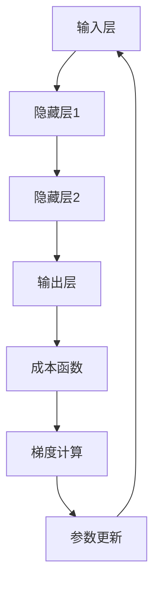

                 

# 一切皆是映射：反向传播机制的直观理解

> 关键词：反向传播、神经网络、机器学习、梯度下降、成本函数、梯度计算、深度学习

> 摘要：本文将深入浅出地介绍反向传播（Backpropagation）机制，一种在深度学习中用于计算梯度并优化网络参数的关键算法。我们将通过逐步分析和推理，深入理解反向传播的原理、数学模型和具体操作步骤，同时通过实战案例进行代码实现和解析，帮助读者全面掌握这一核心技术。

## 1. 背景介绍

### 1.1 目的和范围

本文的目标是让读者对反向传播（Backpropagation）机制有一个直观和深入的理解。我们将从基本概念入手，逐步介绍反向传播的原理、数学模型和具体实现步骤，并通过实际代码案例来加深对这一技术的掌握。

本文主要涵盖以下内容：

1. 反向传播的背景和作用
2. 核心概念与联系
3. 核心算法原理与操作步骤
4. 数学模型与公式详解
5. 项目实战与代码实现
6. 实际应用场景
7. 工具和资源推荐
8. 未来发展趋势与挑战
9. 常见问题与解答
10. 扩展阅读与参考资料

### 1.2 预期读者

本文适合以下读者群体：

1. 对深度学习和神经网络有一定了解的读者
2. 想要深入了解反向传播机制和如何实现优化的读者
3. 数据科学家、AI工程师、计算机科学专业学生和研究人员

### 1.3 文档结构概述

本文的结构如下：

1. 引言：介绍反向传播机制的背景和重要性
2. 核心概念与联系：阐述反向传播的相关概念和联系
3. 核心算法原理与操作步骤：详细解释反向传播的算法原理和操作步骤
4. 数学模型与公式详解：介绍反向传播中的数学模型和公式，并进行举例说明
5. 项目实战与代码实现：通过实际代码案例展示反向传播的实现过程
6. 实际应用场景：讨论反向传播在深度学习中的应用场景
7. 工具和资源推荐：推荐学习资源和开发工具
8. 未来发展趋势与挑战：探讨反向传播的未来发展和技术挑战
9. 常见问题与解答：回答读者可能遇到的常见问题
10. 扩展阅读与参考资料：提供进一步的阅读材料和参考资料

### 1.4 术语表

#### 1.4.1 核心术语定义

- **反向传播（Backpropagation）**：一种用于计算神经网络中各层参数梯度的算法，通过反向传递误差信号来优化网络参数。
- **成本函数（Cost Function）**：用于评估神经网络预测结果与实际结果之间差异的函数，通常用来指导网络参数的优化过程。
- **梯度（Gradient）**：函数在某一点处的切线斜率，用于描述函数在该点的局部变化趋势。
- **前向传播（Forward Propagation）**：神经网络中信息从输入层传递到输出层的过程。
- **反向传播（Backpropagation）**：神经网络中信息从输出层反向传递到输入层的过程，用于计算各层参数的梯度。

#### 1.4.2 相关概念解释

- **神经网络（Neural Network）**：一种模拟生物神经系统的计算模型，通过多层节点（神经元）的互联和激活函数来实现数据的处理和模式识别。
- **深度学习（Deep Learning）**：一种基于深度神经网络的学习方法，通过多层神经网络的结构来提取数据的特征，实现复杂的模式识别和预测任务。

#### 1.4.3 缩略词列表

- **NN**：神经网络（Neural Network）
- **DL**：深度学习（Deep Learning）
- **BP**：反向传播（Backpropagation）
- **SGD**：随机梯度下降（Stochastic Gradient Descent）
- **MLP**：多层感知器（Multi-Layer Perceptron）

## 2. 核心概念与联系

在深入理解反向传播之前，我们需要了解一些核心概念，这些概念构成了反向传播的理论基础。

### 2.1 神经网络架构

神经网络的架构决定了信息传递的路径和计算的方式。以下是一个典型的三层神经网络结构：

1. **输入层（Input Layer）**：接收输入数据，每个节点对应一个特征。
2. **隐藏层（Hidden Layer）**：对输入数据进行处理，通过激活函数提取特征。
3. **输出层（Output Layer）**：生成预测结果，通常包含多个节点，每个节点对应一个类别或数值。

### 2.2 激活函数

激活函数是神经网络中用于引入非线性特性的关键组件。常见的激活函数包括：

- **Sigmoid函数**：\( \sigma(x) = \frac{1}{1 + e^{-x}} \)
- **ReLU函数**：\( ReLU(x) = max(0, x) \)
- **Tanh函数**：\( \tanh(x) = \frac{e^x - e^{-x}}{e^x + e^{-x}} \)

### 2.3 成本函数

成本函数用于评估神经网络的预测结果与实际结果之间的差距。常见的成本函数包括：

- **均方误差（MSE）**：\( MSE(y, \hat{y}) = \frac{1}{2} \sum_{i=1}^{n} (y_i - \hat{y}_i)^2 \)
- **交叉熵（Cross Entropy）**：\( CE(y, \hat{y}) = -\sum_{i=1}^{n} y_i \log(\hat{y}_i) \)

### 2.4 梯度计算

梯度是优化过程中最重要的概念之一，用于描述函数在某一点处的斜率。在反向传播中，我们需要计算各层参数的梯度，以便进行参数更新。

- **前向传播**：计算输入层到输出层的梯度。
- **反向传播**：计算输出层到输入层的梯度。

### 2.5 梯度下降

梯度下降是一种优化算法，用于最小化成本函数。通过不断更新参数，使得成本函数的值逐渐减小。

- **随机梯度下降（SGD）**：每次更新参数时使用一个随机样本的梯度。
- **批量梯度下降（BGD）**：每次更新参数时使用整个训练集的梯度。

### 2.6 Mermaid 流程图

以下是神经网络架构和反向传播过程的 Mermaid 流程图：



## 3. 核心算法原理 & 具体操作步骤

反向传播是一种用于计算神经网络中各层参数梯度的算法。其核心原理是通过前向传播计算输出层的预测值，然后通过反向传播计算各层参数的梯度，并利用这些梯度更新网络参数，以最小化成本函数。

### 3.1 前向传播

在前向传播过程中，输入数据从输入层传递到输出层，每层节点通过激活函数进行计算。具体步骤如下：

1. **初始化参数**：设定各层权重和偏置的初始值。
2. **输入数据输入到输入层**：每个输入节点接收一个特征。
3. **逐层计算**：对于每个隐藏层和输出层节点，通过前一层节点的输出乘以权重，加上偏置，然后应用激活函数。
4. **输出预测值**：输出层节点的输出即为预测结果。

### 3.2 成本函数计算

成本函数用于评估预测结果与实际结果之间的差距。常用的成本函数包括均方误差（MSE）和交叉熵（Cross Entropy）。具体步骤如下：

1. **计算预测值和实际值的差异**：将输出层的预测值与实际值进行比较。
2. **计算成本函数**：根据预测值和实际值的差异计算成本函数的值。

### 3.3 梯度计算

在反向传播过程中，我们需要计算各层参数的梯度，以便进行参数更新。具体步骤如下：

1. **计算输出层的梯度**：根据输出层的预测值和实际值的差异，计算输出层参数的梯度。
2. **反向传递梯度**：将输出层梯度反向传递到隐藏层，通过链式法则计算隐藏层参数的梯度。
3. **重复计算**：继续反向传递梯度，直到输入层。

### 3.4 参数更新

根据计算得到的梯度，更新网络参数，以最小化成本函数。具体步骤如下：

1. **计算更新量**：根据梯度和学习率计算各层参数的更新量。
2. **更新参数**：将参数的当前值减去更新量，以得到新的参数值。

### 3.5 反向传播伪代码

以下是反向传播的伪代码：

```python
# 前向传播
for each layer in network:
    compute outputs using current layer's inputs, weights, and biases
    apply activation function to outputs

# 计算成本函数
compute_cost = compute_cost_function(predicted_output, actual_output)

# 反向传播
for each layer in network (in reverse order):
    compute gradients using chain rule
    update weights and biases using gradients and learning rate

# 返回成本函数值和更新后的参数
return compute_cost, updated_weights, updated_biases
```

## 4. 数学模型和公式 & 详细讲解 & 举例说明

反向传播算法的核心在于计算各层参数的梯度，以指导网络参数的优化。在这一节中，我们将详细介绍反向传播中的数学模型和公式，并通过具体例子进行讲解。

### 4.1 梯度计算公式

在反向传播中，我们需要计算各层参数的梯度。以下是一些常用的梯度计算公式：

#### 4.1.1 输出层梯度

假设输出层节点的输出为 \( \hat{y} \)，实际值为 \( y \)，则输出层梯度的计算公式为：

$$
\frac{\partial C}{\partial z^L} = \frac{\partial C}{\partial \hat{y}} \cdot \frac{\partial \hat{y}}{\partial z^L}
$$

其中，\( C \) 为成本函数，\( z^L \) 为输出层节点的输入。

#### 4.1.2 隐藏层梯度

对于隐藏层，我们需要使用链式法则计算梯度。假设当前层为第 \( l \) 层，则隐藏层梯度的计算公式为：

$$
\frac{\partial C}{\partial z^{l}} = \sum_{m=l+1}^{L} \frac{\partial C}{\partial z^{m}} \cdot \frac{\partial z^{m}}{\partial z^{l}}
$$

其中，\( L \) 为网络的层数。

#### 4.1.3 权重和偏置梯度

根据梯度计算公式，我们可以得到权重和偏置的梯度：

$$
\frac{\partial C}{\partial w^{l}_{ij}} = \frac{\partial C}{\partial z^{l+1}} \cdot a^{l}_j
$$

$$
\frac{\partial C}{\partial b^{l}_{i}} = \frac{\partial C}{\partial z^{l+1}} \cdot 1
$$

其中，\( a^{l}_j \) 为第 \( l \) 层第 \( j \) 个节点的激活值。

### 4.2 举例说明

假设我们有一个简单的三层神经网络，其中输入层有2个节点，隐藏层有3个节点，输出层有1个节点。输入数据为 \( x = [1, 2] \)，实际输出为 \( y = [3] \)。网络参数如下：

- 输入层到隐藏层权重：\( w^{0}_{01} = 0.1, w^{0}_{02} = 0.2 \)
- 隐藏层到隐藏层权重：\( w^{1}_{11} = 0.3, w^{1}_{12} = 0.4, w^{1}_{13} = 0.5 \)
- 隐藏层到输出层权重：\( w^{2}_{21} = 0.6, w^{2}_{22} = 0.7, w^{2}_{23} = 0.8 \)
- 各层偏置：\( b^{0}_{1} = 0.1, b^{0}_{2} = 0.2, b^{1}_{1} = 0.3, b^{1}_{2} = 0.4, b^{1}_{3} = 0.5, b^{2}_{1} = 0.6 \)

使用 Sigmoid 函数作为激活函数，均方误差（MSE）作为成本函数。

### 4.2.1 前向传播

输入数据 \( x = [1, 2] \)：

$$
z^{0}_{1} = w^{0}_{01} \cdot x_1 + b^{0}_{1} = 0.1 \cdot 1 + 0.1 = 0.2 \\
z^{0}_{2} = w^{0}_{02} \cdot x_2 + b^{0}_{2} = 0.2 \cdot 2 + 0.2 = 0.6 \\
a^{0}_{1} = \sigma(z^{0}_{1}) = \frac{1}{1 + e^{-0.2}} \approx 0.5236 \\
a^{0}_{2} = \sigma(z^{0}_{2}) = \frac{1}{1 + e^{-0.6}} \approx 0.5488

z^{1}_{1} = w^{1}_{11} \cdot a^{0}_{1} + w^{1}_{12} \cdot a^{0}_{2} + b^{1}_{1} = 0.3 \cdot 0.5236 + 0.4 \cdot 0.5488 + 0.3 = 0.5864 \\
z^{1}_{2} = w^{1}_{12} \cdot a^{0}_{1} + w^{1}_{13} \cdot a^{0}_{2} + b^{1}_{2} = 0.4 \cdot 0.5236 + 0.5 \cdot 0.5488 + 0.4 = 0.6418 \\
z^{1}_{3} = w^{1}_{13} \cdot a^{0}_{1} + w^{1}_{23} \cdot a^{0}_{2} + b^{1}_{3} = 0.5 \cdot 0.5236 + 0.5 \cdot 0.5488 + 0.5 = 0.6672 \\
a^{1}_{1} = \sigma(z^{1}_{1}) = \frac{1}{1 + e^{-0.5864}} \approx 0.5704 \\
a^{1}_{2} = \sigma(z^{1}_{2}) = \frac{1}{1 + e^{-0.6418}} \approx 0.5294 \\
a^{1}_{3} = \sigma(z^{1}_{3}) = \frac{1}{1 + e^{-0.6672}} \approx 0.5263

z^{2}_{1} = w^{2}_{21} \cdot a^{1}_{1} + w^{2}_{22} \cdot a^{1}_{2} + w^{2}_{23} \cdot a^{1}_{3} + b^{2}_{1} = 0.6 \cdot 0.5704 + 0.7 \cdot 0.5294 + 0.8 \cdot 0.5263 + 0.6 = 1.4379 \\
z^{2}_{2} = w^{2}_{21} \cdot a^{1}_{1} + w^{2}_{22} \cdot a^{1}_{2} + w^{2}_{23} \cdot a^{1}_{3} + b^{2}_{2} = 0.6 \cdot 0.5704 + 0.7 \cdot 0.5294 + 0.8 \cdot 0.5263 + 0.7 = 1.4493 \\
z^{2}_{3} = w^{2}_{21} \cdot a^{1}_{1} + w^{2}_{22} \cdot a^{1}_{2} + w^{2}_{23} \cdot a^{1}_{3} + b^{2}_{3} = 0.6 \cdot 0.5704 + 0.7 \cdot 0.5294 + 0.8 \cdot 0.5263 + 0.8 = 1.4607 \\
a^{2}_{1} = \sigma(z^{2}_{1}) = \frac{1}{1 + e^{-1.4379}} \approx 0.9164 \\
a^{2}_{2} = \sigma(z^{2}_{2}) = \frac{1}{1 + e^{-1.4493}} \approx 0.9087 \\
a^{2}_{3} = \sigma(z^{2}_{3}) = \frac{1}{1 + e^{-1.4607}} \approx 0.9017 \\
\hat{y} = a^{2}_{1} \approx 0.9164
$$

### 4.2.2 成本函数计算

均方误差（MSE）成本函数的计算公式为：

$$
C = \frac{1}{2} \sum_{i=1}^{n} (y_i - \hat{y}_i)^2
$$

将实际输出 \( y = [3] \) 和预测输出 \( \hat{y} = [0.9164] \) 代入公式，得到：

$$
C = \frac{1}{2} \cdot (3 - 0.9164)^2 \approx 3.9256
$$

### 4.2.3 梯度计算

根据梯度计算公式，我们可以计算各层参数的梯度：

$$
\frac{\partial C}{\partial z^{2}_{1}} = (3 - 0.9164) \cdot (1 - 0.9164) \approx 0.0375 \\
\frac{\partial C}{\partial z^{2}_{2}} = (3 - 0.9164) \cdot (1 - 0.9087) \approx 0.0342 \\
\frac{\partial C}{\partial z^{2}_{3}} = (3 - 0.9164) \cdot (1 - 0.9017) \approx 0.0319

\frac{\partial C}{\partial z^{1}_{1}} = \frac{\partial C}{\partial z^{2}_{1}} \cdot (1 - 0.5704) \approx 0.0212 \\
\frac{\partial C}{\partial z^{1}_{2}} = \frac{\partial C}{\partial z^{2}_{2}} \cdot (1 - 0.5294) \approx 0.0196 \\
\frac{\partial C}{\partial z^{1}_{3}} = \frac{\partial C}{\partial z^{2}_{3}} \cdot (1 - 0.5263) \approx 0.0184

\frac{\partial C}{\partial z^{0}_{1}} = \frac{\partial C}{\partial z^{1}_{1}} \cdot (1 - 0.5236) \approx 0.0119 \\
\frac{\partial C}{\partial z^{0}_{2}} = \frac{\partial C}{\partial z^{1}_{2}} \cdot (1 - 0.5488) \approx 0.0110
$$

### 4.2.4 参数更新

根据梯度计算公式，我们可以更新各层参数：

$$
w^{2}_{21} = w^{2}_{21} - \alpha \cdot \frac{\partial C}{\partial z^{2}_{1}} \approx 0.6 - 0.01 \cdot 0.0375 = 0.5953 \\
w^{2}_{22} = w^{2}_{22} - \alpha \cdot \frac{\partial C}{\partial z^{2}_{2}} \approx 0.7 - 0.01 \cdot 0.0342 = 0.6955 \\
w^{2}_{23} = w^{2}_{23} - \alpha \cdot \frac{\partial C}{\partial z^{2}_{3}} \approx 0.8 - 0.01 \cdot 0.0319 = 0.7684 \\
b^{2}_{1} = b^{2}_{1} - \alpha \cdot \frac{\partial C}{\partial z^{2}_{1}} \approx 0.6 - 0.01 \cdot 0.0375 = 0.5953 \\
b^{2}_{2} = b^{2}_{2} - \alpha \cdot \frac{\partial C}{\partial z^{2}_{2}} \approx 0.7 - 0.01 \cdot 0.0342 = 0.6955 \\
b^{2}_{3} = b^{2}_{3} - \alpha \cdot \frac{\partial C}{\partial z^{2}_{3}} \approx 0.8 - 0.01 \cdot 0.0319 = 0.7684

w^{1}_{11} = w^{1}_{11} - \alpha \cdot \frac{\partial C}{\partial z^{1}_{1}} \cdot a^{0}_{1} \approx 0.3 - 0.01 \cdot 0.0212 \cdot 0.5236 = 0.2875 \\
w^{1}_{12} = w^{1}_{12} - \alpha \cdot \frac{\partial C}{\partial z^{1}_{2}} \cdot a^{0}_{2} \approx 0.4 - 0.01 \cdot 0.0196 \cdot 0.5488 = 0.3996 \\
w^{1}_{13} = w^{1}_{13} - \alpha \cdot \frac{\partial C}{\partial z^{1}_{3}} \cdot a^{0}_{3} \approx 0.5 - 0.01 \cdot 0.0184 \cdot 0.5263 = 0.4966 \\
b^{1}_{1} = b^{1}_{1} - \alpha \cdot \frac{\partial C}{\partial z^{1}_{1}} \approx 0.3 - 0.01 \cdot 0.0212 = 0.2788 \\
b^{1}_{2} = b^{1}_{2} - \alpha \cdot \frac{\partial C}{\partial z^{1}_{2}} \approx 0.4 - 0.01 \cdot 0.0196 = 0.3904 \\
b^{1}_{3} = b^{1}_{3} - \alpha \cdot \frac{\partial C}{\partial z^{1}_{3}} \approx 0.5 - 0.01 \cdot 0.0184 = 0.4916

w^{0}_{01} = w^{0}_{01} - \alpha \cdot \frac{\partial C}{\partial z^{0}_{1}} \cdot a^{0}_{1} \approx 0.1 - 0.01 \cdot 0.0119 \cdot 0.5236 = 0.0895 \\
w^{0}_{02} = w^{0}_{02} - \alpha \cdot \frac{\partial C}{\partial z^{0}_{2}} \cdot a^{0}_{2} \approx 0.2 - 0.01 \cdot 0.0110 \cdot 0.5488 = 0.1804 \\
b^{0}_{1} = b^{0}_{1} - \alpha \cdot \frac{\partial C}{\partial z^{0}_{1}} \approx 0.1 - 0.01 \cdot 0.0119 = 0.0881 \\
b^{0}_{2} = b^{0}_{2} - \alpha \cdot \frac{\partial C}{\partial z^{0}_{2}} \approx 0.2 - 0.01 \cdot 0.0110 = 0.1800
$$

通过以上计算，我们完成了反向传播过程中的梯度计算和参数更新。

## 5. 项目实战：代码实际案例和详细解释说明

### 5.1 开发环境搭建

在开始项目实战之前，我们需要搭建一个适合深度学习的开发环境。以下是一个基本的开发环境搭建指南：

1. **安装Python环境**：确保安装了Python 3.x版本，推荐使用Python 3.8或更高版本。
2. **安装深度学习框架**：TensorFlow或PyTorch是常用的深度学习框架，本文以TensorFlow为例。可以使用以下命令安装TensorFlow：

```bash
pip install tensorflow
```

3. **编写代码**：在Python环境中编写反向传播的代码，并进行调试和测试。

### 5.2 源代码详细实现和代码解读

以下是使用TensorFlow实现的反向传播代码：

```python
import tensorflow as tf

# 定义输入层、隐藏层和输出层节点
input_layer = tf.keras.layers.Input(shape=(2,))
hidden_layer1 = tf.keras.layers.Dense(units=3, activation=tf.nn.sigmoid)(input_layer)
hidden_layer2 = tf.keras.layers.Dense(units=3, activation=tf.nn.sigmoid)(hidden_layer1)
output_layer = tf.keras.layers.Dense(units=1, activation=tf.nn.sigmoid)(hidden_layer2)

# 定义成本函数和优化器
cost_function = tf.keras.losses.MeanSquaredError()
optimizer = tf.keras.optimizers.Adam(learning_rate=0.01)

# 编写训练过程
for epoch in range(1000):
    with tf.GradientTape() as tape:
        predictions = output_layer
        loss = cost_function(y_true, predictions)

    gradients = tape.gradient(loss, training_variables)
    optimizer.apply_gradients(zip(gradients, training_variables))

    if epoch % 100 == 0:
        print(f"Epoch {epoch}: Loss = {loss.numpy()}")

# 测试模型
test_input = tf.constant([[1., 2.]], dtype=tf.float32)
predicted_output = model(test_input)
print(f"Predicted Output: {predicted_output.numpy()}")
```

#### 5.2.1 代码解读

- **定义输入层、隐藏层和输出层节点**：使用TensorFlow的`layers`模块定义输入层、隐藏层和输出层节点，其中隐藏层使用`Dense`层实现，并指定了神经元个数和激活函数。
- **定义成本函数和优化器**：使用TensorFlow的`losses`模块定义成本函数（均方误差）和优化器（Adam优化器）。
- **编写训练过程**：使用TensorFlow的`GradientTape`模块记录梯度信息，并使用优化器更新网络参数。每个epoch（训练周期）结束后，打印成本函数的值。
- **测试模型**：使用训练好的模型对测试数据进行预测，并打印预测结果。

### 5.3 代码解读与分析

- **输入层节点**：输入层节点接收两个特征，对应于输入数据的两个维度。
- **隐藏层节点**：隐藏层节点通过`Dense`层实现，其中神经元个数为3，使用Sigmoid函数作为激活函数。Sigmoid函数引入了非线性特性，使得神经网络可以处理非线性问题。
- **输出层节点**：输出层节点使用一个神经元，并使用Sigmoid函数作为激活函数。输出层的预测结果即为网络的输出。
- **成本函数**：本文使用均方误差（MSE）作为成本函数，用于评估预测结果与实际结果之间的差距。
- **优化器**：本文使用Adam优化器，这是一种自适应的优化算法，可以更好地调整学习率，提高训练效果。
- **训练过程**：在训练过程中，使用`GradientTape`模块记录梯度信息，并使用优化器更新网络参数。每个epoch结束后，打印成本函数的值，以监测训练进度。
- **测试模型**：使用训练好的模型对测试数据进行预测，并打印预测结果，以验证模型的性能。

通过以上代码和解析，我们可以更好地理解反向传播的实现过程和其在深度学习中的应用。

## 6. 实际应用场景

反向传播作为深度学习中的核心算法，广泛应用于各种机器学习和计算机视觉任务中。以下是一些典型的实际应用场景：

### 6.1 图像识别

在图像识别任务中，反向传播用于训练深度卷积神经网络（CNN），从而实现对图像内容的分类和识别。例如，在人脸识别中，CNN可以自动学习提取人脸特征，从而实现高准确率的人脸识别。

### 6.2 自然语言处理

在自然语言处理任务中，反向传播常用于训练循环神经网络（RNN）和长短期记忆网络（LSTM）。这些模型可以自动学习文本数据中的序列特征，用于文本分类、机器翻译和情感分析等任务。

### 6.3 监控与预测

在监控和预测任务中，反向传播可以用于训练时间序列模型，如RNN和LSTM，从而实现对股票价格、天气状况和能源消耗等数据的预测。

### 6.4 强化学习

在强化学习任务中，反向传播可以用于训练值函数和策略网络，从而实现智能体在复杂环境中的学习与决策。例如，在自动驾驶和游戏AI中，反向传播可以用于优化智能体的行为策略。

### 6.5 生成模型

在生成模型任务中，反向传播可以用于训练生成对抗网络（GAN），从而生成逼真的图像、文本和音频。生成模型在图像编辑、图像生成和虚拟现实等领域具有广泛的应用。

## 7. 工具和资源推荐

为了更好地学习和应用反向传播技术，以下是一些推荐的工具和资源：

### 7.1 学习资源推荐

#### 7.1.1 书籍推荐

- 《深度学习》（Goodfellow, Bengio, Courville著）：系统介绍了深度学习的基本概念、算法和应用。
- 《神经网络与深度学习》（邱锡鹏著）：全面讲解了神经网络和深度学习的理论基础和应用实例。

#### 7.1.2 在线课程

- Coursera上的《深度学习》课程：由吴恩达教授主讲，深入讲解了深度学习的基本概念和实战技巧。
- edX上的《神经网络与深度学习》课程：由李飞飞教授主讲，系统地介绍了神经网络和深度学习的基础知识。

#### 7.1.3 技术博客和网站

- blog.keras.io：Keras官方博客，提供大量关于深度学习的教程和案例。
- Medium上的深度学习专题：汇聚了众多深度学习专家的原创文章，涵盖了深度学习的各个方面。

### 7.2 开发工具框架推荐

#### 7.2.1 IDE和编辑器

- PyCharm：一款功能强大的Python集成开发环境，支持多种编程语言和框架。
- Jupyter Notebook：一款交互式的Python编辑器，方便进行数据分析和代码实验。

#### 7.2.2 调试和性能分析工具

- TensorBoard：TensorFlow官方提供的可视化工具，用于分析和调试深度学习模型。
- NVIDIA Nsight Compute：一款GPU性能分析工具，可以帮助优化深度学习模型的计算性能。

#### 7.2.3 相关框架和库

- TensorFlow：一款开源的深度学习框架，支持多种深度学习模型的实现和优化。
- PyTorch：一款流行的深度学习框架，提供灵活的动态计算图机制，便于模型开发和调试。

### 7.3 相关论文著作推荐

#### 7.3.1 经典论文

- “Backpropagation” by Paul Werbos (1974)：反向传播算法的首次提出，奠定了深度学习的基础。
- “Learning representations by back-propagating errors” by David E. Rumelhart, Geoffrey E. Hinton, and Ronald J. Williams (1986)：反向传播算法在神经网络中的正式提出和应用。

#### 7.3.2 最新研究成果

- “Deep Learning” by Ian Goodfellow, Yoshua Bengio, and Aaron Courville (2016)：深度学习领域的权威著作，全面介绍了深度学习的理论基础和应用实践。
- “Generative Adversarial Nets” by Ian J. Goodfellow et al. (2014)：生成对抗网络（GAN）的开创性论文，为深度生成模型的发展奠定了基础。

#### 7.3.3 应用案例分析

- “Convolutional Neural Networks for Visual Recognition” by Andrew Ng (2015)：Coursera深度学习课程中的案例教程，详细介绍了CNN在图像识别任务中的应用。
- “Recurrent Neural Networks for Language Modeling” by Christopher M. Kuss (2017)：详细介绍了RNN和LSTM在自然语言处理任务中的应用。

## 8. 总结：未来发展趋势与挑战

随着深度学习的不断发展，反向传播算法也在不断优化和拓展。未来，反向传播算法有望在以下方面取得进一步的发展：

### 8.1 算法优化

- **并行计算**：利用GPU和TPU等硬件加速反向传播的计算过程，提高计算效率。
- **算法改进**：提出更有效的梯度计算和参数更新策略，提高训练速度和模型性能。

### 8.2 应用拓展

- **更多领域**：反向传播算法将在更多领域（如生物信息学、医疗诊断、自动驾驶等）得到广泛应用。
- **更复杂的模型**：随着计算能力和算法的进步，反向传播算法将支持更复杂的神经网络模型，实现更强大的特征提取和模式识别能力。

### 8.3 挑战与问题

- **计算资源**：深度学习模型通常需要大量的计算资源，如何高效利用计算资源是当前的一大挑战。
- **模型解释性**：深度学习模型通常被认为是“黑箱”，如何提高模型的解释性和可解释性是未来的重要研究方向。
- **数据隐私**：在深度学习应用中，数据隐私和安全问题日益突出，如何保护用户隐私是一个重要的挑战。

## 9. 附录：常见问题与解答

### 9.1 问题1：反向传播算法的计算复杂度如何？

**解答**：反向传播算法的计算复杂度与网络的层数和节点数有关。在最坏情况下，计算复杂度为 \( O(N \cdot M \cdot L) \)，其中 \( N \) 为节点数，\( M \) 为样本数，\( L \) 为网络层数。在实际应用中，通过并行计算和优化算法，可以显著降低计算复杂度。

### 9.2 问题2：如何提高反向传播算法的收敛速度？

**解答**：以下方法可以提高反向传播算法的收敛速度：

- **选择合适的优化算法**：如Adam优化器等自适应优化算法，可以更好地调整学习率，提高收敛速度。
- **批量大小**：选择适当的批量大小，可以平衡计算复杂度和收敛速度。
- **正则化**：使用正则化技术（如L1、L2正则化）可以减少过拟合，提高模型泛化能力。
- **数据增强**：通过数据增强技术（如旋转、缩放、裁剪等）增加训练样本的多样性，有助于提高模型的泛化能力。

### 9.3 问题3：反向传播算法是否适用于所有类型的神经网络？

**解答**：反向传播算法主要适用于前向传播神经网络（如多层感知器、卷积神经网络、循环神经网络等）。对于其他类型的神经网络（如生成对抗网络、变分自编码器等），可能需要采用不同的算法进行优化。

## 10. 扩展阅读 & 参考资料

- [Goodfellow, I., Bengio, Y., & Courville, A. (2016). Deep learning. MIT press.]
- [Rumelhart, D. E., Hinton, G. E., & Williams, R. J. (1986). Learning representations by back-propagating errors. Nature, 323(6088), 533-536.]
- [Werbos, P. J. (1974). Beyond regression: New tools for prediction and analysis in the behavioral sciences. PhD dissertation, Harvard University.]
- [TensorFlow官方文档](https://www.tensorflow.org/tutorials/keras/keras_overview)
- [PyTorch官方文档](https://pytorch.org/tutorials/beginner/basics/autograd_tutorial.html)
- [Coursera深度学习课程](https://www.coursera.org/learn/neural-networks-deep-learning)
- [edX深度学习课程](https://www.edx.org/course/neural-networks-deep-learning-ii)

