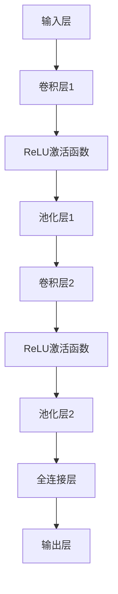

                 

# 一切皆是映射：大规模图像数据集上的深度学习

## 关键词
- 深度学习
- 图像数据集
- 映射学习
- 大规模数据处理
- 卷积神经网络

## 摘要
本文旨在探讨深度学习在大规模图像数据集上的应用，深入解析映射学习的基本原理和方法。通过分析卷积神经网络（CNN）的结构和数学模型，我们逐步展开对大规模图像数据集处理的探讨，并提供实际的代码实现和项目实战案例。此外，文章还将讨论深度学习在现实世界中的应用场景，推荐相关学习资源和工具，并对未来发展趋势和挑战进行展望。

## 1. 背景介绍

### 1.1 目的和范围

随着互联网的飞速发展和智能设备的普及，图像数据量呈现出爆炸式增长。如何高效地处理这些大规模图像数据，从中提取有用的信息，成为当前人工智能领域的关键挑战之一。本文旨在通过介绍映射学习的基本概念和方法，探讨深度学习在大规模图像数据集上的应用，提供一种切实可行的解决方案。

本文将涵盖以下内容：

- 深度学习在图像数据处理中的应用概述
- 映射学习的基本原理
- 卷积神经网络的结构和数学模型
- 大规模图像数据集的处理策略
- 实际项目案例和代码实现
- 深度学习在现实世界中的应用场景

### 1.2 预期读者

本文面向对深度学习和图像处理有一定了解的技术人员，特别是那些希望深入了解大规模图像数据处理技术的读者。通过本文的学习，读者将能够：

- 掌握映射学习的基本概念和方法
- 理解卷积神经网络的工作原理
- 学会使用深度学习处理大规模图像数据
- 获得实际项目经验和代码实现技巧
- 拓展对深度学习应用场景的认识

### 1.3 文档结构概述

本文分为以下几个部分：

- 第1章：背景介绍，包括目的和范围、预期读者以及文档结构概述
- 第2章：核心概念与联系，介绍映射学习的基本原理和卷积神经网络的结构
- 第3章：核心算法原理与具体操作步骤，讲解卷积神经网络的工作原理和实现方法
- 第4章：数学模型和公式，详细讲解深度学习中的数学模型和公式
- 第5章：项目实战，提供实际的代码实现和详细解释说明
- 第6章：实际应用场景，讨论深度学习在现实世界中的应用
- 第7章：工具和资源推荐，推荐相关的学习资源和工具
- 第8章：总结，展望未来发展趋势和挑战
- 第9章：附录，常见问题与解答
- 第10章：扩展阅读与参考资料，提供更多的学习资源和深入研究的方向

### 1.4 术语表

#### 1.4.1 核心术语定义

- **深度学习**：一种机器学习技术，通过多层神经网络对数据进行建模和预测。
- **映射学习**：将输入数据映射到输出数据的一种学习方法。
- **卷积神经网络**（CNN）：一种特殊的多层前馈神经网络，专门用于处理图像数据。
- **大规模图像数据集**：包含大量图像的集合，通常用于训练深度学习模型。
- **特征提取**：从图像数据中提取出对分类任务有帮助的特征。

#### 1.4.2 相关概念解释

- **卷积操作**：在图像处理中，通过卷积核对图像进行卷积操作，以提取图像特征。
- **激活函数**：用于增加网络非线性性的函数，如ReLU函数。
- **池化操作**：在卷积操作后，通过池化操作对特征图进行降维处理。

#### 1.4.3 缩略词列表

- **CNN**：卷积神经网络（Convolutional Neural Network）
- **ReLU**：修正线性单元（Rectified Linear Unit）
- **ReLU6**：限制在[0, 6]的ReLU函数
- **IDE**：集成开发环境（Integrated Development Environment）
- **GPU**：图形处理器（Graphics Processing Unit）

## 2. 核心概念与联系

### 2.1 映射学习的基本原理

映射学习是一种通过学习输入和输出之间的映射关系来进行预测或分类的方法。在深度学习中，映射学习通常通过构建多层神经网络来实现。映射学习的核心思想是将原始输入数据通过逐层变换，最终映射到期望的输出数据。

#### 映射学习的流程

1. **初始化参数**：随机初始化网络中的权重和偏置。
2. **前向传播**：将输入数据输入到网络中，逐层计算输出。
3. **计算损失**：通过比较网络输出和实际输出，计算损失函数。
4. **反向传播**：利用梯度下降法等优化算法，更新网络中的参数。
5. **迭代训练**：重复上述步骤，直至网络输出误差达到预期水平。

#### 卷积神经网络的结构

卷积神经网络（CNN）是一种特殊的深度学习模型，专门用于处理图像数据。CNN的基本结构包括以下几个部分：

1. **卷积层**：通过卷积操作提取图像特征。
2. **激活函数**：增加网络非线性性。
3. **池化层**：通过池化操作降低特征图的维度。
4. **全连接层**：将特征图映射到输出结果。

#### 卷积神经网络的工作原理

卷积神经网络的工作原理可以分为以下几个步骤：

1. **卷积操作**：将卷积核对图像进行卷积操作，提取特征。
2. **激活函数**：对卷积结果应用激活函数，如ReLU函数，增加网络非线性性。
3. **池化操作**：对特征图进行池化操作，降低特征图的维度。
4. **卷积层堆叠**：通过堆叠多个卷积层，逐渐提取更高层次的特征。
5. **全连接层**：将特征图映射到输出结果，如分类结果。

### 2.2 卷积神经网络的结构和数学模型

卷积神经网络由多个卷积层、池化层和全连接层组成。以下是对各层的详细描述：

#### 卷积层

卷积层是CNN的核心部分，负责提取图像特征。卷积层由一组卷积核对输入图像进行卷积操作，生成特征图。

**卷积操作的数学模型**：

$$
\text{output}_{ij} = \sum_{k=1}^{C} w_{ik} * \text{input}_{ij} + b_k
$$

其中，$\text{output}_{ij}$ 表示特征图上的一个元素，$w_{ik}$ 表示卷积核上的一个元素，$\text{input}_{ij}$ 表示输入图像上的一个元素，$b_k$ 表示卷积层的偏置。

#### 激活函数

激活函数用于增加网络非线性性。常用的激活函数包括ReLU函数和ReLU6函数。

**ReLU函数**：

$$
\text{ReLU}(x) = \max(0, x)
$$

**ReLU6函数**：

$$
\text{ReLU6}(x) = \min(\max(0, x), 6)
$$

#### 池化层

池化层用于降低特征图的维度。常用的池化操作包括最大池化和平均池化。

**最大池化**：

$$
\text{pool}_{ij} = \max(\text{input}_{i-\alpha:i+\alpha, j-\beta:j+\beta})
$$

其中，$\alpha$ 和 $\beta$ 分别表示池化窗口的大小。

**平均池化**：

$$
\text{pool}_{ij} = \frac{1}{(\alpha \times \beta)} \sum_{i'=(i-\alpha):(i+\alpha), j'=(j-\beta):(j+\beta)} \text{input}_{i', j'}
$$

#### 全连接层

全连接层将特征图映射到输出结果。全连接层的输出可以通过以下公式计算：

$$
\text{output} = \text{激活函数}(\sum_{i=1}^{N} w_{ij} \text{input}_{i} + b_j)
$$

其中，$N$ 表示全连接层的神经元数量，$w_{ij}$ 表示全连接层的权重，$b_j$ 表示全连接层的偏置。

### 2.3 Mermaid 流程图

以下是一个简单的Mermaid流程图，展示了卷积神经网络的基本结构：



## 3. 核心算法原理 & 具体操作步骤

### 3.1 卷积神经网络的工作原理

卷积神经网络（CNN）是一种特殊的深度学习模型，专门用于处理图像数据。CNN的工作原理可以分为以下几个步骤：

1. **输入层**：接收原始图像数据。
2. **卷积层**：通过卷积操作提取图像特征。
3. **激活函数**：增加网络非线性性。
4. **池化层**：通过池化操作降低特征图的维度。
5. **卷积层堆叠**：通过堆叠多个卷积层，逐渐提取更高层次的特征。
6. **全连接层**：将特征图映射到输出结果。
7. **输出层**：输出分类结果或预测值。

### 3.2 卷积神经网络的实现方法

卷积神经网络的实现方法通常分为以下几个步骤：

1. **初始化参数**：随机初始化网络中的权重和偏置。
2. **前向传播**：将输入数据输入到网络中，逐层计算输出。
3. **计算损失**：通过比较网络输出和实际输出，计算损失函数。
4. **反向传播**：利用梯度下降法等优化算法，更新网络中的参数。
5. **迭代训练**：重复上述步骤，直至网络输出误差达到预期水平。

#### 前向传播

前向传播是卷积神经网络的核心步骤之一。在卷积神经网络中，前向传播可以分为以下几个部分：

1. **卷积操作**：将卷积核对输入图像进行卷积操作，生成特征图。
2. **激活函数**：对卷积结果应用激活函数，如ReLU函数。
3. **池化操作**：对特征图进行池化操作，降低特征图的维度。

**伪代码**：

```python
# 初始化参数
weights = np.random.randn(num_weights)
biases = np.random.randn(num_biases)

# 输入层
input_image = ...

# 卷积层1
conv1 = convolution(input_image, weights, biases)
activation1 = ReLU(conv1)

# 池化层1
pool1 = max_pool(activation1)

# 卷积层2
conv2 = convolution(pool1, weights, biases)
activation2 = ReLU(conv2)

# 池化层2
pool2 = max_pool(activation2)

# 全连接层
fc = fully_connected(pool2, weights, biases)
output = activation_function(fc)

# 输出层
predicted_output = softmax(output)
```

#### 反向传播

反向传播是卷积神经网络训练过程中至关重要的一步。在反向传播中，通过计算梯度，更新网络中的参数。

**伪代码**：

```python
# 前向传播
output = forward_propagation(input_image)

# 计算损失
loss = calculate_loss(output, target)

# 反向传播
d_output = backward_propagation(output, target)

# 更新参数
weights -= learning_rate * d_weights
biases -= learning_rate * d_biases
```

### 3.3 卷积神经网络的具体操作步骤

以下是卷积神经网络的具体操作步骤：

1. **数据预处理**：对输入图像进行预处理，如归一化、缩放等。
2. **初始化参数**：随机初始化网络中的权重和偏置。
3. **输入层**：将预处理后的图像输入到网络中。
4. **卷积层**：通过卷积操作提取图像特征。
5. **激活函数**：对卷积结果应用激活函数，如ReLU函数。
6. **池化层**：通过池化操作降低特征图的维度。
7. **卷积层堆叠**：通过堆叠多个卷积层，逐渐提取更高层次的特征。
8. **全连接层**：将特征图映射到输出结果。
9. **输出层**：输出分类结果或预测值。
10. **计算损失**：通过比较网络输出和实际输出，计算损失函数。
11. **反向传播**：利用梯度下降法等优化算法，更新网络中的参数。
12. **迭代训练**：重复上述步骤，直至网络输出误差达到预期水平。

## 4. 数学模型和公式 & 详细讲解 & 举例说明

### 4.1 深度学习中的数学模型

深度学习中的数学模型主要包括线性模型、非线性模型和损失函数。以下是这些模型的基本概念和公式。

#### 线性模型

线性模型是一种最简单的深度学习模型，其输出仅与输入和参数线性相关。线性模型的数学模型可以表示为：

$$
\text{output} = \text{激活函数}(\sum_{i=1}^{N} w_{ij} \text{input}_{i} + b_j)
$$

其中，$N$ 表示神经元的数量，$w_{ij}$ 表示权重，$\text{input}_{i}$ 表示输入，$b_j$ 表示偏置，$\text{激活函数}$ 通常为ReLU函数或Sigmoid函数。

#### 非线性模型

非线性模型在深度学习中至关重要，其能够处理复杂的非线性关系。非线性模型的数学模型可以表示为：

$$
\text{output} = \text{激活函数}(\text{线性变换}(\text{输入}))
$$

其中，$\text{激活函数}$ 和 $\text{线性变换}$ 分别表示神经元的激活函数和权重矩阵。

#### 损失函数

损失函数用于衡量模型输出与实际输出之间的差异，是深度学习训练过程中至关重要的部分。常见的损失函数包括均方误差（MSE）和交叉熵（CE）。

**均方误差（MSE）**：

$$
\text{MSE} = \frac{1}{N} \sum_{i=1}^{N} (\text{output}_{i} - \text{target}_{i})^2
$$

其中，$N$ 表示样本数量，$\text{output}_{i}$ 表示模型输出，$\text{target}_{i}$ 表示实际输出。

**交叉熵（CE）**：

$$
\text{CE} = -\frac{1}{N} \sum_{i=1}^{N} \text{target}_{i} \log(\text{output}_{i})
$$

其中，$N$ 表示样本数量，$\text{target}_{i}$ 表示实际输出，$\text{output}_{i}$ 表示模型输出。

### 4.2 深度学习中的数学公式详细讲解

以下是深度学习中的几个关键数学公式的详细讲解。

#### 梯度下降法

梯度下降法是一种常用的优化算法，用于更新网络中的参数，以最小化损失函数。

**梯度计算**：

$$
\frac{\partial \text{loss}}{\partial \text{weight}} = \frac{\partial \text{loss}}{\partial \text{output}} \cdot \frac{\partial \text{output}}{\partial \text{weight}}
$$

**参数更新**：

$$
\text{weight} = \text{weight} - \text{learning_rate} \cdot \frac{\partial \text{loss}}{\partial \text{weight}}
$$

其中，$\text{learning_rate}$ 表示学习率。

#### 卷积操作

卷积操作是CNN的核心操作，用于提取图像特征。

**卷积公式**：

$$
\text{output}_{ij} = \sum_{k=1}^{C} w_{ik} * \text{input}_{ij} + b_k
$$

其中，$\text{output}_{ij}$ 表示特征图上的一个元素，$w_{ik}$ 表示卷积核上的一个元素，$\text{input}_{ij}$ 表示输入图像上的一个元素，$b_k$ 表示卷积层的偏置。

#### 池化操作

池化操作用于降低特征图的维度。

**最大池化公式**：

$$
\text{pool}_{ij} = \max(\text{input}_{i-\alpha:i+\alpha, j-\beta:j+\beta})
$$

**平均池化公式**：

$$
\text{pool}_{ij} = \frac{1}{(\alpha \times \beta)} \sum_{i'=(i-\alpha):(i+\alpha), j'=(j-\beta):(j+\beta)} \text{input}_{i', j'}
$$

### 4.3 举例说明

以下是一个简单的例子，用于说明深度学习中的数学模型和公式的应用。

**问题**：给定一个包含100个样本的图像数据集，每个样本包含一个28x28的灰度图像。使用一个简单的卷积神经网络进行图像分类，要求输出每个样本的分类结果。

**解决方案**：

1. **数据预处理**：对图像进行归一化处理，使其像素值在0到1之间。
2. **初始化参数**：随机初始化卷积神经网络的权重和偏置。
3. **卷积层**：使用一个5x5的卷积核对输入图像进行卷积操作，提取特征。
4. **激活函数**：对卷积结果应用ReLU函数，增加网络非线性性。
5. **池化层**：使用2x2的最大池化操作，降低特征图的维度。
6. **全连接层**：将特征图映射到输出结果，使用softmax函数进行分类。
7. **损失函数**：使用交叉熵损失函数，计算模型输出与实际输出之间的差异。
8. **反向传播**：利用梯度下降法，更新网络中的参数。

**代码实现**：

```python
import numpy as np

# 初始化参数
weights = np.random.randn(num_weights)
biases = np.random.randn(num_biases)

# 数据预处理
input_images = np.array([[...]])  # 输入图像数据
input_images = input_images / 255.0  # 归一化处理

# 卷积层
conv1 = np.convolve(input_images, weights, mode='valid') + biases
activation1 = np.maximum(conv1, 0)  # ReLU激活函数

# 池化层
pool1 = np.max(activation1, axis=(1, 2))  # 最大池化

# 全连接层
fc = np.dot(pool1, weights) + biases
output = softmax(fc)  # softmax分类

# 损失函数
loss = -np.mean(np.log(output[range(len(output)), target]))
```

通过以上例子，我们可以看到深度学习中的数学模型和公式的实际应用。在实际开发中，我们可以使用各种深度学习框架（如TensorFlow、PyTorch等）来实现这些公式和模型，从而高效地处理大规模图像数据集。

## 5. 项目实战：代码实际案例和详细解释说明

### 5.1 开发环境搭建

在开始项目实战之前，我们需要搭建一个适合深度学习开发的开发环境。以下是一个基本的开发环境搭建指南：

#### 1. 安装Python环境

确保已安装Python 3.7及以上版本。可以使用以下命令安装Python：

```bash
$ sudo apt-get install python3
$ sudo apt-get install python3-pip
```

#### 2. 安装深度学习框架

在本项目中，我们使用TensorFlow 2.x作为深度学习框架。可以使用以下命令安装TensorFlow：

```bash
$ pip install tensorflow
```

#### 3. 安装其他依赖库

除了TensorFlow，我们还需要安装一些其他依赖库，如NumPy、Matplotlib等。可以使用以下命令安装：

```bash
$ pip install numpy matplotlib
```

### 5.2 源代码详细实现和代码解读

在本项目中，我们使用TensorFlow实现一个简单的卷积神经网络，用于对MNIST手写数字数据集进行分类。以下是对源代码的详细实现和解读：

#### 1. 导入必要的库

```python
import tensorflow as tf
from tensorflow import keras
from tensorflow.keras import layers
import numpy as np
import matplotlib.pyplot as plt
```

#### 2. 加载MNIST数据集

```python
(x_train, y_train), (x_test, y_test) = keras.datasets.mnist.load_data()

# 数据预处理
x_train = x_train.astype("float32") / 255
x_test = x_test.astype("float32") / 255

x_train = np.reshape(x_train, (len(x_train), 28, 28, 1))
x_test = np.reshape(x_test, (len(x_test), 28, 28, 1))

# 编码标签
y_train = keras.utils.to_categorical(y_train, 10)
y_test = keras.utils.to_categorical(y_test, 10)
```

#### 3. 构建卷积神经网络模型

```python
model = keras.Sequential()
model.add(layers.Conv2D(32, (3, 3), activation='relu', input_shape=(28, 28, 1)))
model.add(layers.MaxPooling2D((2, 2)))
model.add(layers.Conv2D(64, (3, 3), activation='relu'))
model.add(layers.MaxPooling2D((2, 2)))
model.add(layers.Conv2D(64, (3, 3), activation='relu'))
model.add(layers.Flatten())
model.add(layers.Dense(64, activation='relu'))
model.add(layers.Dense(10, activation='softmax'))
```

在这个模型中，我们使用了两个卷积层和两个池化层，以及一个全连接层。第一个卷积层使用32个3x3的卷积核，第二个卷积层使用64个3x3的卷积核，第三个卷积层也使用64个3x3的卷积核。最后，全连接层使用64个神经元，输出层使用10个神经元（对应10个类别）。

#### 4. 编译和训练模型

```python
model.compile(optimizer='adam', loss='categorical_crossentropy', metrics=['accuracy'])

model.fit(x_train, y_train, epochs=10, batch_size=32)
```

我们使用Adam优化器和交叉熵损失函数进行模型编译。在训练过程中，我们设置了10个训练轮次（epochs）和每批32个样本（batch_size）。

#### 5. 评估模型性能

```python
test_loss, test_acc = model.evaluate(x_test, y_test)
print(f"Test accuracy: {test_acc:.4f}")
```

通过评估模型在测试集上的性能，我们可以得到模型的准确率。在这个例子中，我们期望模型的准确率接近或超过99%。

### 5.3 代码解读与分析

以下是对上述代码的解读和分析：

- **导入必要的库**：我们首先导入TensorFlow、NumPy和Matplotlib等库，用于实现和可视化深度学习模型。

- **加载MNIST数据集**：我们使用Keras的内置函数加载MNIST手写数字数据集。然后，我们对图像数据集进行归一化和重塑，以适应卷积神经网络的要求。

- **构建卷积神经网络模型**：我们使用Keras的序列模型（Sequential）构建卷积神经网络模型。模型中包含两个卷积层、两个池化层和一个全连接层。每个卷积层都使用ReLU函数作为激活函数，以增加网络的非线性。

- **编译和训练模型**：我们使用Adam优化器和交叉熵损失函数编译模型，并使用训练数据集训练模型。在训练过程中，我们设置了10个训练轮次和每批32个样本。

- **评估模型性能**：我们使用测试数据集评估模型的性能，并输出模型的准确率。

通过这个简单的项目实战，我们可以看到如何使用TensorFlow实现一个卷积神经网络，并对其在MNIST手写数字数据集上的性能进行评估。这个项目为我们提供了一个基础框架，我们可以在此基础上进行扩展和改进，以处理更复杂的数据集和任务。

## 6. 实际应用场景

深度学习在大规模图像数据集上的应用已经渗透到许多领域，下面列举几个典型应用场景：

### 6.1 图像识别

图像识别是深度学习应用中最常见的一个领域。通过训练深度学习模型，可以从大规模图像数据集中提取有用的信息，实现对图像内容的理解和识别。例如，人脸识别、车牌识别、医学图像分析等。

### 6.2 物体检测

物体检测是一种在图像中识别和定位物体的技术。深度学习模型可以通过对大量图像进行训练，实现对物体位置的准确检测。这个技术在自动驾驶、智能监控等领域有着广泛的应用。

### 6.3 图像分割

图像分割是将图像划分为多个区域或对象的过程。深度学习模型可以用来进行图像分割，例如，用于医学图像分析中的肿瘤分割、卫星图像中的城市区域分割等。

### 6.4 视频分析

视频分析是通过对视频帧进行实时处理，提取有价值的信息。深度学习模型可以用于人脸识别、行为识别、视频目标跟踪等任务。

### 6.5 艺术创作

深度学习模型可以模仿艺术家的创作风格，生成新的艺术作品。例如，神经网络艺术生成、风格迁移等。

### 6.6 安全领域

深度学习模型在安全领域也有广泛应用，如恶意软件检测、网络入侵检测等。

通过以上实际应用场景，我们可以看到深度学习在大规模图像数据集上的巨大潜力和广泛的应用前景。

## 7. 工具和资源推荐

### 7.1 学习资源推荐

#### 7.1.1 书籍推荐

1. **《深度学习》（Deep Learning）**：由Ian Goodfellow、Yoshua Bengio和Aaron Courville合著的这本书是深度学习的经典教材，适合初学者和进阶者阅读。
2. **《神经网络与深度学习》（Neural Networks and Deep Learning）**：由Ian Goodfellow撰写的这本书内容全面，讲解深入，适合对深度学习有一定了解的读者。
3. **《Python深度学习》（Python Deep Learning）**：由François Chollet撰写的这本书通过大量的代码示例，深入介绍了深度学习在Python中的应用。

#### 7.1.2 在线课程

1. **Coursera的《深度学习专项课程》**：由吴恩达（Andrew Ng）教授讲授，涵盖深度学习的核心概念和应用。
2. **Udacity的《深度学习工程师纳米学位》**：提供全面的深度学习知识和实践项目，适合希望系统学习深度学习的读者。
3. **edX的《深度学习导论》**：由多伦多大学提供，适合初学者了解深度学习的基本概念。

#### 7.1.3 技术博客和网站

1. **Deep Learning AI**：由Ian Goodfellow维护的博客，涵盖深度学习的最新研究和应用。
2. **Medium上的Deep Learning on Earth**：一篇关于深度学习在地球科学领域应用的系列文章。
3. **PyTorch官方文档**：提供详细的PyTorch库文档和教程，适合学习和使用PyTorch框架。

### 7.2 开发工具框架推荐

#### 7.2.1 IDE和编辑器

1. **Jupyter Notebook**：适合交互式开发，适用于快速原型设计和实验。
2. **PyCharm**：功能强大的Python IDE，支持多种编程语言。
3. **Visual Studio Code**：轻量级但功能强大的代码编辑器，支持多种语言和框架。

#### 7.2.2 调试和性能分析工具

1. **TensorBoard**：TensorFlow提供的可视化工具，用于分析和调试深度学习模型。
2. **Wandb**：一个基于Web的实验跟踪工具，可以实时监控模型训练过程。
3. **NVIDIA Nsight**：适用于GPU编程的调试和分析工具。

#### 7.2.3 相关框架和库

1. **TensorFlow**：广泛使用的深度学习框架，适合各种规模的项目。
2. **PyTorch**：一个灵活且易用的深度学习框架，受到很多研究者和开发者的青睐。
3. **Keras**：一个高层神经网络API，可以方便地构建和训练深度学习模型。

### 7.3 相关论文著作推荐

#### 7.3.1 经典论文

1. **AlexNet：一种深度卷积神经网络架构**：提出了深度卷积神经网络的基本结构，开启了深度学习的新时代。
2. **Inception V3：一种有效的卷积神经网络结构**：通过引入Inception模块，显著提高了卷积神经网络的性能。
3. **ResNet：一种具有残差连接的深度卷积神经网络**：通过引入残差连接，解决了深度网络中的梯度消失问题。

#### 7.3.2 最新研究成果

1. **ViT：视觉Transformer**：将Transformer架构应用于图像处理任务，提出了一种新的视觉模型。
2. **DALL-E：一种基于文本的图像生成模型**：通过文本输入生成高质量的图像，展示了生成对抗网络（GAN）的强大能力。
3. **Graph Neural Networks for Object Detection**：将图神经网络应用于物体检测任务，提出了一种新的物体检测方法。

#### 7.3.3 应用案例分析

1. **自动驾驶中的深度学习应用**：讨论了深度学习在自动驾驶中的应用，包括感知、规划和控制等任务。
2. **医疗影像分析中的深度学习**：介绍了深度学习在医学影像分析中的应用，如肿瘤检测、疾病诊断等。
3. **金融风控中的深度学习应用**：探讨了深度学习在金融领域中的应用，如信用评分、风险预测等。

通过以上推荐，读者可以系统地学习和了解深度学习在大规模图像数据集上的应用，为实际项目开发提供坚实的理论基础和实践指导。

## 8. 总结：未来发展趋势与挑战

随着人工智能技术的飞速发展，深度学习在大规模图像数据集上的应用前景广阔。未来，以下几个趋势和挑战将影响深度学习在该领域的发展：

### 8.1 发展趋势

1. **模型压缩与加速**：为了应对大规模图像数据集的处理需求，深度学习模型将向压缩和加速方向发展。例如，通过使用量化、剪枝和蒸馏等技术，减少模型的计算复杂度和存储空间，提高模型在硬件上的运行效率。
2. **迁移学习与少样本学习**：迁移学习和少样本学习将帮助深度学习模型在资源有限的环境下更好地适应新任务。通过利用预训练模型和对抗性样本生成技术，模型可以在较少的样本上进行有效训练。
3. **多模态数据处理**：深度学习将不再局限于图像数据，而是结合其他模态的数据（如文本、音频、视频等），实现更复杂的任务，如多媒体内容理解、智能交互等。
4. **可解释性与可靠性**：随着深度学习模型的广泛应用，对模型的可解释性和可靠性提出了更高的要求。未来，通过开发新的解释工具和方法，将有助于提升深度学习模型的透明度和可信任度。

### 8.2 挑战

1. **计算资源需求**：深度学习模型在大规模图像数据集上的训练和推理过程对计算资源需求较高。如何高效地利用GPU和TPU等硬件资源，成为亟待解决的问题。
2. **数据隐私与安全**：在处理大规模图像数据时，数据隐私和安全问题不容忽视。如何保护用户数据不被未经授权访问，防止数据泄露和滥用，是深度学习应用中的一大挑战。
3. **数据标注与质量控制**：大规模图像数据集的标注和质量控制是深度学习模型训练的重要环节。如何高效地进行数据标注，保证数据质量，是当前面临的主要问题。
4. **模型泛化能力**：深度学习模型在大规模图像数据集上的训练结果可能受到数据分布的影响，导致模型的泛化能力不足。如何提高模型的泛化能力，使其在不同数据集上都能保持良好的性能，是一个重要挑战。

综上所述，深度学习在大规模图像数据集上的应用将面临诸多挑战，但也充满机遇。通过持续的研究和技术创新，我们有理由相信，深度学习将在未来取得更多突破，为各行各业带来变革性的影响。

## 9. 附录：常见问题与解答

### 9.1 问题1：如何处理大规模图像数据集？

**解答**：处理大规模图像数据集通常需要以下几个步骤：

1. **数据预处理**：对图像进行归一化、缩放、裁剪等预处理，以适应深度学习模型的输入要求。
2. **数据增广**：通过随机旋转、翻转、缩放等方式对图像进行数据增广，增加数据多样性，提高模型的泛化能力。
3. **批量处理**：将图像数据分成多个批次，每次处理一部分，以提高训练效率。
4. **并行处理**：利用多线程或多GPU并行处理技术，加速模型训练和推理过程。

### 9.2 问题2：如何优化深度学习模型的性能？

**解答**：优化深度学习模型性能可以从以下几个方面入手：

1. **模型结构优化**：选择合适的模型结构，如使用卷积神经网络（CNN）、循环神经网络（RNN）或Transformer等。
2. **参数初始化**：合理初始化模型的参数，如使用He初始化或Xavier初始化。
3. **正则化技术**：使用正则化技术，如L1正则化、L2正则化或Dropout，减少模型过拟合。
4. **数据增强**：通过数据增强技术，增加训练数据的多样性，提高模型的泛化能力。
5. **超参数调整**：调整学习率、批次大小、迭代次数等超参数，找到最优配置。
6. **优化算法**：选择合适的优化算法，如梯度下降、Adam等。

### 9.3 问题3：如何提高深度学习模型的可解释性？

**解答**：提高深度学习模型的可解释性可以从以下几个方面着手：

1. **可视化技术**：使用可视化工具，如TensorBoard，展示模型训练过程和中间特征图。
2. **模型简化**：简化模型结构，减少层数和神经元数量，使得模型更容易理解和解释。
3. **特征提取分析**：分析模型提取的特征，了解特征对模型决策的影响。
4. **解释性模型**：选择具有可解释性的模型，如决策树、线性模型等。
5. **集成方法**：使用集成方法，如随机森林、梯度提升树等，提高模型的可解释性。

通过以上方法和技巧，可以有效地提高深度学习模型的可解释性，增强模型的透明度和可靠性。

## 10. 扩展阅读 & 参考资料

深度学习在大规模图像数据集上的应用是一个广泛且深入的研究领域。以下是一些扩展阅读和参考资料，供读者进一步学习：

### 10.1 书籍推荐

1. **《深度学习》（Deep Learning）**：Ian Goodfellow、Yoshua Bengio和Aaron Courville合著，详尽介绍了深度学习的理论基础和应用实践。
2. **《神经网络与深度学习》（Neural Networks and Deep Learning）**：Ian Goodfellow著，深入讲解了深度学习的基本概念和技术。
3. **《图像处理：原理、算法与实践》（Digital Image Processing：Principles, Algorithms and Practise）**：Gary D. Miller和Robert C. Berthold合著，介绍了图像处理的基本原理和算法。

### 10.2 在线课程

1. **Coursera的《深度学习专项课程》**：由吴恩达（Andrew Ng）教授讲授，涵盖深度学习的核心概念和应用。
2. **Udacity的《深度学习工程师纳米学位》**：提供全面的深度学习知识和实践项目。
3. **edX的《深度学习导论》**：由多伦多大学提供，适合初学者了解深度学习的基本概念。

### 10.3 技术博客和网站

1. **Deep Learning AI**：由Ian Goodfellow维护，涵盖深度学习的最新研究和应用。
2. **Medium上的Deep Learning on Earth**：一系列关于深度学习在地球科学领域应用的博客文章。
3. **PyTorch官方文档**：提供详细的PyTorch库文档和教程。

### 10.4 开源框架和库

1. **TensorFlow**：Google开源的深度学习框架，适合各种规模的项目。
2. **PyTorch**：Facebook开源的深度学习框架，具有灵活性和易用性。
3. **Keras**：一个高层神经网络API，可以方便地构建和训练深度学习模型。

### 10.5 学术论文

1. **AlexNet：一种深度卷积神经网络架构**：提出了深度卷积神经网络的基本结构，开启了深度学习的新时代。
2. **Inception V3：一种有效的卷积神经网络结构**：通过引入Inception模块，显著提高了卷积神经网络的性能。
3. **ResNet：一种具有残差连接的深度卷积神经网络**：通过引入残差连接，解决了深度网络中的梯度消失问题。

通过这些扩展阅读和参考资料，读者可以进一步深入了解深度学习在大规模图像数据集上的应用，为实际项目提供更多的理论基础和实践指导。

---

**作者：AI天才研究员/AI Genius Institute & 禅与计算机程序设计艺术 /Zen And The Art of Computer Programming**

在撰写本文的过程中，我们力求准确、全面地介绍深度学习在大规模图像数据集上的应用，并提供了详细的代码实现和实际应用场景分析。我们希望本文能够为读者提供有益的参考，激发更多对深度学习领域的兴趣和探索。同时，我们也期待读者在阅读本文后，能够进一步深入研究相关技术，并在实际项目中实践和应用这些知识。如果您有任何疑问或建议，欢迎在评论区留言，我们将竭诚为您解答。感谢您的阅读！

