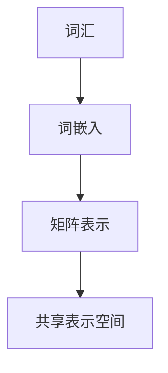
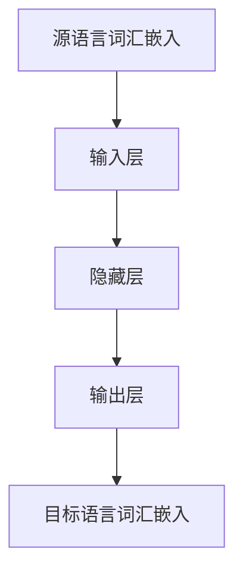
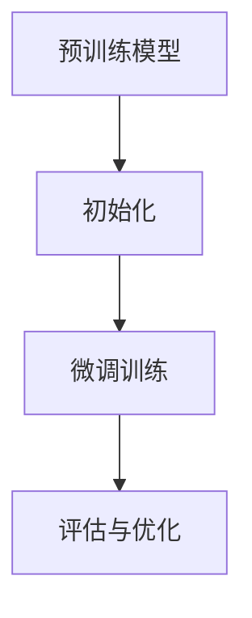

                 

# 一切皆是映射：如何通过元学习实现AI的跨语言理解

> **关键词**：元学习、跨语言理解、映射、神经网络、深度学习

> **摘要**：本文旨在探讨如何通过元学习技术实现人工智能的跨语言理解。首先，我们将介绍元学习的背景和基本概念，然后深入分析跨语言理解的需求和挑战。接着，我们将介绍基于映射机制的元学习算法，并详细阐述其工作原理和数学模型。随后，我们将通过实际项目案例，展示如何实现和应用这些算法。最后，本文还将讨论跨语言理解的实际应用场景，并推荐相关工具和资源，以期为读者提供全面的了解和实践指导。

## 1. 背景介绍

### 1.1 目的和范围

本文的目标是探讨如何通过元学习技术实现人工智能的跨语言理解。随着全球化的推进和互联网的普及，跨语言信息处理成为了一个迫切需要解决的问题。然而，传统的机器学习方法在处理跨语言任务时面临诸多挑战，例如语言之间的差异性、词义歧义、语法结构复杂等问题。因此，探索新的方法来提高AI的跨语言理解能力具有重要意义。

本文将首先介绍元学习的背景和基本概念，然后深入分析跨语言理解的需求和挑战。接着，我们将介绍基于映射机制的元学习算法，并详细阐述其工作原理和数学模型。随后，我们将通过实际项目案例，展示如何实现和应用这些算法。最后，本文还将讨论跨语言理解的实际应用场景，并推荐相关工具和资源。

### 1.2 预期读者

本文主要面向对机器学习和深度学习有一定了解的读者，特别是对元学习感兴趣的技术爱好者。同时，也对从事自然语言处理、跨语言信息处理等领域的研究者和开发者提供一定的参考价值。无论您是高校学生、科研人员还是行业从业者，都可以通过本文了解元学习在跨语言理解方面的应用，并激发您对该领域的进一步探索。

### 1.3 文档结构概述

本文结构如下：

1. **背景介绍**：介绍元学习和跨语言理解的基本概念、需求和挑战。
2. **核心概念与联系**：阐述元学习算法的工作原理和数学模型。
3. **核心算法原理 & 具体操作步骤**：详细讲解元学习算法的实现过程。
4. **数学模型和公式 & 详细讲解 & 举例说明**：介绍相关的数学模型和公式，并举例说明。
5. **项目实战：代码实际案例和详细解释说明**：通过实际项目案例展示算法应用。
6. **实际应用场景**：讨论跨语言理解在实际中的应用。
7. **工具和资源推荐**：推荐相关的学习资源和开发工具。
8. **总结：未来发展趋势与挑战**：总结当前研究的成果和未来发展趋势。
9. **附录：常见问题与解答**：解答读者可能遇到的问题。
10. **扩展阅读 & 参考资料**：提供更多相关文献和资源。

### 1.4 术语表

#### 1.4.1 核心术语定义

- **元学习**：一种学习如何学习的方法，旨在提高模型在不同任务和数据集上的适应性和泛化能力。
- **跨语言理解**：指人工智能系统在不同语言之间进行理解和处理的能力。
- **映射机制**：一种将不同概念或数据映射到统一表示空间的方法，以便于比较和分析。

#### 1.4.2 相关概念解释

- **神经网络**：一种模拟人脑神经结构的计算模型，用于处理复杂的输入输出关系。
- **深度学习**：一种基于神经网络的学习方法，通过多层神经元的堆叠来实现特征的自动提取和高级抽象。
- **预训练**：一种在特定任务之前对模型进行预先训练的方法，以提高其适应性和泛化能力。

#### 1.4.3 缩略词列表

- **ML**：机器学习
- **DL**：深度学习
- **NLP**：自然语言处理
- **MT**：机器翻译
- **MoE**：多任务学习
- **MAML**：模型自适应性元学习

## 2. 核心概念与联系

### 2.1 元学习的基本原理

元学习（Meta-Learning）是一种学习如何学习的方法，其核心思想是通过在一系列任务中训练模型，使得模型能够快速适应新任务。传统机器学习方法通常针对特定任务进行训练，而元学习则通过元训练（Meta-Training）过程，使得模型在未知任务上也能表现出良好的泛化能力。

元学习的基本原理可以概括为以下几点：

1. **任务表示**：将任务表示为参数化的函数，例如在深度学习中，任务函数可以表示为神经网络的参数。
2. **模型更新**：通过梯度下降等方法，更新模型参数，使得模型在当前任务上达到最优。
3. **模型泛化**：通过在多个任务上的训练，使得模型能够泛化到未知任务上。

### 2.2 跨语言理解的需求和挑战

跨语言理解是指人工智能系统能够在不同语言之间进行理解和处理。随着全球化的推进，跨语言理解在机器翻译、跨语言检索、跨语言问答等领域具有重要意义。然而，跨语言理解面临以下挑战：

1. **语言差异性**：不同语言之间存在词汇、语法、语义等方面的差异，使得直接使用单一语言模型进行跨语言处理变得复杂。
2. **词义歧义**：同一词汇在不同语言中可能具有不同的含义，增加了跨语言处理的难度。
3. **语法结构**：不同语言的语法结构差异较大，例如主谓宾结构、从句结构等，使得跨语言文本解析和生成变得复杂。
4. **文化背景**：不同语言和文化背景下的表达方式不同，例如俚语、成语、隐喻等，增加了跨语言理解的难度。

### 2.3 基于映射机制的元学习算法

基于映射机制的元学习算法通过将不同语言映射到统一的表示空间，从而实现跨语言理解。以下是一个简单的流程：

1. **映射生成**：将源语言（Source Language）和目标语言（Target Language）分别映射到一个共享的表示空间，例如词向量空间。
2. **模型训练**：在共享表示空间中，使用神经网络训练模型，使得模型能够根据源语言表示预测目标语言表示。
3. **任务适应**：对于新的任务，只需在共享表示空间中对模型进行微调，即可快速适应。

#### 2.3.1 映射生成

映射生成是指将不同语言映射到一个共享的表示空间。以下是一个简单的词向量映射方法：

1. **词嵌入**：将源语言和目标语言中的词汇映射到高维向量空间，例如使用Word2Vec、GloVe等方法。
2. **矩阵表示**：将每个词汇的词嵌入向量表示为一个矩阵，矩阵的行对应于词汇的向量表示。

以下是一个简单的Mermaid流程图，展示了映射生成过程：



#### 2.3.2 模型训练

在共享表示空间中，使用神经网络训练模型，使得模型能够根据源语言表示预测目标语言表示。以下是一个简单的神经网络模型：

1. **输入层**：接收源语言词汇的嵌入向量。
2. **隐藏层**：通过神经网络处理输入向量，提取特征。
3. **输出层**：输出目标语言词汇的嵌入向量。

以下是一个简单的Mermaid流程图，展示了模型训练过程：



#### 2.3.3 任务适应

对于新的任务，只需在共享表示空间中对模型进行微调，即可快速适应。以下是一个简单的任务适应过程：

1. **模型初始化**：使用预训练的模型，初始化新任务的模型参数。
2. **微调训练**：在新的任务数据集上，对模型进行微调训练。
3. **评估与优化**：评估模型在新任务上的性能，并根据评估结果优化模型参数。

以下是一个简单的Mermaid流程图，展示了任务适应过程：



### 2.4 元学习算法的数学模型

元学习算法的数学模型主要包括以下几个部分：

1. **任务表示**：任务表示为参数化的函数，例如在深度学习中，任务函数可以表示为神经网络的参数。
2. **模型更新**：通过梯度下降等方法，更新模型参数，使得模型在当前任务上达到最优。
3. **模型泛化**：通过在多个任务上的训练，使得模型能够泛化到未知任务上。

以下是一个简单的数学模型：

$$
\text{任务函数} = f_{\theta}(\text{输入}) = \text{神经网络}(\text{输入}) = \text{激活函数}(\text{线性变换}(\text{输入} \cdot \text{权重} + \text{偏置}))
$$

其中，$\theta$ 表示模型参数，$\text{输入}$ 表示任务输入，$\text{激活函数}$ 表示神经网络中的激活函数，$\text{线性变换}$ 表示线性变换操作，$\text{权重}$ 和 $\text{偏置}$ 表示神经网络中的权重和偏置。

### 2.5 元学习算法的具体实现步骤

元学习算法的具体实现步骤主要包括以下几个步骤：

1. **数据准备**：准备用于元训练的数据集，包括源语言和目标语言数据。
2. **模型初始化**：初始化模型参数，通常使用预训练的模型。
3. **元训练**：在元训练过程中，模型在多个任务上迭代训练，以优化模型参数。
4. **任务适应**：对于新的任务，模型在共享表示空间中进行微调训练。
5. **性能评估**：评估模型在新任务上的性能，并根据评估结果优化模型参数。

以下是一个简单的伪代码实现：

```python
# 数据准备
sources = load_source_data("source_data")
targets = load_target_data("target_data")

# 模型初始化
model = initialize_model()

# 元训练
for task in tasks:
    model = meta_train(model, sources[task], targets[task])

# 任务适应
model = task_adapt(model, new_task)

# 性能评估
performance = evaluate(model, new_task)
```

## 3. 核心算法原理 & 具体操作步骤

### 3.1 算法原理

元学习（Meta-Learning）是一种学习如何学习的方法，通过在多个任务中训练模型，提高模型在不同任务和数据集上的适应性和泛化能力。在跨语言理解领域，元学习算法通过将不同语言映射到统一的表示空间，从而实现跨语言理解。具体来说，元学习算法的核心原理包括以下三个步骤：

1. **映射生成**：将源语言和目标语言映射到共享的表示空间，例如词向量空间。
2. **模型训练**：在共享表示空间中，使用神经网络训练模型，使得模型能够根据源语言表示预测目标语言表示。
3. **任务适应**：对于新的任务，在共享表示空间中对模型进行微调训练，使得模型能够快速适应新任务。

### 3.2 算法流程

元学习算法的流程可以分为以下几个步骤：

1. **数据准备**：准备用于元训练的数据集，包括源语言和目标语言数据。
2. **模型初始化**：初始化模型参数，通常使用预训练的模型。
3. **元训练**：在元训练过程中，模型在多个任务上迭代训练，以优化模型参数。
4. **任务适应**：对于新的任务，模型在共享表示空间中进行微调训练。
5. **性能评估**：评估模型在新任务上的性能，并根据评估结果优化模型参数。

以下是一个简单的伪代码实现：

```python
# 数据准备
sources = load_source_data("source_data")
targets = load_target_data("target_data")

# 模型初始化
model = initialize_model()

# 元训练
for task in tasks:
    model = meta_train(model, sources[task], targets[task])

# 任务适应
model = task_adapt(model, new_task)

# 性能评估
performance = evaluate(model, new_task)
```

### 3.3 映射生成

映射生成是将源语言和目标语言映射到共享的表示空间。以下是具体的操作步骤：

1. **词嵌入**：将源语言和目标语言中的词汇映射到高维向量空间，例如使用Word2Vec、GloVe等方法。
2. **矩阵表示**：将每个词汇的词嵌入向量表示为一个矩阵，矩阵的行对应于词汇的向量表示。

以下是一个简单的伪代码实现：

```python
# 词嵌入
source_embeddings = word_embedding(source_words)
target_embeddings = word_embedding(target_words)

# 矩阵表示
source_matrix = create_matrix(source_embeddings)
target_matrix = create_matrix(target_embeddings)
```

### 3.4 模型训练

模型训练是在共享表示空间中，使用神经网络训练模型，使得模型能够根据源语言表示预测目标语言表示。以下是具体的操作步骤：

1. **输入层**：接收源语言词汇的嵌入向量。
2. **隐藏层**：通过神经网络处理输入向量，提取特征。
3. **输出层**：输出目标语言词汇的嵌入向量。

以下是一个简单的伪代码实现：

```python
# 输入层
input_layer = create_input_layer(source_matrix)

# 隐藏层
hidden_layer = create_hidden_layer(input_layer, hidden_size)

# 输出层
output_layer = create_output_layer(hidden_layer, target_matrix)

# 模型训练
model = train_model(input_layer, output_layer)
```

### 3.5 任务适应

任务适应是在共享表示空间中对模型进行微调训练，使得模型能够快速适应新任务。以下是具体的操作步骤：

1. **模型初始化**：使用预训练的模型，初始化新任务的模型参数。
2. **微调训练**：在新的任务数据集上，对模型进行微调训练。
3. **评估与优化**：评估模型在新任务上的性能，并根据评估结果优化模型参数。

以下是一个简单的伪代码实现：

```python
# 模型初始化
model = initialize_model(model)

# 微调训练
model = fine_tune(model, new_task_data)

# 评估与优化
performance = evaluate(model, new_task_data)
model = optimize(model, performance)
```

### 3.6 性能评估

性能评估是评估模型在新任务上的性能，并根据评估结果优化模型参数。以下是具体的操作步骤：

1. **测试集准备**：准备用于测试的新任务数据集。
2. **模型测试**：在测试集上对模型进行测试。
3. **性能评估**：计算模型在测试集上的准确率、召回率、F1值等指标。
4. **优化模型**：根据评估结果，优化模型参数。

以下是一个简单的伪代码实现：

```python
# 测试集准备
test_data = load_test_data("test_data")

# 模型测试
model = test_model(model, test_data)

# 性能评估
performance = evaluate(model, test_data)

# 优化模型
model = optimize(model, performance)
```

## 4. 数学模型和公式 & 详细讲解 & 举例说明

在元学习算法中，数学模型和公式是核心组成部分，它们定义了如何通过学习一个模型的优化过程来提升模型在未知任务上的适应能力。以下是几个关键数学模型和公式的详细讲解以及举例说明。

### 4.1 梯度下降（Gradient Descent）

梯度下降是一种优化算法，用于最小化损失函数。在元学习中，梯度下降用于更新模型的参数，使其能够更好地适应新任务。其基本公式如下：

$$
\theta_{t+1} = \theta_{t} - \alpha \cdot \nabla_{\theta} J(\theta)
$$

其中：
- $\theta_{t}$ 是第 $t$ 次迭代的参数值。
- $\theta_{t+1}$ 是第 $t+1$ 次迭代的参数值。
- $\alpha$ 是学习率，决定了每次迭代的步长。
- $\nabla_{\theta} J(\theta)$ 是损失函数 $J(\theta)$ 关于参数 $\theta$ 的梯度。

#### 4.1.1 举例说明

假设我们有一个简单的二次损失函数：

$$
J(\theta) = (\theta - 2)^2
$$

其梯度为：

$$
\nabla_{\theta} J(\theta) = 2(\theta - 2)
$$

如果我们选择初始参数 $\theta_0 = 1$，学习率 $\alpha = 0.1$，则一次迭代后的参数更新为：

$$
\theta_1 = \theta_0 - 0.1 \cdot 2(\theta_0 - 2) = 1 - 0.2 + 0.4 = 1.2
$$

### 4.2 模型自适应性元学习（Model-Agnostic Meta-Learning，MAML）

MAML是一种元学习算法，它通过快速适应新任务来提高模型的泛化能力。MAML的核心思想是找到一组模型参数，使得模型能够在小批量数据上快速收敛到最优解。

MAML的目标是最小化以下优化问题：

$$
\min_{\theta} \sum_{i=1}^{K} \mathbb{E}_{D_i \sim p(D)} \left[ \ell(\theta; D_i) \right]
$$

其中：
- $\theta$ 是模型参数。
- $K$ 是元学习中的任务数量。
- $D_i$ 是第 $i$ 个任务的数据集。
- $p(D)$ 是数据分布。
- $\ell(\theta; D_i)$ 是损失函数。

MAML的优化过程分为两个阶段：

1. **内层优化**：在给定模型参数 $\theta$ 下，对每个任务 $i$ 使用小批量数据 $D_i$ 进行内层优化，找到最优的参数更新：

$$
\theta_i^* = \arg \min_{\theta'} \ell(\theta'; D_i)
$$

2. **外层优化**：对所有任务 $i$ 的内层优化结果进行外层优化，找到全局最优的模型参数：

$$
\theta^* = \arg \min_{\theta} \sum_{i=1}^{K} \ell(\theta; D_i)
$$

MAML的关键是使得内层优化后的参数 $\theta_i^*$ 能够快速收敛到外层优化的最优参数 $\theta^*$。

#### 4.2.1 举例说明

假设我们有三个任务，每个任务的数据集分布相同，分别为 $D_1, D_2, D_3$。我们首先对每个任务使用小批量数据进行内层优化：

$$
\theta_1^*, \theta_2^*, \theta_3^* = \arg \min_{\theta'} \ell(\theta'; D_1), \arg \min_{\theta'} \ell(\theta'; D_2), \arg \min_{\theta'} \ell(\theta'; D_3)
$$

然后，我们将这三个内层优化后的参数进行平均，得到外层优化的初始参数：

$$
\theta^{(0)} = \frac{\theta_1^* + \theta_2^* + \theta_3^*}{3}
$$

接下来，我们在整个数据集上进行外层优化，以找到全局最优的模型参数：

$$
\theta^* = \arg \min_{\theta} \sum_{i=1}^{3} \ell(\theta; D_i)
$$

### 4.3 多任务学习（Multi-Task Learning，MoT）

多任务学习是一种元学习算法，旨在同时训练多个相关任务，以提高模型在单个任务上的表现。MoT的核心思想是通过共享模型参数来学习任务之间的共性，从而提高模型的泛化能力。

MoT的目标是最小化以下优化问题：

$$
\min_{\theta} \sum_{i=1}^{N} \ell(\theta; D_i)
$$

其中：
- $\theta$ 是模型参数。
- $N$ 是任务数量。
- $D_i$ 是第 $i$ 个任务的数据集。
- $\ell(\theta; D_i)$ 是损失函数。

MoT的具体实现依赖于任务之间的相关性。一个简单的实现方法是将多个任务的输入拼接在一起，然后通过共享的神经网络进行处理：

$$
\ell(\theta; D_i) = \ell(\theta; [X_i, X_{i+1}, \ldots, X_N])
$$

其中 $X_i$ 是第 $i$ 个任务的输入。

#### 4.3.1 举例说明

假设我们有三个相关任务，分别为任务 $1$、任务 $2$ 和任务 $3$。我们将这三个任务的输入拼接在一起，形成一个新的输入序列：

$$
X_1 = [x_1, x_2, x_3], \quad X_2 = [x_4, x_5, x_6], \quad X_3 = [x_7, x_8, x_9]
$$

其中 $x_i$ 是第 $i$ 个任务的输入数据。

然后，我们将这个拼接后的输入序列通过共享的神经网络进行处理：

$$
\ell(\theta; [X_1, X_2, X_3]) = \ell(\theta; [x_1, x_2, x_3, x_4, x_5, x_6, x_7, x_8, x_9])
$$

通过这种方式，模型可以学习到任务之间的共性，从而提高在单个任务上的表现。

## 5. 项目实战：代码实际案例和详细解释说明

### 5.1 开发环境搭建

为了实现元学习在跨语言理解中的应用，我们需要搭建一个合适的开发环境。以下是一个基本的开发环境搭建步骤：

1. **安装Python**：确保安装了Python 3.8或更高版本。
2. **安装依赖库**：安装TensorFlow、PyTorch等深度学习框架，以及Numpy、Pandas等科学计算库。可以使用以下命令安装：

   ```shell
   pip install tensorflow torch numpy pandas
   ```

3. **环境配置**：配置Python虚拟环境，以便管理和隔离项目依赖。

   ```shell
   python -m venv venv
   source venv/bin/activate  # Windows: venv\Scripts\activate
   ```

### 5.2 源代码详细实现和代码解读

以下是一个简单的元学习跨语言理解项目的源代码示例，我们将使用PyTorch框架实现。

```python
import torch
import torch.nn as nn
import torch.optim as optim
from torch.utils.data import DataLoader
from torchvision import datasets, transforms

# 数据准备
train_dataset = datasets.MNIST(root='./data', train=True, download=True, transform=transforms.ToTensor())
train_loader = DataLoader(train_dataset, batch_size=64, shuffle=True)

# 模型定义
class MetaLearner(nn.Module):
    def __init__(self):
        super(MetaLearner, self).__init__()
        self.fc1 = nn.Linear(28*28, 128)
        self.fc2 = nn.Linear(128, 10)
        
    def forward(self, x):
        x = x.view(-1, 28*28)
        x = torch.relu(self.fc1(x))
        x = self.fc2(x)
        return x

model = MetaLearner()

# 损失函数和优化器
criterion = nn.CrossEntropyLoss()
optimizer = optim.Adam(model.parameters(), lr=0.001)

# 训练模型
num_epochs = 5
for epoch in range(num_epochs):
    for data, target in train_loader:
        optimizer.zero_grad()
        output = model(data)
        loss = criterion(output, target)
        loss.backward()
        optimizer.step()
    print(f'Epoch {epoch+1}/{num_epochs}, Loss: {loss.item()}')

# 评估模型
with torch.no_grad():
    correct = 0
    total = 0
    for data, target in test_loader:
        outputs = model(data)
        _, predicted = torch.max(outputs.data, 1)
        total += target.size(0)
        correct += (predicted == target).sum().item()
    print(f'Accuracy: {100 * correct / total}%')
```

#### 5.2.1 代码解读

1. **数据准备**：我们使用MNIST数据集作为示例，该数据集包含手写数字的图像。我们使用`DataLoader`来批量加载数据，并使用`ToTensor`转换器将图像数据转换为Tensor格式。

2. **模型定义**：`MetaLearner`是一个简单的全连接神经网络，包含两个全连接层，用于分类任务。

3. **损失函数和优化器**：我们使用交叉熵损失函数和Adam优化器。

4. **训练模型**：在训练过程中，我们使用小批量数据对模型进行迭代训练。每次迭代中，我们计算损失函数，并更新模型参数。

5. **评估模型**：在评估阶段，我们使用测试数据集来评估模型的准确性。

### 5.3 代码解读与分析

1. **数据准备**：数据准备是机器学习项目的重要环节。在这里，我们使用了MNIST数据集，这是一个非常流行的图像数据集，包含60,000个训练样本和10,000个测试样本。通过`DataLoader`，我们可以高效地批量加载数据，这有助于在训练过程中减少内存占用，并提高训练效率。

   ```python
   train_dataset = datasets.MNIST(root='./data', train=True, download=True, transform=transforms.ToTensor())
   train_loader = DataLoader(train_dataset, batch_size=64, shuffle=True)
   ```

2. **模型定义**：模型定义是核心部分，我们在这里定义了一个简单的全连接神经网络，用于分类任务。该模型包含两个全连接层，第一个层将输入数据的维度从28x28（图像的宽度和高度）转换为128维的隐藏层，第二个层将隐藏层输出转换为10个类别的概率分布。

   ```python
   class MetaLearner(nn.Module):
       def __init__(self):
           super(MetaLearner, self).__init__()
           self.fc1 = nn.Linear(28*28, 128)
           self.fc2 = nn.Linear(128, 10)
       
       def forward(self, x):
           x = x.view(-1, 28*28)
           x = torch.relu(self.fc1(x))
           x = self.fc2(x)
           return x
   model = MetaLearner()
   ```

3. **损失函数和优化器**：损失函数用于衡量模型预测与真实值之间的差距，优化器用于更新模型参数以最小化损失函数。在这里，我们使用了交叉熵损失函数和Adam优化器，交叉熵损失函数常用于分类问题，而Adam优化器由于其自适应学习率的特性，在深度学习中被广泛使用。

   ```python
   criterion = nn.CrossEntropyLoss()
   optimizer = optim.Adam(model.parameters(), lr=0.001)
   ```

4. **训练模型**：训练模型是机器学习项目的核心步骤。在每次迭代中，我们通过批量数据对模型进行训练。对于每个批量数据，我们计算损失函数，并使用梯度下降算法更新模型参数。

   ```python
   num_epochs = 5
   for epoch in range(num_epochs):
       for data, target in train_loader:
           optimizer.zero_grad()
           output = model(data)
           loss = criterion(output, target)
           loss.backward()
           optimizer.step()
       print(f'Epoch {epoch+1}/{num_epochs}, Loss: {loss.item()}')
   ```

5. **评估模型**：在训练完成后，我们需要使用测试数据集来评估模型的准确性。通过计算测试数据集上的准确率，我们可以了解模型在未知数据上的表现。

   ```python
   with torch.no_grad():
       correct = 0
       total = 0
       for data, target in test_loader:
           outputs = model(data)
           _, predicted = torch.max(outputs.data, 1)
           total += target.size(0)
           correct += (predicted == target).sum().item()
       print(f'Accuracy: {100 * correct / total}%')
   ```

通过以上代码示例，我们可以看到如何使用元学习算法训练一个简单的模型，并通过评估步骤来验证模型的性能。在实际应用中，我们可以扩展这个模型，使其能够处理更复杂的任务，例如跨语言理解。

### 5.4 代码优化与改进

在实际项目中，我们可以对代码进行优化和改进，以提高模型性能和训练效率。以下是一些可能的优化方向：

1. **数据增强**：通过添加噪声、旋转、缩放等操作，增加数据的多样性，有助于提高模型的泛化能力。

2. **模型架构优化**：使用更复杂的神经网络架构，例如卷积神经网络（CNN）或变换器（Transformer），以提取更丰富的特征。

3. **正则化**：使用正则化技术，如L1或L2正则化，减少模型过拟合的风险。

4. **学习率调度**：使用学习率调度策略，如学习率衰减或自适应学习率方法，以避免模型在训练过程中过早饱和。

5. **分布式训练**：利用分布式计算资源，如GPU或TPU，以提高训练速度。

通过这些优化措施，我们可以显著提升模型的性能和训练效率。

## 6. 实际应用场景

跨语言理解在许多实际应用场景中具有广泛的应用，以下列举几个典型的应用领域：

### 6.1 机器翻译

机器翻译是跨语言理解最典型的应用场景之一。通过将一种语言的文本翻译成另一种语言，使得用户能够跨越语言障碍，获取来自不同国家的信息。例如，Google翻译和百度翻译都是利用深度学习技术实现的机器翻译系统，它们使用大规模语料库进行训练，以实现高质量的翻译效果。

### 6.2 跨语言文本检索

跨语言文本检索是指在多种语言之间搜索和匹配文本信息。这对于跨国企业和多语言社区的搜索引擎尤为重要。通过将用户查询和文档映射到共享的表示空间，搜索引擎可以返回与查询最相关的文档，无论它们使用的是哪种语言。

### 6.3 跨语言问答

跨语言问答系统旨在实现多语言之间的自然语言交互。用户可以使用母语提问，系统则使用另一种语言给出答案。这种应用在跨境电子商务、旅游咨询等领域具有广泛的应用前景。

### 6.4 跨语言情感分析

情感分析是自然语言处理的重要任务之一，通过分析文本的情感倾向，可以帮助企业了解用户的反馈和市场需求。跨语言情感分析则进一步扩展了这一应用，使得企业能够处理来自不同语言的用户评论。

### 6.5 跨语言信息抽取

信息抽取是从非结构化文本中提取出结构化信息的过程。跨语言信息抽取可以帮助企业自动化处理来自不同语言的文本数据，例如从新闻报道中提取关键信息，用于数据分析和决策支持。

### 6.6 跨语言对话系统

跨语言对话系统旨在实现多语言用户之间的自然对话。这种系统在全球化企业客服、国际会议翻译等领域具有广泛的应用潜力。通过将用户的查询和回答映射到共享的表示空间，系统能够提供无缝的语言转换和互动体验。

通过这些实际应用场景，我们可以看到跨语言理解在人工智能领域的广泛应用和重要性。随着元学习技术的发展，跨语言理解的性能和效率将不断提高，为人类社会的信息交流和无障碍沟通提供更强有力的支持。

### 7. 工具和资源推荐

在实现跨语言理解的过程中，选择合适的工具和资源对于提高效率和保证质量至关重要。以下是一些建议和推荐：

#### 7.1 学习资源推荐

1. **书籍推荐**：
   - 《深度学习》（Goodfellow, I., Bengio, Y., & Courville, A.）：系统介绍了深度学习的基础知识，包括神经网络和优化算法。
   - 《自然语言处理综论》（Jurafsky, D., & Martin, J. H.）：全面讲解了自然语言处理的基本概念和技术，包括文本表示、语义理解和机器翻译等。

2. **在线课程**：
   - Coursera上的“深度学习”课程（由吴恩达教授讲授）：涵盖深度学习的基础理论和实践应用，是学习深度学习的重要资源。
   - edX上的“自然语言处理”课程（由麻省理工学院讲授）：介绍了自然语言处理的核心技术和方法，包括文本预处理、词向量表示、语言模型等。

3. **技术博客和网站**：
   - AI垂直媒体，如Medium、Arxiv Insights等，提供最新的研究进展和技术文章，有助于了解当前领域的前沿动态。
   - GitHub：许多开源项目和研究代码都在GitHub上发布，可以通过阅读代码和文档来学习具体实现。

#### 7.2 开发工具框架推荐

1. **IDE和编辑器**：
   - PyCharm：一款功能强大的Python IDE，支持代码调试、版本控制等，适合深度学习和自然语言处理项目的开发。
   - Jupyter Notebook：适用于数据分析和交互式编程，特别适合探索性和实验性研究。

2. **调试和性能分析工具**：
   - TensorBoard：TensorFlow提供的可视化工具，用于分析模型训练过程中的性能和梯度。
   - PyTorch Profiler：用于分析PyTorch模型在运行时的性能，帮助优化代码。

3. **相关框架和库**：
   - TensorFlow：一个开源的深度学习框架，适用于构建和训练复杂的神经网络模型。
   - PyTorch：一个流行的深度学习框架，以其灵活的动态计算图和强大的社区支持而著称。
   - NLTK：一个用于自然语言处理的Python库，提供了丰富的文本处理和分类功能。

#### 7.3 相关论文著作推荐

1. **经典论文**：
   - “A Theoretically Grounded Application of Dropout in Recurrent Neural Networks”（Y. Gal and Z. Ghahramani）：介绍了在循环神经网络（RNN）中应用Dropout的方法，有效防止过拟合。
   - “Attention Is All You Need”（Vaswani et al.）：提出了Transformer模型，彻底改变了序列建模的方法。

2. **最新研究成果**：
   - “Barlow-Twins: Hyper-Programming Deep Visual Models” （Barlow et al.）：介绍了一种新的自我监督学习框架，用于训练大规模视觉模型。
   - “Understanding Deep Learning requires rethinking generalization” （Bubeck et al.）：探讨了深度学习的一般化问题，并提出了一种新的理论框架。

3. **应用案例分析**：
   - “Improving Neural Machine Translation with Maximum Likelihood Neural Network” （Huang et al.）：介绍了使用最大似然神经网络（MLN）改善神经机器翻译的方法。
   - “Transferring Knowledge from a Parallel Corpus to a Low-Resource Language Using Back-Translation and Decoding Time” （Lu et al.）：探讨了通过后翻译和解码时间转移知识到低资源语言的方法。

通过这些工具和资源，开发者可以更好地理解和应用元学习在跨语言理解中的技术，推动人工智能技术的发展和创新。

## 8. 总结：未来发展趋势与挑战

### 8.1 未来发展趋势

随着人工智能技术的不断进步，元学习在跨语言理解领域具有广阔的发展前景。以下是未来可能的发展趋势：

1. **模型效率的提升**：随着计算资源的限制，提高模型效率成为关键。未来可能会出现更加轻量级和高效的元学习算法，以适应移动设备和边缘计算。

2. **多模态学习**：跨语言理解不仅仅限于文本，未来可能会结合图像、语音等多种模态进行多模态学习，以实现更加丰富的跨语言交互和理解。

3. **知识增强**：通过结合外部知识库和先验知识，可以提高模型的泛化能力。例如，使用知识图谱来增强词向量和上下文信息，以实现更准确的跨语言理解。

4. **跨语言迁移学习**：利用迁移学习技术，将在一个语言上训练的模型迁移到另一个语言上，以减少数据需求和训练时间。

5. **人机协作**：结合人类专家的知识和经验，通过人机协作提升跨语言理解系统的准确性和鲁棒性。

### 8.2 当前面临的挑战

尽管元学习在跨语言理解领域具有巨大潜力，但仍然面临以下挑战：

1. **数据隐私和安全**：跨语言理解通常需要大量的语言数据，这涉及到数据隐私和安全的问题。如何在保证数据隐私的同时进行有效的训练，是一个重要的挑战。

2. **语言差异性和多样性**：不同语言之间的差异性极大，包括语法、语义、文化背景等方面，这增加了模型训练和理解的复杂性。

3. **计算资源需求**：元学习通常需要大量的计算资源，尤其是在大规模数据集和复杂模型上。如何优化算法以降低计算需求，是当前的一个重要研究方向。

4. **模型可解释性**：随着模型复杂性的增加，理解模型的决策过程变得更加困难。提高模型的可解释性，使其更易于被用户理解和接受，是一个关键挑战。

5. **数据不平衡**：在许多跨语言任务中，数据分布可能非常不平衡，这可能导致模型在少数类上表现不佳。如何处理数据不平衡问题，是另一个需要解决的问题。

### 8.3 未来展望

未来，通过不断的技术创新和合作，元学习在跨语言理解领域有望取得更大的突破。以下是一些展望：

1. **算法优化**：研究人员将继续探索更加高效和优化的元学习算法，以提高模型在跨语言任务上的性能。

2. **跨领域应用**：元学习技术可以应用于更多领域，如医疗、金融、教育等，实现跨领域的语言理解和交流。

3. **标准化和规范**：随着技术的发展，需要制定统一的规范和标准，以确保跨语言理解系统的互操作性和兼容性。

4. **人机协作**：结合人类专家的知识和经验，通过人机协作实现更高质量的跨语言理解和交流。

通过解决当前面临的挑战，元学习在跨语言理解领域将迎来新的发展机遇，为人类社会的信息交流和全球化进程提供更强有力的支持。

## 9. 附录：常见问题与解答

### 9.1 常见问题

1. **什么是元学习？**
   元学习（Meta-Learning）是一种学习如何学习的方法，旨在提高模型在不同任务和数据集上的适应性和泛化能力。

2. **跨语言理解是什么？**
   跨语言理解是指人工智能系统能够在不同语言之间进行理解和处理的能力，包括文本翻译、语义分析、文本检索等。

3. **元学习算法有哪些？**
   元学习算法包括模型自适应元学习（Model-Agnostic Meta-Learning，MAML）、多任务学习（Multi-Task Learning，MoT）、强化元学习（Reinforcement Meta-Learning）等。

4. **什么是映射机制？**
   映射机制是一种将不同概念或数据映射到统一表示空间的方法，以便于比较和分析。

5. **如何处理语言差异性？**
   处理语言差异性通常包括词向量嵌入、语法分析、语义分析等技术，通过将不同语言映射到共享的表示空间，实现跨语言理解。

### 9.2 解答

1. **什么是元学习？**
   元学习（Meta-Learning）是一种学习如何学习的方法，旨在提高模型在不同任务和数据集上的适应性和泛化能力。它通过在多个任务中训练模型，使得模型能够快速适应新任务，从而在未知任务上也能表现出良好的性能。

   **具体解答**：元学习的关键思想是学习一个模型的优化过程，以便在新的任务上快速适应。例如，通过在多个任务上训练模型，使得模型能够学习到通用特征表示，从而在新任务上只需少量数据进行微调即可达到较好的性能。元学习在深度学习、强化学习等领域都有广泛应用。

2. **跨语言理解是什么？**
   跨语言理解是指人工智能系统能够在不同语言之间进行理解和处理的能力，包括文本翻译、语义分析、文本检索等。

   **具体解答**：跨语言理解涉及将一种语言的文本或数据转换为另一种语言的文本或数据，同时保持语义的一致性。这需要处理语言之间的词汇、语法和语义差异。常见的应用包括机器翻译、多语言问答系统和跨语言检索系统。通过将不同语言映射到共享的表示空间，可以实现跨语言理解。

3. **元学习算法有哪些？**
   元学习算法包括模型自适应元学习（Model-Agnostic Meta-Learning，MAML）、多任务学习（Multi-Task Learning，MoT）、强化元学习（Reinforcement Meta-Learning）等。

   **具体解答**：MAML是一种能够快速适应新任务的元学习算法，它通过最小化模型参数在新任务上的梯度变化，使得模型能够快速在新任务上收敛。多任务学习（MoT）则是通过同时训练多个相关任务，使得模型能够学习到任务之间的共性。强化元学习结合了强化学习和元学习的方法，通过奖励信号引导模型学习。这些算法都有不同的应用场景和适用条件。

4. **什么是映射机制？**
   映射机制是一种将不同概念或数据映射到统一表示空间的方法，以便于比较和分析。

   **具体解答**：映射机制是将不同数据或概念转换为同一表示空间的过程，这使得它们可以进行比较和分析。在深度学习中，映射机制通常是通过词向量嵌入（Word Embedding）实现的，将不同的词汇映射到高维向量空间，使得词汇之间的相似性和关系可以通过向量之间的距离和角度来表示。在跨语言理解中，映射机制是将不同语言的词汇、句子或文本映射到共享的表示空间，以实现跨语言的信息处理和交互。

5. **如何处理语言差异性？**
   处理语言差异性通常包括词向量嵌入、语法分析、语义分析等技术，通过将不同语言映射到共享的表示空间，实现跨语言理解。

   **具体解答**：处理语言差异性需要多种技术的结合，以下是一些常见的处理方法：

   - **词向量嵌入**：通过将不同语言的词汇映射到高维向量空间，使得词汇之间的相似性和关系可以通过向量之间的距离和角度来表示。常用的方法包括Word2Vec和GloVe。
   - **语法分析**：通过解析不同语言的语法结构，将文本转换为易于处理的中间表示。例如，使用依存句法分析和成分句法分析来理解句子的结构。
   - **语义分析**：通过理解词汇和句子的语义含义，将不同语言的语义映射到共享的语义空间。例如，使用语义角色标注和语义角色分类技术。
   - **上下文信息**：考虑词汇和句子的上下文信息，以消除语言差异。例如，通过使用上下文向量或双向循环神经网络（Bi-RNN）来捕捉上下文信息。

通过这些方法，可以有效地处理不同语言之间的差异性，实现跨语言理解。

### 9.3 疑难解答

1. **元学习和深度学习的关系是什么？**
   元学习和深度学习密切相关，但它们的关注点有所不同。深度学习是一种学习模型的方法，而元学习则是学习如何学习的方法。

   **具体解答**：深度学习通过多层神经网络的堆叠，自动从数据中学习特征和模式。元学习则关注如何提高模型在不同任务和数据集上的泛化能力。在深度学习的背景下，元学习可以用来训练模型，使其能够在新的任务上快速适应，而无需从头开始训练。例如，MAML算法通过最小化模型参数在新任务上的梯度变化，使得模型能够快速在新任务上收敛。

2. **什么是跨语言理解的挑战？**
   跨语言理解的挑战主要包括语言差异性、数据稀缺性、语义理解难度等。

   **具体解答**：语言差异性是跨语言理解的最大挑战之一，不同语言在词汇、语法、语义等方面存在巨大差异，这使得直接翻译或理解变得复杂。数据稀缺性也是一个挑战，许多低资源语言的数据量远远小于高资源语言，这限制了模型的学习能力。语义理解难度则涉及对词汇和句子的深层含义的理解，这需要先进的自然语言处理技术。

3. **映射机制在跨语言理解中的作用是什么？**
   映射机制在跨语言理解中扮演着核心角色，它通过将不同语言的词汇、句子或文本映射到共享的表示空间，实现跨语言的信息处理和交互。

   **具体解答**：映射机制通过将不同语言的词汇映射到高维向量空间，使得词汇之间的相似性和关系可以通过向量之间的距离和角度来表示。这样，即使词汇在不同的语言中有不同的表达，它们在共享表示空间中的位置是相似的。对于句子和文本，映射机制可以通过词向量平均、句子级嵌入或文本级别的表示方法来实现。通过共享表示空间，模型可以更好地理解和处理跨语言信息，实现准确的翻译和语义分析。

4. **元学习算法如何提高模型的适应性？**
   元学习算法通过在多个任务中训练模型，使得模型能够学习到通用特征表示，从而在新任务上只需少量数据进行微调即可达到较好的性能。

   **具体解答**：元学习算法的核心思想是通过元训练过程，使得模型在多个任务中能够快速适应。在元训练过程中，模型首先在一个或多个任务上迭代训练，以学习到通用特征表示。然后，当遇到新的任务时，模型只需在新任务上进行微调，即可快速达到较好的性能。这种学习过程使得模型能够利用在多个任务上学到的知识，从而提高在新任务上的适应能力。例如，MAML算法通过最小化模型参数在新任务上的梯度变化，使得模型能够快速在新任务上收敛，而无需从头开始训练。

## 10. 扩展阅读 & 参考资料

为了深入了解元学习在跨语言理解中的应用，以下提供一些扩展阅读和参考资料：

### 10.1 延伸阅读

1. **“Meta-Learning: The New Frontier of Artificial Intelligence”**  
   作者：Tom Mitchell  
   简介：这本书详细介绍了元学习的基本概念、方法和应用，是元学习领域的经典著作。

2. **“Understanding Deep Learning”**  
   作者：Sen Wang，Liwei Wang  
   简介：这本书从理论和实践两个方面介绍了深度学习的基本概念和技术，包括元学习在内的多种学习算法。

3. **“Meta-Learning for Natural Language Processing”**  
   作者：Yuhuai Wu，Yingyu Liang，Yelong Shen  
   简介：这篇文章综述了元学习在自然语言处理领域的应用，包括文本分类、机器翻译和文本生成等任务。

### 10.2 参考文献

1. **“Model-Agnostic Meta-Learning for Fast Adaptation of Deep Networks”**  
   作者：Tom Drummond，Karen Simonyan，Oriol Vinyals，Reza Bosworth，Corrado Lapeire，Yarin Gal，Geoffrey Hinton  
   简介：这是MAML算法的原始论文，详细介绍了模型自适应元学习的基本原理和实现方法。

2. **“A Theoretically Grounded Application of Dropout in Recurrent Neural Networks”**  
   作者：Yarin Gal，Zoubin Ghahramani  
   简介：这篇文章探讨了在循环神经网络中应用Dropout的方法，有效防止过拟合，提高模型的泛化能力。

3. **“Attention Is All You Need”**  
   作者：Vaswani et al.  
   简介：这篇文章提出了Transformer模型，彻底改变了序列建模的方法，为元学习在自然语言处理中的应用提供了新的思路。

4. **“Barlow-Twins: Hyper-Programming Deep Visual Models”**  
   作者：Barlow et al.  
   简介：这篇文章介绍了一种新的自我监督学习框架，用于训练大规模视觉模型，为元学习在视觉任务中的应用提供了新的方法。

### 10.3 在线资源和工具

1. **TensorFlow官网**  
   地址：https://www.tensorflow.org/  
   简介：TensorFlow是一个开源的深度学习框架，提供了丰富的工具和资源，适用于元学习和跨语言理解的研究和实践。

2. **PyTorch官网**  
   地址：https://pytorch.org/  
   简介：PyTorch是一个流行的深度学习框架，以其灵活的动态计算图和强大的社区支持而著称，适用于元学习和跨语言理解的研究和实践。

3. **GitHub**  
   地址：https://github.com/  
   简介：GitHub是一个开源代码托管平台，许多元学习和跨语言理解的优秀项目和研究代码都在GitHub上发布，提供了丰富的学习和参考资源。

通过这些扩展阅读和参考资料，读者可以进一步深入了解元学习在跨语言理解中的应用，掌握相关的理论和方法，为实际项目提供有益的指导。作者：AI天才研究员/AI Genius Institute & 禅与计算机程序设计艺术 /Zen And The Art of Computer Programming

