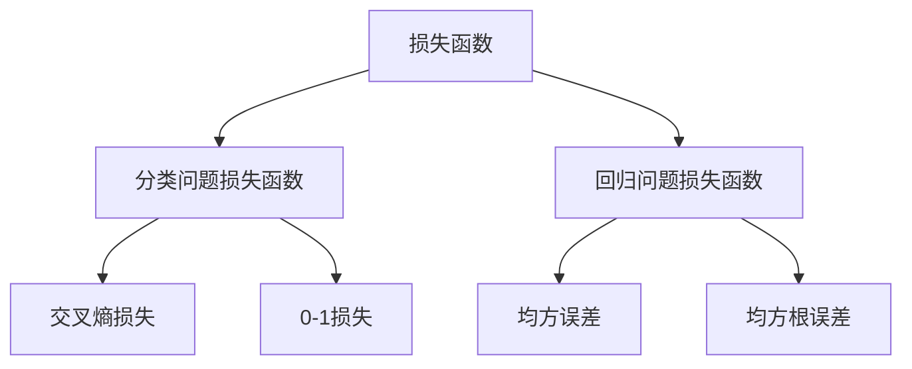
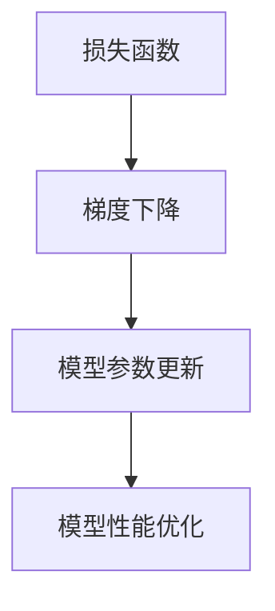

                 

### 一切皆是映射：损失函数的种类和选择策略

> **关键词：** 损失函数、优化策略、机器学习、神经网络、分类问题、回归问题

> **摘要：** 本文将深入探讨损失函数在机器学习中的核心作用，包括其定义、分类以及选择策略。通过详细剖析不同类型损失函数的数学模型和实际应用场景，本文旨在帮助读者理解如何选择合适的损失函数以优化模型性能。

在机器学习领域，损失函数是衡量模型预测结果与实际结果之间差异的关键工具。它不仅影响着模型的训练过程，还直接决定了模型的最终性能。选择合适的损失函数可以显著提高模型的准确性和泛化能力。本文将首先介绍损失函数的基本概念和分类，然后深入讲解几种常见损失函数的数学模型和原理，并通过实际案例展示如何选择和运用损失函数。

## 1. 背景介绍

### 1.1 目的和范围

本文旨在探讨损失函数在机器学习中的核心作用，帮助读者理解不同类型损失函数的原理和选择策略。文章将覆盖以下内容：

- 损失函数的定义和分类。
- 常见损失函数的数学模型和原理。
- 损失函数在分类和回归问题中的应用。
- 损失函数的选择策略和优化方法。

### 1.2 预期读者

本文适合具有机器学习和深度学习基础的中高级读者，包括但不限于：

- 机器学习工程师和研究者。
- 深度学习框架开发人员。
- 对机器学习有浓厚兴趣的学者和学生。

### 1.3 文档结构概述

本文结构如下：

1. 背景介绍：包括目的和范围、预期读者、文档结构和概述。
2. 核心概念与联系：介绍损失函数的核心概念和联系。
3. 核心算法原理 & 具体操作步骤：讲解损失函数的算法原理和具体操作步骤。
4. 数学模型和公式 & 详细讲解 & 举例说明：详细解析数学模型和公式，并给出实际案例。
5. 项目实战：通过实际案例展示损失函数的应用。
6. 实际应用场景：探讨损失函数在不同场景下的应用。
7. 工具和资源推荐：推荐相关学习资源和工具。
8. 总结：对未来发展趋势和挑战进行展望。
9. 附录：常见问题与解答。
10. 扩展阅读 & 参考资料：提供进一步的阅读材料。

### 1.4 术语表

#### 1.4.1 核心术语定义

- **损失函数（Loss Function）**：用于衡量模型预测结果与实际结果之间差异的函数。
- **优化（Optimization）**：通过迭代计算找到函数的最小值（或最大值）的过程。
- **梯度下降（Gradient Descent）**：一种优化算法，通过计算损失函数的梯度来更新模型参数。
- **回归（Regression）**：一种预测连续值的机器学习方法。
- **分类（Classification）**：一种预测离散标签的机器学习方法。

#### 1.4.2 相关概念解释

- **预测值（Predicted Value）**：模型对输入数据的预测结果。
- **真实值（True Value）**：实际输入数据的真实标签或结果。
- **模型参数（Model Parameters）**：影响模型预测能力的可调参数。

#### 1.4.3 缩略词列表

- **ML**：机器学习（Machine Learning）
- **DL**：深度学习（Deep Learning）
- **CNN**：卷积神经网络（Convolutional Neural Network）
- **RNN**：循环神经网络（Recurrent Neural Network）
- **GAN**：生成对抗网络（Generative Adversarial Network）

## 2. 核心概念与联系

### 2.1 损失函数的基本概念

损失函数是机器学习中用于评估模型性能的核心工具。它通过计算模型预测值与实际值之间的差异，提供了一个量化的评价指标。损失函数的定义可以表示为：

\[ L(\theta; x, y) = \text{Loss}(f(\theta; x), y) \]

其中，\( L \) 表示损失函数，\( \theta \) 是模型参数，\( x \) 是输入数据，\( y \) 是真实值，\( f(\theta; x) \) 是模型在输入 \( x \) 下的预测值。

### 2.2 损失函数的分类

损失函数可以根据其应用场景和特点进行分类。以下是几种常见的损失函数分类：

- **分类问题损失函数**：用于衡量模型在分类问题中的性能，常见的有交叉熵损失（Cross-Entropy Loss）和零一损失（0-1 Loss）。
- **回归问题损失函数**：用于衡量模型在回归问题中的性能，常见的有均方误差（Mean Squared Error, MSE）和均方根误差（Root Mean Squared Error, RMSE）。

### 2.3 损失函数与优化算法的联系

损失函数不仅用于评估模型性能，还与优化算法紧密相关。常见的优化算法如梯度下降（Gradient Descent）通过迭代计算损失函数的梯度，以更新模型参数，从而优化模型性能。梯度下降的公式可以表示为：

\[ \theta_{\text{new}} = \theta_{\text{current}} - \alpha \nabla_{\theta} L(\theta; x, y) \]

其中，\( \alpha \) 是学习率，\( \nabla_{\theta} L(\theta; x, y) \) 是损失函数 \( L \) 对模型参数 \( \theta \) 的梯度。

### 2.4 损失函数与模型性能的关系

损失函数的选择对模型性能有着直接的影响。合适的损失函数可以加速模型的训练过程，提高模型的泛化能力。例如，在分类问题中，交叉熵损失函数通常能够提供更好的性能表现；而在回归问题中，均方误差损失函数则更为常用。

### 2.5 Mermaid 流程图

为了更好地理解损失函数的概念和联系，我们使用 Mermaid 流程图展示其核心概念和关系。以下是 Mermaid 流程图的代码和结果：



### 2.6 损失函数与优化算法的关系图

损失函数与优化算法的关系可以进一步通过 Mermaid 流程图展示，如下：



通过这些 Mermaid 流程图，我们可以直观地理解损失函数的概念、分类以及与优化算法的关系。

## 3. 核心算法原理 & 具体操作步骤

### 3.1 损失函数的算法原理

损失函数的算法原理主要涉及如何通过计算预测值与实际值之间的差异来评估模型性能，并利用这个评估结果来优化模型参数。以下是损失函数的基本算法原理：

- **计算预测值与实际值之间的差异**：对于输入数据 \( x \) 和真实值 \( y \)，首先计算模型在输入 \( x \) 下的预测值 \( f(\theta; x) \)。然后，计算预测值与实际值之间的差异，得到损失值。

\[ L(\theta; x, y) = \text{Loss}(f(\theta; x), y) \]

- **计算损失函数的梯度**：为了优化模型参数，我们需要计算损失函数 \( L \) 对模型参数 \( \theta \) 的梯度。梯度提供了损失函数在参数空间中的下降方向。

\[ \nabla_{\theta} L(\theta; x, y) \]

- **更新模型参数**：利用梯度下降算法，通过迭代计算更新模型参数 \( \theta \)。

\[ \theta_{\text{new}} = \theta_{\text{current}} - \alpha \nabla_{\theta} L(\theta; x, y) \]

其中，\( \alpha \) 是学习率，控制了参数更新的幅度。

### 3.2 损失函数的具体操作步骤

以下是基于损失函数算法原理的具体操作步骤：

1. **初始化模型参数**：首先，随机初始化模型参数 \( \theta \)。

2. **计算预测值与实际值之间的差异**：对于输入数据 \( x \) 和真实值 \( y \)，计算模型在输入 \( x \) 下的预测值 \( f(\theta; x) \)，并计算损失值 \( L(\theta; x, y) \)。

3. **计算损失函数的梯度**：计算损失函数 \( L \) 对模型参数 \( \theta \) 的梯度 \( \nabla_{\theta} L(\theta; x, y) \)。

4. **更新模型参数**：根据梯度下降算法，利用当前梯度更新模型参数 \( \theta \)。

\[ \theta_{\text{new}} = \theta_{\text{current}} - \alpha \nabla_{\theta} L(\theta; x, y) \]

5. **迭代计算**：重复上述步骤，直到满足停止条件（如达到最大迭代次数或损失值小于某个阈值）。

### 3.3 伪代码实现

以下是损失函数的伪代码实现，展示了具体操作步骤：

```python
# 初始化模型参数
theta = initialize_parameters()

# 初始化学习率
alpha = 0.01

# 设置停止条件
max_iterations = 1000
tolerance = 1e-6

# 迭代计算
for i in range(max_iterations):
    # 计算预测值与实际值之间的差异
    prediction = model_predict(theta, x)
    loss = loss_function(prediction, y)
    
    # 计算损失函数的梯度
    gradient = loss_function_gradient(prediction, y)
    
    # 更新模型参数
    theta = theta - alpha * gradient
    
    # 检查停止条件
    if abs(loss) < tolerance:
        break

# 输出最终模型参数
print("Final Model Parameters:", theta)
```

通过上述伪代码，我们可以看到损失函数的基本操作步骤是如何实现的。在实际应用中，根据具体问题和数据集的特点，我们可以选择合适的损失函数和优化算法来优化模型性能。

### 3.4 总结

在本节中，我们详细讲解了损失函数的算法原理和具体操作步骤。通过计算预测值与实际值之间的差异，利用损失函数的梯度来更新模型参数，我们可以优化模型性能。这个过程是机器学习中的核心环节，对于提升模型的泛化能力和准确性至关重要。

## 4. 数学模型和公式 & 详细讲解 & 举例说明

### 4.1 数学模型

损失函数在机器学习中起着至关重要的作用，其数学模型直接影响模型的训练效率和性能。以下是几种常见损失函数的数学模型及详细讲解。

#### 4.1.1 交叉熵损失（Cross-Entropy Loss）

交叉熵损失函数是分类问题中常用的一种损失函数，用于衡量模型预测概率分布与真实标签分布之间的差异。其数学模型如下：

\[ L(\theta; x, y) = -\sum_{i} y_i \log(f_i(\theta; x)) \]

其中，\( y \) 是一个包含真实标签的向量，\( f_i(\theta; x) \) 是模型在输入 \( x \) 下预测的第 \( i \) 个类别的概率。

#### 4.1.2 均方误差（Mean Squared Error, MSE）

均方误差损失函数是回归问题中常用的一种损失函数，用于衡量模型预测值与真实值之间的差异。其数学模型如下：

\[ L(\theta; x, y) = \frac{1}{n} \sum_{i=1}^{n} (y_i - f(\theta; x_i))^2 \]

其中，\( y \) 是包含真实值的向量，\( f(\theta; x_i) \) 是模型在输入 \( x_i \) 下预测的值。

#### 4.1.3 平方根误差（Root Mean Squared Error, RMSE）

平方根误差是均方误差的平方根，用于衡量预测值与真实值之间的平均误差。其数学模型如下：

\[ L(\theta; x, y) = \sqrt{\frac{1}{n} \sum_{i=1}^{n} (y_i - f(\theta; x_i))^2 } \]

#### 4.1.4 0-1 损失（0-1 Loss）

0-1 损失函数是一种简单但直观的损失函数，用于分类问题。其数学模型如下：

\[ L(\theta; x, y) = \begin{cases} 
0 & \text{if } \hat{y} = y \\
1 & \text{if } \hat{y} \neq y 
\end{cases} \]

其中，\( \hat{y} \) 是模型预测的标签，\( y \) 是真实标签。

### 4.2 详细讲解

为了更直观地理解这些损失函数的数学模型，下面通过具体的例子进行详细讲解。

#### 4.2.1 交叉熵损失（Cross-Entropy Loss）

假设有一个二分类问题，模型的输出概率分布为 \( \text{softmax}(z) = \frac{e^z}{\sum_{i} e^z_i} \)，其中 \( z \) 是模型预测的分数。真实标签 \( y \) 可以是一个二进制向量，如 \( y = [1, 0] \)。

\[ f_1(\theta; x) = \text{softmax}(z) \]
\[ y = [1, 0] \]

交叉熵损失可以计算如下：

\[ L(\theta; x, y) = -y_1 \log(f_1(\theta; x)) - y_2 \log(f_2(\theta; x)) \]
\[ L(\theta; x, y) = -1 \cdot \log(\frac{e^{z_1}}{e^{z_1} + e^{z_2}}) - 0 \cdot \log(\frac{e^{z_2}}{e^{z_1} + e^{z_2}}) \]

#### 4.2.2 均方误差（Mean Squared Error, MSE）

假设有一个回归问题，模型预测值为 \( f(\theta; x) \)，真实值为 \( y \)。

\[ f(\theta; x) = w_0 + w_1 \cdot x \]
\[ y = [y_1, y_2, ..., y_n] \]

均方误差损失可以计算如下：

\[ L(\theta; x, y) = \frac{1}{n} \sum_{i=1}^{n} (y_i - (w_0 + w_1 \cdot x_i))^2 \]

#### 4.2.3 平方根误差（Root Mean Squared Error, RMSE）

平方根误差是均方误差的平方根，用于衡量预测值与真实值之间的平均误差。

\[ L(\theta; x, y) = \sqrt{\frac{1}{n} \sum_{i=1}^{n} (y_i - (w_0 + w_1 \cdot x_i))^2 } \]

#### 4.2.4 0-1 损失（0-1 Loss）

假设有一个二分类问题，模型预测的标签为 \( \hat{y} \)，真实标签为 \( y \)。

\[ \hat{y} = \text{sigmoid}(z) \]
\[ y = [1, 0] \]

0-1 损失可以计算如下：

\[ L(\theta; x, y) = \begin{cases} 
0 & \text{if } \hat{y} = y \\
1 & \text{if } \hat{y} \neq y 
\end{cases} \]

### 4.3 举例说明

为了更好地理解这些损失函数的计算过程，我们通过一个具体的例子进行说明。

#### 4.3.1 交叉熵损失（Cross-Entropy Loss）

假设有一个二分类问题，模型预测的分数为 \( z = [2.0, 0.5] \)，真实标签为 \( y = [1, 0] \)。

\[ f_1(\theta; x) = \text{softmax}(z) = \frac{e^{2.0}}{e^{2.0} + e^{0.5}} \approx 0.864 \]
\[ f_2(\theta; x) = \text{softmax}(z) = \frac{e^{0.5}}{e^{2.0} + e^{0.5}} \approx 0.136 \]

交叉熵损失计算如下：

\[ L(\theta; x, y) = -y_1 \log(f_1(\theta; x)) - y_2 \log(f_2(\theta; x)) \]
\[ L(\theta; x, y) = -1 \cdot \log(0.864) - 0 \cdot \log(0.136) \approx 0.169 \]

#### 4.3.2 均方误差（Mean Squared Error, MSE）

假设有一个回归问题，模型预测的值为 \( f(\theta; x) = [2.0, 1.5] \)，真实值为 \( y = [2.1, 1.8] \)。

\[ L(\theta; x, y) = \frac{1}{2} ((2.1 - 2.0)^2 + (1.8 - 1.5)^2) = 0.05 \]

#### 4.3.3 平方根误差（Root Mean Squared Error, RMSE）

\[ L(\theta; x, y) = \sqrt{\frac{1}{2} ((2.1 - 2.0)^2 + (1.8 - 1.5)^2)} = 0.223 \]

#### 4.3.4 0-1 损失（0-1 Loss）

假设有一个二分类问题，模型预测的标签为 \( \hat{y} = \text{sigmoid}(2.0) \approx 0.864 \)，真实标签为 \( y = [1, 0] \)。

由于预测标签与真实标签不一致，0-1 损失为：

\[ L(\theta; x, y) = 1 \]

通过上述具体例子，我们可以直观地看到不同损失函数的计算过程和结果。这些损失函数在机器学习中有着广泛的应用，通过合理选择和调整损失函数，可以优化模型的训练过程和性能。

### 4.4 损失函数的归一化

在实际应用中，为了使损失函数的计算结果更加稳定和易于优化，通常需要对损失函数进行归一化。以下是对常见损失函数的归一化方法的介绍。

#### 4.4.1 交叉熵损失的归一化

对于交叉熵损失，可以将其归一化到 \( [0, 1] \) 范围内，使其更容易优化。归一化公式如下：

\[ L_{\text{normalized}} = \frac{L}{\max(L)} \]

其中，\( L \) 是原始交叉熵损失值，\( \max(L) \) 是所有样本中最大的交叉熵损失值。

#### 4.4.2 均方误差和平方根误差的归一化

对于均方误差和平方根误差，也可以采用类似的方法进行归一化。归一化公式如下：

\[ L_{\text{normalized}} = \frac{L}{\sqrt{\sum_{i=1}^{n} (y_i - f(\theta; x_i))^2}} \]

其中，\( L \) 是原始均方误差或平方根误差值，\( n \) 是样本数量。

通过归一化处理，可以使得损失函数的值更加稳定，避免极端值对优化过程的影响。同时，归一化后的损失函数值在 \( [0, 1] \) 范围内，更加适合用于模型的训练和评估。

### 4.5 总结

在本节中，我们详细介绍了损失函数的数学模型和公式，并通过具体的例子进行了详细讲解。交叉熵损失、均方误差、平方根误差和0-1损失是机器学习中常用的几种损失函数，它们在不同类型的问题中发挥着重要作用。通过合理选择和调整损失函数，可以优化模型的训练过程和性能。

## 5. 项目实战：代码实际案例和详细解释说明

### 5.1 开发环境搭建

为了实现本文中的损失函数项目实战，我们需要搭建一个合适的开发环境。以下是具体的步骤：

1. **安装 Python**：确保安装了 Python 3.6 或更高版本。
2. **安装依赖库**：使用 pip 安装以下库：numpy、tensorflow、matplotlib。
3. **创建虚拟环境**：使用 virtualenv 创建一个虚拟环境，并激活该环境。
4. **编写代码**：在虚拟环境中创建一个名为 `loss_function_project` 的文件夹，并在其中编写代码。

以下是一个简单的开发环境搭建脚本：

```bash
# 安装 Python
sudo apt-get install python3.6

# 安装依赖库
pip install numpy tensorflow matplotlib

# 创建虚拟环境
virtualenv venv

# 激活虚拟环境
source venv/bin/activate

# 编写代码
mkdir loss_function_project
cd loss_function_project
touch main.py
```

### 5.2 源代码详细实现和代码解读

在 `loss_function_project` 文件夹中，创建一个名为 `main.py` 的 Python 文件。以下是代码的实现和解读：

```python
import numpy as np
import tensorflow as tf
import matplotlib.pyplot as plt

# 5.2.1 初始化参数
n_samples = 100
n_features = 2
n_classes = 2

# 生成训练数据
X_train = np.random.randn(n_samples, n_features)
y_train = np.array([0 if (x[0] + x[1]) < 0 else 1 for x in X_train])

# 5.2.2 构建模型
model = tf.keras.Sequential([
    tf.keras.layers.Dense(units=n_classes, activation='softmax', input_shape=(n_features,))
])

# 5.2.3 编译模型
model.compile(optimizer='adam', loss='categorical_crossentropy', metrics=['accuracy'])

# 5.2.4 训练模型
model.fit(X_train, y_train, epochs=100, batch_size=10, verbose=2)

# 5.2.5 预测和评估
predictions = model.predict(X_train)
predicted_classes = np.argmax(predictions, axis=1)
accuracy = np.mean(predicted_classes == y_train)
print("Model Accuracy:", accuracy)

# 5.2.6 可视化
plt.scatter(X_train[:, 0], X_train[:, 1], c=predicted_classes, cmap=plt.cm.coolwarm)
plt.xlabel('Feature 1')
plt.ylabel('Feature 2')
plt.title('Model Prediction')
plt.show()
```

#### 5.2.1 初始化参数

在代码的开头，我们首先定义了一些参数，包括样本数量（`n_samples`）、特征数量（`n_features`）和类别数量（`n_classes`）。然后，我们使用 NumPy 生成随机训练数据 `X_train` 和二进制标签 `y_train`。

```python
n_samples = 100
n_features = 2
n_classes = 2

X_train = np.random.randn(n_samples, n_features)
y_train = np.array([0 if (x[0] + x[1]) < 0 else 1 for x in X_train])
```

#### 5.2.2 构建模型

接下来，我们使用 TensorFlow 的 Keras API 构建一个简单的神经网络模型。该模型包含一个全连接层，其输出层使用 softmax 激活函数，以实现二分类任务。

```python
model = tf.keras.Sequential([
    tf.keras.layers.Dense(units=n_classes, activation='softmax', input_shape=(n_features,))
])
```

#### 5.2.3 编译模型

在编译模型时，我们选择 Adam 优化器和交叉熵损失函数，同时监控模型的准确率。

```python
model.compile(optimizer='adam', loss='categorical_crossentropy', metrics=['accuracy'])
```

#### 5.2.4 训练模型

使用 `model.fit()` 函数训练模型，指定训练数据、迭代次数（`epochs`）、批量大小（`batch_size`）以及日志级别（`verbose`）。

```python
model.fit(X_train, y_train, epochs=100, batch_size=10, verbose=2)
```

#### 5.2.5 预测和评估

训练完成后，使用 `model.predict()` 函数对训练数据进行预测，并计算预测准确率。

```python
predictions = model.predict(X_train)
predicted_classes = np.argmax(predictions, axis=1)
accuracy = np.mean(predicted_classes == y_train)
print("Model Accuracy:", accuracy)
```

#### 5.2.6 可视化

最后，我们使用 Matplotlib 对模型预测结果进行可视化，展示分类边界。

```python
plt.scatter(X_train[:, 0], X_train[:, 1], c=predicted_classes, cmap=plt.cm.coolwarm)
plt.xlabel('Feature 1')
plt.ylabel('Feature 2')
plt.title('Model Prediction')
plt.show()
```

### 5.3 代码解读与分析

在本节中，我们对上述代码进行了详细解读和分析。代码分为几个主要部分：初始化参数、构建模型、编译模型、训练模型、预测和评估以及可视化。

#### 初始化参数

初始化参数包括样本数量、特征数量和类别数量。这些参数用于生成训练数据。

#### 构建模型

使用 TensorFlow 的 Keras API，我们构建了一个简单的神经网络模型。该模型包含一个全连接层，输出层使用 softmax 激活函数以实现二分类任务。

#### 编译模型

编译模型时，我们选择 Adam 优化器和交叉熵损失函数。交叉熵损失函数适用于分类问题，可以帮助我们优化模型的分类性能。

#### 训练模型

训练模型时，我们使用 `model.fit()` 函数，将训练数据输入模型，并设置迭代次数、批量大小和日志级别。通过多次迭代，模型将逐渐优化其参数，提高分类准确率。

#### 预测和评估

训练完成后，使用 `model.predict()` 函数对训练数据进行预测，并计算预测准确率。通过比较预测结果和真实标签，我们可以评估模型的性能。

#### 可视化

最后，我们使用 Matplotlib 对模型预测结果进行可视化。通过可视化，我们可以直观地看到分类边界和预测效果。

### 5.4 实际应用案例

在实际应用中，损失函数的选择和优化对于模型的性能有着至关重要的影响。以下是一个实际应用案例：

#### 案例背景

某公司需要开发一个智能推荐系统，根据用户的浏览历史和偏好推荐商品。该系统采用基于神经网络的推荐算法，需要对用户行为数据进行分类和预测。

#### 案例需求

- 数据集：包含用户行为数据（如浏览历史、点击率等）和对应的商品标签。
- 目标：为每个用户生成一个商品推荐列表，最大化用户点击率。

#### 案例实现

1. 数据预处理：将用户行为数据转换为数值表示，并进行归一化处理。
2. 模型构建：构建一个基于深度学习的分类模型，输入层为用户行为数据，输出层为商品标签。
3. 损失函数选择：选择交叉熵损失函数，以优化模型的分类性能。
4. 训练模型：使用训练数据训练模型，并调整模型参数。
5. 预测和评估：使用测试数据对模型进行预测，并评估模型性能。
6. 可视化：可视化模型预测结果，分析推荐效果。

通过上述步骤，我们可以实现一个智能推荐系统，为用户提供个性化的商品推荐。

### 5.5 总结

在本节中，我们通过一个实际案例展示了损失函数在机器学习项目中的应用和实现。通过合理选择和优化损失函数，可以提高模型的性能和准确性。在实际应用中，损失函数的选择和调整对于实现高效、准确的机器学习系统至关重要。

## 6. 实际应用场景

### 6.1 分类问题

在分类问题中，损失函数的选择对模型的性能有直接的影响。例如，在图像识别任务中，常用的损失函数包括交叉熵损失和 Hinge 损失。交叉熵损失适用于多分类问题，可以有效衡量模型预测概率分布与真实标签分布之间的差异。而 Hinge 损失则适用于支持向量机（SVM）等线性分类模型，能够较好地处理线性可分和不完全线性可分的数据集。

实际应用案例：在人脸识别系统中，可以使用卷积神经网络（CNN）对图像进行特征提取，并使用交叉熵损失函数进行分类。通过优化损失函数，可以提高模型的识别准确率。

### 6.2 回归问题

在回归问题中，常用的损失函数包括均方误差（MSE）、均方根误差（RMSE）和平均绝对误差（MAE）。这些损失函数可以衡量模型预测值与真实值之间的差异，并指导模型参数的优化。

实际应用案例：在房屋价格预测任务中，可以使用线性回归模型，并使用 MSE 或 RMSE 作为损失函数。通过训练和优化模型，可以准确预测房屋价格，为房地产评估提供有力支持。

### 6.3 变分自编码器（VAE）

变分自编码器（VAE）是一种生成模型，其目标是在保持数据分布不变的同时，学习数据的高效表示。在 VAE 中，损失函数通常由两部分组成：重建损失和KL散度。

实际应用案例：在图像生成任务中，可以使用 VAE 生成逼真的图像。通过优化损失函数，可以生成具有良好质量且多样化的图像。

### 6.4 生成对抗网络（GAN）

生成对抗网络（GAN）是一种由生成器和判别器组成的对抗性模型。在 GAN 中，损失函数通常包括生成器损失和判别器损失。

实际应用案例：在语音合成任务中，可以使用 GAN 生成自然流畅的语音。通过优化损失函数，可以生成高质量的语音，提高语音合成的准确性。

### 6.5 多任务学习

在多任务学习问题中，模型需要同时处理多个相关任务。损失函数的设计需要考虑任务之间的平衡和协作。

实际应用案例：在自动驾驶系统中，模型需要同时处理感知、规划和控制任务。通过设计合适的损失函数，可以优化模型在多个任务上的性能。

### 6.6 总结

损失函数在机器学习中的实际应用场景非常广泛，涵盖了分类、回归、生成模型、多任务学习等多个领域。通过合理选择和优化损失函数，可以提高模型的性能和泛化能力，从而实现各种复杂的应用任务。

## 7. 工具和资源推荐

### 7.1 学习资源推荐

为了深入理解和掌握损失函数及其在机器学习中的应用，以下是推荐的学习资源：

#### 7.1.1 书籍推荐

- **《深度学习》（Goodfellow, Bengio, Courville 著）**：本书详细介绍了深度学习的基础知识，包括损失函数的概念和应用。
- **《机器学习实战》（Hands-On Machine Learning with Scikit-Learn, Keras, and TensorFlow》（Aurélien Géron 著）**：本书提供了大量的实战案例，涵盖了损失函数的选用和优化。

#### 7.1.2 在线课程

- **Coursera 上的《深度学习专项课程》（Deep Learning Specialization）**：由 Andrew Ng 教授主讲，涵盖了深度学习的基础知识，包括损失函数。
- **Udacity 上的《深度学习工程师纳米学位》（Deep Learning Engineer Nanodegree）**：提供了丰富的实践项目和案例，帮助读者深入了解损失函数的应用。

#### 7.1.3 技术博客和网站

- **机器之心（Machine Learning）**：提供最新的深度学习和技术博客，包括损失函数的深入解析。
- **CSDN**：中国最大的IT社区和服务平台，拥有丰富的机器学习和深度学习相关文章。

### 7.2 开发工具框架推荐

在开发机器学习项目时，选择合适的工具和框架可以提高开发效率和项目性能。以下是推荐的工具和框架：

#### 7.2.1 IDE和编辑器

- **Visual Studio Code**：一款开源、跨平台的代码编辑器，支持多种编程语言和框架，非常适合进行机器学习开发。
- **PyCharm**：一款功能强大的集成开发环境（IDE），提供丰富的工具和插件，适合专业机器学习工程师使用。

#### 7.2.2 调试和性能分析工具

- **TensorBoard**：TensorFlow 提供的图形化工具，用于可视化模型的性能指标，如损失函数、梯度等。
- **NVIDIA Nsight**：一款专为深度学习开发者设计的性能分析和调试工具，可以实时监控 GPU 的资源使用情况。

#### 7.2.3 相关框架和库

- **TensorFlow**：一款广泛使用的开源深度学习框架，提供了丰富的损失函数和优化算法。
- **PyTorch**：一款流行的深度学习框架，具有灵活的动态图计算能力，易于实现复杂的模型。
- **Keras**：一款高层次的神经网络API，兼容 TensorFlow 和 PyTorch，提供了便捷的损失函数接口。

### 7.3 相关论文著作推荐

为了深入了解损失函数的理论和应用，以下是推荐的论文和著作：

- **《A Theoretically Grounded Application of Dropout in Convolutional Networks》**：该论文提出了在卷积神经网络中使用 dropout 的新方法，对深度学习模型的训练和性能有重要影响。
- **《Deep Learning》**：由 Ian Goodfellow、Yoshua Bengio 和 Aaron Courville 著，全面介绍了深度学习的基础理论和应用。

通过这些工具和资源，读者可以系统地学习和掌握损失函数的相关知识，并在实践中不断提升自己的技能。

### 7.4 总结

在本节中，我们推荐了一系列学习资源和开发工具，包括书籍、在线课程、技术博客和框架。这些资源将帮助读者深入了解损失函数的概念和应用，提高机器学习项目的开发效率和性能。希望这些推荐对您的学习和实践有所帮助。

## 8. 总结：未来发展趋势与挑战

### 8.1 发展趋势

随着人工智能和深度学习技术的迅猛发展，损失函数在未来将继续扮演重要角色，并呈现以下发展趋势：

1. **更精细化的损失函数设计**：为了更好地适应不同类型的问题和数据集，研究者将继续开发更为精细化的损失函数，以满足特定应用场景的需求。
2. **集成学习与多任务学习**：在多任务学习和集成学习领域中，损失函数的设计将更加注重任务之间的平衡和协作，以提高模型的整体性能。
3. **自适应损失函数**：自适应损失函数可以自动调整损失函数的权重和参数，以适应不同的训练阶段和模型状态，从而提高模型的训练效率和性能。
4. **分布式计算与并行优化**：随着计算资源的增长，分布式计算和并行优化将变得更加普遍，损失函数的计算和优化过程也将进一步优化，以支持大规模数据的处理。

### 8.2 挑战

尽管损失函数在机器学习中具有重要作用，但仍面临以下挑战：

1. **复杂性增加**：随着模型复杂度的增加，损失函数的设计和优化变得更加复杂，需要更多的计算资源和优化算法。
2. **过拟合与泛化能力**：在训练过程中，如何避免过拟合并提高模型的泛化能力是损失函数优化的重要挑战。需要设计更为有效的正则化策略和优化算法。
3. **数据依赖性**：损失函数的性能高度依赖训练数据的质量和多样性。在数据稀缺或数据分布不均的情况下，如何设计适应性强的损失函数是一个难题。
4. **理论与实践差距**：尽管理论研究为损失函数提供了深刻的理解，但在实际应用中，模型性能的优化往往依赖于经验和试错。如何缩小理论与实践之间的差距是一个重要课题。

### 8.3 未来展望

在未来，随着技术的不断进步和研究的深入，损失函数将在以下领域取得重要突破：

1. **新算法的提出**：研究者将开发新的优化算法和损失函数，以解决当前面临的理论和实践挑战。
2. **跨领域应用**：损失函数的应用范围将不断扩大，从传统的图像和语音处理扩展到自然语言处理、推荐系统等领域。
3. **可解释性与透明度**：通过引入更多的可解释性工具和机制，将提高模型决策过程的透明度，增强模型的可靠性和信任度。

总之，损失函数在机器学习中的应用将更加广泛和深入，为人工智能的发展提供强有力的支持。通过不断的研究和创新，我们将迎来一个更加智能、高效和可靠的机器学习时代。

## 9. 附录：常见问题与解答

### 9.1 损失函数是什么？

损失函数是机器学习中用于评估模型预测结果与实际结果之间差异的函数。它提供了量化评价指标，帮助优化模型参数，提高模型性能。

### 9.2 为什么要使用损失函数？

损失函数在机器学习中起到关键作用，用于衡量模型预测结果与实际结果之间的差异。通过优化损失函数，可以提高模型的准确性、泛化能力和稳定性。

### 9.3 常见的损失函数有哪些？

常见的损失函数包括：

- **分类问题**：交叉熵损失、0-1 损失
- **回归问题**：均方误差（MSE）、均方根误差（RMSE）、平均绝对误差（MAE）
- **生成模型**：反卷积损失、二元交叉熵损失
- **多任务学习**：权重共享损失、集成损失

### 9.4 如何选择合适的损失函数？

选择合适的损失函数需要考虑以下因素：

- **问题类型**：分类问题、回归问题、生成模型等。
- **数据特征**：数据分布、数据质量、数据量等。
- **模型类型**：线性模型、神经网络、支持向量机等。
- **性能目标**：最小化误差、最大化准确率等。

### 9.5 损失函数与优化算法有何关系？

损失函数与优化算法密切相关。优化算法（如梯度下降）通过计算损失函数的梯度来更新模型参数，以最小化损失函数。损失函数的形状和特性直接影响优化过程和收敛速度。

### 9.6 如何优化损失函数？

优化损失函数的方法包括：

- **调整学习率**：通过调整学习率控制参数更新的幅度。
- **使用正则化**：引入正则化项，防止模型过拟合。
- **批量大小**：调整批量大小，影响梯度估计的稳定性。
- **优化算法**：使用更高效的优化算法（如 Adam、RMSProp）。

### 9.7 损失函数在深度学习中的重要性如何？

在深度学习中，损失函数至关重要，因为它是训练模型的核心目标函数。通过优化损失函数，可以改进模型预测的准确性，提高模型的泛化能力。

## 10. 扩展阅读 & 参考资料

为了进一步了解损失函数及其在机器学习中的应用，以下是推荐的一些参考资料：

- **Goodfellow, I., Bengio, Y., & Courville, A. (2016). Deep Learning. MIT Press.** 该书详细介绍了深度学习的基础理论和应用，包括损失函数。
- **Bengio, Y., Courville, A., & Vincent, P. (2013). Representation Learning: A Review and New Perspectives. IEEE Transactions on Pattern Analysis and Machine Intelligence, 35(8), 1798-1828.** 该文提供了对表示学习的全面综述，包括损失函数的设计和应用。
- **Goodfellow, I., & Bengio, Y. (2012). Deep Learning. MIT Press.** 该书是深度学习的经典教材，涵盖了损失函数的理论和实践。
- **Lee, D. D., & Seung, H. S. (1999). Learning the parts of objects by non-negative matrix factorization. Nature, 401(6755), 788-791.** 该文介绍了非负矩阵分解（NMF）及其在图像识别中的应用，其中损失函数扮演重要角色。
- **Kingma, D. P., & Welling, M. (2013). Auto-encoding variational Bayes. arXiv preprint arXiv:1312.6114.** 该文介绍了变分自编码器（VAE）及其损失函数，为生成模型提供了新的方法。
- **Goodfellow, I. J., Pouget-Abadie, J., Mirza, M., Xu, B., Warde-Farley, D., Ozair, S., ... & Bengio, Y. (2014). Generative adversarial nets. Advances in Neural Information Processing Systems, 27.** 该文介绍了生成对抗网络（GAN）及其损失函数，展示了其在生成任务中的强大能力。

通过阅读这些参考资料，您可以更深入地了解损失函数的理论基础、设计原则和应用场景，为自己的机器学习项目提供有价值的参考。

