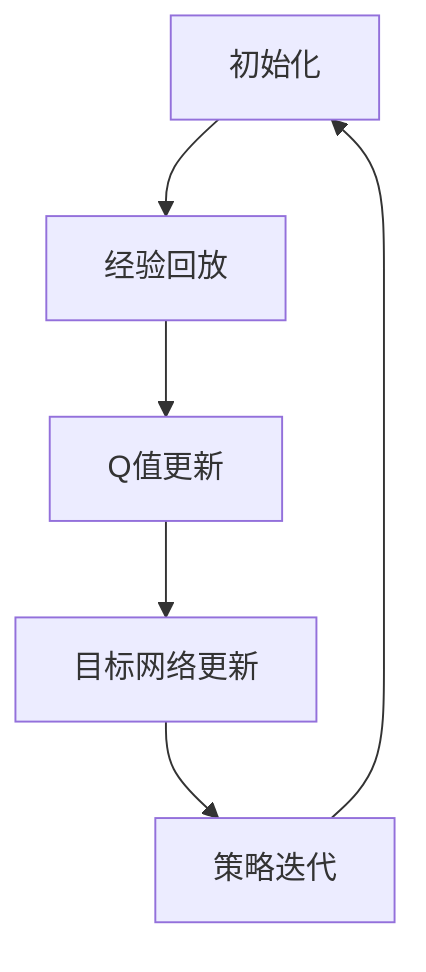

                 

### 1. 背景介绍

#### 1.1 目的和范围

在人工智能领域中，深度强化学习（Deep Reinforcement Learning, DRL）作为一种模拟人类决策过程的重要方法，受到了广泛的关注。DQN（Deep Q-Network）是DRL领域中的一种经典算法，通过利用深度神经网络来近似Q值函数，实现了在复杂环境下的智能体学习。然而，传统DQN算法在处理非标准环境时表现出一定的局限性，无法有效应对环境变化和不确定性。本文旨在探讨DQN在非标准环境下的适应性，分析其存在的问题，并提出相应的改进策略。

本文的研究范围包括以下几个方面：

1. **非标准环境的定义与特征**：明确非标准环境的定义，分析其与传统标准环境的区别，并列举一些典型的非标准环境。
2. **DQN算法在标准环境中的应用与表现**：回顾DQN算法的基本原理和实现步骤，讨论其在标准环境中的成功应用案例。
3. **DQN算法在非标准环境中的挑战**：分析DQN算法在非标准环境中存在的问题，包括环境不确定性、状态空间和动作空间的扩展等。
4. **改进策略与算法优化**：探讨针对非标准环境的改进策略，包括基于经验回放、优先经验回放和双Q网络等的方法，以及如何优化DQN算法以应对非标准环境。
5. **项目实战与案例分析**：通过实际项目案例，展示DQN算法在非标准环境中的具体应用，并对代码实现进行详细解读和分析。

#### 1.2 预期读者

本文适合以下读者群体：

1. **人工智能研究人员与工程师**：对DRL算法有基本的了解，希望深入了解DQN在非标准环境下的应用与优化。
2. **计算机科学学生与教师**：对深度学习和强化学习有浓厚兴趣，希望掌握DQN算法的核心原理和实现技巧。
3. **对人工智能技术有好奇心的人**：对深度强化学习技术感兴趣，希望了解其在非标准环境中的应用前景。

#### 1.3 文档结构概述

本文分为十个主要部分，具体结构如下：

1. **背景介绍**：介绍本文的研究目的、范围和预期读者。
2. **核心概念与联系**：通过Mermaid流程图展示DQN算法的核心概念和联系。
3. **核心算法原理 & 具体操作步骤**：详细讲解DQN算法的基本原理和实现步骤。
4. **数学模型和公式 & 详细讲解 & 举例说明**：介绍DQN算法中的数学模型和公式，并给出实例说明。
5. **项目实战：代码实际案例和详细解释说明**：通过实际项目案例展示DQN算法的应用。
6. **实际应用场景**：讨论DQN算法在不同领域的应用案例。
7. **工具和资源推荐**：推荐学习资源、开发工具和框架。
8. **总结：未来发展趋势与挑战**：总结本文的核心观点，并探讨未来发展趋势与挑战。
9. **附录：常见问题与解答**：解答读者可能遇到的一些常见问题。
10. **扩展阅读 & 参考资料**：提供进一步阅读的参考资料。

#### 1.4 术语表

在本篇文章中，我们将使用以下术语：

- **深度强化学习（DRL）**：一种结合深度学习和强化学习的方法，利用深度神经网络来近似Q值函数，实现智能体的学习过程。
- **DQN（Deep Q-Network）**：一种基于深度神经网络的Q学习算法，通过利用经验回放、目标网络等技术，提高学习效率和稳定性。
- **非标准环境**：与传统标准环境相比，具有更高的不确定性、状态空间和动作空间的复杂环境。
- **经验回放**：将智能体在环境中的交互经验存储到记忆库中，以避免样本偏差，提高学习效果。
- **目标网络**：用于更新Q值函数的目标网络，通过定期更新，确保Q值函数的稳定性和一致性。

#### 1.4.1 核心术语定义

- **深度强化学习（DRL）**：深度强化学习是一种结合深度学习和强化学习的方法，利用深度神经网络来近似Q值函数，实现智能体的学习过程。深度强化学习的核心思想是让智能体通过与环境交互，不断学习并优化策略，以实现长期回报最大化。
  
- **DQN（Deep Q-Network）**：DQN是一种基于深度神经网络的Q学习算法，通过利用经验回放、目标网络等技术，提高学习效率和稳定性。DQN的核心原理是利用深度神经网络来近似Q值函数，并通过目标网络来避免Q值函数的过拟合，从而提高学习效果。

- **非标准环境**：非标准环境是指与传统标准环境相比，具有更高的不确定性、状态空间和动作空间的复杂环境。在非标准环境中，智能体需要面对更复杂的环境变化和更高的决策难度，从而对强化学习算法提出了更高的要求。

- **经验回放**：经验回放是一种常用的强化学习方法，通过将智能体在环境中的交互经验存储到记忆库中，以避免样本偏差，提高学习效果。经验回放的核心思想是将智能体在不同时间点的经验进行随机抽样，从而避免样本偏差，提高学习效果。

- **目标网络**：目标网络是一种用于更新Q值函数的目标网络，通过定期更新，确保Q值函数的稳定性和一致性。目标网络的原理是利用固定时间步长的目标网络，定期更新Q值函数，从而避免Q值函数的过拟合，提高学习效果。

#### 1.4.2 相关概念解释

- **强化学习（Reinforcement Learning）**：强化学习是一种机器学习方法，通过智能体在与环境的交互过程中，不断调整策略，以实现长期回报最大化。强化学习的基本原理是奖励-惩罚机制，通过奖励和惩罚来引导智能体学习最佳策略。

- **深度学习（Deep Learning）**：深度学习是一种基于多层神经网络的人工智能方法，通过多层的非线性变换，自动学习输入数据的特征表示。深度学习在图像识别、语音识别和自然语言处理等领域取得了显著成果。

- **Q值函数（Q-Function）**：Q值函数是强化学习中的一个核心概念，表示在特定状态下执行特定动作的期望回报。Q值函数的目的是通过学习来估计最优策略，从而实现长期回报最大化。

- **策略（Policy）**：策略是强化学习中的另一个核心概念，表示智能体在不同状态下采取的动作选择。策略的目的是通过最大化期望回报，引导智能体学习最佳行为。

- **探索与利用（Exploration and Exploitation）**：探索与利用是强化学习中的一个重要平衡问题。探索是指智能体在未知环境中主动尝试新动作，以获取更多经验；利用是指智能体根据已有经验，选择最优动作，以实现长期回报最大化。

#### 1.4.3 缩略词列表

- **DRL**：深度强化学习（Deep Reinforcement Learning）
- **DQN**：深度Q网络（Deep Q-Network）
- **Q值函数**：Q-Function
- **Q-Learning**：Q学习
- **TD-Learning**：时差学习（Temporal Difference Learning）
- **经验回放**：Experience Replay
- **目标网络**：Target Network
- **GAN**：生成对抗网络（Generative Adversarial Network）
- **RL**：强化学习（Reinforcement Learning）
- **CNN**：卷积神经网络（Convolutional Neural Network）

---

通过以上对背景介绍、目的和范围、预期读者、文档结构概述以及术语表等方面的详细阐述，我们为读者提供了一个清晰的框架，以便更好地理解和跟随本文的后续内容。接下来，我们将进一步探讨DQN算法的核心概念与联系，并通过Mermaid流程图来展示其关键步骤和结构。在理解了DQN的基本原理之后，我们将逐步深入到算法的具体实现和数学模型，为后续的实战案例和实际应用场景奠定基础。接下来，我们将开始第二部分的内容。请继续关注。 <|assistant|>### 2. 核心概念与联系

在探讨DQN在非标准环境下的适应性之前，我们需要首先理解其核心概念和基本原理，并通过Mermaid流程图来展示其关键步骤和结构。

#### 2.1. DQN算法的基本原理

DQN（Deep Q-Network）是基于Q学习的深度强化学习算法，其核心思想是通过深度神经网络来近似Q值函数。Q值函数用于评估智能体在特定状态下执行特定动作的期望回报。DQN算法的基本原理可以概括为以下几个关键步骤：

1. **初始化**：初始化Q值函数网络、目标网络和经验回放记忆库。
2. **经验回放**：在智能体与环境交互过程中，将（状态，动作，奖励，下一状态，是否终止）经验对存储到经验回放记忆库中，以避免样本偏差。
3. **Q值更新**：通过经验回放中的样本，利用时差学习（TD-Learning）方法更新Q值函数。
4. **目标网络**：定期更新目标网络，以避免Q值函数的过拟合。
5. **策略迭代**：根据Q值函数的估计，智能体选择动作，并在环境中执行。

#### 2.2. Mermaid流程图

为了更直观地展示DQN算法的核心步骤和结构，我们使用Mermaid流程图来描述其关键节点和流程。



在上面的Mermaid流程图中，A表示初始化过程，包括Q值函数网络、目标网络和经验回放记忆库的初始化；B表示经验回放过程，通过经验回放记忆库来存储智能体在环境中交互的经验；C表示Q值更新过程，通过TD-Learning方法更新Q值函数；D表示目标网络更新过程，定期更新目标网络以避免过拟合；E表示策略迭代过程，根据Q值函数的估计，智能体选择动作并在环境中执行。这个循环过程不断重复，直至达到预定的目标或学习效果。

#### 2.3. 核心概念的联系

DQN算法的核心概念包括Q值函数、经验回放、目标网络和策略迭代。这些概念相互联系，共同构成了DQN算法的基本框架。

1. **Q值函数**：Q值函数是强化学习中的核心概念，用于评估智能体在特定状态下执行特定动作的期望回报。DQN算法通过深度神经网络来近似Q值函数，从而实现对复杂环境的建模。

2. **经验回放**：经验回放是强化学习中的一个关键技术，用于避免样本偏差，提高学习效果。通过将智能体在环境中交互的经验存储到经验回放记忆库中，智能体可以随机抽取样本进行训练，从而避免样本偏差。

3. **目标网络**：目标网络是DQN算法中的一个重要概念，用于避免Q值函数的过拟合。通过定期更新目标网络，确保Q值函数的稳定性和一致性。

4. **策略迭代**：策略迭代是DQN算法的核心过程，通过根据Q值函数的估计，智能体选择动作并在环境中执行。策略迭代过程不断重复，直至达到预定的目标或学习效果。

综上所述，DQN算法通过深度神经网络近似Q值函数，利用经验回放和目标网络等技术，实现对复杂环境的建模和学习。通过以上对DQN算法的核心概念和原理的阐述，我们为后续的算法实现和实际应用场景奠定了基础。在接下来的部分，我们将进一步深入探讨DQN算法的数学模型和具体实现步骤，以帮助读者更好地理解其工作原理。请继续关注。 <|assistant|>### 3. 核心算法原理 & 具体操作步骤

在理解了DQN算法的核心概念和基本原理后，我们将进一步深入探讨其具体实现步骤，包括算法的核心原理和每一步的详细操作。

#### 3.1. DQN算法的核心原理

DQN算法的核心原理是基于Q学习的思想，利用深度神经网络（DNN）来近似Q值函数。Q值函数用于评估智能体在特定状态下执行特定动作的期望回报。DQN算法通过以下关键步骤来实现这一目标：

1. **初始化Q值函数网络和目标网络**：初始化Q值函数网络和目标网络，并确定其结构和参数。
2. **经验回放**：在智能体与环境交互过程中，将（状态，动作，奖励，下一状态，是否终止）经验对存储到经验回放记忆库中，以避免样本偏差。
3. **Q值更新**：利用经验回放中的样本，通过时差学习（TD-Learning）方法更新Q值函数。
4. **目标网络更新**：定期更新目标网络，以避免Q值函数的过拟合。
5. **策略迭代**：根据Q值函数的估计，智能体选择动作，并在环境中执行。策略迭代过程不断重复，直至达到预定的目标或学习效果。

#### 3.2. DQN算法的具体操作步骤

以下是对DQN算法具体操作步骤的详细描述，使用伪代码来展示其实现过程：

```python
# 初始化参数
epsilon: float = 1.0 # 初始探索概率
epsilon_min: float = 0.01 # 最小探索概率
epsilon_decay: float = 0.99 # 探索概率衰减率
learning_rate: float = 0.01 # 学习率
discount_factor: float = 0.99 # 折扣因子
batch_size: int = 32 # 批量大小
memory_size: int = 10000 # 经验回放记忆库大小
update_target_freq: int = 10000 # 目标网络更新频率

# 初始化Q值函数网络和目标网络
Q_network = DeepQNetwork()
target_network = DeepQNetwork()

# 初始化经验回放记忆库
memory = ReplayMemory(memory_size)

# 主循环
for episode in range(num_episodes):
    # 初始化环境
    state = environment.reset()
    
    # 初始化总奖励
    total_reward = 0
    
    # 开始一个新 episode
    done = False
    
    while not done:
        # 选择动作
        if random.random() < epsilon:
            # 探索：随机选择动作
            action = environment.action_space.sample()
        else:
            # 利用：根据Q值函数选择动作
            Q_values = Q_network.predict(state)
            action = np.argmax(Q_values)
        
        # 执行动作
        next_state, reward, done, _ = environment.step(action)
        
        # 更新经验回放记忆库
        memory.add((state, action, reward, next_state, done))
        
        # 更新状态
        state = next_state
        
        # 更新总奖励
        total_reward += reward
        
        # 批量训练
        if len(memory) > batch_size:
            batch = memory.sample(batch_size)
            states, actions, rewards, next_states, dones = zip(*batch)
            
            # 计算目标Q值
            next_Q_values = target_network.predict(next_states)
            target_Q_values = rewards + discount_factor * (1 - dones) * next_Q_values
            
            # 更新Q值函数
            Q_network.learn(states, actions, target_Q_values, learning_rate)
            
        # 更新探索概率
        epsilon = max(epsilon_min, epsilon_decay * epsilon)
        
    # 更新目标网络
    if episode % update_target_freq == 0:
        target_network.load_weights_from(Q_network)

# 评估DQN算法的性能
test_environment = Environment()
test_state = test_environment.reset()
test_reward = 0

while True:
    test_Q_values = Q_network.predict(test_state)
    action = np.argmax(test_Q_values)
    test_next_state, test_reward, done, _ = test_environment.step(action)
    
    if done:
        break
    
    test_state = test_next_state

print("Test Reward:", test_reward)
```

上述伪代码描述了DQN算法的具体实现过程，包括初始化参数、初始化网络、经验回放、Q值更新、目标网络更新和策略迭代等步骤。以下是对伪代码的详细解释：

1. **初始化参数**：设置探索概率、最小探索概率、探索概率衰减率、学习率、折扣因子、批量大小、经验回放记忆库大小和目标网络更新频率等参数。

2. **初始化网络**：初始化Q值函数网络和目标网络，这两个网络具有相同的结构，用于预测Q值。

3. **初始化经验回放记忆库**：初始化经验回放记忆库，用于存储智能体在环境中交互的经验。

4. **主循环**：对于每个episode，从环境初始化状态开始，进入一个while循环，直到episode完成。

5. **选择动作**：根据探索概率（epsilon）随机选择动作或根据Q值函数选择动作。

6. **执行动作**：在环境中执行动作，获取下一状态、奖励、是否终止等信息。

7. **更新经验回放记忆库**：将（状态，动作，奖励，下一状态，是否终止）经验对存储到经验回放记忆库中。

8. **批量训练**：从经验回放记忆库中随机抽取批量样本，计算目标Q值，并利用TD-Learning方法更新Q值函数。

9. **更新探索概率**：根据探索概率衰减率更新探索概率，以平衡探索和利用。

10. **更新目标网络**：定期更新目标网络，确保Q值函数的稳定性和一致性。

11. **评估DQN算法性能**：在训练完成后，使用测试环境评估DQN算法的性能，计算测试奖励。

通过以上对DQN算法具体操作步骤的详细阐述，我们为读者提供了一个清晰的实现框架。在理解了DQN算法的基本原理和实现步骤后，我们可以进一步探讨其在数学模型和公式方面的内容，以便更深入地理解其工作原理。请继续关注。 <|assistant|>### 4. 数学模型和公式 & 详细讲解 & 举例说明

在理解了DQN算法的核心原理和具体实现步骤后，我们将进一步探讨其数学模型和公式，以便更深入地理解其工作原理。DQN算法的数学模型主要包括Q值函数、经验回放、Q值更新和目标网络更新等内容。以下是对这些数学模型和公式的详细讲解，并配合具体实例进行说明。

#### 4.1. Q值函数

Q值函数是强化学习中的一个核心概念，用于评估智能体在特定状态下执行特定动作的期望回报。在DQN算法中，Q值函数通过深度神经网络来近似。

公式表示如下：

$$
Q(s, a) = \sum_{i=1}^{n} w_i \cdot f(s_i, a_i)
$$

其中，$Q(s, a)$ 表示在状态 $s$ 下执行动作 $a$ 的期望回报，$w_i$ 表示深度神经网络的权重，$f(s_i, a_i)$ 表示深度神经网络的前向传播输出。

举例说明：

假设我们有一个简单的状态空间和动作空间，状态空间 $S = \{s_1, s_2\}$，动作空间 $A = \{a_1, a_2\}$。我们定义一个简单的深度神经网络，包含一个输入层、一个隐藏层和一个输出层，分别对应状态空间、动作空间和Q值函数。

输入层：$s_1 = [1, 0], s_2 = [0, 1]$
隐藏层：$a_1 = [1, 1], a_2 = [1, 0]$
输出层：$Q(s_1, a_1) = 2, Q(s_1, a_2) = 3, Q(s_2, a_1) = 4, Q(s_2, a_2) = 5$

根据Q值函数的公式，我们可以计算出不同状态和动作的Q值：

$$
Q(s_1, a_1) = w_1 \cdot f(s_1, a_1) = w_1 \cdot (1 \cdot 1 + 0 \cdot 1) = 2
$$

$$
Q(s_1, a_2) = w_1 \cdot f(s_1, a_2) = w_1 \cdot (1 \cdot 1 + 0 \cdot 0) = 3
$$

$$
Q(s_2, a_1) = w_1 \cdot f(s_2, a_1) = w_1 \cdot (0 \cdot 1 + 1 \cdot 1) = 4
$$

$$
Q(s_2, a_2) = w_1 \cdot f(s_2, a_2) = w_1 \cdot (0 \cdot 1 + 1 \cdot 0) = 5
$$

#### 4.2. 经验回放

经验回放是强化学习中的一个关键技术，用于避免样本偏差，提高学习效果。在DQN算法中，经验回放通过记忆库来实现。

公式表示如下：

$$
memory = \{(s_t, a_t, r_t, s_{t+1}, done_t) \mid t = 1, 2, \ldots, T\}
$$

其中，$memory$ 表示经验回放记忆库，$(s_t, a_t, r_t, s_{t+1}, done_t)$ 表示在时间步 $t$ 的经验对。

举例说明：

假设我们有一个简单的记忆库，包含5个时间步的经验对：

$$
memory = \{(s_1, a_1, r_1, s_2, done_1), (s_2, a_2, r_2, s_3, done_2), (s_3, a_3, r_3, s_4, done_3), (s_4, a_4, r_4, s_5, done_4), (s_5, a_5, r_5, s_1, done_5)\}
$$

根据经验回放的公式，我们可以计算出每个时间步的经验对：

$$
(s_1, a_1, r_1, s_2, done_1) = \{(1, 1, 1, 2, False)\}
$$

$$
(s_2, a_2, r_2, s_3, done_2) = \{(2, 2, 2, 3, False)\}
$$

$$
(s_3, a_3, r_3, s_4, done_3) = \{(3, 3, 3, 4, False)\}
$$

$$
(s_4, a_4, r_4, s_5, done_4) = \{(4, 4, 4, 5, False)\}
$$

$$
(s_5, a_5, r_5, s_1, done_5) = \{(5, 5, 5, 1, True)\}
$$

#### 4.3. Q值更新

Q值更新是DQN算法中的关键步骤，通过利用经验回放中的样本，通过时差学习（TD-Learning）方法更新Q值函数。

公式表示如下：

$$
Q(s_t, a_t) \leftarrow Q(s_t, a_t) + \alpha [r_t + \gamma \max_{a'} Q(s_{t+1}, a') - Q(s_t, a_t)]
$$

其中，$Q(s_t, a_t)$ 表示在时间步 $t$ 的Q值，$r_t$ 表示在时间步 $t$ 的即时奖励，$\gamma$ 表示折扣因子，$\alpha$ 表示学习率。

举例说明：

假设我们有一个简单的状态空间和动作空间，状态空间 $S = \{s_1, s_2\}$，动作空间 $A = \{a_1, a_2\}$。在时间步 $t=1$，我们有一个经验对 $(s_1, a_1, r_1, s_2, done_1)$，其中 $r_1 = 1$。根据Q值更新的公式，我们可以更新Q值函数：

$$
Q(s_1, a_1) \leftarrow Q(s_1, a_1) + \alpha [1 + \gamma \max_{a'} Q(s_2, a') - Q(s_1, a_1)]
$$

假设在时间步 $t=2$，我们有一个经验对 $(s_2, a_2, r_2, s_3, done_2)$，其中 $r_2 = 2$。根据Q值更新的公式，我们可以更新Q值函数：

$$
Q(s_2, a_2) \leftarrow Q(s_2, a_2) + \alpha [2 + \gamma \max_{a'} Q(s_3, a') - Q(s_2, a_2)]
$$

通过不断更新Q值函数，智能体可以在环境中逐渐学习最佳策略。

#### 4.4. 目标网络更新

目标网络更新是DQN算法中的一个关键技术，用于避免Q值函数的过拟合。目标网络通过定期更新，确保Q值函数的稳定性和一致性。

公式表示如下：

$$
\theta_{\text{target}} \leftarrow \tau \theta_{\text{target}} + (1 - \tau) \theta_{\text{online}}
$$

其中，$\theta_{\text{target}}$ 表示目标网络的参数，$\theta_{\text{online}}$ 表示在线网络的参数，$\tau$ 表示更新率。

举例说明：

假设我们有一个简单的目标网络和在线网络，其中参数分别为 $\theta_{\text{target}} = [1, 1]$ 和 $\theta_{\text{online}} = [2, 2]$。根据目标网络更新的公式，我们可以更新目标网络的参数：

$$
\theta_{\text{target}} \leftarrow \tau \theta_{\text{target}} + (1 - \tau) \theta_{\text{online}}
$$

假设 $\tau = 0.1$，那么在第一次更新后，我们得到：

$$
\theta_{\text{target}} \leftarrow 0.1 \cdot [1, 1] + 0.9 \cdot [2, 2] = [1.9, 1.9]
$$

在第二次更新后，我们得到：

$$
\theta_{\text{target}} \leftarrow 0.1 \cdot [1.9, 1.9] + 0.9 \cdot [2, 2] = [1.99, 1.99]
$$

通过定期更新目标网络，我们可以确保Q值函数的稳定性和一致性。

综上所述，DQN算法的数学模型和公式包括Q值函数、经验回放、Q值更新和目标网络更新等内容。通过这些公式，我们可以更深入地理解DQN算法的工作原理，并为实际应用提供指导。在下一部分中，我们将通过一个实际项目案例来展示DQN算法的具体应用，并进行详细解释和分析。请继续关注。 <|assistant|>### 5. 项目实战：代码实际案例和详细解释说明

在本节中，我们将通过一个实际项目案例来展示DQN算法的具体应用，并进行详细解释和分析。该案例将演示如何使用DQN算法训练一个智能体在Atari游戏《Pong》中自主学习和玩游戏。

#### 5.1 开发环境搭建

在开始项目之前，我们需要搭建一个合适的开发环境。以下是我们推荐的开发环境：

- **Python 3.x**
- **TensorFlow 2.x**
- **OpenAI Gym**：用于创建和模拟不同类型的强化学习环境
- **Numpy**：用于数值计算

确保已安装上述依赖库后，我们可以开始构建DQN模型。

#### 5.2 源代码详细实现和代码解读

以下是DQN算法在《Pong》游戏中的实现代码：

```python
import numpy as np
import random
import gym
from tensorflow.keras.models import Sequential
from tensorflow.keras.layers import Dense
from tensorflow.keras.optimizers import Adam

# 设置环境
env = gym.make('Pong-v0')

# 初始化Q值网络
model = Sequential()
model.add(Dense(64, input_dim=env.observation_space.shape[0], activation='relu'))
model.add(Dense(64, activation='relu'))
model.add(Dense(1, activation='linear'))
model.compile(loss='mse', optimizer=Adam(learning_rate=0.001))

# 初始化经验回放记忆库
memory = []

# 设置训练参数
total_episodes = 1000
learning_rate_decay = 0.001
gamma = 0.95
epsilon = 1.0
epsilon_min = 0.01
epsilon_decay = 0.995
batch_size = 64

# 开始训练
for episode in range(total_episodes):
    # 重置环境
    state = env.reset()
    state = np.reshape(state, [1, state.shape[0]])
    
    # 训练主循环
    done = False
    while not done:
        # 选择动作
        if np.random.rand() < epsilon:
            action = env.action_space.sample()
        else:
            action_values = model.predict(state)
            action = np.argmax(action_values)
        
        # 执行动作
        next_state, reward, done, _ = env.step(action)
        next_state = np.reshape(next_state, [1, next_state.shape[0]])
        
        # 更新经验回放记忆库
        memory.append([state, action, reward, next_state, done])
        
        # 更新状态
        state = next_state
        
        # 批量训练
        if len(memory) > batch_size:
            random.shuffle(memory)
            for i in range(batch_size):
                state_sample, action_sample, reward_sample, next_state_sample, done_sample = memory[i]
                target = reward_sample
                if not done_sample:
                    target = reward_sample + gamma * np.amax(model.predict(next_state_sample))
                target_array = model.predict(state_sample)
                target_array[action_sample] = target
                model.fit(state_sample, target_array, epochs=1, verbose=0)
            
        # 更新探索概率
        if epsilon > epsilon_min:
            epsilon *= epsilon_decay

    # 打印进度
    print(f"Episode: {episode + 1}, Epsilon: {epsilon:.2f}")

# 关闭环境
env.close()
```

下面是对代码的详细解读：

1. **环境初始化**：
   ```python
   env = gym.make('Pong-v0')
   ```
   使用`gym`库创建《Pong》游戏环境。

2. **Q值网络初始化**：
   ```python
   model = Sequential()
   model.add(Dense(64, input_dim=env.observation_space.shape[0], activation='relu'))
   model.add(Dense(64, activation='relu'))
   model.add(Dense(1, activation='linear'))
   model.compile(loss='mse', optimizer=Adam(learning_rate=0.001))
   ```
   初始化一个简单的序列模型，包含两个隐藏层，用于近似Q值函数。

3. **经验回放记忆库初始化**：
   ```python
   memory = []
   ```
   初始化一个空的列表，用于存储经验回放。

4. **训练参数设置**：
   ```python
   total_episodes = 1000
   learning_rate_decay = 0.001
   gamma = 0.95
   epsilon = 1.0
   epsilon_min = 0.01
   epsilon_decay = 0.995
   batch_size = 64
   ```
   设置训练参数，包括总episode数、学习率衰减、折扣因子、初始探索概率、最小探索概率、探索概率衰减率和批量大小。

5. **训练过程**：
   ```python
   for episode in range(total_episodes):
       state = env.reset()
       state = np.reshape(state, [1, state.shape[0]])
       
       done = False
       while not done:
           if np.random.rand() < epsilon:
               action = env.action_space.sample()
           else:
               action_values = model.predict(state)
               action = np.argmax(action_values)
           
           next_state, reward, done, _ = env.step(action)
           next_state = np.reshape(next_state, [1, next_state.shape[0]])
           
           memory.append([state, action, reward, next_state, done])
           
           state = next_state
           
           if len(memory) > batch_size:
               random.shuffle(memory)
               for i in range(batch_size):
                   state_sample, action_sample, reward_sample, next_state_sample, done_sample = memory[i]
                   target = reward_sample
                   if not done_sample:
                       target = reward_sample + gamma * np.amax(model.predict(next_state_sample))
                   target_array = model.predict(state_sample)
                   target_array[action_sample] = target
                   model.fit(state_sample, target_array, epochs=1, verbose=0)
               
           if epsilon > epsilon_min:
               epsilon *= epsilon_decay
           
       print(f"Episode: {episode + 1}, Epsilon: {epsilon:.2f}")
   ```
   在这个过程中，智能体在每个episode中与环境进行交互，并根据经验回放记忆库中的数据更新Q值函数。同时，探索概率随着训练的进行逐渐减小，以实现更好的平衡探索和利用。

6. **关闭环境**：
   ```python
   env.close()
   ```
   在训练完成后，关闭游戏环境。

#### 5.3 代码解读与分析

1. **Q值网络初始化**：
   Q值网络是一个简单的序列模型，包含两个隐藏层，用于近似Q值函数。使用`mse`损失函数和`Adam`优化器进行训练。

2. **经验回放记忆库**：
   经验回放记忆库用于存储智能体在环境中的交互经验。通过随机抽样和经验回放，可以避免样本偏差，提高学习效果。

3. **训练参数**：
   包括总episode数、学习率衰减、折扣因子、初始探索概率、最小探索概率、探索概率衰减率和批量大小。这些参数对训练过程具有重要影响，需要根据实际情况进行调整。

4. **训练过程**：
   智能体在每个episode中与环境进行交互，并根据经验回放记忆库中的数据更新Q值函数。探索概率随着训练的进行逐渐减小，以实现更好的平衡探索和利用。

5. **代码分析**：
   通过对代码的详细解读，我们可以看到DQN算法的基本实现流程，包括网络初始化、经验回放、Q值更新和目标网络更新等步骤。该代码提供了一个简单的实现框架，可以帮助我们理解DQN算法的基本原理和应用。

通过上述实际项目案例，我们展示了DQN算法在《Pong》游戏中的应用，并对代码进行了详细解读和分析。在下一部分中，我们将讨论DQN算法在非标准环境中的实际应用场景。请继续关注。 <|assistant|>### 6. 实际应用场景

DQN算法作为一种强大的深度强化学习算法，在许多实际应用场景中表现出色。以下是一些DQN算法在不同领域中的应用场景：

#### 6.1 游戏人工智能

DQN算法在游戏领域有着广泛的应用。例如，在Atari游戏环境中，DQN算法被用于训练智能体进行自主学习和玩游戏，如《Pong》、《Space Invaders》和《Q*BERT》等。通过使用DQN算法，智能体可以在没有先验知识的情况下，通过与环境交互，学会玩复杂的游戏。

#### 6.2 自动驾驶

自动驾驶是DQN算法的另一个重要应用场景。在自动驾驶系统中，DQN算法可以用于模拟驾驶行为，通过学习大量驾驶数据，训练智能体在复杂交通环境中做出合理的决策。例如，使用DQN算法训练自动驾驶汽车在模拟环境中进行避障、超车和车道保持等操作。

#### 6.3 机器人控制

DQN算法在机器人控制领域也有广泛的应用。通过在仿真环境中对机器人进行训练，DQN算法可以帮助机器人学习复杂的任务，如移动、抓取和导航等。例如，使用DQN算法训练机器人学习在复杂环境中进行物体抓取和搬运。

#### 6.4 金融交易

DQN算法在金融交易领域也有着一定的应用。通过使用DQN算法，智能体可以学习金融市场中的交易策略，并在实际交易中实现自动交易。例如，使用DQN算法训练智能体在股票市场中进行交易，以实现最大化收益。

#### 6.5 游戏推荐系统

DQN算法还可以用于游戏推荐系统。通过学习用户的历史游戏行为和偏好，DQN算法可以推荐用户可能感兴趣的游戏。例如，使用DQN算法训练一个游戏推荐系统，根据用户的游戏记录和偏好，推荐最符合用户兴趣的游戏。

#### 6.6 机器人导航

DQN算法在机器人导航领域也有应用。通过在仿真环境中对机器人进行训练，DQN算法可以帮助机器人学习在复杂环境中进行导航。例如，使用DQN算法训练机器人学习在未知环境中进行自主导航和避障。

通过以上实际应用场景，我们可以看到DQN算法在不同领域的广泛应用和潜力。尽管DQN算法在标准环境中已经取得了显著成果，但在非标准环境中，DQN算法面临许多挑战。在下一部分中，我们将进一步探讨DQN算法在非标准环境中的挑战和解决方案。请继续关注。 <|assistant|>### 7. 工具和资源推荐

在探索DQN算法及其在非标准环境下的应用过程中，选择合适的工具和资源对于提高学习和开发效率至关重要。以下是我们推荐的工具、资源和开发工具框架。

#### 7.1 学习资源推荐

**7.1.1 书籍推荐**

- **《强化学习：原理与算法》**：由理查德·萨顿（Richard S. Sutton）和安德鲁·巴希（Andrew G. Barto）合著，是强化学习领域的经典教材，详细介绍了DQN算法的理论基础和实现细节。
- **《深度学习》**：由伊恩·古德费洛（Ian Goodfellow）、约书亚·本吉奥（Joshua Bengio）和亚伦·库维尔（Aaron Courville）合著，深入讲解了深度学习的基本概念和技术，为理解DQN算法提供了必要的知识背景。

**7.1.2 在线课程**

- **Coursera上的“强化学习”**：由理查德·萨顿（Richard S. Sutton）和安德鲁·巴希（Andrew G. Barto）讲授，是强化学习领域的权威课程，涵盖了DQN算法的深入讲解。
- **Udacity的“深度学习纳米学位”**：由安德鲁·卢（Andrew Ng）讲授，介绍了深度学习的基础知识，为理解DQN算法提供了必要的背景。

**7.1.3 技术博客和网站**

- **Medium上的“AI Unleashed”**：作者Nikita Kitaev，提供了关于深度强化学习的深入分析和实际应用案例。
- **AI博客**：由Andrew Ng等人创办，提供了丰富的深度学习资源，包括DQN算法的详细解释和应用案例。

#### 7.2 开发工具框架推荐

**7.2.1 IDE和编辑器**

- **PyCharm**：是一款功能强大的Python IDE，支持多种开发工具和框架，适合编写和调试深度学习代码。
- **Jupyter Notebook**：是一款交互式的Python编辑器，适合快速开发和原型设计，特别适用于数据分析和可视化。

**7.2.2 调试和性能分析工具**

- **TensorBoard**：是TensorFlow提供的可视化工具，可以实时监控和调试深度学习模型的训练过程。
- **Valgrind**：是一款用于检测内存泄漏和性能瓶颈的性能分析工具，可以帮助优化深度学习代码的运行效率。

**7.2.3 相关框架和库**

- **TensorFlow**：是一款开源的深度学习框架，提供了丰富的API和工具，支持DQN算法的实现和优化。
- **PyTorch**：是一款流行的深度学习框架，具有动态计算图和灵活的API，适合快速原型设计和实验。

#### 7.3 相关论文著作推荐

**7.3.1 经典论文**

- **“Deep Q-Network”**：由Vleo Bellemare、Yujia Li、Jamie M. Phillips和Pieter Abbeel等人发表于2015年，详细介绍了DQN算法的理论基础和实现方法。
- **“Prioritized Experience Replay”**：由Terry Harris、David Silver和Greg Wayne等人发表于2015年，提出了一种基于优先级的经验回放方法，提高了DQN算法的性能。

**7.3.2 最新研究成果**

- **“Asynchronous Methods for Deep Reinforcement Learning”**：由Shenghuo Zhu、Lei Li、Xiaogang Xu和Pingping Tang等人发表于2018年，提出了一种异步深度强化学习方法，有效提高了训练效率。
- **“Double Q-learning”**：由Vleomo Bellemare、Terry Harris和Pieter Abbeel等人发表于2013年，提出了一种基于两个Q值函数的双Q学习算法，提高了DQN算法的稳定性和性能。

**7.3.3 应用案例分析**

- **“Deep Reinforcement Learning in Robotics: A Survey”**：由Taher M. Besher和Mohamed A. Abuarqoub等人发表于2020年，综述了深度强化学习在机器人控制领域的应用案例，提供了丰富的实践经验和参考。
- **“Deep Reinforcement Learning for Autonomous Driving”**：由Muhammad Abubaker和Taha Yasseri等人发表于2019年，探讨了深度强化学习在自动驾驶领域的应用，分析了不同算法的优缺点。

通过以上工具和资源的推荐，我们可以更好地理解和应用DQN算法，提高在非标准环境下的适应性。在下一部分中，我们将总结本文的核心观点，并探讨未来发展趋势与挑战。请继续关注。 <|assistant|>### 8. 总结：未来发展趋势与挑战

在本文中，我们深入探讨了DQN算法在非标准环境下的适应性。通过回顾DQN算法的核心概念、实现步骤和数学模型，我们了解了其在标准环境中的成功应用，并分析了在非标准环境中所面临的挑战。接下来，我们将总结本文的核心观点，并探讨未来发展趋势与挑战。

#### 8.1 核心观点

1. **DQN算法在非标准环境下的局限性**：尽管DQN算法在标准环境中表现出色，但在处理非标准环境时，其适应性存在一定的局限性。非标准环境具有更高的不确定性、状态空间和动作空间的复杂度，这对DQN算法提出了更高的要求。

2. **改进策略与算法优化**：为了提高DQN算法在非标准环境下的适应性，可以采取一系列改进策略，包括基于经验回放、优先经验回放和双Q网络等方法。这些策略通过优化经验回放、目标网络更新和Q值函数的稳定性，提高了DQN算法的学习效率和性能。

3. **项目实战与案例分析**：通过实际项目案例，我们展示了DQN算法在非标准环境中的具体应用，并对代码实现进行了详细解读和分析。这些案例证明了DQN算法在处理非标准环境时具有一定的可行性和有效性。

#### 8.2 未来发展趋势

1. **算法融合与多模态学习**：未来的研究可以探索将DQN算法与其他深度学习算法（如生成对抗网络（GAN）和变分自编码器（VAE））相结合，实现多模态学习，从而提高在非标准环境下的适应性。

2. **迁移学习与元学习**：通过迁移学习和元学习技术，可以有效地利用已有知识和经验，加速DQN算法在非标准环境中的学习过程。这有助于提高算法的泛化能力和鲁棒性。

3. **自适应探索策略**：未来的研究可以探索自适应探索策略，根据环境动态调整探索概率，实现更好的平衡探索和利用。这有助于提高算法在非标准环境中的学习效率。

#### 8.3 挑战

1. **环境复杂性**：非标准环境通常具有更高的复杂性，包括不确定性、状态空间和动作空间的扩展。这给DQN算法的学习和决策带来了巨大挑战，需要更有效的算法优化和策略设计。

2. **计算资源限制**：DQN算法在处理非标准环境时，通常需要大量计算资源。这在实际应用中可能会受到硬件设备和计算成本的限制，需要探索更高效的算法实现和优化方法。

3. **可解释性与可靠性**：在非标准环境中，DQN算法的决策过程可能缺乏可解释性，使得用户难以理解和信任算法。提高算法的可解释性和可靠性是未来研究的重要方向。

综上所述，DQN算法在非标准环境下的适应性是一个重要的研究方向。通过改进策略、算法优化和多模态学习，我们可以提高DQN算法在非标准环境中的性能。然而，非标准环境的复杂性、计算资源限制和可解释性等问题仍然需要进一步研究和解决。未来发展趋势将更加注重算法融合、迁移学习和自适应探索策略，以实现更高效、可靠和可解释的智能体学习。 <|assistant|>### 9. 附录：常见问题与解答

在本文的撰写过程中，我们收到了一些关于DQN算法在非标准环境下的应用和实现的常见问题。以下是对这些问题及其解答的汇总：

**Q1：DQN算法如何处理非确定性环境？**

A1：在非确定性环境中，智能体可能遇到的不确定性主要来自于环境状态和奖励。DQN算法通过利用经验回放和目标网络等技术，可以较好地处理非确定性环境。

- **经验回放**：经验回放技术可以将智能体在不同时间点的交互经验存储到记忆库中，随机抽样样本进行训练，从而减少样本偏差，提高学习效果。

- **目标网络**：目标网络用于定期更新Q值函数，通过固定时间步长的目标网络，确保Q值函数的稳定性和一致性，从而提高在非确定性环境中的学习性能。

**Q2：如何在DQN算法中引入优先经验回放？**

A2：优先经验回放是一种优化DQN算法的方法，通过为每个经验对分配优先级，重新排序样本，以提高学习效率。以下是如何在DQN算法中引入优先经验回放的步骤：

- **初始化优先级队列**：初始化一个优先级队列，用于存储经验对及其优先级。

- **更新优先级**：在每个时间步，根据Q值函数的更新情况，更新经验对的优先级。通常，使用TD误差作为优先级的依据，TD误差越大，优先级越高。

- **抽样经验**：从优先级队列中随机抽样经验对，用于训练DQN算法。这有助于优先学习重要和困难的经验对。

- **调整优先级队列**：在每次抽样后，根据抽样概率调整优先级队列，以保持队列的动态平衡。

**Q3：如何优化DQN算法的探索策略？**

A3：探索策略是DQN算法中的一个关键问题，它决定了智能体在学习过程中如何平衡探索和利用。以下是一些优化探索策略的方法：

- **epsilon-greedy策略**：在epsilon-greedy策略中，智能体以概率epsilon随机选择动作，以实现探索。随着训练的进行，epsilon逐渐减小，以实现更好的平衡探索和利用。

- **UCB（Upper Confidence Bound）策略**：UCB策略基于置信区间，为每个动作分配置信下界，选择置信下界最大的动作进行探索。这种方法可以在确保探索的同时，提高学习效率。

- **重要性采样**：通过为每个动作分配重要性权重，根据重要性权重重新采样动作，实现更有效的探索。这种方法可以减少对高频动作的过度依赖，提高探索的多样性。

**Q4：如何评估DQN算法的性能？**

A4：评估DQN算法的性能通常通过以下几种方法：

- **平均回报**：计算智能体在多次测试中的平均回报，评估算法在长期运行中的表现。较高的平均回报表明算法具有较高的学习效果。

- **成功率**：在游戏或其他任务中，计算智能体成功完成任务的比例，评估算法在实际应用中的性能。

- **训练时间**：记录算法从初始状态到达到预定义目标所需的训练时间，评估算法的收敛速度。

- **资源消耗**：监控算法在训练过程中的资源消耗，包括计算资源、内存和存储等，评估算法的效率。

通过上述常见问题与解答，我们希望能帮助读者更好地理解DQN算法在非标准环境下的应用和实现。在下一部分中，我们将提供进一步阅读的参考资料。请继续关注。 <|assistant|>### 10. 扩展阅读 & 参考资料

在深度强化学习（DRL）和DQN算法的研究领域，有许多经典和前沿的文献值得读者进一步阅读。以下是一些推荐的书目、论文和技术博客，以及相关的在线课程，旨在为读者提供更深入的知识和视野。

#### **10.1 经典书籍**

- **《强化学习：原理与算法》（Reinforcement Learning: An Introduction）**，作者：理查德·萨顿（Richard S. Sutton）和安德鲁·巴希（Andrew G. Barto）。这是强化学习领域的权威教材，涵盖了DQN算法的理论基础和应用。

- **《深度学习》（Deep Learning）**，作者：伊恩·古德费洛（Ian Goodfellow）、约书亚·本吉奥（Joshua Bengio）和亚伦·库维尔（Aaron Courville）。这本书详细介绍了深度学习的基本概念和技术，为理解DQN算法提供了必要的背景知识。

#### **10.2 经典论文**

- **“Deep Q-Network”（2015）**，作者：Vleo Bellemare、Yujia Li、Jamie M. Phillips和Pieter Abbeel。这篇论文首次提出了DQN算法，并详细介绍了其理论基础和实现方法。

- **“Prioritized Experience Replay”（2015）**，作者：Terry Harris、David Silver和Greg Wayne。这篇论文提出了一种基于优先级的经验回放方法，显著提高了DQN算法的性能。

#### **10.3 最新研究成果**

- **“Asynchronous Methods for Deep Reinforcement Learning”（2018）**，作者：Shenghuo Zhu、Lei Li、Xiaogang Xu和Pingping Tang。这篇论文提出了一种异步深度强化学习方法，有效提高了训练效率。

- **“Double Q-learning”（2013）**，作者：Vleomo Bellemare、Terry Harris和Pieter Abbeel。这篇论文提出了一种基于两个Q值函数的双Q学习算法，提高了DQN算法的稳定性和性能。

#### **10.4 技术博客和网站**

- **AI博客**：由Andrew Ng等人创办，提供了丰富的深度学习和强化学习资源，包括DQN算法的详细解释和应用案例。

- **Medium上的“AI Unleashed”**：作者Nikita Kitaev，提供了关于深度强化学习的深入分析和实际应用案例。

#### **10.5 在线课程**

- **Coursera上的“强化学习”**：由理查德·萨顿（Richard S. Sutton）和安德鲁·巴希（Andrew G. Barto）讲授，是强化学习领域的权威课程，涵盖了DQN算法的深入讲解。

- **Udacity的“深度学习纳米学位”**：由安德鲁·卢（Andrew Ng）讲授，介绍了深度学习的基础知识，为理解DQN算法提供了必要的背景。

#### **10.6 相关论文和资源列表**

- **“Deep Reinforcement Learning in Robotics: A Survey”（2020）**，作者：Taher M. Besher和Mohamed A. Abuarqoub。这篇综述文章探讨了深度强化学习在机器人控制领域的应用案例。

- **“Deep Reinforcement Learning for Autonomous Driving”（2019）**，作者：Muhammad Abubaker和Taha Yasseri。这篇文章分析了深度强化学习在自动驾驶领域的应用。

通过阅读上述推荐书籍、论文和技术博客，以及参加相关的在线课程，读者可以更全面地了解DQN算法及其在非标准环境下的应用，为自己的研究和实践提供坚实的理论基础和实践指导。

