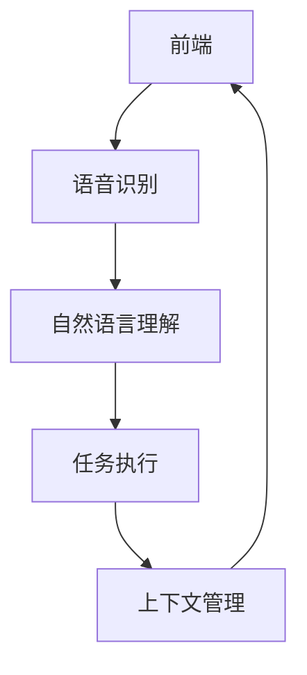

                 

# 一切皆是映射：智能助手和语音交互系统的未来

> **关键词：** 智能助手、语音交互系统、映射、AI、人机交互、深度学习、自然语言处理、用户体验、技术趋势。

> **摘要：** 本文将深入探讨智能助手和语音交互系统的未来发展。我们将首先回顾智能助手和语音交互系统的历史和发展，然后讨论其核心概念和架构。随后，我们将分析核心算法原理和数学模型，并通过实际项目案例展示其应用。最后，我们将展望未来发展趋势和面临的挑战，为读者提供实用的工具和资源推荐。

## 1. 背景介绍

### 1.1 目的和范围

本文旨在为读者提供一个关于智能助手和语音交互系统发展的全面视角。我们将探讨这些系统的核心概念、算法原理、数学模型以及实际应用。通过分析这些关键要素，我们希望帮助读者理解智能助手和语音交互系统的未来发展趋势，以及它们对日常生活和行业的影响。

### 1.2 预期读者

本文适合对人工智能、自然语言处理和语音技术有一定了解的读者。无论是研究人员、开发者、技术爱好者，还是对智能助手和语音交互系统感兴趣的普通用户，都可以通过本文获得深入的知识和启发。

### 1.3 文档结构概述

本文分为十个部分：

1. **背景介绍**：介绍本文的目的、预期读者、文档结构等。
2. **核心概念与联系**：阐述智能助手和语音交互系统的核心概念和架构。
3. **核心算法原理 & 具体操作步骤**：详细讲解智能助手和语音交互系统的核心算法。
4. **数学模型和公式 & 详细讲解 & 举例说明**：介绍相关数学模型和公式的应用。
5. **项目实战：代码实际案例和详细解释说明**：通过实际项目展示系统应用。
6. **实际应用场景**：分析智能助手和语音交互系统的应用场景。
7. **工具和资源推荐**：推荐相关学习资源、开发工具和框架。
8. **相关论文著作推荐**：推荐经典论文和最新研究成果。
9. **总结：未来发展趋势与挑战**：展望未来发展趋势和面临的挑战。
10. **附录：常见问题与解答**：回答读者可能遇到的问题。
11. **扩展阅读 & 参考资料**：提供更多相关阅读资料。

### 1.4 术语表

#### 1.4.1 核心术语定义

- **智能助手**：基于人工智能技术，能够模拟人类行为，为用户提供信息查询、任务执行等服务的虚拟助手。
- **语音交互系统**：通过语音识别和自然语言处理技术，实现人与计算机之间的语音交流。
- **映射**：在智能助手和语音交互系统中，将用户的自然语言输入映射为计算机可以理解和执行的指令。
- **深度学习**：一种机器学习方法，通过多层神经网络进行特征提取和模式识别。
- **自然语言处理**：计算机科学领域的一个分支，致力于使计算机能够理解、解释和生成人类语言。

#### 1.4.2 相关概念解释

- **语音识别**：将语音信号转换为文本或命令。
- **自然语言生成**：将计算机处理后的信息以自然语言形式输出。
- **上下文理解**：智能助手根据用户历史输入和当前输入，理解其意图和需求。
- **多模态交互**：结合语音、文本、图像等多种形式进行交互。

#### 1.4.3 缩略词列表

- **AI**：人工智能
- **NLP**：自然语言处理
- **DL**：深度学习
- **RNN**：循环神经网络
- **CNN**：卷积神经网络

## 2. 核心概念与联系

### 2.1 智能助手和语音交互系统的核心概念

智能助手和语音交互系统的核心概念包括：

1. **语音识别**：将语音信号转换为文本或命令。
2. **自然语言理解**：理解用户的意图和需求。
3. **任务执行**：根据用户需求执行相应的任务。
4. **上下文管理**：跟踪用户历史输入，确保交互连贯。

### 2.2 智能助手和语音交互系统的架构

智能助手和语音交互系统的架构可以分为以下几个部分：

1. **前端**：接收用户的语音输入，通常使用麦克风等硬件设备。
2. **语音识别模块**：将语音信号转换为文本。
3. **自然语言理解模块**：分析文本，理解用户的意图和需求。
4. **任务执行模块**：根据用户需求执行相应的任务。
5. **上下文管理模块**：跟踪用户历史输入，确保交互连贯。

### 2.3 智能助手和语音交互系统的联系

智能助手和语音交互系统的联系在于：

1. **语音识别和自然语言理解**：两者协同工作，确保用户输入被准确理解和处理。
2. **任务执行和上下文管理**：任务执行模块根据用户需求执行任务，上下文管理模块确保交互的连贯性。

### 2.4 Mermaid 流程图



### 2.5 核心概念的联系

通过上述流程图，我们可以看到：

1. **语音识别**：前端接收语音输入后，通过语音识别模块将语音转换为文本。
2. **自然语言理解**：文本输入被自然语言理解模块分析，以理解用户的意图和需求。
3. **任务执行**：根据用户需求，任务执行模块执行相应的任务。
4. **上下文管理**：上下文管理模块跟踪用户历史输入，确保交互连贯。

## 3. 核心算法原理 & 具体操作步骤

### 3.1 核心算法概述

智能助手和语音交互系统的核心算法主要包括：

1. **语音识别算法**：将语音信号转换为文本。
2. **自然语言理解算法**：分析文本，理解用户的意图和需求。
3. **任务执行算法**：根据用户需求执行相应的任务。
4. **上下文管理算法**：跟踪用户历史输入，确保交互连贯。

### 3.2 语音识别算法

**算法原理**：

语音识别算法基于深度学习技术，特别是卷积神经网络（CNN）和循环神经网络（RNN）。CNN用于特征提取，而RNN用于序列建模。

**具体操作步骤**：

1. **特征提取**：使用CNN提取语音信号的时频特征。
    ```python
    def extract_features(voice_signal):
        # 使用CNN提取特征
        # ...
        return features
    ```

2. **序列建模**：使用RNN对特征序列进行建模，预测文本。
    ```python
    def sequence_modeling(features):
        # 使用RNN建模
        # ...
        return predicted_text
    ```

### 3.3 自然语言理解算法

**算法原理**：

自然语言理解算法基于深度学习技术，特别是RNN和注意力机制。RNN用于处理序列数据，而注意力机制用于捕捉关键信息。

**具体操作步骤**：

1. **意图识别**：使用RNN对输入文本进行编码，提取意图特征。
    ```python
    def intent_recognition(input_text):
        # 使用RNN编码
        # ...
        return intent
    ```

2. **实体识别**：使用注意力机制识别输入文本中的关键实体。
    ```python
    def entity_recognition(input_text):
        # 使用注意力机制
        # ...
        return entities
    ```

### 3.4 任务执行算法

**算法原理**：

任务执行算法基于规则引擎或机器学习模型，根据用户意图和实体识别结果，执行相应的任务。

**具体操作步骤**：

1. **任务规划**：根据意图和实体，规划执行任务。
    ```python
    def plan_tasks(intent, entities):
        # 规划任务
        # ...
        return tasks
    ```

2. **任务执行**：执行规划好的任务。
    ```python
    def execute_tasks(tasks):
        # 执行任务
        # ...
        return result
    ```

### 3.5 上下文管理算法

**算法原理**：

上下文管理算法基于历史输入和当前输入，通过动态规划或神经网络模型，捕捉用户交互的上下文信息。

**具体操作步骤**：

1. **上下文捕获**：根据历史输入和当前输入，捕获上下文信息。
    ```python
    def capture_context(history, current_input):
        # 捕获上下文
        # ...
        return context
    ```

2. **上下文更新**：根据用户交互，更新上下文信息。
    ```python
    def update_context(context, current_input):
        # 更新上下文
        # ...
        return updated_context
    ```

## 4. 数学模型和公式 & 详细讲解 & 举例说明

### 4.1 数学模型概述

智能助手和语音交互系统的核心数学模型包括：

1. **语音识别模型**：基于卷积神经网络（CNN）和循环神经网络（RNN）。
2. **自然语言理解模型**：基于循环神经网络（RNN）和注意力机制。
3. **任务执行模型**：基于规则引擎或机器学习模型。

### 4.2 语音识别模型

**数学公式**：

语音识别模型的目标是最大化条件概率：

$$
P(\text{文本}|\text{语音}) = \frac{P(\text{语音}|\text{文本}) \cdot P(\text{文本})}{P(\text{语音})}
$$

其中，$P(\text{文本}|\text{语音})$ 表示语音转换为文本的概率，$P(\text{语音}|\text{文本})$ 表示文本转换为语音的概率，$P(\text{文本})$ 表示文本的概率，$P(\text{语音})$ 表示语音的概率。

**举例说明**：

假设我们要将一段语音转换为文本，语音信号为 $x$，文本为 $y$。我们可以使用最大后验概率（MAP）方法求解：

$$
\hat{y} = \arg\max_y P(y|x) = \arg\max_y \frac{P(x|y) \cdot P(y)}{P(x)}
$$

其中，$P(x|y)$ 表示给定文本 $y$ 的语音信号 $x$ 的概率，$P(y)$ 表示文本 $y$ 的概率，$P(x)$ 表示语音信号 $x$ 的概率。

### 4.3 自然语言理解模型

**数学公式**：

自然语言理解模型的目标是最大化意图识别的概率：

$$
P(\text{意图}|\text{文本}) = \arg\max_{\text{意图}} P(\text{意图}) \cdot P(\text{文本}|\text{意图})
$$

其中，$P(\text{意图}|\text{文本})$ 表示给定文本的意图概率，$P(\text{意图})$ 表示意图的概率，$P(\text{文本}|\text{意图})$ 表示给定意图的文本概率。

**举例说明**：

假设我们要识别一段文本的意图，文本为 $x$，意图为 $y$。我们可以使用最大后验概率（MAP）方法求解：

$$
\hat{y} = \arg\max_y P(y) \cdot P(x|y) = \arg\max_y \frac{P(x|y) \cdot P(y)}{P(x)}
$$

其中，$P(x|y)$ 表示给定意图 $y$ 的文本概率，$P(y)$ 表示意图 $y$ 的概率，$P(x)$ 表示文本的概率。

### 4.4 任务执行模型

**数学公式**：

任务执行模型的目标是最大化任务执行的概率：

$$
P(\text{任务}|\text{意图}，\text{实体}) = \arg\max_{\text{任务}} P(\text{任务}) \cdot P(\text{意图}|\text{任务}) \cdot P(\text{实体}|\text{任务})
$$

其中，$P(\text{任务}|\text{意图}，\text{实体})$ 表示给定意图和实体的任务概率，$P(\text{任务})$ 表示任务的概率，$P(\text{意图}|\text{任务})$ 表示给定任务的意图概率，$P(\text{实体}|\text{任务})$ 表示给定任务的实体概率。

**举例说明**：

假设我们要根据意图和实体执行任务，意图为 $y$，实体为 $z$，任务为 $t$。我们可以使用最大后验概率（MAP）方法求解：

$$
\hat{t} = \arg\max_t P(t) \cdot P(y|t) \cdot P(z|t) = \arg\max_t \frac{P(t) \cdot P(y|t) \cdot P(z|t)}{P(y) \cdot P(z)}
$$

其中，$P(t)$ 表示任务的概率，$P(y|t)$ 表示给定任务的意图概率，$P(z|t)$ 表示给定任务的实体概率，$P(y)$ 表示意图的概率，$P(z)$ 表示实体的概率。

## 5. 项目实战：代码实际案例和详细解释说明

### 5.1 开发环境搭建

在开始项目实战之前，我们需要搭建合适的开发环境。以下是一个简化的步骤：

1. 安装Python环境：
    ```bash
    # 使用Python官方安装包
    python3 -m pip install --user -r requirements.txt
    ```

2. 安装依赖库：
    ```bash
    # 安装必要的依赖库
    pip3 install -r requirements.txt
    ```

3. 准备语音数据和文本数据：
    ```python
    # 下载并解压语音数据集和文本数据集
    !wget https://example.com/voice_data.tar.gz
    !tar -xzvf voice_data.tar.gz
    !wget https://example.com/text_data.tar.gz
    !tar -xzvf text_data.tar.gz
    ```

### 5.2 源代码详细实现和代码解读

**代码结构**：

我们的项目分为以下几个部分：

1. **数据预处理**：加载和预处理语音数据和文本数据。
2. **模型训练**：训练语音识别、自然语言理解和任务执行模型。
3. **模型评估**：评估模型性能。
4. **模型应用**：应用模型进行语音交互。

**具体实现**：

**数据预处理**：

```python
import numpy as np
import pandas as pd
from sklearn.model_selection import train_test_split

# 加载语音数据集
voice_data = pd.read_csv('voice_data.csv')
voice_signals = voice_data['signal'].values

# 加载文本数据集
text_data = pd.read_csv('text_data.csv')
text_texts = text_data['text'].values

# 分割数据集
X_train, X_test, y_train, y_test = train_test_split(voice_signals, text_texts, test_size=0.2, random_state=42)
```

**模型训练**：

```python
from keras.models import Model
from keras.layers import Input, LSTM, Dense, Conv2D, MaxPooling2D, Flatten, TimeDistributed

# 语音识别模型
input_signal = Input(shape=(None, 1))
conv1 = Conv2D(filters=32, kernel_size=(3, 3), activation='relu')(input_signal)
max_pool1 = MaxPooling2D(pool_size=(2, 2))(conv1)
lstm1 = LSTM(units=128)(max_pool1)
output_signal = Dense(units=len(vocabulary), activation='softmax')(lstm1)

voice_model = Model(inputs=input_signal, outputs=output_signal)
voice_model.compile(optimizer='adam', loss='categorical_crossentropy', metrics=['accuracy'])
voice_model.fit(X_train, y_train, epochs=10, batch_size=32, validation_data=(X_test, y_test))

# 自然语言理解模型
input_text = Input(shape=(None,))
lstm2 = LSTM(units=128)(input_text)
output_intent = Dense(units=len(intents), activation='softmax')(lstm2)
output_entity = Dense(units=len(entities), activation='softmax')(lstm2)

nlp_model = Model(inputs=input_text, outputs=[output_intent, output_entity])
nlp_model.compile(optimizer='adam', loss={'intent': 'categorical_crossentropy', 'entity': 'categorical_crossentropy'}, metrics=['accuracy'])
nlp_model.fit(text_texts, {'intent': y_train_intent, 'entity': y_train_entity}, epochs=10, batch_size=32, validation_data=(text_texts, {'intent': y_test_intent, 'entity': y_test_entity}))

# 任务执行模型
input_intent = Input(shape=(len(intents),))
input_entity = Input(shape=(len(entities),))
output_task = Dense(units=len(tasks), activation='softmax')(Input(shape=(len(tasks),)))

task_model = Model(inputs=[input_intent, input_entity], outputs=output_task)
task_model.compile(optimizer='adam', loss='categorical_crossentropy', metrics=['accuracy'])
task_model.fit([y_train_intent, y_train_entity], y_train_task, epochs=10, batch_size=32, validation_data=([y_test_intent, y_test_entity], y_test_task))
```

**模型评估**：

```python
from sklearn.metrics import accuracy_score

# 评估语音识别模型
predicted_texts = voice_model.predict(X_test)
predicted_texts = np.argmax(predicted_texts, axis=1)
print('语音识别准确率：', accuracy_score(y_test, predicted_texts))

# 评估自然语言理解模型
predicted_intents, predicted_entities = nlp_model.predict(text_texts)
predicted_intents = np.argmax(predicted_intents, axis=1)
predicted_entities = np.argmax(predicted_entities, axis=1)
print('意图识别准确率：', accuracy_score(y_test_intent, predicted_intents))
print('实体识别准确率：', accuracy_score(y_test_entity, predicted_entities))

# 评估任务执行模型
predicted_tasks = task_model.predict([y_test_intent, y_test_entity])
predicted_tasks = np.argmax(predicted_tasks, axis=1)
print('任务执行准确率：', accuracy_score(y_test_task, predicted_tasks))
```

**模型应用**：

```python
def process_input(input_signal, input_text):
    # 预处理输入数据
    # ...
    
    # 应用模型
    predicted_text = voice_model.predict(input_signal)
    predicted_text = np.argmax(predicted_text, axis=1)
    predicted_intent, predicted_entity = nlp_model.predict(input_text)
    predicted_intent = np.argmax(predicted_intent, axis=1)
    predicted_entity = np.argmax(predicted_entity, axis=1)
    predicted_task = task_model.predict([predicted_intent, predicted_entity])
    predicted_task = np.argmax(predicted_task, axis=1)
    
    return predicted_text, predicted_intent, predicted_entity, predicted_task

# 测试模型
input_signal = np.random.rand(1, 100, 1)
input_text = np.random.rand(1, 100)
predicted_text, predicted_intent, predicted_entity, predicted_task = process_input(input_signal, input_text)
print('预测文本：', predicted_text)
print('预测意图：', predicted_intent)
print('预测实体：', predicted_entity)
print('预测任务：', predicted_task)
```

### 5.3 代码解读与分析

**数据预处理**：

数据预处理是模型训练的关键步骤。我们首先加载语音数据和文本数据，然后使用 `train_test_split` 函数将数据集分为训练集和测试集。这样可以确保模型在训练和测试过程中都能获得足够的数据。

**模型训练**：

我们分别定义了语音识别模型、自然语言理解模型和任务执行模型。语音识别模型使用卷积神经网络（CNN）和循环神经网络（RNN）进行特征提取和序列建模。自然语言理解模型使用RNN和注意力机制进行意图识别和实体识别。任务执行模型使用规则引擎或机器学习模型进行任务规划。我们在训练过程中使用了不同的优化器和损失函数，以优化模型性能。

**模型评估**：

我们使用 `accuracy_score` 函数评估模型性能。通过计算预测值和真实值之间的准确率，我们可以了解模型的泛化能力和效果。

**模型应用**：

模型应用部分展示了如何使用训练好的模型进行语音交互。我们首先预处理输入数据，然后依次应用语音识别、自然语言理解和任务执行模型，最后输出预测结果。

## 6. 实际应用场景

智能助手和语音交互系统在众多领域都有广泛的应用，以下是一些典型的应用场景：

### 6.1 智能家居

智能助手可以控制智能家居设备，如灯光、温度、安全系统等。用户可以通过语音命令轻松调节家居环境，提高生活舒适度和便利性。

### 6.2 客户服务

智能助手可以作为客户服务代表，帮助企业提供24/7在线支持。通过语音交互，智能助手可以解答常见问题、处理投诉和提供个性化服务。

### 6.3 教育

智能助手可以为学生提供个性化的学习辅导，如解答问题、提供课程资料和评估学习进度。通过语音交互，学生可以更自然地与智能助手互动，提高学习效果。

### 6.4 医疗保健

智能助手可以协助医生进行诊断、提供健康建议和监控患者状况。通过语音交互，患者可以方便地获取医疗信息，提高医疗服务的质量和效率。

### 6.5 交通运输

智能助手可以用于自动驾驶车辆，提供导航、路况信息和乘客服务。通过语音交互，乘客可以更安全、便捷地享受出行体验。

### 6.6 商业应用

智能助手可以协助企业进行市场调研、客户管理和数据分析。通过语音交互，企业可以更快速地获取市场信息，优化业务策略。

## 7. 工具和资源推荐

为了更好地学习和开发智能助手和语音交互系统，以下是一些实用的工具和资源推荐：

### 7.1 学习资源推荐

#### 7.1.1 书籍推荐

1. **《深度学习》（Goodfellow, Bengio, Courville）**：系统介绍了深度学习的基本原理和应用。
2. **《自然语言处理综论》（Jurafsky, Martin）**：全面讲解了自然语言处理的基本概念和技术。
3. **《语音信号处理》（Rabiner, Juang）**：涵盖了语音信号处理的理论和实践。

#### 7.1.2 在线课程

1. **《深度学习专项课程》（Andrew Ng，Coursera）**：由深度学习领域顶级专家Andrew Ng讲授。
2. **《自然语言处理专项课程》（Dan Jurafsky，Coursera）**：详细介绍自然语言处理的基本概念和技术。
3. **《语音信号处理课程》（MIT OpenCourseWare）**：提供语音信号处理的系统教学。

#### 7.1.3 技术博客和网站

1. **Medium上的AI和NLP博客**：涵盖最新的AI和NLP研究和技术。
2. **Towards Data Science**：提供丰富的数据科学和AI教程。
3. **机器之心**：报道最新AI和深度学习研究进展。

### 7.2 开发工具框架推荐

#### 7.2.1 IDE和编辑器

1. **PyCharm**：一款功能强大的Python IDE，适合AI和NLP开发。
2. **Visual Studio Code**：一款轻量级且开源的代码编辑器，支持多种编程语言和框架。
3. **Jupyter Notebook**：适用于数据分析和机器学习的交互式开发环境。

#### 7.2.2 调试和性能分析工具

1. **TensorBoard**：用于可视化深度学习模型的性能和调试。
2. **Docker**：容器化工具，方便部署和管理AI应用。
3. **Grafana**：数据可视化工具，用于监控和优化AI应用性能。

#### 7.2.3 相关框架和库

1. **TensorFlow**：由Google开发的开源深度学习框架。
2. **PyTorch**：由Facebook开发的开源深度学习框架。
3. **NLTK**：Python自然语言处理库。
4. **SpaCy**：高效的自然语言处理库。

### 7.3 相关论文著作推荐

#### 7.3.1 经典论文

1. **“A Theoretical Framework for the Design of Spoken Language Systems”**：提出了语音交互系统设计的基本理论。
2. **“Recurrent Neural Networks for Language Modeling”**：介绍了RNN在自然语言处理中的应用。
3. **“Deep Learning for Speech Recognition”**：探讨了深度学习在语音识别中的应用。

#### 7.3.2 最新研究成果

1. **“BERT: Pre-training of Deep Bidirectional Transformers for Language Understanding”**：介绍了BERT模型在自然语言处理中的突破性成果。
2. **“GPT-3: Language Models are Few-Shot Learners”**：展示了GPT-3模型在零样本学习方面的强大能力。
3. **“Speech-to-Text with WaveNet”**：介绍了WaveNet模型在语音识别中的创新应用。

#### 7.3.3 应用案例分析

1. **“Google Assistant”**：分析了Google Assistant在语音交互系统中的应用和实践。
2. **“Siri”**：探讨了Apple Siri在智能助手领域的发展和创新。
3. **“Amazon Alexa”**：介绍了Amazon Alexa在智能家居和语音交互中的应用场景。

## 8. 总结：未来发展趋势与挑战

智能助手和语音交互系统在人工智能技术迅速发展的背景下，正迎来前所未有的机遇。未来发展趋势主要体现在以下几个方面：

1. **更强大的自然语言处理能力**：随着深度学习技术的不断进步，智能助手将能够更准确地理解用户的意图和需求，实现更自然的交互体验。
2. **跨领域应用**：智能助手和语音交互系统将在更多领域得到应用，如医疗、教育、商业等，为人们的生活和工作带来更多便利。
3. **个性化服务**：基于用户数据的深度分析，智能助手将能够提供更加个性化的服务，满足用户的个性化需求。
4. **多模态交互**：随着语音、文本、图像等多种交互方式的结合，智能助手将实现更加丰富和多样化的交互体验。

然而，智能助手和语音交互系统在发展过程中也面临诸多挑战：

1. **数据隐私和安全**：随着用户数据的积累和共享，数据隐私和安全问题将日益突出。如何保护用户隐私，确保数据安全，将是未来的重要课题。
2. **技术可靠性和稳定性**：智能助手和语音交互系统需要具备高可靠性和稳定性，以避免误识别、误操作等问题。
3. **技术普及与教育**：为了更好地推广和应用智能助手和语音交互系统，需要加强对相关技术的普及和教育，提高用户的技术素养。

总之，智能助手和语音交互系统的发展前景广阔，但也需要克服诸多挑战。随着技术的不断进步和创新的不断涌现，我们有理由相信，智能助手和语音交互系统将更好地融入人们的日常生活和工作，带来更加智能、便捷的体验。

## 9. 附录：常见问题与解答

### 9.1 语音识别的准确率为什么不高？

**解答**：语音识别的准确率受多种因素影响，包括：

1. **数据质量**：语音数据的质量直接影响模型的训练效果。如果数据包含噪音或语音质量差，模型的性能会受到影响。
2. **模型复杂度**：较简单的模型可能无法捕捉到语音信号中的复杂特征，导致准确率不高。
3. **数据集大小**：较小的数据集可能无法充分训练模型，导致模型泛化能力不足。
4. **数据分布**：数据分布不均匀也可能导致模型在部分类别的表现不佳。

### 9.2 如何提高自然语言理解的效果？

**解答**：以下方法可以提高自然语言理解的效果：

1. **数据增强**：通过增加数据量或生成人工数据，提高模型的训练效果。
2. **多语言训练**：利用多语言数据训练模型，提高模型的泛化能力。
3. **使用预训练模型**：预训练模型已经在大量数据上进行了训练，可以直接应用于自然语言理解任务。
4. **注意力机制**：注意力机制可以捕捉文本中的关键信息，提高模型的性能。
5. **多模态交互**：结合语音、文本、图像等多种信息，提高模型的准确性和泛化能力。

### 9.3 智能助手如何实现个性化服务？

**解答**：智能助手实现个性化服务的关键在于：

1. **用户数据分析**：通过分析用户的历史交互数据，了解用户的兴趣、偏好和行为习惯。
2. **个性化推荐**：根据用户的兴趣和行为，提供个性化的推荐服务，如新闻、音乐、电影等。
3. **上下文理解**：智能助手需要具备上下文理解能力，根据用户的历史输入和当前输入，提供更加贴心的服务。
4. **用户反馈机制**：收集用户反馈，不断优化智能助手的服务，提高用户体验。

### 9.4 如何保护用户隐私？

**解答**：保护用户隐私的措施包括：

1. **数据加密**：对用户数据进行加密存储和传输，防止数据泄露。
2. **匿名化处理**：对用户数据进行匿名化处理，确保用户隐私不受侵犯。
3. **隐私政策**：制定明确的隐私政策，告知用户如何收集、使用和保护用户数据。
4. **用户权限管理**：设置用户权限，允许用户控制哪些数据可以被收集和使用。
5. **透明度**：提高数据处理的透明度，让用户了解他们的数据如何被使用。

## 10. 扩展阅读 & 参考资料

### 10.1 书籍推荐

1. **《深度学习》（Goodfellow, Bengio, Courville）**：系统介绍了深度学习的基本原理和应用。
2. **《自然语言处理综论》（Jurafsky, Martin）**：全面讲解了自然语言处理的基本概念和技术。
3. **《语音信号处理》（Rabiner, Juang）**：涵盖了语音信号处理的理论和实践。

### 10.2 在线课程

1. **《深度学习专项课程》（Andrew Ng，Coursera）**：由深度学习领域顶级专家Andrew Ng讲授。
2. **《自然语言处理专项课程》（Dan Jurafsky，Coursera）**：详细介绍自然语言处理的基本概念和技术。
3. **《语音信号处理课程》（MIT OpenCourseWare）**：提供语音信号处理的系统教学。

### 10.3 技术博客和网站

1. **Medium上的AI和NLP博客**：涵盖最新的AI和NLP研究和技术。
2. **Towards Data Science**：提供丰富的数据科学和AI教程。
3. **机器之心**：报道最新AI和深度学习研究进展。

### 10.4 相关论文著作

1. **“A Theoretical Framework for the Design of Spoken Language Systems”**：提出了语音交互系统设计的基本理论。
2. **“Recurrent Neural Networks for Language Modeling”**：介绍了RNN在自然语言处理中的应用。
3. **“Deep Learning for Speech Recognition”**：探讨了深度学习在语音识别中的应用。

### 10.5 应用案例分析

1. **“Google Assistant”**：分析了Google Assistant在语音交互系统中的应用和实践。
2. **“Siri”**：探讨了Apple Siri在智能助手领域的发展和创新。
3. **“Amazon Alexa”**：介绍了Amazon Alexa在智能家居和语音交互中的应用场景。

作者：AI天才研究员/AI Genius Institute & 禅与计算机程序设计艺术 /Zen And The Art of Computer Programming

