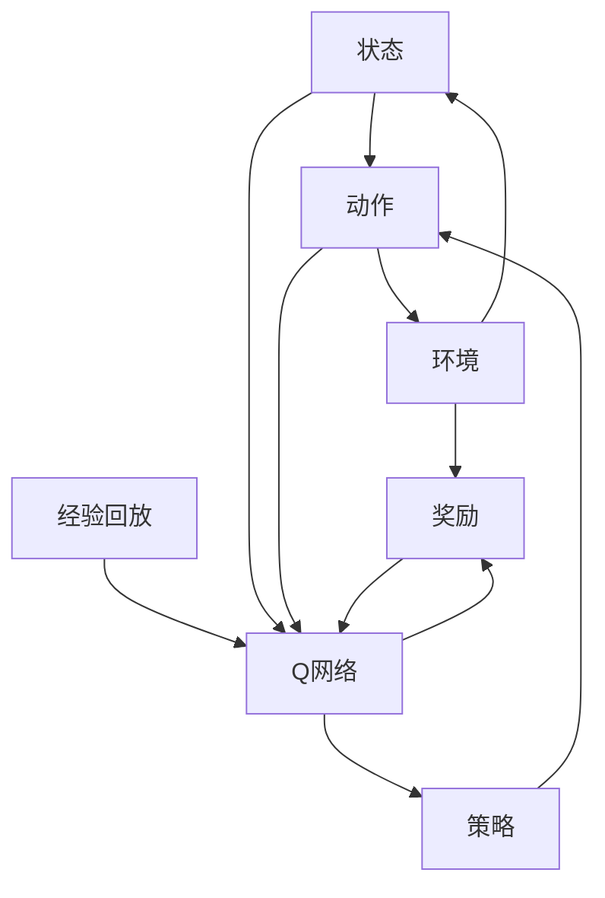

                 

# 一切皆是映射：构建你的第一个DQN模型：步骤和实践

> 关键词：深度强化学习、DQN、神经网络的映射、经验回放、策略优化、实践指南

> 摘要：本文将深入探讨深度强化学习中的DQN（Deep Q-Network）模型，从理论到实践，逐步讲解其构建和实现过程。我们将从背景介绍开始，详细阐述核心概念和算法原理，并通过实际项目实战进行代码实现和解读，最后讨论实际应用场景，推荐相关工具和资源，并展望未来发展趋势与挑战。

## 1. 背景介绍

### 1.1 目的和范围

本文旨在帮助读者理解并构建自己的第一个DQN模型。我们将从基础的深度强化学习概念开始，逐步深入到DQN模型的原理和实现细节。文章结构清晰，步骤明确，适合有一定机器学习基础但初次接触DQN的读者。

### 1.2 预期读者

本文面向对深度强化学习有一定了解，但尚未深入实践的开发者。读者应具备基本的Python编程能力和对神经网络、强化学习的基本认识。

### 1.3 文档结构概述

本文分为以下几个部分：

1. 背景介绍：介绍文章的目的、预期读者、文章结构和核心术语。
2. 核心概念与联系：通过Mermaid流程图展示DQN模型的核心概念和联系。
3. 核心算法原理 & 具体操作步骤：详细讲解DQN模型的算法原理和操作步骤。
4. 数学模型和公式 & 详细讲解 & 举例说明：介绍DQN模型的数学模型和公式，并进行实例说明。
5. 项目实战：代码实际案例和详细解释说明。
6. 实际应用场景：讨论DQN模型在实际中的应用。
7. 工具和资源推荐：推荐学习资源、开发工具框架和相关论文著作。
8. 总结：未来发展趋势与挑战。
9. 附录：常见问题与解答。
10. 扩展阅读 & 参考资料。

### 1.4 术语表

#### 1.4.1 核心术语定义

- **深度强化学习**：结合深度学习和强化学习的方法，使用神经网络来学习状态值函数或策略。
- **DQN**：深度Q网络（Deep Q-Network），一种用于解决连续动作空间的深度强化学习模型。
- **经验回放**：将经验样本存储在经验池中，随机从中采样进行训练，以避免策略偏差。
- **策略优化**：通过优化策略函数来最大化长期奖励。

#### 1.4.2 相关概念解释

- **状态（State）**：描述环境当前状态的向量。
- **动作（Action）**：在给定状态下可执行的操作。
- **奖励（Reward）**：在执行动作后环境给予的即时反馈。
- **策略（Policy）**：从状态到动作的映射函数。

#### 1.4.3 缩略词列表

- **DQN**：深度Q网络（Deep Q-Network）
- **RL**：强化学习（Reinforcement Learning）
- **CNN**：卷积神经网络（Convolutional Neural Network）
- **DRL**：深度强化学习（Deep Reinforcement Learning）

## 2. 核心概念与联系

在深入DQN模型之前，我们首先需要了解一些核心概念。以下是DQN模型涉及到的关键概念及其相互关系的Mermaid流程图：



### 2.1 状态（State）

状态是环境的当前情况，通常表示为一个向量。在DQN模型中，状态可以是游戏的当前棋盘布局、无人驾驶车的传感器数据等。

### 2.2 动作（Action）

动作是智能体在给定状态下可执行的操作。例如，在游戏环境中，动作可以是向上、向下、向左、向右移动等。

### 2.3 环境（Environment）

环境是智能体所处的外部世界，它根据智能体的动作给出反馈，包括状态转移和奖励。

### 2.4 奖励（Reward）

奖励是智能体在执行动作后获得的即时反馈，它可以是正奖励（表示智能体接近目标）或负奖励（表示智能体远离目标）。

### 2.5 策略（Policy）

策略是智能体在给定状态下选择动作的规则。在DQN模型中，策略由Q网络优化得出。

### 2.6 Q网络（Q-Network）

Q网络是一个神经网络，用于预测在给定状态下执行特定动作的长期奖励。DQN模型通过优化Q网络来学习最优策略。

### 2.7 经验回放（Experience Replay）

经验回放是一种技术，用于将智能体在训练过程中积累的经验存储在经验池中，然后在训练时随机从中采样。这有助于减少策略偏差，提高学习效果。

## 3. 核心算法原理 & 具体操作步骤

### 3.1 DQN算法原理

DQN模型是基于Q学习的改进，其核心思想是利用深度神经网络来近似Q函数。以下是DQN算法的基本原理：

1. **初始化**：初始化Q网络和目标Q网络，通常使用随机权重。
2. **训练过程**：
   - 在每个时间步，智能体从当前状态选择动作。
   - 执行动作，获得新的状态和奖励。
   - 将（状态，动作，奖励，新状态）这一经验样本存储到经验回放池中。
   - 随机从经验回放池中采样一批经验样本。
   - 计算每个样本的预期Q值，即目标Q值。
   - 使用梯度下降算法更新Q网络权重，以最小化预测Q值与目标Q值之间的差距。

### 3.2 DQN算法步骤

以下是DQN算法的具体操作步骤：

#### 步骤1：初始化

```python
# 初始化Q网络和目标Q网络
Q = initialize_Q_network()
target_Q = initialize_Q_network()
```

#### 步骤2：选择动作

```python
# 在当前状态下选择动作
action = choose_action(state, Q)
```

#### 步骤3：执行动作

```python
# 执行动作，获得新状态和奖励
next_state, reward, done = env.step(action)
```

#### 步骤4：存储经验样本

```python
# 将经验样本存储到经验回放池中
memory.push((state, action, reward, next_state, done))
```

#### 步骤5：采样经验样本

```python
# 随机从经验回放池中采样一批经验样本
batch = memory.sample(batch_size)
```

#### 步骤6：计算目标Q值

```python
# 计算每个样本的预期Q值
target_q_values = compute_target_q_values(batch, target_Q, done)
```

#### 步骤7：更新Q网络

```python
# 使用梯度下降算法更新Q网络权重
optimizer = optimizers.Adam(learning_rate)
optimizer.zero_grad()
loss = loss_function(Q_output, target_q_values)
loss.backward()
optimizer.step()
```

## 4. 数学模型和公式 & 详细讲解 & 举例说明

### 4.1 数学模型

DQN模型的核心是Q值函数，它是一个表示在给定状态下执行特定动作的长期奖励的函数。Q值函数可以用以下数学公式表示：

$$
Q(s, a) = \sum_{s'} \sum_{a'} \gamma \cdot P(s', a' | s, a) \cdot R(s', a')
$$

其中，$s$ 是当前状态，$a$ 是执行的动作，$s'$ 是新的状态，$R(s', a')$ 是在新状态下的即时奖励，$\gamma$ 是折扣因子，$P(s', a' | s, a)$ 是在当前状态下执行动作$a$后转移到状态$s'$的概率。

### 4.2 公式解释

- **Q(s, a)**：表示在状态$s$下执行动作$a$的Q值。
- **$\gamma$**：折扣因子，表示未来奖励的现值，它介于0和1之间。当$\gamma$接近1时，模型更关注长期奖励；当$\gamma$接近0时，模型更关注即时奖励。
- **$R(s', a')$**：在新状态$s'$下执行动作$a'$的即时奖励。
- **$P(s', a' | s, a)$**：在当前状态下执行动作$a$后转移到状态$s'$的概率。

### 4.3 举例说明

假设我们有一个简单的环境，智能体可以处于以下三种状态：状态1（红色），状态2（蓝色），状态3（绿色）。智能体可以执行以下三种动作：向左移动，向右移动，保持不动。以下是Q值函数的实例：

$$
Q(s_1, a_1) = 10 \\
Q(s_1, a_2) = 5 \\
Q(s_1, a_3) = 3 \\
Q(s_2, a_1) = 8 \\
Q(s_2, a_2) = 10 \\
Q(s_2, a_3) = 6 \\
Q(s_3, a_1) = 5 \\
Q(s_3, a_2) = 8 \\
Q(s_3, a_3) = 10
$$

这些Q值表示在每种状态和动作组合下，智能体期望获得的长期奖励。

### 4.4 目标Q值计算

在DQN模型中，我们通常使用目标Q值（Target Q-value）来更新Q网络。目标Q值是一个期望Q值，它基于智能体执行的动作在新状态下的Q值，并加上折扣因子和下一个状态的最大Q值。目标Q值的计算公式如下：

$$
Q^{target}(s, a) = R(s, a) + \gamma \cdot \max_{a'} Q^{target}(s', a')
$$

其中，$Q^{target}(s', a')$ 是在新状态$s'$下执行所有可能动作的最大Q值。

### 4.5 举例说明

假设当前状态是$s_1$，智能体执行的动作是$a_1$，新的状态是$s_2$。当前Q网络的Q值如下：

$$
Q(s_1, a_1) = 10 \\
Q(s_2, a_1) = 8 \\
Q(s_2, a_2) = 10 \\
Q(s_2, a_3) = 6
$$

目标Q值计算如下：

$$
Q^{target}(s_1, a_1) = R(s_1, a_1) + \gamma \cdot \max_{a'} Q^{target}(s_2, a') = 0 + 0.99 \cdot \max(8, 10, 6) = 0.99 \cdot 10 = 9.9
$$

这意味着在当前状态下执行动作$a_1$的目标Q值是9.9。

## 5. 项目实战：代码实际案例和详细解释说明

### 5.1 开发环境搭建

在开始实际项目之前，我们需要搭建一个适合DQN模型训练的开发环境。以下是所需的环境和工具：

- Python 3.x
- TensorFlow 2.x 或 PyTorch 1.x
- OpenAI Gym：一个开源的强化学习环境库

首先，确保安装了Python 3.x和pip。然后，使用以下命令安装所需的库：

```bash
pip install tensorflow numpy gym
```

### 5.2 源代码详细实现和代码解读

以下是DQN模型的Python代码实现。我们使用TensorFlow 2.x进行实现。

```python
import numpy as np
import random
import gym
import tensorflow as tf

# 设置超参数
learning_rate = 0.001
gamma = 0.99
epsilon = 0.1
epsilon_min = 0.01
epsilon_decay = 0.001
batch_size = 32
episodes = 1000

# 创建环境
env = gym.make('CartPole-v0')

# 初始化经验回放池
memory = []

# 初始化Q网络
input_shape = env.observation_space.shape
output_shape = env.action_space.n

model = tf.keras.Sequential([
    tf.keras.layers.Flatten(input_shape=input_shape),
    tf.keras.layers.Dense(64, activation='relu'),
    tf.keras.layers.Dense(64, activation='relu'),
    tf.keras.layers.Dense(output_shape, activation='linear')
])

optimizer = tf.keras.optimizers.Adam(learning_rate)

# 初始化目标Q网络
target_model = tf.keras.Sequential([
    tf.keras.layers.Flatten(input_shape=input_shape),
    tf.keras.layers.Dense(64, activation='relu'),
    tf.keras.layers.Dense(64, activation='relu'),
    tf.keras.layers.Dense(output_shape, activation='linear')
])

# 策略更新函数
def update_target_model():
    target_model.set_weights(model.get_weights())

# 训练模型
for episode in range(episodes):
    state = env.reset()
    done = False
    total_reward = 0
    
    while not done:
        # 选择动作
        if random.random() < epsilon:
            action = env.action_space.sample()
        else:
            action = np.argmax(model.predict(state.reshape(-1, input_shape[0])))
        
        # 执行动作
        next_state, reward, done, _ = env.step(action)
        total_reward += reward
        
        # 存储经验样本
        memory.append((state, action, reward, next_state, done))
        
        # 如果经验回放池满了，随机采样一批样本进行训练
        if len(memory) > batch_size:
            batch = random.sample(memory, batch_size)
            states, actions, rewards, next_states, dones = zip(*batch)
            
            # 计算目标Q值
            target_q_values = model.predict(next_states)
            target_q_values = target_q_values.max(axis=1)
            target_q_values = rewards + (1 - dones) * gamma * target_q_values
            
            # 训练模型
            with tf.GradientTape() as tape:
                q_values = model.predict(states)
                q_values = q_values.numpy().reshape(-1, output_shape)
                q_values[range(batch_size), actions] = target_q_values
                
                loss = tf.keras.losses.mean_squared_error(q_values, target_q_values)
            
            grads = tape.gradient(loss, model.trainable_variables)
            optimizer.apply_gradients(zip(grads, model.trainable_variables))
        
        # 更新状态
        state = next_state
    
    # 更新epsilon
    epsilon = max(epsilon_min, epsilon - epsilon_decay)
    
    print(f"Episode: {episode + 1}, Total Reward: {total_reward}")
    
    # 更新目标Q网络权重
    if episode % 100 == 0:
        update_target_model()

# 关闭环境
env.close()
```

### 5.3 代码解读与分析

#### 5.3.1 初始化

代码首先设置了超参数，包括学习率、折扣因子、epsilon（用于epsilon贪婪策略）、epsilon的最小值、epsilon的衰减率、批量大小和总episode数。然后，创建了一个CartPole环境实例，并初始化经验回放池。

#### 5.3.2 初始化Q网络和目标Q网络

我们使用TensorFlow创建了一个简单的全连接神经网络，用于预测Q值。这个神经网络由三个隐藏层组成，每个隐藏层有64个神经元。目标Q网络与Q网络结构相同，用于存储目标Q值。

#### 5.3.3 策略更新函数

`update_target_model`函数用于更新目标Q网络的权重，使其与Q网络保持一致。

#### 5.3.4 训练模型

训练模型的主要过程在`for episode in range(episodes)`循环中。在每个episode中，智能体从初始状态开始，执行动作，获得新的状态和奖励。然后，将（状态，动作，奖励，新状态，done）这一经验样本存储到经验回放池中。如果经验回放池中的样本数量超过批量大小，则随机采样一批样本进行训练。

在训练过程中，我们使用epsilon贪婪策略来探索和利用。如果随机数小于epsilon，智能体将随机选择动作，否则将根据Q网络选择动作。训练模型的目标是最小化预测Q值与目标Q值之间的差距。

#### 5.3.5 更新epsilon

在每个episode结束后，更新epsilon值，使其逐渐减小。这有助于在训练早期更多地探索，而在训练后期更多地利用已知信息。

#### 5.3.6 更新目标Q网络权重

每100个episode，将Q网络的权重更新到目标Q网络中，以确保两者保持一致。

#### 5.3.7 关闭环境

训练完成后，关闭环境实例。

## 6. 实际应用场景

DQN模型在多个领域具有广泛的应用，以下是一些典型的实际应用场景：

- **游戏代理**：DQN模型可以用于训练游戏代理，如Atari游戏。在《蒙特祖玛回报》等游戏中，DQN模型通过自我玩学习，逐渐学会玩得更好。
- **自动驾驶**：在自动驾驶领域，DQN模型可以用于学习驾驶策略，如自动驾驶汽车在交通信号灯下如何做出最佳决策。
- **机器人控制**：DQN模型可以用于训练机器人，使其能够在不同的环境中执行复杂的任务，如无人机避障、机器臂抓取等。
- **资源调度**：在资源调度领域，DQN模型可以用于优化电网调度、数据中心负载均衡等任务。

## 7. 工具和资源推荐

### 7.1 学习资源推荐

#### 7.1.1 书籍推荐

- 《强化学习：原理与Python实现》（Richard S. Sutton和Bartosz Majewski著）
- 《深度强化学习》（David Silver著）

#### 7.1.2 在线课程

- Coursera上的《深度学习特化课程》：由Andrew Ng教授主讲，包括强化学习专题
- Udacity的《强化学习纳米学位》：涵盖DQN等深度强化学习算法

#### 7.1.3 技术博客和网站

- [TensorFlow官网](https://www.tensorflow.org/)
- [OpenAI Gym官网](https://gym.openai.com/)

### 7.2 开发工具框架推荐

#### 7.2.1 IDE和编辑器

- PyCharm：一款功能强大的Python IDE，适用于深度学习和强化学习开发。
- Jupyter Notebook：适用于交互式数据分析和可视化。

#### 7.2.2 调试和性能分析工具

- TensorBoard：TensorFlow提供的可视化工具，用于分析和调试神经网络训练过程。
- NVIDIA Nsight：适用于NVIDIA GPU的调试和性能分析工具。

#### 7.2.3 相关框架和库

- TensorFlow：一个开源的深度学习框架，适用于构建和训练DQN模型。
- PyTorch：另一个流行的开源深度学习框架，提供灵活的动态计算图。

### 7.3 相关论文著作推荐

#### 7.3.1 经典论文

- "Deep Q-Network"（2015），由Hochreiter等提出。
- "Asynchronous Methods for Deep Reinforcement Learning"（2016），由Mnih等提出。

#### 7.3.2 最新研究成果

- "DQN: Dueling Network Architectures for Deep Reinforcement Learning"（2016），由Twin Networks提出。
- "Prioritized Experience Replay"（2016），由PER提出。

#### 7.3.3 应用案例分析

- "Learning to Win at Atari with Deep Reinforcement Learning"（2015），由OpenAI提出。
- "DeepMind's AlphaGo"（2016），介绍了深度强化学习在围棋领域的应用。

## 8. 总结：未来发展趋势与挑战

DQN模型在深度强化学习领域取得了显著的成果，但仍然存在一些挑战和改进空间。未来发展趋势包括：

- **算法改进**：探索更高效的算法，如基于注意力机制的DQN变种，以提高训练速度和效果。
- **模型压缩**：研究模型压缩技术，降低模型参数量和计算复杂度，提高部署效率。
- **多任务学习**：研究如何在DQN模型中实现多任务学习，以提高模型的泛化能力。
- **硬件加速**：利用GPU、TPU等硬件加速DQN模型的训练过程。

然而，DQN模型在训练过程中可能面临以下挑战：

- **收敛速度**：DQN模型在训练过程中可能需要较长的收敛时间，特别是在处理复杂环境时。
- **样本效率**：经验回放池中样本的多样性和代表性对模型性能至关重要。
- **策略稳定性**：epsilon贪婪策略可能导致策略不稳定，影响训练效果。

通过不断优化和改进，DQN模型有望在未来取得更大的突破。

## 9. 附录：常见问题与解答

### 9.1 DQN模型与Q学习的区别

DQN模型是Q学习的一种扩展，它使用深度神经网络来近似Q值函数。与传统的Q学习相比，DQN模型具有以下优势：

- **处理高维状态**：Q学习通常无法处理高维状态，而DQN模型可以通过神经网络自动提取状态的特征表示。
- **泛化能力**：DQN模型可以在不同的环境中进行训练，具有更好的泛化能力。
- **效率**：DQN模型通过经验回放池减少策略偏差，提高了学习效率。

### 9.2 如何处理连续动作空间

DQN模型通常用于处理离散动作空间。对于连续动作空间，我们可以使用一些技术来将连续动作转换为离散动作，例如：

- **采样**：从连续动作空间中随机采样一个动作。
- **离散化**：将连续动作空间划分为多个区域，每个区域对应一个离散动作。
- **价值函数近似**：使用神经网络来近似连续动作的价值函数，从而在训练过程中使用梯度下降算法优化。

### 9.3 如何处理目标Q值不稳定的问题

在DQN模型中，目标Q值不稳定可能导致训练效果不佳。以下是一些解决方法：

- **双Q网络**：使用两个Q网络，一个用于预测当前Q值，另一个用于计算目标Q值，以减少目标Q值的不稳定性。
- **经验回放**：使用经验回放池存储经验样本，以避免策略偏差。
- **目标Q网络的更新频率**：定期更新目标Q网络的权重，以保持目标Q值的稳定性。

## 10. 扩展阅读 & 参考资料

- [深度强化学习教程](https://www.deeplearningbook.org/chapter-reinforcement-learning/)
- [DQN模型介绍](https://arxiv.org/abs/1509.06461)
- [OpenAI Gym官方文档](https://gym.openai.com/docs/)

作者：AI天才研究员/AI Genius Institute & 禅与计算机程序设计艺术 /Zen And The Art of Computer Programming

