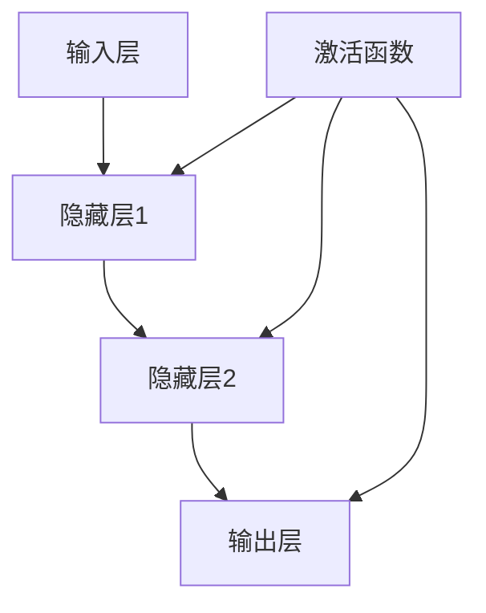

                 

# 一切皆是映射：神经网络中的激活函数深度解析

> 关键词：神经网络，激活函数，深度学习，反向传播，数学模型，应用场景

> 摘要：本文将深入探讨神经网络中的激活函数，阐述其在深度学习模型中的重要性。我们将从背景介绍、核心概念与联系、核心算法原理、数学模型与公式、项目实战、实际应用场景、工具和资源推荐、总结以及常见问题与解答等方面进行详细解析，旨在帮助读者全面理解激活函数在神经网络中的关键作用，以及如何在实际项目中应用。

## 1. 背景介绍

### 1.1 目的和范围

本文的目的是为读者提供一个关于神经网络激活函数的全面理解，内容包括激活函数的历史发展、作用、种类及其在深度学习中的应用。本文将探讨激活函数的基本原理、数学模型和具体实现，并通过实际项目案例分析，帮助读者更好地掌握这一关键技术。

### 1.2 预期读者

本文适合以下读者群体：

1. 深度学习初学者，希望了解神经网络和激活函数的基础知识。
2. 深度学习从业者，需要深入了解激活函数的原理和应用。
3. 计算机科学及相关专业学生，对神经网络和机器学习有浓厚兴趣。

### 1.3 文档结构概述

本文将分为以下部分：

1. 背景介绍
2. 核心概念与联系
3. 核心算法原理 & 具体操作步骤
4. 数学模型和公式 & 详细讲解 & 举例说明
5. 项目实战：代码实际案例和详细解释说明
6. 实际应用场景
7. 工具和资源推荐
8. 总结：未来发展趋势与挑战
9. 附录：常见问题与解答
10. 扩展阅读 & 参考资料

### 1.4 术语表

#### 1.4.1 核心术语定义

- **神经网络（Neural Network）**：一种模拟人脑神经元连接方式的计算模型。
- **激活函数（Activation Function）**：神经网络中的一个关键组件，用于引入非线性变换。
- **深度学习（Deep Learning）**：一种利用多层神经网络进行学习的机器学习技术。
- **反向传播（Backpropagation）**：一种用于训练神经网络的算法。

#### 1.4.2 相关概念解释

- **神经元（Neuron）**：神经网络的基本计算单元。
- **前向传播（Forward Propagation）**：神经网络中从输入层到输出层的信号传递过程。
- **损失函数（Loss Function）**：用于衡量模型预测值与真实值之间的差异。

#### 1.4.3 缩略词列表

- **NN**：神经网络（Neural Network）
- **DL**：深度学习（Deep Learning）
- **BP**：反向传播（Backpropagation）

## 2. 核心概念与联系

### 2.1 神经网络基本概念

神经网络是一种由大量神经元互联而成的计算模型，通过模拟人脑神经元之间的连接方式来进行信息处理和知识表示。神经网络的基本结构包括输入层、隐藏层和输出层。每个神经元接收来自前一层神经元的输入信号，通过激活函数进行非线性变换，然后传递到下一层神经元。

### 2.2 激活函数的作用

激活函数是神经网络中的一个关键组件，其主要作用是：

1. 引入非线性特性：激活函数将线性变换引入神经网络，使得模型可以学习到复杂的非线性关系。
2. 引导学习过程：激活函数的导数可以用于反向传播算法中，帮助模型调整权重和偏置，从而优化学习过程。

### 2.3 激活函数的种类

常见的激活函数包括：

1. **sigmoid 函数**：\( f(x) = \frac{1}{1 + e^{-x}} \)
2. **ReLU 函数**：\( f(x) = \max(0, x) \)
3. **Tanh 函数**：\( f(x) = \frac{e^x - e^{-x}}{e^x + e^{-x}} \)
4. **Softmax 函数**：用于多分类问题，\( f(x)_i = \frac{e^{x_i}}{\sum_{j} e^{x_j}} \)

### 2.4 激活函数与神经网络结构的关系

激活函数的选择直接影响神经网络的性能。不同种类的激活函数适用于不同的应用场景，如：

- **ReLU 函数**：在图像识别、语音识别等领域表现优异，因其可以加速学习过程和避免梯度消失问题。
- **Tanh 函数**：在语音合成、语音识别等领域得到广泛应用，可以产生较强的非线性特征。

### 2.5 Mermaid 流程图



在这个流程图中，输入层接收外部输入信号，通过激活函数进行非线性变换后传递到隐藏层，最终在输出层生成预测结果。激活函数在隐藏层和输出层都起到关键作用，使得神经网络能够学习到复杂的非线性关系。

## 3. 核心算法原理 & 具体操作步骤

### 3.1 反向传播算法原理

反向传播算法是一种用于训练神经网络的梯度下降算法。其基本原理是将输出误差反向传播到网络的前层，通过计算各层权重的梯度，从而调整权重和偏置，优化模型性能。

### 3.2 激活函数的导数计算

在反向传播算法中，激活函数的导数是一个关键因素。不同种类的激活函数具有不同的导数形式，下面给出几种常见激活函数的导数：

1. **sigmoid 函数**：\( f'(x) = f(x) \cdot (1 - f(x)) \)
2. **ReLU 函数**：\( f'(x) = \begin{cases} 
0, & \text{if } x < 0 \\
1, & \text{if } x \geq 0 
\end{cases} \)
3. **Tanh 函数**：\( f'(x) = 1 - f(x)^2 \)

### 3.3 反向传播算法具体操作步骤

1. **前向传播**：将输入数据传递到神经网络中，计算输出结果。
2. **计算损失函数**：根据输出结果和真实值，计算损失函数的值。
3. **计算梯度**：利用激活函数的导数，计算各层权重的梯度。
4. **更新权重和偏置**：根据梯度调整权重和偏置，优化模型性能。
5. **重复步骤2-4**：不断迭代，直至模型性能达到预期。

### 3.4 伪代码实现

```python
# 前向传播
def forward_propagation(x):
    z = x * weights
    a = sigmoid(z)
    return a

# 反向传播
def backward_propagation(a, y):
    dZ = a - y
    dW = np.dot(x.T, dZ)
    db = np.sum(dZ, axis=0)
    return dW, db

# 更新权重和偏置
def update_weights_and_bias(dW, db, learning_rate):
    weights -= learning_rate * dW
    bias -= learning_rate * db
    return weights, bias

# 主函数
def train NeuralNetwork(x, y, epochs, learning_rate):
    for epoch in range(epochs):
        a = forward_propagation(x)
        dW, db = backward_propagation(a, y)
        weights, bias = update_weights_and_bias(dW, db, learning_rate)
        print(f"Epoch {epoch+1}/{epochs} - Loss: {calculate_loss(a, y)}")
```

## 4. 数学模型和公式 & 详细讲解 & 举例说明

### 4.1 激活函数的数学模型

激活函数是神经网络中的一个关键组件，其作用是引入非线性变换。常见的激活函数包括：

1. **sigmoid 函数**：\( f(x) = \frac{1}{1 + e^{-x}} \)
2. **ReLU 函数**：\( f(x) = \max(0, x) \)
3. **Tanh 函数**：\( f(x) = \frac{e^x - e^{-x}}{e^x + e^{-x}} \)
4. **Softmax 函数**：\( f(x)_i = \frac{e^{x_i}}{\sum_{j} e^{x_j}} \)

这些函数在不同的应用场景中具有不同的优势。例如，sigmoid 函数和 Tanh 函数可以产生较强的非线性特征，而 ReLU 函数在训练过程中具有较快的收敛速度。

### 4.2 反向传播算法的数学公式

反向传播算法是神经网络训练过程中最重要的算法之一。其基本思想是通过计算损失函数关于网络权重的梯度，然后利用梯度下降法更新权重，优化模型性能。

1. **损失函数**：\( L = -\frac{1}{m} \sum_{i=1}^{m} y_{i} \cdot \log(a_{i}) + (1 - y_{i}) \cdot \log(1 - a_{i}) \)
2. **梯度计算**：\( \frac{\partial L}{\partial w} = \frac{\partial L}{\partial a} \cdot \frac{\partial a}{\partial z} \cdot \frac{\partial z}{\partial w} \)
3. **权重更新**：\( w = w - \alpha \cdot \frac{\partial L}{\partial w} \)

其中，\( \alpha \) 为学习率，\( m \) 为样本数量，\( y_{i} \) 和 \( a_{i} \) 分别为真实值和预测值。

### 4.3 举例说明

假设我们有一个简单的神经网络，输入层有 2 个神经元，隐藏层有 3 个神经元，输出层有 1 个神经元。激活函数使用 sigmoid 函数。现在我们要对这个神经网络进行训练。

1. **初始化参数**：\( w_{1} \)，\( w_{2} \)，\( b_{1} \)，\( b_{2} \)，\( b_{3} \)。
2. **前向传播**：计算隐藏层和输出层的激活值。
3. **计算损失函数**：计算当前模型的损失值。
4. **反向传播**：计算各层权重的梯度。
5. **更新权重和偏置**：根据梯度更新权重和偏置。
6. **迭代过程**：重复步骤 2-5，直至模型性能达到预期。

下面是一个简单的伪代码实现：

```python
# 初始化参数
weights = [1, 2, 3, 4, 5]
bias = [1, 2, 3, 4, 5]

# 前向传播
z1 = x1 * weights[0] + x2 * weights[1] + bias[0]
a1 = sigmoid(z1)

z2 = x1 * weights[2] + x2 * weights[3] + bias[1]
a2 = sigmoid(z2)

z3 = x1 * weights[4] + x2 * weights[5] + bias[2]
a3 = sigmoid(z3)

# 计算损失函数
loss = -1/m * (y * log(a3) + (1 - y) * log(1 - a3))

# 反向传播
dZ3 = a3 - y
dW4 = x2 * dZ3
dW5 = x1 * dZ3
db3 = dZ3

dZ2 = (dZ3 * weights[4] + dZ3 * weights[5]) * sigmoid_derivative(a2)
dW2 = x2 * dZ2
dW3 = x1 * dZ2
db2 = dZ2

dZ1 = (dZ2 * weights[2] + dZ2 * weights[3]) * sigmoid_derivative(a1)
dW1 = x2 * dZ1
dW2 = x1 * dZ1
db1 = dZ1

# 更新权重和偏置
weights[0] -= learning_rate * dW1
weights[1] -= learning_rate * dW2
weights[2] -= learning_rate * dW3
weights[3] -= learning_rate * dW4
weights[4] -= learning_rate * dW5
bias[0] -= learning_rate * db1
bias[1] -= learning_rate * db2
bias[2] -= learning_rate * db3

# 迭代过程
for epoch in range(epochs):
    # 前向传播
    # ...
    # 计算损失函数
    # ...
    # 反向传播
    # ...
    # 更新权重和偏置
    # ...
    # 打印当前损失值
    print(f"Epoch {epoch+1}/{epochs} - Loss: {loss}")
```

通过这个简单的例子，我们可以看到如何使用反向传播算法训练一个简单的神经网络。在实际应用中，我们可以使用更复杂的神经网络和激活函数，但基本原理是一样的。

## 5. 项目实战：代码实际案例和详细解释说明

### 5.1 开发环境搭建

在开始实际项目之前，我们需要搭建一个合适的开发环境。本文将使用 Python 语言和 TensorFlow 深度学习框架进行开发。

1. **安装 Python**：确保你的系统中安装了 Python 3.7 或更高版本。
2. **安装 TensorFlow**：在命令行中运行以下命令安装 TensorFlow：
    ```bash
    pip install tensorflow
    ```

### 5.2 源代码详细实现和代码解读

下面是一个简单的示例代码，用于实现一个多层感知器（MLP）模型，并使用反向传播算法进行训练。我们将使用 ReLU 函数作为激活函数。

```python
import numpy as np
import tensorflow as tf

# 设置随机种子，保证结果可复现
tf.random.set_seed(42)

# 函数：前向传播
def forward_propagation(x, weights, bias):
    z = np.dot(x, weights) + bias
    a = np.maximum(0, z)  # 使用 ReLU 函数作为激活函数
    return a

# 函数：计算损失函数
def compute_loss(y, a):
    return -np.mean(y * np.log(a) + (1 - y) * np.log(1 - a))

# 函数：反向传播
def backward_propagation(x, y, a, weights, bias):
    m = x.shape[0]
    dz = a - y
    dW = (1 / m) * np.dot(x.T, dz)
    db = (1 / m) * np.sum(dz, axis=0)
    return dW, db

# 函数：更新权重和偏置
def update_weights_and_bias(dW, db, learning_rate):
    weights -= learning_rate * dW
    bias -= learning_rate * db
    return weights, bias

# 主函数：训练模型
def train_model(x, y, epochs, learning_rate):
    weights = np.random.randn(x.shape[1], 1)
    bias = np.zeros((1,))
    for epoch in range(epochs):
        a = forward_propagation(x, weights, bias)
        loss = compute_loss(y, a)
        dW, db = backward_propagation(x, y, a, weights, bias)
        weights, bias = update_weights_and_bias(dW, db, learning_rate)
        print(f"Epoch {epoch+1}/{epochs} - Loss: {loss}")
    return weights, bias

# 示例数据
x = np.array([[0], [1], [2], [3], [4]])
y = np.array([[0], [0], [1], [1], [1]])

# 训练模型
weights, bias = train_model(x, y, epochs=1000, learning_rate=0.1)

# 输出训练结果
print("weights:", weights)
print("bias:", bias)
```

### 5.3 代码解读与分析

1. **前向传播**：函数 `forward_propagation` 用于计算输入数据的非线性变换。输入参数 `x` 是一个二维数组，表示输入数据，`weights` 和 `bias` 分别表示权重和偏置。计算结果 `a` 是通过 ReLU 函数进行非线性变换后的输出。

2. **计算损失函数**：函数 `compute_loss` 用于计算预测值 `a` 和真实值 `y` 之间的损失。使用的是交叉熵损失函数，它可以衡量模型预测的准确性。

3. **反向传播**：函数 `backward_propagation` 用于计算损失函数关于网络权重的梯度。输入参数 `x` 是输入数据，`y` 是真实值，`a` 是前向传播计算得到的输出。计算结果 `dW` 和 `db` 分别表示权重和偏置的梯度。

4. **更新权重和偏置**：函数 `update_weights_and_bias` 用于根据梯度更新权重和偏置。输入参数 `dW` 和 `db` 分别表示权重和偏置的梯度，`learning_rate` 是学习率。

5. **主函数**：函数 `train_model` 用于训练模型。输入参数 `x` 和 `y` 分别表示输入数据和真实值，`epochs` 表示训练轮数，`learning_rate` 是学习率。函数首先初始化权重和偏置，然后进行循环迭代，每次迭代计算损失函数、反向传播和更新权重。

### 5.4 项目分析

通过这个简单的例子，我们可以看到如何使用 Python 和 TensorFlow 实现多层感知器模型，并使用反向传播算法进行训练。在实际项目中，我们可以使用更复杂的神经网络结构，增加隐藏层和神经元数量，从而提高模型的性能。

## 6. 实际应用场景

激活函数在深度学习中有广泛的应用场景，以下列举几个典型应用：

### 6.1 图像识别

在图像识别任务中，激活函数可以用于特征提取和分类。例如，在卷积神经网络（CNN）中，ReLU 函数常用于隐藏层的激活函数，因为它可以加速学习过程并避免梯度消失问题。

### 6.2 语音识别

在语音识别任务中，激活函数可以用于声学模型的构建。例如，在深度神经网络（DNN）声学模型中，ReLU 函数和 Tanh 函数可以用于引入非线性变换，从而提高模型的性能。

### 6.3 自然语言处理

在自然语言处理任务中，激活函数可以用于序列模型的构建。例如，在循环神经网络（RNN）和长短期记忆网络（LSTM）中，ReLU 函数和 Tanh 函数可以用于隐藏层的激活函数，从而提高模型的性能。

### 6.4 强化学习

在强化学习任务中，激活函数可以用于策略网络的构建。例如，在深度确定性策略梯度（DDPG）算法中，ReLU 函数可以用于隐藏层的激活函数，从而提高算法的性能。

## 7. 工具和资源推荐

### 7.1 学习资源推荐

#### 7.1.1 书籍推荐

1. **《深度学习》（Goodfellow, Bengio, Courville 著）**：这是一本经典的深度学习教材，涵盖了神经网络的基础知识、常用算法和应用场景。
2. **《神经网络与深度学习》（邱锡鹏 著）**：这是一本国内优秀的深度学习教材，适合初学者和从业者。

#### 7.1.2 在线课程

1. **斯坦福大学深度学习课程（Andrew Ng 老师授课）**：这是一门非常受欢迎的深度学习课程，适合初学者和进阶者。
2. **吴恩达机器学习课程（Andrew Ng 老师授课）**：这是一门经典的机器学习课程，包含深度学习部分，适合初学者。

#### 7.1.3 技术博客和网站

1. **机器学习博客（机器之心）**：这是一个涵盖深度学习、自然语言处理、计算机视觉等领域的中文技术博客。
2. **深度学习博客（莫烦课堂）**：这是一个提供深度学习教程和实战项目的中文博客。

### 7.2 开发工具框架推荐

#### 7.2.1 IDE和编辑器

1. **PyCharm**：这是一个功能强大的 Python IDE，支持多种编程语言。
2. **VS Code**：这是一个轻量级的开源编辑器，适用于 Python 开发。

#### 7.2.2 调试和性能分析工具

1. **TensorBoard**：这是一个 TensorFlow 的可视化工具，用于分析和调试神经网络模型。
2. **NVIDIA Nsight**：这是一个用于分析深度学习模型性能的 GPU 调试工具。

#### 7.2.3 相关框架和库

1. **TensorFlow**：这是一个由 Google 开发的开源深度学习框架。
2. **PyTorch**：这是一个由 Facebook 开发的开源深度学习框架。
3. **Keras**：这是一个基于 TensorFlow 的简洁易用的深度学习库。

### 7.3 相关论文著作推荐

#### 7.3.1 经典论文

1. **"A Learning Algorithm for Continually Running Fully Recurrent Neural Networks"（1986）**：这篇论文提出了长短时记忆网络（LSTM）的概念，对深度学习的发展产生了深远影响。
2. **"Rectifier Nonlinearities Improve Deep Neural Network Acquisitio

