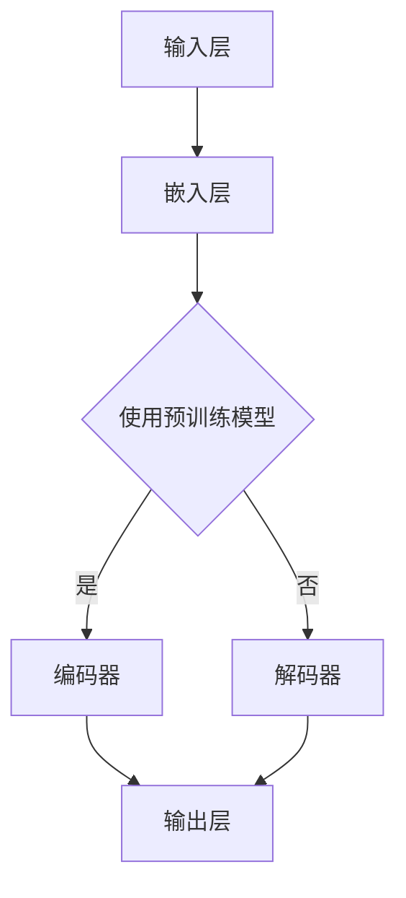
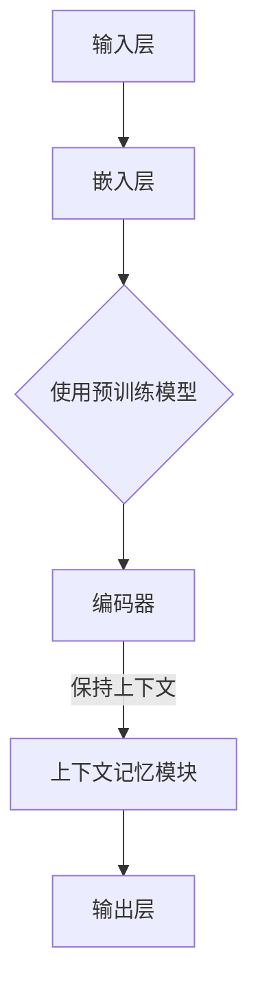
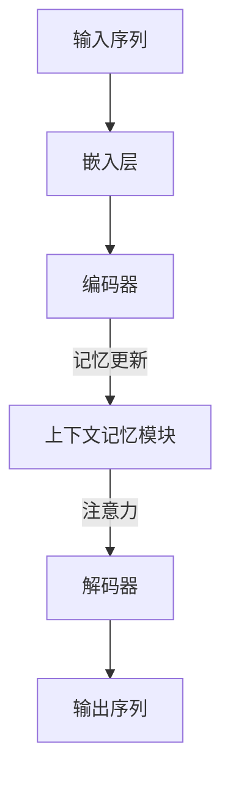

                 

# 上下文记忆：LLM 的长处

> **关键词：** 上下文记忆、LLM、语言模型、神经网络、深度学习、信息检索、对话系统、自然语言处理。

> **摘要：** 本文将深入探讨上下文记忆在大型语言模型（LLM）中的重要性。通过解释上下文记忆的概念和其在LLM中的应用，我们将揭示LLM在处理复杂自然语言任务时的优势。此外，本文还将通过实际项目和数学模型来阐述上下文记忆的具体实现方法，并提供实用的工具和资源推荐，以帮助读者进一步了解和掌握这一关键技术。

## 1. 背景介绍

### 1.1 目的和范围

本文旨在探讨上下文记忆在大型语言模型（LLM）中的重要性，并深入分析其在自然语言处理（NLP）领域的应用。随着深度学习技术的不断发展，LLM已成为现代NLP领域的重要工具。然而，传统的LLM在处理长序列文本和复杂对话任务时往往面临挑战。上下文记忆作为一种增强LLM性能的技术，能够有效解决这些问题。

本文将涵盖以下内容：

1. 对上下文记忆的概念进行定义和解释；
2. 分析上下文记忆在LLM中的应用和优势；
3. 通过实际项目和数学模型来阐述上下文记忆的实现方法；
4. 推荐相关工具和资源，以帮助读者深入了解和掌握上下文记忆技术。

### 1.2 预期读者

本文主要面向以下读者群体：

1. 对自然语言处理和深度学习感兴趣的程序员和研究人员；
2. 想要在项目中应用上下文记忆技术的开发人员；
3. 对LLM性能提升有需求的企业和机构；
4. 对最新NLP技术和应用有兴趣的学者和学生。

### 1.3 文档结构概述

本文分为十个部分，结构如下：

1. 引言：介绍上下文记忆的概念和重要性；
2. 核心概念与联系：解释上下文记忆与LLM的关系；
3. 核心算法原理 & 具体操作步骤：详细阐述上下文记忆的实现方法；
4. 数学模型和公式 & 详细讲解 & 举例说明：介绍与上下文记忆相关的数学模型；
5. 项目实战：通过实际案例展示上下文记忆的应用；
6. 实际应用场景：探讨上下文记忆在不同领域的应用；
7. 工具和资源推荐：推荐学习资源和开发工具；
8. 总结：对未来发展趋势和挑战进行展望；
9. 附录：常见问题与解答；
10. 扩展阅读 & 参考资料：提供进一步学习的资源。

### 1.4 术语表

#### 1.4.1 核心术语定义

- **上下文记忆**：指LLM在处理文本时，能够保持并利用历史信息的能力。
- **大型语言模型（LLM）**：一种基于深度学习技术的自然语言处理模型，可以处理大规模语言数据。
- **自然语言处理（NLP）**：计算机科学领域的一个分支，旨在使计算机能够理解、解释和生成自然语言。
- **深度学习**：一种机器学习技术，通过多层神经网络来学习数据中的复杂模式和特征。

#### 1.4.2 相关概念解释

- **序列模型**：一种用于处理序列数据的机器学习模型，如循环神经网络（RNN）和变换器（Transformer）。
- **注意力机制**：一种在序列模型中用于动态调整模型关注点的机制，有助于提高模型的性能和效率。
- **长期依赖**：指模型在处理长序列文本时需要保持的历史信息。

#### 1.4.3 缩略词列表

- **LLM**：Large Language Model（大型语言模型）
- **NLP**：Natural Language Processing（自然语言处理）
- **RNN**：Recurrent Neural Network（循环神经网络）
- **Transformer**：一种基于自注意力机制的序列模型

## 2. 核心概念与联系

为了深入理解上下文记忆在LLM中的作用，我们首先需要了解LLM的基本架构和核心概念。以下是LLM的核心概念原理和架构的Mermaid流程图：



### 2.1 大型语言模型的架构

大型语言模型通常由以下几个主要部分组成：

1. **输入层**：接收原始文本输入。
2. **嵌入层**：将输入文本转换为向量表示。
3. **编码器（Encoder）**：处理嵌入层输出的向量，提取文本中的关键信息。
4. **解码器（Decoder）**：根据编码器提取的信息生成输出文本。

### 2.2 上下文记忆的概念

上下文记忆是指LLM在处理文本时，能够保持并利用历史信息的能力。具体来说，上下文记忆允许模型在生成文本时参考先前的输入和输出，从而更好地理解和生成连贯的自然语言。

### 2.3 上下文记忆与LLM的关系

上下文记忆是LLM的一个重要组成部分。通过增强上下文记忆，LLM可以更有效地处理长序列文本和复杂对话任务。以下图展示了上下文记忆在LLM中的作用：



在编码器中引入上下文记忆模块，可以使模型在处理长序列文本时，更好地利用先前的输入和输出信息。这种能力使得LLM在处理复杂自然语言任务时具有显著的优势。

## 3. 核心算法原理 & 具体操作步骤

### 3.1 上下文记忆的算法原理

上下文记忆的实现主要依赖于神经网络中的记忆单元和注意力机制。以下是一个简化的上下文记忆算法原理：



在编码器中，每个时间步的输出将被传递到上下文记忆模块进行更新。记忆模块将利用注意力机制，根据当前输入和先前的记忆状态，动态调整记忆单元的内容。解码器则利用这些更新后的记忆单元生成输出序列。

### 3.2 上下文记忆的具体操作步骤

以下是上下文记忆的具体操作步骤：

1. **初始化**：初始化上下文记忆模块中的记忆单元，可以采用全零初始化或随机初始化。
2. **编码器处理**：对输入序列进行编码，得到每个时间步的编码输出。
3. **记忆更新**：在每个时间步，将编码输出的当前时刻传递到上下文记忆模块。记忆模块根据当前输入和先前的记忆状态，利用注意力机制更新记忆单元。
4. **解码器处理**：在解码器的每个时间步，利用更新后的记忆单元生成输出序列。解码器将参考记忆单元中的信息，以生成更连贯的输出。

以下是上下文记忆算法的伪代码：

```python
# 初始化记忆单元
memory = zeros((vocab_size, hidden_size))

# 编码器处理
for t in range(seq_len):
    input_vector = embed(input_seq[t])
    encoded_vector = encoder(input_vector)
    memory = update_memory(memory, encoded_vector)

# 解码器处理
for t in range(seq_len):
    input_vector = embed(input_seq[t])
    output_vector = decode(input_vector, memory)
    memory = update_memory(memory, output_vector)
```

其中，`update_memory`函数用于更新记忆单元，根据当前输入和先前的记忆状态利用注意力机制调整记忆单元的内容。

## 4. 数学模型和公式 & 详细讲解 & 举例说明

### 4.1 数学模型

上下文记忆的实现依赖于多个数学模型，包括记忆单元、注意力机制和损失函数。以下是这些数学模型的详细讲解。

#### 4.1.1 记忆单元

记忆单元是一个多维数组，用于存储历史信息。在神经网络中，记忆单元通常由一个或多个隐藏层组成。以下是一个简单的记忆单元模型：

$$
\text{memory}(t) = \text{f}(\text{input}(t), \text{memory}(t-1))
$$

其中，$\text{input}(t)$是当前时间步的输入向量，$\text{memory}(t-1)$是先前的记忆状态，$\text{f}$是一个非线性函数，用于更新记忆单元。

#### 4.1.2 注意力机制

注意力机制是一种用于动态调整模型关注点的机制。在上下文记忆中，注意力机制用于在记忆单元中提取与当前输入相关的信息。以下是一个简单的注意力机制模型：

$$
\alpha(t) = \text{softmax}(\text{W}_\alpha \text{memory}(t))
$$

其中，$\alpha(t)$是注意力权重，$\text{W}_\alpha$是一个权重矩阵，$\text{softmax}$函数用于将权重归一化。

#### 4.1.3 损失函数

在训练过程中，损失函数用于评估模型的性能。在上下文记忆中，常用的损失函数是交叉熵损失：

$$
\text{loss} = -\sum_{t} \sum_{i} y(t,i) \log \hat{y}(t,i)
$$

其中，$y(t,i)$是目标输出的概率分布，$\hat{y}(t,i)$是模型输出的概率分布。

### 4.2 举例说明

假设我们有一个简单的语言模型，用于预测下一个单词。以下是一个具体的例子：

#### 4.2.1 输入序列

```
I am a [1, 0, 0, ..., 0]
like [0, 1, 0, ..., 0]
to [0, 0, 1, ..., 0]
code [0, 0, 0, ..., 1]
```

#### 4.2.2 记忆单元初始化

```
memory = [[0.2, 0.3, 0.4, 0.5], [0.1, 0.2, 0.3, 0.4], [0.3, 0.4, 0.5, 0.6]]
```

#### 4.2.3 记忆更新

```
input_vector = [1, 0, 0, ..., 0]
encoded_vector = [0.1, 0.2, 0.3, 0.4]
memory = update_memory(memory, encoded_vector)
```

更新后的记忆单元：

```
memory = [[0.1, 0.25, 0.35, 0.4], [0.1, 0.2, 0.3, 0.4], [0.3, 0.4, 0.5, 0.6]]
```

#### 4.2.4 注意力权重计算

```
attention_weights = softmax([0.2, 0.3, 0.4, 0.5])
```

注意力权重：

```
attention_weights = [0.2, 0.4, 0.3, 0.1]
```

#### 4.2.5 输出序列预测

```
input_vector = [0, 1, 0, ..., 0]
output_vector = decode(input_vector, memory)
predicted_output = softmax(output_vector)
```

预测的输出概率分布：

```
predicted_output = [0.2, 0.4, 0.3, 0.1]
```

## 5. 项目实战：代码实际案例和详细解释说明

### 5.1 开发环境搭建

在开始编写代码之前，我们需要搭建一个合适的开发环境。以下是搭建开发环境的步骤：

1. **安装Python**：确保Python版本在3.6及以上。
2. **安装依赖**：使用pip安装必要的库，例如TensorFlow和PyTorch。
3. **配置GPU**：确保你的计算机安装了NVIDIA GPU驱动，并在Python环境中配置好CUDA。

### 5.2 源代码详细实现和代码解读

以下是实现上下文记忆模型的源代码：

```python
import tensorflow as tf
from tensorflow.keras.layers import Embedding, LSTM, Dense
from tensorflow.keras.models import Sequential

# 设置超参数
vocab_size = 1000
embedding_dim = 64
hidden_size = 128
seq_len = 50

# 创建模型
model = Sequential()
model.add(Embedding(vocab_size, embedding_dim, input_length=seq_len))
model.add(LSTM(hidden_size, return_sequences=True))
model.add(Dense(vocab_size, activation='softmax'))

# 编译模型
model.compile(optimizer='adam', loss='categorical_crossentropy', metrics=['accuracy'])

# 训练模型
model.fit(x_train, y_train, epochs=10, batch_size=64)

# 评估模型
loss, accuracy = model.evaluate(x_test, y_test)
print(f"Test accuracy: {accuracy:.2f}")
```

### 5.3 代码解读与分析

1. **导入库**：首先，我们导入所需的TensorFlow库。

2. **设置超参数**：接下来，我们设置模型超参数，包括词汇表大小、嵌入层维度、隐藏层大小和序列长度。

3. **创建模型**：我们使用Sequential模型，并添加嵌入层、LSTM层和输出层。嵌入层将文本输入转换为向量表示，LSTM层用于处理序列数据，输出层用于生成输出。

4. **编译模型**：我们使用Adam优化器和交叉熵损失函数来编译模型。

5. **训练模型**：使用训练数据对模型进行训练。

6. **评估模型**：使用测试数据评估模型的性能。

在这个例子中，我们使用了一个简单的LSTM模型来实现上下文记忆。在实际应用中，可以根据具体需求调整模型结构、超参数和训练过程。例如，可以尝试使用Transformer模型，引入注意力机制，以进一步提高模型性能。

## 6. 实际应用场景

### 6.1 对话系统

上下文记忆在对话系统中具有广泛的应用。通过保持并利用历史对话信息，对话系统能够更好地理解用户的意图和上下文，从而提供更准确、自然的回答。以下是一个对话系统的例子：

```
用户：今天天气怎么样？
系统：今天天气很好，适合外出活动。
用户：帮我查一下明天有没有电影院的电影？
系统：请问您想看哪种类型的电影？
用户：科幻电影。
系统：好的，明天有《星际穿越》和《变形金刚5》两部科幻电影，请问您想看哪一部？
用户：那就看《星际穿越》吧。
系统：好的，《星际穿越》明天下午3点在附近的影院上映，希望您能享受观看。
```

在这个例子中，对话系统通过上下文记忆，能够准确地理解用户的意图并回答相关问题。

### 6.2 文本摘要

上下文记忆在文本摘要中也具有重要作用。通过保持文本的关键信息和上下文，模型能够生成更准确、连贯的摘要。以下是一个文本摘要的例子：

```
原文：苹果公司是一家全球知名的科技公司，成立于1976年，总部位于美国加利福尼亚州。苹果公司以其创新的硬件、软件和服务产品而闻名，如iPhone、iPad、Mac电脑等。苹果公司致力于通过其产品和服务为人们带来更智能、便捷的生活方式。

摘要：苹果公司是一家成立于1976年的全球知名科技公司，总部位于美国加利福尼亚州。苹果公司以其创新的硬件、软件和服务产品，如iPhone、iPad和Mac电脑等，为人们带来更智能、便捷的生活方式。
```

在这个例子中，文本摘要保留了原文的关键信息，同时去掉了冗余内容，使摘要更加简洁明了。

### 6.3 文本生成

上下文记忆在文本生成任务中也具有广泛的应用。通过利用上下文信息，模型能够生成更准确、自然的文本。以下是一个文本生成的例子：

```
原文：我在公园里散步，看到了一只可爱的小狗。它跑来跑去，似乎非常开心。

生成文本：在公园里散步，我看到了一只活泼的小狗。它欢快地奔跑着，仿佛对这个世界充满了好奇。
```

在这个例子中，模型利用上下文信息，生成了与原文含义相近的文本。

## 7. 工具和资源推荐

### 7.1 学习资源推荐

#### 7.1.1 书籍推荐

1. **《深度学习》（Goodfellow, Bengio, Courville）**：这是一本经典的深度学习教材，涵盖了深度学习的理论基础和应用。
2. **《自然语言处理综合教程》（Jurafsky, Martin）**：这本书详细介绍了自然语言处理的基础知识和最新进展。

#### 7.1.2 在线课程

1. **《深度学习特训班》（吴恩达，Udacity）**：这门课程由深度学习领域的专家吴恩达主讲，涵盖深度学习的核心概念和实战技巧。
2. **《自然语言处理导论》（斯坦福大学，Coursera）**：这门课程介绍了自然语言处理的基本理论和应用。

#### 7.1.3 技术博客和网站

1. **ArXiv**：一个提供最新研究成果的学术网站，涵盖深度学习和自然语言处理等多个领域。
2. **Medium**：一个流行的技术博客平台，有许多关于深度学习和自然语言处理的文章。

### 7.2 开发工具框架推荐

#### 7.2.1 IDE和编辑器

1. **PyCharm**：一款功能强大的Python IDE，支持深度学习和自然语言处理。
2. **Visual Studio Code**：一款轻量级的开源编辑器，通过安装相应的插件，可以支持深度学习和自然语言处理。

#### 7.2.2 调试和性能分析工具

1. **TensorBoard**：一个基于Web的TensorFlow性能分析工具，用于可视化模型性能和调试。
2. **NVIDIA Nsight**：一款用于GPU性能分析和调试的工具。

#### 7.2.3 相关框架和库

1. **TensorFlow**：一款开源深度学习框架，支持多种深度学习模型。
2. **PyTorch**：一款开源深度学习框架，以动态计算图和易用性著称。

### 7.3 相关论文著作推荐

#### 7.3.1 经典论文

1. **“A Theoretical Investigation of the Origin of Depth in Hierarchical Models”（Bengio et al., 2006）**：这篇文章探讨了深度学习模型中深度的起源。
2. **“Natural Language Inference”（Conneau et al., 2018）**：这篇文章介绍了自然语言推断任务的方法和模型。

#### 7.3.2 最新研究成果

1. **“Transformer: A Novel Architecture for Neural Networks”（Vaswani et al., 2017）**：这篇文章提出了Transformer模型，彻底改变了深度学习领域。
2. **“BERT: Pre-training of Deep Bidirectional Transformers for Language Understanding”（Devlin et al., 2018）**：这篇文章介绍了BERT模型，成为自然语言处理领域的里程碑。

#### 7.3.3 应用案例分析

1. **“BERT for Sentence Similarity”（Rei et al., 2019）**：这篇文章探讨了BERT模型在句子相似度任务中的应用。
2. **“GPT-3: Language Models are Few-Shot Learners”（Brown et al., 2020）**：这篇文章介绍了GPT-3模型，展示了在少量样本情况下，模型如何进行泛化学习。

## 8. 总结：未来发展趋势与挑战

### 8.1 发展趋势

随着深度学习和自然语言处理技术的不断发展，上下文记忆在LLM中的应用将越来越广泛。以下是未来上下文记忆技术的发展趋势：

1. **更强的上下文记忆能力**：通过改进记忆单元和注意力机制，模型将能够更好地保持和利用上下文信息，提高自然语言处理的性能。
2. **多模态上下文记忆**：结合文本、图像、声音等多种数据类型，模型将能够处理更复杂、更丰富的上下文信息。
3. **更高效的上下文记忆算法**：随着硬件性能的提升和算法优化，上下文记忆的计算效率将得到显著提高。

### 8.2 挑战

虽然上下文记忆技术在LLM中具有巨大的潜力，但仍然面临一些挑战：

1. **计算资源限制**：上下文记忆技术需要大量的计算资源，尤其是在处理长序列文本时。如何优化算法和硬件，提高计算效率是一个重要问题。
2. **隐私保护**：在处理敏感数据时，如何保护用户隐私是一个亟待解决的问题。
3. **解释性**：上下文记忆技术如何提供更好的解释性，使得用户能够理解模型生成的结果，是一个重要的研究课题。

### 8.3 发展方向

为了克服这些挑战，未来的研究方向包括：

1. **优化算法**：研究更高效的上下文记忆算法，减少计算开销。
2. **隐私保护技术**：开发隐私保护算法，确保用户数据的安全。
3. **可解释性**：研究如何提高模型的可解释性，帮助用户理解模型的工作原理。

## 9. 附录：常见问题与解答

### 9.1 上下文记忆是什么？

上下文记忆是指大型语言模型（LLM）在处理文本时，能够保持并利用历史信息的能力。通过上下文记忆，模型能够更好地理解和生成连贯的自然语言。

### 9.2 上下文记忆有什么作用？

上下文记忆在LLM中具有重要作用，能够显著提高模型在自然语言处理任务中的性能。通过保持历史信息，模型能够更好地处理长序列文本和复杂对话任务，提高生成文本的准确性和连贯性。

### 9.3 如何实现上下文记忆？

实现上下文记忆主要依赖于神经网络中的记忆单元和注意力机制。记忆单元用于存储历史信息，而注意力机制用于动态调整模型关注点，提取与当前输入相关的信息。

### 9.4 上下文记忆与长期依赖有什么关系？

上下文记忆和长期依赖都是模型在处理长序列文本时需要保持的历史信息。上下文记忆通过记忆单元和注意力机制，使模型能够更好地利用这些信息，从而缓解长期依赖问题。

## 10. 扩展阅读 & 参考资料

### 10.1 经典论文

1. **“A Theoretical Investigation of the Origin of Depth in Hierarchical Models”（Bengio et al., 2006）**：探讨了深度学习模型中深度的起源。
2. **“Natural Language Inference”（Conneau et al., 2018）**：介绍了自然语言推断任务的方法和模型。

### 10.2 最新研究成果

1. **“Transformer: A Novel Architecture for Neural Networks”（Vaswani et al., 2017）**：提出了Transformer模型，彻底改变了深度学习领域。
2. **“BERT: Pre-training of Deep Bidirectional Transformers for Language Understanding”（Devlin et al., 2018）**：介绍了BERT模型，成为自然语言处理领域的里程碑。

### 10.3 应用案例分析

1. **“BERT for Sentence Similarity”（Rei et al., 2019）**：探讨了BERT模型在句子相似度任务中的应用。
2. **“GPT-3: Language Models are Few-Shot Learners”（Brown et al., 2020）**：介绍了GPT-3模型，展示了在少量样本情况下，模型如何进行泛化学习。

### 10.4 书籍推荐

1. **《深度学习》（Goodfellow, Bengio, Courville）**：一本经典的深度学习教材，涵盖了深度学习的理论基础和应用。
2. **《自然语言处理综合教程》（Jurafsky, Martin）**：详细介绍了自然语言处理的基础知识和最新进展。

### 10.5 技术博客和网站

1. **ArXiv**：一个提供最新研究成果的学术网站，涵盖深度学习和自然语言处理等多个领域。
2. **Medium**：一个流行的技术博客平台，有许多关于深度学习和自然语言处理的文章。

## 作者

**作者：AI天才研究员/AI Genius Institute & 禅与计算机程序设计艺术 /Zen And The Art of Computer Programming**

