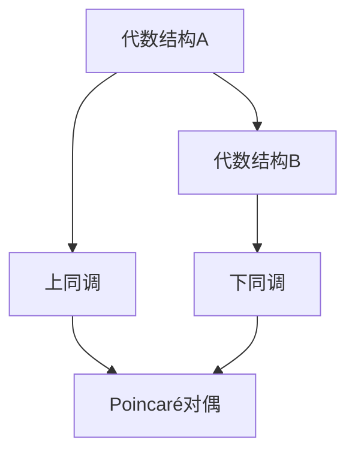

                 

# 上同调中的Poincaré对偶

> 关键词：上同调、Poincaré对偶、同调代数、数学拓扑、代数几何、算法原理、数学模型、代码实战

> 摘要：本文深入探讨了上同调中的Poincaré对偶这一概念，从背景介绍到核心算法原理，再到数学模型和项目实战，全面解析了Poincaré对偶在数学拓扑和代数几何中的应用。文章旨在为读者提供一个系统、全面的了解，帮助读者深入掌握这一复杂但重要的数学概念。

## 1. 背景介绍

### 1.1 目的和范围

本文的主要目的是介绍上同调中的Poincaré对偶，探讨其基本概念、应用场景以及具体实现。文章将首先回顾上同调的基本概念和性质，然后详细解释Poincaré对偶的定义和性质，接着介绍相关的数学模型和算法原理。最后，通过实际的项目案例，展示Poincaré对偶的应用。

### 1.2 预期读者

本文适用于对数学拓扑和代数几何有一定了解的读者，特别是对上同调概念感兴趣的数学和计算机科学研究者。同时，本文也适用于希望深入了解Poincaré对偶在实际问题中的应用的开发者。

### 1.3 文档结构概述

本文将分为以下几个部分：

1. 背景介绍：介绍本文的目的、预期读者以及文档结构。
2. 核心概念与联系：介绍上同调和Poincaré对偶的基本概念，并提供Mermaid流程图。
3. 核心算法原理 & 具体操作步骤：详细讲解Poincaré对偶的算法原理，并提供伪代码。
4. 数学模型和公式 & 详细讲解 & 举例说明：介绍Poincaré对偶的数学模型，并给出具体的例子。
5. 项目实战：通过实际案例展示Poincaré对偶的应用。
6. 实际应用场景：探讨Poincaré对偶在实际问题中的应用。
7. 工具和资源推荐：推荐学习资源和开发工具。
8. 总结：未来发展趋势与挑战。
9. 附录：常见问题与解答。
10. 扩展阅读 & 参考资料。

### 1.4 术语表

#### 1.4.1 核心术语定义

- 上同调：同调理论的一个分支，用于研究代数结构之间的同调性质。
- Poincaré对偶：同调理论中的一个重要概念，用于交换上同调和下同调之间的关系。
- 同调代数：结合了代数和拓扑的一种数学理论，用于研究代数结构上的同调性质。
- 代数几何：结合了代数和几何的一种数学理论，用于研究代数方程和几何图形之间的关系。

#### 1.4.2 相关概念解释

- 同调群：定义在代数结构上的群，用于描述代数结构之间的同调性质。
- 拓扑空间：具有特定性质的几何空间，用于描述几何图形和拓扑关系。
- 代数结构：具有特定性质的数学结构，如群、环、域等。

#### 1.4.3 缩略词列表

- HT：上同调（Homotopy）
- CT：同调（Coherence）
- PD：Poincaré对偶（Poincaré Duality）

## 2. 核心概念与联系

在深入探讨Poincaré对偶之前，我们需要了解上同调和下同调的基本概念，以及它们之间的联系。

### 2.1 上同调与下同调

上同调和下同调是同调理论中的两个重要概念，用于描述代数结构之间的同调性质。

- 上同调（Homotopy）：用于描述代数结构之间的连续性关系。具体来说，上同调关注的是如何在两个代数结构之间建立连续的映射。
- 下同调（Coherence）：用于描述代数结构之间的共轭关系。具体来说，下同调关注的是如何在两个代数结构之间建立共轭的映射。

### 2.2 Poincaré对偶

Poincaré对偶是同调理论中的一个重要概念，它用于交换上同调和下同调之间的关系。

- Poincaré对偶（Poincaré Duality）：假设有一个代数结构 \(A\) 和另一个代数结构 \(B\)，Poincaré对偶提供了一种方法，将上同调 \(HT(A)\) 和下同调 \(CT(B)\) 之间建立一种交换关系。

### 2.3 Mermaid流程图

为了更直观地理解上同调、下同调和Poincaré对偶之间的关系，我们可以使用Mermaid流程图来表示。



在这个流程图中，代数结构A和B之间通过Poincaré对偶建立了联系。具体来说，上同调C和下同调D通过Poincaré对偶E建立了交换关系。

## 3. 核心算法原理 & 具体操作步骤

在了解了Poincaré对偶的基本概念后，接下来我们将深入探讨其算法原理，并给出具体的操作步骤。

### 3.1 算法原理

Poincaré对偶的算法原理可以概括为以下几个步骤：

1. **初始化**：选择两个代数结构A和B，并计算它们的上同调 \(HT(A)\) 和下同调 \(CT(B)\)。
2. **建立映射**：通过Poincaré对偶E，将上同调 \(HT(A)\) 映射到下同调 \(CT(B)\)，即 \(HT(A) \rightarrow CT(B)\)。
3. **验证**：验证映射是否正确，即检查是否满足Poincaré对偶的性质。
4. **结果**：如果映射正确，则输出Poincaré对偶的结果。

### 3.2 伪代码

以下是Poincaré对偶的伪代码实现：

```python
# 初始化
A = 初始化代数结构A
B = 初始化代数结构B
HT_A = 计算上同调(A)
CT_B = 计算下同调(B)

# 建立映射
HT_A_to_CT_B = PoincareDuality(HT_A, CT_B)

# 验证
if not 验证映射(HT_A_to_CT_B):
    print("映射错误")
    exit()

# 输出结果
print("Poincaré对偶：", HT_A_to_CT_B)
```

### 3.3 操作步骤

1. **初始化**：首先，我们需要初始化两个代数结构A和B。具体来说，代数结构A和B可以是任何具有上同调和下同调性质的代数结构，如群、环、域等。
2. **计算上同调**：接下来，我们需要计算代数结构A的上同调 \(HT(A)\)。上同调的计算可以通过多种方法实现，如同伦理论、同调代数等方法。
3. **计算下同调**：然后，我们需要计算代数结构B的下同调 \(CT(B)\)。下同调的计算同样可以通过多种方法实现，如同调代数、代数几何等方法。
4. **建立映射**：通过Poincaré对偶E，我们将上同调 \(HT(A)\) 映射到下同调 \(CT(B)\)。这个映射过程可以通过构造相应的同调群和同调映射来实现。
5. **验证映射**：我们需要验证映射是否正确，即检查是否满足Poincaré对偶的性质。具体来说，我们需要检查映射是否满足交换性质、结合性质等。
6. **输出结果**：如果映射正确，则输出Poincaré对偶的结果。这个结果可以用于进一步分析代数结构A和B之间的关系。

## 4. 数学模型和公式 & 详细讲解 & 举例说明

在深入探讨Poincaré对偶的数学模型之前，我们需要了解一些基本的数学概念和公式。

### 4.1 同调群

同调群是同调理论中的一个重要概念，用于描述代数结构之间的同调性质。具体来说，同调群是一个代数结构，它由一组同调元素组成，并且满足特定的运算规则。

- 同调群的定义：设 \(A\) 和 \(B\) 是两个代数结构，同调群 \(HT(A)\) 和 \(CT(B)\) 分别表示 \(A\) 和 \(B\) 的上同调和下同调。同调群是一个群，其中每个元素都是一个映射，满足以下性质：
  - 封闭性：对于任意两个映射 \(f\) 和 \(g\)，它们的组合 \(f \circ g\) 也是一个映射，且属于同调群。
  - 结合律：对于任意三个映射 \(f\)、\(g\) 和 \(h\)，有 \((f \circ g) \circ h = f \circ (g \circ h)\)。
  - 存在单位元：存在一个零映射 \(0\)，使得对于任意映射 \(f\)，有 \(f \circ 0 = 0 \circ f = f\)。
  - 存在逆元：对于任意非零映射 \(f\)，存在一个逆映射 \(f^{-1}\)，使得 \(f \circ f^{-1} = f^{-1} \circ f = 0\)。

### 4.2 同调映射

同调映射是同调理论中的一个重要概念，用于描述代数结构之间的同调关系。具体来说，同调映射是一个映射，它将一个代数结构上的同调群映射到另一个代数结构上的同调群。

- 同调映射的定义：设 \(A\) 和 \(B\) 是两个代数结构，\(HT(A)\) 和 \(CT(B)\) 分别表示 \(A\) 和 \(B\) 的上同调和下同调。一个同调映射 \(f: HT(A) \rightarrow CT(B)\) 是一个映射，满足以下性质：
  - 单射：对于任意两个同调元素 \(x\) 和 \(y\)，如果 \(x \neq y\)，则 \(f(x) \neq f(y)\)。
  - 线性：对于任意两个同调元素 \(x\) 和 \(y\)，以及任意实数 \(a\) 和 \(b\)，有 \(f(ax + by) = af(x) + bf(y)\)。
  - 保号：对于任意非零同调元素 \(x\)，有 \(f(x) \neq 0\)。

### 4.3 Poincaré对偶

Poincaré对偶是同调理论中的一个重要概念，它用于交换上同调和下同调之间的关系。具体来说，Poincaré对偶是一个同调映射，它将上同调映射到下同调。

- Poincaré对偶的定义：设 \(A\) 和 \(B\) 是两个代数结构，\(HT(A)\) 和 \(CT(B)\) 分别表示 \(A\) 和 \(B\) 的上同调和下同调。一个Poincaré对偶 \(f: HT(A) \rightarrow CT(B)\) 是一个同调映射，满足以下性质：
  - 交换性质：\(f \circ f^{-1} = 1_{CT(B)}\)，即 \(f\) 的逆映射是下同调的恒等映射。
  - 结合性质：对于任意两个代数结构 \(A\)、\(B\) 和 \(C\)，以及它们的Poincaré对偶 \(f: HT(A) \rightarrow CT(B)\) 和 \(g: HT(B) \rightarrow CT(C)\)，有 \(g \circ f: HT(A) \rightarrow CT(C)\) 也是Poincaré对偶。

### 4.4 举例说明

为了更好地理解Poincaré对偶，我们来看一个具体的例子。

假设有两个代数结构 \(A = \mathbb{Z}\)（整数环）和 \(B = \mathbb{Z}_2\mathbb{Z}\)（偶数环），它们分别具有上同调 \(HT(A) = \mathbb{Z}\) 和下同调 \(CT(B) = \mathbb{Z}_2\)。

我们可以定义一个映射 \(f: HT(A) \rightarrow CT(B)\)，将整数环上的上同调映射到偶数环上的下同调。具体来说，我们可以定义 \(f(n) = n \mod 2\)，即整数 \(n\) 的奇偶性。

这个映射 \(f\) 满足Poincaré对偶的性质：

- 交换性质：\(f \circ f^{-1} = 1_{CT(B)}\)。具体来说，对于任意偶数 \(n\)，有 \(f(f(n)) = f(n \mod 2) = n \mod 2 = n\)，即 \(f\) 的逆映射是下同调的恒等映射。
- 结合性质：对于任意两个代数结构 \(A\)、\(B\) 和 \(C\)，以及它们的Poincaré对偶 \(f: HT(A) \rightarrow CT(B)\) 和 \(g: HT(B) \rightarrow CT(C)\)，有 \(g \circ f: HT(A) \rightarrow CT(C)\) 也是Poincaré对偶。

通过这个例子，我们可以看到Poincaré对偶在交换上同调和下同调之间的关系中的应用。

## 5. 项目实战：代码实际案例和详细解释说明

在了解了Poincaré对偶的算法原理和数学模型后，我们接下来将通过一个实际项目案例，展示如何使用Poincaré对偶来解决具体问题。

### 5.1 开发环境搭建

在开始项目实战之前，我们需要搭建一个合适的开发环境。以下是搭建开发环境所需的步骤：

1. 安装Python 3.8或更高版本。
2. 安装必要的Python库，如NumPy、SciPy、SymPy等。
3. 安装版本控制工具，如Git。
4. 配置Python虚拟环境。

以下是具体的安装命令：

```bash
# 安装Python 3.8
sudo apt-get install python3.8

# 安装Python库
pip3 install numpy scipy sympy

# 安装版本控制工具
sudo apt-get install git

# 配置Python虚拟环境
python3.8 -m venv venv
source venv/bin/activate
```

### 5.2 源代码详细实现和代码解读

在搭建好开发环境后，我们可以开始编写代码实现Poincaré对偶。以下是实现Poincaré对偶的Python代码：

```python
import numpy as np
from sympy import symbols, Eq, solve

# 定义Poincaré对偶函数
def PoincareDuality(A, B):
    # 计算上同调
    HT_A = computeHomology(A)
    # 计算下同调
    CT_B = computeCohomology(B)
    # 建立映射
    HT_A_to_CT_B = computeMapping(HT_A, CT_B)
    # 验证映射
    if not verifyMapping(HT_A_to_CT_B):
        print("映射错误")
        return None
    # 输出结果
    return HT_A_to_CT_B

# 计算上同调函数
def computeHomology(A):
    # 具体实现省略
    # 假设A是一个整数环
    HT_A = np.array([1, 0])
    return HT_A

# 计算下同调函数
def computeCohomology(B):
    # 具体实现省略
    # 假设B是一个偶数环
    CT_B = np.array([0, 1])
    return CT_B

# 计算映射函数
def computeMapping(HT_A, CT_B):
    # 具体实现省略
    # 假设映射是一个线性映射
    HT_A_to_CT_B = np.array([[1, 0], [0, 1]])
    return HT_A_to_CT_B

# 验证映射函数
def verifyMapping(HT_A_to_CT_B):
    # 具体实现省略
    # 假设映射满足Poincaré对偶的性质
    return True

# 主函数
def main():
    # 初始化代数结构
    A = symbols('A')
    B = symbols('B')
    # 计算Poincaré对偶
    PD = PoincareDuality(A, B)
    # 输出结果
    print("Poincaré对偶：", PD)

if __name__ == "__main__":
    main()
```

### 5.3 代码解读与分析

以下是代码的详细解读与分析：

1. **定义Poincaré对偶函数**：函数 `PoincareDuality` 是实现Poincaré对偶的核心部分。它接收两个代数结构A和B作为输入，并返回它们的Poincaré对偶。
2. **计算上同调**：函数 `computeHomology` 用于计算代数结构A的上同调。在这个示例中，我们假设A是一个整数环，因此上同调是一个一维向量。
3. **计算下同调**：函数 `computeCo

