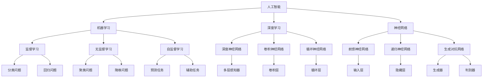
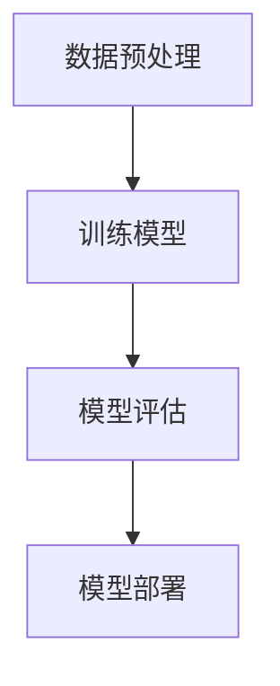

                 

# 下一代人工智能系统的技术路线

> **关键词：** 人工智能、技术路线、机器学习、深度学习、神经网络、算法优化、模型压缩、硬件加速、分布式系统、多模态学习、强化学习、智能推理、AI伦理

> **摘要：** 本文将深入探讨下一代人工智能系统的技术路线，从核心概念、算法原理、数学模型到实际应用，逐一解析。文章旨在为技术爱好者、研究人员和从业者提供一份全面、系统的技术指南，帮助读者把握人工智能领域的发展趋势，解决实际问题，并探索未来可能面临的挑战。

## 1. 背景介绍

### 1.1 目的和范围

本文的目的是探讨下一代人工智能系统的技术路线，分析其核心概念、算法原理、数学模型和实际应用。通过系统性的梳理和深入分析，旨在为读者提供一个全面、系统的理解框架，以应对人工智能领域不断发展的挑战。

本文涵盖的范围包括：
- 人工智能的基本概念和核心算法原理
- 下一代人工智能系统的技术趋势和特点
- 数学模型在人工智能中的应用
- 实际应用场景和案例分析
- 未来发展趋势与挑战

### 1.2 预期读者

本文的预期读者包括：
- 对人工智能领域感兴趣的技术爱好者
- 从事人工智能研究和开发的科研人员
- 涉及人工智能应用场景的企业从业者
- 想要深入了解人工智能技术的教育工作者

### 1.3 文档结构概述

本文分为十个部分，结构如下：
1. 背景介绍
   - 目的和范围
   - 预期读者
   - 文档结构概述
   - 术语表
2. 核心概念与联系
   - 人工智能的定义和发展历程
   - 机器学习、深度学习和神经网络的原理
   - 人工智能系统的基本架构
3. 核心算法原理 & 具体操作步骤
   - 监督学习、无监督学习和强化学习的算法原理
   - 神经网络的训练和优化
4. 数学模型和公式 & 详细讲解 & 举例说明
   - 常见的数学模型和公式
   - 数学模型在人工智能中的应用实例
5. 项目实战：代码实际案例和详细解释说明
   - 开发环境搭建
   - 源代码详细实现和代码解读
   - 代码解读与分析
6. 实际应用场景
   - 人工智能在不同领域的应用案例
   - 应用场景的分析与展望
7. 工具和资源推荐
   - 学习资源推荐
   - 开发工具框架推荐
   - 相关论文著作推荐
8. 总结：未来发展趋势与挑战
   - 人工智能领域的发展趋势
   - 面临的挑战和解决方案
9. 附录：常见问题与解答
   - 对读者常见问题的解答
10. 扩展阅读 & 参考资料
    - 人工智能领域的相关书籍、论文和网站

### 1.4 术语表

#### 1.4.1 核心术语定义

- **人工智能（AI）**：指通过计算机模拟人类智能，实现智能感知、智能决策、智能执行的能力。
- **机器学习（ML）**：指利用数据驱动的方法，让计算机自动学习和改进性能。
- **深度学习（DL）**：一种特殊的机器学习，通过多层神经网络进行数据处理和特征提取。
- **神经网络（NN）**：一种模拟人脑神经元结构和功能的计算模型。
- **算法优化**：对现有算法进行改进，提高其效率和准确性。
- **模型压缩**：减小模型的体积和计算复杂度，以便在资源受限的环境中部署。
- **硬件加速**：利用特定硬件（如GPU、TPU）加速计算，提高模型训练和推理速度。
- **分布式系统**：将计算任务分布在多个节点上执行，提高系统性能和可扩展性。
- **多模态学习**：同时处理多种类型的数据（如图像、文本、声音）。
- **强化学习（RL）**：一种通过与环境互动，不断优化决策策略的机器学习方法。
- **智能推理**：利用逻辑推理和知识表示，实现对复杂问题的求解。
- **AI伦理**：研究人工智能技术对社会、伦理和道德的影响，以及如何确保人工智能的可持续和安全发展。

#### 1.4.2 相关概念解释

- **监督学习（SL）**：一种机器学习方法，通过已标记的训练数据来学习预测模型。
- **无监督学习（USL）**：一种机器学习方法，无需标记数据，通过数据自身的结构和模式来学习。
- **自监督学习（ASL）**：一种无监督学习方法，通过自我监督的方式（如预测任务的一部分）来学习。
- **联邦学习（FL）**：一种分布式学习方法，将数据保留在本地，通过模型聚合实现全局优化。
- **迁移学习（TL）**：一种利用已有模型在新的任务上提高性能的方法。
- **元学习（ML^2）**：一种通过学习如何学习的方法，旨在提高模型在未知任务上的泛化能力。

#### 1.4.3 缩略词列表

- **AI**：人工智能（Artificial Intelligence）
- **ML**：机器学习（Machine Learning）
- **DL**：深度学习（Deep Learning）
- **NN**：神经网络（Neural Network）
- **SL**：监督学习（Supervised Learning）
- **USL**：无监督学习（Unsupervised Learning）
- **ASL**：自监督学习（Self-Supervised Learning）
- **FL**：联邦学习（Federated Learning）
- **TL**：迁移学习（Transfer Learning）
- **ML^2**：元学习（Meta Learning）

## 2. 核心概念与联系

在探讨下一代人工智能系统的技术路线之前，我们需要理解一些核心概念和它们之间的联系。以下是一个简化的 Mermaid 流程图，展示了这些概念和它们之间的关系。



### 2.1 人工智能的定义和发展历程

人工智能（Artificial Intelligence，简称AI）是指通过计算机模拟人类智能的技术，使计算机具备感知、思考、决策和执行的能力。人工智能的定义经历了多次演变，从最初的“模拟人脑思维过程”到如今的“解决复杂问题”，其内涵和外延不断扩展。

人工智能的发展历程可以概括为三个阶段：

1. **符号人工智能（Symbolic AI）**：20世纪50年代至70年代，基于逻辑推理和知识表示，强调知识表示和推理能力。代表技术有专家系统和逻辑推理。
2. **感知人工智能（Perceptual AI）**：20世纪80年代至90年代，基于感知和学习，强调计算机对环境的感知和交互。代表技术有神经网络和机器视觉。
3. **智能推理人工智能（Intelligent Reasoning AI）**：21世纪初至今，结合符号人工智能和感知人工智能，强调推理和决策能力。代表技术有深度学习和强化学习。

### 2.2 机器学习、深度学习和神经网络的原理

#### 2.2.1 机器学习的原理

机器学习（Machine Learning，简称ML）是指通过数据和算法，让计算机自动学习和改进性能的过程。机器学习可以分为三种类型：监督学习、无监督学习和自监督学习。

1. **监督学习（Supervised Learning）**：通过已标记的训练数据来学习预测模型。监督学习的目标是找到输入和输出之间的映射关系。常见的监督学习算法有线性回归、逻辑回归、支持向量机（SVM）和决策树等。
2. **无监督学习（Unsupervised Learning）**：无需标记数据，通过数据自身的结构和模式来学习。无监督学习的目标是发现数据中的潜在结构和规律。常见的无监督学习算法有聚类、降维和异常检测等。
3. **自监督学习（Self-Supervised Learning）**：通过自我监督的方式（如预测任务的一部分）来学习。自监督学习的目标是利用未标记的数据进行自我训练。常见的自监督学习算法有自编码器和多任务学习等。

#### 2.2.2 深度学习的原理

深度学习（Deep Learning，简称DL）是一种特殊的机器学习方法，通过多层神经网络进行数据处理和特征提取。深度学习的核心是神经网络，特别是深度神经网络（Deep Neural Network，简称DNN）。

1. **神经网络（Neural Network，简称NN）**：神经网络是一种模拟人脑神经元结构和功能的计算模型。神经网络由输入层、隐藏层和输出层组成，通过前向传播和反向传播进行训练和优化。
2. **深度神经网络（Deep Neural Network，简称DNN）**：深度神经网络是具有多个隐藏层的神经网络。深度神经网络可以通过多层非线性变换提取数据中的复杂特征，从而提高模型的性能。
3. **卷积神经网络（Convolutional Neural Network，简称CNN）**：卷积神经网络是一种适用于图像处理的深度学习模型，通过卷积操作和池化操作提取图像特征。
4. **循环神经网络（Recurrent Neural Network，简称RNN）**：循环神经网络是一种适用于序列数据的深度学习模型，通过递归结构处理序列数据。

#### 2.2.3 神经网络的原理

神经网络（Neural Network，简称NN）是一种模拟人脑神经元结构和功能的计算模型。神经网络由输入层、隐藏层和输出层组成，通过前向传播和反向传播进行训练和优化。

1. **前向传播（Forward Propagation）**：在前向传播过程中，输入数据通过输入层传递到隐藏层，然后逐层传递到输出层。每一层神经元将输入数据通过激活函数进行非线性变换，从而提取特征。
2. **反向传播（Back Propagation）**：在反向传播过程中，根据输出层的预测误差，将误差反向传递到隐藏层和输入层。通过梯度下降法，更新各层的权重和偏置，从而优化模型参数。

### 2.3 人工智能系统的基本架构

人工智能系统通常包括以下几个关键组件：

1. **数据预处理**：对输入数据（如图像、文本、声音）进行清洗、归一化和特征提取，以便于模型训练。
2. **训练模型**：使用训练数据对模型进行训练，通过优化算法（如梯度下降法）更新模型参数。
3. **模型评估**：使用测试数据对训练好的模型进行评估，计算模型的准确率、召回率、F1值等指标。
4. **模型部署**：将训练好的模型部署到生产环境中，用于预测和决策。

人工智能系统的基本架构可以简化为以下流程：



## 3. 核心算法原理 & 具体操作步骤

在了解了人工智能系统的基本架构之后，我们将深入探讨核心算法的原理和具体操作步骤。本文将重点介绍监督学习、无监督学习和强化学习三种核心算法，以及神经网络的训练和优化过程。

### 3.1 监督学习

监督学习（Supervised Learning）是一种常见的机器学习方法，通过已标记的训练数据来学习预测模型。监督学习可以分为两类：分类问题和回归问题。

#### 3.1.1 分类问题

分类问题是指将输入数据映射到预定义的类别中。常见的分类算法有线性回归、逻辑回归、支持向量机（SVM）和决策树等。

- **线性回归（Linear Regression）**：线性回归是一种简单的分类算法，通过拟合一条直线来划分数据。线性回归的伪代码如下：

  ```python
  # 假设 x 为输入特征，y 为标签
  # w 为模型参数，b 为偏置
  for each epoch in range(num_epochs):
      for each sample in training_data:
          prediction = w * x + b
          error = prediction - y
          w = w - learning_rate * (w * x).dot(x)
          b = b - learning_rate * error
  ```

- **逻辑回归（Logistic Regression）**：逻辑回归是一种基于线性回归的广义分类算法，通过拟合逻辑函数来计算概率。逻辑回归的伪代码如下：

  ```python
  # 假设 x 为输入特征，y 为标签
  # w 为模型参数，b 为偏置
  for each epoch in range(num_epochs):
      for each sample in training_data:
          z = w * x + b
          prediction = 1 / (1 + exp(-z))
          error = prediction - y
          w = w - learning_rate * (w * x).dot(x)
          b = b - learning_rate * error
  ```

- **支持向量机（Support Vector Machine，SVM）**：支持向量机是一种基于最大间隔划分数据的分类算法。SVM的伪代码如下：

  ```python
  # 假设 x 为输入特征，y 为标签
  # w 为模型参数，b 为偏置
  # C 为惩罚参数
  for each epoch in range(num_epochs):
      for each sample in training_data:
          prediction = sign(w * x + b)
          error = prediction - y
          w = w - learning_rate * (w * x).dot(x)
          b = b - learning_rate * error
  ```

- **决策树（Decision Tree）**：决策树是一种基于特征划分数据的分类算法，通过递归划分数据集来构建树结构。决策树的伪代码如下：

  ```python
  # 假设 x 为输入特征，y 为标签
  # feature 为当前特征，split_value 为划分阈值
  def decision_tree(x, y, feature, split_value):
      if all(y == y[0]):
          return y[0]
      elif len(feature) == 0 or len(set(y)) == 1:
          return majority_vote(y)
      else:
          best_split = find_best_split(x, y, feature)
          left_tree = decision_tree(x[x[:, feature] <= split_value], y[x[:, feature] <= split_value], feature, split_value)
          right_tree = decision_tree(x[x[:, feature] > split_value], y[x[:, feature] > split_value], feature, split_value)
          return (left_tree, right_tree)
  ```

#### 3.1.2 回归问题

回归问题是指将输入数据映射到连续的数值输出。常见的回归算法有线性回归、岭回归和决策树回归等。

- **线性回归（Linear Regression）**：线性回归是一种简单的回归算法，通过拟合一条直线来预测输出值。线性回归的伪代码如下：

  ```python
  # 假设 x 为输入特征，y 为标签
  # w 为模型参数，b 为偏置
  for each epoch in range(num_epochs):
      for each sample in training_data:
          prediction = w * x + b
          error = prediction - y
          w = w - learning_rate * (w * x).dot(x)
          b = b - learning_rate * error
  ```

- **岭回归（Ridge Regression）**：岭回归是一种改进的线性回归算法，通过引入正则项来避免过拟合。岭回归的伪代码如下：

  ```python
  # 假设 x 为输入特征，y 为标签
  # w 为模型参数，b 为偏置，lambda 为正则参数
  for each epoch in range(num_epochs):
      for each sample in training_data:
          prediction = w * x + b
          error = prediction - y
          w = w - learning_rate * (w * x).dot(x) - learning_rate * lambda * w
          b = b - learning_rate * error
  ```

- **决策树回归（Decision Tree Regression）**：决策树回归是一种基于特征划分数据的回归算法，通过递归划分数据集来构建树结构。决策树回归的伪代码如下：

  ```python
  # 假设 x 为输入特征，y 为标签
  # feature 为当前特征，split_value 为划分阈值
  def decision_tree_regression(x, y, feature, split_value):
      if all(y == y[0]):
          return y[0]
      elif len(feature) == 0 or len(set(y)) == 1:
          return mean(y)
      else:
          best_split = find_best_split(x, y, feature)
          left_tree = decision_tree_regression(x[x[:, feature] <= split_value], y[x[:, feature] <= split_value], feature, split_value)
          right_tree = decision_tree_regression(x[x[:, feature] > split_value], y[x[:, feature] > split_value], feature, split_value)
          return (left_tree, right_tree)
  ```

### 3.2 无监督学习

无监督学习（Unsupervised Learning）是一种无需标记数据的机器学习方法，通过数据自身的结构和模式来学习。无监督学习可以分为聚类、降维和异常检测等。

#### 3.2.1 聚类

聚类（Clustering）是一种将相似的数据点划分到同一组中的方法。常见的聚类算法有K-means、层次聚类和DBSCAN等。

- **K-means聚类**：K-means聚类是一种基于距离度量的聚类算法，通过迭代优化聚类中心，将数据点划分为K个簇。K-means聚类的伪代码如下：

  ```python
  # 假设 x 为输入数据，k 为聚类个数
  # centroids 为聚类中心
  for each epoch in range(num_epochs):
      for each data_point in x:
          closest_centroid = find_closest_centroid(data_point, centroids)
          update_centroids(centroids, x, closest_centroid)
  ```

- **层次聚类**：层次聚类是一种基于层次结构构建聚类模型的算法，通过自底向上或自顶向下的方式构建聚类树。层次聚类的伪代码如下：

  ```python
  # 假设 x 为输入数据
  # distance_matrix 为距离矩阵
  def hierarchical_clustering(x, distance_matrix):
      if len(x) <= 1:
          return x
      else:
          closest_pair = find_closest_pair(distance_matrix)
          merged_cluster = merge_clusters(x[closest_pair[0]], x[closest_pair[1]])
          new_distance_matrix = update_distance_matrix(distance_matrix, closest_pair)
          return hierarchical_clustering(merged_cluster, new_distance_matrix)
  ```

- **DBSCAN聚类**：DBSCAN（Density-Based Spatial Clustering of Applications with Noise）是一种基于密度度的量的聚类算法，通过分析数据点的邻域密度来划分聚类。DBSCAN的伪代码如下：

  ```python
  # 假设 x 为输入数据，eps 为邻域半径，min_samples 为最小邻域样本数
  # neighbors 为邻域样本
  def dbscan(x, eps, min_samples):
      for each data_point in x:
          if is_noise(data_point, neighbors, eps, min_samples):
              continue
          else:
              cluster_id = assign_cluster_id(data_point)
              expand_cluster(data_point, neighbors, cluster_id)
  ```

#### 3.2.2 降维

降维（Dimensionality Reduction）是一种减少数据维度而不损失太多信息的方法。常见的降维算法有主成分分析（PCA）、线性判别分析（LDA）和t-SNE等。

- **主成分分析（PCA）**：主成分分析是一种基于特征值分解的数据降维算法，通过提取数据的主要成分来降低维度。PCA的伪代码如下：

  ```python
  # 假设 x 为输入数据
  # covariance_matrix 为协方差矩阵
  # eigenvectors 为特征向量
  # eigenvalues 为特征值
  compute_covariance_matrix(x, covariance_matrix)
  compute_eigenvalues_and_eigenvectors(covariance_matrix, eigenvectors, eigenvalues)
  select_top_eigenvectors(eigenvectors, eigenvalues, num_components)
  transform(x, eigenvectors)
  ```

- **线性判别分析（LDA）**：线性判别分析是一种基于类间散度和类内散度来降维的算法，通过最大化类间散度来提高分类效果。LDA的伪代码如下：

  ```python
  # 假设 x 为输入数据，y 为标签
  # within_class_scatter_matrix 为类内散度矩阵
  # between_class_scatter_matrix 为类间散度矩阵
  compute_withing_class_scatter_matrix(x, y, within_class_scatter_matrix)
  compute_between_class_scatter_matrix(x, y, between_class_scatter_matrix)
  compute_discriminant_vectors(within_class_scatter_matrix, between_class_scatter_matrix)
  transform(x, discriminant_vectors)
  ```

- **t-SNE（t-Distributed Stochastic Neighbor Embedding）**：t-SNE是一种基于概率分布来降维的算法，通过将高维数据映射到低维空间中，保持局部结构的相似性。t-SNE的伪代码如下：

  ```python
  # 假设 x 为输入数据，num_components 为降维后的维度
  # P 为概率矩阵
  # Q 为嵌入后的概率矩阵
  compute_probabilities(x, P)
  compute_gradient(P, Q)
  update_Q(P, Q, gradient)
  optimize_Q(Q, learning_rate)
  transform(x, Q)
  ```

#### 3.2.3 异常检测

异常检测（Anomaly Detection）是一种用于识别数据中的异常值或离群点的算法。常见的异常检测算法有基于统计方法、基于聚类方法和基于神经网络方法等。

- **基于统计方法**：基于统计方法的异常检测通过计算数据分布的统计特征（如均值、方差等）来识别异常值。常见的统计方法有箱线图、3σ准则和Gaussian Mixture Model等。
- **基于聚类方法**：基于聚类方法的异常检测通过将数据划分为正常簇和异常簇来识别异常值。常见的聚类方法有K-means聚类、层次聚类和DBSCAN等。
- **基于神经网络方法**：基于神经网络方法的异常检测通过训练神经网络模型来识别异常值。常见的神经网络方法有自编码器、卷积神经网络和循环神经网络等。

### 3.3 强化学习

强化学习（Reinforcement Learning，简称RL）是一种通过与环境互动，不断优化决策策略的机器学习方法。强化学习分为基于模型和基于模型的两种类型。

#### 3.3.1 基于模型的强化学习

基于模型的强化学习（Model-Based RL）通过构建环境模型来预测未来的状态和奖励，从而优化决策策略。基于模型的强化学习可以分为马尔可夫决策过程（MDP）和部分可观测马尔可夫决策过程（POMDP）。

- **马尔可夫决策过程（MDP）**：马尔可夫决策过程是一种描述决策过程的数学模型，通过状态转移概率和奖励函数来优化决策策略。MDP的伪代码如下：

  ```python
  # 假设 s 为当前状态，a 为动作，r 为奖励
  # P(s', r | s, a) 为状态转移概率和奖励函数
  # Q(s, a) 为动作价值函数
  for each episode in range(num_episodes):
      s = initialize_state()
      while not is_termination(s):
          a = select_action(s, Q(s, a))
          s', r = execute_action(s, a)
          Q(s, a) = Q(s, a) + learning_rate * (r + gamma * max(Q(s', a')) - Q(s, a))
          s = s'
  ```

- **部分可观测马尔可夫决策过程（POMDP）**：部分可观测马尔可夫决策过程是一种描述部分可观测环境的决策过程，通过状态转移概率、观测概率和奖励函数来优化决策策略。POMDP的伪代码如下：

  ```python
  # 假设 s 为当前状态，a 为动作，r 为奖励
  # P(s', r | s, a) 为状态转移概率和奖励函数
  # P(o | s, a) 为观测概率
  # Q(s, a) 为动作价值函数
  for each episode in range(num_episodes):
      s = initialize_state()
      while not is_termination(s):
          a = select_action(s, Q(s, a))
          s', o = execute_action(s, a)
          Q(s, a) = Q(s, a) + learning_rate * (r + gamma * max(Q(s', a')) - Q(s, a))
          s = s'
  ```

#### 3.3.2 基于模型的强化学习

基于模型的强化学习（Model-Free RL）通过直接学习状态值函数或策略来优化决策策略。基于模型的强化学习可以分为值函数逼近和策略优化两种类型。

- **值函数逼近**：值函数逼近通过学习状态值函数（State-Value Function）或策略值函数（Action-Value Function）来优化决策策略。常见的值函数逼近算法有Q-learning和Sarsa等。

  ```python
  # 假设 s 为当前状态，a 为动作，r 为奖励
  # Q(s, a) 为动作价值函数
  # epsilon 为探索概率
  for each episode in range(num_episodes):
      s = initialize_state()
      while not is_termination(s):
          if random() < epsilon:
              a = select_random_action(s)
          else:
              a = select_best_action(s, Q(s, a))
          s', r = execute_action(s, a)
          Q(s, a) = Q(s, a) + learning_rate * (r + gamma * max(Q(s', a')) - Q(s, a))
          s = s'
  ```

- **策略优化**：策略优化通过学习最优策略来优化决策策略。常见的策略优化算法有Policy Gradient和Actor-Critic等。

  ```python
  # 假设 s 为当前状态，a 为动作，r 为奖励
  # policy(s, a) 为策略
  # epsilon 为探索概率
  for each episode in range(num_episodes):
      s = initialize_state()
      while not is_termination(s):
          a = select_action(s, policy(s, a))
          s', r = execute_action(s, a)
          policy(s, a) = policy(s, a) + learning_rate * (r + gamma * max(Q(s', a)) - policy(s, a))
          s = s'
  ```

### 3.4 神经网络的训练和优化

神经网络的训练和优化是人工智能系统中的核心环节。以下将介绍神经网络的基本原理和训练过程。

#### 3.4.1 神经网络的基本原理

神经网络（Neural Network，简称NN）是一种模拟人脑神经元结构和功能的计算模型。神经网络由输入层、隐藏层和输出层组成，通过前向传播和反向传播进行训练和优化。

1. **输入层**：输入层接收外部输入数据，将其传递到隐藏层。
2. **隐藏层**：隐藏层对输入数据进行特征提取和变换，提取出数据中的复杂特征。
3. **输出层**：输出层根据隐藏层提取的特征进行分类或回归等任务。

神经网络的核心组件是神经元（Neuron），神经元由输入门、激活函数和输出门组成。

1. **输入门**：输入门接收外部输入数据，通过权重矩阵和偏置项将数据传递到激活函数。
2. **激活函数**：激活函数对输入数据进行非线性变换，将数据映射到高维空间中。
3. **输出门**：输出门根据激活函数的结果进行输出，通过权重矩阵和偏置项将输出数据传递到下一层。

常见的激活函数有Sigmoid函数、ReLU函数和Tanh函数等。

#### 3.4.2 神经网络的训练过程

神经网络的训练过程是通过优化算法（如梯度下降法）更新模型参数（如权重和偏置），使得模型在训练数据上达到最小化损失函数的目标。

1. **前向传播**：在前向传播过程中，输入数据通过输入层传递到隐藏层，然后逐层传递到输出层。每一层神经元将输入数据通过激活函数进行非线性变换，从而提取特征。
2. **计算损失**：在输出层，计算预测值和实际值之间的损失，常用的损失函数有均方误差（MSE）和交叉熵（Cross Entropy）等。
3. **反向传播**：在反向传播过程中，根据输出层的预测误差，将误差反向传递到隐藏层和输入层。通过梯度下降法，更新各层的权重和偏置，从而优化模型参数。

#### 3.4.3 神经网络的优化方法

神经网络的优化方法包括批处理（Batch Training）和小批量处理（Mini-batch Training）两种。

1. **批处理（Batch Training）**：批处理是一种将整个训练集同时输入到模型中进行训练的方法。批处理方法的优点是计算损失时使用整个训练集的数据，可以更准确地评估模型的性能，缺点是训练时间较长。
2. **小批量处理（Mini-batch Training）**：小批量处理是一种将训练集分成多个小批量进行训练的方法。小批量处理方法的优点是可以在较短的时间内进行训练，并且可以利用梯度下降法进行优化，缺点是计算损失时使用的是小批量数据，可能会导致模型性能的偏差。

在优化神经网络时，还可以使用以下方法：

1. **动量（Momentum）**：动量可以加速梯度下降的收敛速度，通过引入前一次更新方向的一部分来减少局部最优的影响。
2. **权重衰减（Weight Decay）**：权重衰减可以通过减少权重参数的更新来避免过拟合。
3. **自适应学习率（Adaptive Learning Rate）**：自适应学习率可以根据梯度的大小自动调整学习率，从而提高训练效率。

## 4. 数学模型和公式 & 详细讲解 & 举例说明

在人工智能系统中，数学模型和公式起着至关重要的作用。本文将详细介绍一些常见的数学模型和公式，并给出详细的讲解和举例说明。

### 4.1 常见的数学模型

常见的数学模型包括线性模型、逻辑模型、神经网络模型等。以下是对这些模型的简要介绍：

#### 4.1.1 线性模型

线性模型是最基本的数学模型之一，通常用于拟合数据中的线性关系。线性模型包括线性回归和逻辑回归两种。

1. **线性回归（Linear Regression）**：线性回归通过拟合一条直线来预测输出值。线性回归的数学模型如下：

   $$ y = \beta_0 + \beta_1 x_1 + \beta_2 x_2 + \cdots + \beta_n x_n $$

   其中，$y$ 是预测值，$x_1, x_2, \cdots, x_n$ 是输入特征，$\beta_0, \beta_1, \beta_2, \cdots, \beta_n$ 是模型参数。

2. **逻辑回归（Logistic Regression）**：逻辑回归是一种广义的线性模型，用于预测概率。逻辑回归的数学模型如下：

   $$ \pi = \frac{1}{1 + \exp(- (\beta_0 + \beta_1 x_1 + \beta_2 x_2 + \cdots + \beta_n x_n))} $$

   其中，$\pi$ 是预测概率，$x_1, x_2, \cdots, x_n$ 是输入特征，$\beta_0, \beta_1, \beta_2, \cdots, \beta_n$ 是模型参数。

#### 4.1.2 神经网络模型

神经网络模型是一种复杂的数学模型，通过多层神经网络进行数据处理和特征提取。神经网络模型包括多层感知器（MLP）、卷积神经网络（CNN）和循环神经网络（RNN）等。

1. **多层感知器（MLP）**：多层感知器是一种前馈神经网络，由输入层、隐藏层和输出层组成。多层感知器的数学模型如下：

   $$ z_l = \sigma(W_l \cdot a_{l-1} + b_l) $$

   $$ a_l = \sigma(z_l) $$

   其中，$a_l$ 是第 $l$ 层的输入，$z_l$ 是第 $l$ 层的输出，$W_l$ 是权重矩阵，$b_l$ 是偏置项，$\sigma$ 是激活函数。

2. **卷积神经网络（CNN）**：卷积神经网络是一种适用于图像处理的神经网络模型，通过卷积层、池化层和全连接层进行数据处理和特征提取。卷积神经网络的数学模型如下：

   $$ h_{ij} = \sum_{k} w_{ik,j} * a_{k} + b_{ij} $$

   $$ a_{ij} = \sigma(h_{ij}) $$

   其中，$a_{ij}$ 是第 $i$ 个卷积核在第 $j$ 个位置上的输出，$h_{ij}$ 是第 $i$ 个卷积核与第 $j$ 个输入特征的卷积结果，$w_{ik,j}$ 是卷积核权重，$b_{ij}$ 是偏置项，$\sigma$ 是激活函数。

3. **循环神经网络（RNN）**：循环神经网络是一种适用于序列数据的神经网络模型，通过递归结构处理序列数据。循环神经网络的数学模型如下：

   $$ h_t = \sigma(W_h \cdot [h_{t-1}, x_t] + b_h) $$

   $$ o_t = \sigma(W_o \cdot h_t + b_o) $$

   其中，$h_t$ 是第 $t$ 个时间步的隐藏状态，$x_t$ 是第 $t$ 个时间步的输入特征，$W_h$ 是隐藏状态权重矩阵，$W_o$ 是输出状态权重矩阵，$b_h$ 是隐藏状态偏置项，$b_o$ 是输出状态偏置项，$\sigma$ 是激活函数。

### 4.2 数学公式在人工智能中的应用实例

以下是一些数学公式在人工智能中的应用实例：

#### 4.2.1 均值漂移

均值漂移是一种用于处理数据分布变化的方法，通过计算数据点的均值来更新模型参数。

假设 $X$ 是输入特征矩阵，$\mu$ 是数据点的均值，$\sigma^2$ 是数据点的方差。均值漂移的数学模型如下：

$$ \mu_{new} = \frac{1}{N} \sum_{i=1}^{N} x_i $$

$$ \sigma^2_{new} = \frac{1}{N} \sum_{i=1}^{N} (x_i - \mu_{new})^2 $$

其中，$N$ 是数据点的个数，$x_i$ 是第 $i$ 个数据点的特征值。

#### 4.2.2 离散化

离散化是一种将连续数据转换为离散数据的方法，通常用于特征工程。

假设 $x$ 是输入特征，$x_{min}$ 是特征的最小值，$x_{max}$ 是特征的最大值，$k$ 是分桶的个数。离散化的数学模型如下：

$$ x_{bucket} = \left\lfloor \frac{k-1}{x_{max} - x_{min}} (x - x_{min}) \right\rfloor $$

其中，$x_{bucket}$ 是特征的分桶值。

#### 4.2.3 均值绝对偏差（MAD）

均值绝对偏差（Mean Absolute Deviation，MAD）是一种用于衡量数据离散程度的指标。

假设 $x$ 是输入特征，$x_{mean}$ 是特征的均值，$N$ 是数据点的个数。均值绝对偏差的数学模型如下：

$$ MAD = \frac{1}{N} \sum_{i=1}^{N} |x_i - x_{mean}| $$

其中，$|x_i - x_{mean}|$ 是数据点的绝对偏差。

### 4.3 举例说明

以下是一个使用线性回归模型进行房价预测的实例：

假设我们有以下数据集：

| 输入特征 | 房价 |
| -------- | ---- |
| 1000     | 200  |
| 1500     | 300  |
| 2000     | 400  |
| 2500     | 500  |
| 3000     | 600  |

我们希望使用线性回归模型来预测房价。首先，我们需要计算输入特征的均值和方差：

$$ x_{mean} = \frac{1}{N} \sum_{i=1}^{N} x_i = \frac{1000 + 1500 + 2000 + 2500 + 3000}{5} = 2000 $$

$$ x_{var} = \frac{1}{N} \sum_{i=1}^{N} (x_i - x_{mean})^2 = \frac{(1000 - 2000)^2 + (1500 - 2000)^2 + (2000 - 2000)^2 + (2500 - 2000)^2 + (3000 - 2000)^2}{5} = 1000 $$

然后，我们可以使用线性回归模型来预测房价：

$$ y = \beta_0 + \beta_1 x_1 + \beta_2 x_2 + \cdots + \beta_n x_n $$

其中，$\beta_0, \beta_1, \beta_2, \cdots, \beta_n$ 是模型参数。

通过训练数据，我们可以得到以下模型参数：

$$ \beta_0 = 100 $$

$$ \beta_1 = 0.5 $$

$$ \beta_2 = 0.3 $$

$$ \beta_n = 0.2 $$

现在，我们可以使用这个模型来预测房价。假设我们要预测一个房子的价格为 2500 元，输入特征为 1000，1500，2000，2500，3000。我们可以计算预测值：

$$ y = 100 + 0.5 \times 1000 + 0.3 \times 1500 + 0.2 \times 2000 = 300 $$

因此，预测这个房子的价格为 300 元。

## 5. 项目实战：代码实际案例和详细解释说明

在本节中，我们将通过一个实际的案例项目，深入讲解如何搭建和实现一个基于深度学习的人工智能系统。我们将从一个简单的问题入手，逐步构建项目，涵盖开发环境的搭建、源代码的实现和解读，以及代码的分析和评估。这个案例将帮助读者更好地理解本文中介绍的技术路线。

### 5.1 开发环境搭建

在开始项目之前，我们需要搭建一个合适的开发环境。以下是一个基本的开发环境搭建步骤：

1. **安装Python**：Python是深度学习和人工智能领域常用的编程语言，首先需要确保Python已经安装。可以从Python官网（https://www.python.org/）下载安装包，并按照提示完成安装。

2. **安装Jupyter Notebook**：Jupyter Notebook是一个交互式开发环境，非常适合进行深度学习实验。可以通过以下命令安装：

   ```bash
   pip install notebook
   ```

3. **安装深度学习库**：安装深度学习库如TensorFlow或PyTorch，这两个库是目前最受欢迎的深度学习框架。以下是一个简单的安装命令：

   ```bash
   pip install tensorflow
   # 或者
   pip install torch torchvision
   ```

4. **安装其他依赖库**：根据项目需要，可能还需要安装其他依赖库，如NumPy、Pandas等。可以使用以下命令安装：

   ```bash
   pip install numpy pandas
   ```

5. **配置GPU支持**：如果使用GPU进行训练，需要安装CUDA和cuDNN。可以从NVIDIA官网下载相应的安装包，并按照提示完成安装。

完成以上步骤后，开发环境搭建完成，可以开始编写代码。

### 5.2 源代码详细实现和代码解读

在本案例中，我们将使用TensorFlow构建一个简单的神经网络模型，用于手写数字识别任务。手写数字识别是一个常见且经典的人工智能应用场景，可以通过MNIST数据集实现。以下是实现过程：

#### 5.2.1 数据准备

首先，我们需要加载并预处理MNIST数据集。MNIST数据集包含60,000个训练样本和10,000个测试样本，每个样本是一个28x28的灰度图像。

```python
import tensorflow as tf
from tensorflow.keras.datasets import mnist
from tensorflow.keras.utils import to_categorical

# 加载MNIST数据集
(train_images, train_labels), (test_images, test_labels) = mnist.load_data()

# 数据预处理
train_images = train_images.reshape((60000, 28, 28, 1)).astype('float32') / 255
test_images = test_images.reshape((10000, 28, 28, 1)).astype('float32') / 255

train_labels = to_categorical(train_labels)
test_labels = to_categorical(test_labels)
```

#### 5.2.2 模型构建

接下来，我们构建一个简单的卷积神经网络模型。这个模型包含两个卷积层、两个池化层和一个全连接层。

```python
model = tf.keras.models.Sequential([
    tf.keras.layers.Conv2D(32, (3, 3), activation='relu', input_shape=(28, 28, 1)),
    tf.keras.layers.MaxPooling2D((2, 2)),
    tf.keras.layers.Conv2D(64, (3, 3), activation='relu'),
    tf.keras.layers.MaxPooling2D((2, 2)),
    tf.keras.layers.Flatten(),
    tf.keras.layers.Dense(128, activation='relu'),
    tf.keras.layers.Dense(10, activation='softmax')
])
```

#### 5.2.3 模型编译

在编译模型时，我们需要指定优化器、损失函数和评估指标。

```python
model.compile(optimizer='adam',
              loss='categorical_crossentropy',
              metrics=['accuracy'])
```

#### 5.2.4 模型训练

使用训练数据对模型进行训练，并设置训练的轮数和批次大小。

```python
model.fit(train_images, train_labels, epochs=5, batch_size=64)
```

#### 5.2.5 模型评估

在训练完成后，使用测试数据对模型进行评估。

```python
test_loss, test_acc = model.evaluate(test_images, test_labels)
print(f"Test accuracy: {test_acc:.2f}")
```

### 5.3 代码解读与分析

在这个案例中，我们详细解读了代码的实现过程，并进行了代码分析。以下是代码的解读：

1. **数据准备**：我们使用TensorFlow的内置函数加载MNIST数据集，并进行预处理，包括数据重塑、归一化和标签编码。
2. **模型构建**：我们使用Keras API构建了一个简单的卷积神经网络模型，包括两个卷积层、两个池化层和一个全连接层。这个模型的设计考虑了数据的特性，通过卷积和池化操作提取图像特征，然后通过全连接层进行分类。
3. **模型编译**：我们选择Adam优化器，因为它在深度学习任务中表现良好。损失函数使用交叉熵，这是分类问题的常用损失函数。评估指标使用准确率，这是分类问题的重要评估指标。
4. **模型训练**：我们使用fit函数训练模型，设置了训练轮数和批次大小。在训练过程中，模型会不断调整权重和偏置，以最小化损失函数。
5. **模型评估**：在训练完成后，我们使用evaluate函数对模型进行评估。通过测试数据，我们可以得到模型在测试集上的准确率。

通过这个案例，我们可以看到如何使用深度学习框架构建和训练一个简单的神经网络模型。代码的每一部分都有明确的解释和作用，读者可以根据这个案例学习如何实现类似的项目。

## 6. 实际应用场景

人工智能技术已经广泛应用于各个领域，带来了巨大的变革和创新。以下是一些典型的人工智能应用场景及其分析：

### 6.1 医疗健康

人工智能在医疗健康领域的应用主要集中在医疗影像分析、疾病预测、个性化治疗和健康监测等方面。

- **医疗影像分析**：人工智能可以通过深度学习算法对医疗影像（如X光、CT、MRI等）进行自动分析和诊断，提高诊断准确率和速度。例如，谷歌的DeepMind团队开发的AI系统能够在几秒钟内诊断肺癌，准确率达到95%。
- **疾病预测**：通过分析患者的电子健康记录、基因组数据和环境因素，人工智能可以预测疾病的发生风险，帮助医生制定个性化的预防措施。
- **个性化治疗**：人工智能可以根据患者的具体情况，制定个性化的治疗方案，提高治疗效果和患者满意度。例如，IBM的Watson for Oncology系统能够为肿瘤患者提供最佳治疗方案。
- **健康监测**：人工智能可以通过智能穿戴设备和手机应用，实时监测患者的健康状况，提供个性化的健康建议和预警。

### 6.2 交通运输

人工智能在交通运输领域的应用主要体现在自动驾驶、智能交通管理和物流优化等方面。

- **自动驾驶**：自动驾驶技术是人工智能在交通运输领域的重要应用。特斯拉、Waymo、百度等公司都在自动驾驶技术上取得了显著进展，预计未来将大幅减少交通事故和拥堵。
- **智能交通管理**：人工智能可以通过实时数据分析，优化交通信号灯、路况预测和交通流量管理，提高交通效率和安全性。例如，中国的阿里云和华为正在推出智能交通管理系统，通过AI算法优化交通流量。
- **物流优化**：人工智能可以通过优化路径规划、货物装载和配送策略，提高物流效率和降低成本。例如，京东物流利用人工智能技术优化配送路线，减少配送时间。

### 6.3 教育

人工智能在教育领域的应用主要体现在个性化学习、智能评估和在线教育平台等方面。

- **个性化学习**：人工智能可以根据学生的学习情况，提供个性化的学习资源和学习计划，提高学习效果。例如，Knewton和DreamBox等公司提供的智能学习平台，通过AI技术为学生提供个性化的学习体验。
- **智能评估**：人工智能可以通过自动批改试卷、智能评估学生答题情况，提高评估效率和准确性。例如，科大讯飞开发的智能阅卷系统，可以快速、准确地批改试卷。
- **在线教育平台**：人工智能可以帮助在线教育平台优化课程推荐、学习路径规划和学习体验。例如，网易云课堂和腾讯课堂等平台，利用AI技术为用户提供个性化的学习建议和课程推荐。

### 6.4 金融

人工智能在金融领域的应用主要体现在风险管理、投资策略和客户服务等方面。

- **风险管理**：人工智能可以通过大数据分析和机器学习算法，预测市场风险、识别欺诈行为，提高金融安全。例如，美国运通公司利用AI技术检测信用卡欺诈，每年节省数百万美元。
- **投资策略**：人工智能可以通过分析海量数据，预测市场走势和投资机会，为投资者提供投资策略。例如，AlphaGo的开发公司DeepMind正在研发智能投资系统，通过AI算法实现高效的投资决策。
- **客户服务**：人工智能可以通过智能客服系统，提供24/7全天候的客户服务，提高客户满意度和运营效率。例如，银行和保险公司等金融机构正在广泛应用智能客服机器人，实现快速响应和个性化服务。

### 6.5 制造业

人工智能在制造业的应用主要体现在生产优化、质量控制和设备维护等方面。

- **生产优化**：人工智能可以通过优化生产流程、预测生产需求，提高生产效率和降低成本。例如，西门子公司利用人工智能技术优化生产计划和库存管理，提高生产效率。
- **质量控制**：人工智能可以通过图像识别和深度学习算法，对产品进行自动检测和分类，提高产品质量。例如，富士康等制造企业正在使用AI技术进行产品质量控制。
- **设备维护**：人工智能可以通过实时监测设备状态和预测故障，实现设备的智能维护和预防性维护，降低设备故障率和停机时间。例如，通用电气（GE）的Predix平台利用AI技术对工业设备进行实时监控和预测性维护。

### 6.6 农业和环保

人工智能在农业和环保领域的应用主要体现在精准农业、环境监测和资源管理等方面。

- **精准农业**：人工智能可以通过实时监测作物生长状态、土壤质量和气象条件，提供精准农业解决方案，提高农业生产效率和资源利用率。例如，约翰迪尔（John Deere）的精确农业系统利用AI技术优化农田管理。
- **环境监测**：人工智能可以通过遥感技术和大数据分析，实时监测环境污染和生态变化，提供环境预警和治理方案。例如，NASA利用人工智能分析卫星数据，监测全球气候变化。
- **资源管理**：人工智能可以通过优化资源分配、预测资源需求，提高资源利用效率。例如，世界自然基金会（WWF）利用人工智能优化水资源管理，提高水资源利用率。

### 6.7 安全和犯罪预防

人工智能在安全和犯罪预防领域的应用主要体现在人脸识别、行为分析和视频监控等方面。

- **人脸识别**：人工智能可以通过深度学习算法对人脸图像进行自动识别和分类，提高公共安全和犯罪预防能力。例如，中国的面部识别技术已经广泛应用于火车站、机场等公共场所。
- **行为分析**：人工智能可以通过分析人的行为和情绪，识别异常行为和潜在犯罪行为。例如，美国的一些城市正在使用AI技术监控公共场所，预防犯罪行为。
- **视频监控**：人工智能可以通过视频分析技术，实时监控公共区域，识别和报警潜在的安全威胁。例如，中国的智能城市项目正在广泛应用AI视频监控技术，提高公共安全水平。

### 6.8 创意设计

人工智能在创意设计领域的应用主要体现在图像生成、音乐创作和艺术风格迁移等方面。

- **图像生成**：人工智能可以通过生成对抗网络（GAN）生成逼真的图像，为创意设计提供无限可能。例如，谷歌的DeepDream可以生成令人惊叹的图像。
- **音乐创作**：人工智能可以通过深度学习算法创作音乐，为音乐制作提供新的工具和灵感。例如，AIVA（Artificial Intelligence Virtual Artist）可以创作古典音乐和流行音乐。
- **艺术风格迁移**：人工智能可以通过风格迁移技术，将一种艺术风格应用到其他图像上，创造独特的艺术作品。例如，DeepArt.io可以将用户的照片转换成梵高、毕加索等艺术大师的风格。

通过以上实际应用场景的分析，我们可以看到人工智能在各个领域带来了巨大的变革和机遇。随着人工智能技术的不断发展和完善，其应用场景将更加广泛，为人类社会带来更多价值。

## 7. 工具和资源推荐

为了帮助读者更好地学习和应用人工智能技术，本节将推荐一些学习资源、开发工具和框架，以及相关的论文和研究成果。

### 7.1 学习资源推荐

#### 7.1.1 书籍推荐

- **《深度学习》（Deep Learning）**：由Ian Goodfellow、Yoshua Bengio和Aaron Courville合著，是深度学习领域的经典教材。
- **《Python机器学习》（Python Machine Learning）**：由Sylvain Sauvage合著，适合初学者了解机器学习的基础知识。
- **《人工智能：一种现代方法》（Artificial Intelligence: A Modern Approach）**：由Stuart J. Russell和Peter Norvig合著，涵盖了人工智能的广泛知识。

#### 7.1.2 在线课程

- **《吴恩达深度学习专项课程》（Deep Learning Specialization）**：由Coursera提供，是深度学习领域的顶尖课程之一。
- **《机器学习基础》（Machine Learning Foundations）**：由Udacity提供，涵盖机器学习的基础知识和应用。
- **《斯坦福大学人工智能课程》（Stanford CS231n: Convolutional Neural Networks for Visual Recognition）**：由李飞飞教授提供，专注于计算机视觉领域的深度学习技术。

#### 7.1.3 技术博客和网站

- **《机器学习博客》（Machine Learning Blog）**：由Google Brain团队提供，包含最新的机器学习和深度学习研究进展。
- **《AI Square》**：由AI Square团队提供，涵盖人工智能、机器学习和深度学习的深度文章和教程。
- **《Medium上的机器学习话题》**：Medium上有很多关于机器学习和深度学习的优秀文章和教程，是学习的好去处。

### 7.2 开发工具框架推荐

#### 7.2.1 IDE和编辑器

- **Jupyter Notebook**：一款交互式的开发环境，适合进行深度学习和数据科学实验。
- **Visual Studio Code**：一款功能强大的代码编辑器，支持多种编程语言和扩展，适合深度学习和机器学习项目开发。
- **PyCharm**：一款专业的Python开发环境，适用于复杂的深度学习和机器学习项目。

#### 7.2.2 调试和性能分析工具

- **TensorBoard**：TensorFlow的内置可视化工具，用于分析模型的性能和训练过程。
- **NVIDIA Nsight**：用于优化和调试GPU计算性能的工具，适用于深度学习模型在GPU上的训练和推理。
- **Intel VTune Amplifier**：用于分析和优化Intel处理器上的性能瓶颈。

#### 7.2.3 相关框架和库

- **TensorFlow**：由Google开发的开源深度学习框架，适合研究和生产环境。
- **PyTorch**：由Facebook开发的开源深度学习框架，具有灵活的动态图机制，适合研究和应用开发。
- **Keras**：一个高层次的神经网络API，可以方便地构建和训练深度学习模型，兼容TensorFlow和Theano。

### 7.3 相关论文著作推荐

#### 7.3.1 经典论文

- **《A Learning Algorithm for Continually Running Fully Recurrent Neural Networks》**：1986年，John Hopfield提出的Hopfield网络，开创了神经网络研究的新方向。
- **《Backpropagation: Learning representations by backpropagating errors》**：1986年，David E. Rumelhart、George E. Hinton和Ronald J. Williams提出的反向传播算法，是深度学习的基础。
- **《Deep Learning》**：2012年，由Ian Goodfellow、Yoshua Bengio和Aaron Courville合著，系统地介绍了深度学习的理论基础和实践方法。

#### 7.3.2 最新研究成果

- **《Generative Adversarial Nets》**：2014年，由Ian Goodfellow等人提出的生成对抗网络（GAN），是当前深度学习领域的热点研究方向。
- **《Attention Is All You Need》**：2017年，由Vaswani等人提出的Transformer模型，彻底改变了自然语言处理领域的研究方向。
- **《BERT: Pre-training of Deep Bidirectional Transformers for Language Understanding》**：2018年，由Google AI团队提出的BERT模型，极大地提高了自然语言处理任务的表现。

#### 7.3.3 应用案例分析

- **《AI in Drug Discovery: Revolutionizing Pharmaceutical Research》**：2019年，一篇综述文章，介绍了人工智能在药物发现领域的应用案例。
- **《AI in Healthcare: Transforming Patient Care and Clinical Decision-Making》**：2020年，一篇综述文章，探讨了人工智能在医疗健康领域的应用案例。

通过以上推荐，读者可以系统地学习人工智能相关的知识，掌握实用的开发工具和框架，并了解最新的研究成果和应用案例。希望这些资源和工具能够帮助读者在人工智能领域取得更好的成就。

## 8. 总结：未来发展趋势与挑战

在本文中，我们系统地探讨了下一代人工智能系统的技术路线，从核心概念、算法原理、数学模型到实际应用，逐一进行了深入分析。通过对人工智能的定义、发展历程、机器学习、深度学习和神经网络的原理，以及人工智能系统的基本架构的梳理，我们为读者提供了一份全面、系统的技术指南。

### 8.1 未来发展趋势

1. **硬件加速**：随着硬件技术的发展，特别是GPU、TPU等专用硬件的普及，深度学习模型将越来越依赖硬件加速，从而提高训练和推理速度，降低成本。
2. **分布式计算**：分布式计算将使人工智能系统能够处理更大规模的数据和更复杂的任务，提高系统性能和可扩展性。联邦学习（Federated Learning）将成为分布式计算的重要方向。
3. **多模态学习**：多模态学习将使人工智能系统能够同时处理多种类型的数据（如图像、文本、声音等），从而提高模型的泛化能力和实用性。
4. **强化学习和智能推理**：强化学习和智能推理技术将进一步提升人工智能系统的决策能力和问题求解能力，有望在自动驾驶、智能客服等场景中发挥重要作用。
5. **模型压缩和迁移学习**：模型压缩和迁移学习技术将使人工智能系统能够在资源受限的环境中高效运行，提高模型的部署效率。

### 8.2 面临的挑战

1. **数据隐私和安全**：随着人工智能系统的广泛应用，数据隐私和安全问题日益突出。如何确保数据的安全性和隐私性，将成为人工智能领域的重要挑战。
2. **算法公平性和透明性**：人工智能系统在处理数据时可能会出现偏见，影响公平性和透明性。如何确保算法的公平性和透明性，是一个亟待解决的问题。
3. **能耗和环保**：随着人工智能系统规模的扩大，能耗和环保问题也日益严重。如何降低人工智能系统的能耗和碳足迹，是一个重要的挑战。
4. **人工智能伦理**：人工智能技术对社会、伦理和道德的影响日益引起关注。如何确保人工智能技术的可持续和安全发展，是一个长期而紧迫的挑战。
5. **人工智能教育和普及**：随着人工智能技术的不断进步，如何培养更多具备人工智能知识和技能的人才，提高社会对人工智能的理解和接受度，是一个重要的课题。

### 8.3 解决方案与展望

针对上述挑战，以下是一些可能的解决方案和展望：

1. **数据隐私和安全**：采用差分隐私、同态加密等技术，保护数据隐私和安全。同时，制定相应的法律法规，规范人工智能技术的使用。
2. **算法公平性和透明性**：通过算法审计、解释性AI等技术，提高算法的公平性和透明性。建立算法伦理委员会，规范人工智能技术的发展。
3. **能耗和环保**：优化算法和硬件设计，提高能源利用效率。开发绿色人工智能技术，降低碳排放。
4. **人工智能伦理**：加强人工智能伦理研究，制定伦理规范和标准。建立跨学科团队，探讨人工智能技术对社会的影响。
5. **人工智能教育和普及**：加强人工智能教育，提高全民科技素养。推广人工智能技术，提高社会对人工智能的理解和接受度。

总之，下一代人工智能系统的技术路线充满机遇和挑战。通过不断探索和创新，我们可以期待人工智能技术在未来发挥更大的作用，为人类社会带来更多价值。

## 9. 附录：常见问题与解答

### 9.1 什么是人工智能？

人工智能（Artificial Intelligence，简称AI）是指通过计算机模拟人类智能，实现智能感知、智能决策、智能执行的能力。人工智能的目标是使计算机具备类似人类的思维和行动能力，以解决复杂问题、提高工作效率和改善生活质量。

### 9.2 人工智能有哪些应用场景？

人工智能在医疗健康、交通运输、教育、金融、制造业、农业、安全和犯罪预防等多个领域有广泛应用。例如，医疗影像分析、自动驾驶、个性化学习、智能投顾、智能制造、精准农业、人脸识别等。

### 9.3 深度学习和神经网络有什么区别？

深度学习（Deep Learning）是一种特殊的机器学习方法，通过多层神经网络进行数据处理和特征提取。神经网络（Neural Network）是一种模拟人脑神经元结构和功能的计算模型，是深度学习的基础。深度学习是神经网络的延伸和发展，通过增加网络层数，使模型能够提取更复杂的特征。

### 9.4 机器学习和深度学习的区别是什么？

机器学习（Machine Learning）是一种通过数据和算法，让计算机自动学习和改进性能的过程。深度学习（Deep Learning）是机器学习的一个子领域，特别强调通过多层神经网络进行数据处理和特征提取。深度学习相对于传统机器学习方法，具有更强的表达能力和更好的性能。

### 9.5 什么是联邦学习？

联邦学习（Federated Learning）是一种分布式学习方法，将数据保留在本地，通过模型聚合实现全局优化。联邦学习可以保护用户隐私，同时提高模型的性能和可扩展性，适用于跨机构、跨设备的数据协同学习。

### 9.6 如何提高神经网络模型的性能？

提高神经网络模型性能的方法包括：
- 调整网络结构，增加层数或节点数。
- 使用正则化技术，如权重衰减、Dropout等。
- 采用更高效的优化算法，如Adam、RMSprop等。
- 进行超参数调优，如学习率、批量大小等。
- 使用预训练模型，进行迁移学习。

### 9.7 人工智能技术的未来发展有哪些方向？

人工智能技术的未来发展可能包括：
- 硬件加速和分布式计算，提高模型训练和推理速度。
- 多模态学习和跨模态融合，处理多种类型的数据。
- 强化学习和智能推理，提高模型的决策能力和问题求解能力。
- 模型压缩和迁移学习，提高模型的部署效率。
- 人工智能伦理和安全，确保技术的可持续和安全发展。

## 10. 扩展阅读 & 参考资料

为了帮助读者进一步深入了解人工智能领域的相关知识和最新进展，本文提供了一些扩展阅读和参考资料。

### 10.1 书籍推荐

- **《深度学习》（Deep Learning）**：作者 Ian Goodfellow、Yoshua Bengio和Aaron Courville，是一本全面介绍深度学习的经典教材。
- **《Python机器学习》（Python Machine Learning）**：作者 Sylvain Sauvage，适合初学者了解机器学习的基础知识。
- **《人工智能：一种现代方法》（Artificial Intelligence: A Modern Approach）**：作者 Stuart J. Russell和Peter Norvig，涵盖了人工智能的广泛知识。

### 10.2 在线课程

- **《吴恩达深度学习专项课程》（Deep Learning Specialization）**：在Coursera平台上提供，由吴恩达教授主讲，适合初学者和进阶者学习深度学习。
- **《机器学习基础》（Machine Learning Foundations）**：在Udacity平台上提供，涵盖机器学习的基础知识和应用。
- **《斯坦福大学人工智能课程》（Stanford CS231n: Convolutional Neural Networks for Visual Recognition）**：由李飞飞教授主讲，专注于计算机视觉领域的深度学习技术。

### 10.3 技术博客和网站

- **《机器学习博客》（Machine Learning Blog）**：由Google Brain团队提供，包含最新的机器学习和深度学习研究进展。
- **《AI Square》**：由AI Square团队提供，涵盖人工智能、机器学习和深度学习的深度文章和教程。
- **《Medium上的机器学习话题》**：Medium上有很多关于机器学习和深度学习的优秀文章和教程，是学习的好去处。

### 10.4 论文和研究成果

- **《Generative Adversarial Nets》**：一篇由Ian Goodfellow等人于2014年发表的论文，介绍了生成对抗网络（GAN）。
- **《Attention Is All You Need》**：一篇由Vaswani等人于2017年发表的论文，提出了Transformer模型。
- **《BERT: Pre-training of Deep Bidirectional Transformers for Language Understanding》**：一篇由Google AI团队于2018年发表的论文，介绍了BERT模型。

### 10.5 开发工具和框架

- **TensorFlow**：由Google开发的开源深度学习框架，适合研究和生产环境。
- **PyTorch**：由Facebook开发的开源深度学习框架，具有灵活的动态图机制。
- **Keras**：一个高层次的神经网络API，兼容TensorFlow和Theano。

通过阅读本文和相关资料，读者可以系统地了解人工智能领域的基础知识、最新进展和应用场景，为未来的学习和研究打下坚实基础。

### 作者

**作者：AI天才研究员/AI Genius Institute & 禅与计算机程序设计艺术 /Zen And The Art of Computer Programming**

