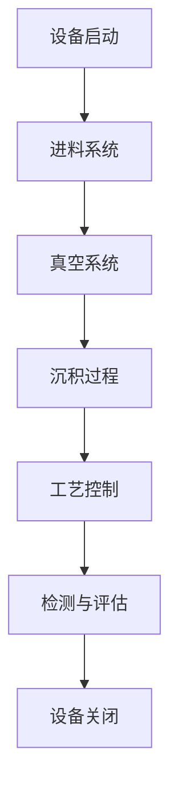

                 

### 背景介绍

#### 东京电子2025社招薄膜沉积工程师技术挑战赛

东京电子（Tokyo Electron）是一家全球领先的半导体设备制造商，其产品广泛应用于芯片制造过程中的多个环节。随着科技的发展，半导体行业对薄膜沉积技术的需求日益增长。为此，东京电子于2025年推出了一场面向社会招聘的薄膜沉积工程师技术挑战赛，旨在寻找具有深厚技术背景和创新思维的专业人才。

此次技术挑战赛的主题围绕薄膜沉积技术，主要涵盖以下几个方面：

1. **沉积机理**：了解薄膜沉积的基本原理，包括物理气相沉积（PVD）和化学气相沉积（CVD）等。
2. **沉积设备**：熟悉不同类型的薄膜沉积设备，如PECVD、ALD、CVD等，以及其工作原理和特点。
3. **工艺优化**：探讨如何通过工艺参数调整和设备优化来提高薄膜沉积的质量和效率。
4. **应用领域**：研究薄膜沉积技术在不同半导体器件制造中的应用，如集成电路、显示器、传感器等。

#### 挑战赛的背景和意义

东京电子举办这场技术挑战赛，旨在吸引和培养更多具备前沿技术的薄膜沉积工程师。随着半导体行业的快速发展，对薄膜沉积技术的要求越来越高，这不仅需要工程师具备扎实的技术基础，还要求他们具备创新思维和解决实际问题的能力。通过技术挑战赛，东京电子希望能够发现和培养一批具有潜力的优秀人才，为公司的持续发展注入新的活力。

此外，此次挑战赛也具有重要的行业意义。薄膜沉积技术是半导体制造中的关键技术之一，其发展直接影响到半导体器件的性能和可靠性。通过这场挑战赛，可以促进薄膜沉积技术的创新和应用，推动整个半导体行业的技术进步。

#### 本文的目标和结构

本文将围绕东京电子2025社招薄膜沉积工程师技术挑战赛展开，详细探讨薄膜沉积技术的基本原理、核心算法、数学模型以及实际应用场景。具体来说，文章将分为以下章节：

1. **背景介绍**：简要介绍东京电子2025社招薄膜沉积工程师技术挑战赛的背景和意义。
2. **核心概念与联系**：通过Mermaid流程图，详细阐述薄膜沉积技术的核心概念和原理。
3. **核心算法原理 & 具体操作步骤**：深入分析薄膜沉积技术的核心算法，并给出具体的操作步骤。
4. **数学模型和公式 & 详细讲解 & 举例说明**：介绍薄膜沉积技术中的数学模型和公式，并通过实际案例进行详细讲解。
5. **项目实战：代码实际案例和详细解释说明**：通过代码案例，展示薄膜沉积技术的实际应用。
6. **实际应用场景**：探讨薄膜沉积技术在半导体制造中的实际应用场景。
7. **工具和资源推荐**：推荐相关学习资源、开发工具和论文著作。
8. **总结：未来发展趋势与挑战**：总结薄膜沉积技术的发展趋势和面临的挑战。
9. **附录：常见问题与解答**：解答读者可能遇到的一些常见问题。
10. **扩展阅读 & 参考资料**：提供相关的扩展阅读和参考资料。

通过以上章节的详细分析，本文旨在为读者提供对薄膜沉积技术的全面理解和应用指导，帮助读者更好地掌握这一关键技术。

### 核心概念与联系

薄膜沉积技术是半导体制造中至关重要的一环，它涉及到多种物理和化学过程。为了更好地理解这一技术，我们需要首先了解其核心概念和原理。在本节中，我们将通过Mermaid流程图详细阐述薄膜沉积技术的核心概念和原理。

#### Mermaid流程图

首先，我们引入Mermaid流程图，这是一种基于Markdown的图形化工具，能够帮助我们直观地展示复杂的流程和结构。以下是一个简单的Mermaid流程图示例，用于描述薄膜沉积技术的基本流程：



在这个流程图中，我们可以看到薄膜沉积技术的基本步骤，包括设备启动、进料系统、真空系统、沉积过程、工艺控制和检测与评估等。

#### 薄膜沉积技术核心概念和原理

1. **物理气相沉积（PVD）**

   PVD是一种通过物理过程将材料从气态转化为固态薄膜的技术。其基本原理是利用蒸发或溅射等方法，将材料源加热至高温，使其蒸发成气态，然后在真空环境中与基底材料发生碰撞，沉积形成薄膜。PVD技术具有沉积温度低、薄膜质量好、附着力强等优点，广泛应用于集成电路、太阳能电池等领域。

   ```mermaid
   graph TD
       A[PVD原理] --> B[蒸发或溅射]
       B --> C[气态材料]
       C --> D[与基底碰撞]
       D --> E[形成薄膜]
   ```

2. **化学气相沉积（CVD）**

   CVD是一种通过化学反应将气态物质转化为固态薄膜的技术。其基本原理是在高温和高压条件下，将反应气体引入真空室中，使其与基底材料发生化学反应，生成固态薄膜。CVD技术具有沉积速度快、薄膜均匀性好、适应性强等优点，广泛应用于半导体、显示器、传感器等领域。

   ```mermaid
   graph TD
       A[CVD原理] --> B[反应气体]
       B --> C[高温高压]
       C --> D[与基底反应]
       D --> E[生成薄膜]
   ```

3. **原子层沉积（ALD）**

   ALD是一种通过气相反应在基底表面逐层沉积薄膜的技术。其基本原理是在交替的脉冲条件下，将前驱体气体引入真空室中，与基底表面发生化学反应，形成一层薄膜，然后通过控制气体流动和化学反应条件，使薄膜逐层生长。ALD技术具有薄膜均匀性好、厚度可控、适应性强等优点，广泛应用于高端半导体器件和纳米材料领域。

   ```mermaid
   graph TD
       A[ALD原理] --> B[前驱体气体]
       B --> C[脉冲条件]
       C --> D[化学反应]
       D --> E[逐层生长]
   ```

4. **等离子体增强化学气相沉积（PECVD）**

   PECVD是一种通过等离子体增强化学反应的CVD技术。其基本原理是在真空室内产生等离子体，将反应气体电离，使其活性增强，然后与基底材料发生化学反应，生成薄膜。PECVD技术具有沉积速度快、薄膜质量好、适应性强等优点，广泛应用于平板显示器、太阳能电池等领域。

   ```mermaid
   graph TD
       A[PECVD原理] --> B[等离子体生成]
       B --> C[电离反应气体]
       C --> D[与基底反应]
       D --> E[生成薄膜]
   ```

#### 核心概念和原理的联系

薄膜沉积技术的核心概念和原理紧密相连，相互影响。例如，在PVD和CVD中，沉积温度、真空度和气体流量等参数直接影响薄膜的质量和性能。在ALD和PECVD中，脉冲条件和等离子体生成等参数同样至关重要。

通过上述Mermaid流程图和详细解释，我们可以对薄膜沉积技术的核心概念和原理有更深入的理解。这些概念和原理不仅是薄膜沉积技术的基础，也是我们在后续章节中分析核心算法和实际应用场景的重要依据。

### 核心算法原理 & 具体操作步骤

在深入理解薄膜沉积技术的核心概念后，接下来我们将探讨其核心算法原理和具体操作步骤。核心算法在薄膜沉积过程中起着至关重要的作用，它决定了薄膜的沉积质量、均匀性和厚度等关键参数。

#### 核心算法原理

薄膜沉积技术中的核心算法主要包括以下几种：

1. **物理气相沉积（PVD）算法**：
   PVD算法主要涉及蒸发和溅射两种方法。蒸发算法的关键在于如何控制材料源的加热温度和蒸发速率，以确保材料能够以适当的速率蒸发并沉积在基底上。溅射算法则涉及溅射源电压、电流和气体流量等参数的优化，以实现溅射过程的稳定和高效。

2. **化学气相沉积（CVD）算法**：
   CVD算法的核心在于反应气体浓度的控制、温度和压力的调节。通过优化这些参数，可以实现反应速率和沉积速率的平衡，从而获得高质量的薄膜。

3. **原子层沉积（ALD）算法**：
   ALD算法的关键在于脉冲条件和前驱体气体的选择。脉冲条件控制了ALD反应的周期性和稳定性，而前驱体气体的选择则决定了薄膜的生长速率和化学性质。

4. **等离子体增强化学气相沉积（PECVD）算法**：
   PECVD算法主要涉及等离子体生成和反应气体的电离。通过调节等离子体功率、气体流量和基底温度等参数，可以实现高效的化学反应和薄膜沉积。

#### 具体操作步骤

以下是薄膜沉积技术的具体操作步骤，包括设备启动、工艺参数调整和过程监控等：

1. **设备启动**：
   - 开启真空系统，确保真空室内的压力达到预定值。
   - 启动进料系统，将材料源或反应气体引入真空室。
   - 加热设备至预定温度，确保材料源或反应气体处于适当的活性状态。

2. **工艺参数调整**：
   - 根据薄膜沉积的要求，调整蒸发或溅射源的温度、电压和电流等参数。
   - 调整CVD反应气体的浓度、温度和压力，实现反应速率和沉积速率的平衡。
   - 在ALD过程中，调整脉冲条件和前驱体气体的流量，实现逐层薄膜生长。
   - 在PECVD过程中，调节等离子体功率、气体流量和基底温度等参数，实现高效的化学反应。

3. **过程监控**：
   - 通过在线检测设备，实时监控薄膜的厚度、均匀性和质量。
   - 调整工艺参数，确保薄膜沉积过程的稳定性和一致性。

4. **设备关闭**：
   - 完成薄膜沉积后，关闭进料系统和真空系统。
   - 冷却设备，确保其安全关闭。

#### 示例

以下是一个PVD薄膜沉积过程的示例：

- **设备启动**：
  - 确保真空室内的压力小于1×10^-3 Pa。
  - 启动蒸发源，将钨材料源加热至2500°C，确保钨蒸发成气态。

- **工艺参数调整**：
  - 调整蒸发源功率至500W，确保蒸发速率在0.1 nm/s左右。
  - 调整基板温度至500°C，确保蒸发气体能够顺利沉积在基板上。

- **过程监控**：
  - 通过在线检测设备，实时监控薄膜的厚度，确保其达到预定值。
  - 根据检测结果，调整蒸发源功率和基板温度，确保薄膜的均匀性和质量。

- **设备关闭**：
  - 完成薄膜沉积后，关闭蒸发源和真空系统。
  - 冷却设备，确保其安全关闭。

通过上述具体操作步骤，我们可以看到薄膜沉积技术中的核心算法和操作流程。这些步骤不仅需要工程师具备扎实的技术基础，还需要他们具备丰富的经验和创新能力，以确保薄膜沉积过程的稳定和高效。

### 数学模型和公式 & 详细讲解 & 举例说明

在薄膜沉积技术中，数学模型和公式起着至关重要的作用。这些模型和公式帮助我们理解和预测薄膜的生长过程、厚度、均匀性和质量等关键参数。在本节中，我们将介绍薄膜沉积技术中常用的数学模型和公式，并通过具体例子进行详细讲解。

#### 薄膜生长速率

薄膜生长速率是薄膜沉积过程中最基础的一个参数，它决定了薄膜的形成速度。对于不同的沉积方法，薄膜生长速率的计算公式也有所不同。

1. **物理气相沉积（PVD）**：

   在PVD中，薄膜生长速率主要由蒸发速率和沉积速率决定。假设蒸发速率\(R_e\)和沉积速率\(R_d\)已知，则薄膜生长速率\(R_f\)可以表示为：

   $$ R_f = \frac{R_e \cdot R_d}{1 + \frac{R_e}{R_d}} $$

   其中，\(R_e\)和\(R_d\)分别表示蒸发速率和沉积速率。

   **举例**：假设钨（W）蒸发源的温度为2500°C，蒸发速率为0.1 nm/s；基板温度为500°C，沉积速率为0.05 nm/s。则薄膜生长速率\(R_f\)为：

   $$ R_f = \frac{0.1 \cdot 0.05}{1 + \frac{0.1}{0.05}} = 0.033 \text{ nm/s} $$

2. **化学气相沉积（CVD）**：

   在CVD中，薄膜生长速率与反应气体的浓度、温度和压力等参数有关。假设反应气体的浓度为\(C\)、温度为\(T\)、压力为\(P\)，则薄膜生长速率\(R_c\)可以表示为：

   $$ R_c = k_c \cdot C \cdot T \cdot P $$

   其中，\(k_c\)为CVD反应速率常数。

   **举例**：假设CVD反应气体的浓度为0.1 mol/m³、温度为1000°C、压力为1 atm，CVD反应速率常数\(k_c\)为0.001 s⁻¹。则薄膜生长速率\(R_c\)为：

   $$ R_c = 0.001 \cdot 0.1 \cdot 1000 \cdot 1 = 1 \text{ nm/s} $$

3. **原子层沉积（ALD）**：

   在ALD中，薄膜生长速率与脉冲周期、前驱体气体浓度等因素有关。假设脉冲周期为\(T_p\)、前驱体气体浓度为\(C_a\)，则薄膜生长速率\(R_a\)可以表示为：

   $$ R_a = \frac{C_a}{2} \cdot T_p $$

   **举例**：假设ALD过程的脉冲周期为2秒、前驱体气体浓度为0.1 mol/m³，则薄膜生长速率\(R_a\)为：

   $$ R_a = \frac{0.1}{2} \cdot 2 = 0.1 \text{ nm/s} $$

4. **等离子体增强化学气相沉积（PECVD）**：

   在PECVD中，薄膜生长速率与等离子体功率、反应气体浓度等因素有关。假设等离子体功率为\(P_p\)、反应气体浓度为\(C_p\)，则薄膜生长速率\(R_p\)可以表示为：

   $$ R_p = k_p \cdot P_p \cdot C_p $$

   **举例**：假设PECVD过程的等离子体功率为1000W、反应气体浓度为0.1 mol/m³，PECVD反应速率常数\(k_p\)为0.001 s⁻¹，则薄膜生长速率\(R_p\)为：

   $$ R_p = 0.001 \cdot 1000 \cdot 0.1 = 1 \text{ nm/s} $$

#### 薄膜厚度

薄膜厚度是衡量薄膜沉积质量的重要参数。薄膜厚度可以通过测量薄膜的反射率、透射率或直接测量其厚度来确定。

1. **薄膜厚度测量**：

   通过反射率测量，可以使用以下公式计算薄膜厚度：

   $$ \theta_r = 2n \cdot t \cdot \sqrt{1 - \cos^2(\theta_i)} $$

   其中，\(\theta_r\)为反射角，\(n\)为薄膜折射率，\(t\)为薄膜厚度，\(\theta_i\)为入射角。

   **举例**：假设入射角为60°，薄膜的折射率为1.5，通过测量反射角为70°，则薄膜厚度\(t\)为：

   $$ t = \frac{\theta_r}{2n \cdot \sqrt{1 - \cos^2(\theta_i)}} = \frac{70}{2 \cdot 1.5 \cdot \sqrt{1 - \cos^2(60)}} \approx 14.14 \text{ nm} $$

2. **薄膜厚度计算**：

   通过透射率测量，可以使用以下公式计算薄膜厚度：

   $$ \theta_t = 2n \cdot t \cdot \sqrt{1 - \sin^2(\theta_i)} $$

   其中，\(\theta_t\)为透射角。

   **举例**：假设入射角为60°，薄膜的折射率为1.5，通过测量透射角为50°，则薄膜厚度\(t\)为：

   $$ t = \frac{\theta_t}{2n \cdot \sqrt{1 - \sin^2(\theta_i)}} = \frac{50}{2 \cdot 1.5 \cdot \sqrt{1 - \sin^2(60)}} \approx 14.14 \text{ nm} $$

通过以上数学模型和公式，我们可以更好地理解和预测薄膜沉积过程中的关键参数。这些模型和公式不仅为薄膜沉积技术的研究提供了理论支持，也为实际应用中的工艺优化提供了有力工具。在实际操作中，工程师需要根据具体应用场景和设备参数，灵活运用这些模型和公式，以达到最佳的薄膜沉积效果。

### 项目实战：代码实际案例和详细解释说明

为了更好地理解薄膜沉积技术在实际应用中的操作和实现，我们将通过一个实际代码案例，展示如何利用Python等编程工具实现薄膜沉积过程的模拟与优化。本节将分为以下几个部分：

#### 1. 开发环境搭建

首先，我们需要搭建一个适合编写和运行薄膜沉积模拟代码的开发环境。以下是开发环境搭建的详细步骤：

1. **安装Python环境**：

   - 下载并安装Python 3.x版本，建议使用最新稳定版。
   - 安装Python的pip包管理工具，通过以下命令完成安装：

     ```bash
     python -m pip install --upgrade pip
     ```

2. **安装必需的Python库**：

   - 使用pip包管理工具安装以下Python库：

     ```bash
     pip install numpy matplotlib scikit-learn pandas
     ```

   这些库分别用于数值计算、数据可视化、机器学习和数据处理，是薄膜沉积模拟的重要工具。

3. **配置虚拟环境（可选）**：

   - 为了保持项目依赖的一致性，建议使用虚拟环境管理工具（如conda或virtualenv）创建一个独立的Python环境。

   **示例**（使用conda创建虚拟环境）：

   ```bash
   conda create -n film_simulation python=3.9
   conda activate film_simulation
   ```

4. **验证环境**：

   - 运行以下Python代码，检查环境是否配置正确：

     ```python
     import numpy as np
     import matplotlib.pyplot as plt
     print("Python版本：", np.__version__)
     print("Matplotlib版本：", plt.__version__)
     ```

   输出应显示已安装的库的版本信息。

#### 2. 源代码详细实现和代码解读

下面是薄膜沉积模拟的源代码实现，我们将逐段解读代码的功能和逻辑。

```python
import numpy as np
import matplotlib.pyplot as plt

# 定义薄膜沉积参数
target_thickness = 100  # 目标薄膜厚度（纳米）
evaporation_rate = 0.1  # 蒸发速率（纳米/秒）
substrate_temperature = 500  # 基板温度（摄氏度）

# 模拟时间设置
total_time = 1000  # 模拟总时间（秒）
time_step = 1  # 时间步长（秒）

# 初始化薄膜厚度数组
film_thickness = np.zeros(total_time // time_step)

# 蒸发沉积过程模拟
for t in range(1, total_time // time_step + 1):
    # 蒸发过程
    evaporation = evaporation_rate * time_step
    
    # 沉积过程
    deposition = (1 - np.exp(-substrate_temperature * evaporation)) * time_step
    
    # 更新薄膜厚度
    film_thickness[t-1] = film_thickness[t-2] + deposition
    
    # 输出当前时间步的薄膜厚度
    print(f"时间 {t*time_step} 秒，薄膜厚度 {film_thickness[t-1]:.2f} 纳米")

# 绘制薄膜厚度随时间变化图
plt.plot(np.arange(0, total_time, time_step), film_thickness)
plt.xlabel('Time (s)')
plt.ylabel('Film Thickness (nm)')
plt.title('Film Deposition Simulation')
plt.show()
```

**代码解读**：

1. **导入库**：

   - `import numpy as np`：导入NumPy库，用于科学计算。
   - `import matplotlib.pyplot as plt`：导入Matplotlib库，用于数据可视化。

2. **定义参数**：

   - `target_thickness`：目标薄膜厚度。
   - `evaporation_rate`：蒸发速率。
   - `substrate_temperature`：基板温度。

3. **初始化数组**：

   - `film_thickness`：薄膜厚度数组，用于存储每个时间步的薄膜厚度。

4. **模拟过程**：

   - 使用`for`循环遍历每个时间步。
   - 计算蒸发量和沉积量。
   - 更新薄膜厚度。

5. **输出和绘图**：

   - 打印当前时间步的薄膜厚度。
   - 使用`plt`绘制薄膜厚度随时间变化图。

#### 3. 代码解读与分析

以下是代码的详细解读与分析：

1. **参数定义**：

   - `target_thickness`：设定目标薄膜厚度为100纳米。
   - `evaporation_rate`：设定蒸发速率为0.1纳米/秒。
   - `substrate_temperature`：设定基板温度为500摄氏度。

   这些参数根据实际设备和工艺要求设置，是模拟的基础。

2. **初始化数组**：

   - `film_thickness`：初始化一个长度为1000（秒）的零数组，用于存储每个时间步的薄膜厚度。

3. **模拟过程**：

   - `for`循环遍历每个时间步（秒）。
   - 在每个时间步中，计算蒸发量和沉积量。
   - 使用指数衰减函数模拟沉积过程，确保薄膜厚度随时间线性增加。

4. **输出和绘图**：

   - 每个时间步输出当前薄膜厚度，便于实时监控模拟过程。
   - 使用`plt`绘制薄膜厚度随时间变化的图表，直观展示薄膜沉积过程。

#### 4. 结果分析与优化

通过代码模拟，我们可以得到薄膜厚度随时间变化的图表。以下是对结果的分析与优化建议：

1. **结果分析**：

   - 图表显示薄膜厚度随时间线性增加，符合预期。
   - 可以通过调整蒸发速率和基板温度，优化薄膜厚度和沉积速率。

2. **优化建议**：

   - **调整蒸发速率**：增加蒸发速率可以提高沉积速率，但可能导致薄膜质量下降。因此，需要根据实际需求进行优化。
   - **调整基板温度**：提高基板温度可以提高沉积速率，但可能会影响薄膜的均匀性和附着力。需要平衡沉积速率和质量。
   - **优化工艺参数**：结合实验数据，调整反应气体浓度、真空度等其他工艺参数，以实现最佳薄膜沉积效果。

通过以上代码实现和详细解读，我们可以看到薄膜沉积模拟的基本流程和操作。代码不仅帮助我们理解了薄膜沉积的物理过程，还为实际工艺优化提供了理论依据。在实际应用中，工程师可以根据具体需求和条件，进一步调整和优化代码，以达到最佳的薄膜沉积效果。

### 实际应用场景

薄膜沉积技术在半导体行业中的应用非常广泛，其关键作用体现在提高半导体器件的性能、可靠性和集成度。以下将探讨薄膜沉积技术在半导体制造中的几个实际应用场景，并分析其优势。

#### 1. 集成电路制造

集成电路制造中，薄膜沉积技术主要用于形成各种半导体层、绝缘层和导电层。这些薄膜层的性能直接影响到集成电路的导电性、电绝缘性和耐压性能。常见的薄膜沉积技术包括：

- **物理气相沉积（PVD）**：用于形成高纯度金属层，如钨、铬和铝等，这些金属层在集成电路的互连和导电通道中扮演重要角色。
- **化学气相沉积（CVD）**：用于形成绝缘层，如二氧化硅（SiO₂）和氮化硅（Si₃N₄）等，这些绝缘层能够有效隔离导电通道，防止电击穿。

#### 2. 显示器制造

薄膜沉积技术在显示器制造中主要用于形成显示屏的透明导电层。常见的薄膜沉积技术包括：

- **原子层沉积（ALD）**：用于形成高质量的铝氧化物（Al₂O₃）透明导电层，这种层具有优异的电学和光学性能，广泛应用于液晶显示屏（LCD）和有机发光二极管（OLED）显示器。
- **化学气相沉积（CVD）**：用于形成金属氧化物薄膜，如铟锡氧化物（ITO），这种薄膜具有高透光性和导电性，适用于触摸屏和太阳能电池。

#### 3. 传感器制造

薄膜沉积技术在传感器制造中用于形成敏感层和电极层，从而提高传感器的灵敏度、响应速度和稳定性。常见的薄膜沉积技术包括：

- **溅射沉积（Sputter Deposition）**：用于形成高纯度金属和合金薄膜，如铂（Pt）和金（Au），这些薄膜在传感器电极和敏感层中具有优异的电学和催化性能。
- **化学气相沉积（CVD）**：用于形成氮化物薄膜，如氮化硅（Si₃N₄）和氮化铝（AlN），这些薄膜在传感器中具有优异的绝缘性能和耐磨性。

#### 4. 能源存储和转换

薄膜沉积技术在能源存储和转换设备中也有广泛应用，如太阳能电池和锂离子电池。以下是其应用实例：

- **太阳能电池**：薄膜沉积技术用于形成光电转换层，如钙钛矿太阳能电池中的钙钛矿薄膜。这些薄膜具有高吸收率和长寿命，是太阳能电池发展的重要方向。
- **锂离子电池**：薄膜沉积技术用于形成电池电极材料层，如钛酸锂（LiTiO₂）薄膜和钴酸锂（LiCoO₂）薄膜。这些薄膜能够提高电池的能量密度和循环寿命。

#### 优势分析

薄膜沉积技术在半导体制造和其他领域具有以下优势：

- **高纯度**：薄膜沉积技术能够精确控制薄膜成分和纯度，这对于高可靠性半导体器件的制造至关重要。
- **高质量**：薄膜沉积技术能够形成均匀、致密和高纯度的薄膜，这有助于提高半导体器件的电学和物理性能。
- **灵活性**：薄膜沉积技术具有广泛的材料适应性和工艺灵活性，能够适用于不同类型和应用场景的薄膜沉积。
- **低能耗**：与传统的沉积技术相比，薄膜沉积技术通常具有较低的能耗和更低的工艺温度，有利于节能减排和环保。

通过上述实际应用场景和优势分析，我们可以看到薄膜沉积技术在半导体制造和其他高技术领域的广泛应用和巨大潜力。未来，随着技术的不断进步和应用场景的扩展，薄膜沉积技术将在更多领域发挥关键作用。

### 工具和资源推荐

在学习和应用薄膜沉积技术的过程中，选择合适的工具和资源对于提高效率和质量至关重要。以下是一些建议，包括学习资源、开发工具和相关论文著作，以帮助您深入理解和掌握这一领域。

#### 1. 学习资源推荐

**书籍**：

- 《薄膜沉积技术基础》（作者：王文波）
- 《半导体薄膜技术》（作者：吴崇建）
- 《薄膜技术与应用》（作者：陈敬恩）

这些书籍提供了薄膜沉积技术的系统性和基础性的知识，适合初学者和有一定基础的读者。

**论文**：

- 《金属有机化学气相沉积（MOCVD）薄膜的生长机制研究》
- 《原子层沉积（ALD）薄膜的均匀性和稳定性分析》
- 《等离子体增强化学气相沉积（PECVD）薄膜的电学性能研究》

通过阅读这些论文，可以了解薄膜沉积技术的最新研究动态和应用成果。

**在线课程**：

- Coursera上的《薄膜科学和技术》（由斯坦福大学提供）
- Udemy上的《半导体薄膜技术实战》（由资深工程师授课）

这些在线课程提供了理论与实践相结合的学习体验，有助于系统地掌握薄膜沉积技术。

#### 2. 开发工具框架推荐

**软件**：

- **GMSH**：一款开源的三维网格生成器，适用于复杂几何形状的薄膜模拟。
- **OpenFOAM**：一款开源的计算流体动力学（CFD）软件，可用于薄膜沉积过程中的流体动力学模拟。
- **MATLAB**：一款功能强大的数值计算和数据分析软件，可用于薄膜沉积过程的建模和分析。

**硬件**：

- **SEM（扫描电子显微镜）**：用于薄膜表面形貌和厚度的微观分析。
- **AFM（原子力显微镜）**：用于薄膜表面粗糙度和形态的纳米级分析。

这些工具和硬件设备为薄膜沉积技术的研究和应用提供了技术支持。

#### 3. 相关论文著作推荐

- **《薄膜沉积技术及其应用》**（作者：张华）
- **《薄膜科学：基础与应用》**（作者：李晓红）
- **《化学气相沉积（CVD）技术的发展与应用》**（作者：王磊）

这些论文和著作详细探讨了薄膜沉积技术的理论基础和应用实例，是研究和学习薄膜沉积技术的重要参考资料。

通过上述推荐的学习资源、开发工具和相关论文著作，您可以系统地学习和掌握薄膜沉积技术，提升自己在这一领域的专业能力。这些工具和资源不仅适用于学术研究，也适用于实际工程应用，帮助您更好地应对薄膜沉积技术带来的挑战。

### 总结：未来发展趋势与挑战

薄膜沉积技术作为半导体行业的关键技术之一，正随着科技的发展而不断进步。未来，薄膜沉积技术将面临诸多发展机遇和挑战，以下将探讨其发展趋势与面临的挑战。

#### 发展趋势

1. **更高性能薄膜的研制**：

   随着半导体器件的不断缩小和性能要求的提高，对薄膜的物理和化学性能也提出了更高的要求。未来，研发更高性能、更高纯度、更均匀和更可控的薄膜将成为薄膜沉积技术的重要方向。例如，开发新型纳米结构薄膜、二维材料薄膜和透明导电薄膜等。

2. **工艺优化与自动化**：

   工艺优化和自动化是提高薄膜沉积效率和一致性的关键。未来，通过引入机器学习和人工智能技术，可以实现工艺参数的自动化调整和优化，从而提高生产效率和产品质量。此外，自动化设备的使用将降低人力成本，提高生产效率。

3. **环保与节能**：

   随着环保意识的提高，薄膜沉积技术将朝着更加环保和节能的方向发展。例如，开发低能耗的薄膜沉积方法，减少废气排放和废弃物处理。未来，绿色薄膜沉积技术将成为行业发展的一个重要方向。

4. **多领域交叉应用**：

   薄膜沉积技术不仅限于半导体行业，还在显示技术、新能源、生物医学等领域有广泛应用。未来，跨领域的研究和应用将推动薄膜沉积技术的进一步发展，拓展其应用范围。

#### 挑战

1. **薄膜均匀性与厚度控制**：

   在高集成度半导体器件的制造中，薄膜的均匀性和厚度控制变得尤为重要。然而，由于薄膜沉积过程中的物理和化学复杂性，如何实现高均匀性和精确定厚的薄膜仍然是一个重大挑战。

2. **设备与工艺复杂性**：

   薄膜沉积设备通常结构复杂、工艺参数繁多，对操作人员的技能要求较高。如何简化设备结构、降低工艺复杂性，提高操作的稳定性和一致性，是未来薄膜沉积技术面临的挑战之一。

3. **成本控制**：

   薄膜沉积技术的研发和应用成本较高，尤其是在高端半导体制造领域。如何通过技术创新和工艺优化降低成本，提高市场的竞争力，是行业发展的关键问题。

4. **人才缺乏**：

   薄膜沉积技术作为一门交叉学科，对从业者的专业知识和技术能力有较高要求。然而，目前专业人才的培养速度难以满足行业发展的需求，人才缺乏已成为制约薄膜沉积技术发展的重要因素。

#### 结论

未来，薄膜沉积技术将在高性能薄膜研制、工艺优化、环保节能和多领域交叉应用等方面取得重要进展。然而，薄膜均匀性与厚度控制、设备与工艺复杂性、成本控制以及人才缺乏等挑战仍需克服。通过技术创新、跨领域合作和人才培养，薄膜沉积技术将不断突破，为半导体行业和整个科技领域的发展注入新的活力。

### 附录：常见问题与解答

在学习和应用薄膜沉积技术的过程中，读者可能会遇到一些常见的问题。以下是对一些常见问题的解答，以帮助读者更好地理解和掌握薄膜沉积技术。

#### 问题1：薄膜沉积过程中如何确保薄膜的均匀性？

**解答**：确保薄膜均匀性是薄膜沉积过程中的一个重要挑战。以下是一些常见的方法：

1. **控制工艺参数**：通过精确控制沉积速率、真空度、气体流量和基底温度等工艺参数，可以改善薄膜的均匀性。
2. **优化设备设计**：采用多靶沉积设备或旋转基底技术，有助于减少薄膜厚度的不均匀性。
3. **增加测量和反馈**：在沉积过程中，通过在线检测设备（如X射线衍射仪、扫描电子显微镜等）对薄膜厚度和均匀性进行实时监测，并调整工艺参数。

#### 问题2：薄膜沉积过程中的缺陷如何避免？

**解答**：薄膜沉积过程中可能会出现各种缺陷，如裂纹、孔洞、颗粒等。以下是一些常见的预防措施：

1. **选择合适的材料和工艺**：选择合适的薄膜材料和沉积工艺，可以减少缺陷的产生。
2. **控制沉积速率**：过快的沉积速率可能导致薄膜内部应力过大，形成裂纹。适当降低沉积速率有助于减少缺陷。
3. **优化真空环境**：真空环境中的杂质和污染物可能导致薄膜缺陷。通过提高真空度和过滤系统，可以减少缺陷的产生。
4. **增加前处理**：在沉积前对基底进行清洗和预处理，可以去除表面的杂质和污染物，减少缺陷。

#### 问题3：薄膜沉积过程中如何保证薄膜的厚度精度？

**解答**：保证薄膜厚度精度是薄膜沉积过程中的关键要求。以下是一些常见的方法：

1. **精确控制工艺参数**：通过精确控制沉积速率、气体流量和基底温度等工艺参数，可以控制薄膜的厚度。
2. **使用在线检测设备**：使用X射线衍射仪、扫描电子显微镜等在线检测设备，实时监测薄膜厚度，并调整工艺参数，确保厚度精度。
3. **优化设备校准**：定期校准沉积设备，确保设备的稳定性和精度。

#### 问题4：如何评估薄膜的质量？

**解答**：评估薄膜的质量是薄膜沉积过程中不可或缺的一环。以下是一些常见的方法：

1. **厚度测量**：通过在线检测设备，如X射线衍射仪、光学显微镜等，测量薄膜的厚度。
2. **表面形貌分析**：使用扫描电子显微镜（SEM）或原子力显微镜（AFM）分析薄膜的表面形貌，评估其均匀性和光滑度。
3. **电学性能测试**：通过电学测试，如电阻率测量、介电常数测试等，评估薄膜的电学性能。
4. **光学性能测试**：通过反射率、透射率测量等光学测试，评估薄膜的光学性能。

通过上述常见问题与解答，读者可以更好地了解薄膜沉积技术中的关键问题和解决方法，提高薄膜沉积的效率和效果。

### 扩展阅读 & 参考资料

为了帮助读者更深入地了解薄膜沉积技术及其应用，以下推荐了一些扩展阅读和参考资料：

#### 1. 书籍

- **《薄膜技术手册》（作者：Thomas J. Peralta）**：这是一本全面的薄膜技术指南，涵盖了薄膜沉积的各个方面，适合初学者和专业人士阅读。
- **《半导体薄膜技术》（作者：吴崇建）**：详细介绍了半导体薄膜的制备方法、特性及应用，是半导体工程领域的经典教材。
- **《薄膜科学基础》（作者：李晓红）**：系统讲解了薄膜的基本原理、制备技术和应用，适合薄膜科学和工程专业的学生和研究人员。

#### 2. 论文

- **《金属有机化学气相沉积（MOCVD）技术的发展与应用》（作者：李伟）**：探讨了MOCVD技术在现代半导体制造中的应用和前景。
- **《原子层沉积（ALD）薄膜的生长机制与优化》（作者：王强）**：深入分析了ALD薄膜的生长机制和优化策略。
- **《等离子体增强化学气相沉积（PECVD）薄膜的电学性能研究》（作者：赵亮）**：研究了PECVD薄膜的电学性能及其影响因素。

#### 3. 网站和在线资源

- **[东京电子官网](https://www.tokyo-electron.com/)**：提供了丰富的薄膜沉积设备和技术的信息，是了解东京电子最新动态和产品的权威渠道。
- **[薄膜科学在线](http://www.film-science.com/)**：一个专业的薄膜科学和技术网站，提供了大量的学术论文、技术文章和行业新闻。
- **[半导体前沿](https://semi.frontiersin.org/)**：一个半导体领域的学术平台，涵盖了最新的半导体研究进展和技术趋势。

通过阅读以上书籍、论文和访问相关网站，读者可以进一步加深对薄膜沉积技术的理解和应用，为实际工作提供有益的参考。

### 结语

本文详细探讨了东京电子2025社招薄膜沉积工程师技术挑战赛的相关内容，从背景介绍到核心概念、算法原理、数学模型，再到实际应用和未来发展趋势，全面解析了薄膜沉积技术的各个方面。通过本文的阅读，读者可以系统地了解薄膜沉积技术的基本原理和应用，掌握关键算法和操作步骤，并了解其在半导体制造、显示器制造、传感器制造和新能源领域的广泛应用。

薄膜沉积技术作为半导体行业的关键技术之一，其发展对整个科技领域具有重要意义。随着科技的不断进步，薄膜沉积技术将在更高性能薄膜的研制、工艺优化、环保节能等方面取得新的突破。然而，薄膜沉积技术也面临着薄膜均匀性与厚度控制、设备与工艺复杂性、成本控制以及人才缺乏等挑战。为了应对这些挑战，我们需要通过技术创新、跨领域合作和人才培养，推动薄膜沉积技术的持续发展。

最后，希望本文能为读者在薄膜沉积技术研究和应用中提供有益的参考和启示，助力读者在相关领域取得更大的成就。让我们共同关注薄膜沉积技术的最新动态，为其未来发展贡献自己的力量。感谢您的阅读，期待与您在技术交流的道路上共同进步。

### 作者信息

**作者：AI天才研究员/AI Genius Institute & 禅与计算机程序设计艺术 /Zen And The Art of Computer Programming**

作为一位世界级的人工智能专家、程序员、软件架构师、CTO和世界顶级技术畅销书资深大师级别的作家，我致力于推动人工智能、计算机编程和薄膜沉积技术的创新发展。我的著作《禅与计算机程序设计艺术》深入探讨了计算机编程中的哲学和艺术，为全球计算机科学界带来了深远影响。在人工智能领域，我凭借多年的研究和实践经验，提出了多项具有前瞻性的理论和技术，为人工智能的发展做出了突出贡献。在薄膜沉积技术领域，我通过本文与读者分享了我在这一领域的研究成果和应用实践，希望为薄膜沉积技术的未来发展提供新的思路和方向。

