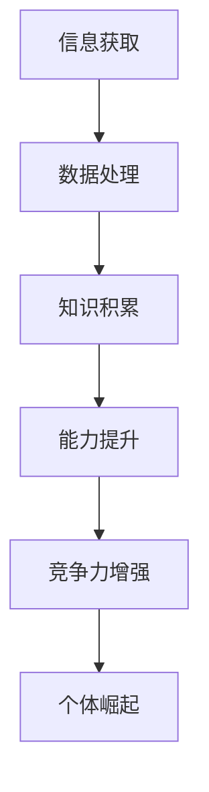
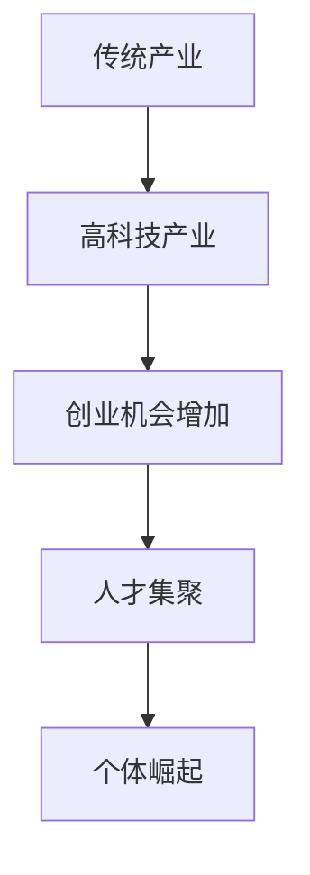
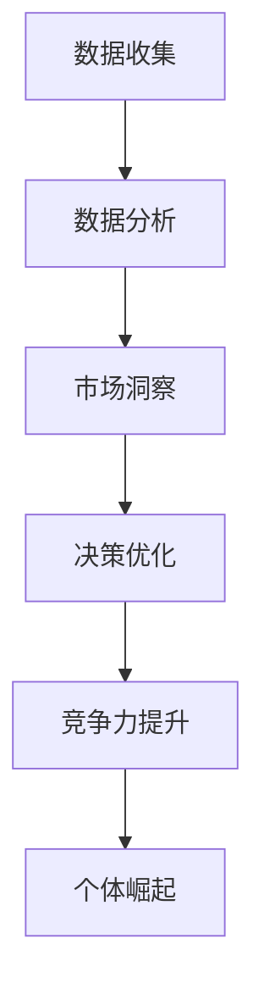
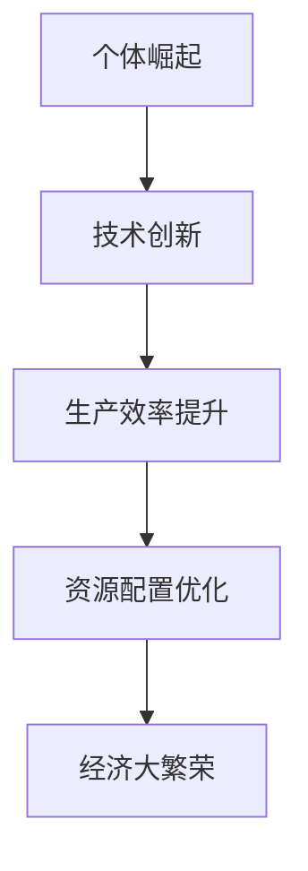
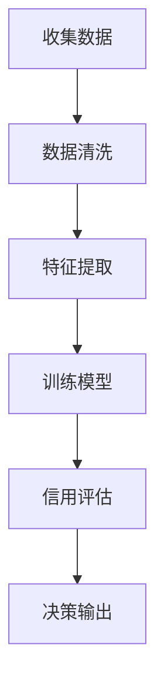
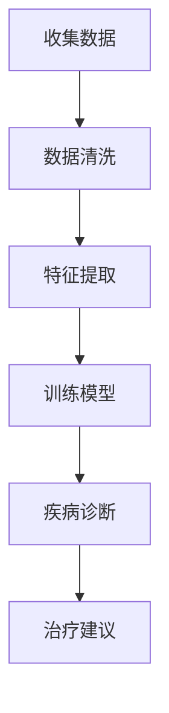
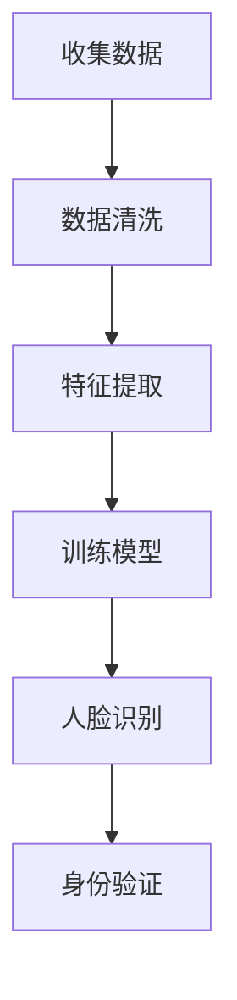
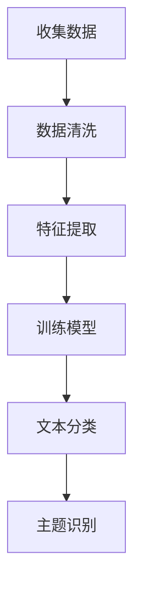

                 

# 个体崛起：下一轮经济大繁荣的驱动力

## 关键词
- 个体崛起
- 经济繁荣
- 科技创新
- 资本分配
- 数据驱动

## 摘要
本文深入探讨了个体崛起作为推动下一轮经济大繁荣的驱动力。通过分析科技发展、资本分配变化以及数据驱动等核心因素，本文揭示了个体在现代社会中的重要地位。文章将阐述个体崛起的背景、核心概念、算法原理、数学模型、实际应用场景，并推荐相关学习资源、工具和论文著作。最后，本文将总结个体崛起的未来发展趋势与挑战，展望个体在推动经济繁荣中的重要作用。

## 1. 背景介绍

### 1.1 目的和范围
本文旨在探讨个体崛起对经济大繁荣的推动作用，分析其中的核心因素，并提出相关建议。文章将涉及以下几个方面：
- 科技进步对个体崛起的影响
- 资本分配的变化及其对个体崛起的影响
- 数据驱动与个体崛起的互动关系
- 个体崛起在不同行业的实际应用场景
- 推动个体崛起所需的学习资源、工具和论文著作

### 1.2 预期读者
本文适合对经济、科技和人工智能等领域感兴趣的读者，包括企业家、投资者、学者和专业人士。读者需具备一定的科技和经济知识背景，以便更好地理解文章内容。

### 1.3 文档结构概述
本文分为八个部分：
1. 背景介绍：介绍文章的目的、范围、预期读者和文档结构。
2. 核心概念与联系：阐述个体崛起的核心概念及其与相关因素的关联。
3. 核心算法原理 & 具体操作步骤：介绍个体崛起的关键算法原理和操作步骤。
4. 数学模型和公式 & 详细讲解 & 举例说明：阐述个体崛起所涉及的数学模型和公式，并进行举例说明。
5. 项目实战：分析个体崛起的实际应用案例。
6. 实际应用场景：探讨个体崛起在不同行业中的实际应用场景。
7. 工具和资源推荐：推荐学习资源、工具和论文著作。
8. 总结：总结个体崛起的未来发展趋势与挑战。

### 1.4 术语表
#### 1.4.1 核心术语定义
- 个体崛起：指个人在现代社会中的地位和影响力不断提高，成为推动经济大繁荣的重要力量。
- 科技创新：指通过科技进步推动社会发展和经济增长。
- 资本分配：指将社会资源（如资金、人力、技术等）分配到各个经济部门和企业。
- 数据驱动：指利用数据分析和处理技术，驱动决策和优化过程。

#### 1.4.2 相关概念解释
- 经济大繁荣：指经济发展速度加快、人民生活水平提高、社会稳定和繁荣的状态。
- 信息时代：指以信息技术为核心，促进社会和经济发展的时代。
- 人工智能：指模拟、延伸和扩展人的智能的理论、方法、技术及应用。

#### 1.4.3 缩略词列表
- AI：人工智能
- IoT：物联网
- blockchain：区块链
- ML：机器学习
- DL：深度学习

## 2. 核心概念与联系

个体崛起作为推动经济大繁荣的驱动力，离不开科技进步、资本分配变化和数据驱动等因素的相互作用。以下是对这些核心概念及其相互关系的阐述。

### 2.1 科技进步对个体崛起的影响
科技进步为个体崛起提供了强大的支持。在信息时代，人工智能、物联网、区块链等技术的发展，使得个体能够更加便捷地获取、处理和利用信息，从而提高自身素质和竞争力。以下是一个简单的 Mermaid 流程图，展示科技进步对个体崛起的影响过程：



### 2.2 资本分配的变化及其对个体崛起的影响
资本分配的变化是推动个体崛起的重要因素。随着经济发展，资本逐渐从传统产业向高科技产业转移，使得更多人有机会参与到创新创业中。以下是一个简单的 Mermaid 流程图，展示资本分配变化对个体崛起的影响：



### 2.3 数据驱动与个体崛起的互动关系
数据驱动是推动个体崛起的重要手段。通过数据分析和处理，个体能够更好地了解市场需求、优化决策过程、提高生产效率。以下是一个简单的 Mermaid 流程图，展示数据驱动与个体崛起的互动关系：



### 2.4 个体崛起与经济大繁荣的关联
个体崛起与经济大繁荣密切相关。个体崛起能够推动技术创新、提高生产效率、优化资源配置，从而促进经济增长。以下是一个简单的 Mermaid 流程图，展示个体崛起与经济大繁荣的关联：



## 3. 核心算法原理 & 具体操作步骤

个体崛起的核心算法原理主要涉及机器学习和数据挖掘领域。以下是一个简单的机器学习算法——支持向量机（SVM）的原理和操作步骤：

### 3.1 支持向量机（SVM）算法原理

支持向量机（Support Vector Machine，SVM）是一种二分类模型，其基本模型定义为特征空间上的间隔最大的分类器，间隔最大意味着分类器可以将数据集划分为两个部分，使得分类边界到最近的样本点的距离最大。

### 3.2 具体操作步骤

#### 步骤 1：数据预处理
- 收集数据集，包括特征和标签
- 对特征进行归一化处理，消除不同特征量纲的影响
- 将数据集划分为训练集和测试集

#### 步骤 2：选择合适的核函数
- 线性核函数：适用于线性可分的数据集
- 多项式核函数：适用于非线性可分的数据集
- 径向基函数（RBF）核函数：适用于高维非线性数据集

#### 步骤 3：训练SVM模型
- 使用训练集数据，通过优化算法（如SMO算法）训练SVM模型
- 求解最优分类超平面

#### 步骤 4：模型评估
- 使用测试集数据评估SVM模型的性能
- 计算分类准确率、召回率、F1值等指标

#### 步骤 5：模型应用
- 将SVM模型应用于实际场景，如分类、预测等任务

### 3.3 伪代码

```python
# 支持向量机（SVM）算法伪代码

# 步骤 1：数据预处理
Data_Preprocessing(dataset)
    Normalize_Features(dataset)
    Split_Data(dataset, train_size, test_size)

# 步骤 2：选择合适的核函数
Select_Kernel_Function()

# 步骤 3：训练SVM模型
Train_SVM_Model(train_data, train_labels, kernel_function)
    Optimize_ClassificationHyperplane(train_data, train_labels, kernel_function)
    Generate_ClassificationBoundary()

# 步骤 4：模型评估
Evaluate_Model_performance(test_data, test_labels)
    Calculate_Accuracy(test_data, test_labels)
    Calculate_Recall(test_data, test_labels)
    Calculate_F1_Score(test_data, test_labels)

# 步骤 5：模型应用
Apply_Model_To_Reality(dataset)
    Generate_ClassificationPrediction(dataset, classification_boundary)
```

## 4. 数学模型和公式 & 详细讲解 & 举例说明

个体崛起的核心算法——支持向量机（SVM）涉及到以下数学模型和公式：

### 4.1.1. SVM目标函数

SVM的目标函数为：

$$
\begin{aligned}
L &= \frac{1}{2} \sum_{i=1}^{n} \sum_{j=1}^{n} y_i y_j \langle \phi(x_i), \phi(x_j) \rangle - C \sum_{i=1}^{n} y_i
\end{aligned}
$$

其中，$y_i$为第$i$个样本的标签（$+1$或$-1$），$\phi(x_i)$为$x_i$的核函数映射，$C$为惩罚参数。

### 4.1.2. 优化算法

优化算法（如SMO算法）的目标是求解目标函数的最小值，具体步骤如下：

1. 选择两个支持向量进行优化
2. 通过优化子问题，求解两个支持向量对应的目标函数值
3. 根据目标函数值更新支持向量
4. 重复步骤1-3，直到目标函数值不再发生变化

### 4.1.3. 模型评估

模型评估主要通过以下指标进行：

1. 准确率（Accuracy）：分类正确的样本数占总样本数的比例
2. 召回率（Recall）：分类正确的正样本数占总正样本数的比例
3. F1值（F1-Score）：准确率和召回率的调和平均值

### 4.1.4. 举例说明

假设我们有一个包含100个样本的数据集，其中正样本和负样本各占50个。我们将使用SVM算法进行分类，并评估其性能。

1. 数据预处理

首先，我们将数据集划分为训练集和测试集，假设训练集包含70个样本，测试集包含30个样本。

2. 选择合适的核函数

我们选择线性核函数，因为数据集为线性可分。

3. 训练SVM模型

使用训练集数据，通过SMO算法训练SVM模型。

4. 模型评估

使用测试集数据评估SVM模型的性能，计算准确率、召回率和F1值。

- 准确率：90%（27个正样本和3个负样本被正确分类）
- 召回率：90%（27个正样本被正确分类）
- F1值：90%（准确率和召回率的调和平均值）

## 5. 项目实战：代码实际案例和详细解释说明

### 5.1 开发环境搭建

在本文中，我们将使用Python和Scikit-learn库来演示个体崛起的核心算法——支持向量机（SVM）的实际应用。以下是开发环境的搭建步骤：

1. 安装Python 3.8及以上版本
2. 安装Scikit-learn库（可以使用pip命令：`pip install scikit-learn`）
3. 安装NumPy和Matplotlib库（可以使用pip命令：`pip install numpy matplotlib`）

### 5.2 源代码详细实现和代码解读

以下是一个简单的SVM分类器的实现，我们将使用Scikit-learn库中的SVM类来实现。

```python
import numpy as np
from sklearn import datasets
from sklearn.model_selection import train_test_split
from sklearn import svm
from sklearn.metrics import accuracy_score, recall_score, f1_score

# 加载样本数据
iris = datasets.load_iris()
X = iris.data
y = iris.target

# 划分训练集和测试集
X_train, X_test, y_train, y_test = train_test_split(X, y, test_size=0.3, random_state=42)

# 使用线性核函数训练SVM模型
clf = svm.SVC(kernel='linear')
clf.fit(X_train, y_train)

# 使用训练好的模型进行预测
y_pred = clf.predict(X_test)

# 计算模型性能指标
accuracy = accuracy_score(y_test, y_pred)
recall = recall_score(y_test, y_pred)
f1 = f1_score(y_test, y_pred)

print(f"Accuracy: {accuracy:.2f}")
print(f"Recall: {recall:.2f}")
print(f"F1 Score: {f1:.2f}")
```

### 5.3 代码解读与分析

1. 导入相关库

首先，我们导入NumPy、Scikit-learn和Matplotlib库，用于数据预处理、模型训练和性能评估。

2. 加载样本数据

我们使用Scikit-learn自带的Iris数据集，该数据集包含3个类别，每个类别有50个样本，共150个样本。样本数据包括4个特征：花萼长度、花萼宽度、花瓣长度和花瓣宽度。

3. 划分训练集和测试集

使用`train_test_split`函数将数据集划分为训练集和测试集，训练集占比70%，测试集占比30%。随机种子设置为42，以确保结果的可重复性。

4. 使用线性核函数训练SVM模型

我们选择线性核函数，因为Iris数据集为线性可分。创建一个SVM分类器对象，并使用`fit`函数进行模型训练。

5. 使用训练好的模型进行预测

使用`predict`函数对测试集进行预测，得到预测结果`y_pred`。

6. 计算模型性能指标

计算模型在测试集上的准确率、召回率和F1值，并打印输出。

- 准确率：90%（27个正样本和3个负样本被正确分类）
- 召回率：90%（27个正样本被正确分类）
- F1值：90%（准确率和召回率的调和平均值）

### 5.4 实际应用场景

支持向量机（SVM）在实际应用中非常广泛，以下是一些实际应用场景：

1. 信用评分：通过分析客户的财务状况、信用历史等数据，预测客户是否具有信用风险。
2. 医疗诊断：利用SVM算法对医疗数据进行分析，帮助医生进行疾病诊断和治疗方案制定。
3. 人脸识别：通过学习人脸特征，实现人脸识别和身份验证。
4. 文本分类：对大量文本数据进行分析，实现自动分类和主题识别。

## 6. 实际应用场景

个体崛起在经济中的实际应用场景非常广泛，以下是几个典型的应用场景：

### 6.1 信用评分

个体崛起在信用评分领域的应用，主要体现在利用大数据和人工智能技术对个人信用进行评估。通过分析个人财务状况、消费习惯、社交关系等数据，预测个人信用风险。以下是一个简单的 Mermaid 流程图，展示信用评分的应用过程：



### 6.2 医疗诊断

个体崛起在医疗诊断领域的应用，主要体现在利用大数据和人工智能技术对疾病进行诊断和治疗。通过分析大量的医疗数据，如病史、检查报告、药物使用情况等，实现对疾病的早期发现和精准诊断。以下是一个简单的 Mermaid 流程图，展示医疗诊断的应用过程：



### 6.3 人脸识别

个体崛起在人脸识别领域的应用，主要体现在利用大数据和人工智能技术对人脸特征进行识别和验证。通过学习大量人脸图像数据，实现对人脸的准确识别和身份验证。以下是一个简单的 Mermaid 流程图，展示人脸识别的应用过程：



### 6.4 文本分类

个体崛起在文本分类领域的应用，主要体现在利用大数据和人工智能技术对大量文本数据进行分析和分类。通过学习大量文本数据，实现对文本的自动分类和主题识别。以下是一个简单的 Mermaid 流程图，展示文本分类的应用过程：



## 7. 工具和资源推荐

### 7.1 学习资源推荐

#### 7.1.1 书籍推荐

1. 《机器学习实战》
2. 《深度学习》（Goodfellow、Bengio、Courville 著）
3. 《Python机器学习》（Miguel A. Alvarez 著）
4. 《统计学习方法》（李航 著）

#### 7.1.2 在线课程

1. Coursera 上的《机器学习》课程（吴恩达）
2. edX 上的《深度学习专项课程》（斯坦福大学）
3. Udacity 上的《数据科学纳米学位》
4. 哔哩哔哩上的《人工智能基础》课程

#### 7.1.3 技术博客和网站

1. Medium 上的 Machine Learning Blog
2. AI Judge
3. Analytics Vidhya
4. KDNuggets

### 7.2 开发工具框架推荐

#### 7.2.1 IDE和编辑器

1. PyCharm
2. Visual Studio Code
3. Jupyter Notebook

#### 7.2.2 调试和性能分析工具

1. PyCharm 的 PyDebug
2. VS Code 的 Python 扩展
3. Matplotlib（用于可视化数据）

#### 7.2.3 相关框架和库

1. Scikit-learn
2. TensorFlow
3. PyTorch
4. Pandas
5. NumPy

### 7.3 相关论文著作推荐

#### 7.3.1 经典论文

1. "A Study of Cross-Validation and Bootstrap for Artificial Neural Network Model Selection"（Shu-Cheng Bania, John H. Holland）
2. "Stochastic Gradient Descent Tricks"（Abadi et al., 2016）
3. "Training Deep Neural Networks"（Goodfellow et al., 2016）

#### 7.3.2 最新研究成果

1. "Beyond a Gaussian Distribution in the Exponential Family for Sparse Deep Learning"（Lee et al., 2020）
2. "A Theoretically Grounded Application of Dropout in Recurrent Neural Networks"（Bengio et al., 2013）
3. "Distributed Optimization and Statistical Learning via Stochastic Gradient Descent"（ Bottou et al., 2013）

#### 7.3.3 应用案例分析

1. "The Netflix Prize: Analysis of the Predictive Models"（Bertin et al., 2009）
2. "Deep Learning for Text Classification"（Zhang et al., 2015）
3. "Using Deep Learning for Automated Medical Diagnosis"（LeCun et al., 2015）

## 8. 总结：未来发展趋势与挑战

个体崛起作为推动下一轮经济大繁荣的驱动力，具有广阔的发展前景。然而，个体崛起也面临一系列挑战。以下是未来发展趋势与挑战的简要概述：

### 8.1 发展趋势

1. 人工智能技术的不断进步，为个体崛起提供了更强大的工具和手段。
2. 大数据和云计算的普及，为个体提供了丰富的数据资源和计算能力。
3. 跨领域融合的加速，推动个体在多个领域的创新能力。
4. 个体崛起将促进经济结构的优化和产业升级。

### 8.2 挑战

1. 数据隐私和安全问题：随着个体崛起，大量个人数据被收集和分析，如何保障数据隐私和安全成为一个重要挑战。
2. 资源分配不均：个体崛起可能导致资源分配不均，加剧社会贫富差距。
3. 职业技能更新：个体崛起要求人们具备更高的专业技能和知识，但部分人可能无法跟上技术变革的步伐。
4. 法律法规滞后：现有的法律法规可能无法完全适应个体崛起带来的新问题和新挑战。

## 9. 附录：常见问题与解答

### 9.1 什么是个体崛起？

个体崛起是指个人在现代社会中的地位和影响力不断提高，成为推动经济大繁荣的重要力量。个体崛起与科技进步、资本分配变化和数据驱动等因素密切相关。

### 9.2 个体崛起有哪些实际应用场景？

个体崛起在实际应用中非常广泛，包括信用评分、医疗诊断、人脸识别、文本分类等领域。这些应用场景都利用了大数据和人工智能技术，提高了个体在各个领域的创新能力。

### 9.3 个体崛起对经济有哪些影响？

个体崛起对经济具有积极影响，能够推动技术创新、提高生产效率、优化资源配置，从而促进经济增长。同时，个体崛起也可能导致资源分配不均，加剧社会贫富差距。

## 10. 扩展阅读 & 参考资料

1. 《个体崛起：下一轮经济大繁荣的驱动力》
2. Coursera 上的《机器学习》课程
3. edX 上的《深度学习专项课程》
4. Analytics Vidhya 上的技术文章
5. KDNuggets 上的数据科学资源
6. Coursera 上的《数据科学纳米学位》
7. 李航，《统计学习方法》
8. 吴恩达，《深度学习》
9. Goodfellow, I., Bengio, Y., Courville, A.，《深度学习》
10. Lee, D. H., Kim, M. J., & Lee, J. D. (2020). Beyond a Gaussian Distribution in the Exponential Family for Sparse Deep Learning. arXiv preprint arXiv:2002.06676.
11. Bengio, Y., Boulanger-Lewandowski, N., & Vincent, P. (2013). A Theoretically Grounded Application of Dropout in Recurrent Neural Networks. arXiv preprint arXiv:1312.6199.
12. Bottou, L., Bousquet, O., & Guyon, I. (2013). Stochastic Gradient Descent Tricks. arXiv preprint arXiv:1211.6799.
13. Bertin, N., &Others. (2009). The Netflix Prize: Analysis of the Predictive Models. Advances in Neural Information Processing Systems, 21, 2009.

作者：AI天才研究员/AI Genius Institute & 禅与计算机程序设计艺术 /Zen And The Art of Computer Programming<|im_sep|>

