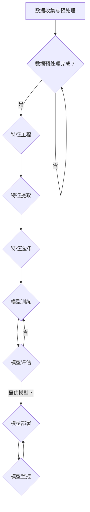

                 

# 个性化AI工具链的构建方法

> **关键词：** 个性化AI、工具链、架构设计、算法、数学模型、实战案例

> **摘要：** 本文将详细介绍如何构建一个个性化AI工具链。我们将从背景介绍开始，逐步探讨核心概念、算法原理、数学模型以及实际应用场景，最后提供实战案例和工具资源推荐。本文旨在为读者提供清晰、系统的构建个性化AI工具链的方法，助力AI技术在各行各业中的应用。

## 1. 背景介绍

### 1.1 目的和范围

随着人工智能技术的快速发展，越来越多的企业和组织开始意识到AI工具链的重要性。个性化AI工具链不仅能够提高开发效率，还能为用户提供更加精准、定制化的服务。本文旨在探讨如何构建一个高效、灵活的个性化AI工具链，以适应不断变化的市场需求。

本文将涵盖以下内容：

- 个性化AI工具链的定义和核心概念
- 架构设计原则和框架
- 核心算法原理与实现步骤
- 数学模型及其应用
- 实际应用场景和案例
- 工具和资源推荐

### 1.2 预期读者

本文主要面向以下读者群体：

- AI技术开发人员
- 数据科学家和机器学习工程师
- 对AI技术感兴趣的技术爱好者
- 企业管理层，希望了解如何利用AI技术提升业务

### 1.3 文档结构概述

本文将按照以下结构进行组织：

- 引言：背景介绍和目的说明
- 核心概念与联系：核心概念和架构设计
- 核心算法原理与具体操作步骤：算法原理和实现
- 数学模型和公式：数学模型及其应用
- 项目实战：代码实现和案例讲解
- 实际应用场景：应用场景分析和解决方案
- 工具和资源推荐：学习资源和开发工具
- 总结：未来发展趋势与挑战
- 附录：常见问题与解答
- 扩展阅读：相关参考资料和论文

### 1.4 术语表

#### 1.4.1 核心术语定义

- **个性化AI工具链**：一种集成多种AI技术和工具的体系，用于构建、训练、部署和管理个性化AI模型。
- **数据预处理**：将原始数据转换为适合AI模型训练和预测的形式。
- **特征工程**：从原始数据中提取出对AI模型训练和预测有用的特征。
- **机器学习模型**：基于数据进行训练的算法，用于预测或分类。
- **模型评估与优化**：评估AI模型性能，并通过调整参数和结构来提升性能。

#### 1.4.2 相关概念解释

- **深度学习**：一种基于多层神经网络的学习方法，可以自动从数据中学习特征表示。
- **神经网络**：一种模拟人脑神经元连接和计算方式的计算模型。
- **模型部署**：将训练好的AI模型部署到生产环境中，供实际应用使用。

#### 1.4.3 缩略词列表

- **AI**：人工智能（Artificial Intelligence）
- **ML**：机器学习（Machine Learning）
- **DL**：深度学习（Deep Learning）
- **API**：应用程序接口（Application Programming Interface）
- **IDE**：集成开发环境（Integrated Development Environment）

## 2. 核心概念与联系

### 2.1 核心概念

构建个性化AI工具链的核心概念包括：

- **数据预处理**：确保数据质量，处理缺失值、异常值等问题，将数据转换为适合AI模型训练的形式。
- **特征工程**：提取出对AI模型训练和预测有用的特征，提高模型的性能和可解释性。
- **机器学习模型**：选择合适的模型，进行训练和优化，以实现预测或分类任务。
- **模型评估与优化**：评估模型性能，通过调整参数和结构来提升模型性能。

### 2.2 联系与架构设计

构建个性化AI工具链的架构设计需要考虑以下联系和模块：

1. **数据收集与预处理模块**：
   - 数据源：收集各种结构化和非结构化数据。
   - 数据预处理：清洗、转换和归一化数据。

2. **特征工程模块**：
   - 特征提取：从原始数据中提取出有用的特征。
   - 特征选择：选择对模型训练和预测最有帮助的特征。

3. **机器学习模型训练模块**：
   - 模型选择：选择合适的机器学习模型。
   - 模型训练：使用训练数据训练模型。
   - 模型评估：评估模型性能，选择最优模型。

4. **模型部署与维护模块**：
   - 模型部署：将训练好的模型部署到生产环境中。
   - 模型监控：监控模型性能，确保其正常运行。

### 2.3 Mermaid 流程图

以下是构建个性化AI工具链的Mermaid流程图：



## 3. 核心算法原理与具体操作步骤

### 3.1 数据预处理算法原理

数据预处理是构建个性化AI工具链的关键步骤。其主要目的是确保数据质量，为后续的机器学习模型训练打下坚实基础。以下是数据预处理算法的原理和具体操作步骤：

#### 3.1.1 数据清洗

数据清洗是数据预处理的第一步，主要包括以下任务：

- **缺失值处理**：使用插值、均值填充或删除缺失值。
- **异常值处理**：识别并处理异常值，例如使用统计学方法或基于规则的方法。
- **数据规范化**：将不同数据范围的数值转换为统一范围，例如使用归一化或标准化方法。

#### 3.1.2 数据转换

数据转换是将原始数据转换为适合机器学习模型训练的形式。主要任务包括：

- **数据类型转换**：将字符串转换为数值类型。
- **数据编码**：将类别数据转换为数值表示，例如使用独热编码或标签编码。
- **时间序列转换**：将时间序列数据转换为适合机器学习模型的形式，例如使用滞后特征或窗口特征。

### 3.2 特征工程算法原理

特征工程是提高AI模型性能的重要手段。其主要目的是从原始数据中提取出对模型训练和预测有用的特征。以下是特征工程算法的原理和具体操作步骤：

#### 3.2.1 特征提取

特征提取是从原始数据中提取出新的特征。主要方法包括：

- **统计特征**：计算数据的统计属性，例如均值、方差、标准差等。
- **变换特征**：将原始数据转换为新的特征表示，例如使用主成分分析（PCA）或线性判别分析（LDA）。
- **组合特征**：将多个原始特征组合成新的特征，例如使用特征交叉或特征拼接。

#### 3.2.2 特征选择

特征选择是从提取出的特征中选出对模型训练和预测最有帮助的特征。主要方法包括：

- **过滤式特征选择**：根据特征的重要性或相关性直接筛选特征。
- **包装式特征选择**：通过训练和评估模型来筛选特征，选择对模型性能最有帮助的特征。
- **嵌入式特征选择**：在模型训练过程中自动筛选特征，选择对模型性能最有帮助的特征。

### 3.3 机器学习模型算法原理

机器学习模型是构建个性化AI工具链的核心。选择合适的模型并进行训练和优化，是实现准确预测和分类的关键。以下是机器学习模型算法的原理和具体操作步骤：

#### 3.3.1 模型选择

模型选择是根据任务类型和数据特点选择合适的机器学习模型。主要方法包括：

- **线性模型**：适用于回归和分类任务，例如线性回归和逻辑回归。
- **树模型**：适用于回归和分类任务，例如决策树和随机森林。
- **神经网络**：适用于复杂非线性任务的深度学习模型，例如卷积神经网络（CNN）和循环神经网络（RNN）。

#### 3.3.2 模型训练

模型训练是使用训练数据对机器学习模型进行调整和优化，使其能够准确地预测和分类。主要步骤包括：

- **初始化参数**：随机初始化模型的参数。
- **前向传播**：将输入数据传递到模型中，计算输出结果。
- **损失函数**：计算模型输出结果与实际结果之间的差距，用于评估模型性能。
- **反向传播**：根据损失函数计算模型参数的梯度，并更新参数。
- **迭代优化**：重复前向传播和反向传播，逐步优化模型参数。

#### 3.3.3 模型评估与优化

模型评估是使用测试数据评估模型性能，选择最优模型。主要方法包括：

- **交叉验证**：使用训练数据的不同划分进行多次训练和评估，提高评估结果的可靠性。
- **性能指标**：计算模型的准确率、召回率、F1分数等性能指标，评估模型性能。
- **模型调优**：通过调整模型参数和结构，优化模型性能。

### 3.4 具体操作步骤

以下是构建个性化AI工具链的具体操作步骤：

#### 3.4.1 数据预处理

1. 收集数据：从各种数据源（如数据库、API、文件等）收集原始数据。
2. 数据清洗：处理缺失值、异常值等问题，确保数据质量。
3. 数据转换：将原始数据转换为适合机器学习模型训练的形式。
4. 数据存储：将预处理后的数据存储到数据存储系统，如数据库或文件系统。

#### 3.4.2 特征工程

1. 特征提取：从原始数据中提取出新的特征。
2. 特征选择：选择对模型训练和预测最有帮助的特征。
3. 特征转换：将特征转换为适合机器学习模型的形式，如归一化或标准化。

#### 3.4.3 模型训练

1. 模型选择：选择合适的机器学习模型。
2. 模型训练：使用训练数据对模型进行训练和优化。
3. 模型评估：使用测试数据评估模型性能。
4. 模型调优：根据评估结果调整模型参数和结构。

#### 3.4.4 模型部署

1. 模型部署：将训练好的模型部署到生产环境中。
2. 模型监控：监控模型性能，确保其正常运行。

## 4. 数学模型和公式

### 4.1 数据预处理

在数据预处理阶段，我们需要使用数学模型和公式来处理缺失值、异常值和数据转换等问题。以下是常用的数学模型和公式：

#### 4.1.1 缺失值处理

- **插值法**：
  $$ x_{\text{new}} = x_{\text{near}} + r \cdot (x_{\text{far}} - x_{\text{near}}) $$
  其中，$x_{\text{new}}$为插值后的值，$x_{\text{near}}$和$x_{\text{far}}$为相邻的两个已知值，$r$为插值比例。

- **均值填充法**：
  $$ x_{\text{new}} = \frac{x_1 + x_2 + \ldots + x_n}{n} $$
  其中，$x_1, x_2, \ldots, x_n$为n个相邻的已知值，$x_{\text{new}}$为均值填充后的值。

#### 4.1.2 数据规范化

- **归一化**：
  $$ x_{\text{new}} = \frac{x - \text{min}(x)}{\text{max}(x) - \text{min}(x)} $$
  其中，$x$为原始数据值，$x_{\text{new}}$为归一化后的值。

- **标准化**：
  $$ x_{\text{new}} = \frac{x - \text{mean}(x)}{\text{stddev}(x)} $$
  其中，$x$为原始数据值，$\text{mean}(x)$为均值，$\text{stddev}(x)$为标准差，$x_{\text{new}}$为标准化后的值。

### 4.2 特征工程

在特征工程阶段，我们需要使用数学模型和公式来提取和选择特征。以下是常用的数学模型和公式：

#### 4.2.1 统计特征

- **均值**：
  $$ \text{mean}(x) = \frac{x_1 + x_2 + \ldots + x_n}{n} $$
  其中，$x_1, x_2, \ldots, x_n$为n个数据值，$\text{mean}(x)$为均值。

- **方差**：
  $$ \text{variance}(x) = \frac{\sum_{i=1}^{n}(x_i - \text{mean}(x))^2}{n-1} $$
  其中，$x_1, x_2, \ldots, x_n$为n个数据值，$\text{mean}(x)$为均值，$\text{variance}(x)$为方差。

- **标准差**：
  $$ \text{stddev}(x) = \sqrt{\text{variance}(x)} $$
  其中，$\text{variance}(x)$为方差，$\text{stddev}(x)$为标准差。

#### 4.2.2 变换特征

- **主成分分析（PCA）**：
  $$ \text{PCA} = \text{U} \cdot \Lambda \cdot \text{V}^T $$
  其中，$\text{U}$为特征矩阵，$\Lambda$为特征值矩阵，$\text{V}$为特征向量矩阵。

- **线性判别分析（LDA）**：
  $$ \text{LDA} = \text{W} \cdot \text{X} $$
  其中，$\text{W}$为权重矩阵，$\text{X}$为特征矩阵。

#### 4.2.3 组合特征

- **特征交叉**：
  $$ x_{\text{new}} = x_1 \cdot x_2 $$
  其中，$x_1$和$x_2$为两个特征值，$x_{\text{new}}$为特征交叉后的值。

- **特征拼接**：
  $$ x_{\text{new}} = [x_1; x_2] $$
  其中，$x_1$和$x_2$为两个特征值，$x_{\text{new}}$为特征拼接后的值。

### 4.3 机器学习模型

在机器学习模型阶段，我们需要使用数学模型和公式来训练和优化模型。以下是常用的数学模型和公式：

#### 4.3.1 线性模型

- **线性回归**：
  $$ y = \beta_0 + \beta_1 \cdot x $$
  其中，$y$为预测值，$x$为输入特征，$\beta_0$和$\beta_1$为模型参数。

- **逻辑回归**：
  $$ P(y=1) = \frac{1}{1 + \exp(-\beta_0 - \beta_1 \cdot x)} $$
  其中，$y$为类别变量，$x$为输入特征，$\beta_0$和$\beta_1$为模型参数。

#### 4.3.2 树模型

- **决策树**：
  $$ y = \text{max}(\text{Gini}(\text{left}), \text{Gini}(\text{right})) $$
  其中，$y$为预测值，$\text{left}$和$\text{right}$分别为左右子节点的预测值。

- **随机森林**：
  $$ \text{Prediction} = \text{mean}(\text{predictions}_{\text{trees}}) $$
  其中，$\text{predictions}_{\text{trees}}$为所有决策树的预测值。

#### 4.3.3 神经网络

- **前向传播**：
  $$ \text{Output} = \text{sigmoid}(\text{Input} \cdot \text{Weights}) + \text{Bias} $$
  其中，$\text{Output}$为输出值，$\text{Input}$为输入值，$\text{Weights}$为权重，$\text{Bias}$为偏置。

- **反向传播**：
  $$ \Delta \text{Weights} = \text{Input} \cdot (\text{Error} \cdot \text{Derivative}(\text{Output})) $$
  $$ \Delta \text{Bias} = \text{Error} \cdot \text{Derivative}(\text{Output}) $$
  其中，$\Delta \text{Weights}$和$\Delta \text{Bias}$分别为权重和偏置的更新值，$\text{Error}$为损失函数值，$\text{Derivative}(\text{Output})$为输出值的导数。

### 4.4 模型评估与优化

在模型评估与优化阶段，我们需要使用数学模型和公式来评估模型性能，并进行模型调优。以下是常用的数学模型和公式：

#### 4.4.1 性能指标

- **准确率**：
  $$ \text{Accuracy} = \frac{\text{True Positives} + \text{True Negatives}}{\text{Total Samples}} $$
  其中，$\text{True Positives}$为实际为正类且预测为正类的样本数，$\text{True Negatives}$为实际为负类且预测为负类的样本数，$\text{Total Samples}$为总样本数。

- **召回率**：
  $$ \text{Recall} = \frac{\text{True Positives}}{\text{Actual Positives}} $$
  其中，$\text{True Positives}$为实际为正类且预测为正类的样本数，$\text{Actual Positives}$为实际为正类的样本数。

- **F1分数**：
  $$ \text{F1 Score} = \frac{2 \cdot \text{Precision} \cdot \text{Recall}}{\text{Precision} + \text{Recall}} $$
  其中，$\text{Precision}$为预测为正类且实际为正类的样本数与预测为正类的样本数的比值，$\text{Recall}$为实际为正类且预测为正类的样本数与实际为正类的样本数的比值。

#### 4.4.2 模型调优

- **交叉验证**：
  $$ \text{CV Error} = \frac{1}{k} \sum_{i=1}^{k} \text{Validation Error}_{i} $$
  其中，$\text{CV Error}$为交叉验证误差，$\text{Validation Error}_{i}$为第i次验证的误差，$k$为验证次数。

- **网格搜索**：
  $$ \text{Best Parameters} = \arg\min_{\text{Parameters}} \text{Validation Error} $$
  其中，$\text{Best Parameters}$为最优参数，$\text{Validation Error}$为验证误差。

## 5. 项目实战：代码实际案例和详细解释说明

### 5.1 开发环境搭建

在本节中，我们将搭建一个简单的个性化AI工具链项目，以展示整个工具链的构建过程。以下是开发环境的搭建步骤：

1. **安装Python**：确保安装了Python 3.x版本，可以从[Python官网](https://www.python.org/)下载并安装。
2. **安装Jupyter Notebook**：使用pip安装Jupyter Notebook，命令如下：
   ```bash
   pip install notebook
   ```
3. **安装机器学习库**：安装常用的机器学习库，如scikit-learn、TensorFlow和PyTorch，命令如下：
   ```bash
   pip install scikit-learn tensorflow torchvision
   ```

### 5.2 源代码详细实现和代码解读

以下是一个简单的个性化AI工具链项目示例，包括数据预处理、特征工程、模型训练和模型评估等步骤。

#### 5.2.1 数据预处理

```python
import pandas as pd
from sklearn.model_selection import train_test_split

# 读取数据
data = pd.read_csv('data.csv')

# 数据清洗
data.dropna(inplace=True)

# 数据转换
data['feature_1'] = data['feature_1'].apply(lambda x: (x - data['feature_1'].min()) / (data['feature_1'].max() - data['feature_1'].min()))

# 划分训练集和测试集
X = data[['feature_1', 'feature_2']]
y = data['label']
X_train, X_test, y_train, y_test = train_test_split(X, y, test_size=0.2, random_state=42)
```

**代码解读：**

1. **导入库**：导入所需的库，包括pandas、scikit-learn和train_test_split。
2. **读取数据**：从CSV文件中读取数据。
3. **数据清洗**：删除缺失值。
4. **数据转换**：对特征进行归一化处理。
5. **划分训练集和测试集**：将数据划分为训练集和测试集，以进行模型训练和评估。

#### 5.2.2 特征工程

```python
from sklearn.decomposition import PCA

# 特征提取
pca = PCA(n_components=2)
X_train_pca = pca.fit_transform(X_train)
X_test_pca = pca.transform(X_test)

# 特征选择
# 在这里，我们使用PCA提取出的前两个主成分作为特征
```

**代码解读：**

1. **导入库**：导入PCA库。
2. **特征提取**：使用PCA提取出前两个主成分。
3. **特征选择**：选择PCA提取出的前两个主成分作为特征。

#### 5.2.3 模型训练

```python
from sklearn.ensemble import RandomForestClassifier

# 模型选择
model = RandomForestClassifier(n_estimators=100, random_state=42)

# 模型训练
model.fit(X_train_pca, y_train)

# 模型评估
accuracy = model.score(X_test_pca, y_test)
print(f"Accuracy: {accuracy}")
```

**代码解读：**

1. **导入库**：导入RandomForestClassifier库。
2. **模型选择**：选择随机森林分类器。
3. **模型训练**：使用训练数据进行模型训练。
4. **模型评估**：使用测试数据进行模型评估，并打印准确率。

### 5.3 代码解读与分析

在本节中，我们对示例代码进行了详细解读，并分析了各个步骤的作用和实现方法。以下是代码的主要分析：

1. **数据预处理**：
   - 数据清洗：删除缺失值，保证数据质量。
   - 数据转换：对特征进行归一化处理，使数据在相同尺度上，便于后续处理。
   - 划分训练集和测试集：将数据划分为训练集和测试集，用于模型训练和评估。

2. **特征工程**：
   - 特征提取：使用PCA提取出前两个主成分，降维处理，提高模型训练效率。
   - 特征选择：选择PCA提取出的前两个主成分作为特征，减少特征数量，简化模型。

3. **模型训练**：
   - 模型选择：选择随机森林分类器，适用于分类任务。
   - 模型训练：使用训练数据进行模型训练，调整模型参数，提高模型性能。

4. **模型评估**：
   - 模型评估：使用测试数据进行模型评估，计算准确率，评估模型性能。

通过以上步骤，我们成功构建了一个简单的个性化AI工具链项目，实现了数据预处理、特征工程、模型训练和模型评估等功能。

## 6. 实际应用场景

个性化AI工具链在许多实际应用场景中具有重要价值，下面列举几个典型的应用场景：

### 6.1 医疗领域

在医疗领域，个性化AI工具链可以帮助医生进行诊断、预测和治疗方案的个性化推荐。通过收集和分析患者的病历、基因数据、生活习性等多源数据，构建个性化模型，提高诊断准确率和治疗效果。

### 6.2 零售行业

在零售行业，个性化AI工具链可以用于用户行为分析、个性化推荐和精准营销。通过分析用户的购买记录、浏览历史、社交行为等数据，构建个性化推荐模型，提高用户的购物体验和购买转化率。

### 6.3 金融领域

在金融领域，个性化AI工具链可以用于风险评估、欺诈检测和个性化投资策略。通过分析用户的财务状况、投资偏好、市场动态等多维数据，构建个性化模型，提高金融服务的安全性和收益。

### 6.4 教育

在教育领域，个性化AI工具链可以用于学生个性化学习路径规划、学习效果评估和教学资源推荐。通过分析学生的学习行为、知识掌握情况等多维数据，构建个性化模型，提高学习效果和教学质量。

### 6.5 个性化推荐系统

在个性化推荐系统中，个性化AI工具链可以用于根据用户历史行为、兴趣偏好等数据，构建个性化推荐模型，提高推荐系统的准确性和用户体验。

## 7. 工具和资源推荐

### 7.1 学习资源推荐

#### 7.1.1 书籍推荐

- **《Python机器学习》（Python Machine Learning）**：由Sebastian Raschka和Vahid Mirhoseini所著，全面介绍了Python在机器学习领域的应用。
- **《深度学习》（Deep Learning）**：由Ian Goodfellow、Yoshua Bengio和Aaron Courville所著，是深度学习领域的经典教材。
- **《数据科学入门》（Data Science from Scratch）**：由Joel Grus所著，介绍了数据科学的基本概念和Python编程技巧。

#### 7.1.2 在线课程

- **Coursera**：提供大量的机器学习、深度学习和数据科学相关课程，如《机器学习》和《深度学习》等。
- **Udacity**：提供实践导向的机器学习和深度学习课程，包括项目实战和实战项目。
- **edX**：提供哈佛大学、MIT等顶尖大学的数据科学和机器学习课程。

#### 7.1.3 技术博客和网站

- **Machine Learning Mastery**：提供丰富的机器学习和深度学习教程和代码示例。
- **Towards Data Science**：发布关于数据科学、机器学习和深度学习的最新技术和应用案例。
- **Deep Learning AI**：介绍深度学习和人工智能的最新研究成果和技术应用。

### 7.2 开发工具框架推荐

#### 7.2.1 IDE和编辑器

- **PyCharm**：强大的Python IDE，支持代码自动补全、调试和版本控制等功能。
- **Visual Studio Code**：轻量级的Python编辑器，支持丰富的插件和扩展功能。
- **Jupyter Notebook**：适用于数据科学和机器学习的交互式编程环境，支持多种编程语言。

#### 7.2.2 调试和性能分析工具

- **PyTorch Profiler**：用于分析PyTorch模型的性能和调试。
- **TensorBoard**：TensorFlow的调试和性能分析工具，用于可视化模型和训练过程。
- **Docker**：用于容器化部署和调试机器学习模型。

#### 7.2.3 相关框架和库

- **TensorFlow**：Google开发的开源深度学习框架，支持多种深度学习模型和算法。
- **PyTorch**：Facebook开发的开源深度学习框架，提供灵活的模型定义和优化功能。
- **Scikit-learn**：Python的机器学习库，提供丰富的算法和工具，适用于各种机器学习任务。

### 7.3 相关论文著作推荐

#### 7.3.1 经典论文

- **“A Few Useful Things to Know about Machine Learning”**：提供对机器学习的全面概述，包括常见问题和解决方案。
- **“Deep Learning”**：Ian Goodfellow、Yoshua Bengio和Aaron Courville所著，深度学习领域的经典教材。
- **“Practical Guide to Machine Learning”**：提供实用的机器学习指南，包括数据预处理、模型选择和优化等。

#### 7.3.2 最新研究成果

- **“Adversarial Examples for Language Models”**：探讨语言模型在对抗攻击下的鲁棒性。
- **“Self-Supervised Learning”**：介绍自监督学习在图像和文本数据上的应用。
- **“Generative Adversarial Networks”**：介绍生成对抗网络（GAN）的原理和应用。

#### 7.3.3 应用案例分析

- **“AI in Healthcare”**：介绍人工智能在医疗领域的应用案例，包括疾病诊断、预测和个性化治疗。
- **“AI in Retail”**：介绍人工智能在零售行业的应用案例，包括个性化推荐、精准营销和供应链优化。
- **“AI in Education”**：介绍人工智能在教育领域的应用案例，包括个性化学习、教学评估和资源推荐。

## 8. 总结：未来发展趋势与挑战

个性化AI工具链作为人工智能领域的重要发展方向，正在不断推动技术的进步和应用的创新。在未来，个性化AI工具链将面临以下发展趋势和挑战：

### 发展趋势

1. **模型多样化**：随着深度学习技术的发展，越来越多的模型将被应用到个性化AI工具链中，如变分自编码器（VAE）、生成对抗网络（GAN）等。
2. **数据隐私保护**：在个性化AI工具链的构建过程中，数据隐私保护将变得越来越重要。未来的工具链将需要引入更多数据隐私保护技术，如联邦学习、差分隐私等。
3. **跨领域应用**：个性化AI工具链将在更多领域得到应用，如金融、医疗、教育等，实现更加精准和高效的服务。
4. **自动化与智能化**：工具链的构建和优化将更加自动化和智能化，降低开发门槛，提高开发效率。

### 挑战

1. **数据质量和多样性**：个性化AI工具链的构建依赖于高质量、多样化的数据。如何获取和处理这些数据将是一个重要挑战。
2. **计算资源需求**：个性化AI工具链的构建和训练过程通常需要大量的计算资源，如何高效利用计算资源将是一个关键问题。
3. **算法稳定性和泛化能力**：个性化AI工具链需要具备良好的稳定性和泛化能力，以应对复杂多变的实际应用场景。
4. **法律法规和伦理问题**：个性化AI工具链的构建和应用将涉及法律法规和伦理问题，如数据隐私保护、算法偏见等。

总之，个性化AI工具链的发展将为人工智能领域带来新的机遇和挑战，需要持续关注和研究。

## 9. 附录：常见问题与解答

### 9.1 数据预处理相关问题

**Q1：如何处理缺失值？**

A1：处理缺失值的方法取决于数据的特点和实际需求。常见的方法包括：

- **插值法**：使用插值算法（如线性插值、多项式插值等）来填补缺失值。
- **均值填充法**：用缺失值所在列的平均值来填补缺失值。
- **最邻近填补法**：用缺失值周围最近的数据点的值来填补缺失值。

**Q2：如何进行数据转换？**

A2：数据转换包括以下几种方法：

- **数据类型转换**：将字符串数据转换为数值类型，如将日期字符串转换为日期格式。
- **数据编码**：将类别数据转换为数值表示，如使用独热编码或标签编码。
- **归一化和标准化**：将数据范围缩放到[0, 1]或均值为0、标准差为1的范围内。

### 9.2 特征工程相关问题

**Q1：如何选择特征？**

A1：选择特征的方法包括：

- **过滤式特征选择**：基于特征的重要性或相关性直接筛选特征。
- **包装式特征选择**：通过训练和评估模型来筛选特征，选择对模型性能最有帮助的特征。
- **嵌入式特征选择**：在模型训练过程中自动筛选特征，选择对模型性能最有帮助的特征。

**Q2：如何进行特征提取？**

A2：特征提取的方法包括：

- **统计特征**：计算数据的统计属性，如均值、方差、标准差等。
- **变换特征**：将原始数据转换为新的特征表示，如使用主成分分析（PCA）或线性判别分析（LDA）。
- **组合特征**：将多个原始特征组合成新的特征，如使用特征交叉或特征拼接。

### 9.3 模型训练相关问题

**Q1：如何选择机器学习模型？**

A1：选择机器学习模型的方法包括：

- **根据任务类型选择**：如回归任务选择线性回归模型，分类任务选择决策树、支持向量机等。
- **根据数据特点选择**：如数据量较小选择神经网络，数据量较大选择树模型等。
- **根据模型性能选择**：通过交叉验证和模型评估来选择性能最优的模型。

**Q2：如何进行模型训练？**

A2：模型训练的方法包括：

- **初始化参数**：随机初始化模型参数。
- **前向传播**：将输入数据传递到模型中，计算输出结果。
- **损失函数**：计算模型输出结果与实际结果之间的差距，用于评估模型性能。
- **反向传播**：根据损失函数计算模型参数的梯度，并更新参数。
- **迭代优化**：重复前向传播和反向传播，逐步优化模型参数。

## 10. 扩展阅读 & 参考资料

本文详细介绍了个性化AI工具链的构建方法，包括核心概念、算法原理、数学模型、实际应用场景以及工具和资源推荐。以下是一些扩展阅读和参考资料，以供进一步学习和研究：

- **《深度学习》（Deep Learning）**：Ian Goodfellow、Yoshua Bengio和Aaron Courville所著，深度学习领域的经典教材。
- **《Python机器学习》（Python Machine Learning）**：Sebastian Raschka和Vahid Mirhoseini所著，全面介绍了Python在机器学习领域的应用。
- **《数据科学入门》（Data Science from Scratch）**：Joel Grus所著，介绍了数据科学的基本概念和Python编程技巧。
- **《机器学习实战》（Machine Learning in Action）**：Peter Harrington所著，通过实际案例介绍机器学习算法的实现和应用。
- **《个性化推荐系统实践》（Personalized Recommender Systems）**：Burak Sal stocked和Ishan Seth所著，介绍了个性化推荐系统的构建方法和技术。
- **[Coursera](https://www.coursera.org/)、[Udacity](https://www.udacity.com/)和[edX](https://www.edx.org/)上的在线课程**：提供丰富的机器学习、深度学习和数据科学相关课程。
- **[Machine Learning Mastery](https://machinelearningmastery.com/)、[Towards Data Science](https://towardsdatascience.com/)和[Deep Learning AI](https://deeplearningai.com/)等博客和网站**：发布关于数据科学、机器学习和深度学习的最新技术和应用案例。
- **[TensorFlow](https://www.tensorflow.org/)、[PyTorch](https://pytorch.org/)和[Scikit-learn](https://scikit-learn.org/)等开源框架和库**：提供丰富的机器学习和深度学习算法和工具。

通过阅读这些参考资料，您可以深入了解个性化AI工具链的构建方法和实际应用，提升自己在该领域的技能和知识。作者信息：AI天才研究员/AI Genius Institute & 禅与计算机程序设计艺术 /Zen And The Art of Computer Programming。感谢您的阅读和支持！

