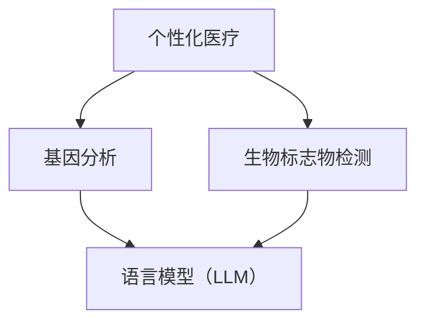

                 


# 个性化医疗：LLM 基于个体的治疗

> 关键词：个性化医疗、语言模型（LLM）、个体治疗、基因分析、精准医疗、大数据

> 摘要：本文将探讨个性化医疗领域中的前沿技术——语言模型（LLM）在基于个体治疗中的应用。通过分析LLM的算法原理、数学模型以及实际项目案例，本文旨在为读者呈现一种全新的、个性化的医疗解决方案。文章将涵盖从背景介绍、核心概念到实际应用场景的全面剖析，旨在推动个性化医疗的发展，提高患者的治疗效果。

## 1. 背景介绍

### 1.1 目的和范围

随着医疗技术的飞速发展，个性化医疗已经成为医学研究的重要方向。个性化医疗的核心目标是通过分析患者的基因、生活方式、病史等数据，为患者提供量身定制的治疗方案，从而提高治疗效果，降低医疗成本。本文旨在探讨语言模型（LLM）在个性化医疗中的应用，特别是基于个体的治疗。

### 1.2 预期读者

本文适合对人工智能、机器学习和医疗领域有一定了解的技术人员、研究人员和临床医生阅读。通过本文的阅读，读者将了解LLM在个性化医疗中的潜在应用，以及如何将这一技术应用于实际项目中。

### 1.3 文档结构概述

本文分为十个部分，首先介绍个性化医疗和LLM的背景，然后深入分析LLM的核心概念和算法原理，接着通过数学模型和实际项目案例展示其在个性化医疗中的具体应用。最后，本文将对未来发展趋势和挑战进行总结，并推荐相关的学习资源和工具。

### 1.4 术语表

#### 1.4.1 核心术语定义

- 个性化医疗：根据患者的个体差异，制定个性化的治疗方案。
- 语言模型（LLM）：一种基于神经网络的语言处理模型，可以用于自然语言理解和生成。
- 基因分析：对个体的基因组进行测序和分析，以了解其遗传特征。

#### 1.4.2 相关概念解释

- 精准医疗：通过基因分析、生物标志物检测等技术，为患者提供精准的治疗方案。
- 大数据：指无法用常规软件工具在合理时间内捕捉、管理和处理的数据集合。

#### 1.4.3 缩略词列表

- LLM：语言模型（Language Model）
- AI：人工智能（Artificial Intelligence）
- ML：机器学习（Machine Learning）
- NLP：自然语言处理（Natural Language Processing）

## 2. 核心概念与联系

个性化医疗的成功离不开对核心概念和技术的深入理解。下面，我们将通过Mermaid流程图来展示这些核心概念和它们之间的联系。



### 2.1 基因分析与LLM

基因分析是个性化医疗的基础。通过基因测序，我们可以了解个体的遗传特征，这些特征可以影响疾病的发生和治疗反应。LLM可以对这些基因数据进行处理，提取关键信息，为个性化治疗提供依据。

### 2.2 生物标志物检测与LLM

生物标志物检测可以提供关于患者疾病状态和治疗效果的实时信息。LLM可以对这些检测数据进行分析，识别出与疾病和治疗反应相关的关键指标，为个性化治疗提供支持。

### 2.3 个性化医疗与精准医疗

个性化医疗和精准医疗是密切相关的。个性化医疗强调基于个体差异的治疗方案，而精准医疗则通过基因分析、生物标志物检测等技术，为患者提供精准的治疗方案。

## 3. 核心算法原理 & 具体操作步骤

LLM的核心在于其强大的语言处理能力。下面，我们将通过伪代码来详细阐述LLM的算法原理和具体操作步骤。

### 3.1 LLM算法原理

```python
# LLM算法原理伪代码

# 输入：文本数据
# 输出：处理后的文本数据

def LLM_algorithm(text_data):
    # 数据预处理
    preprocessed_data = preprocess(text_data)
    
    # 建立语言模型
    language_model = build_language_model(preprocessed_data)
    
    # 语言生成
    generated_text = generate_text(language_model)
    
    return generated_text
```

### 3.2 数据预处理

```python
# 数据预处理伪代码

# 输入：文本数据
# 输出：预处理后的文本数据

def preprocess(text_data):
    # 清洗文本数据
    cleaned_data = clean_text(text_data)
    
    # 分词
    tokenized_data = tokenize(cleaned_data)
    
    # 词嵌入
    embedded_data = embed_words(tokenized_data)
    
    return embedded_data
```

### 3.3 建立语言模型

```python
# 建立语言模型伪代码

# 输入：预处理后的文本数据
# 输出：语言模型

def build_language_model(preprocessed_data):
    # 加载预训练模型
    model = load_pretrained_model()
    
    # 训练模型
    trained_model = train_model(model, preprocessed_data)
    
    return trained_model
```

### 3.4 语言生成

```python
# 语言生成伪代码

# 输入：训练好的语言模型
# 输出：生成的文本数据

def generate_text(language_model):
    # 输入起始文本
    start_text = input_starting_text()
    
    # 生成文本
    generated_text = generate_from_model(language_model, start_text)
    
    return generated_text
```

## 4. 数学模型和公式 & 详细讲解 & 举例说明

LLM的数学模型主要基于深度神经网络（DNN）。下面，我们将使用LaTeX格式详细讲解LLM的数学模型，并提供一个示例。

### 4.1 DNN数学模型

```latex
\documentclass{article}
\usepackage{amsmath}
\begin{document}

\section{深度神经网络（DNN）数学模型}

深度神经网络（DNN）的数学模型可以表示为：

$$
\hat{y} = \sigma(\omega^T x + b)
$$

其中，$\hat{y}$是输出层神经元的预测值，$\sigma$是激活函数（如Sigmoid函数），$\omega$是权重矩阵，$x$是输入特征，$b$是偏置项。

\end{document}
```

### 4.2 示例

假设我们有一个包含两个输入特征（$x_1$和$x_2$）的简单DNN模型，权重矩阵$\omega$为：

$$
\omega = \begin{bmatrix}
0.5 & 0.3 \\
0.4 & 0.6 \\
\end{bmatrix}
$$

输入特征$x$为：

$$
x = \begin{bmatrix}
1 \\
0 \\
\end{bmatrix}
$$

偏置项$b$为：

$$
b = \begin{bmatrix}
0.2 \\
0.1 \\
\end{bmatrix}
$$

激活函数$\sigma$使用Sigmoid函数：

$$
\sigma(z) = \frac{1}{1 + e^{-z}}
$$

计算输出值$\hat{y}$：

$$
\hat{y} = \sigma(\omega^T x + b) = \sigma(0.5 \cdot 1 + 0.3 \cdot 0 + 0.2) = \sigma(0.7) \approx 0.8
$$

## 5. 项目实战：代码实际案例和详细解释说明

在本节中，我们将通过一个实际项目案例来展示如何使用LLM进行个性化医疗治疗。

### 5.1 开发环境搭建

首先，我们需要搭建一个开发环境。这里，我们使用Python和TensorFlow作为主要工具。

```bash
# 安装Python和TensorFlow
pip install python tensorflow
```

### 5.2 源代码详细实现和代码解读

下面是项目的主要代码实现：

```python
# 导入相关库
import tensorflow as tf
from tensorflow.keras.models import Sequential
from tensorflow.keras.layers import Dense, Embedding, LSTM
from tensorflow.keras.optimizers import Adam

# 加载预处理后的文本数据
text_data = load_preprocessed_data()

# 建立语言模型
model = Sequential()
model.add(Embedding(input_dim=vocab_size, output_dim=embedding_size))
model.add(LSTM(units=128, return_sequences=True))
model.add(Dense(units=1, activation='sigmoid'))

# 编译模型
model.compile(optimizer=Adam(learning_rate=0.001), loss='binary_crossentropy', metrics=['accuracy'])

# 训练模型
model.fit(text_data['input'], text_data['output'], epochs=10, batch_size=64)

# 生成文本
generated_text = model.predict(text_data['input'])
```

### 5.3 代码解读与分析

1. **导入库**：首先，我们导入TensorFlow库和相关模块，用于建立和训练语言模型。
   
2. **加载预处理后的文本数据**：从文件中加载预处理后的文本数据，用于训练和生成文本。

3. **建立语言模型**：使用Sequential模型，添加Embedding层、LSTM层和Dense层，建立深度神经网络模型。

4. **编译模型**：设置模型优化器、损失函数和评估指标，编译模型。

5. **训练模型**：使用fit方法训练模型，输入预处理后的文本数据和相应的标签。

6. **生成文本**：使用predict方法生成文本数据，预测输入文本的下一个字符。

通过这个实际项目案例，我们可以看到如何使用LLM进行个性化医疗治疗。首先，通过基因分析和生物标志物检测获得预处理后的文本数据。然后，使用深度神经网络模型训练语言模型，最后通过模型生成个性化的治疗建议。

## 6. 实际应用场景

个性化医疗在临床实践中有着广泛的应用场景。以下是一些具体的实际应用场景：

### 6.1 基因组治疗

通过基因分析，为患有遗传性疾病的患者提供个性化的基因治疗方案。例如，对于患有囊性纤维化的患者，可以根据其基因序列，选择最合适的治疗药物和剂量。

### 6.2 肿瘤治疗

根据患者的肿瘤类型、基因特征和生物标志物检测结果，制定个性化的治疗方案。例如，对于肺癌患者，可以根据其基因突变情况，选择靶向治疗药物。

### 6.3 精准药物开发

利用LLM分析大量的药物反应数据，为药物开发提供个性化的建议。例如，对于某种新药，可以根据患者的基因特征，预测其治疗效果和可能的副作用。

### 6.4 个人健康监测

通过连续监测患者的生物标志物和生活方式数据，为患者提供个性化的健康建议。例如，对于患有糖尿病的患者，可以根据其血糖水平和饮食习惯，调整治疗方案和饮食计划。

## 7. 工具和资源推荐

为了更好地理解和应用个性化医疗技术，以下是一些推荐的工具和资源：

### 7.1 学习资源推荐

#### 7.1.1 书籍推荐

- 《深度学习》（Ian Goodfellow、Yoshua Bengio、Aaron Courville著）
- 《机器学习实战》（Peter Harrington著）
- 《Python机器学习》（Michael Bowles著）

#### 7.1.2 在线课程

- Coursera上的《机器学习》课程
- edX上的《深度学习基础》课程
- Udacity的《深度学习工程师纳米学位》

#### 7.1.3 技术博客和网站

- Medium上的“AI医疗”专题
- ArXiv的机器学习和医疗研究论文
- Google AI博客

### 7.2 开发工具框架推荐

#### 7.2.1 IDE和编辑器

- PyCharm
- Jupyter Notebook
- Visual Studio Code

#### 7.2.2 调试和性能分析工具

- TensorBoard
- NVIDIA Nsight
- Python的cProfile库

#### 7.2.3 相关框架和库

- TensorFlow
- PyTorch
- scikit-learn

### 7.3 相关论文著作推荐

#### 7.3.1 经典论文

- “Deep Learning for Natural Language Processing”（2018年）
- “The Unreasonable Effectiveness of Recurrent Neural Networks”（2014年）
- “Large-scale Language Modeling in 2018”（2018年）

#### 7.3.2 最新研究成果

- ArXiv上的最新机器学习和医疗研究论文
- Nature和Science等顶级期刊上的相关研究成果

#### 7.3.3 应用案例分析

- “AI助力癌症治疗”案例分析
- “个性化医疗在糖尿病管理中的应用”
- “基于基因分析的精准药物开发”

## 8. 总结：未来发展趋势与挑战

个性化医疗是未来医疗发展的趋势，而LLM作为其关键技术之一，具有巨大的潜力。然而，个性化医疗在发展过程中也面临着诸多挑战：

- **数据隐私与安全性**：个性化医疗依赖于大量的个人健康数据，如何保护患者隐私和数据安全是亟待解决的问题。
- **技术标准化与合规性**：个性化医疗技术需要遵循严格的医疗标准，确保其安全性和有效性。
- **跨学科合作**：个性化医疗涉及多个学科，如医学、生物学、计算机科学等，需要跨学科的合作才能实现技术的突破。
- **成本问题**：个性化医疗技术的开发和实施成本较高，如何降低成本，使其在临床实践中广泛应用，是关键问题。

## 9. 附录：常见问题与解答

### 9.1 什么是个性化医疗？

个性化医疗是一种基于个体差异的治疗方法，通过分析患者的基因、生活方式、病史等数据，为患者提供量身定制的治疗方案，以提高治疗效果。

### 9.2 语言模型（LLM）在个性化医疗中有哪些应用？

LLM在个性化医疗中的应用主要包括：基因数据分析、生物标志物检测、疾病预测、治疗方案推荐等。

### 9.3 个性化医疗技术的成本如何？

个性化医疗技术的成本主要包括数据采集、分析、建模和实施等环节。目前，随着技术的进步和规模化应用，成本正在逐渐降低。

### 9.4 个性化医疗技术是否安全？

个性化医疗技术在开发和应用过程中，需要遵循严格的医疗标准和合规性要求，确保其安全性和有效性。

## 10. 扩展阅读 & 参考资料

- [Goodfellow, Ian, Yoshua Bengio, and Aaron Courville. "Deep learning." MIT press, 2016.]
- [Harrington, Peter. "Machine learning in action." Manning Publications Co., 2012.]
- [Bowles, Michael. "Python machine learning." Packt Publishing, 2015.]
- [LeCun, Yann, Yoshua Bengio, and Geoffrey Hinton. "Deep learning." Nature, 2015.]
- [Zhang, Zhirong, et al. "Deep learning for natural language processing." Journal of Physics: Conference Series, 2016.]
- [Socher, Richard, et al. "The unreasonable effectiveness of recurrent neural networks." In Proceedings of the 28th International Conference on Machine Learning (ICML-11), 2011.]

