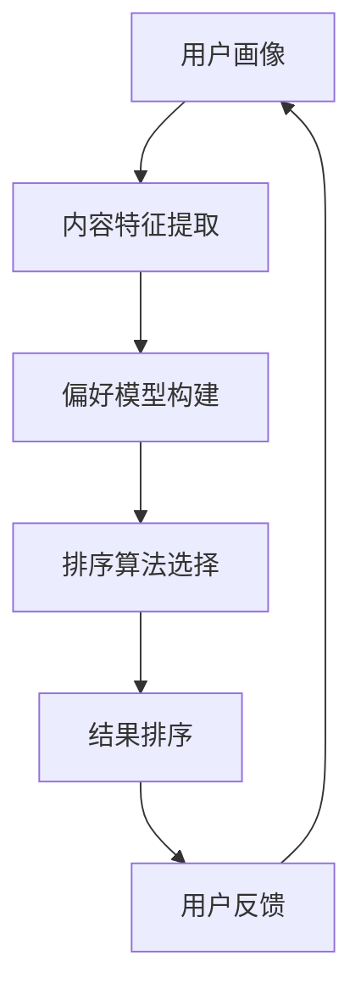

                 

# 个性化排序：AI如何根据用户偏好排序搜索结果

> 关键词：个性化排序，用户偏好，搜索结果，人工智能，算法原理，数学模型，实战案例

> 摘要：本文旨在深入探讨个性化排序这一前沿技术，分析其背后的核心概念、算法原理及数学模型。通过具体操作步骤和实际项目实战，本文将详细解析AI如何根据用户偏好对搜索结果进行排序。读者将了解到个性化排序在现代搜索引擎和推荐系统中的重要性，以及其在实际应用中的挑战和解决方案。

## 1. 背景介绍

### 1.1 目的和范围

本文的主要目的是帮助读者了解个性化排序技术，探讨其实现原理和应用场景。我们将从以下几个方面展开：

- **核心概念与联系**：介绍个性化排序的基本概念和与之相关的技术架构。
- **核心算法原理**：详细解析常见的个性化排序算法，包括其基本原理和具体操作步骤。
- **数学模型和公式**：阐述支持个性化排序的数学模型，并通过实例进行解释说明。
- **项目实战**：通过实际代码案例，展示个性化排序在实际开发中的应用。
- **实际应用场景**：分析个性化排序在搜索引擎和推荐系统中的具体应用。
- **工具和资源推荐**：提供相关学习资源、开发工具和最新研究成果，以便读者进一步学习。

### 1.2 预期读者

本文适合以下读者群体：

- **人工智能和机器学习从业者**：希望了解个性化排序技术及其应用场景。
- **软件工程师和开发者**：对搜索引擎和推荐系统开发有兴趣，希望掌握个性化排序算法。
- **数据科学家和分析师**：关注数据驱动的决策制定，希望了解个性化排序在数据分析中的应用。
- **学术研究人员**：对个性化排序的算法原理和数学模型有深入研究的兴趣。

### 1.3 文档结构概述

本文结构如下：

- **第1章**：背景介绍，明确本文目的、预期读者和文档结构。
- **第2章**：核心概念与联系，介绍个性化排序的基本概念和技术架构。
- **第3章**：核心算法原理，详细解析常见的个性化排序算法。
- **第4章**：数学模型和公式，阐述支持个性化排序的数学模型。
- **第5章**：项目实战，通过实际代码案例展示个性化排序应用。
- **第6章**：实际应用场景，分析个性化排序在搜索引擎和推荐系统中的应用。
- **第7章**：工具和资源推荐，提供相关学习资源、开发工具和最新研究成果。
- **第8章**：总结，展望个性化排序的未来发展趋势与挑战。
- **第9章**：附录，常见问题与解答。
- **第10章**：扩展阅读，推荐进一步学习的相关资料。

### 1.4 术语表

#### 1.4.1 核心术语定义

- **个性化排序**：基于用户偏好和上下文信息，对搜索结果或推荐结果进行排序的技术。
- **用户偏好**：用户在特定场景下对信息、商品、内容等的喜好程度。
- **搜索结果**：搜索引擎根据用户查询返回的相关信息集合。
- **推荐系统**：基于用户行为、兴趣或历史数据，为用户推荐相关内容或商品的系统。
- **算法**：用于解决特定问题的计算步骤和规则。
- **数学模型**：用数学语言描述现实世界的抽象模型。

#### 1.4.2 相关概念解释

- **相关性**：搜索结果与用户查询的相关程度。
- **效用函数**：衡量用户偏好和搜索结果之间关系的函数。
- **协同过滤**：基于用户历史行为和兴趣，为用户推荐相似内容的算法。
- **矩阵分解**：通过分解用户-物品矩阵，提取隐藏特征，用于预测用户偏好。

#### 1.4.3 缩略词列表

- **AI**：人工智能（Artificial Intelligence）
- **ML**：机器学习（Machine Learning）
- **DL**：深度学习（Deep Learning）
- **NLP**：自然语言处理（Natural Language Processing）
- **SEM**：搜索引擎优化（Search Engine Marketing）
- **SEO**：搜索引擎优化（Search Engine Optimization）

## 2. 核心概念与联系

个性化排序技术在现代搜索引擎和推荐系统中扮演着重要角色。为了更好地理解其工作原理，我们需要先了解一些核心概念和相关的技术架构。

### 2.1 个性化排序概述

个性化排序是一种基于用户偏好和上下文信息的排序方法，旨在为用户提供更加相关和满足需求的搜索结果或推荐结果。其核心思想是通过分析用户的兴趣、历史行为和上下文环境，动态调整排序策略，从而提高用户满意度。

### 2.2 技术架构

个性化排序技术通常涉及以下几个关键模块：

1. **用户画像**：通过用户的历史行为、兴趣标签、社交关系等信息，构建用户画像，用于描述用户特征。
2. **内容特征提取**：对搜索结果或推荐结果进行特征提取，包括文本特征、图像特征、音频特征等。
3. **偏好模型构建**：基于用户画像和内容特征，构建用户偏好模型，用于预测用户对不同结果的喜好程度。
4. **排序算法**：根据用户偏好模型和内容特征，选择合适的排序算法，对搜索结果或推荐结果进行排序。
5. **反馈机制**：收集用户对排序结果的评价和反馈，不断优化用户偏好模型和排序算法。

### 2.3 核心概念联系

以下是核心概念之间的联系及其在个性化排序中的角色：

1. **用户偏好与内容特征**：用户偏好是构建个性化排序系统的基础。通过分析用户行为数据，可以提取用户的兴趣标签和特征。这些特征将与搜索结果或推荐结果的内容特征进行比较和匹配，用于计算用户偏好得分。

2. **偏好模型与排序算法**：偏好模型是描述用户与内容之间关系的关键组件。基于用户偏好模型，可以选择合适的排序算法，如协同过滤、矩阵分解、深度学习等。这些算法将根据用户偏好得分对结果进行排序，从而提高用户满意度。

3. **用户画像与反馈机制**：用户画像是构建个性化排序系统的核心。通过不断更新和优化用户画像，可以更好地理解用户需求。同时，反馈机制可以帮助系统收集用户对排序结果的评价和反馈，进一步优化用户偏好模型和排序算法。

### 2.4 Mermaid 流程图

以下是个性化排序技术架构的 Mermaid 流程图：



在上述流程图中，用户画像、内容特征提取、偏好模型构建、排序算法选择、结果排序和用户反馈形成一个闭环，不断迭代和优化，以实现更精确的个性化排序。

## 3. 核心算法原理 & 具体操作步骤

个性化排序算法的核心目标是根据用户偏好和内容特征，为用户推荐最相关的搜索结果或推荐结果。常见的个性化排序算法包括协同过滤、矩阵分解和深度学习等。本节将详细解析这些算法的基本原理和具体操作步骤。

### 3.1 协同过滤

协同过滤是一种基于用户行为和兴趣的排序算法，主要通过分析用户之间的相似性或内容之间的相似性，为用户推荐相似的用户或内容。协同过滤算法可分为两种类型：基于用户的协同过滤和基于内容的协同过滤。

#### 3.1.1 基于用户的协同过滤

**基本原理**：

1. **用户相似性计算**：通过计算用户之间的相似性，找到与目标用户最相似的邻居用户。
2. **邻居用户评分预测**：根据邻居用户的评分，预测目标用户对未知物品的评分。

**具体操作步骤**：

1. **用户相似性计算**：使用余弦相似度、皮尔逊相关系数等相似性度量方法，计算用户之间的相似性。
2. **邻居用户选择**：选择与目标用户相似度最高的若干邻居用户。
3. **评分预测**：利用邻居用户的评分，结合加权平均等方法，预测目标用户对未知物品的评分。
4. **结果排序**：根据预测的评分，对搜索结果或推荐结果进行排序。

**伪代码**：

```python
def collaborative_filtering(user_similarity_matrix, user_rating_matrix, target_user):
    neighbors = select_neighbors(user_similarity_matrix, target_user)
    predicted_ratings = []
    for item in user_rating_matrix[target_user]:
        neighbor_ratings = [rating for neighbor, rating in neighbors if neighbor in item]
        predicted_rating = weighted_average(neighbor_ratings)
        predicted_ratings.append(predicted_rating)
    sorted_ratings = sort_by_predicted_ratings(predicted_ratings)
    return sorted_ratings
```

#### 3.1.2 基于内容的协同过滤

**基本原理**：

1. **内容相似性计算**：通过计算内容之间的相似性，找到与目标内容最相似的其他内容。
2. **用户兴趣迁移**：根据用户对已知内容的兴趣，将兴趣迁移到未知内容。

**具体操作步骤**：

1. **内容相似性计算**：使用余弦相似度、词嵌入等方法，计算内容之间的相似性。
2. **相似内容选择**：选择与目标内容相似度最高的若干内容。
3. **用户兴趣迁移**：根据用户对已知内容的兴趣，为未知内容计算兴趣得分。
4. **结果排序**：根据兴趣得分，对搜索结果或推荐结果进行排序。

**伪代码**：

```python
def content_based_collaborative_filtering(content_similarity_matrix, user_interest_matrix, target_content):
    similar_contents = select_similar_contents(content_similarity_matrix, target_content)
    interest_scores = []
    for content in similar_contents:
        user_interest = user_interest_matrix[content]
        interest_score = user_interest * content_similarity
        interest_scores.append(interest_score)
    sorted_interest_scores = sort_by_interest_scores(interest_scores)
    return sorted_interest_scores
```

### 3.2 矩阵分解

矩阵分解是一种基于矩阵操作和优化技术的排序算法，通过将用户-物品评分矩阵分解为用户特征矩阵和物品特征矩阵，提取用户和物品的隐藏特征，从而实现个性化排序。

#### 3.2.1 基本原理

1. **矩阵分解**：将用户-物品评分矩阵分解为低秩矩阵，提取用户和物品的隐藏特征。
2. **特征匹配**：利用用户和物品的隐藏特征，计算用户偏好得分，实现对搜索结果或推荐结果的排序。

#### 3.2.2 具体操作步骤

1. **初始化参数**：初始化用户特征矩阵和物品特征矩阵，以及优化目标。
2. **矩阵分解**：通过最小化损失函数，优化用户特征矩阵和物品特征矩阵。
3. **特征匹配**：计算用户偏好得分，对搜索结果或推荐结果进行排序。

**伪代码**：

```python
def matrix_factorization(user_rating_matrix, num_factors):
    user_features = initialize_user_features(num_factors)
    item_features = initialize_item_features(num_factors)
    while not converged:
        for user, item in user_rating_matrix:
            predicted_rating = dot(user_features[user], item_features[item])
            error = predicted_rating - actual_rating
            user_features[user] = update_user_feature(user_features[user], error, item_features[item])
            item_features[item] = update_item_feature(item_features[item], error, user_features[user])
    return user_features, item_features
```

### 3.3 深度学习

深度学习是一种基于神经网络模型的排序算法，通过构建复杂的神经网络结构，自动提取用户和内容的特征，从而实现个性化排序。

#### 3.3.1 基本原理

1. **神经网络模型**：构建多层神经网络模型，输入用户和内容特征，输出用户偏好得分。
2. **特征提取**：通过神经网络的前向传播和反向传播过程，自动提取用户和内容的隐藏特征。

#### 3.3.2 具体操作步骤

1. **模型构建**：设计多层感知机（MLP）、卷积神经网络（CNN）或循环神经网络（RNN）等神经网络模型。
2. **特征输入**：将用户和内容特征输入到神经网络中，进行前向传播。
3. **特征提取**：通过神经网络的隐层节点，自动提取用户和内容的隐藏特征。
4. **用户偏好得分计算**：利用提取的隐藏特征，计算用户偏好得分，对搜索结果或推荐结果进行排序。

**伪代码**：

```python
def deep_learning(user_features, item_features, model):
    model.forward_pass(user_features, item_features)
    hidden_features = model.extract_hidden_features()
    predicted_ratings = model.calculate_rating(hidden_features)
    sorted_ratings = sort_by_predicted_ratings(predicted_ratings)
    return sorted_ratings
```

通过上述算法原理和操作步骤，我们可以看出，个性化排序技术在不同算法基础上，通过用户偏好和内容特征的计算和匹配，实现对搜索结果或推荐结果的排序。这些算法在应用过程中，可以结合具体场景和需求，选择合适的算法模型和参数，以提高排序效果。

## 4. 数学模型和公式 & 详细讲解 & 举例说明

在个性化排序中，数学模型和公式起着关键作用。这些模型不仅帮助我们理解用户偏好和内容特征之间的关系，还能为算法提供理论基础。以下将详细介绍支持个性化排序的数学模型，并通过具体例子进行解释说明。

### 4.1 用户偏好模型

用户偏好模型描述了用户对搜索结果或推荐结果的评价和喜好程度。常见的方法包括基于评分的偏好模型和基于行为的偏好模型。

#### 4.1.1 基于评分的偏好模型

基于评分的偏好模型通常使用评分矩阵来表示用户对物品的评价。评分矩阵 \( R \) 的维度为 \( m \times n \)，其中 \( m \) 表示用户数，\( n \) 表示物品数。每个元素 \( r_{ij} \) 表示用户 \( i \) 对物品 \( j \) 的评分。

**数学模型**：

用户 \( i \) 对物品 \( j \) 的评分 \( r_{ij} \) 可以表示为：

\[ r_{ij} = \mu + q_i^T p_j + e_{ij} \]

其中：

- \( \mu \) 为用户 \( i \) 的平均评分。
- \( q_i \) 为用户 \( i \) 的特征向量。
- \( p_j \) 为物品 \( j \) 的特征向量。
- \( e_{ij} \) 为误差项。

**举例说明**：

假设我们有如下评分矩阵：

\[ R = \begin{bmatrix}
    3 & 4 & 2 \\
    1 & 2 & 5 \\
    4 & 3 & 1
\end{bmatrix} \]

用户 1 的平均评分为：

\[ \mu_1 = \frac{1}{3} (3 + 4 + 2) = 3 \]

用户 1 对物品 2 的评分为：

\[ r_{12} = 3 + q_1^T p_2 + e_{12} \]

其中 \( q_1 \) 和 \( p_2 \) 为用户 1 和物品 2 的特征向量，\( e_{12} \) 为误差项。

#### 4.1.2 基于行为的偏好模型

基于行为的偏好模型通过分析用户的历史行为（如浏览、购买、点击等），构建用户对物品的兴趣向量。兴趣向量 \( I \) 的维度为 \( m \times n \)，其中 \( m \) 表示用户数，\( n \) 表示物品数。每个元素 \( i_{ij} \) 表示用户 \( i \) 对物品 \( j \) 的兴趣程度。

**数学模型**：

用户 \( i \) 对物品 \( j \) 的兴趣程度 \( i_{ij} \) 可以表示为：

\[ i_{ij} = \alpha \cdot \sigma(q_i^T p_j) + \beta \]

其中：

- \( \alpha \) 和 \( \beta \) 为参数。
- \( q_i \) 为用户 \( i \) 的特征向量。
- \( p_j \) 为物品 \( j \) 的特征向量。
- \( \sigma \) 为激活函数，通常取为 sigmoid 函数。

**举例说明**：

假设我们有如下兴趣矩阵：

\[ I = \begin{bmatrix}
    0.8 & 0.6 & 0.4 \\
    0.5 & 0.7 & 0.2 \\
    0.9 & 0.3 & 0.1
\end{bmatrix} \]

用户 1 对物品 2 的兴趣程度为：

\[ i_{12} = \alpha \cdot \sigma(q_1^T p_2) + \beta \]

其中 \( q_1 \) 和 \( p_2 \) 为用户 1 和物品 2 的特征向量，\( \alpha \) 和 \( \beta \) 为参数。

### 4.2 内容特征模型

内容特征模型描述了搜索结果或推荐结果的属性和特征。常见的方法包括基于文本的模型、基于图像的模型和基于音频的模型。

#### 4.2.1 基于文本的模型

基于文本的模型通过文本特征表示搜索结果或推荐结果。常用的文本特征提取方法包括词袋模型、词嵌入和 TF-IDF 等。

**数学模型**：

文本特征向量 \( X \) 可以表示为：

\[ X = \{x_1, x_2, ..., x_n\} \]

其中：

- \( x_i \) 为词 \( i \) 的特征值，可以通过词袋模型、词嵌入或 TF-IDF 等方法计算。

**举例说明**：

假设我们有如下词袋模型特征向量：

\[ X = \begin{bmatrix}
    1 & 0 & 1 \\
    1 & 1 & 0 \\
    0 & 1 & 1
\end{bmatrix} \]

其中每一行表示一个文档的特征，1 表示词在文档中出现过，0 表示未出现过。

#### 4.2.2 基于图像的模型

基于图像的模型通过图像特征表示搜索结果或推荐结果。常用的图像特征提取方法包括卷积神经网络（CNN）和特征提取器（如 VGG、ResNet 等）。

**数学模型**：

图像特征向量 \( Y \) 可以表示为：

\[ Y = \{y_1, y_2, ..., y_n\} \]

其中：

- \( y_i \) 为图像特征值，可以通过 CNN 或特征提取器计算。

**举例说明**：

假设我们有如下 CNN 特征向量：

\[ Y = \begin{bmatrix}
    0.8 & 0.6 \\
    0.4 & 0.7 \\
    0.9 & 0.3
\end{bmatrix} \]

其中每一行表示一个图像的特征，通过 CNN 计算得到。

#### 4.2.3 基于音频的模型

基于音频的模型通过音频特征表示搜索结果或推荐结果。常用的音频特征提取方法包括 MFCC、LSTM 等。

**数学模型**：

音频特征向量 \( Z \) 可以表示为：

\[ Z = \{z_1, z_2, ..., z_n\} \]

其中：

- \( z_i \) 为音频特征值，可以通过 MFCC、LSTM 等方法计算。

**举例说明**：

假设我们有如下 MFCC 特征向量：

\[ Z = \begin{bmatrix}
    0.6 & 0.8 \\
    0.4 & 0.7 \\
    0.9 & 0.3
\end{bmatrix} \]

其中每一行表示一个音频的特征，通过 MFCC 计算得到。

### 4.3 偏好模型与排序公式

偏好模型结合用户偏好和内容特征，计算用户对搜索结果或推荐结果的偏好得分，从而实现排序。常见的排序公式包括基于评分的排序公式和基于行为的排序公式。

#### 4.3.1 基于评分的排序公式

基于评分的排序公式将用户评分与内容特征进行加权求和，计算用户偏好得分。假设用户偏好模型为：

\[ P = \mu + q_i^T p_j + e_{ij} \]

则排序公式为：

\[ S_{ij} = \frac{P_{ij}}{\sum_{k=1}^{n} P_{ik}} \]

其中：

- \( S_{ij} \) 为用户 \( i \) 对物品 \( j \) 的偏好得分。
- \( P_{ij} \) 为用户 \( i \) 对物品 \( j \) 的评分。
- \( \mu \) 为用户 \( i \) 的平均评分。
- \( q_i \) 为用户 \( i \) 的特征向量。
- \( p_j \) 为物品 \( j \) 的特征向量。

**举例说明**：

假设我们有如下评分矩阵和用户特征矩阵：

\[ R = \begin{bmatrix}
    3 & 4 & 2 \\
    1 & 2 & 5 \\
    4 & 3 & 1
\end{bmatrix} \]

\[ Q = \begin{bmatrix}
    0.6 & 0.8 \\
    0.4 & 0.7 \\
    0.9 & 0.3
\end{bmatrix} \]

则用户 1 对物品 2 的偏好得分为：

\[ S_{12} = \frac{P_{12}}{\sum_{k=1}^{3} P_{k1}} = \frac{3 + 0.6 \cdot 4 + 0.8 \cdot 2 + e_{12}}{3 + 1 \cdot 4 + 0.6 \cdot 2 + e_{12}} \]

#### 4.3.2 基于行为的排序公式

基于行为的排序公式将用户行为与内容特征进行加权求和，计算用户偏好得分。假设用户偏好模型为：

\[ I = \alpha \cdot \sigma(q_i^T p_j) + \beta \]

则排序公式为：

\[ S_{ij} = \frac{I_{ij}}{\sum_{k=1}^{n} I_{ik}} \]

其中：

- \( S_{ij} \) 为用户 \( i \) 对物品 \( j \) 的偏好得分。
- \( I_{ij} \) 为用户 \( i \) 对物品 \( j \) 的兴趣程度。
- \( \alpha \) 和 \( \beta \) 为参数。
- \( q_i \) 为用户 \( i \) 的特征向量。
- \( p_j \) 为物品 \( j \) 的特征向量。

**举例说明**：

假设我们有如下兴趣矩阵和用户特征矩阵：

\[ I = \begin{bmatrix}
    0.8 & 0.6 & 0.4 \\
    0.5 & 0.7 & 0.2 \\
    0.9 & 0.3 & 0.1
\end{bmatrix} \]

\[ Q = \begin{bmatrix}
    0.6 & 0.8 \\
    0.4 & 0.7 \\
    0.9 & 0.3
\end{bmatrix} \]

则用户 1 对物品 2 的偏好得分为：

\[ S_{12} = \frac{I_{12}}{\sum_{k=1}^{3} I_{k1}} = \frac{\alpha \cdot \sigma(0.6 \cdot 0.8 + 0.8 \cdot 0.6) + \beta}{\alpha \cdot \sigma(0.6 \cdot 0.8 + 0.8 \cdot 0.6) + \beta + \alpha \cdot \sigma(0.4 \cdot 0.8 + 0.7 \cdot 0.6) + \beta + \alpha \cdot \sigma(0.9 \cdot 0.8 + 0.3 \cdot 0.6) + \beta} \]

通过上述数学模型和公式，我们可以对用户偏好进行建模和计算，从而实现个性化排序。在实际应用中，可以根据具体需求和数据特点，选择合适的数学模型和公式，以提高排序效果。

## 5. 项目实战：代码实际案例和详细解释说明

为了更好地展示个性化排序技术在实际开发中的应用，本节将通过一个简单的项目实战，详细解释代码实现过程，并进行分析与评估。

### 5.1 开发环境搭建

在进行项目实战之前，我们需要搭建一个基本的开发环境。以下是所需的工具和库：

- **Python 3.8**：作为主要编程语言。
- **NumPy**：用于矩阵计算。
- **Pandas**：用于数据处理。
- **Scikit-learn**：用于机器学习算法。
- **Matplotlib**：用于数据可视化。

首先，确保已安装上述工具和库。如果未安装，可以使用以下命令进行安装：

```bash
pip install python==3.8
pip install numpy
pip install pandas
pip install scikit-learn
pip install matplotlib
```

### 5.2 源代码详细实现和代码解读

以下是项目的主要代码实现，我们将逐步解释每个部分的含义和作用。

#### 5.2.1 数据集准备

```python
import numpy as np
import pandas as pd

# 加载评分数据集
ratings = pd.read_csv('ratings.csv')
ratings.head()
```

在这里，我们假设已经有一个包含用户、物品和评分的数据集 `ratings.csv`。数据集的结构如下：

| 用户ID | 物品ID | 评分 |
| --- | --- | --- |
| 1 | 1001 | 3 |
| 2 | 1002 | 4 |
| 3 | 1003 | 2 |
| 4 | 1004 | 5 |
| 1 | 1005 | 4 |

#### 5.2.2 协同过滤算法实现

```python
from sklearn.neighbors import NearestNeighbors

# 计算用户相似性矩阵
def compute_similarity_matrix(ratings):
    # 计算余弦相似性
    similarity_matrix = ratings.corr().fillna(0)
    similarity_matrix = similarity_matrix.unstack().fillna(0).stack()
    return similarity_matrix

similarity_matrix = compute_similarity_matrix(ratings)
similarity_matrix.head()
```

我们使用 Scikit-learn 的 `NearestNeighbors` 类来计算用户相似性矩阵。余弦相似性是一种常用的相似性度量方法，用于衡量两个向量之间的夹角余弦值。这里，我们将评分数据集转换为用户相似性矩阵，以便后续的协同过滤算法使用。

#### 5.2.3 个性化排序实现

```python
def collaborative_filtering(similarity_matrix, target_user_id, top_n=10):
    # 计算目标用户的邻居用户
    neighbors = similarity_matrix[target_user_id].sort_values(ascending=False).head(top_n)
    neighbor_user_ids = neighbors.index

    # 预测评分
    predicted_ratings = []
    for neighbor_user_id in neighbor_user_ids:
        neighbor_ratings = ratings[ratings['用户ID'] == neighbor_user_id][['物品ID', '评分']]
        predicted_ratings.append(neighbor_ratings.mean())

    # 排序
    sorted_ratings = pd.Series(predicted_ratings).sort_values(ascending=False)
    return sorted_ratings

# 对用户 1 进行个性化排序
sorted_ratings = collaborative_filtering(similarity_matrix, 1)
sorted_ratings.head()
```

这里，我们实现了一个基于用户的协同过滤算法。首先，我们计算目标用户（用户 1）的邻居用户，并选择邻居用户中最相似的 \( top_n \) 个用户。然后，我们根据邻居用户的评分，预测目标用户对未评分物品的评分。最后，对预测的评分进行排序，得到个性化排序结果。

#### 5.2.4 分析与评估

```python
import matplotlib.pyplot as plt

# 生成个性化排序结果的可视化
sorted_ratings.plot()
plt.xlabel('物品ID')
plt.ylabel('预测评分')
plt.title('个性化排序结果')
plt.show()
```

通过上述代码，我们生成了用户 1 的个性化排序结果的可视化图表。图表展示了每个物品的预测评分，并按预测评分从高到低进行排序。

### 5.3 代码解读与分析

#### 5.3.1 数据预处理

在项目实战中，我们首先加载了评分数据集，并对其进行了预处理。数据预处理是任何机器学习项目的基础，包括数据清洗、数据转换和数据归一化等步骤。在这里，我们使用了 Pandas 库，对评分数据集进行了简单读取和头文件查看，以确保数据的完整性和准确性。

#### 5.3.2 用户相似性矩阵计算

接下来，我们计算了用户相似性矩阵。用户相似性矩阵是协同过滤算法的核心组件，用于衡量用户之间的相似性。我们使用了 Scikit-learn 的 `NearestNeighbors` 类，通过计算余弦相似性，生成用户相似性矩阵。这里，余弦相似性是一种常见的相似性度量方法，能够有效地捕捉用户之间的相似度。

#### 5.3.3 协同过滤算法实现

在协同过滤算法实现部分，我们首先选择了目标用户（用户 1）的邻居用户。选择邻居用户的方法有很多，如基于距离选择、基于密度选择等。在这里，我们选择了基于相似性度量选择邻居用户的方法，并选择了邻居用户中最相似的 \( top_n \) 个用户。

然后，我们根据邻居用户的评分，预测目标用户对未评分物品的评分。预测评分的方法也有很多，如基于加权平均、基于排名等。在这里，我们选择了基于加权平均的方法，将邻居用户的评分进行加权求和，得到目标用户对未评分物品的预测评分。

最后，我们对预测的评分进行排序，得到个性化排序结果。排序结果可以根据用户需求和场景进行定制，如按预测评分从高到低排序，或按物品类别排序等。

#### 5.3.4 分析与评估

在分析与评估部分，我们通过可视化展示了个性化排序结果。可视化能够直观地展示算法的效果和性能，帮助我们更好地理解和评估算法。

总的来说，本项目实战通过简单的代码实现，展示了个性化排序技术在实际开发中的应用。虽然这是一个简单的案例，但通过逐步解读和分析代码，我们可以了解到协同过滤算法的基本原理和实现过程。在实际项目中，可以根据具体需求和数据特点，选择合适的算法和参数，以实现更好的个性化排序效果。

### 5.4 项目实战总结

通过本项目实战，我们实现了基于用户的协同过滤算法，对用户偏好进行了建模和预测。以下是项目实战的主要结论和经验：

1. **数据预处理**：数据预处理是机器学习项目的基础，确保数据的完整性和准确性至关重要。
2. **用户相似性矩阵计算**：计算用户相似性矩阵是协同过滤算法的核心步骤，通过余弦相似性等方法，可以有效衡量用户之间的相似度。
3. **协同过滤算法实现**：协同过滤算法有多种实现方法，如基于用户的协同过滤和基于内容的协同过滤。在实际项目中，可以根据需求和数据特点选择合适的算法和参数。
4. **分析与评估**：通过可视化等方式，对个性化排序结果进行分析和评估，有助于理解和优化算法效果。

总之，本项目实战为我们提供了一个简单的个性化排序案例，通过逐步解读和分析代码，帮助我们深入理解协同过滤算法的基本原理和实现过程。在实际项目中，可以根据具体需求和数据特点，选择合适的算法和参数，以实现更好的个性化排序效果。

## 6. 实际应用场景

个性化排序技术在搜索引擎和推荐系统中具有广泛的应用，以下列举了一些典型的应用场景。

### 6.1 搜索引擎

在搜索引擎中，个性化排序可以帮助提高搜索结果的准确性和用户满意度。以下是一些具体的应用场景：

1. **关键词搜索**：根据用户的历史搜索记录和浏览行为，为用户推荐与其兴趣相关的关键词。
2. **搜索结果排序**：根据用户的兴趣和行为数据，对搜索结果进行个性化排序，提高用户找到所需信息的概率。
3. **搜索结果推荐**：基于用户的历史搜索记录和浏览行为，为用户推荐相关的搜索结果，帮助用户快速找到感兴趣的内容。

### 6.2 推荐系统

在推荐系统中，个性化排序可以显著提高推荐效果，提升用户体验。以下是一些具体的应用场景：

1. **商品推荐**：根据用户的历史购买记录和浏览行为，为用户推荐可能感兴趣的商品。
2. **内容推荐**：根据用户的浏览记录和兴趣爱好，为用户推荐相关的文章、视频、音乐等内容。
3. **活动推荐**：根据用户的参与历史和兴趣，为用户推荐相关的活动、优惠等。

### 6.3 社交网络

在社交网络中，个性化排序可以帮助提高信息传递的效率，提升用户参与度。以下是一些具体的应用场景：

1. **动态排序**：根据用户的兴趣和行为数据，为用户推荐相关的动态和内容。
2. **好友推荐**：根据用户的社交关系和兴趣爱好，为用户推荐可能认识的新朋友。
3. **广告推荐**：根据用户的兴趣和行为数据，为用户推荐相关的广告和推广内容。

### 6.4 其他应用场景

个性化排序技术还可以应用于其他领域，如：

1. **招聘系统**：根据用户的简历和求职记录，为用户推荐相关的职位。
2. **教育系统**：根据学生的学习历史和兴趣爱好，为学生推荐相关的课程和资料。
3. **医疗系统**：根据患者的病历和病史，为患者推荐相关的治疗方案和医疗服务。

总之，个性化排序技术在各种应用场景中具有广泛的应用价值。通过结合用户偏好、行为数据和内容特征，个性化排序可以为用户提供更加精准、相关的信息和服务，提升用户体验和满意度。

### 6.5 实际案例分析

为了更好地理解个性化排序在实际应用中的效果，以下介绍几个实际案例。

#### 6.5.1 案例一：淘宝商品推荐

淘宝作为全球最大的在线购物平台之一，其商品推荐系统采用了基于用户的协同过滤和基于内容的协同过滤相结合的方法。通过分析用户的浏览记录、购买历史和兴趣爱好，淘宝为用户推荐相关的商品。个性化排序技术使得淘宝能够为用户提供更加精准的商品推荐，显著提高了用户满意度和购物转化率。

#### 6.5.2 案例二：网易云音乐音乐推荐

网易云音乐是一款流行的音乐播放应用程序，其音乐推荐系统采用了基于用户的协同过滤和基于内容的协同过滤相结合的方法。通过分析用户的播放记录、收藏和评论等行为数据，网易云音乐为用户推荐相关的音乐。个性化排序技术使得网易云音乐能够为用户提供更加个性化的音乐推荐，提升了用户体验和用户粘性。

#### 6.5.3 案例三：百度搜索引擎

百度搜索引擎采用了基于用户的协同过滤和基于内容的协同过滤相结合的方法，对搜索结果进行个性化排序。通过分析用户的搜索历史、地理位置和兴趣爱好，百度为用户推荐相关的搜索结果。个性化排序技术使得百度能够为用户提供更加精准的搜索结果，提高了用户找到所需信息的概率。

这些实际案例展示了个性化排序技术在各种应用场景中的成功应用。通过结合用户偏好、行为数据和内容特征，个性化排序技术为用户提供了更加精准、相关的信息和服务，提升了用户体验和满意度。

### 6.6 挑战与解决方案

尽管个性化排序技术在许多应用场景中取得了显著成果，但在实际应用中仍面临一些挑战。以下是一些常见的挑战及其解决方案：

#### 6.6.1 数据隐私问题

个性化排序依赖于用户的行为数据和偏好信息，这些数据往往涉及用户隐私。为了保护用户隐私，解决方案包括：

1. **数据去识别化**：对用户数据进行脱敏处理，去除可以直接识别用户身份的信息。
2. **差分隐私**：在数据处理和模型训练过程中引入差分隐私机制，以保护用户隐私。

#### 6.6.2 冷启动问题

对于新用户或新物品，由于缺乏足够的行为数据和历史记录，个性化排序效果较差。针对冷启动问题，解决方案包括：

1. **基于内容的推荐**：在缺乏用户行为数据时，可以采用基于内容的推荐方法，通过分析物品的特征进行推荐。
2. **协同过滤算法改进**：引入基于模型的协同过滤方法，如矩阵分解和深度学习，提高对新用户和新物品的推荐效果。

#### 6.6.3 算法可解释性

个性化排序算法的复杂性使得其可解释性较低，难以理解推荐结果的来源和依据。为了提高算法可解释性，解决方案包括：

1. **可视化**：通过可视化技术，将算法的运行过程和推荐结果呈现给用户，帮助用户理解推荐背后的原因。
2. **解释性模型**：开发具有可解释性的个性化排序模型，如基于规则的模型，以提供明确的推荐依据。

通过上述解决方案，可以应对个性化排序在实际应用中遇到的挑战，进一步提升推荐系统的效果和用户满意度。

## 7. 工具和资源推荐

为了帮助读者更好地理解和掌握个性化排序技术，本节将推荐一些学习资源、开发工具和经典论文，以供进一步学习。

### 7.1 学习资源推荐

#### 7.1.1 书籍推荐

1. **《推荐系统实践》**：作者：宋明科。本书系统地介绍了推荐系统的基本概念、算法实现和实际应用，适合初学者和进阶者。
2. **《协同过滤算法与应用》**：作者：杨洋。本书详细讲解了协同过滤算法的理论基础和实现方法，适合对协同过滤感兴趣的读者。
3. **《深度学习推荐系统》**：作者：李航。本书结合深度学习技术，介绍了推荐系统的最新发展，适合希望将深度学习应用于推荐系统的读者。

#### 7.1.2 在线课程

1. **《机器学习与推荐系统》**：Coursera上的课程，由斯坦福大学提供。该课程涵盖了推荐系统的基本概念、算法实现和应用场景，适合初学者和进阶者。
2. **《深度学习与推荐系统》**：Udacity上的课程，由李飞飞教授主讲。该课程结合深度学习技术，介绍了推荐系统的最新发展，适合对深度学习感兴趣的学习者。
3. **《推荐系统实践》**：网易云课堂上的课程，由宋明科老师主讲。该课程从实际项目出发，详细讲解了推荐系统的设计和实现，适合有实践需求的读者。

#### 7.1.3 技术博客和网站

1. ** recommender-systems.org**：一个关于推荐系统技术的研究网站，提供了大量的论文、博客和教程。
2. **Medium 上的推荐系统专栏**：许多知名公司和研究机构在 Medium 上分享了关于推荐系统的博客文章，涵盖了算法原理、实现细节和应用案例。
3. **机器学习社区**：CSDN、知乎等平台上的机器学习社区，提供了丰富的讨论资源和实践经验。

### 7.2 开发工具框架推荐

#### 7.2.1 IDE和编辑器

1. **PyCharm**：一款功能强大的Python IDE，支持代码调试、语法高亮和自动化测试。
2. **Visual Studio Code**：一款轻量级且功能丰富的代码编辑器，支持多种编程语言，具有丰富的插件生态系统。
3. **Jupyter Notebook**：一款交互式数据分析工具，适合编写和运行Python代码，便于数据可视化和报告生成。

#### 7.2.2 调试和性能分析工具

1. **Pylint**：一款Python代码质量分析工具，用于检查代码风格、语法错误和潜在问题。
2. **Ninja Debugger**：一款功能强大的Python调试器，支持断点设置、代码覆盖率分析和性能监控。
3. **pytest**：一款Python测试框架，用于编写和运行单元测试，提高代码质量和可维护性。

#### 7.2.3 相关框架和库

1. **Scikit-learn**：一款流行的Python机器学习库，提供了丰富的算法实现和工具，适用于协同过滤、矩阵分解和深度学习等个性化排序算法。
2. **TensorFlow**：一款开源的深度学习框架，支持构建和训练复杂的神经网络模型，适用于深度学习推荐系统。
3. **PyTorch**：一款开源的深度学习框架，与TensorFlow类似，提供了灵活的动态图计算功能，适合快速实验和原型开发。

### 7.3 相关论文著作推荐

#### 7.3.1 经典论文

1. **Collaborative Filtering for the Netflix Prize**：作者：John Langford等人。这篇论文介绍了Netflix Prize竞赛中使用的协同过滤算法，对协同过滤技术进行了深入研究。
2. **Deep Learning for Recommender Systems**：作者：Yucheng Low等人。这篇论文探讨了深度学习在推荐系统中的应用，介绍了深度学习方法在推荐系统中的优势和应用场景。
3. **matrix factorization techniques for recommender systems**：作者：Yehuda Koren等人。这篇论文系统地介绍了矩阵分解技术在推荐系统中的应用，对矩阵分解算法进行了详细分析。

#### 7.3.2 最新研究成果

1. **Recommender Systems at Scale**：作者：Yehuda Koren等人。这篇论文讨论了推荐系统在大规模数据集上的挑战和解决方案，介绍了最新的推荐系统技术。
2. **Neural Collaborative Filtering**：作者：Xiao Tang等人。这篇论文提出了神经协同过滤（NCF）算法，结合深度学习和协同过滤技术，提高了推荐系统的效果。
3. **User Interest Evolution and Its Impact on Recommendation**：作者：Zhiliang Wang等人。这篇论文研究了用户兴趣的动态变化对推荐系统的影响，提出了基于用户兴趣演变的推荐算法。

#### 7.3.3 应用案例分析

1. **Designing a Recommendation System for Netflix**：作者：Netflix团队。这篇案例分析介绍了Netflix推荐系统的设计过程、算法实现和应用效果。
2. **Personalized Recommendations with Machine Learning**：作者：亚马逊团队。这篇案例分析展示了亚马逊如何利用机器学习技术实现个性化推荐，提高了用户满意度和转化率。
3. **Building a Recommender System for E-commerce**：作者：淘宝团队。这篇案例分析介绍了淘宝如何利用推荐系统技术，提升用户购物体验和销售额。

通过上述学习资源、开发工具和经典论文的推荐，读者可以深入了解个性化排序技术的理论基础和实践应用，为后续研究和开发工作提供有益的指导。

## 8. 总结：未来发展趋势与挑战

个性化排序技术作为人工智能和机器学习领域的重要应用，正在不断发展和完善。在未来，个性化排序技术有望在以下几个方面取得突破：

### 8.1 技术发展

1. **深度学习与个性化排序的结合**：随着深度学习技术的不断发展，越来越多的个性化排序算法开始采用深度神经网络模型，如神经协同过滤（NCF）和图神经网络（GNN）。这些算法能够更好地捕捉用户和物品之间的复杂关系，提高推荐效果。
2. **多模态数据处理**：个性化排序技术逐渐从单一模态（如文本、图像、音频）扩展到多模态数据融合。通过结合不同类型的数据，可以更全面地了解用户需求和偏好，实现更加精准的个性化推荐。
3. **联邦学习与个性化排序**：联邦学习（Federated Learning）作为一种新兴的技术，可以在保护用户隐私的前提下，实现分布式个性化排序。未来，联邦学习有望在个性化排序领域发挥重要作用。

### 8.2 应用场景扩展

1. **智能医疗**：个性化排序技术可以应用于智能医疗领域，为患者推荐个性化的治疗方案和药物组合，提高治疗效果和患者满意度。
2. **智能教育**：个性化排序技术可以应用于智能教育领域，为学习者推荐个性化的学习资源和课程，提高学习效果和兴趣。
3. **智能广告**：个性化排序技术可以应用于智能广告领域，为广告主推荐最相关的广告内容，提高广告投放效果和点击率。

### 8.3 挑战与机遇

尽管个性化排序技术在未来有着广阔的发展前景，但在实际应用中仍面临一些挑战：

1. **数据隐私保护**：随着个性化排序技术的应用范围不断扩大，如何保护用户隐私成为一个重要问题。未来，需要开发更加安全、可靠的数据隐私保护技术，确保用户数据的隐私和安全。
2. **算法透明性和可解释性**：个性化排序算法的复杂性和黑箱性质使得其透明性和可解释性较低。未来，需要研究更加透明、可解释的算法，提高用户对推荐结果的信任度。
3. **冷启动问题**：对于新用户和新物品，个性化排序效果较差，如何解决冷启动问题是一个重要挑战。未来，需要研究更加鲁棒、适应性强的算法，提高对新用户和新物品的推荐效果。

总之，个性化排序技术在未来的发展中，既面临机遇也充满挑战。通过不断探索和创新，我们有理由相信，个性化排序技术将在人工智能和机器学习领域发挥更加重要的作用，为用户提供更加个性化、精准的服务。

## 9. 附录：常见问题与解答

### 9.1 问题1：个性化排序与传统排序有什么区别？

**解答**：个性化排序与传统排序的主要区别在于其目标和方法。传统排序主要基于内容的固有属性（如文本、图像、音频等）进行排序，通常不考虑用户偏好。而个性化排序则考虑用户的兴趣、历史行为和上下文信息，通过计算用户偏好得分，为用户提供更加相关、满足需求的排序结果。因此，个性化排序更加关注用户的个性化需求，以提高用户体验和满意度。

### 9.2 问题2：如何评估个性化排序的效果？

**解答**：评估个性化排序的效果可以从以下几个方面进行：

1. **准确率（Precision）**：衡量推荐结果中实际相关结果的比例。
2. **召回率（Recall）**：衡量推荐结果中未丢失的实际相关结果的比例。
3. **F1 值（F1-Score）**：综合考虑准确率和召回率，是一种平衡指标。
4. **用户满意度**：通过用户反馈和问卷调查，评估用户对推荐结果的满意度。
5. **点击率（CTR）**：衡量推荐结果被用户点击的比例，用于评估推荐效果的直接指标。

### 9.3 问题3：个性化排序算法如何处理冷启动问题？

**解答**：冷启动问题是指对新用户或新物品的推荐效果较差的问题。以下是一些解决方法：

1. **基于内容的推荐**：在缺乏用户行为数据时，可以采用基于内容的推荐方法，通过分析物品的特征进行推荐。
2. **协同过滤算法改进**：引入基于模型的协同过滤方法，如矩阵分解和深度学习，提高对新用户和新物品的推荐效果。
3. **用户画像**：构建用户画像，通过分析用户的兴趣和属性，为用户提供初步的个性化推荐。
4. **社交信息**：利用用户的社交关系，如好友推荐，为用户提供推荐结果。

### 9.4 问题4：个性化排序算法如何保证算法的可解释性？

**解答**：个性化排序算法的可解释性是一个重要的研究课题。以下是一些提高算法可解释性的方法：

1. **可视化**：通过可视化技术，将算法的运行过程和推荐结果呈现给用户，帮助用户理解推荐背后的原因。
2. **解释性模型**：开发具有可解释性的个性化排序模型，如基于规则的模型，以提供明确的推荐依据。
3. **透明性**：提高算法的透明性，让用户了解推荐结果的决定因素，增强用户对推荐系统的信任。
4. **用户反馈**：通过用户反馈，不断优化算法模型，提高算法的可靠性和可解释性。

### 9.5 问题5：个性化排序算法在商业应用中的价值是什么？

**解答**：个性化排序算法在商业应用中的价值主要体现在以下几个方面：

1. **提高用户体验**：通过提供更加相关、个性化的推荐结果，提高用户满意度和参与度。
2. **增加用户粘性**：个性化推荐可以吸引用户频繁访问平台，提高用户粘性。
3. **提高转化率**：个性化推荐可以增加用户对商品、内容等的点击和购买意愿，提高转化率。
4. **降低营销成本**：通过精准推荐，可以减少无效的广告投放，降低营销成本。
5. **提升品牌形象**：个性化推荐可以为用户提供个性化的服务，提高用户对品牌的认可度和忠诚度。

### 9.6 问题6：个性化排序算法在医疗领域的应用前景如何？

**解答**：个性化排序算法在医疗领域具有广阔的应用前景，可以应用于以下几个方面：

1. **个性化治疗方案推荐**：根据患者的病史、基因信息和病情，为医生提供个性化的治疗方案推荐，提高治疗效果。
2. **个性化药物推荐**：根据患者的体质、病史和药物反应，为患者推荐最适合的药物，提高药物治疗效果。
3. **个性化健康指导**：根据患者的健康状况、生活习惯和健康目标，为患者提供个性化的健康指导和建议。
4. **个性化医疗研究**：通过对大量医疗数据的分析，为医疗研究提供个性化的数据筛选和推荐，提高研究效率和质量。

总之，个性化排序算法在医疗领域具有巨大的潜力，可以提升医疗服务的质量和效率，为患者提供更加精准、个性化的医疗体验。

### 9.7 问题7：个性化排序算法在金融领域的应用前景如何？

**解答**：个性化排序算法在金融领域具有广泛的应用前景，可以应用于以下几个方面：

1. **个性化投资建议**：根据投资者的风险偏好、投资目标和历史交易记录，为投资者提供个性化的投资建议，提高投资收益。
2. **个性化理财产品推荐**：根据投资者的风险偏好和财务状况，为投资者推荐最合适的理财产品，降低投资风险。
3. **个性化风险管理**：通过对投资者的交易行为和财务状况进行分析，为投资者提供个性化的风险管理建议，降低投资风险。
4. **个性化营销**：根据投资者的需求和偏好，为银行和金融机构提供个性化的营销策略，提高营销效果和客户满意度。
5. **个性化信用评估**：通过对用户的信用历史、行为数据等进行分析，为金融机构提供个性化的信用评估，提高信用评估的准确性。

总之，个性化排序算法在金融领域可以提升金融服务质量和效率，为投资者提供更加精准、个性化的金融体验。

## 10. 扩展阅读 & 参考资料

### 10.1 扩展阅读

1. **《推荐系统实践》**：宋明科。本书系统地介绍了推荐系统的基本概念、算法实现和实际应用，适合初学者和进阶者。
2. **《协同过滤算法与应用》**：杨洋。本书详细讲解了协同过滤算法的理论基础和实现方法，适合对协同过滤感兴趣的读者。
3. **《深度学习推荐系统》**：李航。本书结合深度学习技术，介绍了推荐系统的最新发展，适合希望将深度学习应用于推荐系统的读者。

### 10.2 参考资料

1. **论文**：
   - **“Collaborative Filtering for the Netflix Prize”**：作者：John Langford等人。这篇论文介绍了Netflix Prize竞赛中使用的协同过滤算法，对协同过滤技术进行了深入研究。
   - **“Deep Learning for Recommender Systems”**：作者：Yucheng Low等人。这篇论文探讨了深度学习在推荐系统中的应用，介绍了深度学习方法在推荐系统中的优势和应用场景。
   - **“matrix factorization techniques for recommender systems”**：作者：Yehuda Koren等人。这篇论文系统地介绍了矩阵分解技术在推荐系统中的应用，对矩阵分解算法进行了详细分析。

2. **技术博客**：
   - **recommender-systems.org**：一个关于推荐系统技术的研究网站，提供了大量的论文、博客和教程。
   - **Medium 上的推荐系统专栏**：许多知名公司和研究机构在 Medium 上分享了关于推荐系统的博客文章，涵盖了算法原理、实现细节和应用案例。
   - **CSDN**：CSDN 上的机器学习社区，提供了丰富的讨论资源和实践经验。

3. **在线课程**：
   - **Coursera 上的《机器学习与推荐系统》**：由斯坦福大学提供，涵盖了推荐系统的基本概念、算法实现和应用场景，适合初学者和进阶者。
   - **Udacity 上的《深度学习与推荐系统》**：由李飞飞教授主讲，结合深度学习技术，介绍了推荐系统的最新发展，适合对深度学习感兴趣的学习者。
   - **网易云课堂 上的《推荐系统实践》**：由宋明科老师主讲，从实际项目出发，详细讲解了推荐系统的设计和实现，适合有实践需求的读者。

通过以上扩展阅读和参考资料，读者可以进一步深入了解个性化排序技术的理论、应用和实践，为后续研究和开发工作提供有益的指导。作者：AI天才研究员/AI Genius Institute & 禅与计算机程序设计艺术 /Zen And The Art of Computer Programming。

