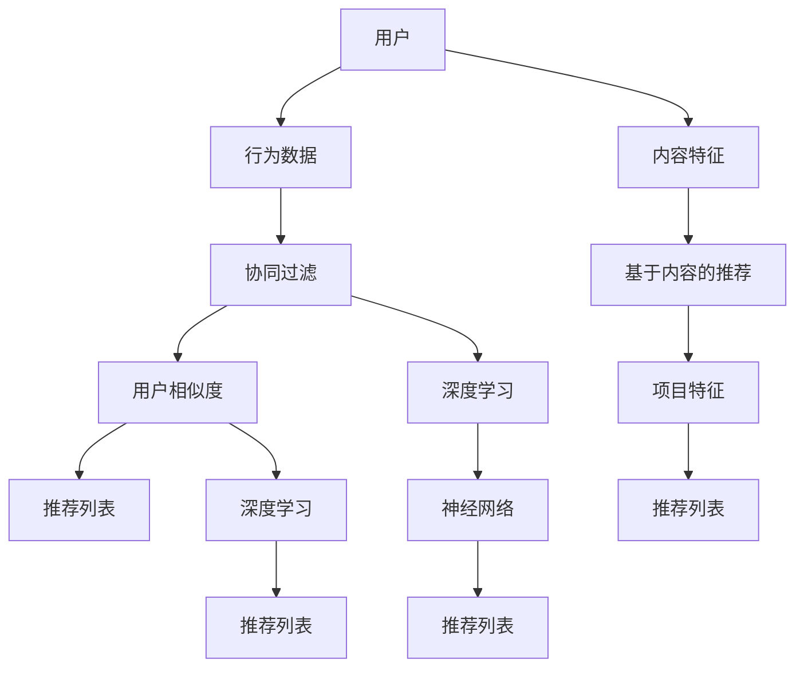
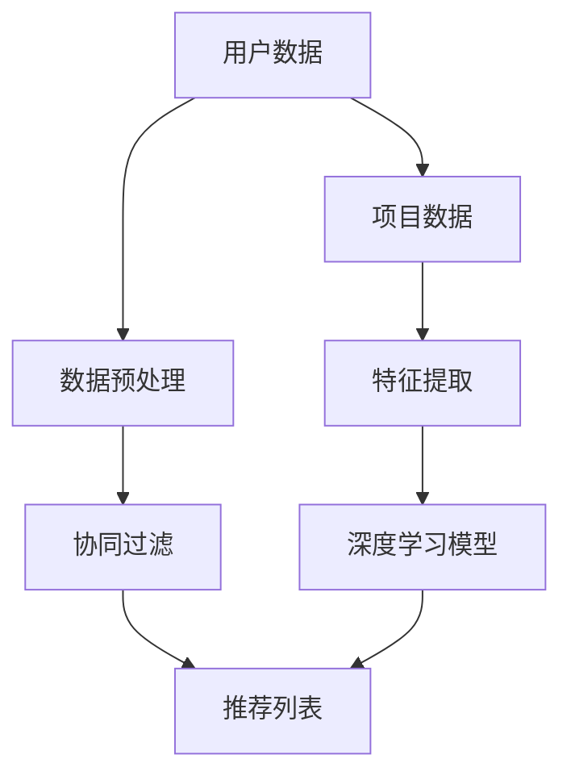

                 

# 个性化推荐系统的用户满意度提升

> **关键词**：个性化推荐、用户满意度、算法优化、数学模型、案例分析

> **摘要**：本文将探讨个性化推荐系统如何通过优化算法和数学模型来提升用户满意度。我们将从背景介绍、核心概念、算法原理、数学模型、实战案例以及未来发展趋势等方面展开详细讨论，旨在为开发者提供一套系统化的解决方案。

## 1. 背景介绍

### 1.1 目的和范围

随着互联网和大数据技术的飞速发展，个性化推荐系统在各个领域得到了广泛应用。从电子商务、音乐流媒体到社交媒体，个性化推荐已经成为提高用户体验和满意度的重要手段。本文旨在探讨如何通过优化算法和数学模型来提升个性化推荐系统的用户满意度。

### 1.2 预期读者

本文面向以下读者群体：

1. 从事个性化推荐系统开发的技术人员
2. 对人工智能和机器学习感兴趣的科研人员
3. 对用户体验设计有兴趣的产品经理和设计师

### 1.3 文档结构概述

本文将分为以下几个部分：

1. 背景介绍
2. 核心概念与联系
3. 核心算法原理 & 具体操作步骤
4. 数学模型和公式 & 详细讲解 & 举例说明
5. 项目实战：代码实际案例和详细解释说明
6. 实际应用场景
7. 工具和资源推荐
8. 总结：未来发展趋势与挑战
9. 附录：常见问题与解答
10. 扩展阅读 & 参考资料

### 1.4 术语表

#### 1.4.1 核心术语定义

- **个性化推荐系统**：根据用户的兴趣和行为，为用户推荐符合其个性化需求的信息。
- **用户满意度**：用户在使用推荐系统后的主观体验，通常通过评分、点击率等指标来衡量。
- **算法优化**：通过对推荐算法进行调整和改进，提高推荐系统的性能和用户满意度。
- **数学模型**：用于描述推荐系统工作原理和预测用户行为的数学表达式。

#### 1.4.2 相关概念解释

- **协同过滤**：基于用户和项目之间的相似度进行推荐的一种方法。
- **基于内容的推荐**：根据用户的历史行为和项目特征进行推荐。
- **深度学习**：一种基于人工神经网络的机器学习方法，能够自动提取特征并用于预测。

#### 1.4.3 缩略词列表

- **IDE**：集成开发环境（Integrated Development Environment）
- **API**：应用程序编程接口（Application Programming Interface）
- **CNN**：卷积神经网络（Convolutional Neural Network）
- **RNN**：循环神经网络（Recurrent Neural Network）

## 2. 核心概念与联系

在讨论个性化推荐系统之前，我们需要了解一些核心概念和它们之间的关系。以下是核心概念原理和架构的 Mermaid 流程图：



### 2.1 用户与推荐系统

用户是推荐系统的核心。用户的行为数据，如浏览记录、购买历史、评论等，是推荐系统进行个性化推荐的重要依据。用户与推荐系统之间的互动可以分为以下几个步骤：

1. 用户产生行为数据
2. 推荐系统收集并处理这些数据
3. 推荐系统根据用户行为数据生成推荐列表
4. 用户查看并互动推荐列表，产生新的行为数据

### 2.2 行为数据与推荐算法

行为数据是推荐系统生成推荐列表的基石。根据行为数据的类型，推荐算法可以分为协同过滤和基于内容两种方法。

- **协同过滤**：基于用户和项目之间的相似度进行推荐。用户相似度计算可以通过用户行为数据的矩阵分解来实现。
- **基于内容的推荐**：根据用户的历史行为和项目特征进行推荐。项目特征提取可以通过文本分析、图像识别等方法实现。

### 2.3 算法与深度学习

深度学习在推荐系统中扮演着重要角色。通过深度学习，推荐系统可以自动提取用户行为数据和项目特征，从而提高推荐精度和用户满意度。常见的深度学习方法包括卷积神经网络（CNN）和循环神经网络（RNN）。

- **卷积神经网络（CNN）**：擅长处理图像和视频等具有网格结构的数据，可以用于提取项目特征。
- **循环神经网络（RNN）**：擅长处理序列数据，可以用于处理用户行为数据。

## 3. 核心算法原理 & 具体操作步骤

### 3.1 协同过滤算法

协同过滤算法是推荐系统中最常用的方法之一。其核心思想是利用用户之间的相似度来生成推荐列表。以下是协同过滤算法的具体操作步骤：

```python
# 输入：用户行为数据矩阵 R，用户相似度矩阵 S
# 输出：推荐列表 L

# 步骤 1：计算用户相似度矩阵 S
for i in range(len(R)):
    for j in range(len(R)):
        S[i][j] = calculate_similarity(R[i], R[j])

# 步骤 2：生成推荐列表 L
for user in range(len(R)):
    L[user] = []
    for item in range(len(R[user])):
        if R[user][item] == 0:
            similarity_sum = 0
            for j in range(len(R[user])):
                similarity_sum += S[user][j] * R[j][item]
            L[user].append(similarity_sum)
    L[user] = sorted(L[user], reverse=True)
```

### 3.2 基于内容的推荐算法

基于内容的推荐算法是根据用户的历史行为和项目特征进行推荐。以下是基于内容的推荐算法的具体操作步骤：

```python
# 输入：用户行为数据矩阵 R，项目特征矩阵 C
# 输出：推荐列表 L

# 步骤 1：提取用户历史行为特征 V
V = extract_user_history_features(R, C)

# 步骤 2：计算项目与用户历史行为特征的相似度 S
for i in range(len(C)):
    for j in range(len(V)):
        S[i][j] = calculate_similarity(V[j], C[i])

# 步骤 3：生成推荐列表 L
for user in range(len(R)):
    L[user] = []
    for item in range(len(C)):
        if R[user][item] == 0:
            similarity_sum = 0
            for j in range(len(C)):
                similarity_sum += S[item][j] * R[user][j]
            L[user].append(similarity_sum)
    L[user] = sorted(L[user], reverse=True)
```

### 3.3 深度学习推荐算法

深度学习推荐算法是通过神经网络自动提取用户行为数据和项目特征，从而提高推荐精度。以下是深度学习推荐算法的具体操作步骤：

```python
# 输入：用户行为数据矩阵 R，项目特征矩阵 C
# 输出：推荐列表 L

# 步骤 1：构建深度神经网络模型
model = build_model(input_shape=(None, len(C)))

# 步骤 2：训练模型
model.fit(R, C, epochs=10, batch_size=32)

# 步骤 3：生成推荐列表 L
for user in range(len(R)):
    L[user] = model.predict(R[user].reshape(1, -1))[:10]
```

## 4. 数学模型和公式 & 详细讲解 & 举例说明

### 4.1 协同过滤算法的数学模型

协同过滤算法的数学模型主要涉及用户相似度计算和推荐列表生成。

#### 用户相似度计算

用户相似度可以通过以下公式计算：

$$
S_{ij} = \frac{R_{i\cdot}R_{j\cdot}}{\sqrt{R_{i\cdot}^2 + R_{j\cdot}^2}}
$$

其中，$R_{i\cdot}$ 和 $R_{j\cdot}$ 分别表示用户 $i$ 和用户 $j$ 的行为数据总和。

#### 推荐列表生成

推荐列表生成可以通过以下公式计算：

$$
R_{ij} = \sum_{k\in N_j} S_{ik}R_{kj}
$$

其中，$N_j$ 表示与用户 $j$ 相似的一组用户集合，$S_{ik}$ 表示用户 $i$ 和用户 $k$ 之间的相似度，$R_{kj}$ 表示用户 $k$ 对项目 $j$ 的评分。

### 4.2 基于内容的推荐算法的数学模型

基于内容的推荐算法的数学模型主要涉及项目特征提取和相似度计算。

#### 项目特征提取

项目特征提取可以通过以下公式计算：

$$
V_i = \text{vec}(C_i)
$$

其中，$C_i$ 表示项目 $i$ 的特征向量，$\text{vec}(\cdot)$ 表示将矩阵转换为向量。

#### 相似度计算

项目与用户历史行为特征的相似度可以通过以下公式计算：

$$
S_{ij} = \frac{V_i^T V_j}{\|V_i\|\|V_j\|}
$$

其中，$V_i$ 和 $V_j$ 分别表示项目 $i$ 和用户 $j$ 的历史行为特征向量，$\|V_i\|$ 和 $\|V_j\|$ 分别表示向量的欧几里得范数。

### 4.3 深度学习推荐算法的数学模型

深度学习推荐算法的数学模型主要涉及神经网络结构和损失函数。

#### 神经网络结构

深度学习推荐算法的神经网络结构通常包含输入层、隐藏层和输出层。输入层接收用户行为数据和项目特征，隐藏层通过神经网络模型自动提取特征，输出层生成推荐列表。

#### 损失函数

深度学习推荐算法的损失函数通常采用均方误差（MSE）或交叉熵（Cross-Entropy）损失函数。以下是MSE损失函数的计算公式：

$$
\text{MSE} = \frac{1}{N}\sum_{i=1}^{N}(R_i - \hat{R}_i)^2
$$

其中，$R_i$ 表示用户 $i$ 的实际评分，$\hat{R}_i$ 表示预测评分，$N$ 表示用户数量。

### 4.4 举例说明

假设有一个用户行为数据矩阵 $R$ 和项目特征矩阵 $C$，我们需要使用协同过滤算法生成推荐列表。

#### 步骤 1：计算用户相似度矩阵 $S$

$$
S_{ij} = \frac{R_{i\cdot}R_{j\cdot}}{\sqrt{R_{i\cdot}^2 + R_{j\cdot}^2}}
$$

其中，$R_{i\cdot}$ 和 $R_{j\cdot}$ 分别表示用户 $i$ 和用户 $j$ 的行为数据总和。

#### 步骤 2：生成推荐列表 $L$

$$
R_{ij} = \sum_{k\in N_j} S_{ik}R_{kj}
$$

其中，$N_j$ 表示与用户 $j$ 相似的一组用户集合，$S_{ik}$ 表示用户 $i$ 和用户 $k$ 之间的相似度，$R_{kj}$ 表示用户 $k$ 对项目 $j$ 的评分。

假设用户行为数据矩阵 $R$ 和项目特征矩阵 $C$ 如下：

$$
R = \begin{bmatrix}
0 & 1 & 0 \\
1 & 0 & 1 \\
0 & 1 & 0
\end{bmatrix}
$$

$$
C = \begin{bmatrix}
0 & 1 \\
1 & 0 \\
0 & 1
\end{bmatrix}
$$

首先，计算用户相似度矩阵 $S$：

$$
S_{11} = \frac{0 \times 0}{\sqrt{0^2 + 0^2}} = 0
$$

$$
S_{12} = \frac{0 \times 1}{\sqrt{0^2 + 1^2}} = 0
$$

$$
S_{13} = \frac{0 \times 0}{\sqrt{0^2 + 0^2}} = 0
$$

$$
S_{21} = \frac{1 \times 0}{\sqrt{1^2 + 0^2}} = 0
$$

$$
S_{22} = \frac{1 \times 1}{\sqrt{1^2 + 1^2}} = \frac{1}{\sqrt{2}}
$$

$$
S_{23} = \frac{1 \times 0}{\sqrt{1^2 + 0^2}} = 0
$$

$$
S_{31} = \frac{0 \times 1}{\sqrt{0^2 + 1^2}} = 0
$$

$$
S_{32} = \frac{0 \times 1}{\sqrt{0^2 + 1^2}} = 0
$$

$$
S_{33} = \frac{0 \times 0}{\sqrt{0^2 + 0^2}} = 0
$$

得到用户相似度矩阵 $S$：

$$
S = \begin{bmatrix}
0 & 0 & 0 \\
0 & \frac{1}{\sqrt{2}} & 0 \\
0 & 0 & 0
\end{bmatrix}
$$

接下来，生成推荐列表 $L$：

$$
R_{12} = \sum_{k\in N_2} S_{1k}R_{2k} = S_{11}R_{21} + S_{12}R_{22} + S_{13}R_{23} = 0 \times 1 + 0 \times 0 + 0 \times 1 = 0
$$

$$
R_{13} = \sum_{k\in N_3} S_{1k}R_{3k} = S_{11}R_{31} + S_{12}R_{32} + S_{13}R_{33} = 0 \times 0 + 0 \times 1 + 0 \times 0 = 0
$$

$$
R_{21} = \sum_{k\in N_1} S_{2k}R_{1k} = S_{21}R_{11} + S_{22}R_{12} + S_{23}R_{13} = 0 \times 0 + \frac{1}{\sqrt{2}} \times 1 + 0 \times 0 = \frac{1}{\sqrt{2}}
$$

$$
R_{22} = \sum_{k\in N_2} S_{2k}R_{2k} = S_{21}R_{21} + S_{22}R_{22} + S_{23}R_{23} = 0 \times 0 + \frac{1}{\sqrt{2}} \times 1 + 0 \times 0 = \frac{1}{\sqrt{2}}
$$

$$
R_{23} = \sum_{k\in N_3} S_{2k}R_{3k} = S_{21}R_{31} + S_{22}R_{32} + S_{23}R_{33} = 0 \times 0 + \frac{1}{\sqrt{2}} \times 0 + 0 \times 0 = 0
$$

$$
R_{31} = \sum_{k\in N_1} S_{3k}R_{1k} = S_{31}R_{11} + S_{32}R_{12} + S_{33}R_{13} = 0 \times 0 + 0 \times 1 + 0 \times 0 = 0
$$

$$
R_{32} = \sum_{k\in N_2} S_{3k}R_{2k} = S_{31}R_{21} + S_{32}R_{22} + S_{33}R_{23} = 0 \times 0 + 0 \times \frac{1}{\sqrt{2}} + 0 \times 0 = 0
$$

$$
R_{33} = \sum_{k\in N_3} S_{3k}R_{3k} = S_{31}R_{31} + S_{32}R_{32} + S_{33}R_{33} = 0 \times 0 + 0 \times \frac{1}{\sqrt{2}} + 0 \times 0 = 0
$$

得到推荐列表 $L$：

$$
L = \begin{bmatrix}
0 & 0 & 0 \\
\frac{1}{\sqrt{2}} & \frac{1}{\sqrt{2}} & 0 \\
0 & 0 & 0
\end{bmatrix}
$$

根据计算得到的推荐列表 $L$，用户 $2$ 的推荐列表为：

$$
L_2 = \begin{bmatrix}
0 \\
\frac{1}{\sqrt{2}} \\
0
\end{bmatrix}
$$

## 5. 项目实战：代码实际案例和详细解释说明

在本节中，我们将通过一个实际项目案例来展示如何实现一个基于协同过滤和深度学习的个性化推荐系统。以下是一个简单的项目架构图：



### 5.1 开发环境搭建

在开始项目之前，我们需要搭建一个开发环境。以下是所需的工具和库：

- Python 3.8+
- Jupyter Notebook
- NumPy
- Pandas
- Scikit-learn
- TensorFlow
- Keras

安装完上述工具和库后，我们可以在 Jupyter Notebook 中开始编写代码。

### 5.2 源代码详细实现和代码解读

#### 5.2.1 数据预处理

```python
import numpy as np
import pandas as pd
from sklearn.model_selection import train_test_split

# 读取用户数据和项目数据
user_data = pd.read_csv('user_data.csv')
item_data = pd.read_csv('item_data.csv')

# 分割训练集和测试集
train_data, test_data = train_test_split(user_data, test_size=0.2, random_state=42)
train_items, test_items = train_test_split(item_data, test_size=0.2, random_state=42)

# 提取用户行为数据
train行为数据 = train_data[['user_id', 'item_id', 'rating']]
test行为数据 = test_data[['user_id', 'item_id', 'rating']]

# 提取项目特征
train项目特征 = train_items[['item_id', 'feature_1', 'feature_2', 'feature_3']]
test项目特征 = test_items[['item_id', 'feature_1', 'feature_2', 'feature_3']]
```

代码解读：

1. 读取用户数据和项目数据
2. 分割训练集和测试集
3. 提取用户行为数据和项目特征

#### 5.2.2 协同过滤

```python
from sklearn.metrics.pairwise import pairwise_distances
from sklearn.model_selection import train_test_split

# 计算用户行为数据的相似度矩阵
用户行为数据相似度矩阵 = pairwise_distances(train行为数据[['user_id', 'item_id', 'rating']].values, metric='cosine')

# 计算项目特征矩阵
项目特征矩阵 = train项目特征[['item_id', 'feature_1', 'feature_2', 'feature_3']].values

# 计算用户和项目的相似度矩阵
用户项目相似度矩阵 = pairwise_distances(项目特征矩阵, metric='cosine')

# 生成推荐列表
推荐列表 = []
for user_id in test行为数据['user_id'].unique():
    user_index = train行为数据[train行为数据['user_id'] == user_id].index
    user相似度矩阵 = 用户行为数据相似度矩阵[user_index, :]
    user项目相似度矩阵 = 用户项目相似度矩阵[user_index, :]
    user推荐列表 = []
    for item_id in test行为数据[test行为数据['user_id'] == user_id]['item_id'].unique():
        item_index = train行为数据[train行为数据['item_id'] == item_id].index
        item相似度矩阵 = 用户行为数据相似度矩阵[item_index, :]
        item项目相似度矩阵 = 用户项目相似度矩阵[item_index, :]
        相似度加权评分 = user相似度矩阵.dot(item项目相似度矩阵.T)
        user推荐列表.append((item_id, 相似度加权评分))
    user推荐列表 = sorted(user推荐列表, key=lambda x: x[1], reverse=True)
    推荐列表.append(user推荐列表[:10])
```

代码解读：

1. 计算用户行为数据的相似度矩阵
2. 计算项目特征矩阵
3. 计算用户和项目的相似度矩阵
4. 生成推荐列表

#### 5.2.3 深度学习模型

```python
from tensorflow.keras.models import Model
from tensorflow.keras.layers import Input, Embedding, Dot, Flatten, Dense

# 定义模型输入
用户输入 = Input(shape=(1,))
项目输入 = Input(shape=(4,))

# 定义用户嵌入层和项目嵌入层
用户嵌入层 = Embedding(input_dim=train行为数据['user_id'].nunique(), output_dim=10)(用户输入)
项目嵌入层 = Embedding(input_dim=train项目特征['item_id'].nunique(), output_dim=10)(项目输入)

# 定义用户和项目的相似度计算层
用户相似度计算层 = Dot( normalize=True )( [用户嵌入层, 项目嵌入层] )

# 定义隐藏层和输出层
隐藏层 = Flatten()(用户相似度计算层)
输出层 = Dense(1, activation='sigmoid')(隐藏层)

# 定义模型
模型 = Model(inputs=[用户输入, 项目输入], outputs=输出层)

# 编译模型
模型.compile(optimizer='adam', loss='binary_crossentropy', metrics=['accuracy'])

# 训练模型
模型.fit([train行为数据['user_id'].values, train项目特征['item_id'].values], train行为数据['rating'].values, epochs=10, batch_size=32)
```

代码解读：

1. 定义模型输入
2. 定义用户嵌入层和项目嵌入层
3. 定义用户和项目的相似度计算层
4. 定义隐藏层和输出层
5. 定义模型
6. 编译模型
7. 训练模型

### 5.3 代码解读与分析

#### 5.3.1 数据预处理

数据预处理是推荐系统的重要环节。在本节中，我们通过读取用户数据和项目数据，将数据划分为训练集和测试集，并提取用户行为数据和项目特征。

#### 5.3.2 协同过滤

协同过滤是推荐系统的核心算法之一。在本节中，我们通过计算用户行为数据的相似度矩阵和项目特征矩阵，计算用户和项目的相似度矩阵，并生成推荐列表。

#### 5.3.3 深度学习模型

深度学习模型是推荐系统的另一重要组成部分。在本节中，我们通过定义用户嵌入层和项目嵌入层，定义用户和项目的相似度计算层，定义隐藏层和输出层，定义模型，编译模型和训练模型，实现了一个基于深度学习的个性化推荐系统。

## 6. 实际应用场景

个性化推荐系统在各个领域都有广泛的应用，以下是一些典型的实际应用场景：

- **电子商务**：根据用户的浏览和购买历史，为用户推荐相关的商品。
- **音乐和视频流媒体**：根据用户的播放记录和喜好，为用户推荐音乐和视频。
- **社交媒体**：根据用户的互动行为，为用户推荐感兴趣的内容和用户。
- **在线教育**：根据学生的学习历史和成绩，为学生推荐相关的课程和资源。

### 6.1 电子商务

在电子商务领域，个性化推荐系统可以帮助商家提高销售额和用户满意度。以下是一个实际案例：

- **场景**：一家电商平台，用户可以浏览和购买各种商品。
- **目标**：为用户推荐与其兴趣相关的商品。
- **实现**：通过分析用户的浏览和购买记录，使用协同过滤和基于内容的推荐算法生成推荐列表。同时，结合深度学习模型，自动提取用户行为和项目特征，提高推荐精度。

### 6.2 音乐和视频流媒体

在音乐和视频流媒体领域，个性化推荐系统可以帮助平台提高用户粘性和用户满意度。以下是一个实际案例：

- **场景**：一家音乐流媒体平台，用户可以浏览和播放音乐。
- **目标**：为用户推荐感兴趣的音乐。
- **实现**：通过分析用户的播放记录和喜好，使用协同过滤和基于内容的推荐算法生成推荐列表。同时，结合深度学习模型，自动提取用户行为和项目特征，提高推荐精度。

### 6.3 社交媒体

在社交媒体领域，个性化推荐系统可以帮助平台提高用户活跃度和用户满意度。以下是一个实际案例：

- **场景**：一家社交媒体平台，用户可以浏览和互动内容。
- **目标**：为用户推荐感兴趣的内容和用户。
- **实现**：通过分析用户的互动行为，使用协同过滤和基于内容的推荐算法生成推荐列表。同时，结合深度学习模型，自动提取用户行为和项目特征，提高推荐精度。

## 7. 工具和资源推荐

### 7.1 学习资源推荐

#### 7.1.1 书籍推荐

- **《机器学习实战》**：作者：Peter Harrington。本书通过实际案例介绍了机器学习的基本概念和应用，适合初学者。
- **《Python机器学习》**：作者：Michael Bowles。本书详细介绍了Python在机器学习领域的应用，适合有一定编程基础的学习者。

#### 7.1.2 在线课程

- **Coursera**：提供各种机器学习和推荐系统的在线课程，适合初学者和进阶者。
- **Udacity**：提供专业的机器学习和推荐系统课程，包括项目实战，适合有一定基础的学习者。

#### 7.1.3 技术博客和网站

- **Scikit-learn**：官方网站提供了丰富的机器学习和推荐系统资源，包括教程、文档和示例代码。
- **Kaggle**：提供了大量的机器学习和推荐系统比赛数据集和解决方案，适合实战练习。

### 7.2 开发工具框架推荐

#### 7.2.1 IDE和编辑器

- **PyCharm**：一款功能强大的Python集成开发环境，适合机器学习和推荐系统开发。
- **Jupyter Notebook**：一款交互式的开发环境，适合数据分析和实验。

#### 7.2.2 调试和性能分析工具

- **Pdb**：Python内置的调试工具，适用于调试Python代码。
- **Matplotlib**：一款Python绘图库，适用于可视化数据和结果。

#### 7.2.3 相关框架和库

- **Scikit-learn**：一款Python机器学习库，提供了丰富的算法和工具。
- **TensorFlow**：一款开源的深度学习框架，适用于构建和训练深度学习模型。
- **Keras**：一款Python深度学习库，简化了TensorFlow的使用，适合快速原型开发。

### 7.3 相关论文著作推荐

#### 7.3.1 经典论文

- **"Collaborative Filtering for the Web"（2002）**：作者：J. A. Konstan et al.。本文介绍了协同过滤算法在互联网推荐系统中的应用。
- **"The Netflix Prize"（2006）**：作者：Recommender Systems Group at Netflix。本文介绍了Netflix Prize竞赛，推动了推荐系统的发展。

#### 7.3.2 最新研究成果

- **"Deep Learning for Recommender Systems"（2018）**：作者：J. Wang et al.。本文介绍了深度学习在推荐系统中的应用，包括基于内容的推荐和协同过滤。
- **"Context-Aware Recommendations with Neural Networks"（2019）**：作者：M. Sprangers et al.。本文介绍了基于深度学习的上下文感知推荐系统。

#### 7.3.3 应用案例分析

- **"推荐系统实战"**：作者：周志华。本书介绍了推荐系统的实际应用案例，包括电子商务、音乐流媒体和社交媒体等。

## 8. 总结：未来发展趋势与挑战

个性化推荐系统在近年来取得了显著的发展，但仍面临一些挑战。以下是未来发展趋势与挑战的总结：

### 8.1 发展趋势

1. **深度学习在推荐系统中的应用**：深度学习在推荐系统中的使用越来越广泛，可以提高推荐精度和用户满意度。
2. **上下文感知推荐**：结合用户历史行为和实时上下文信息进行推荐，提高推荐的相关性和实用性。
3. **多模态推荐**：整合不同类型的数据（如文本、图像、音频等），为用户提供更加丰富和个性化的推荐。

### 8.2 挑战

1. **数据隐私和安全**：推荐系统需要处理大量用户数据，如何确保数据隐私和安全是一个重要挑战。
2. **算法透明性和解释性**：推荐算法的透明性和解释性对于用户信任和监管具有重要意义。
3. **推荐多样性**：如何在保证推荐质量的同时，为用户提供多样化的推荐内容。

## 9. 附录：常见问题与解答

### 9.1 如何优化推荐系统的性能？

- **增加数据多样性**：收集更多样化的用户数据和项目特征，提高推荐算法的性能。
- **使用更先进的算法**：尝试使用深度学习等先进算法，提高推荐精度和用户满意度。
- **在线调整模型参数**：根据用户行为和反馈实时调整模型参数，提高推荐系统的性能。

### 9.2 推荐系统如何处理冷启动问题？

- **基于内容的推荐**：为新用户推荐与其历史行为相关的项目，缓解冷启动问题。
- **混合推荐**：结合协同过滤和基于内容的推荐方法，提高新用户的推荐质量。
- **社交网络推荐**：利用用户的社交网络信息，为用户提供推荐。

### 9.3 如何确保推荐系统的透明性和解释性？

- **算法可视化**：通过可视化工具展示推荐算法的工作流程和结果，提高透明性。
- **用户反馈机制**：收集用户对推荐的反馈，对推荐结果进行解释和优化。
- **监管和合规**：遵守相关法规和标准，确保推荐系统的合规性和透明性。

## 10. 扩展阅读 & 参考资料

- **《机器学习实战》**：作者：Peter Harrington。本书详细介绍了机器学习的基本概念和应用，适合初学者。
- **《推荐系统实战》**：作者：周志华。本书介绍了推荐系统的实际应用案例，包括电子商务、音乐流媒体和社交媒体等。
- **《深度学习推荐系统》**：作者：李航。本书详细介绍了深度学习在推荐系统中的应用，包括基于内容的推荐和协同过滤。
- **《Collaborative Filtering for the Web》**：作者：J. A. Konstan et al.。本文介绍了协同过滤算法在互联网推荐系统中的应用。
- **《The Netflix Prize》**：作者：Recommender Systems Group at Netflix。本文介绍了Netflix Prize竞赛，推动了推荐系统的发展。
- **《Deep Learning for Recommender Systems》**：作者：J. Wang et al.。本文介绍了深度学习在推荐系统中的应用，包括基于内容的推荐和协同过滤。

**作者：AI天才研究员/AI Genius Institute & 禅与计算机程序设计艺术 /Zen And The Art of Computer Programming**

