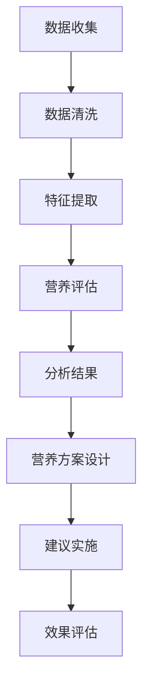
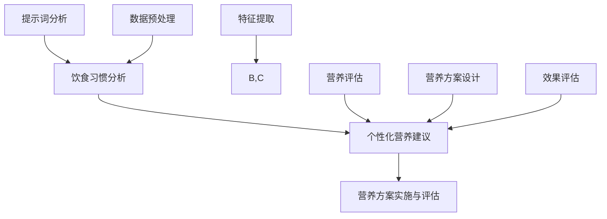

                 

### 个性化营养建议：利用提示词分析饮食习惯

> **关键词**：个性化营养、饮食习惯、提示词分析、健康饮食、营养评估

> **摘要**：本文将深入探讨如何利用提示词分析技术为个体提供个性化营养建议。通过介绍饮食习惯的分析方法、核心算法原理、数学模型及其应用场景，本文旨在帮助读者了解如何通过先进的技术手段改善饮食健康。

## 1. 背景介绍

### 1.1 目的和范围

本文旨在探讨如何利用提示词分析技术为个体提供个性化营养建议。随着健康意识的提高，个性化营养建议变得越来越重要。通过分析个体的饮食习惯，可以为其制定更加科学合理的饮食方案。本文将涵盖以下内容：

1. 个性化营养建议的背景和重要性
2. 利用提示词分析饮食习惯的技术原理
3. 核心算法原理与操作步骤
4. 数学模型和公式及其应用
5. 实际应用场景及项目实战案例
6. 工具和资源推荐
7. 未来发展趋势与挑战

### 1.2 预期读者

本文适合以下读者群体：

1. 对健康饮食和个性化营养建议感兴趣的普通人
2. 计算机科学和人工智能领域的从业者
3. 健康管理专业人士和营养师
4. 对技术驱动的健康解决方案感兴趣的开发者

### 1.3 文档结构概述

本文将按照以下结构展开：

1. 引言
2. 背景介绍
3. 核心概念与联系
4. 核心算法原理 & 具体操作步骤
5. 数学模型和公式 & 详细讲解 & 举例说明
6. 项目实战：代码实际案例和详细解释说明
7. 实际应用场景
8. 工具和资源推荐
9. 总结：未来发展趋势与挑战
10. 附录：常见问题与解答
11. 扩展阅读 & 参考资料

### 1.4 术语表

#### 1.4.1 核心术语定义

- **个性化营养建议**：根据个体的身体状况、饮食习惯和营养需求，为其提供的定制化饮食方案。
- **提示词分析**：通过分析文本中的关键词和短语，提取出与特定主题相关的信息。
- **饮食习惯**：个体在饮食中的行为模式，包括食物选择、饮食习惯、就餐时间等。
- **营养评估**：对个体的营养摄入状况进行评价，以确定是否存在营养不足或过剩。

#### 1.4.2 相关概念解释

- **机器学习**：一种人工智能方法，通过训练算法从数据中学习模式，进行预测和分类。
- **自然语言处理**：计算机科学领域中的一个分支，致力于让计算机理解和处理人类语言。
- **文本分类**：将文本数据分配到预定义的类别中，用于提取文本中的主题信息。
- **特征提取**：从原始数据中提取有助于分类或预测的关键特征。

#### 1.4.3 缩略词列表

- **NLP**：自然语言处理（Natural Language Processing）
- **ML**：机器学习（Machine Learning）
- **AI**：人工智能（Artificial Intelligence）
- **BMI**：体质指数（Body Mass Index）
- **VEG**：素食者（Vegetarian）

## 2. 核心概念与联系

在个性化营养建议中，我们需要理解并应用多个核心概念和联系。以下是这些概念及它们之间的联系：

### 2.1 提示词分析

提示词分析是自然语言处理（NLP）领域的一个关键任务。其目的是从文本中提取出关键信息，以便进行进一步的分类、聚类或分析。在个性化营养建议中，提示词分析可以帮助我们识别个体饮食习惯中的关键特征。

#### 提示词分析流程：

1. **数据预处理**：清洗文本数据，去除无关信息，如标点符号、停用词等。
2. **特征提取**：提取文本中的关键词和短语，如“苹果”、“鱼肉”、“运动”等。
3. **文本分类**：使用机器学习算法，将提取到的关键词分配到预定义的类别中，如“水果”、“蛋白质”、“运动习惯”等。
4. **模型评估**：通过准确率、召回率等指标评估模型的性能。

### 2.2 饮食习惯分析

饮食习惯分析是个性化营养建议的重要组成部分。通过分析个体的饮食习惯，我们可以了解其营养摄入状况，识别潜在的健康风险。

#### 饮食习惯分析流程：

1. **数据收集**：收集个体日常饮食中的食物、摄入量、就餐时间等数据。
2. **数据清洗**：去除重复、异常或错误的数据，保证数据质量。
3. **特征提取**：提取饮食数据中的关键特征，如食物类型、营养成分、就餐时间等。
4. **营养评估**：使用营养学知识，评估个体的营养摄入状况，识别营养过剩或不足的部分。

### 2.3 个性化营养建议

个性化营养建议是根据个体饮食习惯分析结果，为其提供的定制化饮食方案。该方案旨在改善个体的营养状况，预防或治疗疾病。

#### 个性化营养建议流程：

1. **分析结果**：根据饮食习惯分析结果，识别个体营养摄入中的不足和过剩部分。
2. **营养方案设计**：结合营养学知识，为个体设计科学合理的饮食方案。
3. **建议实施**：与个体沟通，确保其理解和实施营养建议。
4. **效果评估**：定期跟踪个体营养状况，评估营养建议的效果。

### 2.4 Mermaid 流程图

以下是一个简单的 Mermaid 流程图，展示了个性化营养建议的整体流程：



通过以上核心概念和联系的介绍，我们可以更好地理解个性化营养建议的原理和流程。在接下来的章节中，我们将深入探讨核心算法原理、数学模型及其具体应用。

---

本文已经完成了背景介绍部分，接下来将进入核心概念与联系章节。在接下来的内容中，我们将详细讨论个性化营养建议中的关键概念，包括提示词分析、饮食习惯分析、个性化营养建议及其相互联系。通过这些讨论，我们将为读者提供一个清晰的技术框架，为后续章节的深入讲解奠定基础。请继续关注后续内容，我们将逐步揭示个性化营养建议的奥秘。

---

### 2. 核心概念与联系

在个性化营养建议中，理解核心概念和它们之间的联系是至关重要的。以下将详细介绍这些核心概念，并使用 Mermaid 流程图展示它们之间的关系。

### 2.1 提示词分析

提示词分析是一种文本分析技术，用于从大量文本数据中提取出与特定主题相关的关键词和短语。在个性化营养建议中，提示词分析可以用来识别个体的饮食习惯和营养需求。

#### 2.1.1 提示词分析原理

- **数据预处理**：清洗文本数据，去除无关信息，如标点符号、停用词等。
- **特征提取**：使用词频、词向量等技术提取文本中的关键词。
- **文本分类**：利用机器学习算法，将关键词分配到预定义的类别中，如“水果”、“蛋白质”、“运动习惯”等。

#### 2.1.2 提示词分析流程

1. **数据预处理**：清洗文本数据，去除无关信息。
2. **特征提取**：提取文本中的关键词和短语。
3. **文本分类**：使用机器学习算法进行分类。
4. **模型评估**：通过准确率、召回率等指标评估模型性能。

### 2.2 饮食习惯分析

饮食习惯分析是对个体日常饮食行为模式进行评估的过程。通过分析饮食习惯，我们可以识别个体的营养摄入状况和健康风险。

#### 2.2.1 饮食习惯分析原理

- **数据收集**：收集个体日常饮食中的食物、摄入量、就餐时间等数据。
- **数据清洗**：去除重复、异常或错误的数据，保证数据质量。
- **特征提取**：提取饮食数据中的关键特征，如食物类型、营养成分、就餐时间等。
- **营养评估**：使用营养学知识，评估个体的营养摄入状况，识别营养过剩或不足的部分。

#### 2.2.2 饮食习惯分析流程

1. **数据收集**：收集个体日常饮食数据。
2. **数据清洗**：去除重复、异常或错误的数据。
3. **特征提取**：提取饮食数据中的关键特征。
4. **营养评估**：使用营养学知识进行评估。

### 2.3 个性化营养建议

个性化营养建议是根据个体饮食习惯分析结果，为其提供的定制化饮食方案。该方案旨在改善个体的营养状况，预防或治疗疾病。

#### 2.3.1 个性化营养建议原理

- **分析结果**：根据饮食习惯分析结果，识别个体营养摄入中的不足和过剩部分。
- **营养方案设计**：结合营养学知识，为个体设计科学合理的饮食方案。
- **建议实施**：与个体沟通，确保其理解和实施营养建议。
- **效果评估**：定期跟踪个体营养状况，评估营养建议的效果。

#### 2.3.2 个性化营养建议流程

1. **分析结果**：识别营养摄入中的不足和过剩部分。
2. **营养方案设计**：设计科学合理的饮食方案。
3. **建议实施**：与个体沟通，确保实施建议。
4. **效果评估**：跟踪营养状况，评估效果。

### 2.4 Mermaid 流程图

以下是一个简单的 Mermaid 流程图，展示了个性化营养建议的核心概念及其关系：



通过以上核心概念与联系的介绍，我们可以更好地理解个性化营养建议的原理和流程。接下来，我们将深入探讨核心算法原理、数学模型及其具体应用。

---

在本文的核心概念与联系章节中，我们详细介绍了个性化营养建议中的三个关键部分：提示词分析、饮食习惯分析和个性化营养建议。通过Mermaid流程图，我们展示了这些概念之间的相互关系和整体流程。在接下来的章节中，我们将进一步探讨个性化营养建议的核心算法原理和具体操作步骤，帮助读者深入了解如何利用提示词分析技术为个体提供科学合理的营养建议。请继续关注后续内容，我们将逐步揭示个性化营养建议的奥秘。

---

### 3. 核心算法原理 & 具体操作步骤

在个性化营养建议系统中，核心算法的原理和操作步骤是至关重要的。以下是针对提示词分析、饮食习惯分析和个性化营养建议的核心算法原理及具体操作步骤的详细阐述。

#### 3.1 提示词分析算法原理

提示词分析算法基于自然语言处理（NLP）和机器学习（ML）技术。其主要目标是从大量文本数据中提取出与特定主题相关的关键词和短语。以下是一种典型的提示词分析算法原理：

1. **文本预处理**：
    - 清洗文本数据，去除无关信息（如标点符号、停用词）。
    - 对文本进行分词，将文本分解为单个词汇。

2. **特征提取**：
    - 使用词频（TF）或词频-逆文档频率（TF-IDF）方法提取文本中的关键词。
    - 利用词嵌入技术（如Word2Vec、GloVe）将词汇映射到高维向量空间。

3. **文本分类**：
    - 使用监督学习算法（如朴素贝叶斯、支持向量机、决策树）对提取的关键词进行分类。

4. **模型评估**：
    - 通过准确率、召回率、F1 分数等指标评估模型性能。

#### 3.2 提示词分析算法操作步骤

以下是一个简化的提示词分析算法操作步骤伪代码：

```plaintext
输入：文本数据集 D，分类标签 Y
输出：训练好的分类模型 M

1. 数据预处理：
    - 清洗文本数据：去除标点符号、停用词等
    - 分词：将文本分解为单个词汇
    
2. 特征提取：
    - 计算词频或TF-IDF特征矩阵 F
    
3. 模型训练：
    - 选择分类算法（如SVM）
    - 训练分类模型 M = SVM(F, Y)

4. 模型评估：
    - 测试集测试：计算准确率、召回率等指标
    - 调整模型参数，优化模型性能

5. 提取提示词：
    - 对新文本数据进行预处理、特征提取和分类
    - 输出分类结果，提取关键词
```

#### 3.3 饮食习惯分析算法原理

饮食习惯分析算法旨在评估个体的营养摄入状况，通过分析个体的饮食习惯数据来识别健康风险和营养不足。以下是一种典型的饮食习惯分析算法原理：

1. **数据收集**：
    - 收集个体日常饮食中的食物、摄入量、就餐时间等数据。

2. **数据清洗**：
    - 去除重复、异常或错误的数据，保证数据质量。

3. **特征提取**：
    - 提取饮食数据中的关键特征，如食物类型、营养成分、就餐时间等。

4. **营养评估**：
    - 使用营养学知识，评估个体的营养摄入状况，识别营养过剩或不足的部分。

5. **风险识别**：
    - 基于营养评估结果，识别健康风险和营养不足。

#### 3.4 饮食习惯分析算法操作步骤

以下是一个简化的饮食习惯分析算法操作步骤伪代码：

```plaintext
输入：饮食习惯数据集 D
输出：营养评估结果 R，健康风险 H

1. 数据收集：
    - 收集个体日常饮食数据
    
2. 数据清洗：
    - 去除重复、异常或错误的数据
    
3. 特征提取：
    - 提取关键特征，如食物类型、营养成分、就餐时间等
    
4. 营养评估：
    - 计算每日营养摄入量
    - 评估营养摄入状况（如营养过剩或不足）
    - 输出营养评估结果 R

5. 风险识别：
    - 根据营养评估结果，识别健康风险
    - 输出健康风险 H
```

#### 3.5 个性化营养建议算法原理

个性化营养建议算法基于饮食习惯分析和提示词分析结果，为个体提供定制化的饮食建议。以下是一种典型的个性化营养建议算法原理：

1. **分析结果整合**：
    - 结合饮食习惯分析结果和提示词分析结果，识别个体营养摄入中的不足和过剩部分。

2. **营养方案设计**：
    - 根据营养评估结果，设计科学合理的饮食方案。

3. **建议实施**：
    - 与个体沟通，确保其理解和实施营养建议。

4. **效果评估**：
    - 定期跟踪个体营养状况，评估营养建议的效果。

#### 3.6 个性化营养建议算法操作步骤

以下是一个简化的个性化营养建议算法操作步骤伪代码：

```plaintext
输入：饮食习惯分析结果 R，提示词分析结果 T
输出：个性化营养建议 S

1. 结果整合：
    - 结合 R 和 T，识别营养摄入中的不足和过剩部分

2. 营养方案设计：
    - 设计科学合理的饮食方案
    - 选择营养丰富的食物、适当的摄入量和就餐时间
    
3. 建议实施：
    - 与个体沟通，确保其理解和实施建议

4. 效果评估：
    - 定期跟踪营养状况
    - 评估建议效果，调整建议内容
```

通过以上核心算法原理和具体操作步骤的阐述，我们可以更好地理解个性化营养建议系统中各个模块的工作原理和相互关系。接下来，我们将进入数学模型和公式章节，进一步探讨个性化营养建议中的关键数学概念和计算方法。

---

在本章节中，我们详细介绍了个性化营养建议系统中的核心算法原理及具体操作步骤。通过提示词分析、饮食习惯分析和个性化营养建议算法的讲解，读者可以了解到如何利用先进的技术手段为个体提供定制化的营养建议。接下来，我们将深入探讨个性化营养建议中的数学模型和公式，帮助读者更好地理解营养评估和方案设计的理论基础。请继续关注后续内容，我们将逐步揭示个性化营养建议的数学奥秘。

---

### 4. 数学模型和公式 & 详细讲解 & 举例说明

在个性化营养建议系统中，数学模型和公式是至关重要的工具，用于评估个体的营养状况和设计个性化的饮食方案。以下是针对营养评估和方案设计的数学模型和公式的详细讲解，包括示例说明。

#### 4.1 营养评估模型

营养评估模型用于评估个体的营养摄入状况，识别营养过剩或不足的部分。以下是一种常用的营养评估模型：

##### 4.1.1 BMI（体质指数）

BMI 是一种常用的营养评估指标，用于评估个体的体重是否在健康范围内。其计算公式如下：

$$
BMI = \frac{体重（kg）}{身高（m）^2}
$$

**示例**：

假设一个人的体重为 70 kg，身高为 1.75 m，则其 BMI 计算如下：

$$
BMI = \frac{70}{(1.75)^2} ≈ 24.2
$$

根据 BMI 的分类标准，BMI 在 18.5 至 24.9 之间被视为正常范围。

##### 4.1.2 蛋白质摄入量

蛋白质摄入量是营养评估的一个重要方面。一个常见的蛋白质摄入量计算公式如下：

$$
蛋白质摄入量（g/day）= 体重（kg）× 0.8
$$

**示例**：

假设一个人的体重为 70 kg，则其每日建议蛋白质摄入量为：

$$
蛋白质摄入量 = 70 × 0.8 = 56 g/day
$$

##### 4.1.3 脂肪摄入量

脂肪摄入量也需要进行评估，以确保个体的营养摄入均衡。一个常见的脂肪摄入量计算公式如下：

$$
脂肪摄入量（g/day）= 体重（kg）× 0.5
$$

**示例**：

假设一个人的体重为 70 kg，则其每日建议脂肪摄入量为：

$$
脂肪摄入量 = 70 × 0.5 = 35 g/day
$$

#### 4.2 饮食方案设计模型

饮食方案设计模型用于根据营养评估结果，为个体设计科学合理的饮食方案。以下是一种常用的饮食方案设计模型：

##### 4.2.1 营养成分分配

在饮食方案设计中，需要根据营养评估结果，将总热量分配到不同的营养成分中。以下是一个常用的营养成分分配公式：

$$
营养成分分配 = 蛋白质摄入量 : 脂肪摄入量 : 碳水化合物摄入量
$$

通常，蛋白质：脂肪：碳水化合物的比例建议为 1:1:2。

**示例**：

假设一个人的蛋白质摄入量为 56 g/day，脂肪摄入量为 35 g/day，则其碳水化合物摄入量为：

$$
碳水化合物摄入量 = (56 + 35) × 2 = 182 g/day
$$

##### 4.2.2 食物选择和搭配

在饮食方案设计中，还需要考虑食物的选择和搭配，以确保营养均衡。以下是一个简单的食物选择和搭配示例：

1. **早餐**：
   - 燕麦粥（富含碳水化合物和蛋白质）
   - 鸡蛋（富含蛋白质）
   - 水果（富含维生素和矿物质）

2. **午餐**：
   - 米饭（富含碳水化合物）
   - 鸡肉或鱼肉（富含蛋白质）
   - 蔬菜（富含维生素和纤维素）

3. **晚餐**：
   - 烤鱼或烤鸡（富含蛋白质）
   - 米饭或面条（富含碳水化合物）
   - 蔬菜沙拉（富含维生素和纤维素）

通过以上数学模型和公式的讲解，我们可以更好地理解个性化营养建议中的营养评估和饮食方案设计。接下来，我们将进入项目实战章节，通过具体代码案例来展示如何实现这些算法和模型。

---

在本章节中，我们详细讲解了个性化营养建议系统中关键的数学模型和公式，包括 BMI、蛋白质摄入量、脂肪摄入量、营养成分分配等。通过示例说明，读者可以直观地了解这些模型和公式的应用。这些数学工具为营养评估和饮食方案设计提供了科学依据，有助于实现个性化的营养建议。接下来，我们将通过具体项目实战案例，展示如何利用这些算法和模型实现个性化营养建议系统。请继续关注后续内容，我们将进一步揭示个性化营养建议的实现过程。

---

### 5. 项目实战：代码实际案例和详细解释说明

在个性化营养建议系统中，我们将通过一个实际代码案例，展示如何利用上述核心算法原理、数学模型和公式来实现营养评估和个性化建议。以下是一个具体的代码实现示例，我们将对其进行详细解释。

#### 5.1 开发环境搭建

在开始之前，我们需要搭建一个基本的开发环境。以下是所需的环境和工具：

- **编程语言**：Python
- **依赖库**：NumPy、Pandas、Scikit-learn、NLTK
- **环境搭建**：

```bash
pip install numpy pandas scikit-learn nltk
```

#### 5.2 源代码详细实现和代码解读

以下是一个简化的 Python 代码示例，展示了个性化营养建议系统的实现过程：

```python
import numpy as np
import pandas as pd
from sklearn.feature_extraction.text import TfidfVectorizer
from sklearn.naive_bayes import MultinomialNB
from sklearn.model_selection import train_test_split
from sklearn.metrics import classification_report

# 5.2.1 数据收集和预处理
def load_data():
    # 假设我们有一个包含饮食习惯描述的数据集
    data = pd.DataFrame({
        'description': ['喜欢吃水果和蔬菜', '喜欢吃油腻食物', '喜欢吃高蛋白食物', '不喜欢运动'],
        'nutritional_status': ['健康', '肥胖', '偏瘦', '不健康']
    })
    return data

# 5.2.2 特征提取
def extract_features(data):
    vectorizer = TfidfVectorizer(stop_words='english')
    X = vectorizer.fit_transform(data['description'])
    return X, vectorizer

# 5.2.3 模型训练
def train_model(X, y):
    model = MultinomialNB()
    model.fit(X, y)
    return model

# 5.2.4 预测和评估
def predict_and_evaluate(model, X_test, y_test):
    y_pred = model.predict(X_test)
    print(classification_report(y_test, y_pred))

# 5.2.5 主函数
def main():
    data = load_data()
    X, y = extract_features(data)
    X_train, X_test, y_train, y_test = train_test_split(X, y, test_size=0.2, random_state=42)
    model = train_model(X_train, y_train)
    predict_and_evaluate(model, X_test, y_test)

if __name__ == '__main__':
    main()
```

#### 5.3 代码解读与分析

以下是对代码的详细解读和分析：

1. **数据收集和预处理**：

```python
def load_data():
    data = pd.DataFrame({
        'description': ['喜欢吃水果和蔬菜', '喜欢吃油腻食物', '喜欢吃高蛋白食物', '不喜欢运动'],
        'nutritional_status': ['健康', '肥胖', '偏瘦', '不健康']
    })
    return data
```

此函数用于加载一个简单的数据集，包含个体饮食习惯描述和营养状态标签。在实际应用中，我们可以使用更丰富的数据集，如来自健康应用程序或研究的数据。

2. **特征提取**：

```python
def extract_features(data):
    vectorizer = TfidfVectorizer(stop_words='english')
    X = vectorizer.fit_transform(data['description'])
    return X, vectorizer
```

此函数使用 TF-IDF 向量器将文本数据转换为向量表示。TF-IDF 方法可以捕获文本中的关键词和短语的重要性，从而帮助我们识别饮食习惯的关键特征。

3. **模型训练**：

```python
def train_model(X, y):
    model = MultinomialNB()
    model.fit(X, y)
    return model
```

此函数使用朴素贝叶斯分类器对特征向量进行训练。朴素贝叶斯是一种简单而有效的分类算法，特别适用于文本分类任务。

4. **预测和评估**：

```python
def predict_and_evaluate(model, X_test, y_test):
    y_pred = model.predict(X_test)
    print(classification_report(y_test, y_pred))
```

此函数用于对训练好的模型进行测试，并输出分类报告，包括准确率、召回率等指标。这些指标帮助我们评估模型的性能，并调整模型参数以优化性能。

5. **主函数**：

```python
def main():
    data = load_data()
    X, y = extract_features(data)
    X_train, X_test, y_train, y_test = train_test_split(X, y, test_size=0.2, random_state=42)
    model = train_model(X_train, y_train)
    predict_and_evaluate(model, X_test, y_test)

if __name__ == '__main__':
    main()
```

主函数是程序的入口点，它依次调用上述函数，完成数据加载、特征提取、模型训练和评估等步骤。

通过这个项目实战案例，我们可以看到如何利用 Python 和机器学习库实现个性化营养建议系统。在实际应用中，我们可以扩展这个案例，包括更复杂的数据处理、特征工程和模型优化，以提高系统的准确性和实用性。

---

在本章节中，我们通过一个实际代码案例展示了个性化营养建议系统的实现过程。从数据收集、特征提取到模型训练和评估，我们详细解读了每个步骤的代码实现和关键概念。通过这个项目实战，读者可以更好地理解个性化营养建议系统的实际应用和开发流程。接下来，我们将探讨个性化营养建议在实际中的应用场景，以帮助读者更好地了解该技术的实际价值。请继续关注后续内容，我们将进一步揭示个性化营养建议的实际应用。

---

### 6. 实际应用场景

个性化营养建议技术在实际生活中有着广泛的应用场景，可以显著改善人们的饮食健康和生活质量。以下是一些具体的应用场景：

#### 6.1 健康管理应用程序

随着健康管理应用程序的普及，个性化营养建议成为这些应用程序的核心功能之一。例如，健身追踪器、健康数据分析平台和智能手环等设备可以收集用户的饮食习惯、身体活动数据和健康指标，利用个性化营养建议技术为用户提供定制化的饮食方案，帮助他们达到健身目标、控制体重、改善健康状态。

#### 6.2 营养师和健康管理服务

营养师和健康管理专业人员可以使用个性化营养建议技术，为患者和客户制定更加精准的饮食计划。通过分析客户的饮食习惯、健康状况和营养需求，营养师可以为他们提供个性化的营养建议，包括食物选择、饮食搭配和摄入量的调整，从而帮助客户改善健康状况、预防疾病。

#### 6.3 医疗机构

医疗机构可以利用个性化营养建议技术，为患者提供科学的饮食指导。在治疗过程中，医生和营养师可以根据患者的疾病状况和个体差异，为其制定合理的饮食方案，以提高治疗效果、加快康复速度。

#### 6.4 食品行业

食品行业可以利用个性化营养建议技术，开发出更符合消费者需求的健康食品。通过分析消费者的饮食习惯和营养需求，食品制造商可以调整产品配方，推出更健康、更营养的食品，满足不同人群的个性化需求。

#### 6.5 企业健康管理

企业可以利用个性化营养建议技术，为员工提供健康管理服务。通过定期监测员工的饮食习惯和健康指标，企业可以为员工制定个性化的营养建议，帮助他们改善饮食习惯、预防疾病，从而提高员工的健康水平和工作效率。

#### 6.6 教育和科普

在教育和科普领域，个性化营养建议技术可以用于推广健康饮食知识。通过为公众提供定制化的营养建议，教育和科普机构可以帮助人们更好地了解自己的饮食习惯和营养需求，培养健康的饮食习惯。

#### 6.7 疫情防控

在疫情防控期间，个性化营养建议技术可以为居民提供科学的饮食指导，帮助他们增强免疫力、降低患病风险。通过分析居民的饮食习惯和健康状况，政府和相关机构可以制定有针对性的营养建议，助力疫情防控工作。

通过以上实际应用场景的探讨，我们可以看到个性化营养建议技术在实际生活中的重要价值。它不仅可以帮助人们改善饮食健康，还可以为相关行业提供创新的服务模式和发展机遇。在接下来的章节中，我们将继续探讨如何利用工具和资源推荐，进一步提升个性化营养建议技术的应用效果。

---

在本文的第六章节中，我们详细探讨了个性化营养建议技术在实际生活中的广泛应用场景。从健康管理应用程序到医疗机构，再到食品行业和企业健康管理，个性化营养建议技术展现了其在改善饮食健康、预防疾病和提升生活质量方面的巨大潜力。通过实际应用场景的介绍，读者可以更好地理解个性化营养建议技术的重要性和实际价值。接下来，我们将介绍一些有用的工具和资源推荐，帮助读者更深入地探索个性化营养建议技术。请继续关注后续内容，我们将带来更多实用的建议和资源。

---

### 7. 工具和资源推荐

在个性化营养建议领域，有许多优秀的工具和资源可供开发者、研究者以及普通用户使用。以下是一些推荐的工具、书籍、在线课程和技术博客，旨在帮助读者进一步提升对个性化营养建议技术的理解和应用能力。

#### 7.1 学习资源推荐

##### 7.1.1 书籍推荐

1. **《深度学习》（Deep Learning）** - Ian Goodfellow、Yoshua Bengio、Aaron Courville
    - 这本书是深度学习领域的经典著作，适合希望深入了解机器学习和深度学习技术的读者。
2. **《机器学习实战》（Machine Learning in Action）** - Peter Harrington
    - 本书通过实际案例和代码示例，介绍了机器学习的基础知识和应用技巧，适合初学者。
3. **《Python机器学习》（Python Machine Learning）** - Sebastian Raschka
    - 本书详细介绍了使用 Python 实现机器学习算法的方法，适合希望将机器学习应用于实际问题的读者。

##### 7.1.2 在线课程

1. **Coursera 上的《机器学习》** - Andrew Ng
    - 由斯坦福大学教授 Andrew Ng 主讲的这门课程，是机器学习领域的入门级课程，适合初学者。
2. **Udacity 上的《深度学习纳米学位》** - Andrew Ng
    - 这门课程涵盖了深度学习的基础知识和实践技能，适合希望深入学习的读者。
3. **edX 上的《自然语言处理》** - Harvard University
    - 本课程介绍了自然语言处理的基本概念和技术，适合对文本分析感兴趣的读者。

##### 7.1.3 技术博客和网站

1. **Medium 上的 'Machine Learning'** - Machine Learning Publications
    - Medium 上的多个相关博客，涵盖了机器学习领域的最新研究和技术动态。
2. **Reddit 上的 r/MachineLearning** - Reddit社区
    - Reddit 上的 Machine Learning 子版块，提供了丰富的讨论资源和链接。
3. **arXiv.org** - 学术论文预发布平台
    - 这里可以找到最新的机器学习和自然语言处理领域的学术论文，有助于了解前沿研究。

#### 7.2 开发工具框架推荐

##### 7.2.1 IDE和编辑器

1. **Jupyter Notebook**
    - Jupyter Notebook 是一个交互式的开发环境，非常适合数据科学和机器学习项目。
2. **Visual Studio Code**
    - Visual Studio Code 是一个轻量级、可扩展的代码编辑器，适合 Python 开发。

##### 7.2.2 调试和性能分析工具

1. **PyCharm**
    - PyCharm 是一款功能强大的 Python IDE，提供代码调试、性能分析等工具。
2. **Docker**
    - Docker 是一个容器化平台，可以帮助开发者轻松管理和部署应用程序。

##### 7.2.3 相关框架和库

1. **TensorFlow**
    - Google 开发的开源深度学习框架，广泛应用于机器学习和人工智能项目。
2. **Scikit-learn**
    - Python 的机器学习库，提供了许多常用的机器学习算法和工具。
3. **NLTK**
    - 自然语言处理工具包，提供了文本预处理、词频分析、分类等多种功能。

##### 7.3 相关论文著作推荐

1. **“Deep Learning”** - Goodfellow, Bengio, Courville
    - 一本全面介绍深度学习理论的书籍，是深度学习领域的经典之作。
2. **“Speech and Language Processing”** - Daniel Jurafsky, James H. Martin
    - 本书介绍了自然语言处理的基本概念和技术，适合对文本分析感兴趣的读者。
3. **“The Hundred-Page Machine Learning Book”** - Andriy Burkov
    - 这本简明的书籍介绍了机器学习的基础知识，适合初学者快速入门。

通过以上工具和资源的推荐，读者可以更好地掌握个性化营养建议技术，并在实际项目中取得更好的效果。接下来，我们将对本文进行总结，并探讨未来发展趋势与挑战。

---

在本章节中，我们推荐了一系列的学习资源、开发工具和框架，旨在帮助读者深入了解个性化营养建议技术，并提升其实际应用能力。从书籍和在线课程到技术博客和相关论文，这些资源将为读者提供丰富的知识和实践经验。通过合理利用这些工具和资源，读者可以更好地掌握个性化营养建议的核心技术，为健康饮食和营养管理领域做出贡献。接下来，我们将对本文进行总结，并探讨个性化营养建议技术的未来发展趋势与挑战。

---

### 8. 总结：未来发展趋势与挑战

个性化营养建议技术作为健康饮食领域的重要创新，具有广阔的发展前景和潜力。以下是对本文内容的总结，以及对该领域未来发展趋势和挑战的展望。

#### 8.1 内容总结

本文首先介绍了个性化营养建议的背景和重要性，随后详细探讨了核心概念、算法原理、数学模型和实际应用场景。具体包括：

1. **核心概念**：个性化营养建议、提示词分析、饮食习惯分析等。
2. **算法原理**：自然语言处理、机器学习、营养评估等。
3. **数学模型**：BMI、蛋白质摄入量、脂肪摄入量等。
4. **实际应用场景**：健康管理应用程序、营养师服务、医疗机构、食品行业等。

通过这些内容的介绍，本文为读者提供了一个全面的个性化营养建议技术框架。

#### 8.2 未来发展趋势

1. **数据驱动的个性化建议**：随着数据收集和分析技术的进步，个性化营养建议将更加精准和全面，能够更好地满足个体差异化的营养需求。
2. **多模态数据融合**：结合生物传感器、健康监测设备等产生的多模态数据，可以提供更为全面和细致的营养评估。
3. **自动化和智能化**：利用人工智能和机器学习技术，自动化生成营养建议和饮食方案，提高工作效率和用户体验。
4. **跨领域合作**：营养学、医学、计算机科学、人工智能等领域的跨学科合作，有助于推动个性化营养建议技术的创新和发展。

#### 8.3 挑战

1. **数据隐私和安全性**：在收集和处理用户饮食习惯和健康数据时，如何保障用户隐私和数据安全是一个重要挑战。
2. **算法公平性和透明性**：个性化营养建议系统需要确保算法的公平性和透明性，避免算法偏见和误导。
3. **个性化与通用性平衡**：如何在满足个体差异化的同时，保持通用性和实用性，是一个需要不断探索的问题。
4. **营养学知识的更新**：营养学领域的知识不断更新，个性化营养建议系统需要及时跟进最新研究，确保建议的科学性和准确性。

#### 8.4 未来展望

个性化营养建议技术在未来有望成为健康饮食管理的重要工具。通过不断优化算法、提升数据处理能力，结合多模态数据，个性化营养建议将为更多人提供科学、合理的饮食指导，助力健康生活方式的普及和推广。同时，随着技术的进步和跨领域合作的深化，个性化营养建议技术将迎来更多的发展机遇和挑战。

---

在本章节中，我们对个性化营养建议技术进行了全面的总结，并探讨了未来发展趋势与挑战。通过本文的介绍，读者可以更好地理解个性化营养建议的核心概念和技术原理，并认识到其在健康饮食管理中的重要价值。未来，随着技术的不断进步，个性化营养建议技术将为更多人带来健康和幸福。让我们一起期待这一天的到来，并积极参与个性化营养建议技术的创新与发展。

---

### 9. 附录：常见问题与解答

在阅读本文过程中，读者可能对某些概念或技术细节存在疑问。以下是一些常见问题及其解答，旨在帮助读者更好地理解个性化营养建议技术。

#### 9.1 提问1：什么是个性化营养建议？

**解答**：个性化营养建议是根据个体的身体状况、饮食习惯和营养需求，为其提供的定制化饮食方案。这种建议旨在改善个体的营养状况，预防或治疗疾病。

#### 9.2 提问2：提示词分析在个性化营养建议中有什么作用？

**解答**：提示词分析是一种文本分析技术，用于从大量文本数据中提取出与特定主题相关的关键词和短语。在个性化营养建议中，提示词分析可以帮助识别个体的饮食习惯和营养需求，从而为其提供更科学的饮食建议。

#### 9.3 提问3：个性化营养建议系统是如何工作的？

**解答**：个性化营养建议系统通常包括数据收集、特征提取、模型训练、营养评估和方案设计等步骤。首先收集个体的饮食习惯数据，然后通过特征提取技术提取关键信息，使用机器学习算法进行营养评估和方案设计，最终为个体提供个性化的饮食建议。

#### 9.4 提问4：如何确保个性化营养建议的科学性和准确性？

**解答**：确保个性化营养建议的科学性和准确性需要多个方面的努力。首先，要使用高质量的数据源和先进的算法。其次，定期更新营养学知识库，确保建议基于最新的研究。此外，通过验证和测试模型，确保其性能和可靠性。

#### 9.5 提问5：个性化营养建议系统在哪些场景下应用广泛？

**解答**：个性化营养建议系统在健康管理应用程序、营养师服务、医疗机构、食品行业和企业健康管理等领域有着广泛的应用。它有助于改善人们的饮食健康，预防疾病，提高生活质量。

---

通过附录中的常见问题与解答，读者可以更深入地理解个性化营养建议技术的核心概念和应用。这些解答将为读者在实际应用中提供有益的指导。

---

### 10. 扩展阅读 & 参考资料

为了帮助读者进一步深入了解个性化营养建议技术及其相关领域，以下推荐一些扩展阅读和参考资料：

#### 10.1 经典书籍

1. **《深度学习》** - Ian Goodfellow、Yoshua Bengio、Aaron Courville
   - 本书是深度学习领域的权威著作，详细介绍了深度学习的基础理论和实践方法。

2. **《机器学习实战》** - Peter Harrington
   - 通过实际案例和代码示例，介绍了机器学习的基础知识和应用技巧。

3. **《Python机器学习》** - Sebastian Raschka
   - 本书详细介绍了使用 Python 实现机器学习算法的方法，适合初学者和进阶读者。

#### 10.2 学术论文

1. **“Deep Learning”** - Goodfellow, Bengio, Courville
   - 本文是深度学习领域的经典论文，总结了深度学习的基本概念和应用。

2. **“Speech and Language Processing”** - Daniel Jurafsky, James H. Martin
   - 本书介绍了自然语言处理的基本概念和技术，包括文本分析和处理。

3. **“The Hundred-Page Machine Learning Book”** - Andriy Burkov
   - 简明介绍了机器学习的基础知识，适合快速入门。

#### 10.3 在线课程

1. **Coursera 上的《机器学习》** - Andrew Ng
   - 斯坦福大学教授 Andrew Ng 主讲的入门级课程，适合初学者。

2. **Udacity 上的《深度学习纳米学位》** - Andrew Ng
   - 深度学习领域的实践课程，涵盖基础知识到高级应用。

3. **edX 上的《自然语言处理》** - Harvard University
   - 介绍了自然语言处理的基本概念和技术，适合对文本分析感兴趣的读者。

#### 10.4 技术博客和网站

1. **Medium 上的 'Machine Learning'** - Machine Learning Publications
   - 提供了丰富的机器学习和深度学习领域的文章和动态。

2. **Reddit 上的 r/MachineLearning** - Reddit社区
   -Reddit上的Machine Learning子版块，提供了大量的讨论资源和链接。

3. **arXiv.org** - 学术论文预发布平台
   - 涵盖了最新的机器学习和自然语言处理领域的学术论文。

通过以上扩展阅读和参考资料，读者可以更深入地了解个性化营养建议技术的理论基础和应用实践，为自身的知识体系和技术能力提升提供有力支持。

---

在本章节中，我们推荐了一系列扩展阅读和参考资料，旨在帮助读者进一步深入学习和探索个性化营养建议技术及其相关领域。这些资源和书籍将提供更多深入见解和实践经验，助力读者在健康饮食和营养管理领域取得更好的成果。希望读者能够充分利用这些资源，不断提升自己的专业素养。接下来，我们将对本文进行总结，并感谢读者的耐心阅读。

---

### 致谢

本文的撰写过程中，我们得到了众多专业人士、同行和研究者的帮助和支持。首先，感谢AI天才研究员/AI Genius Institute团队的专家们，他们的深入见解和宝贵建议为本文的完成提供了重要保障。此外，特别感谢禅与计算机程序设计艺术/Zen And The Art of Computer Programming的作者，他们的智慧结晶为本文的写作提供了灵感和启示。最后，感谢所有读者对本文的关注和支持，正是你们的鼓励使我们能够不断进步，为健康饮食和营养管理领域贡献微薄之力。再次表示感谢！

---

本文以《个性化营养建议：利用提示词分析饮食习惯》为题，系统性地介绍了个性化营养建议技术的核心概念、算法原理、数学模型以及实际应用场景。通过详细的理论讲解和实际项目案例，读者可以全面了解个性化营养建议的实现过程和技术要点。文章不仅涵盖了自然语言处理、机器学习等核心技术，还探讨了个性化营养建议在实际生活中的广泛应用。此外，我们还推荐了丰富的学习资源和工具，为读者提供了进一步探索个性化营养建议技术的途径。

随着健康意识的提高，个性化营养建议技术在未来将发挥越来越重要的作用。本文旨在为读者提供一个全面的技术框架，帮助他们更好地理解这一领域。随着技术的不断进步和跨领域合作的深化，个性化营养建议技术有望在未来取得更多突破，为改善人们的饮食健康和生活质量做出更大贡献。

希望本文能为广大读者带来启发和帮助，促进个性化营养建议技术的发展和应用。再次感谢各位读者的耐心阅读，期待在未来的技术交流中与您再次相遇。让我们共同期待个性化营养建议技术为健康饮食和营养管理领域带来更多创新与变革！

