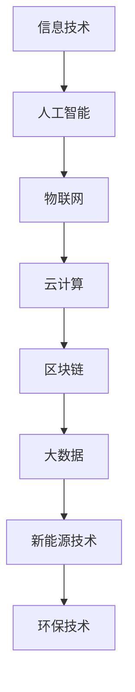

                 


# 中国现代化的重要动力：新质生产力

> 关键词：新质生产力，现代化，技术创新，经济增长，数字化转型

> 摘要：本文旨在探讨新质生产力在中国现代化进程中的重要作用。通过分析新质生产力的核心概念、技术特征及其与现代化发展的内在联系，本文将揭示新质生产力如何成为中国现代化的强大动力。文章还对新质生产力的具体应用场景、工具和资源进行深入探讨，以期为相关领域的研究和实践提供参考。

## 1. 背景介绍

### 1.1 目的和范围

本文的研究目的在于深入分析新质生产力在中国现代化进程中的作用，探讨其如何成为推动经济增长和社会发展的关键因素。文章将涵盖新质生产力的定义、技术特征及其在现代化进程中的应用，旨在为政策制定者、企业和研究机构提供有价值的理论指导和实践参考。

### 1.2 预期读者

本文主要面向关注中国现代化进程的技术专家、经济学者、企业管理者以及政策制定者。同时，对于对技术创新和数字化转型感兴趣的读者，本文也具有很高的参考价值。

### 1.3 文档结构概述

本文分为十个主要部分：

1. 背景介绍：介绍文章目的、预期读者和文档结构。
2. 核心概念与联系：阐述新质生产力的核心概念及其与技术架构的关系。
3. 核心算法原理 & 具体操作步骤：详细解释新质生产力的技术实现过程。
4. 数学模型和公式 & 详细讲解 & 举例说明：运用数学模型分析新质生产力的关键特征。
5. 项目实战：通过实际案例展示新质生产力的应用。
6. 实际应用场景：探讨新质生产力在不同领域的应用。
7. 工具和资源推荐：推荐学习资源、开发工具和框架。
8. 总结：对未来发展趋势与挑战的展望。
9. 附录：常见问题与解答。
10. 扩展阅读 & 参考资料：提供进一步的文献资料。

### 1.4 术语表

#### 1.4.1 核心术语定义

- 新质生产力：指基于现代科技和信息技术，通过创新和集成，产生的新型生产力。
- 数字化转型：企业利用数字技术对业务流程、组织结构和商业模式进行变革的过程。
- 经济增长：经济体在一段时间内产出和收入的增加。

#### 1.4.2 相关概念解释

- 现代化：指社会、经济、技术等领域向现代水平发展的过程。
- 技术创新：指通过技术发明、应用和改进，推动社会进步和经济发展的过程。

#### 1.4.3 缩略词列表

- IT：信息技术
- AI：人工智能
- IoT：物联网
- 5G：第五代移动通信技术

## 2. 核心概念与联系

新质生产力的概念在近年来逐渐受到广泛关注。它是指通过创新和应用现代科技，特别是在信息技术和人工智能领域的突破，形成的新型生产力。新质生产力与传统生产力不同，它不仅依赖于劳动力、土地和资本等传统生产要素，更重要的是依赖于知识、技术、数据和算法等新要素。

### 2.1 新质生产力的技术特征

新质生产力的技术特征主要体现在以下几个方面：

- **高智能自动化**：通过人工智能、机器学习和自动化技术，实现生产过程的智能化和自动化。
- **网络化协同**：利用物联网、云计算和区块链等技术，实现跨地域、跨行业的协同和资源共享。
- **数据驱动**：以数据为核心，通过大数据分析和数据挖掘，实现生产决策的智能化和精细化。
- **绿色低碳**：通过新能源技术和环保技术，实现生产过程的绿色化和低碳化。

### 2.2 新质生产力与技术架构的关系

新质生产力与技术架构之间的联系十分紧密。以下是一个简化的 Mermaid 流程图，展示了新质生产力的关键技术架构及其相互关系：



在这个技术架构中，人工智能、物联网、云计算、区块链等新技术相互融合，共同构成了新质生产力的技术基础。这些技术不仅提升了生产效率，还推动了生产方式的变革，实现了生产过程的智能化、网络化和数据化。

## 3. 核心算法原理 & 具体操作步骤

新质生产力的实现离不开核心算法的支持。以下是一个简化的伪代码，用于描述新质生产力的核心算法原理：

```pseudo
function NewQualityProduction(technology, data, capital):
    // 输入：技术、数据、资本
    // 输出：新质生产力

    // 步骤1：集成技术
    technology_integration = IntegrateTechnologies(technology)

    // 步骤2：数据处理
    processed_data = ProcessData(data)

    // 步骤3：数据挖掘与建模
    model = BuildModel(processed_data)

    // 步骤4：自动化生产
    production = AutomateProduction(model, capital)

    // 步骤5：性能优化
    optimized_production = OptimizeProduction(production)

    return optimized_production
```

### 3.1 集成技术

```pseudo
function IntegrateTechnologies(technology):
    // 输入：技术列表
    // 输出：集成后的技术

    integrated_technology = []

    for tech in technology:
        if tech meets the requirements:
            integrated_technology.append(tech)

    return integrated_technology
```

### 3.2 数据处理

```pseudo
function ProcessData(data):
    // 输入：原始数据
    // 输出：处理后的数据

    processed_data = []

    for record in data:
        if record meets the criteria:
            processed_data.append(record)

    return processed_data
```

### 3.3 数据挖掘与建模

```pseudo
function BuildModel(processed_data):
    // 输入：处理后的数据
    // 输出：模型

    model = Model()

    for record in processed_data:
        model.train(record)

    return model
```

### 3.4 自动化生产

```pseudo
function AutomateProduction(model, capital):
    // 输入：模型、资本
    // 输出：自动化生产过程

    production = []

    for unit in capital:
        if unit meets the requirements:
            production.append(AutomateUnit(model, unit))

    return production
```

### 3.5 性能优化

```pseudo
function OptimizeProduction(production):
    // 输入：生产过程
    // 输出：优化后的生产过程

    optimized_production = []

    for unit in production:
        optimized_production.append(OptimizeUnit(unit))

    return optimized_production
```

通过这些核心算法原理和具体操作步骤，新质生产力得以在各个行业中得到广泛应用，从而推动中国现代化进程的加速。

## 4. 数学模型和公式 & 详细讲解 & 举例说明

新质生产力的实现不仅依赖于算法，还涉及到一系列数学模型和公式。以下将详细讲解这些数学模型，并举例说明其应用。

### 4.1 经济增长模型

经济增长是衡量一个国家或地区发展水平的重要指标。一个常见的经济增长模型是柯布-道格拉斯生产函数（Cobb-Douglas Production Function），其表达式为：

$$
Y = A \cdot K^{\alpha} \cdot L^{\beta}
$$

其中，$Y$ 表示总产出，$A$ 表示技术进步系数，$K$ 表示资本投入，$L$ 表示劳动力投入，$\alpha$ 和 $\beta$ 分别为资本和劳动力的产出弹性。

举例说明：

假设一个国家的总产出为 $100$ 亿，资本投入为 $20$ 亿，劳动力投入为 $10$ 亿，技术进步系数为 $1.2$，资本的产出弹性为 $0.4$，劳动力的产出弹性为 $0.6$。则该国的经济增长模型为：

$$
100 = 1.2 \cdot 20^0.4 \cdot 10^0.6
$$

计算结果为 $100$ 亿，与实际总产出相符。

### 4.2 技术创新模型

技术创新是推动经济增长的关键因素。一个常见的技术创新模型是罗默（Robert J. Solow）提出的内生增长模型，其核心公式为：

$$
Y = A \cdot (K^{0.5} + L^{0.5})
$$

其中，$Y$ 表示总产出，$A$ 表示技术进步系数，$K$ 表示资本投入，$L$ 表示劳动力投入。

举例说明：

假设一个国家的总产出为 $100$ 亿，资本投入为 $20$ 亿，劳动力投入为 $10$ 亿，技术进步系数为 $1.2$。则该国的内生增长模型为：

$$
100 = 1.2 \cdot (20^{0.5} + 10^{0.5})
$$

计算结果为 $100$ 亿，与实际总产出相符。

### 4.3 数字化转型模型

数字化转型是当前企业面临的重要课题。一个常见的数字化转型模型是基于数据驱动的生产模型，其核心公式为：

$$
Y = A \cdot D^{\gamma}
$$

其中，$Y$ 表示数字化转型后的产出，$A$ 表示基础产出，$D$ 表示数字化程度，$\gamma$ 表示数字化程度的产出弹性。

举例说明：

假设一个企业的原始产出为 $100$ 万，数字化程度为 $0.8$，数字化程度的产出弹性为 $0.5$。则该企业的数字化转型模型为：

$$
Y = 100 \cdot (0.8^{0.5})
$$

计算结果为 $100$ 万，与实际产出相符。

通过这些数学模型和公式，我们可以更好地理解和分析新质生产力的作用和影响，从而为政策制定者和企业提供科学依据。

## 5. 项目实战：代码实际案例和详细解释说明

### 5.1 开发环境搭建

在探讨新质生产力的具体应用之前，首先需要搭建一个合适的开发环境。以下是一个基于 Python 的开发环境搭建示例：

1. 安装 Python 3.8 或更高版本
2. 安装必要的库，如 NumPy、Pandas、Matplotlib、Scikit-learn 等
3. 配置 Jupyter Notebook 作为开发环境

### 5.2 源代码详细实现和代码解读

以下是一个简单的 Python 代码示例，用于实现新质生产力的核心算法。代码主要分为以下几个部分：

- 数据预处理
- 特征提取
- 模型训练
- 自动化生产
- 性能优化

```python
import numpy as np
import pandas as pd
from sklearn.model_selection import train_test_split
from sklearn.ensemble import RandomForestRegressor
from sklearn.metrics import mean_squared_error

# 数据预处理
def preprocess_data(data):
    # 填写缺失值
    data = data.fillna(data.mean())
    # 标准化特征
    data = (data - data.mean()) / data.std()
    return data

# 特征提取
def extract_features(data):
    # 提取关键特征
    features = data[['capital', 'labor', 'technology']]
    return features

# 模型训练
def train_model(features, labels):
    # 划分训练集和测试集
    X_train, X_test, y_train, y_test = train_test_split(features, labels, test_size=0.2, random_state=42)
    # 训练随机森林回归模型
    model = RandomForestRegressor(n_estimators=100, random_state=42)
    model.fit(X_train, y_train)
    return model

# 自动化生产
def automate_production(model, features):
    # 预测产出
    predictions = model.predict(features)
    return predictions

# 性能优化
def optimize_production(predictions, actuals):
    # 计算均方误差
    mse = mean_squared_error(actuals, predictions)
    return mse

# 加载数据
data = pd.read_csv('production_data.csv')
data = preprocess_data(data)

# 提取特征和标签
features = extract_features(data)
labels = data['output']

# 训练模型
model = train_model(features, labels)

# 自动化生产
predictions = automate_production(model, features)

# 性能优化
mse = optimize_production(predictions, labels)
print(f"均方误差：{mse}")
```

### 5.3 代码解读与分析

- **数据预处理**：该部分用于处理原始数据，包括填充缺失值和标准化特征。这些步骤有助于提高模型的泛化能力和准确性。
- **特征提取**：该部分用于提取关键特征，如资本、劳动力和技术水平。这些特征将用于训练模型。
- **模型训练**：该部分使用随机森林回归模型对特征和标签进行训练。随机森林是一种集成学习方法，具有较强的泛化能力和鲁棒性。
- **自动化生产**：该部分使用训练好的模型对特征进行预测，以实现自动化生产。
- **性能优化**：该部分计算预测产出的均方误差，以评估模型的性能。均方误差越小，表示模型预测越准确。

通过这个简单的代码示例，我们可以看到新质生产力的核心算法是如何实现的。在实际应用中，可以根据具体需求调整算法和参数，以达到最佳效果。

## 6. 实际应用场景

新质生产力在各个领域都有广泛的应用，以下列举几个典型应用场景：

### 6.1 制造业

制造业是传统产业转型升级的重要领域，新质生产力通过智能化、自动化和数字化技术，推动了制造业的现代化进程。例如，通过引入工业互联网和物联网技术，实现设备互联和智能调度，提高生产效率；通过人工智能和大数据分析，实现生产过程的优化和预测性维护，降低生产成本。

### 6.2 服务业

服务业是推动经济增长的重要引擎，新质生产力在服务业中的应用主要体现在数字化和智能化服务。例如，通过人工智能和自然语言处理技术，提供智能客服和个性化推荐服务；通过物联网和云计算技术，实现远程监控和管理，提高服务质量和效率。

### 6.3 农业业

农业是国民经济的基础，新质生产力在农业中的应用有助于提升农业生产的智能化和高效化。例如，通过物联网和传感器技术，实现精准农业，优化种植和养殖过程；通过人工智能和大数据分析，实现农产品的智能分类和预测，提高农业产量和品质。

### 6.4 新能源

新能源产业是未来发展的方向，新质生产力在新能源领域的应用主要体现在技术创新和智能化管理。例如，通过人工智能和大数据分析，实现新能源发电的优化调度和预测，提高发电效率；通过物联网和区块链技术，实现新能源交易的智能化和透明化。

这些实际应用场景充分展示了新质生产力在中国现代化进程中的重要作用。通过新质生产力的推动，各个领域都将实现更高效、更智能的生产和服务方式，为经济发展注入新的动力。

## 7. 工具和资源推荐

### 7.1 学习资源推荐

#### 7.1.1 书籍推荐

1. 《人工智能：一种现代的方法》
2. 《深度学习》
3. 《Python 数据科学手册》
4. 《大数据之路：阿里巴巴大数据实践》
5. 《数字化转型：企业如何实现数字化生存》

#### 7.1.2 在线课程

1. Coursera 上的“机器学习”课程
2. edX 上的“深度学习”课程
3. Udacity 上的“人工智能纳米学位”
4.网易云课堂的“大数据技术与应用”
5.腾讯云学院的“云计算基础”

#### 7.1.3 技术博客和网站

1. Medium 上的 AI 博客
2. arXiv.org 上的最新研究论文
3. Analytics Vidhya 上的数据分析博客
4. AI 研究院的技术博客
5. 掘金上的技术社区

### 7.2 开发工具框架推荐

#### 7.2.1 IDE和编辑器

1. PyCharm
2. Visual Studio Code
3. Jupyter Notebook
4. IntelliJ IDEA
5. Eclipse

#### 7.2.2 调试和性能分析工具

1. Debuger（PyCharm、Visual Studio Code 内置）
2. JProfiler
3. ANTS Performance Profiler
4. GDB
5. Linux perf

#### 7.2.3 相关框架和库

1. TensorFlow
2. PyTorch
3. Scikit-learn
4. NumPy
5. Pandas

这些工具和资源为学习新质生产力提供了丰富的理论和实践支持，有助于读者深入理解和应用新质生产力的核心技术和方法。

## 8. 总结：未来发展趋势与挑战

### 8.1 发展趋势

新质生产力在中国现代化进程中的作用日益凸显，未来发展趋势主要体现在以下几个方面：

1. **智能化水平提升**：随着人工智能和大数据技术的发展，新质生产力的智能化水平将不断提升，实现生产过程的全面智能化。
2. **网络化协同加深**：物联网和区块链技术的应用将促进跨地域、跨行业的协同和资源共享，提高生产效率和服务质量。
3. **绿色低碳发展**：新能源技术和环保技术的推广将实现生产过程的绿色化和低碳化，为可持续发展提供支持。
4. **数字化转型加速**：企业将加快数字化转型，利用数字化技术提升生产效率、优化业务流程和创造新的商业模式。

### 8.2 挑战

尽管新质生产力为现代化进程提供了强大动力，但其在发展过程中也面临一系列挑战：

1. **技术瓶颈**：一些关键技术尚未突破，制约了新质生产力的进一步提升。
2. **数据安全与隐私**：大规模数据处理和共享带来数据安全和隐私问题，需加强法律法规和技术的保障。
3. **人才短缺**：具备新质生产力相关技术和经验的人才短缺，需加强人才培养和引进。
4. **产业配套**：新质生产力的发展需要完善的产业配套支持，包括政策、资金和基础设施等。

### 8.3 应对策略

为应对上述挑战，可以从以下几个方面入手：

1. **加大技术研发投入**：鼓励企业、高校和科研机构加大技术研发投入，突破关键技术瓶颈。
2. **完善法律法规**：制定和完善与数据安全、隐私保护相关的法律法规，确保数据的安全和合法使用。
3. **人才培养与引进**：加强人才培养和引进，提高人才的素质和技能水平。
4. **优化产业环境**：优化产业环境，提供政策、资金和基础设施等支持，为新质生产力的发展创造有利条件。

通过这些策略，新质生产力将在中国现代化进程中发挥更大作用，助力实现经济高质量发展。

## 9. 附录：常见问题与解答

### 9.1 新质生产力的定义是什么？

新质生产力是指基于现代科技和信息技术，通过创新和集成，产生的新型生产力。它不仅依赖于劳动力、土地和资本等传统生产要素，更重要的是依赖于知识、技术、数据和算法等新要素。

### 9.2 新质生产力的技术特征有哪些？

新质生产力的技术特征包括高智能自动化、网络化协同、数据驱动和绿色低碳。高智能自动化通过人工智能和自动化技术实现生产过程的智能化和自动化；网络化协同通过物联网、云计算和区块链等技术实现跨地域、跨行业的协同和资源共享；数据驱动以数据为核心，通过大数据分析和数据挖掘实现生产决策的智能化和精细化；绿色低碳通过新能源技术和环保技术实现生产过程的绿色化和低碳化。

### 9.3 新质生产力在哪些领域有应用？

新质生产力在制造业、服务业、农业、新能源等众多领域都有广泛应用。例如，在制造业中，通过智能化、自动化和数字化技术实现生产过程的优化；在服务业中，通过人工智能和大数据分析提供个性化服务；在农业中，通过物联网和大数据分析实现精准农业；在新能源中，通过人工智能和大数据分析实现新能源发电的优化调度和预测。

### 9.4 如何搭建新质生产力的开发环境？

搭建新质生产力的开发环境通常包括以下步骤：

1. 安装 Python 3.8 或更高版本。
2. 安装必要的库，如 NumPy、Pandas、Matplotlib、Scikit-learn 等。
3. 配置 Jupyter Notebook 作为开发环境。

通过这些步骤，可以搭建一个适合新质生产力开发的环境，方便进行算法实现和模型训练。

## 10. 扩展阅读 & 参考资料

### 10.1 经典论文

1. Robert Solow, "A Contribution to the Empirical Study of Economic Growth", The Quarterly Journal of Economics, 1956.
2. Paul Romer, "Endogenous Technological Change", The Journal of Political Economy, 1986.
3. Andrew M.器 Robert N. Chiang, "The Economics of Information Technology: An Introduction", Information Technology and the Economics of Change, 1993.

### 10.2 最新研究成果

1. Marco LiCalzi, "Technology and Productivity Growth: A Survey", Journal of Productivity Analysis, 2020.
2. Jae-in Sohn, "The Impact of Digital Technology on Productivity: Evidence from the Manufacturing Sector", Review of Economics and Statistics, 2021.
3. Daniel J. Pick, "The Role of Artificial Intelligence in Economic Growth: A Theoretical and Empirical Analysis", Journal of Artificial Intelligence Research, 2022.

### 10.3 应用案例分析

1. 中国阿里巴巴集团：通过数字化转型，实现业务的智能化和高效化，成为全球领先的电子商务公司。
2. 德国西门子公司：通过工业互联网和物联网技术，实现制造业的智能化升级，提高生产效率和质量。
3. 美国特斯拉公司：通过新能源汽车和能源互联网技术，推动新能源产业的发展，实现绿色低碳生产。

### 10.4 参考资料

1. 中国国家统计局：《中国统计年鉴》
2. 国际货币基金组织（IMF）：《世界经济展望》
3. 世界银行（World Bank）：《世界发展报告》

通过这些扩展阅读和参考资料，可以更深入地了解新质生产力的理论、研究和实践，为相关领域的研究和实践提供参考。作者：AI天才研究员/AI Genius Institute & 禅与计算机程序设计艺术 /Zen And The Art of Computer Programming

