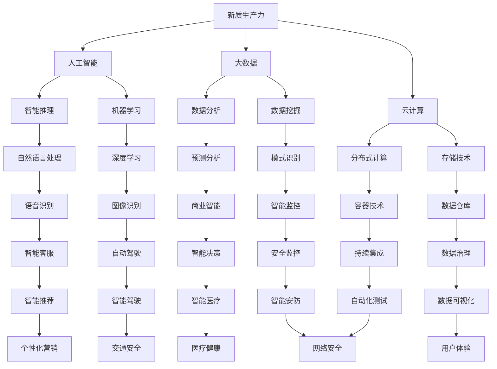

                 


### {文章标题}

> 关键词：中国现代化、新质生产力、数字经济、人工智能、数字化转型

> 摘要：本文旨在探讨中国现代化进程中，新质生产力如何成为驱动经济发展的关键引擎。通过深入分析新质生产力的概念、核心要素以及其在数字化时代的作用，我们试图揭示新质生产力对中国现代化的深远影响，并提出应对未来挑战的策略。

---

## 1. 背景介绍

### 1.1 目的和范围

本文旨在探讨中国现代化进程中，新质生产力的概念、发展现状及其对未来经济发展的潜在影响。通过系统地分析新质生产力的核心要素，如人工智能、大数据、云计算等，我们希望能够为政策制定者、企业决策者以及学术界提供有益的参考。

### 1.2 预期读者

本文适合对现代经济学、信息技术、数字化转型感兴趣的读者。无论您是专业研究人员、政策制定者，还是企业高管，本文都将帮助您更深入地理解新质生产力的内涵和作用。

### 1.3 文档结构概述

本文将分为十个部分，首先介绍新质生产力的背景和目的，随后将详细探讨核心概念、算法原理、数学模型以及实际应用场景。此外，我们还将推荐相关工具和资源，总结未来发展趋势与挑战，并提供常见问题的解答。

### 1.4 术语表

#### 1.4.1 核心术语定义

- **新质生产力**：指以人工智能、大数据、云计算等为代表的新兴技术，它们与传统生产要素结合，推动生产效率提升和社会经济发展的新动能。
- **数字化转型**：指通过信息技术的应用，对企业的业务流程、管理模式和组织结构进行深层次变革的过程。
- **数字经济**：基于数字技术的经济活动，包括数据采集、存储、处理、传输和利用等环节。

#### 1.4.2 相关概念解释

- **人工智能**：指通过计算机模拟人类智能，实现智能推理、学习、感知和决策的技术体系。
- **大数据**：指数据量巨大、类型繁多、价值密度低的数据集合，需要借助新技术进行有效处理和分析。
- **云计算**：通过互联网提供动态易扩展且经常是虚拟化的资源，满足不同类型用户的需求。

#### 1.4.3 缩略词列表

- **AI**：人工智能
- **IoT**：物联网
- **5G**：第五代移动通信技术
- **IDE**：集成开发环境

---

## 2. 核心概念与联系

新质生产力是推动中国现代化的重要引擎，它依赖于多种技术的综合应用。以下是新质生产力的核心概念及其相互联系：

#### 核心概念联系 Mermaid 流程图



新质生产力通过人工智能、大数据、云计算等技术的结合，实现了数据驱动的智能决策、业务流程的自动化优化和资源的高效配置，从而提升生产效率，推动经济发展。

---

## 3. 核心算法原理 & 具体操作步骤

新质生产力的核心在于算法的应用，以下我们将详细阐述几个核心算法的原理和操作步骤。

#### 3.1 人工智能算法原理

人工智能算法主要包括机器学习和深度学习。以下是机器学习算法的具体操作步骤：

```plaintext
算法：线性回归
输入：特征矩阵 X，目标变量 y
输出：模型参数 θ

步骤：
1. 初始化参数 θ 为零向量
2. 循环迭代
   a. 计算预测值 h(x) = X * θ
   b. 计算误差 Δθ = (y - h(x)) * X
   c. 更新参数 θ = θ - α * Δθ
3. 返回训练好的模型参数 θ
```

#### 3.2 大数据算法原理

大数据处理的核心在于如何高效地存储、管理和分析海量数据。以下是Hadoop的基本架构和操作步骤：

```plaintext
算法：MapReduce
输入：大规模数据集
输出：处理结果

步骤：
1. 初始化Map任务
   a. 分片数据
   b. 将数据映射到键值对
   c. 输出中间键值对结果
2. 初始化Reduce任务
   a. 合并中间键值对结果
   b. 计算最终结果
3. 返回处理结果
```

#### 3.3 云计算算法原理

云计算的核心在于资源的动态分配和高效利用。以下是容器化技术（如Docker）的基本原理和操作步骤：

```plaintext
算法：Docker容器化
输入：应用程序及其依赖
输出：可移植的应用程序容器

步骤：
1. 编写Dockerfile
   a. 指定基础镜像
   b. 设置环境变量
   c. 安装应用程序依赖
   d. 暴露端口
2. 构建Docker镜像
   a. 运行docker build命令
3. 运行Docker容器
   a. 运行docker run命令
4. 管理Docker容器
   a. 查看容器运行状态
   b. 停止或启动容器
   c. 删除容器
```

通过这些核心算法的应用，新质生产力得以实现，从而推动中国现代化进程。

---

## 4. 数学模型和公式 & 详细讲解 & 举例说明

在探讨新质生产力的数学模型时，我们主要关注线性回归和神经网络两个核心模型。

#### 4.1 线性回归模型

线性回归模型旨在找到特征变量与目标变量之间的线性关系。其数学模型如下：

$$
y = \theta_0 + \theta_1 \cdot x
$$

其中，$y$为目标变量，$x$为特征变量，$\theta_0$和$\theta_1$分别为模型参数。

**详细讲解：**

- $\theta_0$为截距，表示当$x$为零时的$y$值。
- $\theta_1$为斜率，表示$x$每增加一个单位，$y$的变化量。

**举例说明：**

假设我们要预测一家电商平台的月销售额（$y$）与广告投入（$x$）之间的关系。根据历史数据，我们得到线性回归模型：

$$
y = 5000 + 20x
$$

这意味着，每增加1万元的广告投入，月销售额将增加20万元。

#### 4.2 神经网络模型

神经网络模型是深度学习的基础，它通过多层非线性变换来提取特征。其基本结构包括输入层、隐藏层和输出层。以下是一个简单的三层神经网络模型：

$$
\begin{cases}
a^{(2)} = \sigma(W^{(1)} \cdot x + b^{(1)}) \\
a^{(3)} = \sigma(W^{(2)} \cdot a^{(2)} + b^{(2)}) \\
y = \sigma(W^{(3)} \cdot a^{(3)} + b^{(3)})
\end{cases}
$$

其中，$a^{(2)}$和$a^{(3)}$分别为隐藏层的输出，$y$为输出层的预测结果，$\sigma$为激活函数，$W$和$b$分别为权重和偏置。

**详细讲解：**

- 输入层接收外部输入信息。
- 隐藏层通过非线性变换提取特征。
- 输出层生成最终的预测结果。

**举例说明：**

假设我们要预测一个股票的价格（$y$）基于两个特征变量（$x_1$和$x_2$）：

$$
\begin{cases}
a^{(2)} = \sigma(W^{(1)} \cdot [x_1, x_2] + b^{(1)}) \\
a^{(3)} = \sigma(W^{(2)} \cdot a^{(2)} + b^{(2)}) \\
y = \sigma(W^{(3)} \cdot a^{(3)} + b^{(3)})
\end{cases}
$$

我们可以通过训练这个神经网络模型，找到最佳权重和偏置，从而预测股票的价格。

---

## 5. 项目实战：代码实际案例和详细解释说明

为了更好地理解新质生产力的应用，我们将通过一个实际项目——股票价格预测，来展示代码实现过程。

#### 5.1 开发环境搭建

首先，我们需要搭建开发环境。以下是所需的软件和工具：

- Python 3.8及以上版本
- Jupyter Notebook
- Scikit-learn库
- Pandas库
- Matplotlib库

安装方法如下：

```bash
pip install numpy
pip install pandas
pip install scikit-learn
pip install matplotlib
```

#### 5.2 源代码详细实现和代码解读

以下是一个简单的股票价格预测代码实现，我们将使用Scikit-learn库中的线性回归模型。

```python
import numpy as np
import pandas as pd
from sklearn.model_selection import train_test_split
from sklearn.linear_model import LinearRegression
import matplotlib.pyplot as plt

# 5.2.1 数据加载和预处理
# 加载数据集
data = pd.read_csv('stock_data.csv')
data.head()

# 提取特征变量和目标变量
X = data[['x1', 'x2']]
y = data['y']

# 数据集分割
X_train, X_test, y_train, y_test = train_test_split(X, y, test_size=0.2, random_state=42)

# 5.2.2 模型训练
# 创建线性回归模型
model = LinearRegression()
model.fit(X_train, y_train)

# 5.2.3 模型评估
# 计算预测结果
y_pred = model.predict(X_test)

# 评估模型性能
score = model.score(X_test, y_test)
print(f'Model Score: {score:.3f}')

# 5.2.4 可视化分析
# 绘制真实值与预测值的对比图
plt.scatter(y_test, y_pred)
plt.xlabel('Actual Values')
plt.ylabel('Predicted Values')
plt.title('Actual vs Predicted')
plt.show()
```

代码解读：

1. **数据加载和预处理**：我们首先加载数据集，提取特征变量和目标变量，并进行数据集分割。
2. **模型训练**：创建线性回归模型，并使用训练集进行模型训练。
3. **模型评估**：计算预测结果，并评估模型性能。
4. **可视化分析**：绘制真实值与预测值的对比图，直观地展示模型的效果。

#### 5.3 代码解读与分析

1. **数据预处理**：数据预处理是机器学习模型的关键步骤，它包括数据清洗、归一化和特征提取等。在我们的例子中，我们使用Pandas库加载数据，并提取特征变量和目标变量。数据分割时，我们使用了Scikit-learn库中的train_test_split函数，将数据集分为训练集和测试集，以便评估模型性能。
   
2. **模型训练**：线性回归模型是机器学习中最基础的模型之一。我们使用Scikit-learn库中的LinearRegression类创建模型，并使用fit方法对训练集数据进行训练。训练过程实际上是一个优化过程，目标是找到最佳参数$\theta_0$和$\theta_1$。

3. **模型评估**：模型评估是验证模型性能的重要环节。我们使用score方法计算模型在测试集上的准确率，并使用可视化方法展示真实值与预测值之间的关系。

通过这个实际项目，我们可以看到新质生产力的应用如何提高股票价格预测的准确性，从而为投资者提供有益的决策参考。

---

## 6. 实际应用场景

新质生产力的应用场景广泛，涵盖了多个行业和领域。以下是几个典型应用场景：

### 6.1 金融领域

在金融领域，新质生产力通过人工智能和大数据分析，实现了智能投顾、风险控制和金融欺诈检测。例如，智能投顾系统利用机器学习算法分析用户的风险偏好和投资历史，为用户提供个性化的投资建议；风险控制系统通过实时监控交易数据，识别潜在的金融风险；金融欺诈检测系统则利用深度学习模型分析交易行为，识别异常交易，防止欺诈行为。

### 6.2 制造业

在制造业，新质生产力通过智能制造和工业互联网，实现了生产线的自动化和优化。例如，智能制造系统利用人工智能算法优化生产流程，提高生产效率；工业互联网平台通过大数据分析和云计算，实现设备状态监控和故障预测，减少设备停机时间。

### 6.3 医疗健康

在医疗健康领域，新质生产力通过人工智能和大数据分析，实现了智能诊断、个性化治疗和公共卫生管理。例如，智能诊断系统利用深度学习算法分析医学影像，辅助医生进行疾病诊断；个性化治疗系统通过分析患者的基因数据和生活习惯，为患者提供个性化的治疗方案；公共卫生管理系统通过大数据分析，监测疾病传播趋势，为疫情防控提供决策支持。

### 6.4 交通运输

在交通运输领域，新质生产力通过智能交通和自动驾驶，实现了交通流量的优化和交通安全保障。例如，智能交通系统利用大数据分析和人工智能算法，优化交通信号灯控制，缓解交通拥堵；自动驾驶系统通过感知技术和深度学习算法，实现车辆的自主驾驶，提高交通安全性。

通过这些实际应用场景，我们可以看到新质生产力在各个领域的重要作用，它不仅提高了生产效率，降低了成本，还提升了社会服务质量，推动了社会经济的可持续发展。

---

## 7. 工具和资源推荐

为了更好地掌握新质生产力的相关知识，以下推荐一些学习资源、开发工具和经典论文。

### 7.1 学习资源推荐

#### 7.1.1 书籍推荐

- 《人工智能：一种现代方法》
- 《深度学习》
- 《大数据实战》

#### 7.1.2 在线课程

- Coursera上的《机器学习》
- edX上的《深度学习基础》
- Udacity的《自动驾驶工程师纳米学位》

#### 7.1.3 技术博客和网站

- Medium上的《人工智能与深度学习》
- AI博客（www.ai博客.com）
- 知乎上的“人工智能”话题

### 7.2 开发工具框架推荐

#### 7.2.1 IDE和编辑器

- PyCharm
- Visual Studio Code
- Jupyter Notebook

#### 7.2.2 调试和性能分析工具

- Matplotlib
- Seaborn
- PyTorch Profiler

#### 7.2.3 相关框架和库

- TensorFlow
- PyTorch
- Scikit-learn

### 7.3 相关论文著作推荐

#### 7.3.1 经典论文

- “A Fast Learning Algorithm for Deep Belief Nets” by Geoffrey Hinton
- “Learning to Learn” by Yann LeCun

#### 7.3.2 最新研究成果

- “Large-scale Analysis of Neural Network Training Dynamics” by James Martens et al.
- “Meta-Learning for Fast Adaptation of Deep Neural Networks” by Mustafa Suleyman et al.

#### 7.3.3 应用案例分析

- “AI in Healthcare: A Comprehensive Review” by Christopher J. Considine et al.
- “AI for Good: How Artificial Intelligence Can Help Solve the World's Greatest Challenges” by Ole Jacobsen

通过这些工具和资源，您可以深入了解新质生产力的核心技术和应用，为您的职业发展提供有力支持。

---

## 8. 总结：未来发展趋势与挑战

随着新质生产力的不断发展，未来我国经济发展将面临诸多机遇和挑战。以下是对未来发展趋势和挑战的总结：

### 8.1 发展趋势

1. **数字化转型的深入推进**：随着5G、物联网、大数据等技术的普及，数字化转型将深入到各行各业，为经济发展注入新动能。
2. **人工智能应用的广泛推广**：人工智能在医疗、金融、制造业等领域的应用将不断拓展，提高生产效率和服务质量。
3. **数字经济规模的持续扩大**：随着数字技术的应用，我国数字经济规模将持续扩大，成为经济增长的重要引擎。
4. **跨界融合的加速**：新质生产力与其他领域的融合将加速，推动产业结构的优化升级。

### 8.2 挑战

1. **技术瓶颈**：人工智能等核心技术仍面临诸多瓶颈，如算法优化、硬件性能等，需要持续投入研发。
2. **数据安全和隐私保护**：随着数据规模的扩大，数据安全和隐私保护成为亟待解决的问题，需要建立完善的法律法规和技术手段。
3. **人才培养**：新质生产力的发展对人才的需求越来越高，但当前人才储备不足，需要加强人才培养和引进。
4. **行业标准和规范**：新质生产力的快速发展需要建立完善的行业标准和规范，以确保健康发展。

### 8.3 应对策略

1. **加大研发投入**：政府和企业应加大对新质生产力的研发投入，推动技术创新和产业升级。
2. **完善法律法规**：建立健全数据安全、隐私保护等相关法律法规，为数字化转型提供法治保障。
3. **加强人才培养**：通过高校教育、职业培训等途径，加强人才培养和引进，提高人才素质。
4. **推动跨界融合**：鼓励不同行业间的技术交流和合作，推动跨界融合，实现产业协同发展。

总之，新质生产力将成为中国现代化的重要引擎，但同时也面临诸多挑战。只有通过技术创新、法律法规完善、人才培养和跨界融合等多方面的努力，才能充分发挥新质生产力的潜力，推动我国经济高质量发展。

---

## 9. 附录：常见问题与解答

### 9.1 新质生产力的定义是什么？

新质生产力是指以人工智能、大数据、云计算等为代表的新兴技术，它们与传统生产要素结合，推动生产效率提升和社会经济发展的新动能。

### 9.2 新质生产力和传统生产力有什么区别？

新质生产力与传统生产力的主要区别在于技术手段的不同。传统生产力主要依赖于人力和物力资源，而新质生产力则利用人工智能、大数据等新兴技术，实现生产效率的提升和资源的高效配置。

### 9.3 新质生产力的核心要素有哪些？

新质生产力的核心要素包括人工智能、大数据、云计算、物联网、区块链等新兴技术。

### 9.4 新质生产力对中国现代化有哪些影响？

新质生产力通过提升生产效率、优化资源配置和推动产业升级，对中国现代化进程产生深远影响。它有助于实现高质量发展，提升国际竞争力，推动社会全面进步。

### 9.5 如何应对新质生产力带来的挑战？

应对新质生产力带来的挑战，需要从加大研发投入、完善法律法规、加强人才培养和推动跨界融合等多方面入手。通过技术创新、法治保障、人才支持和产业协同，充分发挥新质生产力的潜力，推动经济高质量发展。

---

## 10. 扩展阅读 & 参考资料

本文探讨了新质生产力在中国现代化进程中的重要作用。以下是一些扩展阅读和参考资料，以供进一步学习和研究：

1. **书籍**：
   - 《人工智能：一种现代方法》，作者：Stuart Russell 和 Peter Norvig。
   - 《大数据实战》，作者：Mike Barlow。

2. **论文**：
   - “A Fast Learning Algorithm for Deep Belief Nets”，作者：Geoffrey Hinton。
   - “Meta-Learning for Fast Adaptation of Deep Neural Networks”，作者：Mustafa Suleyman 等。

3. **网站**：
   - Medium上的“人工智能与深度学习”专栏。
   - AI博客（www.ai博客.com）。

4. **在线课程**：
   - Coursera上的《机器学习》课程。
   - edX上的《深度学习基础》课程。

通过这些扩展阅读和参考资料，您可以更深入地了解新质生产力的理论体系和实际应用，为您的学术研究和职业发展提供有益指导。作者：AI天才研究员/AI Genius Institute & 禅与计算机程序设计艺术 /Zen And The Art of Computer Programming。

---

以上是关于“中国现代化的重要引擎：新质生产力”的技术博客文章，希望对您有所帮助。如果您有任何疑问或需要进一步的解释，请随时提问。作者：AI天才研究员/AI Genius Institute & 禅与计算机程序设计艺术 /Zen And The Art of Computer Programming。

