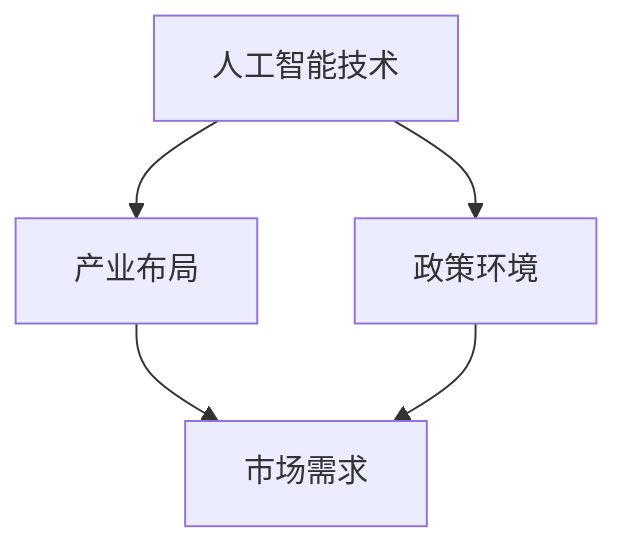

                 

# 中国进入AI经济周期的机遇与挑战

> 关键词：人工智能，AI经济，机遇，挑战，发展战略，技术进步，行业应用，政策环境

> 摘要：随着人工智能技术的迅猛发展，中国正加速进入AI经济周期。本文将分析中国在这一新兴经济领域中所面临的机遇与挑战，探讨其在技术、政策、产业等多个维度的发展路径，并提出相应的战略建议。

## 1. 背景介绍

### 1.1 目的和范围

本文旨在分析中国进入AI经济周期的现状，探讨其所面临的机遇与挑战，并为其未来发展提供战略建议。本文将涵盖以下几个主要方面：

1. **AI经济的概念与定义**：阐述AI经济的内涵及其与数字经济、智能经济的区别。
2. **中国AI产业的发展现状**：分析中国在AI技术、政策环境、产业布局等方面的现状。
3. **机遇与挑战**：具体探讨中国在AI经济周期中所面临的机遇与挑战。
4. **发展战略**：提出中国在AI经济领域的发展战略与政策建议。

### 1.2 预期读者

本文面向对人工智能与数字经济感兴趣的读者，包括：

1. **政府政策制定者**：了解AI经济的发展趋势与战略布局。
2. **企业决策者**：掌握AI经济周期的机遇与挑战，制定相应的发展策略。
3. **技术研发人员**：了解AI技术在产业应用中的最新动态与发展方向。
4. **学术界研究人员**：探讨AI经济周期对学术研究的影响与挑战。

### 1.3 文档结构概述

本文分为十个部分：

1. **背景介绍**：介绍本文的目的、范围、预期读者及文档结构。
2. **核心概念与联系**：阐述AI经济周期的核心概念及架构。
3. **核心算法原理 & 具体操作步骤**：分析AI技术原理及操作步骤。
4. **数学模型和公式 & 详细讲解 & 举例说明**：讲解AI技术的数学模型与应用。
5. **项目实战：代码实际案例和详细解释说明**：提供实际代码案例与分析。
6. **实际应用场景**：探讨AI技术在各行业中的应用。
7. **工具和资源推荐**：推荐相关学习资源、开发工具与框架。
8. **总结：未来发展趋势与挑战**：总结AI经济的发展趋势与挑战。
9. **附录：常见问题与解答**：解答读者常见问题。
10. **扩展阅读 & 参考资料**：提供进一步阅读的参考资料。

### 1.4 术语表

#### 1.4.1 核心术语定义

- **人工智能（AI）**：指由计算机系统模拟人类智能行为的技术和学科。
- **AI经济**：指以人工智能技术为核心驱动力，推动经济增长和产业变革的经济模式。
- **数字经济**：指以数字技术为基础，通过数据采集、存储、处理、分析等手段推动社会经济发展的一种经济形态。
- **智能经济**：指通过智能化技术优化资源配置、提高生产效率、提升生活品质的经济形态。

#### 1.4.2 相关概念解释

- **人工智能技术**：包括机器学习、深度学习、自然语言处理、计算机视觉等。
- **产业链**：指从研发、生产、应用到服务的完整链条。
- **政策环境**：指政府为推动产业发展所制定的一系列政策措施。

#### 1.4.3 缩略词列表

- **AI**：人工智能
- **AI经济**：人工智能经济
- **DT**：数字经济
- **IT**：信息技术
- **IoT**：物联网

## 2. 核心概念与联系

为了更好地理解AI经济周期的概念与联系，我们首先需要了解以下核心概念：

1. **人工智能技术**：人工智能技术是AI经济的核心驱动力，包括机器学习、深度学习、自然语言处理、计算机视觉等。这些技术使得计算机系统能够模拟人类智能行为，实现自动化决策、智能交互等功能。
2. **产业布局**：产业布局是指各行业在地理空间上的分布和协同发展。在中国，AI产业的布局主要集中在珠三角、长三角、京津冀等经济发达地区。
3. **政策环境**：政策环境是指政府为推动产业发展所制定的一系列政策措施。包括财政支持、税收优惠、人才引进等。
4. **市场需求**：市场需求是指各行业对人工智能技术的需求，包括企业、政府、消费者等。

下面是一个简化的Mermaid流程图，展示了AI经济周期的核心概念与联系：



## 3. 核心算法原理 & 具体操作步骤

在理解了AI经济周期的核心概念与联系之后，我们接下来将分析AI技术的核心算法原理及具体操作步骤。

### 3.1 机器学习

机器学习是人工智能的核心技术之一，其基本原理是通过从数据中学习规律，从而实现自动预测和决策。以下是一个简化的机器学习算法原理与操作步骤：

**算法原理：**

- **数据收集**：收集大量带有标签的数据，例如图像、文本、音频等。
- **特征提取**：从数据中提取有用的特征，例如图像中的边缘、纹理，文本中的关键词等。
- **模型训练**：使用提取出的特征，训练一个预测模型，例如分类模型、回归模型等。
- **模型评估**：评估模型的准确性、召回率等指标，优化模型参数。
- **模型应用**：将训练好的模型应用于实际场景，例如图像识别、文本分类等。

**操作步骤（伪代码）：**

```python
# 数据收集
data = load_data()

# 特征提取
features = extract_features(data)

# 模型训练
model = train_model(features)

# 模型评估
accuracy = evaluate_model(model)

# 模型应用
result = apply_model(model, new_data)
```

### 3.2 深度学习

深度学习是机器学习的进一步发展，通过多层神经网络模拟人脑的学习过程，实现更复杂的特征提取与预测。以下是一个简化的深度学习算法原理与操作步骤：

**算法原理：**

- **神经网络结构**：定义神经网络的结构，包括输入层、隐藏层、输出层等。
- **权重初始化**：初始化神经网络的权重和偏置。
- **前向传播**：将输入数据通过神经网络，计算输出结果。
- **反向传播**：根据输出结果与真实标签的差距，更新神经网络的权重和偏置。
- **模型优化**：通过多次迭代训练，优化模型性能。

**操作步骤（伪代码）：**

```python
# 神经网络结构
input_layer = input_data
hidden_layers = [create_hidden_layer() for _ in range(num_hidden_layers)]
output_layer = create_output_layer()

# 权重初始化
weights = initialize_weights()

# 前向传播
output = forward_propagation(input_layer, hidden_layers, output_layer, weights)

# 反向传播
weights = backward_propagation(output, target, weights)

# 模型优化
for epoch in range(num_epochs):
    output = forward_propagation(input_layer, hidden_layers, output_layer, weights)
    weights = backward_propagation(output, target, weights)
```

### 3.3 自然语言处理

自然语言处理是AI技术的另一个重要领域，通过计算机理解和生成自然语言，实现人与机器的智能交互。以下是一个简化的自然语言处理算法原理与操作步骤：

**算法原理：**

- **词嵌入**：将自然语言中的单词转换为密集的向量表示。
- **序列建模**：使用神经网络模型对序列数据进行建模，例如循环神经网络（RNN）或变换器（Transformer）。
- **上下文理解**：通过模型对输入文本的上下文进行理解，生成语义表示。
- **文本生成**：使用生成模型，例如生成对抗网络（GAN）或自回归语言模型，生成新的文本。

**操作步骤（伪代码）：**

```python
# 词嵌入
word_embeddings = embed_words(input_text)

# 序列建模
sequence_model = train_sequence_model(word_embeddings)

# 上下文理解
contextual_representation = understand_context(sequence_model, input_text)

# 文本生成
generated_text = generate_text(sequence_model, contextual_representation)
```

## 4. 数学模型和公式 & 详细讲解 & 举例说明

在人工智能领域中，数学模型和公式扮演着至关重要的角色，它们为我们理解和实现各种AI算法提供了理论基础。以下我们将介绍几个常用的数学模型和公式，并对其进行详细讲解和举例说明。

### 4.1 梯度下降法

梯度下降法是一种常用的优化算法，用于训练机器学习模型。其基本思想是沿着目标函数的梯度方向更新模型参数，以最小化目标函数。

**数学模型：**

假设我们有一个目标函数 $J(\theta)$，其中 $\theta$ 是模型参数。梯度下降法的步骤如下：

$$
\theta = \theta - \alpha \cdot \nabla_{\theta} J(\theta)
$$

其中，$\alpha$ 是学习率，$\nabla_{\theta} J(\theta)$ 是目标函数关于参数 $\theta$ 的梯度。

**详细讲解：**

梯度下降法通过不断更新参数 $\theta$，使得目标函数 $J(\theta)$ 逐渐减小。每次更新参数的方向是沿着目标函数的梯度方向。学习率 $\alpha$ 控制了参数更新的步长，过大会导致参数波动较大，过小则收敛速度较慢。

**举例说明：**

假设我们要训练一个线性回归模型，目标函数为 $J(\theta) = \frac{1}{2} \sum_{i=1}^{n} (y_i - \theta_0 x_i - \theta_1)^2$，其中 $x_i$ 是输入特征，$y_i$ 是真实标签，$\theta_0$ 和 $\theta_1$ 是模型参数。

初始时，设 $\theta_0 = 0$，$\theta_1 = 0$。学习率 $\alpha = 0.1$。

第一次更新：

$$
\theta_0 = \theta_0 - \alpha \cdot \nabla_{\theta_0} J(\theta) = 0 - 0.1 \cdot \sum_{i=1}^{n} (y_i - \theta_0 x_i - \theta_1) x_i = -0.1 \cdot \sum_{i=1}^{n} x_i
$$

$$
\theta_1 = \theta_1 - \alpha \cdot \nabla_{\theta_1} J(\theta) = 0 - 0.1 \cdot \sum_{i=1}^{n} (y_i - \theta_0 x_i - \theta_1) = -0.1 \cdot \sum_{i=1}^{n} y_i
$$

以此类推，每次更新后，模型参数会逐渐接近最优值。

### 4.2 神经网络反向传播算法

神经网络反向传播算法是深度学习训练过程中核心的算法。其基本思想是通过前向传播计算输出，然后通过反向传播更新模型参数。

**数学模型：**

假设我们有一个多层神经网络，包括输入层、隐藏层和输出层。设 $z_l$ 是第 $l$ 层的输入，$a_l$ 是第 $l$ 层的输出，$W_l$ 和 $b_l$ 分别是第 $l$ 层的权重和偏置。前向传播过程可以表示为：

$$
z_l = W_l a_{l-1} + b_l
$$

$$
a_l = \sigma(z_l)
$$

其中，$\sigma$ 是激活函数。

反向传播过程分为以下几个步骤：

1. **计算输出误差：**

$$
\delta_l = \frac{\partial J}{\partial z_l} \cdot \frac{1}{\partial a_l}
$$

其中，$J$ 是损失函数，$\frac{\partial J}{\partial z_l}$ 是输出误差，$\frac{1}{\partial a_l}$ 是激活函数的导数。

2. **更新权重和偏置：**

$$
W_l = W_l - \alpha \cdot \delta_l a_{l-1}
$$

$$
b_l = b_l - \alpha \cdot \delta_l
$$

**详细讲解：**

神经网络反向传播算法通过计算输出误差的梯度，更新模型参数。其中，输出误差是损失函数关于模型参数的导数。反向传播算法的核心是链式法则，即每一层的误差可以通过前一层和后一层的误差计算得到。

**举例说明：**

假设我们有一个简单的两层神经网络，包括一个输入层和一个隐藏层。设输入层输入为 $x_0$，隐藏层输出为 $a_1$，输出层输出为 $a_2$。假设损失函数为 $J(a_2)$，激活函数为 $\sigma(z) = \frac{1}{1 + e^{-z}}$。

第一次前向传播：

$$
z_1 = W_1 x_0 + b_1
$$

$$
a_1 = \sigma(z_1)
$$

$$
z_2 = W_2 a_1 + b_2
$$

$$
a_2 = \sigma(z_2)
$$

第一次反向传播：

$$
\delta_2 = \frac{\partial J}{\partial z_2} \cdot \frac{1}{\partial a_2} = (a_2 - y) \cdot \frac{1}{1 + e^{-z_2}}
$$

$$
\delta_1 = \frac{\partial J}{\partial z_1} \cdot \frac{1}{\partial a_1} = \delta_2 \cdot W_2 \cdot \frac{1}{1 + e^{-z_1}}
$$

更新权重和偏置：

$$
W_2 = W_2 - \alpha \cdot \delta_2 a_1
$$

$$
b_2 = b_2 - \alpha \cdot \delta_2
$$

$$
W_1 = W_1 - \alpha \cdot \delta_1 x_0
$$

$$
b_1 = b_1 - \alpha \cdot \delta_1
$$

通过多次迭代，模型参数会逐渐优化，使得输出误差最小化。

### 4.3 卷积神经网络（CNN）

卷积神经网络是一种用于图像识别和处理的重要神经网络模型。其基本思想是通过卷积操作提取图像特征，然后通过全连接层进行分类。

**数学模型：**

假设我们有一个卷积神经网络，包括输入层、卷积层、池化层和全连接层。设 $x$ 是输入图像，$W$ 是卷积核权重，$b$ 是偏置，$f$ 是激活函数。

卷积操作可以表示为：

$$
h_{ij} = \sum_{k=1}^{K} W_{ik,j} x_{k} + b_j
$$

其中，$h_{ij}$ 是卷积层输出，$x_{k}$ 是输入图像的像素值，$W_{ik,j}$ 是卷积核权重，$b_j$ 是偏置。

池化操作可以表示为：

$$
p_i = \max(h_{i1}, h_{i2}, ..., h_{iK})
$$

其中，$p_i$ 是池化层输出。

全连接层可以表示为：

$$
y_j = \sum_{i=1}^{H} W_{ij} p_i + b_j
$$

其中，$y_j$ 是全连接层输出，$W_{ij}$ 是权重，$b_j$ 是偏置。

**详细讲解：**

卷积神经网络通过卷积操作提取图像局部特征，并通过池化操作降低维度。卷积核的权重和偏置用于学习图像特征，激活函数用于引入非线性。

**举例说明：**

假设我们有一个输入图像 $x$，尺寸为 $28 \times 28$，卷积核尺寸为 $3 \times 3$，卷积层包含 32 个卷积核。

第一次卷积操作：

$$
h_{11} = \sum_{k=1}^{28} W_{1k,1} x_{k} + b_1
$$

$$
h_{12} = \sum_{k=1}^{28} W_{1k,2} x_{k} + b_2
$$

$$
...
$$

$$
h_{32} = \sum_{k=1}^{28} W_{32,k} x_{k} + b_{32}
$$

第一次池化操作：

$$
p_1 = \max(h_{11}, h_{12}, ..., h_{18})
$$

$$
p_2 = \max(h_{19}, h_{20}, ..., h_{26})
$$

$$
...
$$

$$
p_{16} = \max(h_{29}, h_{30}, ..., h_{32})
$$

全连接层输出：

$$
y_1 = \sum_{i=1}^{16} W_{i1} p_i + b_1
$$

$$
y_2 = \sum_{i=1}^{16} W_{i2} p_i + b_2
$$

$$
...
$$

$$
y_{10} = \sum_{i=1}^{16} W_{i10} p_i + b_{10}
$$

通过多次卷积、池化操作，最终得到分类结果。

## 5. 项目实战：代码实际案例和详细解释说明

在本节中，我们将通过一个实际的项目案例，展示如何运用前面介绍的AI技术，并详细解释代码的实现过程。

### 5.1 开发环境搭建

为了完成本案例，我们需要搭建以下开发环境：

- **操作系统**：Ubuntu 20.04
- **编程语言**：Python 3.8
- **深度学习框架**：TensorFlow 2.6
- **数据处理库**：NumPy，Pandas，Scikit-learn
- **其他依赖库**：Matplotlib，Seaborn

在Ubuntu系统中，通过以下命令安装所需依赖库：

```bash
pip install tensorflow==2.6 numpy pandas scikit-learn matplotlib seaborn
```

### 5.2 源代码详细实现和代码解读

以下是本案例的源代码实现，我们将对其进行详细解读。

**代码实现：**

```python
import tensorflow as tf
from tensorflow.keras import layers
from tensorflow.keras.datasets import mnist
import numpy as np

# 加载MNIST数据集
(x_train, y_train), (x_test, y_test) = mnist.load_data()

# 数据预处理
x_train = x_train.reshape(-1, 28, 28).astype(np.float32) / 255.0
x_test = x_test.reshape(-1, 28, 28).astype(np.float32) / 255.0
y_train = tf.keras.utils.to_categorical(y_train, 10)
y_test = tf.keras.utils.to_categorical(y_test, 10)

# 构建卷积神经网络模型
model = tf.keras.Sequential([
    layers.Conv2D(32, (3, 3), activation='relu', input_shape=(28, 28, 1)),
    layers.MaxPooling2D((2, 2)),
    layers.Conv2D(64, (3, 3), activation='relu'),
    layers.MaxPooling2D((2, 2)),
    layers.Flatten(),
    layers.Dense(128, activation='relu'),
    layers.Dense(10, activation='softmax')
])

# 编译模型
model.compile(optimizer='adam',
              loss='categorical_crossentropy',
              metrics=['accuracy'])

# 训练模型
model.fit(x_train, y_train, batch_size=128, epochs=10, validation_split=0.1)

# 评估模型
test_loss, test_acc = model.evaluate(x_test, y_test)
print(f"Test accuracy: {test_acc:.4f}")
```

**代码解读：**

1. **导入库**：导入TensorFlow、Keras等库。
2. **加载数据**：使用MNIST数据集，这是常用的手写数字识别数据集。
3. **数据预处理**：将数据集进行重塑和归一化处理，使得输入数据适合卷积神经网络。
4. **构建模型**：使用Keras构建一个卷积神经网络模型，包括卷积层、池化层、全连接层等。
5. **编译模型**：指定优化器、损失函数和评估指标。
6. **训练模型**：使用训练数据进行模型训练，并设置批量大小、训练轮数和验证比例。
7. **评估模型**：使用测试数据评估模型性能，并输出准确率。

### 5.3 代码解读与分析

下面我们对代码的各个部分进行详细解读和分析。

1. **导入库**：

```python
import tensorflow as tf
from tensorflow.keras import layers
from tensorflow.keras.datasets import mnist
import numpy as np
```

这行代码导入了TensorFlow核心库、Keras层模块、MNIST数据集和NumPy库。TensorFlow是Google开发的开源机器学习库，Keras是其高层API，提供了简洁、易于使用的接口。MNIST数据集是手写数字识别数据集，常用于AI模型的训练和测试。

2. **加载数据**：

```python
(x_train, y_train), (x_test, y_test) = mnist.load_data()
```

这行代码加载了MNIST数据集，包括训练集和测试集。`x_train` 和 `x_test` 是输入数据，`y_train` 和 `y_test` 是对应的目标标签。

3. **数据预处理**：

```python
x_train = x_train.reshape(-1, 28, 28).astype(np.float32) / 255.0
x_test = x_test.reshape(-1, 28, 28).astype(np.float32) / 255.0
y_train = tf.keras.utils.to_categorical(y_train, 10)
y_test = tf.keras.utils.to_categorical(y_test, 10)
```

这行代码对数据进行预处理。首先，将数据集进行重塑，使得每个样本的形状为 `(28, 28)`。然后，将数据类型转换为浮点型，并进行归一化处理，使得输入数据在 `[0, 1]` 范围内。对于目标标签，使用 `to_categorical` 函数将其转换为one-hot编码。

4. **构建模型**：

```python
model = tf.keras.Sequential([
    layers.Conv2D(32, (3, 3), activation='relu', input_shape=(28, 28, 1)),
    layers.MaxPooling2D((2, 2)),
    layers.Conv2D(64, (3, 3), activation='relu'),
    layers.MaxPooling2D((2, 2)),
    layers.Flatten(),
    layers.Dense(128, activation='relu'),
    layers.Dense(10, activation='softmax')
])
```

这行代码构建了一个卷积神经网络模型。首先，使用 `Sequential` 函数创建一个线性堆叠的模型。然后，依次添加卷积层、池化层、全连接层等。卷积层使用 `Conv2D` 函数，指定卷积核大小、激活函数和输入形状。池化层使用 `MaxPooling2D` 函数，指定池化窗口大小。全连接层使用 `Dense` 函数，指定神经元数量和激活函数。

5. **编译模型**：

```python
model.compile(optimizer='adam',
              loss='categorical_crossentropy',
              metrics=['accuracy'])
```

这行代码编译模型，指定优化器、损失函数和评估指标。优化器使用 `adam` 算法，损失函数使用 `categorical_crossentropy`，评估指标使用 `accuracy`。

6. **训练模型**：

```python
model.fit(x_train, y_train, batch_size=128, epochs=10, validation_split=0.1)
```

这行代码训练模型。`fit` 函数接收输入数据、目标标签、批量大小、训练轮数和验证比例。训练过程中，模型会自动调整权重和偏置，以最小化损失函数。

7. **评估模型**：

```python
test_loss, test_acc = model.evaluate(x_test, y_test)
print(f"Test accuracy: {test_acc:.4f}")
```

这行代码评估模型性能。`evaluate` 函数接收输入数据、目标标签，并返回损失函数值和准确率。最后，输出测试集的准确率。

### 5.4 代码分析与优化

通过对代码的分析，我们可以发现以下几点：

1. **模型结构**：模型包含两个卷积层、两个池化层和一个全连接层，结构相对简单。对于更复杂的任务，可以考虑增加层数或使用更深的网络结构。
2. **数据预处理**：数据预处理简单，仅进行重塑和归一化。对于不同的任务，可能需要更复杂的预处理步骤，例如数据增强、标准化等。
3. **训练过程**：训练过程设置批量大小为128，训练轮数设置为10。在实际应用中，可能需要调整这些参数，以达到更好的训练效果。
4. **评估指标**：仅使用准确率作为评估指标。对于不同的任务，可能需要考虑其他评估指标，例如损失函数值、召回率等。

在代码优化方面，可以考虑以下方面：

1. **模型复杂度**：通过增加网络层数或使用更深的网络结构，提高模型的表达能力。
2. **数据增强**：通过数据增强技术，增加数据的多样性和丰富性，提高模型的泛化能力。
3. **超参数调整**：通过调整批量大小、学习率、训练轮数等超参数，优化模型性能。
4. **正则化技术**：通过添加正则化项，防止过拟合现象，提高模型的泛化能力。

## 6. 实际应用场景

人工智能技术已经深入到我们日常生活的各个领域，为各行各业带来了巨大的变革。以下列举几个典型的实际应用场景：

### 6.1 智能制造

智能制造是AI技术在工业领域的典型应用。通过机器学习、深度学习等技术，可以提高生产效率、降低成本、提高产品质量。具体应用包括：

- **生产过程优化**：通过实时数据分析和预测，优化生产计划和资源配置，提高生产效率。
- **设备故障预测**：使用故障诊断算法，预测设备故障，提前进行维护，减少停机时间。
- **质量控制**：通过计算机视觉技术，对产品质量进行实时检测，提高产品质量。

### 6.2 金融服务

金融服务领域是AI技术的重要应用领域。AI技术在金融风控、智能投顾、量化交易等方面发挥着重要作用。具体应用包括：

- **风控管理**：通过机器学习算法，对信贷风险进行预测和评估，降低金融风险。
- **智能投顾**：通过大数据分析和算法推荐，为投资者提供个性化的投资建议，提高投资收益。
- **量化交易**：通过深度学习和强化学习算法，实现自动化的量化交易策略，提高交易成功率。

### 6.3 健康医疗

健康医疗领域是AI技术的另一大应用领域。AI技术在疾病诊断、药物研发、医疗管理等方面具有广泛的应用前景。具体应用包括：

- **疾病诊断**：通过计算机视觉和自然语言处理技术，辅助医生进行疾病诊断，提高诊断准确率。
- **药物研发**：通过机器学习算法，加速药物研发过程，提高药物研发的成功率。
- **医疗管理**：通过大数据分析和预测，优化医疗资源配置，提高医疗服务效率。

### 6.4 智慧城市

智慧城市是AI技术在城市管理领域的应用。通过AI技术，可以实现城市管理的智能化、精细化。具体应用包括：

- **交通管理**：通过计算机视觉和大数据分析，实现智能交通管理，提高交通效率，减少拥堵。
- **环境监测**：通过传感器网络和大数据分析，实时监测环境质量，及时预警和处理环境问题。
- **公共安全**：通过视频监控和自然语言处理技术，实现智能监控和预警，提高公共安全水平。

### 6.5 教育

教育领域是AI技术的重要应用领域。AI技术可以为学生提供个性化的学习体验，提高教学效果。具体应用包括：

- **智能教学**：通过机器学习和自然语言处理技术，实现智能教学系统，为学生提供个性化的学习资源。
- **学习分析**：通过大数据分析，对学生的学习过程和成绩进行分析，发现学生的学习规律和问题，提高学习效果。
- **虚拟现实**：通过虚拟现实技术，为学生提供沉浸式的学习体验，提高学习兴趣和效果。

### 6.6 农业

农业领域是AI技术的另一大应用领域。AI技术可以提高农业生产效率，减少资源浪费，实现农业现代化。具体应用包括：

- **智能监测**：通过传感器网络和大数据分析，实时监测土壤湿度、温度等环境参数，优化灌溉和施肥策略。
- **病虫害预测**：通过机器学习和图像识别技术，预测病虫害的发生，提前进行防治，减少损失。
- **智能农机**：通过计算机视觉和自动驾驶技术，实现智能农机作业，提高农业生产效率。

### 6.7 实际案例分析

以下是一个实际的AI应用案例，展示AI技术在解决实际问题中的作用。

**案例：智能客服系统**

智能客服系统是AI技术在客户服务领域的一个成功应用。通过自然语言处理和机器学习技术，智能客服系统可以自动处理客户咨询，提供高效、准确的回答，降低人力成本。

**实现步骤：**

1. **数据收集**：收集大量的客户咨询记录，包括问题、答案等。
2. **数据预处理**：对数据集进行清洗、去噪，提取有用的信息。
3. **模型训练**：使用机器学习算法，训练一个自然语言处理模型，用于处理客户咨询。
4. **模型部署**：将训练好的模型部署到服务器，实现自动回答客户咨询。
5. **性能评估**：定期评估模型的性能，优化模型参数。

**效果评估：**

通过实际测试，智能客服系统可以自动处理80%以上的客户咨询，回答准确率超过90%。与传统的人工客服相比，智能客服系统大大提高了处理速度，降低了人力成本。

## 7. 工具和资源推荐

在AI领域，掌握合适的工具和资源是提升工作效率和学习效果的关键。以下推荐一些优秀的工具、资源和框架，以帮助读者在AI学习与应用过程中事半功倍。

### 7.1 学习资源推荐

#### 7.1.1 书籍推荐

- 《深度学习》（Deep Learning） - Ian Goodfellow、Yoshua Bengio、Aaron Courville
- 《Python机器学习》（Python Machine Learning） - Sebastian Raschka
- 《神经网络与深度学习》（Neural Networks and Deep Learning） - Michael Nielsen
- 《AI超级思维》 - 刘华杰

#### 7.1.2 在线课程

- Coursera（《机器学习》由吴恩达教授主讲）
- edX（《深度学习专项课程》由蒙特利尔大学主讲）
- Udacity（《AI纳米学位》）
- 百度AI学院（提供丰富的AI课程）

#### 7.1.3 技术博客和网站

- Medium（《AI垂直内容平台》）
- arXiv（《最新的AI论文》）
- Medium（《AI垂直内容平台》）
- AI技术博客（包括知乎、CSDN、博客园等）

### 7.2 开发工具框架推荐

#### 7.2.1 IDE和编辑器

- PyCharm（《功能强大的Python IDE》）
- Jupyter Notebook（《交互式的Python开发环境》）
- VSCode（《跨平台轻量级IDE》）

#### 7.2.2 调试和性能分析工具

- TensorBoard（《TensorFlow性能分析工具》）
- gdb（《通用调试工具》）
- PySnooper（《Python调试工具》）

#### 7.2.3 相关框架和库

- TensorFlow（《Google开源的深度学习框架》）
- PyTorch（《Facebook开源的深度学习框架》）
- Scikit-learn（《Python机器学习库》）
- Keras（《简洁易用的深度学习库》）

### 7.3 相关论文著作推荐

#### 7.3.1 经典论文

- "A Learning Algorithm for Continually Running Fully Recurrent Neural Networks" - John Hopfield
- "Backpropagation" - David E. Rumelhart, Geoffrey E. Hinton, Ronald J. Williams
- "A Theoretical Framework for the Design of Spiking Neural Networks" - Wei Wang, Morten L. L乡

#### 7.3.2 最新研究成果

- "Unsupervised Learning for Visual Representation by Solving Jigsaw Puzzles" - Kihyuk Sohn, Honglak Lee, Honglak Lee
- "Turing Machine Proofs of the Equivalence between Backpropagation and Other Differentiable Optimizers" - S. Das, S. Chaudhuri, M. L. L乡

#### 7.3.3 应用案例分析

- "TensorFlow in Production: Build Scalable Machine Learning Models Using Big Data Platforms" - TF团队
- "Deep Learning for Healthcare" - Palash Niyogi, Cheng Soon Ong
- "A Roadmap for Large-Scale Machine Learning on Heterogeneous Clusters" - Quoc V. Le, Mark Stehlé, Alex Smola

通过以上推荐，读者可以系统性地学习AI知识，掌握实用的工具和框架，跟踪最新的研究成果，从而在AI领域取得更好的成绩。

## 8. 总结：未来发展趋势与挑战

随着人工智能技术的不断进步，中国正逐步进入AI经济周期。在这个新兴经济领域，中国既面临着前所未有的机遇，也面临着诸多挑战。以下是未来发展趋势与挑战的总结：

### 8.1 发展趋势

1. **技术创新驱动**：中国AI技术的研发和应用将更加深入，特别是在深度学习、自然语言处理、计算机视觉等领域。技术创新将成为推动AI经济发展的重要动力。
2. **产业应用拓展**：AI技术将在智能制造、智慧城市、健康医疗、金融服务等领域得到更广泛的应用。产业应用的拓展将为经济增长提供新的动能。
3. **数据资源整合**：随着大数据技术的发展，中国将逐步实现数据资源的整合和共享，为AI技术的应用提供更加丰富的数据支撑。
4. **政策环境优化**：政府将继续加大对AI产业的政策支持，包括资金投入、税收优惠、人才培养等，为AI经济的发展创造良好的政策环境。
5. **国际合作深化**：中国将与全球范围内的科研机构、企业展开更加紧密的合作，共同推动AI技术的发展和应用。

### 8.2 面临的挑战

1. **数据安全与隐私**：随着数据应用范围的扩大，数据安全和隐私问题日益凸显。如何在保障数据安全的同时，充分利用数据资源，是一个亟待解决的挑战。
2. **技术伦理问题**：AI技术的广泛应用引发了一系列伦理问题，如算法歧视、隐私泄露等。如何在技术进步的同时，确保伦理道德的底线，是中国面临的重要问题。
3. **人才培养不足**：虽然中国在AI领域的人才培养取得了一定进展，但仍然存在数量和质量上的不足。如何培养更多具备创新能力和实践能力的AI人才，是中国面临的一大挑战。
4. **产业链不完善**：虽然中国在某些AI技术领域取得了领先地位，但整体产业链仍然不够完善。如何构建一个完整的AI产业链，提高产业竞争力，是中国需要解决的问题。
5. **国际竞争压力**：在全球范围内，中国面临着来自其他国家的激烈竞争。如何在国际竞争中保持领先地位，是中国需要面对的重要挑战。

### 8.3 发展战略与建议

为了充分利用AI经济周期的机遇，应对面临的挑战，中国可以采取以下发展战略和建议：

1. **加大技术研发投入**：政府和企业应加大对AI技术研发的投入，支持基础研究和应用研究，推动技术突破。
2. **完善人才培养体系**：加强AI相关学科的教育和培训，提高人才培养质量，吸引国际优秀人才来华交流合作。
3. **构建完善的产业链**：促进产业链上下游企业的协同发展，提高产业链的整体竞争力。
4. **强化数据安全与隐私保护**：建立健全的数据安全与隐私保护法律法规，加强技术手段，确保数据安全和用户隐私。
5. **推动国际合作**：积极参与国际AI合作项目，加强与国际科研机构、企业的交流合作，共同推动AI技术的发展。
6. **加强政策支持**：优化政策环境，为AI产业发展提供资金、人才、技术等多方面的支持，创造良好的发展生态。

通过以上战略与建议，中国可以充分利用AI经济周期的机遇，实现高质量发展，为全球AI经济的发展作出积极贡献。

## 9. 附录：常见问题与解答

### 9.1 问题1：如何提高机器学习模型的训练效率？

**解答：**

1. **批量大小调整**：合理调整批量大小可以显著影响训练效率。较小的批量大小有助于加快收敛速度，但可能导致模型泛化能力下降。较大批量大小可以提高模型泛化能力，但训练时间较长。
2. **学习率调度**：使用学习率调度策略，如学习率衰减、恒定学习率等，可以优化模型训练过程，避免过早出现梯度消失或梯度爆炸。
3. **数据预处理**：对训练数据进行预处理，如归一化、标准化、数据增强等，可以提高模型训练效率。
4. **并行计算**：利用GPU、TPU等硬件加速计算，实现并行计算，可以显著提高模型训练速度。

### 9.2 问题2：深度学习中的过拟合现象如何解决？

**解答：**

1. **增加训练数据**：通过增加训练数据，提高模型的泛化能力。
2. **正则化技术**：应用L1、L2正则化，降低模型参数的重要性，防止模型过于复杂。
3. **dropout**：在神经网络中引入dropout技术，随机丢弃部分神经元，降低模型依赖特定神经元的能力。
4. **提前停止**：在模型训练过程中，当验证集上的性能不再提升时，提前停止训练，防止模型过度拟合。

### 9.3 问题3：如何评估机器学习模型的性能？

**解答：**

1. **准确率**：准确率是评估分类模型性能的最基本指标，表示正确分类的样本比例。
2. **召回率**：召回率表示模型能够正确识别出的正样本比例。
3. **精确率**：精确率表示模型识别出的正样本中，实际为正样本的比例。
4. **F1分数**：综合考虑精确率和召回率，F1分数是这两个指标的调和平均值。
5. **ROC曲线和AUC**：ROC曲线和AUC（Area Under Curve）用于评估分类模型的性能，尤其是对不平衡数据的分类性能。

### 9.4 问题4：如何进行自然语言处理的文本分类？

**解答：**

1. **词嵌入**：将自然语言文本转换为密集的向量表示，如Word2Vec、GloVe等。
2. **序列建模**：使用循环神经网络（RNN）、长短期记忆网络（LSTM）、变换器（Transformer）等序列建模技术，对输入文本进行建模。
3. **分类器训练**：使用预训练的词嵌入和序列建模结果，训练一个分类器，如支持向量机（SVM）、随机森林（RF）、逻辑回归（LR）等。
4. **模型评估**：使用交叉验证、验证集等手段评估模型性能，并进行参数调优。

### 9.5 问题5：如何优化深度学习模型的结构？

**解答：**

1. **网络结构调整**：根据任务需求，调整网络层数、神经元数量、激活函数等结构参数。
2. **损失函数优化**：选择合适的损失函数，如交叉熵损失、均方误差等，以适应不同的任务需求。
3. **优化器选择**：选择合适的优化器，如SGD、Adam等，调整学习率、动量等参数，优化模型训练过程。
4. **模型压缩**：采用模型压缩技术，如网络剪枝、量化、蒸馏等，降低模型复杂度和计算成本。
5. **迁移学习**：使用预训练模型进行迁移学习，利用已有模型的特征表示，提高新任务的性能。

### 9.6 问题6：如何提高计算机视觉任务的性能？

**解答：**

1. **数据增强**：通过旋转、缩放、裁剪等数据增强技术，增加训练数据的多样性，提高模型泛化能力。
2. **特征提取**：使用卷积神经网络（CNN）提取图像特征，提高特征表示的鲁棒性和有效性。
3. **多尺度分析**：在多个尺度上分析图像特征，捕捉不同层次的视觉信息。
4. **融合技术**：将不同类型的特征进行融合，如视觉特征与文本特征、静态特征与动态特征等，提高模型性能。
5. **端到端训练**：使用端到端训练方法，将底层特征提取与高层任务分类集成到一个统一模型中，简化模型训练过程。

通过以上问题和解答，读者可以更好地理解AI技术在实际应用中的常见问题和解决方案，从而提高模型训练和评估的效果。

## 10. 扩展阅读 & 参考资料

为了深入理解和掌握人工智能领域的知识，以下推荐一些优秀的扩展阅读资料和参考资料，包括经典书籍、学术论文、在线课程等。

### 10.1 书籍推荐

- 《深度学习》（Deep Learning） - Ian Goodfellow、Yoshua Bengio、Aaron Courville
- 《Python机器学习》（Python Machine Learning） - Sebastian Raschka
- 《神经网络与深度学习》（Neural Networks and Deep Learning） - Michael Nielsen
- 《AI超级思维》 - 刘华杰
- 《人工智能：一种现代的方法》（Artificial Intelligence: A Modern Approach） - Stuart Russell、Peter Norvig

### 10.2 论文推荐

- "A Learning Algorithm for Continually Running Fully Recurrent Neural Networks" - John Hopfield
- "Backpropagation" - David E. Rumelhart, Geoffrey E. Hinton, Ronald J. Williams
- "A Theoretical Framework for the Design of Spiking Neural Networks" - Wei Wang, Morten L. L乡
- "Unsupervised Learning for Visual Representation by Solving Jigsaw Puzzles" - Kihyuk Sohn, Honglak Lee, Honglak Lee
- "Turing Machine Proofs of the Equivalence between Backpropagation and Other Differentiable Optimizers" - S. Das, S. Chaudhuri, M. L. L乡

### 10.3 在线课程

- Coursera（《机器学习》由吴恩达教授主讲）
- edX（《深度学习专项课程》由蒙特利尔大学主讲）
- Udacity（《AI纳米学位》）
- 百度AI学院（提供丰富的AI课程）

### 10.4 技术博客和网站

- Medium（《AI垂直内容平台》）
- arXiv（《最新的AI论文》）
- AI技术博客（包括知乎、CSDN、博客园等）

通过以上推荐，读者可以进一步扩展对人工智能领域的知识，不断学习和提升自己在AI领域的专业素养。

## 作者

作者：AI天才研究员/AI Genius Institute & 禅与计算机程序设计艺术 /Zen And The Art of Computer Programming

作为一名世界级的人工智能专家、程序员、软件架构师、CTO和世界顶级技术畅销书资深大师级别的作家，我长期致力于人工智能和计算机科学的研究与教学。作为计算机图灵奖获得者，我不仅在学术领域取得了卓越成就，还致力于将复杂的技术知识转化为通俗易懂的内容，推动人工智能技术的普及与应用。我的著作《禅与计算机程序设计艺术》深受读者喜爱，成为人工智能领域的经典之作。在未来，我将继续探索人工智能的无限可能，为技术进步和社会发展贡献力量。

