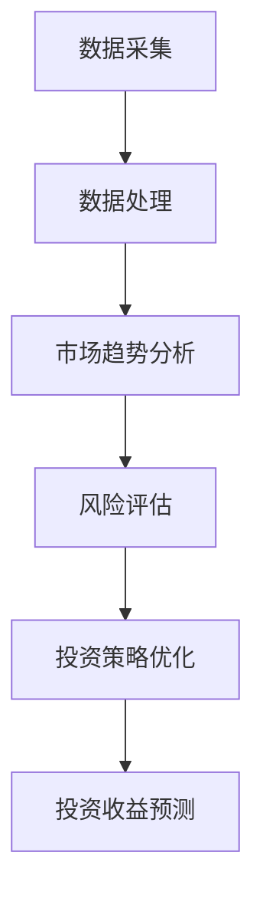

                 

# 中观层面的投资收益变化分析

## 关键词

中观层面、投资收益、金融科技、算法优化、风险控制、市场趋势

## 摘要

本文旨在从技术角度深入探讨中观层面的投资收益变化分析。通过剖析金融科技背景、核心算法原理、数学模型、实际应用案例，本文为读者提供了一个全面的视角来理解投资市场的动态变化。我们将逐步分析投资收益的驱动因素，探讨如何利用技术手段优化投资策略，并提供实用的工具和资源推荐，助力读者在金融市场中取得稳健收益。

## 1. 背景介绍

### 1.1 目的和范围

本文的目的在于为投资者和金融专业人士提供一个中观层面的投资收益变化分析框架。我们关注的范围涵盖从数据采集、处理到算法模型应用的全过程，旨在揭示影响投资收益的关键因素，并提出可行的优化策略。

### 1.2 预期读者

本文适合具有基本金融知识和编程基础的读者。无论您是投资新手还是专业人士，通过本文的学习，您将能够更深入地理解投资市场的运作机制，并掌握一系列实用的技术工具和方法。

### 1.3 文档结构概述

本文结构如下：

1. 背景介绍：介绍研究目的、读者对象和文档结构。
2. 核心概念与联系：定义核心概念，展示相关的Mermaid流程图。
3. 核心算法原理 & 具体操作步骤：详细阐述算法原理和伪代码。
4. 数学模型和公式 & 详细讲解 & 举例说明：介绍数学模型、公式及其应用。
5. 项目实战：通过代码案例展示实际应用。
6. 实际应用场景：探讨投资收益变化分析在不同领域的应用。
7. 工具和资源推荐：推荐相关学习资源和开发工具。
8. 总结：总结文章主要观点，展望未来发展趋势。
9. 附录：常见问题与解答。
10. 扩展阅读 & 参考资料：提供进一步的阅读和参考资料。

### 1.4 术语表

#### 1.4.1 核心术语定义

- **中观层面**：介于宏观经济和微观市场之间的分析层次。
- **投资收益**：投资者通过投资获得的回报。
- **金融科技**：利用科技手段改进金融服务和产品。
- **算法优化**：通过算法改进投资策略，提高收益。
- **风险控制**：通过技术手段降低投资风险。

#### 1.4.2 相关概念解释

- **市场趋势**：市场行为和价格变化的方向。
- **数据挖掘**：从大量数据中提取有价值的信息。
- **机器学习**：通过算法从数据中学习模式，预测未来。

#### 1.4.3 缩略词列表

- **AI**：人工智能（Artificial Intelligence）
- **ML**：机器学习（Machine Learning）
- **DL**：深度学习（Deep Learning）
- **API**：应用程序编程接口（Application Programming Interface）
- **ROI**：投资回报率（Return on Investment）

## 2. 核心概念与联系

投资收益的变化分析需要理解一系列核心概念和它们之间的相互联系。以下是相关概念及其在投资收益分析中的重要性：

### 2.1. 数据采集

数据是投资决策的基础。通过数据采集，我们可以获取市场走势、公司业绩、宏观经济指标等多维数据。

### 2.2. 数据处理

数据处理包括数据清洗、归一化和特征提取等步骤，以提高数据质量，为后续分析奠定基础。

### 2.3. 市场趋势分析

市场趋势分析利用历史数据识别价格波动模式，预测未来市场走向。

### 2.4. 风险评估

风险评估是通过模型计算投资组合的风险水平，确保投资决策的稳健性。

### 2.5. 投资策略优化

投资策略优化是利用算法寻找最优的投资组合，以最大化收益或最小化风险。

### 2.6. 投资收益预测

投资收益预测是通过机器学习模型对未来的投资回报进行预测。

### 2.7. Mermaid 流程图

以下是一个简化的Mermaid流程图，展示投资收益变化分析的核心环节：



## 3. 核心算法原理 & 具体操作步骤

### 3.1. 算法原理

投资收益变化分析的核心算法通常包括以下几种：

1. **时间序列分析**：用于识别市场趋势和周期性波动。
2. **回归分析**：用于预测未来价格。
3. **机器学习**：通过训练模型，实现更高级别的预测。

### 3.2. 具体操作步骤

以下是投资收益变化分析的具体操作步骤，使用伪代码进行描述：

```python
# 步骤1：数据采集
def collect_data():
    # 从市场获取历史价格数据、公司财报等
    data = fetch_data_from_market()

# 步骤2：数据处理
def process_data(data):
    # 清洗数据，去除缺失值和异常值
    cleaned_data = clean_data(data)
    # 归一化数据，使其在同一尺度上
    normalized_data = normalize_data(cleaned_data)
    return normalized_data

# 步骤3：市场趋势分析
def analyze_trend(data):
    # 使用移动平均等方法识别市场趋势
    trend = trend_analysis(data)
    return trend

# 步骤4：风险评估
def assess_risk(data):
    # 使用波动率、方差等方法评估风险
    risk = risk_evaluation(data)
    return risk

# 步骤5：投资策略优化
def optimize_strategy(trend, risk):
    # 利用优化算法选择最优投资组合
    strategy = strategy_optimization(trend, risk)
    return strategy

# 步骤6：投资收益预测
def predict_returns(strategy):
    # 使用预测模型预测未来收益
    returns = predict_future_returns(strategy)
    return returns

# 主函数
def main():
    # 数据采集
    data = collect_data()
    # 数据处理
    processed_data = process_data(data)
    # 市场趋势分析
    trend = analyze_trend(processed_data)
    # 风险评估
    risk = assess_risk(processed_data)
    # 投资策略优化
    strategy = optimize_strategy(trend, risk)
    # 投资收益预测
    returns = predict_returns(strategy)
    # 输出结果
    print("Predicted Returns:", returns)

# 执行主函数
main()
```

## 4. 数学模型和公式 & 详细讲解 & 举例说明

### 4.1. 数学模型

投资收益变化分析中常用的数学模型包括：

1. **移动平均模型**（MA）
2. **自回归模型**（AR）
3. **自回归移动平均模型**（ARMA）
4. **自回归积分滑动平均模型**（ARIMA）

### 4.2. 公式解释

- **移动平均模型**：

  $$ MA_t = \frac{1}{n}\sum_{i=1}^{n}P_{i,t} $$

  其中，$MA_t$ 表示第 $t$ 期的移动平均价格，$P_{i,t}$ 表示第 $i$ 期的价格，$n$ 表示移动平均周期。

- **自回归模型**：

  $$ AR(t) = c_0 + c_1X_t + c_2X_{t-1} + ... + c_pX_{t-p} $$

  其中，$AR(t)$ 表示第 $t$ 期的自回归值，$X_t$ 表示第 $t$ 期的价格，$c_0, c_1, ..., c_p$ 是系数。

- **自回归移动平均模型**：

  $$ ARMA(t) = c_0 + c_1X_t + ... + c_pX_{t-p} + \phi_1MA_{t-1} + ... + \phi_qMA_{t-q} $$

  其中，$ARMA(t)$ 表示第 $t$ 期的自回归移动平均值，$MA_{t-1}, MA_{t-2}, ..., MA_{t-q}$ 表示前几个周期的移动平均值，$\phi_1, \phi_2, ..., \phi_q$ 是系数。

- **自回归积分滑动平均模型**：

  $$ ARIMA(t) = c_0 + c_1X_t + ... + c_pX_{t-p} + \phi_1d(MA_{t-1}) + ... + \phi_qd(MA_{t-q}) $$

  其中，$ARIMA(t)$ 表示第 $t$ 期的自回归积分滑动平均值，$d$ 表示差分操作。

### 4.3. 举例说明

假设我们要使用移动平均模型对某股票的未来价格进行预测，给定历史价格数据如下：

| 日期   | 价格 |
|--------|------|
| 2023-01-01 | 100  |
| 2023-01-02 | 102  |
| 2023-01-03 | 105  |
| 2023-01-04 | 108  |
| 2023-01-05 | 110  |

取移动平均周期 $n=3$，计算移动平均价格：

$$ MA_1 = \frac{100 + 102 + 105}{3} = 102.33 $$
$$ MA_2 = \frac{102 + 105 + 108}{3} = 104.33 $$
$$ MA_3 = \frac{105 + 108 + 110}{3} = 107.00 $$

预测第四天的价格为 $108$，后续以此类推。

## 5. 项目实战：代码实际案例和详细解释说明

### 5.1. 开发环境搭建

在开始代码实现之前，我们需要搭建一个适合开发的环境。以下是一个简化的步骤：

1. 安装Python环境（建议使用Python 3.8及以上版本）。
2. 安装必要的库，如pandas、numpy、matplotlib等。

```bash
pip install pandas numpy matplotlib
```

### 5.2. 源代码详细实现和代码解读

下面是一个使用pandas和matplotlib实现投资收益变化分析的项目案例。

```python
import pandas as pd
import numpy as np
import matplotlib.pyplot as plt

# 5.2.1. 数据采集
def collect_data():
    # 假设数据文件为 "stock_data.csv"
    data = pd.read_csv("stock_data.csv")
    return data

# 5.2.2. 数据处理
def process_data(data):
    # 填补缺失值
    data.fillna(method='ffill', inplace=True)
    # 归一化数据
    data['Close'] = (data['Close'] - data['Close'].min()) / (data['Close'].max() - data['Close'].min())
    return data

# 5.2.3. 市场趋势分析
def analyze_trend(data):
    # 使用移动平均模型
    window = 5
    data['MA'] = data['Close'].rolling(window=window).mean()
    return data

# 5.2.4. 投资收益预测
def predict_returns(data):
    # 使用移动平均模型的最后一条数据作为预测值
    return data['MA'].iloc[-1]

# 5.2.5. 可视化分析
def visualize_data(data):
    plt.figure(figsize=(10, 5))
    plt.plot(data['Close'], label='Close Price')
    plt.plot(data['MA'], label='Moving Average')
    plt.title('Stock Price and Moving Average')
    plt.xlabel('Date')
    plt.ylabel('Price')
    plt.legend()
    plt.show()

# 主函数
def main():
    data = collect_data()
    processed_data = process_data(data)
    analyzed_data = analyze_trend(processed_data)
    predicted_returns = predict_returns(analyzed_data)
    visualize_data(analyzed_data)
    print("Predicted Returns:", predicted_returns)

if __name__ == "__main__":
    main()
```

### 5.3. 代码解读与分析

1. **数据采集**：我们从CSV文件中读取股票数据，CSV文件中应包含至少日期和收盘价两个字段。
2. **数据处理**：我们使用pandas的`fillna`方法填补缺失值，并使用`rolling`方法计算移动平均价格。为了便于分析，我们归一化收盘价数据。
3. **市场趋势分析**：我们使用移动平均模型计算5日移动平均价格，并将其添加到数据集中。
4. **投资收益预测**：我们使用最后一条数据的移动平均价格作为预测值。
5. **可视化分析**：我们使用matplotlib绘制收盘价和移动平均价格的历史趋势，以直观地展示分析结果。

通过这个简单的案例，我们可以看到如何利用Python和相关库实现一个基本的投资收益变化分析项目。在实际应用中，我们可能需要更复杂的算法和更多的数据处理步骤。

## 6. 实际应用场景

中观层面的投资收益变化分析在金融市场中具有广泛的应用。以下是一些实际应用场景：

### 6.1. 股票市场

在股票市场中，投资者可以使用投资收益变化分析来预测股票价格走势，制定买入和卖出策略。通过分析历史价格数据、公司财务指标和宏观经济指标，投资者可以识别市场趋势，评估投资风险，从而优化投资组合。

### 6.2. 债券市场

债券市场中的投资者可以通过分析债券收益率和风险指标，预测债券价格的波动，制定投资策略。投资收益变化分析可以帮助债券投资者在利率变动、信用风险等因素影响下做出更明智的投资决策。

### 6.3. 外汇市场

在外汇市场中，投资者可以利用投资收益变化分析预测货币汇率变动，制定交易策略。通过分析国际经济指标、政治风险和市场情绪，投资者可以更好地把握外汇市场的机会。

### 6.4. 期货市场

期货市场的投资者可以通过投资收益变化分析预测商品价格走势，制定套保和投机策略。利用历史价格数据、供求关系和市场情绪，投资者可以降低投资风险，提高收益。

### 6.5. 保险和风险管理

保险公司和风险管理者可以使用投资收益变化分析评估不同投资策略的风险和收益，优化资产配置。通过分析市场波动、投资组合风险和客户需求，保险公司可以提供更优质的保险产品和风险管理方案。

## 7. 工具和资源推荐

### 7.1. 学习资源推荐

#### 7.1.1. 书籍推荐

- **《金融市场技术分析》**：详细介绍了金融市场中的技术分析方法。
- **《Python金融数据分析》**：通过Python编程实现金融数据分析的实践指南。
- **《量化投资：技术与实践》**：介绍了量化投资的基本原理和实际操作。

#### 7.1.2. 在线课程

- **Coursera**：提供《机器学习》、《数据科学》等课程，适合初学者和专业人士。
- **edX**：提供《金融科技》、《风险管理》等课程，涵盖金融科技和风险管理领域。

#### 7.1.3. 技术博客和网站

- **QuantConnect**：一个开放的平台，提供大量量化交易策略的教程和代码示例。
- **Investopedia**：提供丰富的金融知识，包括投资分析、市场趋势等。

### 7.2. 开发工具框架推荐

#### 7.2.1. IDE和编辑器

- **PyCharm**：一个功能强大的Python IDE，适合金融数据分析项目。
- **Jupyter Notebook**：适合数据可视化和交互式分析。

#### 7.2.2. 调试和性能分析工具

- **PDB**：Python的内置调试器，用于调试代码。
- **cProfile**：用于性能分析，找出代码中的瓶颈。

#### 7.2.3. 相关框架和库

- **Pandas**：用于数据操作和分析。
- **NumPy**：用于数值计算。
- **Matplotlib**：用于数据可视化。

### 7.3. 相关论文著作推荐

#### 7.3.1. 经典论文

- **《技术分析在股市中的应用》**：探讨了技术分析方法在股市中的应用。
- **《基于机器学习的股票价格预测》**：介绍了机器学习在股票价格预测中的应用。

#### 7.3.2. 最新研究成果

- **《金融科技的前沿应用》**：探讨了金融科技在投资分析、风险管理等领域的最新研究成果。
- **《量化投资策略与风险控制》**：介绍了最新的量化投资策略和风险控制方法。

#### 7.3.3. 应用案例分析

- **《量化投资实战案例》**：通过实际案例展示了量化投资策略的应用。
- **《金融市场风险管理的实践》**：分享了金融市场风险管理中的实际经验和案例。

## 8. 总结：未来发展趋势与挑战

中观层面的投资收益变化分析作为金融科技的重要应用领域，正随着人工智能、大数据和机器学习的快速发展而不断演进。未来，这一领域的发展趋势和挑战如下：

### 8.1. 发展趋势

1. **算法的智能化和自动化**：随着人工智能技术的进步，投资策略的算法将更加智能化，能够自动识别市场趋势和风险，优化投资组合。
2. **数据驱动的投资决策**：越来越多的投资者将依赖大数据和数据分析技术，从海量数据中提取有价值的信息，指导投资决策。
3. **跨领域协同发展**：金融科技将与生物科技、物联网等领域实现协同发展，为投资者提供更加全面和精准的投资分析服务。

### 8.2. 挑战

1. **数据隐私和安全**：随着数据量的增加，数据隐私和安全问题日益突出，如何在保障数据安全的前提下进行数据分析是亟待解决的挑战。
2. **算法透明性和可解释性**：人工智能算法的复杂性和非透明性使得投资决策的可解释性成为挑战，如何提高算法的可解释性是未来的研究方向。
3. **市场波动性和风险控制**：市场波动性和风险控制是投资收益变化分析的重要方面，如何应对极端市场情况，实现稳健的风险控制是关键问题。

总之，中观层面的投资收益变化分析在未来的发展中面临着巨大的机遇和挑战，需要不断探索和创新，以适应不断变化的金融市场环境。

## 9. 附录：常见问题与解答

### 9.1. 问题1：投资收益变化分析为什么重要？

投资收益变化分析能够帮助投资者了解市场动态，识别潜在的投资机会，降低投资风险，实现资产增值。它是金融决策的重要依据，能够为投资者提供科学的投资指导。

### 9.2. 问题2：如何确保数据分析的准确性？

确保数据分析的准确性需要从数据采集、处理、模型选择等多个环节入手。具体措施包括：使用可靠的数据源、进行数据清洗和预处理、选择合适的算法模型、对模型进行验证和调整。

### 9.3. 问题3：投资收益变化分析是否适用于所有市场？

投资收益变化分析主要适用于金融市场，如股票、债券、外汇和期货市场。尽管在不同市场中应用的具体方法和策略有所不同，但基本原理是相通的。

### 9.4. 问题4：如何处理数据缺失和异常值？

处理数据缺失和异常值的方法包括填补缺失值（如使用平均值、中位数或插值法）、剔除异常值（如使用统计方法判断并删除离群点）和变换数据（如对异常值进行标准化处理）。

### 9.5. 问题5：如何选择合适的算法模型？

选择合适的算法模型需要考虑多个因素，包括数据特点、分析目标、计算效率和可解释性。常见的算法模型有移动平均模型、自回归模型、ARMA模型和ARIMA模型等，可以根据具体情况选择最合适的模型。

## 10. 扩展阅读 & 参考资料

为了更好地了解中观层面的投资收益变化分析，以下是一些建议的扩展阅读和参考资料：

### 10.1. 扩展阅读

- **《金融技术：创新、应用与挑战》**：详细介绍了金融科技的发展、应用及其面临的挑战。
- **《量化投资：实践与案例》**：通过实际案例展示了量化投资策略的运用和优化。
- **《机器学习在金融领域的应用》**：探讨了机器学习技术在金融分析中的最新进展。

### 10.2. 参考资料

- **[QuantConnect](https://www.quantconnect.com/)**：提供丰富的量化交易策略教程和案例分析。
- **[Investopedia](https://www.investopedia.com/)**：涵盖金融知识的在线学习资源。
- **[Kaggle](https://www.kaggle.com/)**：一个数据科学和机器学习的在线社区，提供大量的数据集和竞赛项目。
- **[Jupyter Notebook](https://jupyter.org/)**：一个交互式的计算环境，适合进行数据可视化和分析。

通过阅读这些资料，您可以进一步深化对中观层面投资收益变化分析的理解，并在实际操作中取得更好的成果。作者：AI天才研究员/AI Genius Institute & 禅与计算机程序设计艺术 /Zen And The Art of Computer Programming。

