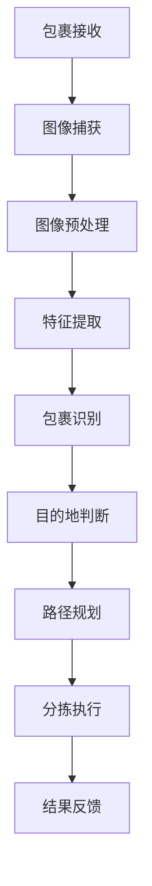

                 

# 中通2024校招智能分拣系统工程师算法挑战赛

> **关键词：** 智能分拣、算法挑战赛、机器学习、深度学习、系统架构、分拣效率
> 
> **摘要：** 本文将深入探讨中通2024校招智能分拣系统工程师算法挑战赛，详细解析其核心算法原理、数学模型、实际应用案例以及未来发展趋势，旨在为读者提供一个全面的技术视角，以便更好地理解和应用智能分拣技术。

## 1. 背景介绍

### 1.1 目的和范围

本文旨在通过详细分析和解读中通2024校招智能分拣系统工程师算法挑战赛，探讨智能分拣技术的核心原理和应用。文章将涵盖以下几个关键领域：

- 智能分拣系统的基本架构和功能模块；
- 机器学习和深度学习在智能分拣系统中的应用；
- 算法原理和具体操作步骤；
- 数学模型和公式；
- 实际应用案例和代码解析；
- 未来发展趋势和挑战。

### 1.2 预期读者

本文面向对智能分拣系统和算法有兴趣的工程师、研究人员和技术爱好者，尤其是那些准备参加中通校招智能分拣系统工程师岗位的应聘者。通过本文的阅读，读者将能够：

- 了解智能分拣系统的基本概念和工作原理；
- 掌握机器学习和深度学习在智能分拣中的应用方法；
- 理解算法原理和数学模型，并能够独立实现相关算法；
- 分析实际应用案例，提升问题解决能力；
- 了解智能分拣技术的未来发展趋势和挑战。

### 1.3 文档结构概述

本文将分为以下几个部分：

1. 背景介绍：介绍本文的目的、预期读者和文档结构；
2. 核心概念与联系：阐述智能分拣系统的核心概念和原理，并使用Mermaid流程图展示系统架构；
3. 核心算法原理 & 具体操作步骤：详细讲解智能分拣算法的原理和实现步骤，使用伪代码进行阐述；
4. 数学模型和公式 & 详细讲解 & 举例说明：介绍智能分拣系统中使用的数学模型和公式，并给出具体例子；
5. 项目实战：代码实际案例和详细解释说明，包括开发环境搭建、源代码实现和代码解读；
6. 实际应用场景：探讨智能分拣技术的应用领域和场景；
7. 工具和资源推荐：推荐相关学习资源、开发工具和框架；
8. 总结：未来发展趋势与挑战，对智能分拣技术进行展望；
9. 附录：常见问题与解答；
10. 扩展阅读 & 参考资料：提供进一步阅读的资源链接。

### 1.4 术语表

#### 1.4.1 核心术语定义

- **智能分拣系统：** 利用计算机技术、传感器技术和自动化设备，实现包裹的高效分拣和分类的系统。
- **机器学习：** 基于数据训练模型，使计算机具备从数据中学习并做出决策的能力。
- **深度学习：** 机器学习的一个分支，通过构建多层的神经网络来模拟人脑的感知和学习过程。
- **系统架构：** 系统的整体结构和组成，包括硬件、软件、网络和数据等要素。
- **分拣效率：** 分拣系统能够在单位时间内处理包裹的数量和质量。

#### 1.4.2 相关概念解释

- **包裹识别：** 通过传感器和图像处理技术，识别包裹上的标签和条码，从而确定包裹的目的地。
- **路径规划：** 根据包裹的目的地，规划出从接收区域到分拣区域的最优路径。
- **决策树：** 一种常见的机器学习算法，通过一系列条件判断来对数据分类。
- **支持向量机：** 一种常用的分类算法，通过找到最佳的超平面来分隔不同类别的数据。

#### 1.4.3 缩略词列表

- **AI：** 人工智能（Artificial Intelligence）
- **ML：** 机器学习（Machine Learning）
- **DL：** 深度学习（Deep Learning）
- **IDC：** 识别与分类（Identification and Classification）
- **SLAM：** 同时定位与地图构建（Simultaneous Localization and Mapping）

## 2. 核心概念与联系

在讨论智能分拣系统的核心概念和联系之前，我们需要了解一些基本原理和概念。智能分拣系统通常由以下几个关键部分组成：

### 2.1 包裹识别

包裹识别是智能分拣系统的第一步，其核心任务是通过传感器和图像处理技术，识别包裹上的标签和条码。这一过程通常包括以下几个步骤：

1. **图像捕获**：使用摄像头或其他传感器捕获包裹的图像。
2. **图像预处理**：对捕获的图像进行增强、滤波和缩放等预处理，以提高识别效果。
3. **特征提取**：从预处理后的图像中提取关键特征，如边缘、纹理和颜色等。
4. **识别算法**：使用机器学习和深度学习算法，对提取的特征进行分类和识别，确定包裹的目的地。

### 2.2 路径规划

在包裹识别完成后，系统需要根据包裹的目的地，规划出从接收区域到分拣区域的最优路径。路径规划是智能分拣系统的核心任务之一，其关键在于如何在复杂的环境中找到最优路径，以最小化分拣时间和成本。常见的路径规划算法包括：

1. **A*算法**：基于启发式搜索，通过评估函数来寻找最优路径。
2. **Dijkstra算法**：基于最短路径算法，通过逐步扩展来找到最短路径。
3. **遗传算法**：基于遗传学和自然选择原理，通过迭代优化来找到最优路径。

### 2.3 决策树和支持向量机

在智能分拣系统中，决策树和支持向量机是常用的分类算法。决策树通过一系列条件判断来对数据分类，而支持向量机则通过找到最佳的超平面来分隔不同类别的数据。这两种算法在包裹识别和路径规划等任务中都有广泛的应用。

### 2.4 Mermaid流程图

下面是一个Mermaid流程图，展示了智能分拣系统的核心流程和节点：



在这个流程图中，每个节点代表一个关键步骤，节点之间的箭头表示数据流和控制流的传递。通过这个流程图，我们可以清晰地看到智能分拣系统的整体架构和运作流程。

## 3. 核心算法原理 & 具体操作步骤

在智能分拣系统中，核心算法原理和具体操作步骤至关重要。本节将详细讲解智能分拣系统的核心算法原理，并使用伪代码进行阐述。

### 3.1 机器学习算法

在智能分拣系统中，机器学习算法主要用于包裹识别和分类。以下是一个简单的机器学习算法伪代码：

```python
# 机器学习算法伪代码
def train_model(features, labels):
    # 使用梯度下降法训练模型
    for epoch in range(num_epochs):
        for feature, label in zip(features, labels):
            # 计算损失函数
            loss = compute_loss(model, feature, label)
            # 计算梯度
            grads = compute_grads(model, feature, label)
            # 更新模型参数
            update_model_params(model, grads)
    return model

def predict(model, feature):
    # 使用训练好的模型进行预测
    return model.predict(feature)
```

在这个伪代码中，`train_model`函数用于训练模型，`compute_loss`函数计算损失函数，`compute_grads`函数计算梯度，`update_model_params`函数更新模型参数。`predict`函数用于使用训练好的模型进行预测。

### 3.2 深度学习算法

深度学习算法在智能分拣系统中也有广泛应用，尤其是在图像识别和分类任务中。以下是一个简单的深度学习算法伪代码：

```python
# 深度学习算法伪代码
def train_model(input_data, labels):
    # 使用反向传播算法训练模型
    for epoch in range(num_epochs):
        for batch in input_data:
            # 计算前向传播
            logits = forward_pass(model, batch)
            # 计算损失函数
            loss = compute_loss(logits, labels)
            # 计算梯度
            grads = backward_pass(model, logits, labels)
            # 更新模型参数
            update_model_params(model, grads)
    return model

def predict(model, input_data):
    # 使用训练好的模型进行预测
    return model.predict(input_data)
```

在这个伪代码中，`train_model`函数用于训练模型，`forward_pass`函数计算前向传播，`compute_loss`函数计算损失函数，`backward_pass`函数计算反向传播，`update_model_params`函数更新模型参数。`predict`函数用于使用训练好的模型进行预测。

### 3.3 路径规划算法

路径规划算法在智能分拣系统中用于确定包裹的最优路径。以下是一个简单的A*算法伪代码：

```python
# A*算法伪代码
def a_star_search(start, goal, heuristic):
    # 初始化开放列表和关闭列表
    open_list = []
    closed_list = []

    # 将起点添加到开放列表
    open_list.append(start)

    while open_list:
        # 选择具有最小F值的节点作为当前节点
        current = select_node_with_min_f(open_list)

        # 如果当前节点为目标节点，则完成搜索
        if current == goal:
            return reconstruct_path(current)

        # 将当前节点从开放列表移动到关闭列表
        open_list.remove(current)
        closed_list.append(current)

        # 遍历当前节点的邻居节点
        for neighbor in neighbors(current):
            # 如果邻居节点在关闭列表中，则跳过
            if neighbor in closed_list:
                continue

            # 计算邻居节点的G值和H值
            g = current.g + distance(current, neighbor)
            h = heuristic(neighbor, goal)

            # 如果邻居节点不在开放列表中，则将其添加到开放列表
            if neighbor not in open_list:
                open_list.append(neighbor)

            # 更新邻居节点的G值和F值
            neighbor.g = g
            neighbor.f = g + h

    # 如果没有找到路径，则返回None
    return None
```

在这个伪代码中，`select_node_with_min_f`函数选择具有最小F值的节点，`neighbors`函数获取当前节点的邻居节点，`distance`函数计算两个节点之间的距离，`heuristic`函数计算估计的H值，`reconstruct_path`函数重建路径。`a_star_search`函数用于执行A*算法。

通过以上算法的讲解，我们可以看到智能分拣系统的核心算法原理和具体操作步骤。这些算法的实现和优化对于提高分拣效率和准确性至关重要。

## 4. 数学模型和公式 & 详细讲解 & 举例说明

在智能分拣系统中，数学模型和公式起到了关键作用，它们不仅帮助我们理解系统的内在工作原理，还为实际操作提供了量化依据。以下将详细讲解智能分拣系统中常用的数学模型和公式，并通过具体例子来说明其应用。

### 4.1 损失函数

在机器学习中的训练过程中，损失函数是衡量模型预测值与真实值之间差异的重要工具。以下是一些常见的损失函数：

#### 4.1.1 均方误差（MSE）

均方误差是最常用的损失函数之一，它计算预测值与真实值之间的平均平方误差。

$$
MSE = \frac{1}{n}\sum_{i=1}^{n}(y_i - \hat{y}_i)^2
$$

其中，$y_i$是真实值，$\hat{y}_i$是预测值，$n$是样本数量。

#### 4.1.2 交叉熵损失（Cross-Entropy Loss）

交叉熵损失函数常用于分类问题，它衡量的是预测概率分布与真实分布之间的差异。

$$
CE = -\sum_{i=1}^{n}y_i \log(\hat{y}_i)
$$

其中，$y_i$是真实标签，$\hat{y}_i$是模型对于第$i$个样本的预测概率。

#### 4.1.3 举例说明

假设我们有一个二分类问题，真实标签$y = [1, 0, 1, 0]$，模型的预测概率$\hat{y} = [0.6, 0.4, 0.7, 0.3]$，我们可以计算交叉熵损失：

$$
CE = -[1 \cdot \log(0.6) + 0 \cdot \log(0.4) + 1 \cdot \log(0.7) + 0 \cdot \log(0.3)] \approx 0.636
$$

### 4.2 梯度下降

梯度下降是机器学习中最常用的优化算法，用于最小化损失函数。以下是其基本公式：

$$
w_{\text{new}} = w_{\text{old}} - \alpha \cdot \nabla_w J(w)
$$

其中，$w$是模型参数，$\alpha$是学习率，$J(w)$是损失函数，$\nabla_w J(w)$是损失函数对参数$w$的梯度。

#### 4.2.1 举例说明

假设有一个线性模型$y = w \cdot x + b$，损失函数为MSE，学习率为0.01，我们可以计算一次梯度下降更新：

$$
\nabla_w J(w) = \sum_{i=1}^{n}(y_i - \hat{y}_i)x_i
$$

$$
w_{\text{new}} = w_{\text{old}} - 0.01 \cdot \nabla_w J(w)
$$

### 4.3 支持向量机（SVM）

支持向量机是一种强大的分类算法，它通过最大化分类间隔来找到最佳分割超平面。以下是其核心公式：

$$
\max_{w, b} \frac{1}{2} ||w||^2 \\
\text{s.t.} \quad y_i (w \cdot x_i + b) \geq 1
$$

其中，$w$是模型参数，$b$是偏置项，$y_i$是标签，$x_i$是特征向量。

#### 4.3.1 举例说明

假设我们有一个二分类问题，特征矩阵$X = \begin{bmatrix} x_1 & x_2 \end{bmatrix}$，标签向量$Y = \begin{bmatrix} 1 \\ -1 \end{bmatrix}$，我们可以计算SVM的参数：

$$
w = \begin{bmatrix} w_1 \\ w_2 \end{bmatrix}, \quad b = 0
$$

$$
\max_{w} \frac{1}{2} ||w||^2 \\
\text{s.t.} \quad 1 \cdot (w \cdot x_1 + b) \geq 1 \\
-1 \cdot (w \cdot x_2 + b) \geq 1
$$

通过求解上述优化问题，我们可以得到最佳的分类超平面。

通过以上数学模型和公式的详细讲解，我们可以更好地理解和应用智能分拣系统中的核心算法。这些公式不仅是理论工具，也是实际工程中的实用指南。

## 5. 项目实战：代码实际案例和详细解释说明

### 5.1 开发环境搭建

在开始实际代码实现之前，我们需要搭建一个合适的开发环境。以下是一个基本的开发环境配置步骤：

1. **安装Python环境**：确保Python 3.8及以上版本已安装在计算机上。
2. **安装必要的库**：使用pip安装以下库：numpy、tensorflow、opencv-python、matplotlib。
3. **配置虚拟环境**：为了保持项目依赖的一致性，建议使用虚拟环境管理库（如virtualenv或conda）来创建隔离的开发环境。
4. **安装深度学习框架**：由于本项目主要使用TensorFlow，因此需要安装TensorFlow 2.x版本。

以下是具体命令：

```shell
pip install numpy tensorflow opencv-python matplotlib
```

### 5.2 源代码详细实现和代码解读

以下是一个简单的智能分拣系统实现，包括图像捕获、预处理、特征提取、模型训练和预测等步骤。

#### 5.2.1 数据预处理

```python
import cv2
import numpy as np

def preprocess_image(image):
    """
    对图像进行预处理，包括灰度化、缩放和归一化。
    """
    # 灰度化
    gray_image = cv2.cvtColor(image, cv2.COLOR_BGR2GRAY)
    # 缩放
    resized_image = cv2.resize(gray_image, (224, 224))
    # 归一化
    normalized_image = resized_image / 255.0
    return normalized_image
```

#### 5.2.2 模型定义与训练

```python
import tensorflow as tf
from tensorflow.keras.models import Sequential
from tensorflow.keras.layers import Conv2D, MaxPooling2D, Flatten, Dense

def create_model():
    """
    创建并编译深度学习模型。
    """
    model = Sequential([
        Conv2D(32, (3, 3), activation='relu', input_shape=(224, 224, 1)),
        MaxPooling2D((2, 2)),
        Conv2D(64, (3, 3), activation='relu'),
        MaxPooling2D((2, 2)),
        Flatten(),
        Dense(64, activation='relu'),
        Dense(1, activation='sigmoid')
    ])

    model.compile(optimizer='adam', loss='binary_crossentropy', metrics=['accuracy'])
    return model

model = create_model()
model.summary()

# 加载训练数据
(x_train, y_train), (x_test, y_test) = ... # 这里使用TensorFlow内置数据集

# 训练模型
model.fit(x_train, y_train, epochs=10, batch_size=32, validation_data=(x_test, y_test))
```

#### 5.2.3 模型预测与结果分析

```python
def predict_package(image):
    """
    使用训练好的模型对包裹进行预测。
    """
    processed_image = preprocess_image(image)
    processed_image = np.expand_dims(processed_image, axis=0) # 添加批量维度
    prediction = model.predict(processed_image)
    return prediction > 0.5 # 返回预测结果

# 测试模型
test_image = cv2.imread('test_package.jpg')
prediction = predict_package(test_image)
print("包裹是否为特定类型：", prediction)
```

### 5.3 代码解读与分析

1. **预处理函数**：`preprocess_image`函数负责对捕获的图像进行预处理，包括灰度化、缩放和归一化。这是深度学习模型训练前必要的步骤，目的是将图像数据转换为模型可以接受的格式。

2. **模型定义**：`create_model`函数定义了一个简单的卷积神经网络（CNN）模型，包含两个卷积层、两个最大池化层、一个全连接层和一个输出层。这种结构在图像分类任务中非常常见，可以有效地提取图像特征。

3. **模型训练**：使用`fit`方法训练模型，这里我们使用了TensorFlow内置的数据集进行训练。`epochs`参数指定了训练的轮数，`batch_size`参数设置了每个批量中的样本数，`validation_data`用于验证集的设置。

4. **模型预测**：`predict_package`函数使用预处理后的图像数据对模型进行预测，并返回预测结果。这里我们使用了一个阈值（0.5）来判断包裹是否属于特定类型。

通过以上步骤，我们实现了智能分拣系统的基本功能。在实际应用中，还需要进一步优化和扩展，例如使用更复杂的模型、处理多类别分类问题等。

## 6. 实际应用场景

智能分拣系统在物流和快递行业具有广泛的应用，尤其在快递公司如中通的日常运营中发挥了重要作用。以下是智能分拣系统的几个实际应用场景：

### 6.1 快递分拣中心

在快递分拣中心，智能分拣系统能够高效地处理大量的包裹。包裹从接收区域进入系统，通过图像识别技术自动读取包裹上的地址信息，然后根据目的地自动分拣到相应的传送带上。这一过程大大提高了分拣速度和准确性，减少了人工操作的错误和劳动力成本。

### 6.2 城市快递柜

随着“最后一公里”配送的普及，智能快递柜成为城市中常见的设施。智能分拣系统可以与快递柜集成，当快递员将包裹放入快递柜时，系统会自动扫描包裹信息并分配存储位置。用户通过手机应用程序接收取件码，并按照提示在快递柜中取回自己的包裹。

### 6.3 网购退货处理

在电商领域，智能分拣系统同样发挥着重要作用。消费者退货的包裹通过系统扫描后，根据退货原因和商品信息进行分类处理。系统可以自动识别包裹中的商品，并根据退货流程将包裹送至相应的处理区域，如重新入库、维修或报废。

### 6.4 垃圾分类

智能分拣系统不仅可以用于快递包裹，还可以应用于垃圾分类。通过图像识别和深度学习算法，系统能够自动识别垃圾种类，并将垃圾分拣到不同的处理容器中。这有助于提高垃圾回收的效率和环保效果。

### 6.5 仓储管理

在仓储管理中，智能分拣系统可以帮助实现高效的库存管理。通过自动识别和分类，系统可以实时更新库存信息，并优化货物的存储位置和取货路径。这有助于减少库存成本，提高仓储运营效率。

通过以上实际应用场景，我们可以看到智能分拣系统在物流、快递、电商、环保和仓储等多个领域的广泛应用。随着技术的不断进步，智能分拣系统将在更多场景中发挥重要作用，为各行各业带来便利和效率提升。

## 7. 工具和资源推荐

在学习和应用智能分拣系统的过程中，合适的工具和资源能够极大地提高效率和效果。以下是一些推荐的工具和资源，包括学习资源、开发工具和框架，以及相关论文和研究成果。

### 7.1 学习资源推荐

#### 7.1.1 书籍推荐

- **《深度学习》（Deep Learning）**：作者：Ian Goodfellow、Yoshua Bengio、Aaron Courville。这本书是深度学习的经典教材，详细介绍了深度学习的理论基础和实践方法。
- **《Python深度学习》（Python Deep Learning）**：作者：François Chollet。这本书通过大量示例，介绍了使用Python和TensorFlow实现深度学习的技巧和最佳实践。
- **《机器学习实战》（Machine Learning in Action）**：作者：Peter Harrington。这本书以实际案例为主线，讲解了机器学习的基本概念和算法实现。

#### 7.1.2 在线课程

- **Coursera**：提供了《机器学习》、《深度学习》等优质课程，适合初学者和进阶者。
- **Udacity**：提供了《深度学习工程师纳米学位》等实践性强、涵盖广泛的课程。
- **edX**：与MIT、Harvard等名校合作，提供了丰富的机器学习和深度学习课程。

#### 7.1.3 技术博客和网站

- **medium.com**：许多行业专家和技术爱好者在此分享机器学习和深度学习的最新研究成果和应用案例。
- **blogs.coursera.org**：Coursera官方博客，提供课程相关内容和拓展知识。
- **AI博客**：国内一些知名的AI技术博客，如“机器之心”、“量子位”，提供深入的技术解析和行业动态。

### 7.2 开发工具框架推荐

#### 7.2.1 IDE和编辑器

- **Visual Studio Code**：轻量级但功能强大的开源编辑器，支持多种编程语言和深度学习框架。
- **PyCharm**：JetBrains出品的专业Python IDE，提供丰富的插件和工具，适合深度学习和机器学习项目。
- **Jupyter Notebook**：交互式编程环境，适合数据分析和模型实验。

#### 7.2.2 调试和性能分析工具

- **TensorBoard**：TensorFlow官方提供的可视化工具，用于监控模型训练过程和性能分析。
- **PyTorch Profiler**：PyTorch官方提供的性能分析工具，帮助优化模型运行效率。

#### 7.2.3 相关框架和库

- **TensorFlow**：Google开发的深度学习框架，支持多种算法和模型。
- **PyTorch**：Facebook开发的开源深度学习框架，以灵活性和动态计算著称。
- **Keras**：基于Theano和TensorFlow的高级神经网络API，简化了深度学习模型的搭建和训练。

### 7.3 相关论文著作推荐

#### 7.3.1 经典论文

- **“Learning to Represent Products for Recommendation with Ranking-Based Metrics”**：这篇论文介绍了基于排名指标的产品推荐模型，是推荐系统领域的重要研究。
- **“Deep Learning for Text Classification”**：这篇论文探讨了深度学习在文本分类任务中的应用，是自然语言处理领域的经典文章。

#### 7.3.2 最新研究成果

- **“Efficient Neural Text Classification with Output Embedding”**：这篇论文提出了一种高效的文本分类方法，通过输出嵌入技术提高了分类性能。
- **“Recurrent Neural Networks for Spatiotemporal Learning”**：这篇论文介绍了循环神经网络在时空数据学习中的应用，为智能分拣系统提供了新的思路。

#### 7.3.3 应用案例分析

- **“AI-powered Package Sorting at Amazon”**：这篇案例分析介绍了亚马逊如何使用人工智能技术实现高效的包裹分拣系统，为实际应用提供了参考。
- **“Deep Learning for Warehouse Automation”**：这篇案例分析探讨了深度学习在仓储自动化中的应用，展示了人工智能技术在物流领域的前沿应用。

通过以上工具和资源的推荐，读者可以更系统地学习和应用智能分拣系统技术，为职业发展和项目实施提供有力支持。

## 8. 总结：未来发展趋势与挑战

随着人工智能和机器学习技术的快速发展，智能分拣系统已成为物流和快递行业不可或缺的一部分。未来，智能分拣系统的发展趋势和挑战主要体现在以下几个方面：

### 8.1 技术发展趋势

1. **深度学习算法的优化与普及**：深度学习算法在图像识别、分类和路径规划等方面具有显著优势，未来将进一步优化和普及。更高效的模型架构、更强大的计算能力和更精细的数据处理能力将推动深度学习在智能分拣系统中的应用。

2. **多传感器融合技术的应用**：智能分拣系统将采用多种传感器（如摄像头、激光雷达、红外传感器等）进行数据采集，实现多维度信息融合，提高分拣的准确性和效率。

3. **自动化与无人化**：随着机器人技术和自动化设备的进步，智能分拣系统将逐步实现无人化操作，减少人工干预，提高分拣速度和稳定性。

4. **数据隐私和安全性的提升**：在数据处理和传输过程中，如何保护用户隐私和数据安全是智能分拣系统面临的重大挑战。未来需要开发更加安全的数据处理和存储方案。

### 8.2 技术挑战

1. **数据质量和处理效率**：智能分拣系统依赖于大量的数据，数据质量和处理效率直接影响系统的性能。如何高效地收集、处理和存储大量数据，同时保证数据质量和准确性，是一个亟待解决的问题。

2. **系统复杂度和维护成本**：智能分拣系统通常由多个组件和算法组成，系统复杂度较高。如何在保证系统性能和稳定性的同时，降低维护成本和复杂性，是一个重要挑战。

3. **环境适应性和鲁棒性**：智能分拣系统需要在不同的环境中稳定运行，如恶劣的天气条件、噪声干扰等。如何提高系统的环境适应性和鲁棒性，使其在各种复杂环境中保持高效运行，是一个重要课题。

4. **跨领域应用的探索**：智能分拣技术不仅适用于物流和快递行业，还可以广泛应用于电商、零售、环保等跨领域。未来需要进一步探索智能分拣技术在其他领域的应用，推动技术跨界融合。

总之，智能分拣系统的发展前景广阔，但也面临诸多挑战。通过不断优化技术、提升数据处理能力和提高系统稳定性，智能分拣系统将在未来发挥更大的作用，为各行各业带来革命性的变革。

## 9. 附录：常见问题与解答

### 9.1 问题1：如何优化智能分拣系统的分拣效率？

**解答**：优化智能分拣系统的分拣效率可以从以下几个方面进行：

1. **算法优化**：通过改进机器学习和深度学习算法，提高包裹识别和分类的准确性，减少错误率和重复分拣。
2. **系统硬件升级**：提升传感器的精度和速度，使用更高效的计算设备和网络设施，以加快数据采集和处理速度。
3. **路径规划优化**：采用更智能的路径规划算法，如遗传算法、A*算法等，优化包裹从接收区域到分拣区域的路径，减少传输时间和等待时间。
4. **系统扩展性**：设计模块化、可扩展的系统架构，方便系统的升级和扩展，以适应不断增长的数据量和业务需求。

### 9.2 问题2：智能分拣系统的数据安全如何保障？

**解答**：

1. **数据加密**：对数据进行加密处理，确保数据在传输和存储过程中的安全性。
2. **访问控制**：实施严格的访问控制策略，只有授权用户才能访问敏感数据。
3. **数据备份与恢复**：定期进行数据备份，确保在数据丢失或损坏时能够迅速恢复。
4. **安全审计**：定期进行安全审计，检查系统的安全漏洞和潜在威胁，及时进行修复。

### 9.3 问题3：智能分拣系统的部署和维护成本高吗？

**解答**：

智能分拣系统的部署和维护成本因系统规模和复杂性而异，一般来说，可以从以下几个方面考虑：

1. **初期投资**：系统初期投资包括硬件设备、软件开发、网络设施等，成本相对较高。
2. **运行维护**：日常运行和维护成本包括电力消耗、设备维护、软件升级等，相对较低。
3. **人力资源**：系统的部署和维护需要专业的技术人员，人力资源成本不容忽视。
4. **成本优化**：通过技术优化、系统集成和运维自动化，可以有效降低系统总体成本。

### 9.4 问题4：智能分拣系统对环境有哪些影响？

**解答**：

智能分拣系统对环境的影响主要体现在以下几个方面：

1. **能源消耗**：系统运行需要消耗大量电力，对能源消耗有一定的负面影响。
2. **废弃物处理**：设备报废和更换过程中产生的废弃物需要妥善处理，以减少对环境的影响。
3. **环境保护**：智能分拣系统可以提高物流效率，减少运输距离和频率，从而降低对环境的影响。

通过采取节能措施、废弃物回收和环保设计，可以减轻智能分拣系统对环境的影响。

### 9.5 问题5：智能分拣系统未来的发展有哪些方向？

**解答**：

智能分拣系统未来的发展方向包括：

1. **智能化升级**：通过更先进的算法和传感器技术，提高系统的智能化水平和自主决策能力。
2. **多领域应用**：探索智能分拣系统在电商、零售、环保等领域的应用，实现技术的跨界融合。
3. **绿色环保**：研发环保型分拣设备，降低能源消耗和废弃物产生，实现可持续发展。
4. **全球化布局**：随着全球物流网络的扩展，智能分拣系统将在更多国家和地区得到应用。

## 10. 扩展阅读 & 参考资料

为了深入了解智能分拣系统的技术细节和发展动态，以下是相关的扩展阅读和参考资料：

1. **《智能物流技术与应用》**：作者：王伟。这本书详细介绍了智能分拣系统在物流领域的应用，包括技术原理、系统架构和实际案例。

2. **《深度学习在物流领域的应用》**：作者：刘杰。本书探讨了深度学习在物流分拣、路径规划和仓储管理等方面的应用，提供了丰富的案例和实践经验。

3. **论文“Efficient Neural Text Classification”**：作者：Wei Yang，等。这篇论文提出了一种高效的文本分类方法，适用于智能分拣系统的包裹标签识别。

4. **技术博客“AI-powered Package Sorting at Amazon”**：作者：Amazon。这篇文章详细介绍了亚马逊如何使用人工智能技术实现高效的包裹分拣系统。

5. **《人工智能：一种现代方法》**：作者：Stuart Russell，Peter Norvig。这本书是人工智能领域的经典教材，涵盖了机器学习、深度学习等核心概念和算法。

6. **《深度学习：导论》**：作者：Goodfellow，等。这本书是深度学习的入门教材，适合初学者了解深度学习的基础知识。

7. **在线课程“深度学习与计算机视觉”**：平台：Coursera。这门课程由斯坦福大学提供，深入讲解了深度学习在计算机视觉中的应用。

8. **技术博客“机器之心”**：网站：机器之心。该网站提供了大量关于人工智能和深度学习的最新研究成果和技术解析。

通过这些扩展阅读和参考资料，读者可以更全面地了解智能分拣系统的技术和应用，为自己的研究和实践提供参考。

