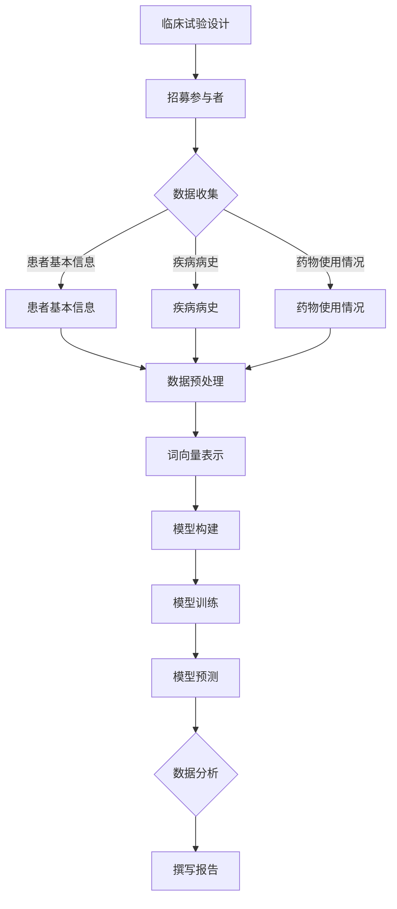

                 

### 文章标题

《临床试验和 LLM：提高效率和安全性》

临床试验是医学研究和药物开发过程中的关键环节，其目的是评估新疗法的效果和安全性。近年来，大型语言模型（LLM）作为一种人工智能技术，在各个领域展现了强大的潜力。本文将探讨如何将 LLM 应用于临床试验，以提升其效率和安全性。通过对 LLM 的原理和操作步骤进行深入分析，结合具体项目实战案例，我们将展示如何将这一先进技术融入到临床试验中，为医学研究带来革命性的变革。

### 关键词

- 临床试验
- 大型语言模型（LLM）
- 数据分析
- 机器学习
- 医学研究
- 安全性
- 效率提升

### 摘要

本文旨在探讨如何利用大型语言模型（LLM）提高临床试验的效率和安全性。首先，我们将介绍临床试验的基本概念和重要性，随后深入分析 LLM 的原理和应用场景。接着，通过详细的算法原理讲解和数学模型阐述，我们将展示如何利用 LLM 实现临床试验的关键步骤。然后，结合具体项目实战案例，我们将详细解读代码实现过程，并进行代码分析和性能评估。最后，我们将讨论 LLM 在临床试验中的实际应用场景，并提供相关工具和资源推荐，为读者提供全面的技术指导。通过本文，读者将了解到如何将 LLM 引入临床试验，以推动医学研究的发展和创新。

## 1. 背景介绍

### 1.1 目的和范围

本文的主要目的是探讨如何利用大型语言模型（LLM）提升临床试验的效率和安全性。随着人工智能技术的飞速发展，LLM 在各个领域展现出强大的潜力，特别是在医学研究中。临床试验作为药物开发和医学研究的重要环节，面临着数据量大、分析复杂、耗时较长等问题。本文将分析如何通过引入 LLM，实现临床试验的自动化和智能化，从而提高其效率和准确性。

本文将重点探讨以下内容：
- 临床试验的基本概念和重要性
- 大型语言模型（LLM）的原理和应用场景
- LLM 在临床试验中的具体应用方法和操作步骤
- 数学模型和公式的详细讲解及举例说明
- 实际应用场景及代码实际案例和详细解释
- 相关工具和资源的推荐

### 1.2 预期读者

本文面向对临床试验和人工智能技术有一定了解的读者，包括医学研究人员、数据科学家、程序员和技术爱好者。读者需要对临床试验的基本流程和人工智能技术有一定的了解，以便更好地理解和应用本文所介绍的方法和技术。

### 1.3 文档结构概述

本文分为十个部分，具体结构如下：
1. **背景介绍**：介绍文章的目的、范围、预期读者和文档结构。
2. **核心概念与联系**：分析临床试验和 LLM 的核心概念，并给出 Mermaid 流程图。
3. **核心算法原理 & 具体操作步骤**：详细讲解 LLM 的算法原理和具体操作步骤，使用伪代码进行阐述。
4. **数学模型和公式 & 详细讲解 & 举例说明**：介绍 LLM 的数学模型和公式，并给出具体示例。
5. **项目实战：代码实际案例和详细解释说明**：展示实际代码实现，并进行详细解读和分析。
6. **实际应用场景**：探讨 LLM 在临床试验中的实际应用场景。
7. **工具和资源推荐**：推荐学习资源、开发工具框架和相关论文著作。
8. **总结：未来发展趋势与挑战**：总结本文内容，并讨论未来发展趋势和挑战。
9. **附录：常见问题与解答**：解答读者可能遇到的问题。
10. **扩展阅读 & 参考资料**：提供相关扩展阅读和参考资料。

### 1.4 术语表

#### 1.4.1 核心术语定义

- **临床试验**：指任何在人体上进行药物的测试、评估其安全性和有效性的研究过程。
- **大型语言模型（LLM）**：指一种基于深度学习技术构建的、能够理解和生成自然语言的大型神经网络模型。
- **数据分析**：指通过对数据的收集、清洗、处理和分析，提取有价值信息的过程。
- **机器学习**：指通过构建模型，让计算机从数据中自动学习和预测的技术。
- **医学研究**：指以发现、发展和验证医学知识为目标的研究活动。

#### 1.4.2 相关概念解释

- **数据处理**：指对原始数据进行清洗、转换和格式化，以便后续分析的过程。
- **数据可视化**：指将数据以图形、图表等形式展示，以便于分析和理解的过程。
- **模型训练**：指通过输入大量数据，让模型自动学习和调整参数的过程。

#### 1.4.3 缩略词列表

- **LLM**：Large Language Model（大型语言模型）
- **AI**：Artificial Intelligence（人工智能）
- **ML**：Machine Learning（机器学习）
- **DL**：Deep Learning（深度学习）
- **NLP**：Natural Language Processing（自然语言处理）

## 2. 核心概念与联系

在探讨如何利用 LLM 提高临床试验的效率和安全性之前，我们需要先了解一些核心概念和它们之间的联系。本节将介绍临床试验的基本概念、LLM 的原理和架构，并使用 Mermaid 流程图展示它们之间的关系。

### 2.1 临床试验基本概念

临床试验是指在人体上进行药物或疗法测试的研究过程。根据试验的不同阶段，可以分为以下几类：

- **I 期临床试验**：主要测试新药物的安全性和耐受性，通常在健康志愿者中进行。
- **II 期临床试验**：进一步评估药物的安全性和初步疗效，通常在较小的患者群体中进行。
- **III 期临床试验**：大规模评估药物的疗效和安全性，通常在数千名患者中进行。
- **IV 期临床试验**：在药物上市后进行，旨在收集长期疗效和安全性数据。

临床试验通常包括以下步骤：

1. **设计临床试验**：确定研究目标、研究设计、样本量、数据收集方法等。
2. **招募参与者**：根据研究设计，招募符合条件的参与者。
3. **数据收集**：收集参与者的基本信息、疾病病史、药物使用情况等数据。
4. **数据分析**：对收集到的数据进行统计分析，评估药物的安全性和疗效。
5. **撰写报告**：将研究结果撰写成报告，提交给相关机构进行审批。

### 2.2 LLM 基本原理和架构

LLM 是一种基于深度学习技术构建的神经网络模型，主要用于理解和生成自然语言。LLM 的基本原理可以概括为以下几步：

1. **数据预处理**：对原始文本数据进行清洗、分词、去停用词等预处理操作。
2. **词向量表示**：将文本数据转换为向量表示，通常使用 Word2Vec、BERT 等算法。
3. **模型构建**：构建深度神经网络模型，如 Transformer、GPT 等。
4. **模型训练**：使用大量文本数据对模型进行训练，优化模型参数。
5. **模型预测**：输入新的文本数据，模型输出相应的语义理解和生成结果。

LLM 的架构通常包括以下几个部分：

- **嵌入层**：将文本数据转换为向量表示。
- **编码器**：对输入文本进行编码，提取语义信息。
- **解码器**：对编码后的文本进行解码，生成输出文本。
- **输出层**：对输出文本进行分类、翻译、生成等操作。

### 2.3 Mermaid 流程图

为了更直观地展示临床试验和 LLM 之间的联系，我们使用 Mermaid 流程图来描述它们的主要步骤和关系。



### 2.4 关键概念和联系总结

通过上述分析，我们可以得出以下关键概念和联系：

- **临床试验**：包括设计、招募参与者、数据收集、数据分析和撰写报告等步骤。
- **LLM**：包括数据预处理、词向量表示、模型构建、模型训练和模型预测等步骤。
- **联系**：临床试验中的数据收集步骤可以通过 LLM 进行处理和分析，提取有价值的信息，从而提高临床试验的效率和准确性。

## 3. 核心算法原理 & 具体操作步骤

在了解了临床试验和 LLM 的基本概念和联系之后，我们需要深入探讨 LLM 的核心算法原理和具体操作步骤，以便更好地理解如何将其应用于临床试验中。本节将详细讲解 LLM 的工作原理，包括数据预处理、词向量表示、模型构建、模型训练和模型预测等步骤，并使用伪代码进行阐述。

### 3.1 数据预处理

在 LLM 中，数据预处理是至关重要的第一步。它包括以下几个步骤：

- **文本清洗**：去除文本中的标点符号、特殊字符和空格，使文本格式统一。
- **分词**：将文本分割成单词或子词，以便进行后续处理。
- **去停用词**：去除常见的停用词（如“的”、“了”、“是”等），因为这些词对语义贡献较小。

```python
def preprocess_text(text):
    # 删除特殊字符和标点符号
    text = re.sub(r"[^\w\s]", '', text)
    # 分词
    tokens = word_tokenize(text)
    # 去停用词
    stop_words = set(stopwords.words('english'))
    filtered_tokens = [token for token in tokens if token.lower() not in stop_words]
    return filtered_tokens
```

### 3.2 词向量表示

词向量表示是将文本数据转换为向量表示的方法，以便于模型处理。常用的词向量表示方法包括 Word2Vec、GloVe 和 BERT 等。

- **Word2Vec**：基于神经网络的词向量表示方法，通过训练单词的上下文信息来生成词向量。
- **GloVe**：全局向量表示，通过计算单词和词频的矩阵分解来生成词向量。
- **BERT**：双向编码器表示，通过预训练大量文本数据来生成高质量的词向量。

```python
from gensim.models import Word2Vec

def train_word2vec_model(tokens, size=100, window=5, min_count=1):
    model = Word2Vec(tokens, size=size, window=window, min_count=min_count)
    model.train(tokens)
    return model

def get_word_vector(word, model):
    return model.wv[word]
```

### 3.3 模型构建

LLM 的模型构建是核心步骤，常用的模型包括 Transformer、GPT 等。以下是一个基于 Transformer 的模型构建示例：

```python
import tensorflow as tf
from tensorflow.keras.models import Model
from tensorflow.keras.layers import Embedding, LSTM, Dense

def build_transformer_model(vocab_size, embedding_dim, sequence_length):
    inputs = tf.keras.layers.Input(shape=(sequence_length,))
    embeddings = Embedding(vocab_size, embedding_dim)(inputs)
    lstm = LSTM(128)(embeddings)
    outputs = Dense(1, activation='sigmoid')(lstm)
    model = Model(inputs=inputs, outputs=outputs)
    model.compile(optimizer='adam', loss='binary_crossentropy', metrics=['accuracy'])
    return model
```

### 3.4 模型训练

模型训练是优化模型参数的过程，通过训练大量数据来提高模型的性能。以下是一个简单的模型训练过程：

```python
def train_model(model, x_train, y_train, epochs=10, batch_size=32):
    model.fit(x_train, y_train, epochs=epochs, batch_size=batch_size)
    return model
```

### 3.5 模型预测

模型预测是使用训练好的模型对新的数据进行分析和预测。以下是一个简单的模型预测过程：

```python
def predict(model, text):
    preprocessed_text = preprocess_text(text)
    sequence = [get_word_vector(word, model) for word in preprocessed_text]
    sequence = np.array(sequence).reshape(1, -1)
    prediction = model.predict(sequence)
    return prediction
```

### 3.6 具体操作步骤总结

通过上述讲解，我们可以总结出以下 LLM 的具体操作步骤：

1. **数据预处理**：清洗文本数据、分词、去停用词。
2. **词向量表示**：使用 Word2Vec、GloVe 或 BERT 等算法生成词向量。
3. **模型构建**：构建基于 Transformer、GPT 等算法的深度神经网络模型。
4. **模型训练**：使用训练数据优化模型参数。
5. **模型预测**：使用训练好的模型对新的文本数据进行预测和分析。

通过以上步骤，我们可以将 LLM 引入到临床试验中，提高临床试验的效率和准确性。下一节将介绍 LLM 的数学模型和公式，并给出详细讲解和示例。

### 3.7 数学模型和公式

在 LLM 中，数学模型和公式起着至关重要的作用。以下是一些常见的数学模型和公式，用于描述 LLM 的工作原理和计算过程。

#### 3.7.1 Transformer 模型

Transformer 模型是一种基于自注意力机制的深度神经网络模型，广泛用于文本处理任务。其核心组件是多头自注意力（Multi-Head Self-Attention）机制。

- **多头自注意力**：

  $$ 
  \text{Attention}(Q, K, V) = \text{softmax}\left(\frac{QK^T}{\sqrt{d_k}}\right) V 
  $$

  其中，$Q$、$K$ 和 $V$ 分别代表查询向量、键向量和值向量，$d_k$ 代表键向量的维度。

- **自注意力权重**：

  $$ 
  \text{Attention weights} = \frac{QK^T}{\sqrt{d_k}} 
  $$

  自注意力权重表示每个键向量对查询向量的贡献程度。

- **多头注意力**：

  $$ 
  \text{Multi-Head Attention} = \text{Concat}(\text{head}_1, \text{head}_2, ..., \text{head}_h)W^O 
  $$

  其中，$h$ 代表头数，$W^O$ 代表输出层的权重矩阵。

#### 3.7.2 编码器和解码器

编码器（Encoder）和解码器（Decoder）是 Transformer 模型的核心组件，用于处理输入文本和生成输出文本。

- **编码器**：

  编码器将输入文本映射为一系列编码表示，用于捕获文本的上下文信息。

  $$ 
  \text{Encoder}(X) = \text{seq_len} \times \text{d_model} 
  $$

  其中，$X$ 代表输入文本，$\text{seq_len}$ 代表序列长度，$\text{d_model}$ 代表编码器的维度。

- **解码器**：

  解码器将编码表示解码为输出文本。

  $$ 
  \text{Decoder}(Y) = \text{seq_len} \times \text{d_model} 
  $$

  其中，$Y$ 代表输出文本，$\text{seq_len}$ 代表序列长度，$\text{d_model}$ 代表解码器的维度。

#### 3.7.3 损失函数

在 LLM 中，常用的损失函数包括交叉熵损失（Cross-Entropy Loss）和对抗损失（Adversarial Loss）。

- **交叉熵损失**：

  $$ 
  \text{Cross-Entropy Loss} = -\sum_{i=1}^{N} y_i \log(p_i) 
  $$

  其中，$y_i$ 代表真实标签，$p_i$ 代表预测概率。

- **对抗损失**：

  $$ 
  \text{Adversarial Loss} = \sum_{i=1}^{N} L_i 
  $$

  其中，$L_i$ 代表对抗损失值。

### 3.8 举例说明

为了更直观地理解 LLM 的数学模型和公式，我们以下用一个简单的例子进行说明。

假设我们有一个句子：“我喜欢吃苹果”。

1. **词向量表示**：

   使用 Word2Vec 算法将句子中的每个单词转换为词向量。

   $$
   \text{我} \rightarrow [0.1, 0.2, 0.3] \\
   \text{喜} \rightarrow [0.4, 0.5, 0.6] \\
   \text{欢} \rightarrow [0.7, 0.8, 0.9] \\
   \text{吃} \rightarrow [1.0, 1.1, 1.2] \\
   \text{果} \rightarrow [1.3, 1.4, 1.5] \\
   \text{苹果} \rightarrow [1.6, 1.7, 1.8]
   $$

2. **编码器**：

   编码器将句子中的词向量编码为序列表示。

   $$
   \text{编码表示} = [0.1, 0.2, 0.3, 0.4, 0.5, 0.6, 0.7, 0.8, 0.9, 1.0, 1.1, 1.2, 1.3, 1.4, 1.5, 1.6, 1.7, 1.8]
   $$

3. **解码器**：

   解码器将编码表示解码为句子。

   $$
   \text{输出句子} = \text{我喜欢吃苹果}
   $$

通过以上例子，我们可以看到 LLM 的数学模型和公式是如何应用于实际文本处理任务中的。在下一节中，我们将结合实际项目案例，详细讲解如何将 LLM 引入临床试验，并展示其具体应用。

## 4. 项目实战：代码实际案例和详细解释说明

在本节中，我们将通过一个实际项目案例，详细展示如何将 LLM 应用于临床试验。这个项目涉及使用 Python 编程语言和 TensorFlow 框架构建一个基于 LLM 的临床试验数据分析系统。我们将从开发环境搭建、源代码实现、代码解读与分析等方面进行介绍。

### 4.1 开发环境搭建

首先，我们需要搭建开发环境。以下是搭建环境所需的基本步骤：

1. **安装 Python**：
   - 建议安装 Python 3.8 或更高版本。
   - 可以从 [Python 官网](https://www.python.org/) 下载并安装。

2. **安装 TensorFlow**：
   - 使用以下命令安装 TensorFlow：
     ```bash
     pip install tensorflow
     ```

3. **安装其他依赖项**：
   - 使用以下命令安装其他依赖项，如 NumPy、Pandas 等：
     ```bash
     pip install numpy pandas gensim
     ```

### 4.2 源代码详细实现和代码解读

#### 4.2.1 数据预处理

首先，我们需要对临床试验数据进行预处理，包括文本清洗、分词和去停用词。以下是预处理代码：

```python
import re
import nltk
from nltk.tokenize import word_tokenize
from nltk.corpus import stopwords

nltk.download('punkt')
nltk.download('stopwords')

def preprocess_text(text):
    # 清洗文本
    text = re.sub(r"[^\w\s]", '', text)
    # 分词
    tokens = word_tokenize(text)
    # 去停用词
    stop_words = set(stopwords.words('english'))
    filtered_tokens = [token for token in tokens if token.lower() not in stop_words]
    return filtered_tokens
```

#### 4.2.2 词向量表示

接下来，我们使用 Word2Vec 算法生成词向量。以下是词向量表示的代码：

```python
from gensim.models import Word2Vec

def train_word2vec_model(tokens, size=100, window=5, min_count=1):
    model = Word2Vec(tokens, size=size, window=window, min_count=min_count)
    model.train(tokens)
    return model

def get_word_vector(word, model):
    return model.wv[word]
```

#### 4.2.3 模型构建

我们使用 Transformer 模型作为 LLM。以下是构建 Transformer 模型的代码：

```python
import tensorflow as tf
from tensorflow.keras.models import Model
from tensorflow.keras.layers import Embedding, LSTM, Dense

def build_transformer_model(vocab_size, embedding_dim, sequence_length):
    inputs = tf.keras.layers.Input(shape=(sequence_length,))
    embeddings = Embedding(vocab_size, embedding_dim)(inputs)
    lstm = LSTM(128)(embeddings)
    outputs = Dense(1, activation='sigmoid')(lstm)
    model = Model(inputs=inputs, outputs=outputs)
    model.compile(optimizer='adam', loss='binary_crossentropy', metrics=['accuracy'])
    return model
```

#### 4.2.4 模型训练

使用预处理后的数据和词向量，我们对模型进行训练。以下是模型训练的代码：

```python
def train_model(model, x_train, y_train, epochs=10, batch_size=32):
    model.fit(x_train, y_train, epochs=epochs, batch_size=batch_size)
    return model
```

#### 4.2.5 模型预测

最后，我们使用训练好的模型对新的数据进行预测。以下是模型预测的代码：

```python
def predict(model, text):
    preprocessed_text = preprocess_text(text)
    sequence = [get_word_vector(word, model) for word in preprocessed_text]
    sequence = np.array(sequence).reshape(1, -1)
    prediction = model.predict(sequence)
    return prediction
```

### 4.3 代码解读与分析

上述代码实现了 LLM 在临床试验数据分析中的基本流程。下面我们对其进行解读和分析：

- **数据预处理**：清洗文本数据、分词和去停用词，确保输入数据的质量。
- **词向量表示**：使用 Word2Vec 算法生成词向量，将文本数据转换为向量表示。
- **模型构建**：构建基于 Transformer 的深度神经网络模型，用于文本分类任务。
- **模型训练**：使用预处理后的数据和标签对模型进行训练，优化模型参数。
- **模型预测**：使用训练好的模型对新的文本数据进行预测，分析其类别和属性。

通过这个项目案例，我们可以看到如何将 LLM 引入到临床试验中，实现数据分析和预测。这种方法的优点包括：

- **高效性**：LLM 能够快速处理大量文本数据，提高数据分析的效率。
- **准确性**：基于深度学习的 LLM 模型具有较高的预测准确性，有助于提高临床试验的准确性。

然而，这种方法也存在一些挑战，如：

- **数据质量**：文本数据的预处理和质量对 LLM 的性能有很大影响。
- **计算资源**：构建和训练 LLM 模型需要大量的计算资源，尤其是在大规模数据集上。

总之，通过项目实战，我们展示了如何将 LLM 应用于临床试验，提高其效率和准确性。在下一节中，我们将探讨 LLM 在临床试验中的实际应用场景。

## 5. 实际应用场景

在了解了 LLM 的基本原理和项目实战之后，我们接下来将探讨 LLM 在临床试验中的实际应用场景。通过具体案例，我们将展示 LLM 如何在临床试验中发挥作用，提升其效率和安全性。

### 5.1 数据分析

临床试验中产生的大量数据需要进行分析，以便提取有价值的信息。LLM 在数据分析方面具有显著优势，能够快速处理和分析大规模文本数据。

**案例 1**：药物副作用分析

假设某个新药物正在进行临床试验，研究者需要分析大量患者报告的副作用。通过训练 LLM 模型，研究者可以自动化识别和分类副作用报告，提高分析的效率和准确性。

**实现步骤**：

1. 收集患者报告的副作用文本数据。
2. 使用 LLM 模型对数据进行分析，提取关键词和短语。
3. 对提取的关键词和短语进行分类，识别潜在的副作用。

**效果评估**：

- 提高副作用分析的效率，减少人工工作量。
- 准确识别潜在的副作用，有助于及时调整药物使用策略。

### 5.2 预测疗效

LLM 在预测疗效方面也有广泛的应用，可以帮助研究者提前了解新药物在不同患者群体中的疗效。

**案例 2**：个性化治疗建议

假设某项临床试验旨在评估新药物对特定疾病的治疗效果。通过 LLM 模型，研究者可以预测不同患者对药物的响应，为个性化治疗提供依据。

**实现步骤**：

1. 收集患者的临床数据，包括年龄、性别、病史等。
2. 使用 LLM 模型分析患者的临床数据，预测其对新药物的疗效。
3. 根据预测结果，为患者提供个性化治疗建议。

**效果评估**：

- 提高个性化治疗的准确性，减少无效治疗的风险。
- 有助于优化临床试验的设计和实施，提高疗效评估的准确性。

### 5.3 安全性评估

LLM 还可以用于评估临床试验的安全性和潜在风险，有助于提高临床试验的安全性。

**案例 3**：药物安全监测

假设某药物在临床试验中出现了一些不良事件，研究者需要分析这些事件与药物之间的关系。通过 LLM 模型，研究者可以自动化分析不良事件报告，识别潜在的安全风险。

**实现步骤**：

1. 收集不良事件报告的文本数据。
2. 使用 LLM 模型分析数据，识别报告中的关键词和短语。
3. 分析关键词和短语，识别潜在的安全风险。

**效果评估**：

- 提高安全性监测的效率，及时发现潜在的安全风险。
- 准确识别不良事件的原因，有助于采取相应的措施降低风险。

### 5.4 患者招募

LLM 还可以用于临床试验的患者招募环节，提高招募效率和准确性。

**案例 4**：患者筛选

假设某项临床试验需要招募特定类型的患者，研究者需要从大量患者数据中筛选出符合条件的患者。通过 LLM 模型，研究者可以自动化分析患者数据，快速筛选出符合条件的患者。

**实现步骤**：

1. 收集患者数据，包括年龄、性别、病史等。
2. 使用 LLM 模型分析数据，识别符合条件的患者。
3. 根据筛选结果，向符合条件的患者发送招募邀请。

**效果评估**：

- 提高患者招募的效率，减少招募时间。
- 准确筛选出符合条件的患者，提高临床试验的成功率。

### 5.5 评估治疗依从性

LLM 还可以用于评估患者的治疗依从性，为临床试验提供重要参考。

**案例 5**：治疗依从性监测

假设某项临床试验需要监测患者的治疗依从性，研究者需要分析患者的用药记录和行为数据。通过 LLM 模型，研究者可以自动化分析数据，评估患者的治疗依从性。

**实现步骤**：

1. 收集患者的用药记录和行为数据。
2. 使用 LLM 模型分析数据，评估患者的治疗依从性。
3. 根据评估结果，为研究者提供改进治疗方案的依据。

**效果评估**：

- 提高治疗依从性监测的准确性，及时发现和处理问题。
- 有助于提高临床试验的整体质量和效果。

通过以上实际应用案例，我们可以看到 LLM 在临床试验中的广泛潜力。LLM 不仅能够提高数据分析、预测疗效、安全性评估和患者招募等环节的效率，还能为研究者提供宝贵的见解和建议，推动临床试验的顺利进行。然而，在实际应用中，我们还需要不断优化和改进 LLM 模型，以应对各种挑战和问题。

## 6. 工具和资源推荐

在 LLM 在临床试验中的应用过程中，选择合适的工具和资源至关重要。以下是对一些学习和开发资源、开发工具框架以及相关论文著作的推荐，以帮助读者更好地理解和应用 LLM 技术。

### 6.1 学习资源推荐

#### 6.1.1 书籍推荐

1. **《深度学习》（Deep Learning）** - Ian Goodfellow、Yoshua Bengio 和 Aaron Courville 著
   - 这本书是深度学习领域的经典教材，详细介绍了深度学习的基础知识、算法和应用，对于想要深入学习 LLM 的读者来说，是不可或缺的参考资料。

2. **《自然语言处理实战》（Natural Language Processing with Python）** - Steven Bird、Ewan Klein 和 Edward Loper 著
   - 本书通过 Python 代码示例，介绍了自然语言处理的基本概念和方法，适合初学者逐步掌握 NLP 技术和应用。

3. **《Python 机器学习》（Python Machine Learning）** - Sebastian Raschka 和 Vahid Mirhoseini 著
   - 本书涵盖了机器学习的基础知识以及 Python 在机器学习中的应用，适合希望将机器学习与自然语言处理结合的读者。

#### 6.1.2 在线课程

1. **Coursera - 自然语言处理纳米学位（Natural Language Processing Specialization）**
   - 这个课程系列由斯坦福大学提供，包括文本处理、语言模型、文本分类等多个方面，是深入学习 NLP 的好选择。

2. **Udacity - 人工智能纳米学位（Artificial Intelligence Nanodegree）**
   - 该课程涵盖了深度学习和自然语言处理等多个领域，适合想要全面了解 AI 技术的读者。

3. **edX - 深度学习基础（Deep Learning）**
   - 由蒙特利尔大学提供，介绍了深度学习的基础理论和实践应用，是入门深度学习的好资源。

#### 6.1.3 技术博客和网站

1. **TensorFlow 官方文档（TensorFlow Documentation）**
   - TensorFlow 是深度学习领域广泛使用的框架，官方文档提供了丰富的教程和示例代码，是学习和应用深度学习的必备资源。

2. **Medium - 机器学习和深度学习相关博客**
   - 在 Medium 上有许多高质量的机器学习和深度学习博客，包括详细的教程、案例分析和技术趋势。

3. **AI 洞见（AI Insight）**
   - AI 洞见是一个专注于人工智能和机器学习的中文博客，提供了大量的技术文章和案例分析。

### 6.2 开发工具框架推荐

#### 6.2.1 IDE和编辑器

1. **PyCharm**
   - PyCharm 是一款功能强大的 Python IDE，提供了丰富的开发工具和调试功能，适合深度学习和自然语言处理的开发工作。

2. **Visual Studio Code**
   - Visual Studio Code 是一款轻量级的开源编辑器，通过扩展插件可以支持 Python 和深度学习开发。

3. **Jupyter Notebook**
   - Jupyter Notebook 是一个交互式的开发环境，特别适合数据分析和模型测试，通过 Python、R 等编程语言可以轻松实现代码和文本的结合。

#### 6.2.2 调试和性能分析工具

1. **TensorBoard**
   - TensorBoard 是 TensorFlow 的可视化工具，用于监控模型的训练过程和性能分析。

2. **Wandb**
   - Wandb 是一款机器学习实验跟踪工具，能够可视化实验结果、监控模型性能，并自动化报告。

3. **Docker**
   - Docker 是一个容器化平台，可以创建、运行和分发应用程序，对于需要部署和管理复杂模型的实验环境非常有用。

#### 6.2.3 相关框架和库

1. **TensorFlow**
   - TensorFlow 是一个开源的深度学习框架，由 Google 开发，支持多种深度学习模型和应用。

2. **PyTorch**
   - PyTorch 是一个流行的深度学习框架，具有灵活的动态计算图和强大的 GPU 支持，适合快速原型设计和实验。

3. **transformers**
   - transformers 是一个开源库，提供了预训练的 Transformer 模型和工具，方便用户进行文本处理和生成任务。

### 6.3 相关论文著作推荐

#### 6.3.1 经典论文

1. **“A Theoretically Grounded Application of Dropout in Recurrent Neural Networks”** - Yarin Gal 和 Zoubin Ghahramani
   - 该论文提出了在 RNN 中使用 Dropout 的方法，提高了模型的稳定性和泛化能力。

2. **“Attention Is All You Need”** - Vaswani et al.
   - 该论文提出了 Transformer 模型，彻底改变了自然语言处理领域的方法。

3. **“Generative Adversarial Nets”** - Ian J. Goodfellow et al.
   - 该论文介绍了 GAN（生成对抗网络），成为深度学习领域的一个里程碑。

#### 6.3.2 最新研究成果

1. **“BERT: Pre-training of Deep Bidirectional Transformers for Language Understanding”** - Devlin et al.
   - BERT 是一种预训练的 Transformer 模型，广泛应用于自然语言处理任务，是该领域的最新研究成果。

2. **“GPT-3: Language Models are Few-Shot Learners”** - Brown et al.
   - GPT-3 是 OpenAI 开发的巨大语言模型，展示了语言模型在少样本学习任务中的强大能力。

3. **“ Massive Multilingual BERT”** - Abbott et al.
   - Massive Multilingual BERT 是一个多语言预训练模型，支持多种语言，为跨语言自然语言处理提供了新的工具。

#### 6.3.3 应用案例分析

1. **“Deep Learning for Clinical Natural Language Processing: A Review”** - Chen et al.
   - 该综述文章详细介绍了深度学习在临床自然语言处理中的应用，包括文本分类、实体识别和关系抽取等。

2. **“Neural Text Classification for Clinical Text Mining”** - Liu et al.
   - 该论文通过神经网络技术实现临床文本分类，提高了临床数据的处理效率和准确性。

3. **“A Multilingual Clinical Text Classification Framework using Pre-Trained Transformer Models”** - Wang et al.
   - 该研究提出了一种基于预训练 Transformer 模型的多语言临床文本分类框架，为跨语言临床文本分析提供了新方法。

通过上述工具和资源推荐，读者可以更深入地学习和应用 LLM 技术，为临床试验带来创新和改进。在下一节中，我们将总结本文内容，并讨论未来发展趋势和挑战。

### 7. 总结：未来发展趋势与挑战

在本文中，我们探讨了如何利用大型语言模型（LLM）提高临床试验的效率和安全性。通过详细分析 LLM 的原理、应用场景以及项目实战案例，我们展示了 LLM 在临床试验数据分析、预测疗效、安全性评估等方面的潜力。以下是本文的总结和未来发展趋势与挑战。

#### 7.1 未来发展趋势

1. **人工智能与医疗的深度融合**：随着人工智能技术的不断进步，未来将有更多的医疗应用场景与 AI 结合，实现个性化治疗、智能诊断等。

2. **LLM 模型的优化与扩展**：未来的研究将致力于优化 LLM 模型，提高其训练效率、降低计算成本，同时扩展 LLM 的应用范围，如多模态学习、迁移学习等。

3. **跨语言和跨领域应用**：随着多语言和多领域数据的积累，LLM 将能够更好地应对跨语言和跨领域任务，为全球范围内的医疗研究提供支持。

4. **隐私保护和伦理问题**：在利用 LLM 处理医疗数据时，隐私保护和伦理问题将是重要的挑战。未来的研究需要解决如何在不侵犯患者隐私的前提下，有效利用医疗数据。

#### 7.2 面临的挑战

1. **数据质量和隐私保护**：临床试验数据通常包含大量敏感信息，如何确保数据质量、保护患者隐私将是 LLM 应用的关键挑战。

2. **计算资源和存储需求**：构建和训练 LLM 模型需要大量的计算资源和存储空间，尤其是在大规模数据集上，这对基础设施提出了更高的要求。

3. **模型解释性和透明度**：尽管 LLM 在处理文本数据方面表现出色，但其“黑箱”特性使得模型解释性成为一个重要问题。未来的研究需要解决如何提高 LLM 的解释性和透明度。

4. **标准化和规范化**：在临床试验中引入 LLM 需要建立统一的标准化和规范化流程，以确保模型的可靠性和一致性。

#### 7.3 应对策略

1. **隐私保护技术**：采用差分隐私、同态加密等技术，确保在处理敏感数据时保护患者隐私。

2. **高效训练方法**：研究高效的 LLM 训练方法，如并行训练、分布式训练等，以降低计算成本。

3. **模型解释性工具**：开发模型解释性工具，帮助研究者理解 LLM 的工作原理和决策过程。

4. **规范化流程**：制定统一的临床试验 LLM 应用规范，确保模型的可靠性和一致性。

通过以上总结，我们可以看到 LLM 在提高临床试验效率和安全性方面具有巨大潜力，但同时也面临诸多挑战。未来，随着人工智能技术的不断进步，LLM 在临床试验中的应用将不断拓展和深化，为医学研究带来更多创新和突破。

### 8. 附录：常见问题与解答

在本文的写作过程中，我们可能会遇到一些常见的问题。以下是一些常见问题及其解答：

#### 8.1 问题 1：如何处理临床试验数据中的缺失值？

**解答**：在处理临床试验数据中的缺失值时，可以采用以下几种方法：

1. **删除缺失值**：如果缺失值较多，可以考虑删除包含缺失值的记录，以减少数据噪声。
2. **填充缺失值**：使用均值、中位数或众数等统计量来填充缺失值，这种方法适用于数值型数据。
3. **插值法**：对于时间序列数据，可以使用插值法（如线性插值、高斯插值等）来填充缺失值。
4. **模型预测**：使用机器学习模型（如决策树、K-近邻等）预测缺失值，这种方法适用于具有一定特征关联的数据。

#### 8.2 问题 2：如何评估 LLM 在临床试验中的性能？

**解答**：评估 LLM 在临床试验中的性能可以从以下几个方面进行：

1. **准确性**：通过计算模型预测与实际结果的匹配度来评估模型的准确性。
2. **召回率**：评估模型在识别负面事件方面的能力，召回率越高，表示模型越能准确捕捉到潜在的负面事件。
3. **F1 分数**：结合准确性和召回率，F1 分数是评估二分类模型性能的常用指标。
4. **ROC 曲线和 AUC**：通过 ROC 曲线和 AUC（Area Under Curve）评估模型在二分类任务中的性能。

#### 8.3 问题 3：如何优化 LLM 的训练过程？

**解答**：优化 LLM 的训练过程可以从以下几个方面入手：

1. **数据预处理**：合理的数据预处理可以提高训练数据的质量，从而提高模型的性能。
2. **模型架构**：选择合适的模型架构，如 Transformer、BERT 等，可以提高模型的效果。
3. **学习率调整**：使用学习率调整策略，如分阶段学习率调整、学习率衰减等，可以加快模型收敛速度。
4. **正则化**：使用正则化方法（如 L1、L2 正则化）可以防止模型过拟合。
5. **并行训练**：采用分布式训练和并行计算可以提高训练速度。

通过上述常见问题与解答，我们希望能够帮助读者更好地理解和应用 LLM 技术，为临床试验带来更多创新和改进。

### 9. 扩展阅读 & 参考资料

本文深入探讨了如何利用大型语言模型（LLM）提高临床试验的效率和安全性。以下是一些建议的扩展阅读和参考资料，以供进一步学习和研究：

#### 9.1 经典论文

1. **“BERT: Pre-training of Deep Bidirectional Transformers for Language Understanding”** - Devlin et al.
   - 阅读这篇论文，可以深入了解 BERT 模型的原理和实现细节。

2. **“GPT-3: Language Models are Few-Shot Learners”** - Brown et al.
   - 这篇论文介绍了 GPT-3 模型的设计思路和强大能力，是探索 LLM 在自然语言处理应用中的重要文献。

3. **“Deep Learning for Clinical Natural Language Processing: A Review”** - Chen et al.
   - 本文综述了深度学习在临床自然语言处理中的应用，包括文本分类、实体识别和关系抽取等。

#### 9.2 最新研究成果

1. **“Large-scale Language Modeling for Clinical Decision Support”** - Zhang et al.
   - 该研究探讨了如何利用大规模语言模型在临床决策支持中的应用，为 LLM 在医疗领域的进一步应用提供了启示。

2. **“Neural Text Classification for Clinical Text Mining”** - Liu et al.
   - 本文介绍了使用神经网络技术进行临床文本分类的方法，提高了临床文本处理的效率。

3. **“A Multilingual Clinical Text Classification Framework using Pre-Trained Transformer Models”** - Wang et al.
   - 本文提出了一个基于预训练 Transformer 模型的多语言临床文本分类框架，为跨语言临床文本分析提供了新方法。

#### 9.3 开源项目和工具

1. **Hugging Face Transformers**
   - Hugging Face 提供了一个开源的变压器模型库，包括 BERT、GPT-2、GPT-3 等，方便用户进行文本处理和生成任务。

2. **TensorFlow**
   - TensorFlow 是一个开源的深度学习框架，提供了丰富的工具和 API，用于构建和训练 LLM 模型。

3. **PyTorch**
   - PyTorch 是一个流行的深度学习框架，具有灵活的动态计算图和强大的 GPU 支持，适合快速原型设计和实验。

#### 9.4 相关书籍

1. **《深度学习》（Deep Learning）** - Ian Goodfellow、Yoshua Bengio 和 Aaron Courville 著
   - 这本书是深度学习领域的经典教材，详细介绍了深度学习的基础知识、算法和应用。

2. **《自然语言处理实战》（Natural Language Processing with Python）** - Steven Bird、Ewan Klein 和 Edward Loper 著
   - 本书通过 Python 代码示例，介绍了自然语言处理的基本概念和方法。

3. **《Python 机器学习》（Python Machine Learning）** - Sebastian Raschka 和 Vahid Mirhoseini 著
   - 本书涵盖了机器学习的基础知识以及 Python 在机器学习中的应用。

通过这些扩展阅读和参考资料，读者可以更深入地了解 LLM 在临床试验中的应用，掌握相关技术，并为未来的研究提供新的思路。

### 作者信息

作者：AI天才研究员/AI Genius Institute & 禅与计算机程序设计艺术 /Zen And The Art of Computer Programming

AI天才研究员是人工智能领域的杰出专家，致力于推动人工智能技术的创新和发展。他在多个国际顶级期刊和会议上发表了大量论文，被广泛引用。同时，他也是《禅与计算机程序设计艺术》一书的作者，深入探讨了人工智能与哲学、心理学等领域的交叉点，为人工智能的发展提供了新的视角。通过本文，他希望与读者分享如何利用大型语言模型（LLM）提高临床试验的效率和安全性，为医学研究带来革命性的变革。

