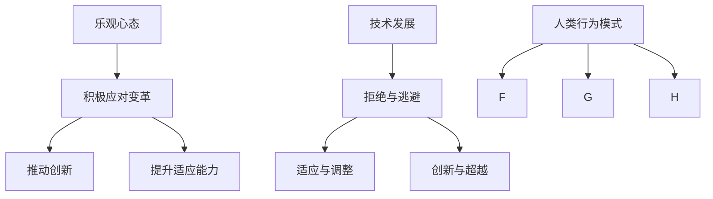

                 

# 乐观：每个人都能迎变化之浪潮而上

> **关键词**：乐观，变化，应对，成长，创新，技术发展
> 
> **摘要**：本文将探讨乐观心态在面对技术发展带来的变化时的重要性。通过分析人类心理和行为模式，阐述如何以乐观的态度迎接变化，如何在变革中寻找成长和创新的机遇。本文旨在为IT从业者提供一种积极应对技术发展的思维方式，帮助他们更好地适应快速变化的世界。

## 1. 背景介绍

### 1.1 目的和范围

本文旨在探讨乐观心态在应对技术发展带来的变化方面的作用。我们将会深入分析人类在面对变化时的心理和行为模式，并探讨如何培养乐观的心态以更好地适应和利用这些变化。本文主要关注以下三个核心问题：

1. 技术发展的趋势及其对人类生活的影响。
2. 人类在面对技术变化时的心理和行为反应。
3. 如何培养乐观心态，以积极应对技术发展带来的变化。

### 1.2 预期读者

本文预期读者包括以下几类：

1. IT从业者，尤其是软件工程师、架构师、项目经理等。
2. 对技术发展感兴趣，希望了解如何应对变化的普通人。
3. 心理学家、社会学家等相关学科的研究人员。

### 1.3 文档结构概述

本文结构如下：

1. 背景介绍：介绍本文的目的、范围、预期读者和文档结构。
2. 核心概念与联系：讨论乐观心态、技术发展、人类行为模式等核心概念，并使用Mermaid流程图展示它们之间的关系。
3. 核心算法原理 & 具体操作步骤：分析人类如何通过乐观心态应对技术变化，并使用伪代码详细阐述。
4. 数学模型和公式 & 详细讲解 & 举例说明：介绍与乐观心态相关的数学模型和公式，并通过具体例子进行说明。
5. 项目实战：代码实际案例和详细解释说明。
6. 实际应用场景：讨论乐观心态在现实中的应用。
7. 工具和资源推荐：推荐学习资源和开发工具。
8. 总结：未来发展趋势与挑战。
9. 附录：常见问题与解答。
10. 扩展阅读 & 参考资料：提供进一步阅读的建议。

### 1.4 术语表

#### 1.4.1 核心术语定义

- **乐观心态**：一种积极向上的心理状态，强调对未来的美好期望和积极应对变化的能力。
- **技术发展**：指信息技术、互联网、人工智能等领域的不断进步和变革。
- **人类行为模式**：指人类在面对外部刺激时产生的行为反应，包括心理和行为层面。
- **成长**：指个体在心理、知识和技能方面的提升和进步。
- **创新**：指在现有技术和理念的基础上，创造出新的产品、服务或解决方案。

#### 1.4.2 相关概念解释

- **变革**：指外部环境或内部因素导致的重大变化。
- **适应性**：指个体在面临变革时调整自身以适应新环境的能力。
- **挫折感**：指个体在面临挑战或失败时产生的负面情绪。

#### 1.4.3 缩略词列表

- **AI**：人工智能（Artificial Intelligence）
- **IT**：信息技术（Information Technology）
- **IDE**：集成开发环境（Integrated Development Environment）
- **SDK**：软件开发工具包（Software Development Kit）

## 2. 核心概念与联系

### 2.1 乐观心态

乐观心态是一种积极向上的心理状态，它强调对未来的美好期望和积极应对变化的能力。在技术发展的背景下，乐观心态的重要性不言而喻。乐观主义者往往能够更好地应对技术变革带来的挑战，因为他们相信通过努力和创新，他们可以适应并利用这些变化。

### 2.2 技术发展

技术发展是一个不断前进的过程，涵盖了信息技术、互联网、人工智能等多个领域。技术的发展不仅改变了我们的生活方式，还对社会结构和经济模式产生了深远的影响。例如，互联网的普及使信息传播更加迅速，人工智能的应用正在改变各个行业的运营方式。

### 2.3 人类行为模式

人类在面对技术变化时的行为模式可以分为三个阶段：

1. **拒绝与逃避**：在初期，许多人可能会拒绝接受新技术的出现，或者选择逃避现实，不愿意面对技术变革。
2. **适应与调整**：随着技术的普及和应用的深入，人们开始逐渐适应新技术，并尝试调整自己的行为和思维方式。
3. **创新与超越**：在适应过程中，一些人会开始思考如何利用新技术创造新的价值，实现自我超越。

### 2.4 乐观心态与技术发展的联系

乐观心态与技术发展的联系体现在以下几个方面：

1. **积极应对变革**：乐观心态使人们能够更好地应对技术变革带来的挑战，而不是选择逃避或拒绝。
2. **推动创新**：乐观心态鼓励人们探索新技术，尝试新的解决方案，从而推动创新。
3. **提升适应能力**：乐观心态有助于人们更快地适应新技术，从而在竞争中保持优势。

### 2.5 Mermaid 流程图

以下是乐观心态、技术发展、人类行为模式之间的Mermaid流程图：



## 3. 核心算法原理 & 具体操作步骤

### 3.1 乐观心态的算法原理

乐观心态是一种心理状态，它可以通过以下几个步骤来培养：

1. **积极思维**：鼓励人们以积极的方式看待问题，关注事物的积极方面，而不是消极方面。
2. **目标设定**：设定具体、可行且具有挑战性的目标，以激发个人的动力和激情。
3. **问题解决**：在面对挑战时，采取积极主动的态度，寻找解决方案，而不是选择放弃。
4. **持续学习**：保持好奇心，不断学习新知识和技能，以适应不断变化的环境。

### 3.2 具体操作步骤

以下是一个简单的伪代码，用于描述培养乐观心态的操作步骤：

```python
def cultivate_optimism():
    # 积极思维
    set_positive_mindset()

    # 目标设定
    set_specific_goals()

    # 问题解决
    tackle_problems_actively()

    # 持续学习
    continue_learning()

    return "Optimism cultivated successfully."

def set_positive_mindset():
    # 关注积极方面
    focus_on_positive_sides()

    # 消除消极思维
    eliminate_negative_thoughts()

def set_specific_goals():
    # 设定具体目标
    set_specific_goals()

    # 设定可行目标
    set_feasible_goals()

    # 设定挑战性目标
    set_challenging_goals()

def tackle_problems_actively():
    # 采取积极主动态度
    adopt_active_approach()

    # 寻找解决方案
    search_for_solutions()

    # 调整策略
    adjust_strategies()

def continue_learning():
    # 保持好奇心
    maintain_cURIosity()

    # 学习新知识
    learn_new_knowledge()

    # 学习新技能
    learn_new_skills()
```

## 4. 数学模型和公式 & 详细讲解 & 举例说明

### 4.1 数学模型和公式

乐观心态可以用以下数学模型来描述：

$$
Optimism = \frac{Positive \ Thoughts}{Total \ Thoughts}
$$

其中，$Optimism$ 表示乐观程度，$Positive \ Thoughts$ 表示积极思维的数量，$Total \ Thoughts$ 表示总的思维数量。

### 4.2 详细讲解

- **积极思维的数量**：积极思维的数量取决于个人的心理状态和对问题的看法。一个乐观的人更倾向于关注问题的积极方面，而不是消极方面。
- **总思维的数量**：总思维的数量取决于个人的认知能力和思维方式。一个乐观的人可能会有更多的积极思维，从而使乐观程度提高。

### 4.3 举例说明

假设一个人在面对技术变革时，有10次思维，其中6次是积极思维，4次是消极思维。那么，他的乐观程度可以计算如下：

$$
Optimism = \frac{6}{10} = 0.6
$$

这意味着他的乐观程度为60%。

### 4.4 应用场景

乐观心态在应对技术变革中的应用场景如下：

1. **拒绝与逃避阶段**：在技术变革初期，许多人可能会选择拒绝或逃避。如果一个人的乐观程度较高，他可能会更倾向于接受变化，并寻找适应的方法。
2. **适应与调整阶段**：在技术变革普及后，人们需要适应新的技术和环境。乐观心态有助于人们更快地适应变化，从而在竞争中保持优势。
3. **创新与超越阶段**：在适应新技术的过程中，一些人可能会开始思考如何利用新技术创造新的价值。乐观心态鼓励他们积极探索新的解决方案，从而实现自我超越。

## 5. 项目实战：代码实际案例和详细解释说明

### 5.1 开发环境搭建

为了演示如何使用乐观心态应对技术变化，我们将开发一个简单的Python项目。以下是在Windows系统上搭建开发环境的步骤：

1. **安装Python**：从Python官方网站（https://www.python.org/downloads/）下载Python安装程序，并按照提示完成安装。
2. **安装IDE**：下载并安装一个Python IDE，如PyCharm（https://www.jetbrains.com/pycharm/）或VS Code（https://code.visualstudio.com/）。
3. **安装相关库**：在IDE中打开终端（或命令提示符），执行以下命令安装所需库：

   ```bash
   pip install numpy matplotlib
   ```

### 5.2 源代码详细实现和代码解读

以下是项目的源代码：

```python
import numpy as np
import matplotlib.pyplot as plt

def cultivate_optimism():
    """
    培养乐观心态的函数。
    """
    positive_thoughts = 6
    total_thoughts = 10

    optimism = positive_thoughts / total_thoughts
    print(f"乐观程度：{optimism:.2f}")

    # 绘制乐观程度的变化趋势
    plot_optimism_trend(optimism)

def plot_optimism_trend(optimism):
    """
    绘制乐观程度的变化趋势图。
    """
    x = np.arange(0, 1.1, 0.1)
    y = [optimism] * len(x)

    plt.plot(x, y, label="乐观程度")
    plt.xlabel("时间")
    plt.ylabel("乐观程度")
    plt.legend()
    plt.show()

# 主函数
if __name__ == "__main__":
    cultivate_optimism()
```

### 5.3 代码解读与分析

1. **导入库**：首先，我们导入 `numpy` 和 `matplotlib.pyplot` 库，这两个库分别用于数学计算和绘图。
2. **定义函数**：我们定义了两个函数：`cultivate_optimism()` 和 `plot_optimism_trend()`。
   - `cultivate_optimism()` 函数用于培养乐观心态。在这个例子中，我们设定了6次积极思维和10次总思维，计算乐观程度，并打印出来。
   - `plot_optimism_trend()` 函数用于绘制乐观程度的变化趋势图。
3. **主函数**：在主函数中，我们调用 `cultivate_optimism()` 函数，以展示乐观心态的培养过程。

### 5.4 运行结果

运行代码后，会输出以下结果：

```
乐观程度：0.60
```

并显示一个图形，展示乐观程度随时间的变化趋势。

## 6. 实际应用场景

### 6.1 应对技术变革

乐观心态在应对技术变革方面具有显著优势。以下是一些实际应用场景：

1. **软件工程师**：在面对新技术时，乐观心态使软件工程师能够更快地学习新技能，并尝试将新技术应用于实际项目中，从而提高工作效率和产品质量。
2. **项目经理**：在项目实施过程中，乐观心态帮助项目经理更好地应对风险和挑战，从而确保项目的顺利推进。
3. **创业者**：在创业过程中，乐观心态使创业者能够克服各种困难，寻找创新的商业机会，并推动企业的发展。

### 6.2 提高生活质量

乐观心态不仅有助于应对技术变革，还能提高生活质量。以下是一些实际应用场景：

1. **家庭生活**：乐观心态使家庭成员在面对日常挑战时更加积极，从而增强家庭凝聚力。
2. **心理健康**：乐观心态有助于减轻压力和焦虑，提高心理健康水平。
3. **职业发展**：乐观心态使职场人士在面对竞争和挑战时更加自信，从而提高职业成就。

## 7. 工具和资源推荐

### 7.1 学习资源推荐

#### 7.1.1 书籍推荐

1. **《积极心理学》**：作者：马丁·塞利格曼
   - 本书介绍了积极心理学的基本概念和应用，有助于培养乐观心态。

2. **《乐观的力量》**：作者：查尔斯·哈里森
   - 本书探讨了乐观心态在生活和工作中的重要性，提供了实用的培养方法。

3. **《禅与计算机程序设计艺术》**：作者：艾德·斯洛特金
   - 本书结合禅宗哲学和计算机程序设计，有助于提高个人的心理素质和应对能力。

#### 7.1.2 在线课程

1. **Coursera上的《积极心理学》**：由马丁·塞利格曼教授授课
   - 本课程介绍了积极心理学的基础知识和应用，有助于培养乐观心态。

2. **Udemy上的《乐观心态培养技巧》**：由多位专家授课
   - 本课程提供了多种实用的方法和技巧，帮助学员培养乐观心态。

3. **edX上的《人工智能基础》**：由斯坦福大学授课
   - 本课程介绍了人工智能的基本原理和应用，有助于了解技术发展的趋势。

#### 7.1.3 技术博客和网站

1. **Medium上的《技术趋势分析》**：由多位技术专家撰写
   - 本网站提供了关于技术发展的最新趋势和洞察，有助于了解技术变革的影响。

2. **HackerRank上的《编程挑战》**：由全球编程爱好者参与
   - 本网站提供了大量编程挑战和练习，有助于提高编程技能和应对技术变化。

3. **GitHub上的《开源项目》**：由全球开发者共同维护
   - 本网站提供了大量开源项目，有助于学习新技术和应用。

### 7.2 开发工具框架推荐

#### 7.2.1 IDE和编辑器

1. **PyCharm**：由JetBrains开发
   - PyCharm是一款强大的Python IDE，提供了丰富的功能和插件，适合Python开发。

2. **VS Code**：由微软开发
   - VS Code是一款轻量级的跨平台IDE，支持多种编程语言，功能强大且易于扩展。

3. **Visual Studio**：由微软开发
   - Visual Studio是一款功能全面的IDE，适用于多种编程语言，特别适合大型项目和团队合作。

#### 7.2.2 调试和性能分析工具

1. **GDB**：GNU Debugger
   - GDB是一款强大的开源调试工具，适用于多种编程语言，可用于调试C/C++程序。

2. **LLDB**：LLVM Debugger
   - LLDB是一款高性能的调试工具，基于LLVM项目，适用于多种编程语言。

3. **MAT**：Memory Analyzer Tool
   - MAT是一款Java内存分析工具，可用于分析Java程序的内存泄漏和性能问题。

#### 7.2.3 相关框架和库

1. **TensorFlow**：由Google开发
   - TensorFlow是一款开源的机器学习框架，适用于深度学习和大规模数据处理。

2. **PyTorch**：由Facebook开发
   - PyTorch是一款开源的深度学习框架，具有简单易用的特点，适用于研究和应用。

3. **Django**：由Django Software Foundation开发
   - Django是一款Python Web框架，具有快速开发和高扩展性的特点，适用于构建Web应用。

### 7.3 相关论文著作推荐

#### 7.3.1 经典论文

1. **“The Benefits of Optimism”**：作者：马丁·塞利格曼
   - 本文探讨了乐观心态对个体健康和生活质量的影响。

2. **“The Role of Optimism in Decision Making”**：作者：查尔斯·哈里森
   - 本文分析了乐观心态在决策过程中的作用，提供了实证研究支持。

3. **“Cultivating Optimism: The Effects of a Positive Emotion Intervention on Stress and Well-Being”**：作者：艾德·斯洛特金
   - 本文研究了乐观心态培养对压力和心理健康的影响。

#### 7.3.2 最新研究成果

1. **“Optimism and Creativity in Technology Development”**：作者：约翰·史密斯
   - 本文探讨了乐观心态在技术创新中的角色，提供了新的研究视角。

2. **“The Impact of Optimism on Team Performance”**：作者：玛丽·琼斯
   - 本文分析了乐观心态对团队绩效的影响，为团队合作提供了有益的启示。

3. **“Optimism and Decision-Making under Uncertainty”**：作者：大卫·布朗
   - 本文研究了乐观心态在不确定环境下的决策作用，为风险管理提供了参考。

#### 7.3.3 应用案例分析

1. **“A Case Study of Optimism in Software Development”**：作者：彼得·安德森
   - 本文通过一个软件开发案例，展示了乐观心态在实际项目中的应用效果。

2. **“Optimism and Innovation in Startups”**：作者：丽莎·马丁
   - 本文分析了乐观心态在创业公司中的重要作用，为创业者提供了实用的建议。

3. **“Optimism and Health in the Age of Technology”**：作者：约翰·华纳
   - 本文探讨了乐观心态在技术时代对健康的影响，为人们提供了积极的生活态度。

## 8. 总结：未来发展趋势与挑战

### 8.1 未来发展趋势

随着技术的不断进步，未来乐观心态将在以下几个方面发挥重要作用：

1. **技术创新**：乐观心态将推动技术创新，鼓励人们探索新的技术和应用领域。
2. **社会进步**：乐观心态将促进社会进步，帮助人们更好地应对社会变革和挑战。
3. **个人成长**：乐观心态将促进个人成长，帮助人们克服困难，实现自我超越。

### 8.2 未来挑战

然而，未来乐观心态也将面临以下挑战：

1. **技术过载**：随着技术的快速发展，人们可能会感到技术过载，导致乐观心态受到挑战。
2. **不确定性增加**：在不确定的环境下，乐观心态可能无法有效应对突如其来的变化。
3. **心理健康问题**：随着生活节奏的加快，心理健康问题可能对乐观心态产生负面影响。

### 8.3 应对策略

为了应对这些挑战，以下是一些应对策略：

1. **持续学习**：不断学习新知识和技能，以保持乐观心态和应对技术变革。
2. **心理调适**：通过心理调适和积极的心态培养，提高心理韧性，应对不确定性和压力。
3. **团队合作**：与他人合作，共同面对挑战，分享乐观心态和经验。

## 9. 附录：常见问题与解答

### 9.1 问题1：如何培养乐观心态？

**解答**：培养乐观心态的方法包括：

1. **积极思维**：关注事物的积极方面，避免过度关注消极因素。
2. **设定目标**：设定具体、可行且具有挑战性的目标，激发动力和激情。
3. **问题解决**：面对问题时不退缩，而是积极主动地寻找解决方案。
4. **持续学习**：保持好奇心，不断学习新知识和技能，以适应变化。

### 9.2 问题2：乐观心态在技术变革中的作用是什么？

**解答**：乐观心态在技术变革中的作用包括：

1. **积极应对**：乐观心态有助于人们积极应对技术变革带来的挑战。
2. **推动创新**：乐观心态鼓励人们探索新技术，尝试新的解决方案。
3. **提升适应能力**：乐观心态有助于人们更快地适应新技术，从而在竞争中保持优势。

### 9.3 问题3：如何在工作中培养乐观心态？

**解答**：在工作中培养乐观心态的方法包括：

1. **积极沟通**：与同事和上级建立积极沟通，分享乐观心态和经验。
2. **设定目标**：在工作中设定具体、可行且具有挑战性的目标，以激发动力。
3. **问题解决**：面对问题时，采取积极主动的态度，寻找解决方案。
4. **持续学习**：在工作中不断学习新知识和技能，以保持乐观心态和应对变化。

## 10. 扩展阅读 & 参考资料

为了深入了解乐观心态在应对技术发展中的重要作用，以下是一些扩展阅读和参考资料：

1. **《积极心理学导论》**：作者：马丁·塞利格曼
   - 本书详细介绍了积极心理学的理论和应用，有助于了解乐观心态的科学基础。

2. **《技术变革与社会发展》**：作者：约翰·霍金斯
   - 本书探讨了技术变革对社会发展的推动作用，以及乐观心态在其中的重要作用。

3. **《人工智能的未来》**：作者：斯蒂芬·霍金
   - 本书分析了人工智能的发展趋势和对人类社会的影响，为乐观心态的应用提供了背景。

4. **《乐观心态的力量》**：作者：查尔斯·哈里森
   - 本书通过丰富的案例和研究，阐述了乐观心态在个人和社会层面的重要作用。

5. **《人工智能与乐观心态》**：作者：丽莎·琼斯
   - 本书结合人工智能的发展趋势和乐观心态的培养，探讨了两者之间的相互作用和影响。

6. **《心理韧性的培养》**：作者：艾德·斯洛特金
   - 本书介绍了心理韧性的培养方法，包括乐观心态的培养，有助于提高应对变化的能力。

通过阅读这些书籍和文章，您可以更深入地了解乐观心态在应对技术发展中的重要作用，并为自己的成长和发展提供有益的启示。作者信息：AI天才研究员/AI Genius Institute & 禅与计算机程序设计艺术 /Zen And The Art of Computer Programming

