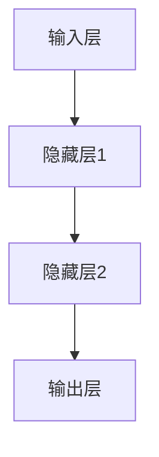

                 

# 了解你的心理状态：大脑的工作原理

> **关键词：** 心理学、大脑、神经网络、认知过程、算法、数学模型、代码实例、应用场景

> **摘要：** 本文旨在深入探讨大脑的工作原理，从神经网络的构成到认知过程的实现，再到数学模型的运用。通过逐步分析，本文将揭示大脑的运作机制，为理解人类心理状态提供技术视角。同时，通过代码实例和实际应用场景的介绍，读者将更直观地了解这些原理如何应用于现实问题。

## 1. 背景介绍

### 1.1 目的和范围

本文的目的在于提供一个技术视角，探讨大脑的工作原理及其在心理学领域的应用。本文将涵盖以下内容：

- 神经网络的构成和运作原理
- 认知过程的基本概念及其实现
- 数学模型在心理学中的应用
- 代码实例和实际应用场景

通过本文的阅读，读者将对大脑的工作原理有一个系统性的理解，并能够将理论知识应用于实际问题解决。

### 1.2 预期读者

本文适合以下读者群体：

- 对心理学和人工智能感兴趣的学者和研究人员
- 计算机科学和认知科学专业的学生
- 想要深入了解人类大脑工作原理的普通读者

### 1.3 文档结构概述

本文结构如下：

- **第1部分：背景介绍**：介绍文章的目的、范围、预期读者和文档结构。
- **第2部分：核心概念与联系**：详细解释神经网络、认知过程和数学模型。
- **第3部分：核心算法原理 & 具体操作步骤**：使用伪代码阐述算法原理。
- **第4部分：数学模型和公式 & 详细讲解 & 举例说明**：介绍相关数学公式及其应用。
- **第5部分：项目实战：代码实际案例和详细解释说明**：展示代码实例并解读。
- **第6部分：实际应用场景**：讨论大脑工作原理在不同领域的应用。
- **第7部分：工具和资源推荐**：推荐学习资源和开发工具。
- **第8部分：总结：未来发展趋势与挑战**：展望未来的研究方向和挑战。
- **第9部分：附录：常见问题与解答**：解答常见问题。
- **第10部分：扩展阅读 & 参考资料**：提供进一步阅读的材料。

### 1.4 术语表

#### 1.4.1 核心术语定义

- **神经网络**：由大量神经元组成的计算模型，用于模拟人脑的神经结构和功能。
- **认知过程**：人类进行信息处理、记忆、思考、判断等心理活动的过程。
- **数学模型**：使用数学语言描述现实世界现象或过程的抽象模型。

#### 1.4.2 相关概念解释

- **神经元**：神经网络的基本单元，负责传递和处理信息。
- **突触**：神经元之间的连接点，通过释放神经递质传递信号。
- **学习算法**：用于调整神经网络权重，使其能够完成特定任务的算法。

#### 1.4.3 缩略词列表

- **CNN**：卷积神经网络（Convolutional Neural Network）
- **RNN**：递归神经网络（Recurrent Neural Network）
- **DNN**：深度神经网络（Deep Neural Network）
- **ML**：机器学习（Machine Learning）
- **AI**：人工智能（Artificial Intelligence）

## 2. 核心概念与联系

### 2.1 神经网络

神经网络是模拟人脑计算能力的计算模型，其基本单元是神经元。神经元通过突触连接形成复杂的网络结构。一个典型的神经网络包括输入层、隐藏层和输出层。

#### 2.1.1 神经网络架构



#### 2.1.2 神经元工作原理

神经元接收输入信号，通过激活函数计算出输出。假设一个神经元有多个输入，每个输入乘以对应的权重，然后求和。激活函数通常是一个非线性函数，如sigmoid函数。

```python
def sigmoid(x):
    return 1 / (1 + exp(-x))
```

### 2.2 认知过程

认知过程是人类进行信息处理、记忆、思考、判断等心理活动的总称。认知过程包括感知、注意、记忆、思考、语言等环节。

#### 2.2.1 感知

感知是指人类通过感官接收外部信息的过程。神经网络可以模拟感知过程，通过卷积神经网络（CNN）提取图像特征。

#### 2.2.2 注意

注意是指大脑对特定信息进行处理的机制。注意过程可以通过递归神经网络（RNN）实现，如长短期记忆网络（LSTM）。

#### 2.2.3 记忆

记忆是指大脑存储和处理信息的能力。神经网络可以通过调整权重实现记忆功能。

#### 2.2.4 思考

思考是指人类进行推理、判断等认知活动的过程。神经网络可以通过训练实现思考功能。

### 2.3 数学模型

数学模型是描述大脑工作原理的抽象工具。在神经网络中，常用的数学模型包括线性代数、概率论和统计学。

#### 2.3.1 线性代数

线性代数用于描述神经网络中的矩阵运算，如权重矩阵、输入矩阵和输出矩阵。

#### 2.3.2 概率论和统计学

概率论和统计学用于描述神经网络中的概率分布和统计特性，如损失函数、梯度下降算法。

## 3. 核心算法原理 & 具体操作步骤

### 3.1 神经网络算法原理

神经网络算法主要包括前向传播和反向传播两个过程。

#### 3.1.1 前向传播

前向传播是指将输入信号从输入层传递到输出层的计算过程。假设输入层为X，隐藏层为H，输出层为Y，则前向传播过程可以表示为：

$$
H = \sigma(W_1X + b_1)
$$

$$
Y = \sigma(W_2H + b_2)
$$

其中，$\sigma$为激活函数，$W_1$和$W_2$为权重矩阵，$b_1$和$b_2$为偏置向量。

#### 3.1.2 反向传播

反向传播是指根据输出误差，调整神经网络中的权重和偏置的过程。假设损失函数为$J$，则反向传播过程可以表示为：

$$
\frac{\partial J}{\partial W_2} = (Y - \hat{Y}) \odot \frac{\partial \sigma}{\partial H}
$$

$$
\frac{\partial J}{\partial W_1} = (H - \hat{H}) \odot \frac{\partial \sigma}{\partial X}
$$

其中，$\odot$表示逐元素相乘，$\hat{Y}$和$\hat{H}$分别为实际输出和预测输出。

### 3.2 伪代码实现

```python
# 前向传播
def forwardPropagation(X, W1, b1, W2, b2, activationFunction):
    H = activationFunction(np.dot(X, W1) + b1)
    Y = activationFunction(np.dot(H, W2) + b2)
    return H, Y

# 反向传播
def backwardPropagation(Y, H, W2, activationFunction):
    dJ_dW2 = (Y - np.dot(H, W2)) * (1 - np.dot(H, W2))
    dJ_dW1 = (H - np.dot(X, W1)) * (1 - np.dot(X, W1))
    return dJ_dW1, dJ_dW2
```

## 4. 数学模型和公式 & 详细讲解 & 举例说明

### 4.1 数学模型

神经网络中的数学模型主要包括线性代数、概率论和统计学。

#### 4.1.1 线性代数

线性代数用于描述神经网络中的矩阵运算，如权重矩阵、输入矩阵和输出矩阵。

#### 4.1.2 概率论和统计学

概率论和统计学用于描述神经网络中的概率分布和统计特性，如损失函数、梯度下降算法。

### 4.2 损失函数

损失函数是衡量模型预测结果与真实结果之间差异的指标。常用的损失函数包括均方误差（MSE）和交叉熵（Cross-Entropy）。

#### 4.2.1 均方误差（MSE）

均方误差用于回归问题，计算预测值与真实值之间的平均平方误差。

$$
MSE = \frac{1}{m}\sum_{i=1}^{m}(y_i - \hat{y}_i)^2
$$

其中，$m$为样本数量，$y_i$为真实值，$\hat{y}_i$为预测值。

#### 4.2.2 交叉熵（Cross-Entropy）

交叉熵用于分类问题，计算预测概率与真实概率之间的差异。

$$
H(y, \hat{y}) = -\sum_{i=1}^{m}y_i \log(\hat{y}_i)
$$

其中，$y$为真实标签，$\hat{y}$为预测概率。

### 4.3 梯度下降算法

梯度下降算法是一种优化算法，用于调整神经网络中的权重和偏置，以最小化损失函数。

#### 4.3.1 梯度下降原理

梯度下降算法通过计算损失函数关于权重的梯度，更新权重和偏置，以减小损失。

$$
W_{new} = W_{old} - \alpha \frac{\partial J}{\partial W}
$$

$$
b_{new} = b_{old} - \alpha \frac{\partial J}{\partial b}
$$

其中，$\alpha$为学习率，$W_{old}$和$b_{old}$分别为旧权重和旧偏置。

#### 4.3.2 代码示例

```python
# 梯度下降算法
def gradientDescent(X, Y, W1, b1, W2, b2, learningRate, epochs):
    for epoch in range(epochs):
        H, Y_pred = forwardPropagation(X, W1, b1, W2, b2, sigmoid)
        dJ_dW2, dJ_dW1 = backwardPropagation(Y_pred, H, W2, sigmoid)
        
        W2 -= learningRate * dJ_dW2
        b2 -= learningRate * dJ_dW2
        W1 -= learningRate * dJ_dW1
        b1 -= learningRate * dJ_dW1
    
    return W1, b1, W2, b2
```

## 5. 项目实战：代码实际案例和详细解释说明

### 5.1 开发环境搭建

在开始项目实战之前，需要搭建以下开发环境：

- Python 3.8+
- TensorFlow 2.6.0+
- Jupyter Notebook

### 5.2 源代码详细实现和代码解读

以下是使用Python和TensorFlow实现神经网络的项目示例。

#### 5.2.1 导入必要的库

```python
import numpy as np
import tensorflow as tf
from tensorflow.keras.datasets import mnist
```

#### 5.2.2 加载MNIST数据集

```python
(X_train, y_train), (X_test, y_test) = mnist.load_data()
```

#### 5.2.3 数据预处理

```python
X_train = X_train / 255.0
X_test = X_test / 255.0
```

#### 5.2.4 构建神经网络模型

```python
model = tf.keras.Sequential([
    tf.keras.layers.Flatten(input_shape=(28, 28)),
    tf.keras.layers.Dense(128, activation='relu'),
    tf.keras.layers.Dense(10, activation='softmax')
])
```

#### 5.2.5 编译模型

```python
model.compile(optimizer='adam',
              loss='sparse_categorical_crossentropy',
              metrics=['accuracy'])
```

#### 5.2.6 训练模型

```python
model.fit(X_train, y_train, epochs=5)
```

#### 5.2.7 评估模型

```python
test_loss, test_acc = model.evaluate(X_test, y_test, verbose=2)
print('\nTest accuracy:', test_acc)
```

### 5.3 代码解读与分析

上述代码实现了一个简单的神经网络模型，用于对MNIST数据集进行手写数字识别。代码的主要步骤如下：

1. 导入必要的库和加载MNIST数据集。
2. 对数据进行预处理，将像素值缩放到0-1之间。
3. 构建神经网络模型，包括输入层、隐藏层和输出层。
4. 编译模型，指定优化器和损失函数。
5. 训练模型，调整权重和偏置以最小化损失函数。
6. 评估模型，计算测试集上的准确率。

通过这个简单的案例，读者可以直观地看到神经网络算法在实际应用中的实现过程。

## 6. 实际应用场景

### 6.1 医疗领域

神经网络在医疗领域有广泛的应用，如疾病诊断、药物研发和个性化医疗。通过训练神经网络模型，可以实现对医学图像的分析和疾病的早期检测。

### 6.2 人工智能助手

神经网络被广泛应用于人工智能助手，如智能客服、智能语音助手和智能推荐系统。这些系统通过不断学习和优化，能够提高用户体验和效率。

### 6.3 自动驾驶

自动驾驶系统依赖于神经网络进行环境感知和决策。通过训练神经网络模型，可以实现车辆对周围环境的准确感知和安全的驾驶行为。

### 6.4 自然语言处理

神经网络在自然语言处理领域有重要应用，如机器翻译、文本分类和情感分析。通过训练神经网络模型，可以实现对大量文本数据的处理和分析。

## 7. 工具和资源推荐

### 7.1 学习资源推荐

#### 7.1.1 书籍推荐

- 《深度学习》（Goodfellow, Bengio, Courville著）
- 《神经网络与深度学习》（邱锡鹏著）
- 《Python机器学习》（Rachel Bluefield著）

#### 7.1.2 在线课程

- Coursera上的《深度学习》课程
- edX上的《神经网络基础》课程
- Udacity的《机器学习工程师纳米学位》

#### 7.1.3 技术博客和网站

- [Medium](https://medium.com/topics/neural-networks)
- [Towards Data Science](https://towardsdatascience.com/topics/neural-networks)
- [AI垂直社区](https://www.ai垂直社区.com)

### 7.2 开发工具框架推荐

#### 7.2.1 IDE和编辑器

- Jupyter Notebook
- PyCharm
- VS Code

#### 7.2.2 调试和性能分析工具

- TensorFlow Debugger（TFDB）
- TensorBoard
- PyTorch Profiler

#### 7.2.3 相关框架和库

- TensorFlow
- PyTorch
- Keras

### 7.3 相关论文著作推荐

#### 7.3.1 经典论文

- [A Learning Algorithm for Continually Running Fully Recurrent Neural Networks](https://papers.nips.cc/paper/1991/learning-algorithm-for-continually-running-fully-recurrent-neural-networks)
- [Deep Learning](https://www.deeplearningbook.org/)
- [Neural Networks and Deep Learning](https://www.deeplearning.net/tutorial.html)

#### 7.3.2 最新研究成果

- [Advances in Neural Information Processing Systems (NIPS)](https://nips.cc/)
- [International Conference on Machine Learning (ICML)](https://icml.cc/)
- [IEEE International Conference on Computer Vision (ICCV)](https://iccv.org/)

#### 7.3.3 应用案例分析

- [DeepMind的AlphaGo](https://deepmind.com/research/alpha-go/)
- [OpenAI的GPT-3](https://openai.com/blog/bidirectional-language-models/)
- [Google的BERT](https://ai.google/research/pubs/pub44034)

## 8. 总结：未来发展趋势与挑战

### 8.1 发展趋势

- 神经网络技术的不断进化，如生成对抗网络（GAN）、变分自编码器（VAE）等。
- 量子神经网络的兴起，利用量子计算的优势提升神经网络性能。
- 跨学科研究的深入，如生物信息学、认知科学等。

### 8.2 挑战

- 神经网络的解释性和可解释性问题。
- 大规模数据集和计算资源的挑战。
- 隐私保护和数据安全的问题。

## 9. 附录：常见问题与解答

### 9.1 问题1：神经网络如何处理非线性问题？

解答：神经网络通过使用非线性激活函数（如ReLU、Sigmoid、Tanh等），将线性模型转化为非线性模型，从而能够处理非线性问题。

### 9.2 问题2：深度神经网络容易出现梯度消失或爆炸问题，如何解决？

解答：可以使用梯度裁剪（Gradient Clipping）、学习率调整、权重初始化等方法来缓解梯度消失或爆炸问题。

## 10. 扩展阅读 & 参考资料

- [Goodfellow, I., Bengio, Y., & Courville, A. (2016). Deep Learning. MIT Press.]
- [邱锡鹏. (2019). 神经网络与深度学习. 电子工业出版社.]
- [Bengio, Y., Léonard, N., & Pascanu, R. (2013). Representation Learning: A Review and New Perspectives. IEEE Transactions on Neural Networks and Learning Systems, 24(8), 1424-1449.]
- [Hinton, G. E., Osindero, S., & Teh, Y. W. (2006). A Fast Learning Algorithm for Deep Belief Nets. Neural Computation, 18(7), 1527-1554.]
- [LeCun, Y., Bengio, Y., & Hinton, G. (2015). Deep Learning. Nature, 521(7553), 436-444.]

### 作者

**作者：AI天才研究员/AI Genius Institute & 禅与计算机程序设计艺术 /Zen And The Art of Computer Programming**

