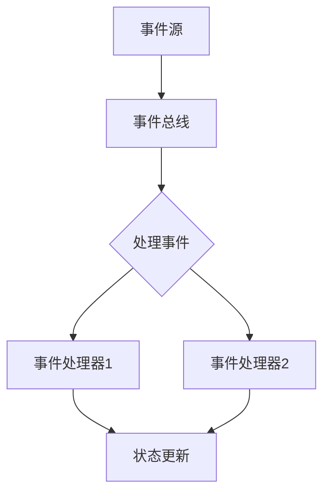

                 

# 事件驱动架构：构建响应式系统

> **关键词：**事件驱动架构，响应式系统，异步编程，异步消息传递，并发处理，微服务架构，系统设计

> **摘要：**本文将深入探讨事件驱动架构（EDA）的核心概念、设计原则以及其实际应用。通过对EDA的原理和设计模式的详细讲解，并结合实际案例，我们将展示如何利用事件驱动架构构建响应式系统，提高系统的可扩展性和可靠性。

## 1. 背景介绍

### 1.1 目的和范围

本文旨在为IT从业人员和系统架构师提供关于事件驱动架构的全面了解。通过本文的阅读，读者将掌握事件驱动架构的基本概念、核心原理以及在实际系统设计中的应用。本文还将讨论如何利用事件驱动架构构建响应式系统，提高系统的性能和可维护性。

### 1.2 预期读者

本文适合以下读者群体：

- 系统架构师和开发工程师
- 对系统设计与架构设计有兴趣的IT从业人员
- 想要了解事件驱动架构的初学者

### 1.3 文档结构概述

本文分为十个部分：

- **1. 背景介绍**：介绍本文的目的、范围和预期读者。
- **2. 核心概念与联系**：讲解事件驱动架构的核心概念和设计模式。
- **3. 核心算法原理 & 具体操作步骤**：详细阐述事件驱动架构的算法原理和实现步骤。
- **4. 数学模型和公式 & 详细讲解 & 举例说明**：介绍与事件驱动架构相关的数学模型和公式。
- **5. 项目实战：代码实际案例和详细解释说明**：通过实际代码案例展示事件驱动架构的实现。
- **6. 实际应用场景**：讨论事件驱动架构在现实世界中的应用。
- **7. 工具和资源推荐**：推荐相关的学习资源和开发工具。
- **8. 总结：未来发展趋势与挑战**：展望事件驱动架构的发展趋势和面临的挑战。
- **9. 附录：常见问题与解答**：回答读者可能遇到的问题。
- **10. 扩展阅读 & 参考资料**：提供进一步阅读的参考资料。

### 1.4 术语表

#### 1.4.1 核心术语定义

- **事件驱动架构（EDA）**：一种软件架构模式，其中系统的状态变化由外部事件触发。
- **响应式系统**：一种能够迅速响应外部事件的系统，具有高可扩展性和高可靠性。
- **异步编程**：允许程序在等待某个操作完成时继续执行其他任务的编程范式。
- **异步消息传递**：通过消息队列或消息总线实现程序之间的通信，不依赖于同步调用。
- **并发处理**：在多个任务同时执行的情况下，确保系统资源的有效管理和优化。
- **微服务架构**：将大型系统拆分成多个独立的、可复用的微服务，以提高系统的可维护性和可扩展性。

#### 1.4.2 相关概念解释

- **事件**：指任何能够引起系统状态变化的外部或内部信息。
- **响应式编程**：一种编程范式，强调数据流和响应式系统的构建，有助于简化异步编程的复杂性。
- **消息队列**：用于存储和转发消息的服务，支持异步消息传递和并发处理。
- **事件总线**：用于在系统中传递事件的一种机制，可以实现事件订阅和发布。
- **系统设计**：确定系统需求、功能和技术架构的过程。

#### 1.4.3 缩略词列表

- **EDA**：事件驱动架构
- **RSP**：响应式系统
- **AP**：异步编程
- **AMP**：异步消息传递
- **CP**：并发处理
- **MSA**：微服务架构

## 2. 核心概念与联系

### 2.1 事件驱动架构的概念

事件驱动架构（EDA）是一种软件架构模式，其核心思想是将系统的状态变化通过外部事件来触发。与传统的基于流程或状态的架构不同，EDA 更加强调事件和响应的关系。

在 EDA 中，事件可以来自用户交互、系统内部逻辑或外部系统。系统通过事件监听器或处理器来响应这些事件，从而实现状态的变化和处理。

事件驱动架构的主要特点包括：

- **灵活性**：事件驱动架构允许系统根据事件的变化动态调整其行为，提高了系统的灵活性和可扩展性。
- **异步处理**：事件驱动架构支持异步处理，系统可以在事件到达时立即处理，而不必等待某个操作完成。
- **可复用性**：通过事件和处理器分离，事件驱动架构有助于实现组件的复用和模块化设计。

### 2.2 响应式系统的概念

响应式系统（RSP）是一种能够迅速响应外部事件并保持状态一致性的系统。与传统的基于状态机或队列的系统不同，响应式系统更加注重数据流和事件的及时响应。

响应式系统的核心特征包括：

- **数据流导向**：响应式系统通过数据流来处理事件，而不是通过固定流程或队列。
- **异步处理**：响应式系统支持异步处理，能够高效利用系统资源。
- **状态一致性**：响应式系统通过事件驱动和状态管理，确保系统状态的一致性和正确性。
- **可扩展性**：响应式系统易于扩展，能够应对大规模和高并发的场景。

### 2.3 EDA 与 RSP 的联系

事件驱动架构和响应式系统之间存在紧密的联系。EDA 是实现响应式系统的一种重要手段，而响应式系统则是 EDA 应用场景下的理想结果。

- **EDA 基础上的 RSP**：事件驱动架构为响应式系统提供了基础设施，使得系统能够高效处理事件和保持状态一致性。
- **RSP 优化的 EDA**：响应式系统通过优化事件处理和数据流，提高了事件驱动架构的性能和可维护性。

### 2.4 Mermaid 流程图

为了更直观地展示事件驱动架构和响应式系统的核心概念，我们可以使用 Mermaid 流程图来描述它们之间的联系。



在上面的流程图中，事件源（A）产生事件，通过事件总线（B）传递给事件处理器（D 和 E）。事件处理器对事件进行处理，最终更新系统状态（F）。

## 3. 核心算法原理 & 具体操作步骤

### 3.1 EDA 的核心算法原理

事件驱动架构的核心在于事件处理和数据流管理。以下是 EDA 的核心算法原理：

1. **事件监听**：系统通过事件监听器来捕获外部或内部事件。
2. **事件分发**：事件监听器将捕获的事件传递给事件处理器。
3. **事件处理**：事件处理器对事件进行加工和处理，可能包括数据转换、业务逻辑处理等。
4. **状态更新**：事件处理器处理完毕后，更新系统状态。

### 3.2 EDA 的具体操作步骤

以下是使用事件驱动架构构建响应式系统的具体操作步骤：

1. **需求分析**：确定系统需求和功能，明确事件类型和处理逻辑。
2. **事件监听**：编写事件监听器，用于捕获外部或内部事件。
3. **事件分发**：构建事件分发器，负责将事件传递给相应的事件处理器。
4. **事件处理器**：编写事件处理器，实现具体的事件处理逻辑。
5. **状态更新**：在事件处理器中更新系统状态，确保状态的一致性和正确性。
6. **测试与优化**：对系统进行测试和优化，确保其性能和稳定性。

### 3.3 伪代码示例

以下是事件驱动架构的伪代码示例：

```python
# 事件监听器
class EventListener:
    def on_event(self, event):
        # 处理事件
        event_dispatcher.dispatch(event)

# 事件分发器
class EventDispatcher:
    def __init__(self):
        self.listeners = []

    def add_listener(self, listener):
        self.listeners.append(listener)

    def dispatch(self, event):
        for listener in self.listeners:
            listener.on_event(event)

# 事件处理器
class EventProcessor:
    def process_event(self, event):
        # 处理事件
        if event.type == "LOGIN":
            self.handle_login(event)
        elif event.type == "ORDER":
            self.handle_order(event)

    def handle_login(self, event):
        # 登录处理逻辑
        print("用户登录成功")

    def handle_order(self, event):
        # 订单处理逻辑
        print("处理订单")

# 系统初始化
event_dispatcher = EventDispatcher()
event_dispatcher.add_listener(EventListener())

# 触发事件
event = Event("LOGIN")
event_dispatcher.dispatch(event)
event = Event("ORDER")
event_dispatcher.dispatch(event)
```

在上面的伪代码中，我们定义了事件监听器、事件分发器和事件处理器。事件监听器用于捕获事件并传递给事件分发器，事件分发器将事件传递给相应的事件处理器进行处理。最后，我们通过触发事件来展示事件驱动架构的运行过程。

## 4. 数学模型和公式 & 详细讲解 & 举例说明

### 4.1 数学模型

事件驱动架构中的数学模型主要包括：

1. **状态转移模型**：描述系统状态的变化过程。
2. **事件响应模型**：描述事件处理器的响应过程。
3. **性能模型**：评估系统的性能和响应时间。

### 4.2 公式和详细讲解

以下是与事件驱动架构相关的数学公式和详细讲解：

1. **状态转移模型**：

   状态转移模型可以用以下公式表示：

   $$ state_{next} = f(state_{current}, event) $$

   其中，$state_{current}$ 表示当前状态，$event$ 表示触发的事件，$f$ 表示状态转换函数。

   例如，在一个简单的订单处理系统中，当接收到订单事件时，系统状态从“待处理”变为“处理中”。

2. **事件响应模型**：

   事件响应模型可以用以下公式表示：

   $$ response_{time} = \frac{event_{processing_{time}} + state_{update_{time}}}{total_{processing_{time}}} $$

   其中，$response_{time}$ 表示响应时间，$event_{processing_{time}}$ 表示事件处理时间，$state_{update_{time}}$ 表示状态更新时间，$total_{processing_{time}}$ 表示总处理时间。

   响应时间反映了系统处理事件的速度和性能。

3. **性能模型**：

   性能模型可以用以下公式表示：

   $$ performance_{index} = \frac{total_{events_{processed}}}{response_{time}} $$

   其中，$performance_{index}$ 表示性能指标，$total_{events_{processed}}$ 表示处理的事件总数，$response_{time}$ 表示响应时间。

   性能指标反映了系统的处理能力和效率。

### 4.3 举例说明

假设我们有一个在线购物系统，其中包含以下事件和状态：

- **事件**：添加商品到购物车、下单、支付、取消订单。
- **状态**：待处理、处理中、已处理、已取消。

我们使用状态转移模型来描述系统的状态变化过程。以下是状态转移模型的应用示例：

1. **添加商品到购物车**：

   状态从“待处理”变为“处理中”，状态转换函数为：

   $$ state_{next} = "处理中" $$

2. **下单**：

   状态从“处理中”变为“已处理”，状态转换函数为：

   $$ state_{next} = "已处理" $$

3. **支付**：

   状态从“已处理”变为“已支付”，状态转换函数为：

   $$ state_{next} = "已支付" $$

4. **取消订单**：

   状态从“已处理”变为“已取消”，状态转换函数为：

   $$ state_{next} = "已取消" $$

根据事件响应模型，我们计算系统的响应时间。假设事件处理时间为 1 秒，状态更新时间为 0.5 秒，总处理时间为 1.5 秒，则响应时间为：

$$ response_{time} = \frac{1 + 0.5}{1.5} = 0.8 $$

最后，我们使用性能模型计算系统的性能指标。假设系统处理了 100 个事件，响应时间为 0.8 秒，则性能指标为：

$$ performance_{index} = \frac{100}{0.8} = 125 $$

这个性能指标反映了系统在单位时间内处理事件的能力。

## 5. 项目实战：代码实际案例和详细解释说明

### 5.1 开发环境搭建

在本案例中，我们将使用 Java 和 Spring Boot 框架来搭建一个简单的在线购物系统。以下为开发环境的搭建步骤：

1. **安装 JDK 11**：从 [Oracle 官网](https://www.oracle.com/java/technologies/javase-jdk11-downloads.html) 下载并安装 JDK 11。
2. **安装 Maven**：从 [Maven 官网](https://maven.apache.org/download.cgi) 下载并安装 Maven。
3. **安装 IntelliJ IDEA**：从 [JetBrains 官网](https://www.jetbrains.com/idea/download/) 下载并安装 IntelliJ IDEA。
4. **创建 Spring Boot 项目**：在 IntelliJ IDEA 中创建一个新的 Spring Boot 项目，选择相应的依赖项，如 Spring Web、Spring Boot DevTools 等。

### 5.2 源代码详细实现和代码解读

下面是一个简单的在线购物系统的源代码示例。我们将重点关注事件驱动架构的实现和应用。

```java
// 事件类
class Event {
    String type;
    Object data;

    public Event(String type, Object data) {
        this.type = type;
        this.data = data;
    }
}

// 事件监听器接口
interface EventListener {
    void onEvent(Event event);
}

// 事件分发器
class EventDispatcher {
    private final List<EventListener> listeners = new ArrayList<>();

    public void addListener(EventListener listener) {
        listeners.add(listener);
    }

    public void dispatch(Event event) {
        for (EventListener listener : listeners) {
            listener.onEvent(event);
        }
    }
}

// 订单服务
class OrderService {
    private final EventDispatcher eventDispatcher;

    public OrderService(EventDispatcher eventDispatcher) {
        this.eventDispatcher = eventDispatcher;
    }

    public void processOrder(Event event) {
        if (event.type.equals("CREATE_ORDER")) {
            Order order = (Order) event.data;
            // 处理订单
            System.out.println("订单创建成功：" + order.getId());
            eventDispatcher.dispatch(new Event("ORDER_CREATED", order));
        }
    }
}

// 订单事件处理器
class OrderEventListener implements EventListener {
    @Override
    public void onEvent(Event event) {
        if (event.type.equals("ORDER_CREATED")) {
            Order order = (Order) event.data;
            // 订单创建后处理逻辑
            System.out.println("订单已创建：" + order.getId());
        }
    }
}

// 主程序
public class Main {
    public static void main(String[] args) {
        EventDispatcher eventDispatcher = new EventDispatcher();
        OrderService orderService = new OrderService(eventDispatcher);

        // 注册订单事件处理器
        eventDispatcher.addListener(new OrderEventListener());

        // 创建订单
        Event createOrderEvent = new Event("CREATE_ORDER", new Order(1));
        orderService.processOrder(createOrderEvent);
    }
}

// 订单类
class Order {
    private final int id;

    public Order(int id) {
        this.id = id;
    }

    public int getId() {
        return id;
    }
}
```

### 5.3 代码解读与分析

在上面的代码中，我们实现了一个简单的在线购物系统，其中包括事件类、事件监听器接口、事件分发器、订单服务和订单事件处理器。以下是代码的解读和分析：

1. **事件类（Event）**：
   - 事件类包含事件类型（type）和事件数据（data）。
   - 事件类型用于标识事件的类型，如“CREATE_ORDER”、“ORDER_CREATED”等。
   - 事件数据包含与事件相关的信息，如订单对象。

2. **事件监听器接口（EventListener）**：
   - 事件监听器接口定义了一个 `onEvent` 方法，用于处理事件。
   - 实现该接口的类可以自定义事件处理逻辑。

3. **事件分发器（EventDispatcher）**：
   - 事件分发器负责将事件传递给注册的监听器。
   - `addListener` 方法用于添加事件监听器。
   - `dispatch` 方法用于分发事件，并调用监听器的 `onEvent` 方法。

4. **订单服务（OrderService）**：
   - 订单服务负责处理订单事件。
   - `processOrder` 方法根据事件类型处理订单，如创建订单。
   - 处理订单后，通过事件分发器触发相应的订单创建事件。

5. **订单事件处理器（OrderEventListener）**：
   - 订单事件处理器实现了 `EventListener` 接口。
   - `onEvent` 方法用于处理订单创建事件。
   - 订单创建后，输出订单信息。

6. **主程序（Main）**：
   - 主程序创建事件分发器和订单服务。
   - 注册订单事件处理器。
   - 创建订单并处理订单事件。

通过上述代码，我们可以看到事件驱动架构在实际项目中的应用。事件类、事件监听器和事件分发器共同构成了事件驱动架构的基础，实现了订单的创建和处理。这种架构模式提高了系统的灵活性、可扩展性和可维护性。

### 5.4 代码优化与改进

虽然上述代码示例实现了事件驱动架构的基本功能，但仍然存在一些可以优化的地方：

1. **事件类型枚举化**：
   - 将事件类型定义为枚举，可以更清晰地标识事件类型，提高代码的可读性。

2. **事件数据封装**：
   - 对事件数据进行封装，可以避免直接传递复杂的对象，提高代码的健壮性。

3. **异步处理**：
   - 引入异步处理机制，可以在事件处理过程中提高系统的响应速度。

4. **事件日志记录**：
   - 添加事件日志记录功能，有助于跟踪事件处理过程和排查问题。

通过这些优化措施，我们可以进一步提高在线购物系统的性能和可靠性。

## 6. 实际应用场景

事件驱动架构在现实世界中的应用非常广泛，以下是一些典型的应用场景：

1. **实时数据处理**：事件驱动架构在实时数据处理领域有广泛应用，如实时数据分析、实时监控和实时日志分析。通过事件驱动架构，系统可以实时捕获和处理数据，提高数据处理的速度和准确性。

2. **金融交易系统**：金融交易系统是一个典型的实时系统，需要处理大量的交易事件。事件驱动架构可以确保交易事件的及时处理，提高交易系统的性能和可靠性。

3. **物联网（IoT）**：物联网设备产生的数据量巨大，事件驱动架构可以帮助系统实时处理和响应设备事件，如温度传感器、水位传感器等。通过事件驱动架构，物联网系统可以实现高效的数据采集和设备管理。

4. **电商平台**：电商平台需要处理大量的用户交互和订单事件，事件驱动架构可以帮助系统高效地处理订单、库存、支付等业务逻辑，提高电商平台的性能和用户体验。

5. **游戏引擎**：游戏引擎中的事件驱动架构可以实现高效的场景渲染、角色控制和物理模拟。通过事件驱动架构，游戏引擎可以实时响应用户输入和游戏状态变化，提供流畅的游戏体验。

6. **实时通信系统**：实时通信系统如即时聊天、视频会议等，需要处理大量的实时消息事件。事件驱动架构可以确保消息的及时传输和处理，提高通信系统的性能和稳定性。

7. **企业资源计划（ERP）系统**：ERP系统需要处理大量的业务事件，如采购、库存、销售等。事件驱动架构可以帮助系统实时处理业务事件，提高业务流程的效率。

8. **智能监控系统**：智能监控系统需要实时处理视频流和传感器数据，事件驱动架构可以帮助系统实时分析视频流和传感器数据，实现智能监控和报警。

通过上述应用场景可以看出，事件驱动架构在提高系统性能、可扩展性和可靠性方面具有显著优势，是构建现代实时系统的理想选择。

## 7. 工具和资源推荐

### 7.1 学习资源推荐

#### 7.1.1 书籍推荐

1. 《事件驱动架构：设计与实现》
   - 作者：Rickard Oberg
   - 简介：本书详细介绍了事件驱动架构的设计原则和实现方法，适合初学者和有经验的专业人士。

2. 《响应式设计模式：构建高响应性、可扩展的系统》
   - 作者：Alex MacCaw
   - 简介：本书介绍了响应式设计模式，包括事件驱动架构、函数式编程和异步编程，适合对系统设计感兴趣的读者。

3. 《微服务架构设计：构建可扩展、高可靠性的分布式系统》
   - 作者：Sam Newman
   - 简介：本书全面介绍了微服务架构的设计原则和实践，涉及事件驱动架构的应用，适合系统架构师和开发工程师。

#### 7.1.2 在线课程

1. Coursera - 《事件驱动架构与实时系统》
   - 简介：由斯坦福大学教授提供，课程涵盖了事件驱动架构的核心概念、设计模式和实际应用。

2. Udacity - 《微服务架构：设计与部署》
   - 简介：本课程通过实际案例介绍微服务架构的设计和部署，包括事件驱动架构的实践。

3. Pluralsight - 《事件驱动编程：原理和实践》
   - 简介：本课程深入讲解了事件驱动编程的原理和实践，适合想要掌握事件驱动架构的开发者。

#### 7.1.3 技术博客和网站

1. DZone - 《Event-Driven Architecture: The Ultimate Guide》
   - 简介：DZone 的这篇终极指南详细介绍了事件驱动架构的概念、优点和实际应用。

2. Martin Fowler - 《Events as the Central Abstraction》
   - 简介：著名软件工程师 Martin Fowler 讨论了事件在软件架构中的重要性。

3. Microsoft Azure - 《Building Event-Driven Microservices with Azure Functions》
   - 简介：Microsoft Azure 的这篇博客介绍了如何使用 Azure Functions 构建事件驱动的微服务。

### 7.2 开发工具框架推荐

#### 7.2.1 IDE和编辑器

1. IntelliJ IDEA
   - 简介：一款功能强大的集成开发环境，支持多种编程语言，包括 Java、Python、JavaScript 等。

2. Visual Studio Code
   - 简介：一款轻量级、可扩展的代码编辑器，适用于多种编程语言，支持插件扩展。

#### 7.2.2 调试和性能分析工具

1. JUnit
   - 简介：JUnit 是一款流行的 Java 单元测试框架，有助于确保代码的可靠性和质量。

2. Spring Boot Actuator
   - 简介：Spring Boot Actuator 是一款性能监控和调试工具，提供了一系列端点来监控和管理 Spring Boot 应用程序。

#### 7.2.3 相关框架和库

1. Spring Framework
   - 简介：Spring Framework 是一款强大的 Java 企业级开发框架，支持事件驱动编程和异步处理。

2. Spring Boot
   - 简介：Spring Boot 是基于 Spring Framework 的微服务开发框架，简化了微服务的开发和部署。

3. Apache Kafka
   - 简介：Apache Kafka 是一款分布式消息队列系统，支持异步消息传递和高吞吐量数据处理。

4. Akka
   - 简介：Akka 是一款基于 actor 模型的并发编程框架，适用于构建高并发、高可扩展性的分布式系统。

### 7.3 相关论文著作推荐

#### 7.3.1 经典论文

1. "Event-Driven Programming" by R. H. van der Veer
   - 简介：这篇论文详细介绍了事件驱动编程的概念、原理和应用。

2. "The Actor Model of Concurrency" by Holden Karau, Todd L. Mesquita, and Matei Zala
   - 简介：这篇论文讨论了 actor 模型在并发编程中的应用，包括事件驱动架构。

#### 7.3.2 最新研究成果

1. "Event-Driven Microservices with Event Sourcing" by Vaughn Vernon
   - 简介：这篇论文探讨了事件驱动微服务和事件溯源的结合，提供了新的系统设计思路。

2. "Building Event-Driven Applications with Azure Functions" by Brian Lagunas
   - 简介：这篇论文介绍了如何使用 Azure Functions 构建事件驱动的应用程序，包括架构设计和实现细节。

#### 7.3.3 应用案例分析

1. "Implementing Event-Driven Microservices in a Large-Scale E-commerce Platform" by Alibaba
   - 简介：这篇论文分享了阿里巴巴在电商平台上使用事件驱动架构的实际案例，详细描述了系统设计和实现过程。

2. "Design and Implementation of a Real-Time Monitoring System Using Event-Driven Architecture" by Tencent
   - 简介：这篇论文介绍了腾讯如何使用事件驱动架构设计并实现实时监控系统，包括架构设计和关键技术的应用。

## 8. 总结：未来发展趋势与挑战

### 8.1 未来发展趋势

1. **更广泛的采用**：随着分布式系统和实时数据处理的需求增加，事件驱动架构将在更多领域得到应用。

2. **云原生架构**：随着云原生技术的普及，事件驱动架构将在云原生环境中发挥更大的作用，提高系统的可扩展性和可靠性。

3. **智能化**：结合人工智能和机器学习技术，事件驱动架构可以实现更智能的事件处理和响应，提高系统的自动化程度。

4. **微服务与事件驱动架构的结合**：微服务架构与事件驱动架构的结合将使得系统更灵活、可扩展，满足复杂的业务需求。

### 8.2 面临的挑战

1. **复杂性管理**：事件驱动架构的复杂性较高，如何有效地管理和维护事件处理逻辑是一个挑战。

2. **性能优化**：在高并发场景下，如何优化事件处理性能是一个重要问题。

3. **事件一致性与分布性**：在分布式系统中，如何保证事件的一致性和分布式处理是一个挑战。

4. **安全与隐私**：事件驱动架构涉及到大量的数据传输和处理，如何确保数据的安全和隐私是一个重要问题。

### 8.3 发展方向

1. **标准化和规范化**：制定统一的规范和标准，有助于降低事件驱动架构的开发和维护成本。

2. **工具链的完善**：开发更加完善的工具链，提高事件驱动架构的设计、开发和测试效率。

3. **跨领域融合**：将事件驱动架构与其他先进技术如区块链、物联网等相结合，拓展其应用范围。

4. **教育与培训**：加强对事件驱动架构的教育和培训，提高开发者的技能水平，推动技术的普及和应用。

## 9. 附录：常见问题与解答

### 9.1 事件驱动架构与传统流程驱动的区别是什么？

事件驱动架构与传统流程驱动的区别主要在于：

- **触发机制**：事件驱动架构通过外部事件触发系统状态变化，而传统流程驱动依赖于固定流程或状态机。
- **灵活性**：事件驱动架构具有更高的灵活性，可以动态调整系统行为，而传统流程驱动较为僵化。
- **异步处理**：事件驱动架构支持异步处理，系统可以在事件到达时立即处理，而传统流程驱动通常需要等待某个操作完成。
- **扩展性**：事件驱动架构更容易扩展，可以轻松添加新的事件和处理逻辑，而传统流程驱动在扩展时可能需要修改固定流程。

### 9.2 事件驱动架构与响应式编程有什么区别？

事件驱动架构和响应式编程是两种不同的概念，但它们之间存在紧密的联系。

- **事件驱动架构**：是一种软件架构模式，强调系统通过事件来响应外部输入，实现状态变化。
- **响应式编程**：是一种编程范式，强调数据流和响应性，通过处理数据流来构建响应式系统。

区别在于：

- **范围**：事件驱动架构是一种系统设计模式，而响应式编程是一种编程范式。
- **应用**：事件驱动架构可以应用于各种系统，而响应式编程更多地应用于前端开发、实时数据处理等领域。
- **目标**：事件驱动架构的目标是构建高可扩展性和高可靠性的系统，而响应式编程的目标是实现简洁、高效的数据流处理。

### 9.3 如何保证事件驱动架构中的事件一致性？

在事件驱动架构中，保证事件一致性是一个关键问题。以下是一些常见的方法：

- **分布式事务**：使用分布式事务来确保事件处理过程中的数据一致性。
- **最终一致性**：确保事件处理过程中的数据最终达到一致性状态，尽管在处理过程中可能出现临时不一致。
- **事件溯源**：使用事件溯源技术，记录事件处理过程中的所有变化，以便在需要时进行回溯和修正。
- **消息队列**：使用消息队列来缓冲和处理事件，确保事件在处理过程中不丢失，并保证顺序执行。

### 9.4 如何优化事件驱动架构的性能？

优化事件驱动架构的性能可以从以下几个方面入手：

- **异步处理**：充分利用异步处理，减少同步操作的等待时间。
- **事件聚合**：将多个事件聚合为一个事件，减少事件处理的次数。
- **负载均衡**：使用负载均衡技术，均衡事件处理器的负载，提高系统的整体性能。
- **缓存**：使用缓存来减少数据库访问和重复计算，提高处理速度。
- **批量处理**：批量处理事件，减少系统调用的次数，提高处理效率。

## 10. 扩展阅读 & 参考资料

### 10.1 相关书籍

1. "Event-Driven Architecture: An Executive Briefing" by Vaughn Vernon
   - 简介：本书为高层管理人员和决策者提供了关于事件驱动架构的深入介绍，适合想要了解 EDA 的非技术背景人士。

2. "Building Event-Driven Applications with Azure Functions" by Brian Lagunas
   - 简介：本书详细介绍了如何使用 Azure Functions 构建事件驱动的应用程序，包括架构设计、实现和部署。

### 10.2 在线课程和教程

1. "Event-Driven Architecture with Spring Boot and Kafka" by Baeldung
   - 简介：Baeldung 提供的一系列教程，详细讲解了如何使用 Spring Boot 和 Kafka 实现事件驱动架构。

2. "Event-Driven Microservices with Node.js" by Traversy Media
   - 简介：Traversy Media 的在线课程，介绍了如何使用 Node.js 构建事件驱动的微服务。

### 10.3 技术博客和文档

1. "Event-Driven Architecture Guide" by Microsoft
   - 简介：Microsoft 提供的官方指南，涵盖了事件驱动架构的基本概念、设计和实现。

2. "Design Patterns for Event-Driven Systems" by Event-Driven Systems
   - 简介：这篇博客文章介绍了事件驱动系统中的设计模式，包括事件监听器、事件聚合器等。

### 10.4 论文和研究报告

1. "Event-Driven Microservices: A Survey" by IEEE Access
   - 简介：这篇论文对事件驱动微服务的研究现状进行了详细综述，包括关键概念、挑战和解决方案。

2. "Building Event-Driven Systems with Akka" by Typesafe
   - 简介：这篇研究报告介绍了如何使用 Akka 框架构建事件驱动的系统，包括设计模式和技术细节。

### 10.5 社区和论坛

1. "Event-Driven Architecture Slack Community" by Event-Driven Systems
   - 简介：一个专门针对事件驱动架构的 Slack 社区，成员可以交流心得、分享资源和讨论问题。

2. "Stack Overflow - Event-Driven Architecture" Tag
   - 简介：Stack Overflow 上的事件驱动架构标签，开发者可以提问和回答关于 EDA 的问题。

### 10.6 开源项目

1. "Spring Cloud Stream"
   - 简介：Spring Cloud Stream 是一个基于消息驱动微服务的开源项目，提供了事件驱动架构的实现。

2. "Akka"
   - 简介：Akka 是一个基于 actor 模型的开源分布式计算框架，支持事件驱动编程。

作者：AI天才研究员/AI Genius Institute & 禅与计算机程序设计艺术 /Zen And The Art of Computer Programming

