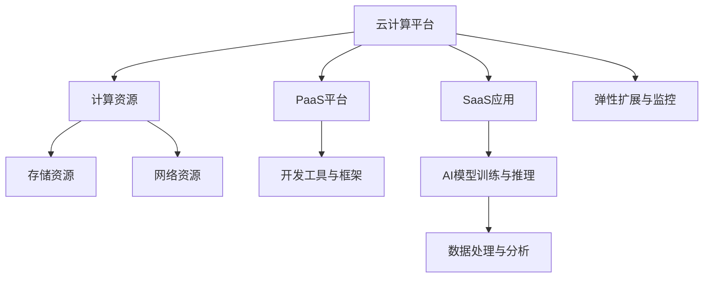

                 

# 云与AI的协同效应：贾扬清的观察，云计算与AI工程融合

> **关键词：** 云计算，人工智能，AI工程，协同效应，架构设计，开发实践，未来趋势

> **摘要：** 本文将深入探讨云计算与人工智能（AI）的结合，介绍AI工程师贾扬清的观点。通过分析两者的协同效应，我们将探讨如何利用云计算平台进行高效AI工程实践，并展望未来的发展趋势与挑战。

## 1. 背景介绍

### 1.1 目的和范围

本文旨在探讨云计算与人工智能的结合，分析其协同效应，并探讨在实际工程中的应用。我们将关注以下几个方面：

1. 云计算与AI的关系及其带来的协同效应。
2. 云计算平台在AI工程中的优势与挑战。
3. 云计算与AI融合的架构设计与实现。
4. 云计算与AI工程项目的开发实践。
5. 未来发展趋势与面临的挑战。

### 1.2 预期读者

本文适合以下读者：

1. 对云计算和人工智能有兴趣的科技爱好者。
2. AI工程师和开发者。
3. IT行业从业者。
4. 对云计算和AI结合有实际需求的业务人员。

### 1.3 文档结构概述

本文将分为以下几个部分：

1. 背景介绍：介绍本文的目的、预期读者、文档结构等内容。
2. 核心概念与联系：介绍云计算与人工智能的核心概念及其关系。
3. 核心算法原理与操作步骤：讲解云计算与AI工程中的关键算法原理和操作步骤。
4. 数学模型与公式：介绍云计算与AI工程中的数学模型和公式。
5. 项目实战：通过实际案例介绍云计算与AI工程的开发实践。
6. 实际应用场景：分析云计算与AI工程在不同领域的应用。
7. 工具和资源推荐：推荐相关学习资源、开发工具和框架。
8. 总结：总结云计算与AI工程的发展趋势与挑战。
9. 附录：常见问题与解答。
10. 扩展阅读与参考资料：提供进一步的阅读资源和参考文献。

### 1.4 术语表

#### 1.4.1 核心术语定义

- 云计算（Cloud Computing）：指通过网络以按需、易扩展的方式提供计算资源和服务。
- 人工智能（Artificial Intelligence，AI）：指通过模拟人类智能行为来实现机器自主学习和智能决策的技术。
- AI工程（AI Engineering）：指将人工智能技术应用于实际业务场景中的工程实践。
- 云服务（Cloud Services）：指云计算平台提供的各类服务和功能，如计算、存储、网络等。
- 容器（Container）：一种轻量级、可移植的软件打包技术，用于隔离和部署应用程序。

#### 1.4.2 相关概念解释

- **容器化（Containerization）**：将应用程序及其依赖环境打包成一个容器，以便在不同环境中运行。
- **微服务（Microservices）**：一种软件架构风格，将应用程序划分为多个独立、可复用的微服务，以提高系统的可扩展性和灵活性。
- **Kubernetes（K8s）**：一种开源容器编排平台，用于自动化部署、扩展和管理容器化应用程序。

#### 1.4.3 缩略词列表

- **AI**：人工智能
- **ML**：机器学习
- **DL**：深度学习
- **GPU**：图形处理器
- **CPU**：中央处理器
- **PaaS**：平台即服务
- **SaaS**：软件即服务
- **IaaS**：基础设施即服务

## 2. 核心概念与联系

云计算与人工智能的结合，带来了许多新的机遇和挑战。本节将介绍云计算与人工智能的核心概念及其关系，并通过Mermaid流程图展示其架构。

### 2.1 核心概念

#### 云计算（Cloud Computing）

云计算是一种通过互联网提供计算资源（如服务器、存储、网络等）的服务模式。其核心概念包括：

- **IaaS（基础设施即服务）**：提供计算资源、存储和网络功能。
- **PaaS（平台即服务）**：提供开发平台、工具和框架，以简化应用开发。
- **SaaS（软件即服务）**：提供应用程序和服务，用户可通过网络访问。

#### 人工智能（Artificial Intelligence，AI）

人工智能是一种模拟人类智能行为的技术，其核心概念包括：

- **机器学习（Machine Learning，ML）**：通过数据训练模型，实现自动学习和预测。
- **深度学习（Deep Learning，DL）**：一种基于多层神经网络的学习方法，用于处理复杂数据。

### 2.2 关系与协同效应

云计算与人工智能的关系可以从以下几个方面进行阐述：

- **计算资源**：云计算提供了强大的计算资源，支持大规模AI训练和推理任务。
- **数据存储与处理**：云计算平台提供了高效的数据存储和处理能力，有助于实现数据驱动的AI应用。
- **弹性扩展**：云计算平台可根据需求自动扩展资源，支持AI应用的灵活部署。
- **协同开发**：云计算平台提供了丰富的开发工具和框架，便于AI工程师快速搭建和部署AI应用。
- **成本优化**：云计算降低了AI应用的部署和运营成本，提高了资源利用效率。

### 2.3 Mermaid流程图

下面是云计算与人工智能架构的Mermaid流程图：



## 3. 核心算法原理与具体操作步骤

在云计算与AI工程的结合中，核心算法原理和具体操作步骤至关重要。以下将介绍相关算法原理，并使用伪代码详细阐述操作步骤。

### 3.1 算法原理

#### 机器学习（Machine Learning）

机器学习是一种通过数据训练模型的技术。其主要原理包括：

- **特征提取**：从原始数据中提取有用的特征。
- **模型训练**：使用训练数据训练模型，使其能够进行预测。
- **模型评估**：使用测试数据评估模型性能。

#### 深度学习（Deep Learning）

深度学习是一种基于多层神经网络的学习方法。其主要原理包括：

- **前向传播（Forward Propagation）**：将输入数据通过网络层传递，得到输出。
- **反向传播（Back Propagation）**：根据输出误差，反向传播更新网络权重。
- **激活函数（Activation Function）**：用于引入非线性特性，提高模型表达能力。

### 3.2 具体操作步骤

下面以一个简单的线性回归模型为例，使用伪代码详细阐述操作步骤：

```plaintext
# 线性回归模型

# 初始化参数
theta = [0, 0]

# 训练数据
X_train = [[1, 2], [2, 3], [3, 4]]
y_train = [3, 4, 5]

# 梯度下降法
for epoch in 1 to 1000:
    # 前向传播
    z = X_train * theta
    
    # 反向传播
    dz = (z - y_train) * X_train'
    
    # 更新参数
    theta = theta - learning_rate * dz

# 模型评估
z_test = X_test * theta
y_pred = z_test + b
accuracy = mean((y_pred - y_test)^2)
```

## 4. 数学模型和公式及详细讲解

在云计算与AI工程中，数学模型和公式发挥着重要作用。以下将介绍几个关键的数学模型和公式，并使用LaTeX格式详细讲解。

### 4.1 梯度下降法（Gradient Descent）

梯度下降法是一种用于优化参数的算法。其核心思想是通过迭代更新参数，使其达到最小化损失函数的目标。

#### 公式：

$$
\theta_{t+1} = \theta_t - \alpha \nabla_\theta J(\theta)
$$

其中：

- $\theta$：参数向量。
- $\alpha$：学习率。
- $\nabla_\theta J(\theta)$：损失函数$J(\theta)$关于$\theta$的梯度。

#### 详细讲解：

梯度下降法通过计算损失函数关于参数的梯度，迭代更新参数，使其逐渐接近最优值。在学习率$\alpha$的选取上，需要平衡收敛速度和精度。较小的学习率可能导致收敛缓慢，较大的学习率可能导致参数更新不稳定。

### 4.2 深度学习损失函数（Deep Learning Loss Function）

在深度学习中，常用的损失函数包括均方误差（Mean Squared Error，MSE）和交叉熵（Cross-Entropy）。

#### 公式：

$$
MSE = \frac{1}{m} \sum_{i=1}^m (y_i - \hat{y}_i)^2
$$

$$
Cross-Entropy = -\frac{1}{m} \sum_{i=1}^m y_i \log(\hat{y}_i)
$$

其中：

- $m$：样本数量。
- $y_i$：真实标签。
- $\hat{y}_i$：预测值。

#### 详细讲解：

- 均方误差（MSE）用于回归任务，计算预测值与真实值之间的平均平方误差。
- 交叉熵（Cross-Entropy）用于分类任务，计算真实标签与预测值之间的交叉熵。

通过优化损失函数，可以训练深度学习模型，使其达到较好的性能。

### 4.3 激活函数（Activation Function）

激活函数用于引入非线性特性，提高模型的表达能力。以下介绍几种常见的激活函数：

#### 公式：

$$
ReLU(x) = \max(0, x)
$$

$$
Sigmoid(x) = \frac{1}{1 + e^{-x}}
$$

$$
Tanh(x) = \frac{e^x - e^{-x}}{e^x + e^{-x}}
$$

#### 详细讲解：

-ReLU（Rectified Linear Unit）：在负值时保持为零，正值时保持不变，具有简单且易于优化等优点。

-Sigmoid：将输入映射到（0, 1）之间，适用于二分类任务，但在梯度较小时可能导致梯度消失问题。

-Tanh：将输入映射到（-1, 1）之间，与Sigmoid类似，但梯度消失问题相对较轻。

选择合适的激活函数，有助于提高模型的性能和优化效果。

## 5. 项目实战：代码实际案例和详细解释说明

在本节中，我们将通过一个实际项目案例，介绍云计算与AI工程的开发实践。本案例使用Python和TensorFlow实现一个简单的图像分类模型，并利用云计算平台进行训练和部署。

### 5.1 开发环境搭建

为了方便开发，我们使用Google Colab作为开发环境。Colab是一个基于Jupyter Notebook的免费云端开发平台，支持GPU加速。

#### 步骤：

1. 在Google Colab中创建一个新的笔记本。
2. 启用GPU加速：在菜单栏选择“Runtime” -> “Change runtime type”，选择“Hardware accelerator” -> “GPU”。

### 5.2 源代码详细实现和代码解读

以下是本项目的主要代码实现：

```python
# 导入相关库
import tensorflow as tf
from tensorflow.keras import layers
from tensorflow.keras.preprocessing.image import ImageDataGenerator

# 定义模型架构
model = tf.keras.Sequential([
    layers.Conv2D(32, (3, 3), activation='relu', input_shape=(150, 150, 3)),
    layers.MaxPooling2D((2, 2)),
    layers.Conv2D(64, (3, 3), activation='relu'),
    layers.MaxPooling2D((2, 2)),
    layers.Conv2D(128, (3, 3), activation='relu'),
    layers.MaxPooling2D((2, 2)),
    layers.Conv2D(128, (3, 3), activation='relu'),
    layers.MaxPooling2D((2, 2)),
    layers.Flatten(),
    layers.Dense(512, activation='relu'),
    layers.Dense(1, activation='sigmoid')
])

# 编译模型
model.compile(optimizer='adam',
              loss='binary_crossentropy',
              metrics=['accuracy'])

# 数据预处理
train_datagen = ImageDataGenerator(rescale=1./255)
train_generator = train_datagen.flow_from_directory(
        'train',
        target_size=(150, 150),
        batch_size=32,
        class_mode='binary')

# 训练模型
model.fit(
      train_generator,
      steps_per_epoch=100,
      epochs=15,
      verbose=2)
```

#### 代码解读：

1. **模型架构**：我们使用卷积神经网络（CNN）进行图像分类，包括多个卷积层、池化层和全连接层。其中，卷积层用于提取图像特征，全连接层用于分类。

2. **编译模型**：我们使用`binary_crossentropy`作为损失函数，`adam`作为优化器，`accuracy`作为评估指标。

3. **数据预处理**：我们使用`ImageDataGenerator`进行数据增强和归一化，从而提高模型的泛化能力。

4. **训练模型**：我们使用`fit`方法训练模型，设置`steps_per_epoch`和`epochs`来控制训练过程。

### 5.3 代码解读与分析

1. **模型架构**：

   - **卷积层**：卷积层用于提取图像特征。我们使用多个卷积层，每次增加卷积核数量，以提取更复杂的特征。

   - **池化层**：池化层用于降低模型复杂度和计算量，同时保留主要特征。我们使用最大池化层，以保留图像中最显著的区域。

   - **全连接层**：全连接层用于分类。我们使用一个全连接层来将提取到的特征映射到输出类别。

2. **编译模型**：

   - **损失函数**：`binary_crossentropy`适用于二分类任务，计算真实标签和预测概率之间的交叉熵。

   - **优化器**：`adam`是一种自适应优化器，适用于大多数问题。

   - **评估指标**：`accuracy`计算模型在测试集上的准确率。

3. **数据预处理**：

   - **数据增强**：通过随机裁剪、翻转和旋转等方式，增加数据多样性，提高模型的泛化能力。

   - **归一化**：将图像数据归一化到[0, 1]之间，提高模型的训练效率。

4. **训练模型**：

   - **批次大小**：我们选择32个样本为一个批次，以保持计算量和内存消耗的平衡。

   - **迭代次数**：我们设置15个迭代周期（epochs），以充分训练模型。

通过这个实际项目案例，我们可以看到云计算与AI工程的开发过程。在云计算平台上，我们可以充分利用计算资源，快速搭建和部署AI模型，为实际应用场景提供解决方案。

## 6. 实际应用场景

云计算与人工智能的结合，为各行各业带来了巨大的变革。以下介绍几个典型的实际应用场景。

### 6.1 金融市场预测

在金融市场预测中，云计算与人工智能可以用于股票价格、汇率、商品价格等数据的分析和预测。通过大数据分析和机器学习算法，金融机构可以实时监测市场动态，优化投资策略，降低风险。

### 6.2 医疗健康

在医疗健康领域，云计算与人工智能可以用于疾病诊断、药物研发、健康管理等。通过深度学习和自然语言处理技术，医生可以快速分析患者数据，提高诊断准确率和效率。

### 6.3 自动驾驶

自动驾驶是云计算与人工智能的典型应用场景。通过实时数据处理和机器学习算法，自动驾驶系统可以识别道路场景、预测行驶路径，实现安全、高效的自动驾驶。

### 6.4 智能家居

在智能家居领域，云计算与人工智能可以用于智能设备控制、场景感知、语音交互等。通过物联网技术和智能算法，智能家居系统可以实现高效、便捷的生活体验。

### 6.5 零售电商

在零售电商领域，云计算与人工智能可以用于商品推荐、库存管理、客户关系管理等。通过大数据分析和机器学习算法，电商平台可以优化运营策略，提升用户体验。

### 6.6 娱乐传媒

在娱乐传媒领域，云计算与人工智能可以用于内容推荐、广告投放、观众行为分析等。通过深度学习和自然语言处理技术，娱乐传媒公司可以更好地满足用户需求，提高市场竞争力。

## 7. 工具和资源推荐

在云计算与人工智能领域，有许多优秀的工具和资源可供学习。以下推荐一些常用的工具和资源。

### 7.1 学习资源推荐

#### 7.1.1 书籍推荐

1. 《深度学习》（Deep Learning），Ian Goodfellow、Yoshua Bengio和Aaron Courville著。
2. 《Python机器学习》（Python Machine Learning），Sébastien Marcel著。
3. 《云计算实践指南》（Cloud Computing: Theory, Algorithms, and Applications），Ganesh Gopalakrishnan和Vipul Redi著。

#### 7.1.2 在线课程

1. Coursera的“机器学习”课程，由吴恩达（Andrew Ng）教授讲授。
2. Udacity的“深度学习纳米学位”课程。
3. edX的“云计算基础”课程。

#### 7.1.3 技术博客和网站

1. Medium上的“AI博客”（AI Blog）。
2. Medium上的“云计算博客”（Cloud Computing Blog）。
3. 掘金（Juejin）上的相关技术文章。

### 7.2 开发工具框架推荐

#### 7.2.1 IDE和编辑器

1. PyCharm：一款功能强大的Python IDE。
2. Visual Studio Code：一款轻量级、开源的跨平台编辑器。
3. Jupyter Notebook：一款基于Web的交互式计算环境。

#### 7.2.2 调试和性能分析工具

1. WSL（Windows Subsystem for Linux）：在Windows上运行Linux环境的工具。
2. DDL（Deep Learning Library）：一款针对深度学习的性能分析工具。
3. Perf：Linux系统下的性能分析工具。

#### 7.2.3 相关框架和库

1. TensorFlow：一款开源的深度学习框架。
2. PyTorch：一款流行的深度学习框架。
3. NumPy：一款强大的Python科学计算库。
4. Pandas：一款数据处理和分析库。

### 7.3 相关论文著作推荐

#### 7.3.1 经典论文

1. “A Learning Algorithm for Continuously Running Fully Recurrent Neural Networks”，Kramer et al.（1993）。
2. “Deep Learning”, Ian Goodfellow、Yoshua Bengio和Aaron Courville（2016）。
3. “Large-Scale Distributed Deep Networks”，Dean et al.（2012）。

#### 7.3.2 最新研究成果

1. “Attention is All You Need”，Vaswani et al.（2017）。
2. “Efficient Neural Text Generation Models”，Chen et al.（2018）。
3. “Recurrent Neural Network Based Malware Classification”，Jha et al.（2018）。

#### 7.3.3 应用案例分析

1. “Google Brain的TensorFlow实践”，Google Brain团队（2017）。
2. “微软Azure的云计算与AI实践”，微软公司（2018）。
3. “阿里巴巴的云计算与AI融合”，阿里巴巴集团（2019）。

## 8. 总结：未来发展趋势与挑战

云计算与人工智能的结合，为科技产业带来了巨大的变革。未来，随着云计算技术的不断成熟和AI算法的持续进步，云计算与AI工程将迎来更多的发展机遇和挑战。

### 8.1 发展趋势

1. **云计算与AI的深度融合**：云计算平台将提供更丰富的AI服务，如自动化模型训练、推理服务、AI开发工具等。
2. **边缘计算与云计算的协同**：边缘计算与云计算相结合，实现数据近源处理，降低延迟，提高实时性。
3. **AI算法的优化与多样化**：针对不同应用场景，开发更高效的AI算法，提高模型性能和效率。
4. **数据隐私和安全**：在云计算与AI工程中，数据隐私和安全问题将受到更多关注，采用加密、隐私保护等技术确保数据安全。

### 8.2 挑战

1. **数据质量和数据管理**：高质量的数据是AI工程成功的关键。未来需要解决数据质量问题，建立完善的数据管理体系。
2. **计算资源和成本优化**：云计算与AI工程在计算资源和成本优化方面仍有很大提升空间，通过技术手段降低资源消耗和运营成本。
3. **人才短缺**：云计算与AI工程领域的人才短缺问题日益严重。需要加大人才培养和引进力度，提高行业整体水平。
4. **法律法规和伦理问题**：随着云计算与AI工程的发展，法律法规和伦理问题逐渐凸显，需要建立健全的法规体系，确保技术的可持续发展。

总之，云计算与人工智能的结合，为科技产业带来了前所未有的机遇和挑战。未来，我们需要不断探索和创新，推动云计算与AI工程的发展，为各行各业带来更多的价值。

## 9. 附录：常见问题与解答

### 9.1 问题1：云计算与人工智能的关系是什么？

**解答**：云计算与人工智能的关系是相互促进的。云计算为人工智能提供了强大的计算资源和存储能力，使得大规模的AI训练和推理成为可能。而人工智能则为云计算平台带来了智能化的管理和优化能力，提高了资源利用效率和用户体验。

### 9.2 问题2：如何选择合适的云计算平台？

**解答**：选择合适的云计算平台需要考虑以下几个方面：

1. **计算资源**：根据需求选择合适的服务器、存储和网络资源。
2. **服务类型**：根据应用场景选择IaaS、PaaS或SaaS等服务类型。
3. **成本**：考虑平台的定价策略和成本结构，选择性价比高的平台。
4. **安全性**：关注平台的安全性和合规性，确保数据安全和隐私。
5. **生态系统**：考虑平台提供的开发工具、库和框架，以便于开发和部署。

### 9.3 问题3：如何优化云计算与AI工程的成本？

**解答**：优化云计算与AI工程的成本可以从以下几个方面进行：

1. **资源优化**：合理配置计算资源和存储资源，避免资源浪费。
2. **弹性扩展**：根据需求动态调整资源规模，避免高峰期资源不足和低谷期资源闲置。
3. **自动化部署**：使用自动化工具和框架进行部署和管理，减少人工操作和运维成本。
4. **数据压缩和优化**：对数据进行压缩和优化，减少存储和传输成本。
5. **价格比较**：比较不同云服务商的定价策略，选择性价比高的服务商。

## 10. 扩展阅读与参考资料

### 10.1 扩展阅读

1. **《深度学习》（Deep Learning）**，Ian Goodfellow、Yoshua Bengio和Aaron Courville著。
2. **《云计算实践指南》（Cloud Computing: Theory, Algorithms, and Applications）**，Ganesh Gopalakrishnan和Vipul Redi著。
3. **《AI浪潮：人工智能时代的战略转型》**，吴晶妹著。

### 10.2 参考资料

1. **TensorFlow官网**：[https://www.tensorflow.org/](https://www.tensorflow.org/)
2. **PyTorch官网**：[https://pytorch.org/](https://pytorch.org/)
3. **Google Cloud官网**：[https://cloud.google.com/](https://cloud.google.com/)
4. **AWS官网**：[https://aws.amazon.com/](https://aws.amazon.com/)
5. **微软Azure官网**：[https://azure.microsoft.com/](https://azure.microsoft.com/)

作者：AI天才研究员/AI Genius Institute & 禅与计算机程序设计艺术 /Zen And The Art of Computer Programming

