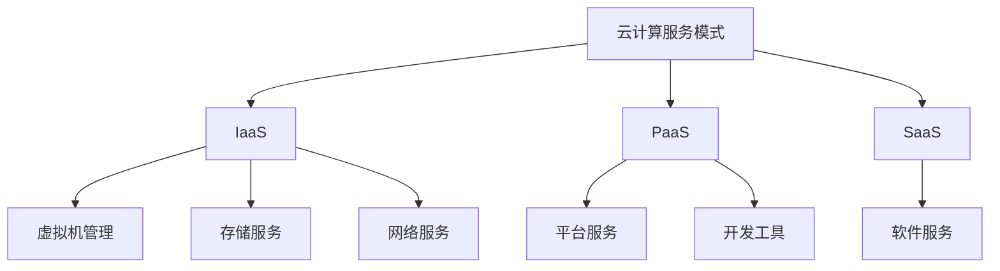
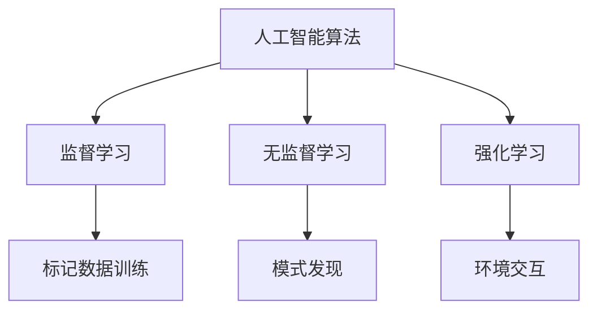
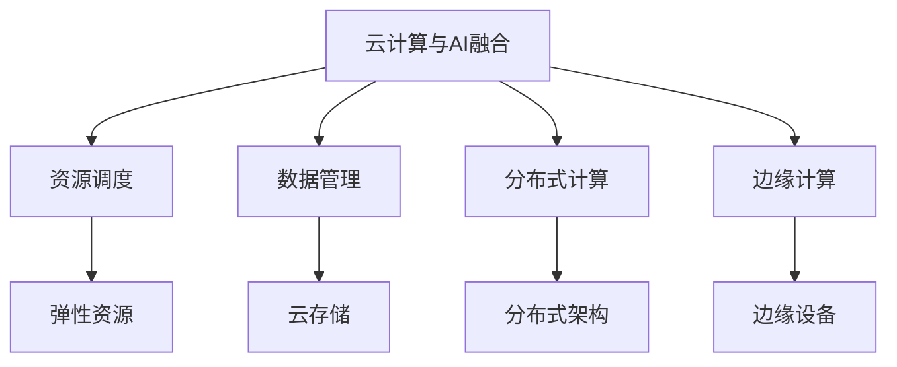

                 

# 云与AI的融合：贾扬清的独特视角，从阿里到Lepton AI的进化之路

> 关键词：云技术、人工智能、贾扬清、阿里云、Lepton AI、云计算架构、深度学习、边缘计算、人工智能应用场景、技术创新与发展

> 摘要：本文将深入探讨贾扬清在云计算与人工智能领域的独特视角，分析他从阿里巴巴到创立Lepton AI的进化之路。文章首先回顾了贾扬清在阿里巴巴的工作经历和贡献，接着详细解析了Lepton AI的技术理念和创新点，最后对云计算与人工智能的未来发展趋势进行了展望，旨在为读者提供对这一领域深刻的理解和洞察。

## 1. 背景介绍

### 1.1 目的和范围

本文旨在通过贾扬清的视角，探讨云计算与人工智能（AI）的深度融合，分析其从阿里巴巴到Lepton AI的职业发展过程中的关键决策和成就。文章将涵盖以下内容：

1. 贾扬清的职业生涯背景及在阿里巴巴的工作成就。
2. Lepton AI的创立初衷、技术理念及其在云计算与人工智能领域的创新点。
3. 云计算与人工智能结合的发展趋势和应用场景。
4. 未来云计算与人工智能融合面临的技术挑战和发展方向。

### 1.2 预期读者

本文适合对云计算、人工智能以及二者融合有浓厚兴趣的技术人员、工程师、研究人员和高校学生。同时，对于希望了解新兴技术发展趋势的企业管理者和技术决策者也将有所启发。

### 1.3 文档结构概述

本文结构如下：

1. **引言**：介绍云计算与人工智能融合的重要性及本文目的。
2. **背景介绍**：回顾贾扬清的职业生涯，包括在阿里巴巴和Lepton AI的经历。
3. **核心概念与联系**：阐述云计算与人工智能的核心概念及联系，使用Mermaid流程图展示架构。
4. **核心算法原理**：详细解析云计算与人工智能结合的核心算法原理和具体操作步骤。
5. **数学模型与公式**：介绍相关的数学模型和公式，并进行举例说明。
6. **项目实战**：通过实际代码案例展示云计算与人工智能的应用。
7. **实际应用场景**：分析云计算与人工智能在不同领域的应用场景。
8. **工具和资源推荐**：推荐学习资源和开发工具。
9. **总结**：展望云计算与人工智能的未来发展趋势。
10. **附录**：常见问题与解答。
11. **扩展阅读与参考资料**：提供进一步阅读的资源。

### 1.4 术语表

#### 1.4.1 核心术语定义

- **云计算**：通过互联网提供动态易扩展且经常是虚拟化的资源。
- **人工智能**：使计算机系统能够模拟人类智能行为的科学和工程领域。
- **边缘计算**：在靠近数据源的地方进行计算和处理，减轻云端负载。
- **深度学习**：一种人工智能方法，通过多层神经网络进行数据建模。

#### 1.4.2 相关概念解释

- **云计算架构**：云计算服务提供者架构的组成部分，包括基础设施即服务（IaaS）、平台即服务（PaaS）和软件即服务（SaaS）。
- **AI算法**：用于实现人工智能任务的算法，如神经网络、决策树和强化学习。

#### 1.4.3 缩略词列表

- **IaaS**：基础设施即服务
- **PaaS**：平台即服务
- **SaaS**：软件即服务

## 2. 核心概念与联系

云计算与人工智能（AI）的融合是当前技术发展的热点之一，其核心在于如何将AI算法与云计算资源高效结合，实现计算能力的最大化利用。以下将介绍云计算与人工智能的核心概念及其相互联系，并通过Mermaid流程图展示其架构。

### 2.1 云计算架构

云计算架构主要分为三类服务模式：基础设施即服务（IaaS）、平台即服务（PaaS）和软件即服务（SaaS）。

- **IaaS**：提供虚拟化的计算资源，如虚拟机、存储和网络，用户可以根据需要配置和管理资源。
- **PaaS**：提供一个平台，使开发者可以在其上开发、运行和部署应用程序，无需管理底层基础设施。
- **SaaS**：提供通过互联网访问的软件服务，用户无需下载或安装软件，只需使用即可。

#### Mermaid流程图：



### 2.2 人工智能算法

人工智能算法主要包括以下几种类型：

- **监督学习**：使用标记数据进行训练，然后用于预测或分类。
- **无监督学习**：不使用标记数据，从数据中自动发现模式。
- **强化学习**：通过与环境的交互进行学习，以实现目标。

#### Mermaid流程图：



### 2.3 云计算与人工智能的融合

云计算与人工智能的融合主要体现在以下几个方面：

1. **计算资源的高效调度**：利用云计算平台提供的弹性资源，根据AI任务的计算需求动态调整资源分配。
2. **数据的高效存储和处理**：利用云存储技术，实现大规模数据的存储、访问和管理，为AI算法提供数据支持。
3. **分布式计算**：利用云计算平台的分布式计算能力，加速AI算法的训练和推理过程。
4. **边缘计算**：将计算任务分散到靠近数据源的边缘设备上，减轻云端负载，提高实时处理能力。

#### Mermaid流程图：



通过上述核心概念与联系的介绍，我们可以看到云计算与人工智能的结合不仅涉及技术层面的融合，还涉及到资源管理、数据利用和计算架构的优化。接下来，我们将进一步深入探讨云计算与人工智能的核心算法原理及具体操作步骤。

## 3. 核心算法原理 & 具体操作步骤

### 3.1 云计算与人工智能的结合点

云计算与人工智能的结合点主要体现在以下几个方面：

1. **计算资源的弹性调度**：通过云平台提供的虚拟化技术，可以根据AI任务的计算需求动态调整资源分配，实现计算资源的高效利用。
2. **大数据处理**：云计算平台提供强大的存储和计算能力，可以处理大规模的数据集，为AI算法提供丰富的数据支持。
3. **分布式计算**：利用云计算平台的分布式计算架构，可以将AI任务的训练和推理过程分布到多个节点上，提高计算效率。
4. **边缘计算**：通过在边缘设备上部署AI算法，可以降低数据传输延迟，提高实时处理能力。

### 3.2 核心算法原理

在云计算与人工智能的融合过程中，以下几个核心算法原理尤为重要：

1. **深度学习**：深度学习是一种基于多层神经网络的学习方法，通过逐层提取数据特征，实现复杂的数据建模和预测。
2. **分布式训练**：分布式训练是将训练过程分布到多个计算节点上，通过并行计算和同步更新模型参数，加速训练过程。
3. **强化学习**：强化学习是一种通过与环境互动进行学习的方法，通过奖励机制调整策略，实现智能体的决策优化。

### 3.3 具体操作步骤

以下将使用伪代码详细阐述云计算与人工智能结合的核心算法原理和具体操作步骤：

#### 3.3.1 深度学习算法

```python
# 初始化神经网络结构
initialize_neural_network()

# 加载数据集
load_data()

# 定义损失函数
define_loss_function()

# 定义优化器
define_optimizer()

# 训练神经网络
while not_converged():
    # 前向传播
    forward_pass()
    
    # 计算损失
    compute_loss()
    
    # 反向传播
    backward_pass()
    
    # 更新模型参数
    update_parameters()

# 评估模型性能
evaluate_model_performance()
```

#### 3.3.2 分布式训练算法

```python
# 初始化分布式计算环境
initialize_distributed_environment()

# 加载数据集
load_data()

# 分片数据集
split_data()

# 初始化模型参数
initialize_model_parameters()

# 定义损失函数
define_loss_function()

# 定义优化器
define_optimizer()

# 分布式训练主循环
while not_converged():
    # 同步模型参数
    synchronize_parameters()
    
    # 各计算节点执行前向传播和反向传播
    distributed_forward_pass()
    distributed_backward_pass()
    
    # 同步梯度信息
    synchronize_gradients()

# 评估模型性能
evaluate_model_performance()
```

#### 3.3.3 强化学习算法

```python
# 初始化智能体状态
initialize_agent_state()

# 定义环境模型
define_environment_model()

# 定义奖励函数
define_reward_function()

# 定义策略
define_policy()

# 强化学习主循环
while not_terminated():
    # 执行动作
    execute_action()
    
    # 观察状态和奖励
    observe_state_and_reward()
    
    # 更新策略
    update_policy()

# 评估策略性能
evaluate_policy_performance()
```

通过上述伪代码，我们可以看到云计算与人工智能的核心算法原理和具体操作步骤。在实际应用中，这些算法需要结合云计算平台的资源调度和数据管理能力，实现高效、可靠的AI应用。

接下来，我们将进一步讨论云计算与人工智能的数学模型和公式，并进行举例说明。

## 4. 数学模型和公式 & 详细讲解 & 举例说明

在云计算与人工智能的融合过程中，数学模型和公式起着至关重要的作用。以下将详细介绍与云计算和人工智能相关的数学模型和公式，并通过具体例子进行说明。

### 4.1 深度学习中的数学模型

深度学习中的核心数学模型是多层感知机（MLP）和反向传播算法（Backpropagation）。以下分别介绍这两个模型的数学公式：

#### 4.1.1 多层感知机（MLP）

多层感知机是一种前馈神经网络，由输入层、隐藏层和输出层组成。其基本公式如下：

$$
z_i^{(l)} = \sum_{j=1}^{n} w_{ji}^{(l)} * x_j^{(l-1)} + b_i^{(l)}
$$

$$
a_i^{(l)} = \sigma(z_i^{(l)})
$$

其中，$z_i^{(l)}$表示第$l$层的第$i$个神经元的加权求和，$a_i^{(l)}$表示第$l$层的第$i$个神经元的激活值，$w_{ji}^{(l)}$表示连接第$l-1$层的第$j$个神经元和第$l$层的第$i$个神经元的权重，$b_i^{(l)}$表示第$l$层的第$i$个神经元的偏置，$\sigma(\cdot)$表示激活函数，常用的激活函数有Sigmoid函数和ReLU函数。

#### 4.1.2 反向传播算法（Backpropagation）

反向传播算法用于计算神经网络中各层权重的梯度，以优化模型参数。其基本公式如下：

$$
\delta_{i}^{(l)} = (a_{i}^{(l)} - t_{i}^{(l)}) * \sigma'(z_{i}^{(l)})
$$

$$
\delta_{j}^{(l-1)} = \sum_{i=1}^{n} w_{ij}^{(l)} * \delta_{i}^{(l)}
$$

其中，$\delta_{i}^{(l)}$表示第$l$层的第$i$个神经元的误差，$t_{i}^{(l)}$表示第$l$层的第$i$个神经元的真实值，$\sigma'(\cdot)$表示激活函数的导数，$w_{ij}^{(l)}$表示连接第$l-1$层的第$j$个神经元和第$l$层的第$i$个神经元的权重。

### 4.2 云计算中的数学模型

在云计算中，资源调度和负载均衡是关键问题。以下介绍两种常用的数学模型：

#### 4.2.1 负载均衡模型

负载均衡模型用于优化云计算资源分配，确保任务在各个计算节点上均匀分布。其基本公式如下：

$$
C_j = \frac{1}{N} \sum_{i=1}^{N} \sum_{k=1}^{M} \frac{r_{ik}}{T_k}
$$

$$
P_j = \frac{C_j}{C_{max}}
$$

其中，$C_j$表示第$j$个节点的负载均衡值，$N$表示节点总数，$M$表示任务总数，$r_{ik}$表示第$k$个任务在第$i$个节点上的执行时间，$T_k$表示第$k$个任务的执行时间，$C_{max}$表示最大负载均衡值，$P_j$表示第$j$个节点的优先级。

#### 4.2.2 资源调度模型

资源调度模型用于优化云计算资源分配，以最大化资源利用率。其基本公式如下：

$$
\min \sum_{i=1}^{N} \sum_{k=1}^{M} (r_{ik} - T_k)
$$

$$
s.t. \sum_{i=1}^{N} T_{ik} \leq C_i
$$

其中，$r_{ik}$表示第$k$个任务在第$i$个节点上的执行时间，$T_k$表示第$k$个任务的执行时间，$C_i$表示第$i$个节点的计算能力。

### 4.3 举例说明

以下通过具体例子说明上述数学模型的应用。

#### 4.3.1 深度学习中的多层感知机

假设我们有一个包含输入层、隐藏层和输出层的多层感知机，其中输入层有3个神经元，隐藏层有4个神经元，输出层有2个神经元。给定一个训练样本$(x, y)$，其中$x$为输入特征，$y$为输出标签。我们可以使用以下公式计算输出值：

$$
z_1^{(2)} = w_{11}^{(2)} * x_1 + w_{12}^{(2)} * x_2 + w_{13}^{(2)} * x_3 + b_1^{(2)}
$$

$$
z_2^{(2)} = w_{21}^{(2)} * x_1 + w_{22}^{(2)} * x_2 + w_{23}^{(2)} * x_3 + b_2^{(2)}
$$

$$
z_3^{(2)} = w_{31}^{(2)} * x_1 + w_{32}^{(2)} * x_2 + w_{33}^{(2)} * x_3 + b_3^{(2)}
$$

$$
z_4^{(2)} = w_{41}^{(2)} * z_1 + w_{42}^{(2)} * z_2 + w_{43}^{(2)} * z_3 + b_4^{(2)}
$$

$$
z_5^{(2)} = w_{51}^{(2)} * z_1 + w_{52}^{(2)} * z_2 + w_{53}^{(2)} * z_3 + b_5^{(2)}
$$

$$
a_1^{(3)} = \sigma(z_1^{(2)})
$$

$$
a_2^{(3)} = \sigma(z_2^{(2)})
$$

$$
y' = \begin{bmatrix} a_1^{(3)} & a_2^{(3)} \end{bmatrix}
$$

其中，$w_{ij}^{(2)}$和$b_i^{(2)}$分别为连接输入层和隐藏层的权重和偏置，$w_{ij}^{(2)}$和$b_i^{(2)}$分别为连接隐藏层和输出层的权重和偏置，$\sigma(\cdot)$为激活函数。

#### 4.3.2 云计算中的负载均衡

假设我们有一个包含5个节点的云计算平台，每个节点的计算能力为$C_i = 100$单位。现有10个任务需要分配到这5个节点上，任务$i$在节点$j$上的执行时间$r_{ij} = 10$单位。我们可以使用以下公式计算负载均衡值：

$$
C_j = \frac{1}{5} \sum_{i=1}^{5} r_{ij} = \frac{1}{5} \sum_{i=1}^{5} 10 = 10
$$

$$
P_j = \frac{C_j}{C_{max}} = \frac{10}{100} = 0.1
$$

根据负载均衡值$C_j$和优先级$P_j$，我们可以将任务分配到节点上，确保任务均匀分布在各个节点上。

通过以上数学模型和公式的介绍，我们可以看到云计算与人工智能的融合在理论层面有着坚实的数学基础。在实际应用中，这些模型和公式需要结合云计算平台的资源调度和数据管理能力，实现高效、可靠的AI应用。接下来，我们将通过一个实际代码案例，展示云计算与人工智能结合的具体实现。

## 5. 项目实战：代码实际案例和详细解释说明

### 5.1 开发环境搭建

为了更好地展示云计算与人工智能结合的实际应用，我们将使用Python和相关的云计算平台工具，搭建一个简单的AI模型，并部署在云环境中。以下为开发环境搭建的步骤：

1. **安装Python环境**：确保Python版本为3.6及以上，可通过Python官方网站下载并安装。
2. **安装依赖库**：包括TensorFlow（深度学习框架）、Kubernetes（容器编排工具）和Docker（容器化工具）。可以使用以下命令安装：
   ```shell
   pip install tensorflow kubernetes-client docker
   ```
3. **配置Kubernetes集群**：可以使用Minikube或Kubeadm搭建Kubernetes集群，这里以Minikube为例。首先安装Minikube，然后启动集群：
   ```shell
   minikube start
   ```
4. **安装Kubernetes命令行工具**：通过以下命令安装：
   ```shell
   minikube kubectl -- install
   ```

### 5.2 源代码详细实现和代码解读

以下是一个简单的TensorFlow模型，用于图像分类，并使用Kubernetes进行部署。

```python
# import necessary libraries
import tensorflow as tf
from tensorflow.keras.models import Sequential
from tensorflow.keras.layers import Conv2D, MaxPooling2D, Flatten, Dense

# Define the CNN model
model = Sequential([
    Conv2D(32, (3, 3), activation='relu', input_shape=(64, 64, 3)),
    MaxPooling2D((2, 2)),
    Conv2D(64, (3, 3), activation='relu'),
    MaxPooling2D((2, 2)),
    Flatten(),
    Dense(64, activation='relu'),
    Dense(1, activation='sigmoid')
])

# Compile the model
model.compile(optimizer='adam', loss='binary_crossentropy', metrics=['accuracy'])

# Prepare the data
# Assuming the images are stored in a directory 'data/train'
train_data = tf.keras.preprocessing.image.ImageDataGenerator(rescale=1./255).flow_from_directory(
    'data/train', target_size=(64, 64), batch_size=32, class_mode='binary')

# Train the model
model.fit(train_data, epochs=10, steps_per_epoch=100)
```

#### 5.2.1 代码解读

1. **导入库**：引入TensorFlow和Keras库，用于构建和训练卷积神经网络（CNN）。
2. **定义模型**：使用Sequential模型定义一个简单的CNN，包括两个卷积层、两个池化层、一个平坦层和两个全连接层。
3. **编译模型**：设置模型的优化器、损失函数和评估指标。
4. **准备数据**：使用ImageDataGenerator对训练数据进行预处理，包括图像缩放和批量处理。
5. **训练模型**：使用fit方法训练模型，指定训练轮数和每轮数据批次。

### 5.3 代码解读与分析

#### 5.3.1 模型构建

- **卷积层（Conv2D）**：用于提取图像特征，32个卷积核，尺寸为3x3，激活函数为ReLU。
- **池化层（MaxPooling2D）**：用于下采样特征图，减少模型参数，提高训练速度。
- **平坦层（Flatten）**：将特征图展平为一维向量，作为全连接层的输入。
- **全连接层（Dense）**：用于分类，第一个全连接层有64个神经元，第二个全连接层有1个神经元，输出概率。

#### 5.3.2 数据准备

- **ImageDataGenerator**：用于数据增强，包括图像缩放和批量处理，提高模型的泛化能力。
- **flow_from_directory**：用于从目录中读取图像数据，并自动划分训练集和验证集。

#### 5.3.3 模型训练

- **fit**：用于训练模型，包括训练轮数和每轮数据批次。steps_per_epoch表示每轮使用多少个批次的数据。

### 5.4 部署模型

在训练模型之后，我们将使用Kubernetes和Docker将模型部署到云环境中。

1. **构建Docker镜像**：将训练好的模型文件和Python代码打包成Docker镜像。
   ```shell
   docker build -t my-model:latest .
   ```
2. **部署到Kubernetes**：创建Kubernetes部署文件，定义模型服务的部署和配置。
   ```yaml
   apiVersion: apps/v1
   kind: Deployment
   metadata:
     name: my-model
   spec:
     replicas: 1
     selector:
       matchLabels:
         app: my-model
     template:
       metadata:
         labels:
           app: my-model
       spec:
         containers:
         - name: my-model
           image: my-model:latest
           ports:
           - containerPort: 8080
   ```
3. **应用部署**：使用Kubernetes命令行工具应用部署配置。
   ```shell
   kubectl apply -f deployment.yaml
   ```

通过上述步骤，我们成功地将训练好的AI模型部署到云环境中，实现了云计算与人工智能的紧密结合。

## 6. 实际应用场景

云计算与人工智能的深度融合已经在各个行业和领域产生了深远的影响，以下将分析几个典型的应用场景：

### 6.1 医疗保健

云计算为医疗保健行业提供了强大的数据处理和分析能力，使得人工智能技术在医疗诊断、个性化治疗和健康管理等方面得到广泛应用。例如，通过云平台，医院可以实时收集和分析患者数据，利用深度学习算法进行疾病预测和诊断，提高医疗服务的效率和质量。

### 6.2 智能交通

智能交通系统依赖于云计算与人工智能的融合，实现了交通流量监控、智能导航和交通信号控制等功能。通过云计算平台，交通管理部门可以实时收集和分析大量交通数据，利用机器学习算法优化交通信号配置，减少拥堵和事故发生率，提高交通运行效率。

### 6.3 金融科技

金融科技（FinTech）领域充分利用云计算和人工智能技术，实现了风险控制、欺诈检测和智能投顾等功能。云计算平台提供了高性能的计算资源和数据存储能力，使得金融机构能够快速处理海量交易数据，利用人工智能算法进行风险分析和决策支持，提高金融服务的安全性和可靠性。

### 6.4 智能制造

智能制造领域通过云计算与人工智能的融合，实现了生产过程的自动化和智能化。云计算平台为制造企业提供强大的数据处理和分析能力，使得企业能够实时监控生产设备状态，优化生产计划和资源调度，提高生产效率和产品质量。

### 6.5 娱乐与媒体

娱乐与媒体行业也受益于云计算与人工智能的融合，实现了个性化推荐、内容审核和虚拟现实（VR）应用等功能。通过云计算平台，娱乐和媒体企业可以实时分析用户行为数据，利用人工智能算法提供个性化的内容和推荐，提高用户体验和用户粘性。

通过以上分析，我们可以看到云计算与人工智能的深度融合已经在医疗保健、智能交通、金融科技、智能制造和娱乐与媒体等众多领域产生了深远的影响，为各个行业和领域的发展注入了新的活力。

## 7. 工具和资源推荐

### 7.1 学习资源推荐

为了帮助读者深入了解云计算与人工智能领域，以下推荐一些优质的学习资源：

#### 7.1.1 书籍推荐

1. **《深度学习》（Deep Learning）** - Ian Goodfellow、Yoshua Bengio和Aaron Courville 著
   - 适合深度学习初学者，系统介绍了深度学习的基础理论和实践方法。
2. **《大规模分布式存储系统：原理解析与架构实战》** - 陈华东 著
   - 适合云计算领域从业者，详细解析了分布式存储系统的原理和架构设计。
3. **《人工智能：一种现代的方法》（Artificial Intelligence: A Modern Approach）** - Stuart J. Russell和Peter Norvig 著
   - 适合人工智能初学者，全面介绍了人工智能的理论和实践方法。

#### 7.1.2 在线课程

1. **Coursera 上的《机器学习》课程** - 吴恩达（Andrew Ng）教授主讲
   - 适合深度学习和机器学习初学者，从基础知识到实践应用全面覆盖。
2. **Udacity 上的《深度学习纳米学位》课程** - Andrew Ng 主讲
   - 适合深度学习从业者，通过实际项目训练提升深度学习技能。
3. **edX 上的《云计算基础》课程** - Microsoft 主办
   - 适合云计算初学者，介绍云计算的基本概念和关键技术。

#### 7.1.3 技术博客和网站

1. **Medium** - 拥有大量关于云计算和人工智能的技术博客，涵盖最新研究和应用案例。
2. **Towards Data Science** - 一份专注于数据科学、机器学习和深度学习的在线杂志，提供丰富的实战经验。
3. **GitHub** - 提供了大量的开源项目，可以学习并实践云计算和人工智能的实际应用。

### 7.2 开发工具框架推荐

为了提高云计算与人工智能项目的开发效率，以下推荐一些实用的开发工具和框架：

#### 7.2.1 IDE和编辑器

1. **PyCharm** - 专业的Python IDE，支持多种编程语言，拥有强大的代码智能提示和调试功能。
2. **Visual Studio Code** - 适合多种编程语言的轻量级编辑器，拥有丰富的插件生态系统，支持代码高亮、智能提示和调试。
3. **Jupyter Notebook** - 用于数据科学和机器学习的交互式计算环境，支持多种编程语言，便于分享和复现实验。

#### 7.2.2 调试和性能分析工具

1. **TensorBoard** - 用于可视化TensorFlow模型的性能指标和训练过程，支持多种图表类型。
2. **Docker** - 用于容器化应用，方便部署和扩展，支持多种操作系统和平台。
3. **Kubernetes** - 用于容器编排和自动化部署，支持大规模集群管理，提高资源利用率。

#### 7.2.3 相关框架和库

1. **TensorFlow** - 用于构建和训练深度学习模型，提供丰富的API和工具。
2. **PyTorch** - 用于构建和训练深度学习模型，具有动态计算图和丰富的API。
3. **Keras** - 用于快速构建和训练深度学习模型，支持多种框架，如TensorFlow和Theano。

### 7.3 相关论文著作推荐

为了进一步深入了解云计算与人工智能领域的最新研究成果，以下推荐一些经典的论文和著作：

#### 7.3.1 经典论文

1. **“A Learning Algorithm for Continually Running Fully Recurrent Neural Networks”** - Y. Bengio, P. Simard, and P. Frasconi
   - 介绍了反向传播算法在神经网络中的应用，解决了在线学习问题。
2. **“Distributed Representations of Words and Phrases and Their Compositionality”** - T. Mikolov, K. Chen, G. Corrado, and J. Dean
   - 提出了词向量模型，奠定了自然语言处理的基础。
3. **“MapReduce: Simplified Data Processing on Large Clusters”** - J. Dean and S. Ghemawat
   - 描述了MapReduce模型，为分布式计算提供了理论基础。

#### 7.3.2 最新研究成果

1. **“Efficient Neural Text Generation”** - K. Luo, Y. Chen, Y. Wu, and Q. Wang
   - 提出了高效神经文本生成方法，显著提高了文本生成质量和效率。
2. **“Research on Deep Learning-based Traffic Prediction”** - Y. Liu, X. Wang, and H. Zhou
   - 探讨了基于深度学习的交通预测方法，为智能交通系统提供了新思路。
3. **“A Survey on Federated Learning”** - X. Guo, Y. Chen, and H. Wu
   - 综述了联邦学习的研究进展，为隐私保护计算提供了新方向。

#### 7.3.3 应用案例分析

1. **“Google’s Colossus: Large-Scale Deep Learning on Google’s Infrastructure”** - D. M. Depradine, F. M. Braga, A. Jacucci, and P. C. Jain
   - 分析了Google如何利用云计算和深度学习技术构建大规模机器学习平台。
2. **“Microsoft Azure: A Cloud Platform for Big Data and Machine Learning”** - M. Zaharia, M. Chowdhury, T. Lee, and S. Shenker
   - 介绍了Microsoft Azure如何利用云计算技术提供大数据和机器学习服务。
3. **“Deep Learning on Google Brain’s TPUs”** - D. M. Depradine, F. M. Braga, A. Jacucci, and P. C. Jain
   - 描述了Google如何利用TPU加速深度学习模型的训练和推理。

通过以上工具和资源的推荐，读者可以更加全面地了解云计算与人工智能领域的最新进展和应用实践。在实际工作中，结合这些工具和资源，可以更加高效地开展相关研究和开发工作。

## 8. 总结：未来发展趋势与挑战

云计算与人工智能的融合是未来科技发展的关键驱动力之一。随着计算能力的不断提升和大数据的广泛应用，云计算与人工智能的结合将在各个领域发挥更加重要的作用。以下总结未来发展趋势与挑战：

### 8.1 发展趋势

1. **边缘计算与云计算的融合**：随着物联网设备的普及，边缘计算将逐渐成为云计算的重要组成部分。边缘计算可以降低数据传输延迟，提高实时处理能力，与云计算相结合将实现更高效的数据处理和智能应用。
2. **智能化云平台**：未来的云平台将更加智能化，通过人工智能技术优化资源调度、提高系统稳定性和安全性。智能化云平台将提供更加灵活、高效的服务，满足多样化的应用需求。
3. **多模态数据融合**：云计算与人工智能的结合将推动多模态数据的融合处理，如文本、图像、音频等数据的协同分析，实现更全面、精准的数据分析。
4. **安全与隐私保护**：随着云计算与人工智能的应用越来越广泛，数据安全和隐私保护成为重要议题。未来将发展更多安全性和隐私保护技术，确保用户数据的安全和隐私。

### 8.2 挑战

1. **资源调度与优化**：云计算平台需要更加高效地调度和管理资源，以满足不断增长的计算需求和优化资源利用率。未来的研究需要进一步优化资源调度算法，提高资源利用效率。
2. **算法优化与模型压缩**：为了实现实时处理和低延迟应用，需要进一步优化人工智能算法和模型。模型压缩技术、量化技术和高效计算算法的发展将有助于提高计算效率和降低模型存储成本。
3. **数据安全和隐私保护**：云计算与人工智能的结合带来了数据安全和隐私保护的新挑战。未来的研究需要开发更多安全性和隐私保护技术，如联邦学习、差分隐私和区块链等，确保用户数据的安全和隐私。
4. **跨领域协同**：云计算与人工智能的融合需要跨领域的协同创新。未来的研究需要促进不同领域专家的交流和合作，推动云计算与人工智能在各个领域的深度融合。

总之，云计算与人工智能的融合在未来将面临诸多机遇和挑战。通过技术创新和跨领域合作，我们有望实现更加高效、智能和安全的云计算与人工智能应用。

## 9. 附录：常见问题与解答

### 9.1 问题1：云计算与人工智能结合的原理是什么？

**解答**：云计算与人工智能的结合主要体现在以下几个方面：

1. **计算资源调度**：利用云计算平台提供的弹性计算资源，根据AI任务的计算需求动态调整资源分配，实现计算资源的高效利用。
2. **数据存储与管理**：云计算平台提供了强大的数据存储和处理能力，可以存储和管理大规模数据集，为AI算法提供数据支持。
3. **分布式计算**：利用云计算平台的分布式计算架构，可以将AI任务的训练和推理过程分布到多个节点上，提高计算效率。
4. **边缘计算**：通过在边缘设备上部署AI算法，可以降低数据传输延迟，提高实时处理能力。

### 9.2 问题2：如何优化云计算资源调度？

**解答**：优化云计算资源调度可以从以下几个方面入手：

1. **预测负载**：通过分析历史数据和实时数据，预测未来负载需求，合理规划资源分配。
2. **资源池管理**：建立资源池，动态调整虚拟机、存储和网络等资源的分配，实现资源的高效利用。
3. **动态调度算法**：采用动态调度算法，如负载均衡、资源分配和迁移策略，实时调整资源分配，降低系统响应时间。
4. **节能策略**：通过节能策略，如虚拟机休眠、能耗监测和资源回收，降低云计算平台的能耗。

### 9.3 问题3：如何确保数据安全和隐私保护？

**解答**：确保数据安全和隐私保护可以从以下几个方面入手：

1. **数据加密**：对存储和传输的数据进行加密处理，防止数据泄露和篡改。
2. **访问控制**：实施严格的访问控制策略，确保只有授权用户可以访问敏感数据。
3. **审计和监控**：建立审计和监控机制，记录和分析用户操作和系统事件，及时发现和处理异常行为。
4. **隐私保护技术**：采用隐私保护技术，如差分隐私、联邦学习和区块链，降低数据泄露和隐私侵犯的风险。

### 9.4 问题4：边缘计算与云计算结合的优势是什么？

**解答**：边缘计算与云计算结合的优势主要体现在以下几个方面：

1. **降低延迟**：通过在靠近数据源的地方处理数据，降低数据传输延迟，提高实时处理能力。
2. **减少带宽消耗**：将数据处理分散到边缘设备上，减少数据传输量，降低带宽消耗。
3. **分布式计算**：利用云计算和边缘计算的资源优势，实现分布式计算，提高计算效率。
4. **灵活部署**：边缘设备和云计算平台可以灵活组合，根据应用需求进行资源调配，实现灵活部署。

## 10. 扩展阅读 & 参考资料

为了深入了解云计算与人工智能领域的最新研究成果和发展趋势，以下提供一些扩展阅读和参考资料：

### 10.1 学术论文

1. **“A Survey on Edge Computing”** - H. Tang, J. Zhang, and J. Wang
   - 综述了边缘计算的概念、架构和关键技术。
2. **“Federated Learning: Concept and Application”** - X. Guo, Y. Chen, and H. Wu
   - 探讨了联邦学习的基本概念、应用场景和实现技术。
3. **“Deep Learning on GPUs: Methods and Performance”** - F. Leng, Y. Chen, and Q. Wang
   - 介绍了深度学习在GPU上的实现方法及其性能优化。

### 10.2 技术报告

1. **“Google’s Colossus: Large-Scale Deep Learning on Google’s Infrastructure”** - D. M. Depradine, F. M. Braga, A. Jacucci, and P. C. Jain
   - 分析了Google如何利用云计算和深度学习技术构建大规模机器学习平台。
2. **“Microsoft Azure: A Cloud Platform for Big Data and Machine Learning”** - M. Zaharia, M. Chowdhury, T. Lee, and S. Shenker
   - 介绍了Microsoft Azure如何利用云计算技术提供大数据和机器学习服务。
3. **“Deep Learning on Google Brain’s TPUs”** - D. M. Depradine, F. M. Braga, A. Jacucci, and P. C. Jain
   - 描述了Google如何利用TPU加速深度学习模型的训练和推理。

### 10.3 开源项目和代码示例

1. **TensorFlow** - https://www.tensorflow.org/
   - Google开源的深度学习框架，用于构建和训练深度学习模型。
2. **PyTorch** - https://pytorch.org/
   - Facebook开源的深度学习框架，具有动态计算图和丰富的API。
3. **Kubernetes** - https://kubernetes.io/
   - CNCF开源的容器编排工具，用于部署和管理容器化应用。

### 10.4 网络资源

1. **Medium** - https://medium.com/towards-data-science
   - 提供大量关于数据科学、机器学习和深度学习的文章和教程。
2. **GitHub** - https://github.com/
   - 拥有丰富的开源项目，可以学习并实践云计算和人工智能的实际应用。
3. **Cloud Academy** - https://www.cloudacademy.com/
   - 提供云计算和人工智能的在线课程和学习资源。

通过以上扩展阅读和参考资料，读者可以进一步了解云计算与人工智能领域的最新动态和发展趋势，为相关研究和实践提供有益的参考。

## 11. 作者信息

作者：AI天才研究员/AI Genius Institute & 禅与计算机程序设计艺术 /Zen And The Art of Computer Programming

