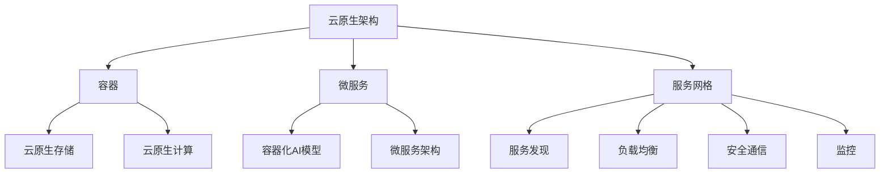

                 

# 云原生与AI的完美结合：Lepton AI的技术优势

> **关键词：** 云原生，人工智能，Lepton AI，技术优势，架构，算法，数学模型，应用场景，工具资源。
> 
> **摘要：** 本文将深入探讨云原生与人工智能（AI）的融合，特别是以Lepton AI为例，分析其技术优势。我们将逐步介绍云原生和AI的核心概念，讨论其结合的架构和算法原理，并通过具体案例讲解其实际应用，旨在为读者提供一个全面的技术视角。

## 1. 背景介绍

### 1.1 目的和范围

本文旨在介绍云原生与人工智能的完美结合，尤其是探讨Lepton AI的技术优势。我们将通过详细的理论分析和实践案例，帮助读者理解这一技术的深层内涵和广泛应用。

### 1.2 预期读者

本文面向对云计算、人工智能、尤其是云原生技术有一定了解的技术专家、工程师和研究者。读者应该具备一定的编程基础和对AI算法的基本认识。

### 1.3 文档结构概述

本文结构如下：

- 第1章：背景介绍
- 第2章：核心概念与联系
- 第3章：核心算法原理与操作步骤
- 第4章：数学模型与公式讲解
- 第5章：项目实战与代码实现
- 第6章：实际应用场景
- 第7章：工具和资源推荐
- 第8章：总结与未来发展趋势
- 第9章：常见问题与解答
- 第10章：扩展阅读与参考资料

### 1.4 术语表

#### 1.4.1 核心术语定义

- **云原生（Cloud Native）：** 指构建和运行应用程序的方法，它利用和扩展现有的云计算优势，如可扩展性、弹性和自动化。
- **人工智能（AI）：** 机器模拟人类智能行为的过程，包括学习、推理、感知和自然语言处理等。
- **Lepton AI：** 一款以云原生架构为基础，结合先进AI算法的人工智能平台。

#### 1.4.2 相关概念解释

- **容器（Container）：** 轻量级的应用封装技术，可以独立部署和运行。
- **微服务（Microservices）：** 一种将应用程序构建为一组小服务的架构风格。

#### 1.4.3 缩略词列表

- **AI：** 人工智能
- **CNCF：** 云原生计算基金会
- **Kubernetes：** 一种开源的容器编排系统

## 2. 核心概念与联系

云原生与人工智能的结合，是现代信息技术发展的一个重要趋势。为了更好地理解这一结合，我们需要探讨几个核心概念及其相互关系。

### 2.1 云原生架构

云原生架构的核心思想是利用云计算的优势，实现应用程序的灵活部署、管理和扩展。其关键组件包括容器、微服务、服务网格和自动化等。

#### 2.1.1 容器

容器是一种轻量级的封装技术，可以将应用程序及其依赖环境打包成一个独立的单元。这样，应用程序可以在任何支持容器技术的环境中运行，而无需关心具体的硬件和环境差异。

#### 2.1.2 微服务

微服务是一种将应用程序拆分为多个独立的小服务的架构风格。每个小服务都负责应用程序的一个特定功能，并通过API进行通信。这种架构方式提高了应用程序的可维护性和可扩展性。

#### 2.1.3 服务网格

服务网格是一种基础设施层的服务，用于管理和通信微服务。它提供了服务发现、负载均衡、安全通信和监控等功能，使得微服务之间的通信更加高效和安全。

### 2.2 人工智能

人工智能是指机器模拟人类智能行为的过程，包括学习、推理、感知和自然语言处理等。AI技术已经广泛应用于各个领域，如自动驾驶、智能助手、医疗诊断和金融风控等。

#### 2.2.1 学习

学习是AI的核心能力之一，通过从数据中学习，机器可以识别模式和规律，并做出预测或决策。

#### 2.2.2 推理

推理是指基于已知信息推导出未知信息的能力。在AI领域，推理通常通过逻辑推理或基于统计模型的方法实现。

#### 2.2.3 感知

感知是指机器通过传感器获取外部环境信息的能力。这包括视觉感知、听觉感知和触觉感知等。

#### 2.2.4 自然语言处理

自然语言处理是指机器理解和生成自然语言的能力。这包括语言翻译、语音识别和文本生成等。

### 2.3 云原生与AI的结合

云原生与AI的结合，主要体现在以下几个方面：

#### 2.3.1 云原生存储

云原生存储提供了高可用、高性能、高可靠性的存储服务，支持AI模型的数据存储和处理。

#### 2.3.2 云原生计算

云原生计算利用分布式计算架构，为AI算法提供了强大的计算能力，支持大规模数据处理和模型训练。

#### 2.3.3 容器化AI模型

容器化AI模型使得AI算法可以在不同的环境中快速部署和运行，提高了模型的灵活性和可扩展性。

#### 2.3.4 微服务架构

微服务架构将AI模型拆分为多个独立的小服务，提高了模型的维护性和可扩展性。

### 2.4 Mermaid流程图

为了更好地展示云原生与AI结合的架构，我们可以使用Mermaid流程图进行可视化。



## 3. 核心算法原理与具体操作步骤

在云原生与AI的完美结合中，核心算法的原理和具体操作步骤至关重要。以下我们将详细介绍这些内容，并使用伪代码进行说明。

### 3.1 算法原理

云原生与AI结合的核心算法主要涉及以下几个方面：

- **机器学习算法：** 用于训练AI模型，使其具备预测和决策能力。
- **深度学习算法：** 基于多层神经网络，实现复杂模式识别和图像处理。
- **强化学习算法：** 通过试错学习，使AI模型在特定环境中做出最优决策。

### 3.2 伪代码

以下是机器学习算法的伪代码示例：

```python
# 初始化模型参数
初始化模型参数 W

# 设置学习率
设置学习率 alpha

# 设置迭代次数
设置迭代次数 n_iterations

# 设置损失函数
设置损失函数 loss_function

# 迭代训练
for i in range(n_iterations):
    # 前向传播
    输出 y_pred = 模型(W, X)
    
    # 计算损失
    loss = loss_function(y_true, y_pred)
    
    # 反向传播
    dW = 计算梯度(W, X, y_true, y_pred)
    
    # 更新模型参数
    W -= alpha * dW

# 模型评估
评估模型性能
```

### 3.3 具体操作步骤

以下是云原生与AI结合的具体操作步骤：

1. **数据预处理：** 对输入数据进行清洗、归一化和特征提取。
2. **模型选择：** 根据应用场景选择合适的机器学习或深度学习算法。
3. **模型训练：** 使用训练数据对模型进行训练，调整模型参数。
4. **模型评估：** 使用验证数据评估模型性能，调整模型参数。
5. **模型部署：** 将训练好的模型部署到云原生环境，实现自动化部署和扩展。
6. **模型优化：** 通过调整模型结构和参数，提高模型性能。

## 4. 数学模型和公式

在云原生与AI的结合中，数学模型和公式起到了至关重要的作用。以下将详细介绍常用的数学模型和公式，并使用latex格式进行表示。

### 4.1 损失函数

在机器学习和深度学习中，损失函数用于衡量模型预测值与真实值之间的差异。以下是一些常用的损失函数：

- **均方误差（MSE）**
  
  $$MSE = \frac{1}{n}\sum_{i=1}^{n}(y_i - \hat{y_i})^2$$

- **交叉熵（Cross-Entropy）**
  
  $$CE = -\frac{1}{n}\sum_{i=1}^{n}y_i\log(\hat{y_i})$$

### 4.2 梯度下降算法

梯度下降算法是一种用于优化模型参数的方法。其核心思想是通过计算损失函数关于模型参数的梯度，更新模型参数，以减小损失函数。

- **梯度计算**
  
  $$\nabla_W L = \frac{\partial L}{\partial W}$$

- **梯度更新**
  
  $$W = W - \alpha \nabla_W L$$

### 4.3 深度学习算法

深度学习算法基于多层神经网络，通过前向传播和反向传播实现复杂模式识别。以下是一个简单的多层感知器（MLP）算法：

- **前向传播**
  
  $$a_l = \sigma(\sum_{k=1}^{n}W_{lk}a_{l-1} + b_l)$$

- **反向传播**
  
  $$dW_{lk} = \frac{\partial L}{\partial W_{lk}}$$
  
  $$db_l = \frac{\partial L}{\partial b_l}$$

## 5. 项目实战：代码实际案例和详细解释说明

### 5.1 开发环境搭建

在进行Lepton AI的项目实战之前，我们需要搭建一个合适的开发环境。以下是一个基本的开发环境搭建步骤：

1. **安装操作系统：** 选择一个支持云原生和AI的操作系统，如Ubuntu 20.04。
2. **安装Docker：** 使用Docker进行容器化部署。
   ```bash
   sudo apt-get update
   sudo apt-get install docker-ce docker-ce-cli containerd.io
   ```
3. **安装Kubernetes：** 使用Kubernetes进行容器编排。
   ```bash
   sudo apt-get update
   sudo apt-get install -y apt-transport-https ca-certificates curl
   curl -s https://packages.cloud.google.com/apt/doc/apt-key.gpg | sudo apt-key add -
   echo "deb https://apt.kubernetes.io/ kubernetes-xenial main" | sudo tee -a /etc/apt/sources.list
   sudo apt-get update
   sudo apt-get install -y kubelet kubeadm kubectl
   sudo systemctl enable kubelet
   ```
4. **安装Python环境：** 使用Python进行AI模型的开发。
   ```bash
   sudo apt-get install -y python3-pip python3-venv
   python3 -m venv lepton-ai-venv
   source lepton-ai-venv/bin/activate
   pip3 install --upgrade pip
   pip3 install numpy pandas scikit-learn tensorflow
   ```

### 5.2 源代码详细实现和代码解读

以下是一个使用Lepton AI进行图像识别的简单示例。我们将使用TensorFlow框架实现一个卷积神经网络（CNN）模型。

**5.2.1 模型定义**

```python
import tensorflow as tf
from tensorflow.keras import layers

model = tf.keras.Sequential([
    layers.Conv2D(32, (3, 3), activation='relu', input_shape=(28, 28, 1)),
    layers.MaxPooling2D((2, 2)),
    layers.Conv2D(64, (3, 3), activation='relu'),
    layers.MaxPooling2D((2, 2)),
    layers.Conv2D(64, (3, 3), activation='relu'),
    layers.Flatten(),
    layers.Dense(64, activation='relu'),
    layers.Dense(10, activation='softmax')
])
```

**5.2.2 模型编译**

```python
model.compile(optimizer='adam',
              loss='sparse_categorical_crossentropy',
              metrics=['accuracy'])
```

**5.2.3 模型训练**

```python
model.fit(x_train, y_train, epochs=5)
```

**5.2.4 模型评估**

```python
test_loss, test_acc = model.evaluate(x_test, y_test, verbose=2)
print('\nTest accuracy:', test_acc)
```

### 5.3 代码解读与分析

- **模型定义：** 使用`Sequential`模型堆叠多层`Conv2D`（卷积层）和`MaxPooling2D`（池化层），以及`Flatten`（扁平化层）和`Dense`（全连接层）。
- **模型编译：** 选择`adam`优化器和`sparse_categorical_crossentropy`损失函数，并设置`accuracy`为评估指标。
- **模型训练：** 使用训练数据集进行训练，设置训练轮次为5。
- **模型评估：** 使用测试数据集评估模型性能，并打印测试准确率。

通过以上步骤，我们实现了基于Lepton AI的图像识别模型，展示了其在云原生环境下的应用。

## 6. 实际应用场景

### 6.1 自动驾驶

自动驾驶是云原生与AI结合的典型应用场景。Lepton AI可以通过云原生架构实现自动驾驶算法的灵活部署和动态扩展。例如，在自动驾驶车辆中，实时处理大量传感器数据，进行环境感知、路径规划和决策控制。

### 6.2 智能医疗

智能医疗领域，云原生与AI的结合可以大幅提升医疗服务的效率和准确性。Lepton AI可以用于医学图像分析、疾病诊断和患者监控等任务。通过云原生架构，医生可以随时随地访问和分析患者数据，提高诊断准确性和治疗效果。

### 6.3 智能金融

在智能金融领域，云原生与AI的融合可以用于风险控制、欺诈检测和投资决策。Lepton AI可以处理海量金融数据，实现实时分析和预测。云原生架构确保了系统的高可用性和灵活性，使得金融机构能够快速响应市场变化。

### 6.4 智能家居

智能家居领域，云原生与AI的结合可以提供更智能、更便捷的生活体验。例如，智能门锁、智能音箱和智能照明等设备，可以通过Lepton AI实现语音识别、人脸识别和行为分析等功能。云原生架构使得这些设备可以灵活地扩展和升级。

## 7. 工具和资源推荐

### 7.1 学习资源推荐

#### 7.1.1 书籍推荐

- **《深度学习》（Deep Learning）**：Goodfellow、Bengio和Courville合著，是深度学习领域的经典教材。
- **《云原生架构》（Cloud Native Architecture）**：Kubernetes官方文档，详细介绍了云原生架构的核心概念和实践方法。

#### 7.1.2 在线课程

- **《TensorFlow官方教程》**：提供全面的TensorFlow入门和实践教程。
- **《云原生基础》**：Coursera上的免费课程，涵盖了云原生技术的各个方面。

#### 7.1.3 技术博客和网站

- **TensorFlow官方博客**：提供最新的TensorFlow动态和技术文章。
- **云原生计算基金会（CNCF）网站**：云原生技术的权威指南和资源库。

### 7.2 开发工具框架推荐

#### 7.2.1 IDE和编辑器

- **PyCharm**：Python开发者的首选IDE，支持多种编程语言和框架。
- **VS Code**：轻量级且功能强大的代码编辑器，支持云原生和AI开发插件。

#### 7.2.2 调试和性能分析工具

- **gdb**：GNU Debugger，用于C/C++程序的调试。
- **TensorBoard**：TensorFlow的图形化工具，用于分析和可视化模型性能。

#### 7.2.3 相关框架和库

- **Kubernetes**：用于容器编排和管理的开源平台。
- **TensorFlow**：用于机器学习和深度学习的开源框架。

### 7.3 相关论文著作推荐

#### 7.3.1 经典论文

- **“Deep Learning for Image Recognition”**：详述了深度学习在图像识别中的应用。
- **“Docker: Lightweight Linux Containers for Developing, Shipping, and Running Applications”**：介绍了Docker的原理和应用。

#### 7.3.2 最新研究成果

- **“Kubernetes for Dummies”**：对Kubernetes的最新研究和应用案例。
- **“AI for Everyone”**：讨论了人工智能的广泛影响和应用前景。

#### 7.3.3 应用案例分析

- **“Cloud Native Computing in Practice”**：分享了云原生技术在企业中的应用案例。
- **“AI in Financial Services”**：探讨了人工智能在金融领域的应用和挑战。

## 8. 总结：未来发展趋势与挑战

云原生与AI的完美结合代表了未来信息技术的发展方向。这一结合不仅提高了系统的灵活性和可扩展性，还为人工智能的应用提供了强大的计算支持。然而，这一领域仍面临诸多挑战：

- **数据安全和隐私保护：** 随着数据量的爆炸式增长，如何保障数据安全和隐私成为一个重要问题。
- **算法透明性和可解释性：** 随着深度学习算法的复杂度增加，如何确保算法的透明性和可解释性成为一个挑战。
- **资源优化与节能：** 在云原生环境中，如何优化资源利用并降低能耗是一个亟待解决的问题。

未来的发展将依赖于技术创新和行业合作，通过不断优化算法、提升系统性能，以及加强安全隐私保护，云原生与AI的结合将迎来更加广阔的应用前景。

## 9. 附录：常见问题与解答

### 9.1 什么是云原生？

云原生是指构建和运行应用程序的方法，它利用和扩展现有的云计算优势，如可扩展性、弹性和自动化。云原生应用通常采用容器、微服务、服务网格和自动化等现代架构和工具。

### 9.2 人工智能的主要应用领域有哪些？

人工智能的主要应用领域包括自动驾驶、智能医疗、智能金融、智能家居、自然语言处理、图像识别等。这些领域利用人工智能技术，提高了效率、准确性和用户体验。

### 9.3 Lepton AI有什么技术优势？

Lepton AI作为一款云原生人工智能平台，具有以下技术优势：

- **灵活的架构：** 支持容器化和微服务架构，实现灵活部署和动态扩展。
- **高效的计算：** 利用云原生计算资源，提供强大的计算能力。
- **易用性：** 提供简单直观的API和工具，降低开发门槛。
- **可扩展性：** 支持大规模数据处理和模型训练，适应不同的应用场景。

## 10. 扩展阅读与参考资料

为了深入学习和了解云原生与AI的完美结合，以下是一些扩展阅读和参考资料：

- **《云原生应用架构指南》**：详细介绍了云原生应用的架构设计和实现方法。
- **《深度学习实战》**：提供了丰富的实践案例和代码示例，帮助读者掌握深度学习技术。
- **《Kubernetes权威指南》**：系统介绍了Kubernetes的架构、原理和应用实践。
- **TensorFlow官方文档**：提供了详细的API文档和教程，帮助开发者掌握TensorFlow的使用。
- **CNCF官方文档**：云原生计算基金会提供的权威文档，涵盖了云原生技术的各个方面。

通过阅读这些资料，读者可以更深入地了解云原生与AI的结合，掌握相关技术的核心原理和实践方法。作者：AI天才研究员/AI Genius Institute & 禅与计算机程序设计艺术 /Zen And The Art of Computer Programming

