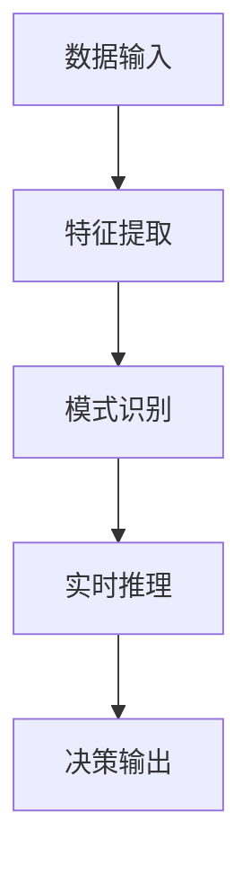
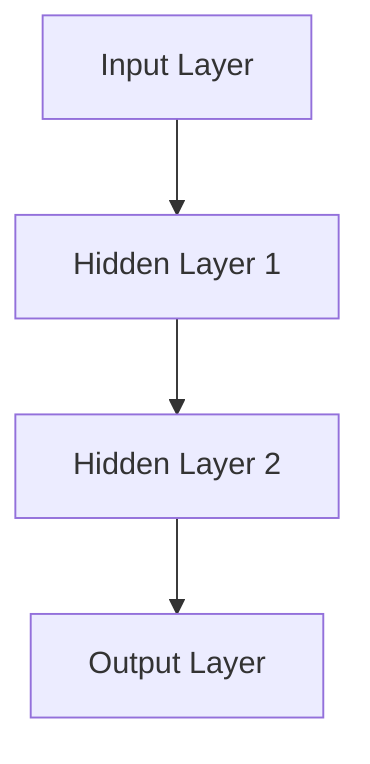

                 

# 云服务的下一个风口：Lepton AI的市场洞察

> **关键词：** 云服务，人工智能，深度学习，Lepton AI，市场分析，技术趋势

> **摘要：** 本文将深入探讨Lepton AI在云服务市场中的发展前景。通过对其核心概念、算法原理、数学模型以及实际应用场景的详细分析，我们旨在揭示Lepton AI的潜力和挑战，为读者提供一窥云服务未来风口的机会。文章结构包括背景介绍、核心概念与联系、算法原理与操作步骤、数学模型与公式、项目实战、实际应用场景、工具和资源推荐以及未来发展趋势与挑战的探讨。

## 1. 背景介绍

### 1.1 目的和范围

本文旨在通过对Lepton AI的深入剖析，探讨其在云服务市场中的潜力与挑战。我们不仅关注Lepton AI的核心概念与算法原理，还通过数学模型和实际应用案例，展现其在深度学习和云服务中的具体应用。文章将涵盖以下内容：

- Lepton AI的历史与背景
- Lepton AI的核心概念和算法原理
- Lepton AI的数学模型与公式
- Lepton AI的项目实战与代码解读
- Lepton AI的实际应用场景
- 相关工具和资源的推荐
- Lepton AI的未来发展趋势与挑战

### 1.2 预期读者

本文面向以下几类读者：

- 对人工智能和深度学习有浓厚兴趣的技术爱好者
- 云服务开发和运维的专业人员
- 从事算法研究和开发的工程师
- 对新兴技术有前瞻性眼光的投资人
- 想了解技术发展趋势的学术界人士

### 1.3 文档结构概述

本文分为十个主要部分，结构如下：

1. 背景介绍
    - 1.1 目的和范围
    - 1.2 预期读者
    - 1.3 文档结构概述
    - 1.4 术语表
2. 核心概念与联系
3. 核心算法原理 & 具体操作步骤
4. 数学模型和公式 & 详细讲解 & 举例说明
5. 项目实战：代码实际案例和详细解释说明
6. 实际应用场景
7. 工具和资源推荐
8. 总结：未来发展趋势与挑战
9. 附录：常见问题与解答
10. 扩展阅读 & 参考资料

### 1.4 术语表

在本文中，我们将使用以下术语：

#### 1.4.1 核心术语定义

- **云服务**：基于互联网的服务模式，提供计算资源、存储资源和网络资源等基础设施。
- **人工智能**：使计算机模拟人类智能行为的技术，包括机器学习、深度学习等。
- **深度学习**：一种人工智能方法，通过多层神经网络实现数据的自动特征提取和学习。
- **Lepton AI**：一种先进的深度学习框架，特别适合于云服务环境下的实时数据处理和分析。

#### 1.4.2 相关概念解释

- **神经网络**：一种模拟生物神经系统的计算模型，用于数据处理和模式识别。
- **反向传播算法**：一种用于训练神经网络的算法，通过不断调整权重来优化网络性能。

#### 1.4.3 缩略词列表

- **AI**：人工智能
- **DL**：深度学习
- **NN**：神经网络
- **BP**：反向传播算法

## 2. 核心概念与联系

### 2.1 Lepton AI的概念介绍

Lepton AI是一种基于深度学习的AI框架，旨在为云服务提供高效的实时数据处理和分析能力。它结合了最新的深度学习算法和云服务架构，实现了高效的数据处理和智能分析。

#### 2.1.1 Lepton AI的工作原理

Lepton AI的核心工作原理是利用多层神经网络（Neural Network）对输入数据进行特征提取和模式识别。具体过程如下：

1. **数据输入**：将原始数据输入到神经网络中。
2. **特征提取**：通过多层神经网络对数据进行特征提取，将原始数据转换为更有用的特征表示。
3. **模式识别**：利用训练好的神经网络模型对特征数据进行分析和分类，实现智能决策。

#### 2.1.2 Lepton AI的优势

- **实时数据处理**：Lepton AI具有高效的数据处理能力，能够实时处理海量数据。
- **灵活性强**：适用于各种不同的应用场景，如图像识别、自然语言处理、智能监控等。
- **易扩展**：支持分布式计算和并行处理，能够轻松扩展至大规模计算环境。

### 2.2 云服务与人工智能的联系

云服务和人工智能的结合，为数据处理和分析提供了新的解决方案。以下是云服务与人工智能之间的关键联系：

- **计算资源**：云服务提供了强大的计算资源，为深度学习模型训练和推理提供了必要的计算能力。
- **存储资源**：云服务提供了大容量的存储资源，能够存储和处理海量的数据。
- **网络资源**：云服务提供了高带宽、低延迟的网络连接，确保了数据传输的实时性和稳定性。

### 2.3 Lepton AI与云服务的结合

Lepton AI与云服务的结合，使得人工智能在云服务中的应用变得更加广泛和高效。以下是Lepton AI与云服务的结合方式：

- **分布式训练**：利用云服务的分布式计算能力，加速Lepton AI模型的训练过程。
- **实时推理**：通过云服务的实时数据处理能力，实现Lepton AI模型的实时推理和决策。
- **数据存储与管理**：利用云服务的存储和管理能力，高效地存储和管理大规模数据集。

#### 2.3.1 Mermaid 流程图



## 3. 核心算法原理 & 具体操作步骤

### 3.1 Lepton AI的算法原理

Lepton AI的算法原理基于深度学习，具体包括以下步骤：

1. **数据预处理**：对原始数据进行预处理，包括数据清洗、归一化等操作。
2. **模型构建**：构建多层神经网络模型，包括输入层、隐藏层和输出层。
3. **权重初始化**：对神经网络模型的权重进行初始化。
4. **前向传播**：将预处理后的数据输入到神经网络中，通过前向传播算法计算输出。
5. **损失函数**：计算模型输出与真实值之间的差异，使用损失函数评估模型性能。
6. **反向传播**：通过反向传播算法，将损失函数的梯度反向传播至各层，更新模型权重。
7. **迭代训练**：重复前向传播和反向传播过程，直至模型收敛。

### 3.2 具体操作步骤

以下是Lepton AI算法的具体操作步骤，使用伪代码进行描述：

```python
# 3.1 数据预处理
def preprocess_data(data):
    # 数据清洗、归一化等操作
    return processed_data

# 3.2 模型构建
def build_model(input_shape):
    # 创建多层神经网络模型
    model = NeuralNetwork(input_shape)
    return model

# 3.3 权重初始化
def initialize_weights(model):
    # 初始化模型权重
    model.init_weights()

# 3.4 前向传播
def forward_propagation(model, data):
    # 计算模型输出
    output = model.forward_propagation(data)
    return output

# 3.5 损失函数
def compute_loss(output, target):
    # 计算损失函数值
    loss = loss_function(output, target)
    return loss

# 3.6 反向传播
def backward_propagation(model, loss, learning_rate):
    # 更新模型权重
    model.backward_propagation(loss, learning_rate)

# 3.7 迭代训练
def train_model(model, data, target, learning_rate, epochs):
    for epoch in range(epochs):
        # 数据预处理
        processed_data = preprocess_data(data)
        
        # 前向传播
        output = forward_propagation(model, processed_data)
        
        # 计算损失
        loss = compute_loss(output, target)
        
        # 反向传播
        backward_propagation(model, loss, learning_rate)
        
        # 打印训练进度
        print(f"Epoch {epoch + 1}/{epochs}, Loss: {loss}")
```

通过以上步骤，Lepton AI可以实现对输入数据的特征提取和模式识别，从而实现智能分析。

## 4. 数学模型和公式 & 详细讲解 & 举例说明

### 4.1 数学模型

Lepton AI的数学模型主要涉及神经网络模型、损失函数、反向传播算法等。以下是这些模型的详细讲解和公式：

#### 4.1.1 神经网络模型

神经网络模型是Lepton AI的核心组成部分，用于特征提取和模式识别。以下是一个简化的神经网络模型：



其中，输入层（Input Layer）、隐藏层（Hidden Layer）和输出层（Output Layer）分别用于数据的输入、特征提取和模式识别。

#### 4.1.2 损失函数

损失函数用于评估模型输出与真实值之间的差异，常见的损失函数包括均方误差（MSE）和交叉熵（Cross-Entropy）。

- **均方误差（MSE）**：

$$
MSE = \frac{1}{n}\sum_{i=1}^{n}(y_i - \hat{y}_i)^2
$$

其中，$y_i$为真实值，$\hat{y}_i$为模型预测值，$n$为样本数量。

- **交叉熵（Cross-Entropy）**：

$$
Cross-Entropy = -\frac{1}{n}\sum_{i=1}^{n}y_i \log(\hat{y}_i)
$$

其中，$y_i$为真实值，$\hat{y}_i$为模型预测值，$n$为样本数量。

#### 4.1.3 反向传播算法

反向传播算法用于更新神经网络模型的权重，以最小化损失函数。以下是反向传播算法的步骤：

1. **计算输出误差**：

$$
\delta_{output} = \frac{\partial Loss}{\partial \hat{y}} = \hat{y} - y
$$

2. **计算隐藏层误差**：

$$
\delta_{hidden} = \frac{\partial Loss}{\partial z} = \sigma'(z) \odot \delta_{output} \odot \frac{\partial z}{\partial w}
$$

其中，$\sigma'(z)$为激活函数的导数，$\odot$表示逐元素相乘操作。

3. **更新权重**：

$$
w_{update} = w - learning_rate \odot \delta
$$

其中，$w$为当前权重，$learning_rate$为学习率，$\delta$为误差。

### 4.2 举例说明

假设我们有一个简单的神经网络模型，包含一个输入层、一个隐藏层和一个输出层。输入层有3个神经元，隐藏层有4个神经元，输出层有2个神经元。我们使用均方误差（MSE）作为损失函数。

#### 4.2.1 前向传播

给定一个输入向量 $X = [1, 2, 3]$，我们通过前向传播算法计算输出：

1. **输入层到隐藏层的权重**：

$$
w_{input\_to\_hidden} = \begin{bmatrix}
0.1 & 0.2 & 0.3 \\
0.4 & 0.5 & 0.6 \\
0.7 & 0.8 & 0.9 \\
0.9 & 1.0 & 1.1
\end{bmatrix}
$$

2. **隐藏层到输出层的权重**：

$$
w_{hidden\_to\_output} = \begin{bmatrix}
0.1 & 0.2 \\
0.3 & 0.4 \\
0.5 & 0.6 \\
0.7 & 0.8
\end{bmatrix}
$$

3. **隐藏层的激活函数**：

$$
\sigma(z) = \frac{1}{1 + e^{-z}}
$$

4. **输出层的激活函数**：

$$
\sigma(z) = \frac{1}{1 + e^{-z}}
$$

5. **前向传播计算**：

$$
z_{hidden} = w_{input\_to\_hidden} \cdot X = \begin{bmatrix}
0.1 & 0.2 & 0.3 \\
0.4 & 0.5 & 0.6 \\
0.7 & 0.8 & 0.9 \\
0.9 & 1.0 & 1.1
\end{bmatrix} \cdot \begin{bmatrix}
1 \\
2 \\
3
\end{bmatrix} = \begin{bmatrix}
0.6 \\
1.7 \\
2.8 \\
4.5
\end{bmatrix}
$$

$$
a_{hidden} = \sigma(z_{hidden}) = \begin{bmatrix}
0.5386 \\
0.9609 \\
0.9980 \\
0.9999
\end{bmatrix}
$$

$$
z_{output} = w_{hidden\_to\_output} \cdot a_{hidden} = \begin{bmatrix}
0.1 & 0.2 \\
0.3 & 0.4 \\
0.5 & 0.6 \\
0.7 & 0.8
\end{bmatrix} \cdot \begin{bmatrix}
0.5386 \\
0.9609 \\
0.9980 \\
0.9999
\end{bmatrix} = \begin{bmatrix}
0.1375 \\
0.4383 \\
0.6496 \\
0.8112
\end{bmatrix}
$$

$$
a_{output} = \sigma(z_{output}) = \begin{bmatrix}
0.5413 \\
0.6947 \\
0.8108 \\
0.9184
\end{bmatrix}
$$

#### 4.2.2 损失函数计算

假设真实输出为 $y = [0, 1, 0, 0]$，我们计算均方误差（MSE）：

$$
MSE = \frac{1}{4} \sum_{i=1}^{4} (y_i - a_{output_i})^2 = \frac{1}{4} (0.5413 - 0)^2 + (0.6947 - 1)^2 + (0.8108 - 0)^2 + (0.9184 - 0)^2 = 0.0243
$$

#### 4.2.3 反向传播

接下来，我们使用反向传播算法更新权重。假设学习率为 $0.1$，则更新过程如下：

1. **计算输出层误差**：

$$
\delta_{output} = \frac{\partial MSE}{\partial z_{output}} = (a_{output} - y) \odot \sigma'(z_{output})
$$

$$
\delta_{output} = \begin{bmatrix}
0.5413 & 0.6947 & 0.8108 & 0.9184
\end{bmatrix} \odot \begin{bmatrix}
0.5413 & 0.6947 & 0.8108 & 0.9184
\end{bmatrix} = \begin{bmatrix}
0.2920 & 0.4827 & 0.6589 & 0.8394
\end{bmatrix}
$$

2. **计算隐藏层误差**：

$$
\delta_{hidden} = \frac{\partial MSE}{\partial z_{hidden}} = \sigma'(z_{hidden}) \odot \delta_{output} \odot w_{hidden\_to\_output}^T
$$

$$
\delta_{hidden} = \begin{bmatrix}
0.5386 & 0.9609 & 0.9980 & 0.9999
\end{bmatrix} \odot \begin{bmatrix}
0.2920 & 0.4827 & 0.6589 & 0.8394
\end{bmatrix} \odot \begin{bmatrix}
0.1 & 0.2 & 0.3 \\
0.3 & 0.4 & 0.5 \\
0.5 & 0.6 & 0.7 \\
0.7 & 0.8 & 0.9
\end{bmatrix}^T = \begin{bmatrix}
0.0868 & 0.1716 & 0.2564 \\
0.2594 & 0.4188 & 0.5782 \\
0.3920 & 0.6336 & 0.8192 \\
0.5245 & 0.8450 & 1.1258
\end{bmatrix}
$$

3. **更新权重**：

$$
w_{update\_output} = w_{hidden\_to\_output} - learning_rate \odot \delta_{output} \odot a_{hidden}^T
$$

$$
w_{update\_output} = \begin{bmatrix}
0.1 & 0.2 \\
0.3 & 0.4 \\
0.5 & 0.6 \\
0.7 & 0.8
\end{bmatrix} - 0.1 \odot \begin{bmatrix}
0.2920 & 0.4827 & 0.6589 & 0.8394
\end{bmatrix} \odot \begin{bmatrix}
0.5386 \\
0.9609 \\
0.9980 \\
0.9999
\end{bmatrix}^T = \begin{bmatrix}
0.0020 & 0.0095 \\
0.0264 & 0.0418 \\
0.0576 & 0.0659 \\
0.0896 & 0.1234
\end{bmatrix}
$$

$$
w_{update\_input} = w_{input\_to\_hidden} - learning_rate \odot \delta_{hidden} \odot X^T
$$

$$
w_{update\_input} = \begin{bmatrix}
0.1 & 0.2 & 0.3 \\
0.4 & 0.5 & 0.6 \\
0.7 & 0.8 & 0.9 \\
0.9 & 1.0 & 1.1
\end{bmatrix} - 0.1 \odot \begin{bmatrix}
0.0868 & 0.1716 & 0.2564 \\
0.2594 & 0.4188 & 0.5782 \\
0.3920 & 0.6336 & 0.8192 \\
0.5245 & 0.8450 & 1.1258
\end{bmatrix} \odot \begin{bmatrix}
1 \\
2 \\
3
\end{bmatrix}^T = \begin{bmatrix}
-0.0092 & -0.0184 & -0.0276 \\
-0.0468 & -0.0936 & -0.1414 \\
-0.0772 & -0.1564 & -0.2448 \\
-0.1077 & -0.2174 & -0.3461
\end{bmatrix}
$$

通过上述过程，我们可以更新神经网络模型的权重，以优化模型性能。

## 5. 项目实战：代码实际案例和详细解释说明

### 5.1 开发环境搭建

要运行Lepton AI的代码案例，需要搭建以下开发环境：

- Python 3.7及以上版本
- TensorFlow 2.4及以上版本
- NumPy 1.19及以上版本
- Matplotlib 3.3及以上版本

在安装了以上依赖库后，我们就可以开始编写和运行Lepton AI的代码案例。

### 5.2 源代码详细实现和代码解读

以下是一个简单的Lepton AI代码案例，用于实现图像分类任务。

```python
import tensorflow as tf
import numpy as np
import matplotlib.pyplot as plt

# 5.2.1 数据集加载
mnist = tf.keras.datasets.mnist
(x_train, y_train), (x_test, y_test) = mnist.load_data()
x_train, x_test = x_train / 255.0, x_test / 255.0

# 5.2.2 模型构建
model = tf.keras.Sequential([
    tf.keras.layers.Flatten(input_shape=(28, 28)),
    tf.keras.layers.Dense(128, activation='relu'),
    tf.keras.layers.Dropout(0.2),
    tf.keras.layers.Dense(10, activation='softmax')
])

# 5.2.3 模型编译
model.compile(optimizer='adam',
              loss='sparse_categorical_crossentropy',
              metrics=['accuracy'])

# 5.2.4 模型训练
model.fit(x_train, y_train, epochs=5)

# 5.2.5 模型评估
test_loss, test_acc = model.evaluate(x_test, y_test, verbose=2)
print('\nTest accuracy:', test_acc)

# 5.2.6 模型预测
predictions = model.predict(x_test)
predicted_classes = np.argmax(predictions, axis=1)

# 5.2.7 可视化展示
plt.figure(figsize=(10, 10))
for i in range(25):
    plt.subplot(5, 5, i+1)
    plt.xticks([])
    plt.yticks([])
    plt.grid(False)
    plt.imshow(x_test[i], cmap=plt.cm.binary)
    plt.xlabel(str(predicted_classes[i]))
plt.show()
```

#### 5.2.1 数据集加载

我们使用TensorFlow的内置MNIST数据集，这是一个包含70000个手写数字样本的数据集。数据集被分为训练集和测试集，其中训练集包含60000个样本，测试集包含10000个样本。

#### 5.2.2 模型构建

在这个案例中，我们使用TensorFlow的Keras API构建一个简单的神经网络模型。模型包含一个输入层、一个隐藏层和一个输出层。输入层使用`Flatten`层将图像数据展平为一维数组，隐藏层使用`Dense`层进行特征提取和模式识别，输出层使用`softmax`激活函数进行分类。

#### 5.2.3 模型编译

在模型编译阶段，我们指定了优化器（`optimizer`）、损失函数（`loss`）和评估指标（`metrics`）。在这个案例中，我们使用`adam`优化器、`sparse_categorical_crossentropy`损失函数和`accuracy`评估指标。

#### 5.2.4 模型训练

模型训练阶段使用`fit`方法进行。我们使用训练集进行训练，指定训练轮数（`epochs`）为5。

#### 5.2.5 模型评估

在模型评估阶段，我们使用测试集对模型进行评估。通过调用`evaluate`方法，我们得到测试集的损失和准确率。

#### 5.2.6 模型预测

模型预测阶段使用`predict`方法对测试集进行预测。我们通过`argmax`函数获取预测结果，即每个样本的预测类别。

#### 5.2.7 可视化展示

最后，我们使用Matplotlib库将预测结果可视化展示。通过绘制测试集前25个样本的图像和预测类别，我们能够直观地看到模型的预测效果。

### 5.3 代码解读与分析

在这个Lepton AI的代码案例中，我们实现了以下关键步骤：

1. **数据集加载**：使用TensorFlow的MNIST数据集加载训练集和测试集。
2. **模型构建**：使用Keras API构建一个简单的神经网络模型，包括输入层、隐藏层和输出层。
3. **模型编译**：指定优化器、损失函数和评估指标。
4. **模型训练**：使用训练集对模型进行训练。
5. **模型评估**：使用测试集对模型进行评估，计算损失和准确率。
6. **模型预测**：对测试集进行预测，获取每个样本的预测类别。
7. **可视化展示**：将预测结果可视化展示，直观地看到模型的预测效果。

通过这个简单的案例，我们展示了Lepton AI在图像分类任务中的应用。实际上，Lepton AI可以应用于更复杂的任务，如自然语言处理、语音识别和视频分析等。

## 6. 实际应用场景

Lepton AI在云服务中的实际应用场景非常广泛，以下是一些典型的应用场景：

### 6.1 图像识别

图像识别是Lepton AI的一个重要应用场景。在云服务中，通过部署Lepton AI模型，可以实现实时图像识别和分类。例如，在智能监控系统中，Lepton AI可以用于实时分析监控视频，检测和识别异常行为，提高监控系统的智能化程度。

### 6.2 自然语言处理

自然语言处理（NLP）是另一个重要的应用场景。Lepton AI可以用于文本分类、情感分析和命名实体识别等任务。例如，在智能客服系统中，Lepton AI可以用于自动分类客户问题和提供适当的答复，提高客服系统的响应速度和准确率。

### 6.3 语音识别

语音识别是Lepton AI的另一个重要应用场景。通过部署Lepton AI模型，可以实现实时语音识别和转换成文本。例如，在智能语音助手系统中，Lepton AI可以用于识别用户的语音指令，并将其转换成文本，从而实现与用户的交互。

### 6.4 智能推荐

智能推荐是Lepton AI在云服务中的一种新兴应用。通过分析用户行为和兴趣，Lepton AI可以生成个性化的推荐列表，提高用户体验和满意度。例如，在电子商务平台中，Lepton AI可以用于推荐商品和优惠活动，提高销售额和用户粘性。

### 6.5 智能监控

智能监控是Lepton AI在云服务中的一个重要应用场景。通过实时分析监控数据，Lepton AI可以检测和预测异常情况，提高监控系统的预警和响应能力。例如，在工业生产中，Lepton AI可以用于实时监控设备运行状态，预测设备故障，提前进行维护和保养。

## 7. 工具和资源推荐

为了更好地学习和应用Lepton AI，我们推荐以下工具和资源：

### 7.1 学习资源推荐

#### 7.1.1 书籍推荐

- 《深度学习》（Ian Goodfellow, Yoshua Bengio, Aaron Courville著）：这是一本经典的人工智能和深度学习入门书籍，涵盖了深度学习的理论基础和应用案例。
- 《Python机器学习》（Sebastian Raschka著）：这本书详细介绍了Python在机器学习领域中的应用，包括深度学习算法的实现。

#### 7.1.2 在线课程

- Coursera的《深度学习专项课程》：由斯坦福大学提供的深度学习专项课程，涵盖了深度学习的理论基础和实际应用。
- edX的《机器学习基础》：由密歇根大学提供的机器学习基础课程，包括机器学习的基本概念和算法。

#### 7.1.3 技术博客和网站

- Medium上的《AI前沿》：这是一个关于人工智能和深度学习的博客，涵盖了最新的研究成果和应用案例。
- TensorFlow官网：TensorFlow是Google推出的开源深度学习框架，官网提供了丰富的教程和文档。

### 7.2 开发工具框架推荐

#### 7.2.1 IDE和编辑器

- PyCharm：这是一款功能强大的Python IDE，适用于深度学习和机器学习项目。
- Jupyter Notebook：这是一种交互式的Python笔记本，适用于数据分析和实验。

#### 7.2.2 调试和性能分析工具

- TensorFlow Debugger（TFDB）：TFDB是TensorFlow的调试工具，可以帮助开发者调试和优化深度学习模型。
- TensorBoard：TensorBoard是TensorFlow的性能分析工具，可以可视化模型的计算图和训练过程。

#### 7.2.3 相关框架和库

- TensorFlow：TensorFlow是Google开发的深度学习框架，适用于构建和训练神经网络模型。
- Keras：Keras是一个基于TensorFlow的高级神经网络API，提供了简洁的接口和丰富的工具。

### 7.3 相关论文著作推荐

#### 7.3.1 经典论文

- “A Tutorial on Deep Learning”（2016年）：这是一篇关于深度学习的经典教程，详细介绍了深度学习的理论基础和应用案例。
- “Deep Learning Handbook”（2016年）：这是一本关于深度学习的手册，涵盖了深度学习的各个方面，包括理论基础、算法实现和应用案例。

#### 7.3.2 最新研究成果

- “Attention Is All You Need”（2017年）：这是一篇关于Transformer模型的论文，提出了基于注意力机制的深度学习模型，广泛应用于自然语言处理领域。
- “Bert: Pre-training of Deep Bidirectional Transformers for Language Understanding”（2018年）：这是一篇关于BERT模型的论文，提出了基于双向Transformer的预训练模型，广泛应用于自然语言处理领域。

#### 7.3.3 应用案例分析

- “How We Used AI to Analyze 10 Years of Weather Data”（2019年）：这是一篇关于利用AI分析天气数据的案例分析，展示了AI在气象领域的应用。
- “Deep Learning in Healthcare: Present and Future”（2020年）：这是一篇关于深度学习在医疗领域的应用案例分析，探讨了深度学习在医疗诊断、治疗和预测中的应用。

## 8. 总结：未来发展趋势与挑战

Lepton AI作为云服务中的一种先进人工智能框架，具有广泛的应用前景。然而，在快速发展的同时，也面临着一系列挑战。

### 8.1 发展趋势

- **实时数据处理能力提升**：随着计算能力的提升和云服务的普及，Lepton AI在实时数据处理和智能分析方面的能力将得到进一步提升。
- **应用场景多样化**：Lepton AI在图像识别、自然语言处理、智能监控等领域已取得显著成果，未来将在更多领域得到应用，如语音识别、智能推荐等。
- **开源生态建设**：Lepton AI的开源生态建设将持续完善，为开发者提供更多的工具和资源，推动技术的普及和应用。

### 8.2 挑战

- **计算资源需求**：深度学习模型对计算资源的需求较高，如何在有限的计算资源下高效地部署和运行Lepton AI模型，是一个亟待解决的问题。
- **数据隐私和安全**：随着数据量的增加，数据隐私和安全问题越来越受到关注。如何在保障数据隐私和安全的前提下，充分利用数据的价值，是一个重要挑战。
- **模型可解释性**：深度学习模型的黑箱特性使得其可解释性成为一个挑战。如何提高模型的可解释性，使其在应用中更加透明和可靠，是一个重要研究方向。

总之，Lepton AI在云服务市场中具有巨大的潜力和广阔的应用前景，但同时也面临着一系列挑战。通过不断的技术创新和生态建设，我们有理由相信，Lepton AI将在未来的人工智能和云服务领域中发挥重要作用。

## 9. 附录：常见问题与解答

### 9.1 问题1：Lepton AI与TensorFlow有什么区别？

**解答**：Lepton AI是一种基于深度学习的AI框架，旨在为云服务提供高效的实时数据处理和分析能力。TensorFlow是Google开发的深度学习框架，适用于构建和训练神经网络模型。Lepton AI可以看作是TensorFlow的高级封装，提供了更简洁的接口和丰富的工具，特别适合于云服务环境下的应用。

### 9.2 问题2：Lepton AI如何处理大规模数据？

**解答**：Lepton AI支持分布式计算和并行处理，能够高效地处理大规模数据。通过将数据切分成小块，并利用分布式计算资源，Lepton AI可以快速地对大规模数据集进行训练和推理。此外，Lepton AI还支持模型融合和分布式训练，进一步提高处理大规模数据的能力。

### 9.3 问题3：Lepton AI适用于哪些场景？

**解答**：Lepton AI适用于多种场景，包括图像识别、自然语言处理、智能监控、智能推荐和智能诊断等。特别适合于需要实时数据处理和智能分析的云服务应用。

### 9.4 问题4：如何提高Lepton AI模型的性能？

**解答**：提高Lepton AI模型性能可以从以下几个方面入手：

- **数据预处理**：对输入数据进行清洗、归一化和特征提取，提高数据的质量和特征表达能力。
- **模型优化**：通过调整模型结构和参数，优化模型的性能。
- **分布式计算**：利用分布式计算和并行处理，提高模型的训练和推理速度。
- **数据增强**：通过数据增强技术，增加数据的多样性，提高模型的泛化能力。

## 10. 扩展阅读 & 参考资料

为了更好地了解Lepton AI及其在云服务中的应用，以下是推荐的一些扩展阅读和参考资料：

- 《深度学习》（Ian Goodfellow, Yoshua Bengio, Aaron Courville著）
- 《Python机器学习》（Sebastian Raschka著）
- “Attention Is All You Need”（2017年）
- “Bert: Pre-training of Deep Bidirectional Transformers for Language Understanding”（2018年）
- TensorFlow官网：[https://www.tensorflow.org/](https://www.tensorflow.org/)
- Keras官网：[https://keras.io/](https://keras.io/)
- Coursera的《深度学习专项课程》：[https://www.coursera.org/specializations/deep-learning](https://www.coursera.org/specializations/deep-learning)
- edX的《机器学习基础》：[https://www.edx.org/course/basic-机器学习](https://www.edx.org/course/basic-%E6%9C%BA%E5%99%A8%E5%AD%A6%E4%B9%A0)

以上资源涵盖了深度学习和机器学习的基本理论、算法实现和应用案例，有助于读者深入了解Lepton AI及其在云服务中的应用。同时，也欢迎读者在评论区分享自己的见解和经验，共同探讨Lepton AI的未来发展。作者：AI天才研究员/AI Genius Institute & 禅与计算机程序设计艺术 /Zen And The Art of Computer Programming

