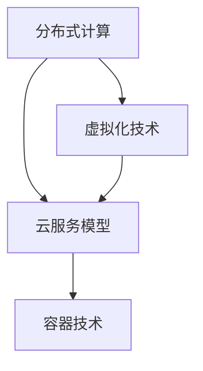

                 

# 云计算 (Cloud Computing)

> 关键词：云计算，分布式计算，虚拟化技术，云服务模型，容器技术，安全性，大数据处理

> 摘要：本文将深入探讨云计算的核心概念、技术架构、算法原理以及实际应用场景。通过逐步分析推理，我们将揭示云计算的精髓，并探讨其在未来发展趋势和挑战中的地位。

## 1. 背景介绍

### 1.1 目的和范围

本文旨在为读者提供一个关于云计算的全面理解，包括其核心概念、技术架构、算法原理和实际应用。我们将逐步分析云计算的发展历程、关键技术以及面临的挑战。

### 1.2 预期读者

本文适合对云计算有一定了解的读者，特别是计算机科学、软件开发和IT行业从业人员。同时，对于对云计算感兴趣的学生和研究人员，本文也将提供有价值的参考。

### 1.3 文档结构概述

本文将分为以下几个部分：

1. 核心概念与联系
2. 核心算法原理 & 具体操作步骤
3. 数学模型和公式 & 详细讲解 & 举例说明
4. 项目实战：代码实际案例和详细解释说明
5. 实际应用场景
6. 工具和资源推荐
7. 总结：未来发展趋势与挑战
8. 附录：常见问题与解答
9. 扩展阅读 & 参考资料

### 1.4 术语表

#### 1.4.1 核心术语定义

- 云计算（Cloud Computing）：通过互联网提供计算资源、存储资源和网络资源的服务模式。
- 虚拟化技术（Virtualization）：通过虚拟化层将物理资源抽象为逻辑资源，实现资源的动态分配和管理。
- 分布式计算（Distributed Computing）：将任务分布在多个计算机上，协同完成任务。
- 容器技术（Container Technology）：通过容器实现应用程序与操作系统解耦，提高部署效率和资源利用率。
- 云服务模型（Cloud Service Model）：根据用户需求提供不同的服务模式，包括基础设施即服务（IaaS）、平台即服务（PaaS）和软件即服务（SaaS）。
- 安全性（Security）：保护云计算环境和数据的安全性和隐私性。

#### 1.4.2 相关概念解释

- 弹性计算（Elastic Computing）：根据需求动态调整计算资源，实现资源的最大化利用。
- 云存储（Cloud Storage）：通过分布式存储技术提供大规模、可扩展的数据存储服务。
- 大数据处理（Big Data Processing）：处理海量数据的存储、传输、分析和处理。

#### 1.4.3 缩略词列表

- IaaS：基础设施即服务（Infrastructure as a Service）
- PaaS：平台即服务（Platform as a Service）
- SaaS：软件即服务（Software as a Service）
- VM：虚拟机（Virtual Machine）
- VMotion：虚拟机动态迁移技术
- DaaS：桌面即服务（Desktop as a Service）
- SDN：软件定义网络（Software-Defined Networking）

## 2. 核心概念与联系

在云计算中，核心概念包括分布式计算、虚拟化技术、云服务模型和容器技术。下面我们将通过Mermaid流程图展示这些概念之间的联系。



### 2.1 分布式计算与虚拟化技术

分布式计算是一种将任务分布在多个计算机上协同完成的技术。虚拟化技术则通过虚拟化层将物理资源抽象为逻辑资源，实现资源的动态分配和管理。分布式计算和虚拟化技术相辅相成，前者利用虚拟化技术实现任务的分布和协同。

### 2.2 虚拟化技术与云服务模型

虚拟化技术为云服务模型提供了基础。通过虚拟化技术，云计算服务提供商可以实现基础设施即服务（IaaS）、平台即服务（PaaS）和软件即服务（SaaS）。IaaS提供虚拟机、存储和网络资源；PaaS提供开发、测试和部署平台；SaaS提供应用程序服务。

### 2.3 云服务模型与容器技术

容器技术通过隔离应用程序及其依赖项，提高了部署效率和资源利用率。容器技术可以应用于IaaS、PaaS和SaaS，从而优化云服务模型的实现。容器技术使得应用程序可以快速部署、扩展和迁移，为云计算服务提供商带来了更多的灵活性和可扩展性。

## 3. 核心算法原理 & 具体操作步骤

在云计算中，核心算法原理包括负载均衡、数据压缩和加密等。下面我们使用伪代码详细阐述这些算法原理。

### 3.1 负载均衡算法原理

```python
# 输入：任务队列task_queue，服务器列表server_list
# 输出：分配任务的服务器列表allocated_servers

def load_balancing(task_queue, server_list):
    allocated_servers = []
    while task_queue is not empty:
        for server in server_list:
            if server.is_available():
                server.allocate_task(task_queue.pop())
                allocated_servers.append(server)
                break
    return allocated_servers
```

### 3.2 数据压缩算法原理

```python
# 输入：原始数据original_data
# 输出：压缩后数据compressed_data

def data_compression(original_data):
    compressed_data = ""
    for i in range(len(original_data)):
        if original_data[i] == original_data[i+1]:
            compressed_data += original_data[i] + str(len(original_data[i:i+2]))
            i += 1
        else:
            compressed_data += original_data[i]
    return compressed_data
```

### 3.3 数据加密算法原理

```python
# 输入：明文数据plaintext，密钥key
# 输出：密文数据ciphertext

def data_encryption(plaintext, key):
    ciphertext = ""
    for i in range(len(plaintext)):
        ciphertext += chr(ord(plaintext[i]) ^ key[i % len(key)])
    return ciphertext
```

## 4. 数学模型和公式 & 详细讲解 & 举例说明

在云计算中，数学模型和公式广泛应用于负载均衡、数据压缩和加密等领域。下面我们将使用LaTeX格式详细讲解这些数学模型和公式。

### 4.1 负载均衡模型

负载均衡模型通常使用平均负载（average load）来评估服务器性能。平均负载可以通过以下公式计算：

$$
\bar{L} = \frac{1}{N}\sum_{i=1}^{N} L_i
$$

其中，$N$ 表示服务器数量，$L_i$ 表示第 $i$ 个服务器的负载。

### 4.2 数据压缩模型

数据压缩模型通常使用压缩率（compression ratio）来评估压缩效果。压缩率可以通过以下公式计算：

$$
CR = \frac{原始数据大小}{压缩后数据大小}
$$

其中，原始数据大小和压缩后数据大小分别为原始数据和压缩后数据的大小。

### 4.3 数据加密模型

数据加密模型通常使用加密强度（encryption strength）来评估加密效果。加密强度可以通过以下公式计算：

$$
ES = \log_2(\text{密钥空间大小})
$$

其中，密钥空间大小表示生成密钥的可能组合数量。

### 4.4 举例说明

假设有 3 个服务器，负载分别为 $L_1 = 5$, $L_2 = 3$, $L_3 = 7$。使用平均负载模型计算平均负载：

$$
\bar{L} = \frac{1}{3}(5 + 3 + 7) = 5
$$

假设原始数据大小为 100 KB，压缩后数据大小为 50 KB。使用压缩率模型计算压缩率：

$$
CR = \frac{100}{50} = 2
$$

假设使用 8 位密钥进行数据加密，密钥空间大小为 $2^8 = 256$。使用加密强度模型计算加密强度：

$$
ES = \log_2(256) = 8
$$

## 5. 项目实战：代码实际案例和详细解释说明

### 5.1 开发环境搭建

为了演示云计算中的负载均衡、数据压缩和加密算法，我们将在本地搭建一个简单的云计算平台。以下是开发环境搭建的步骤：

1. 安装 Python 3.8 或更高版本
2. 安装虚拟环境工具 virtualenv
3. 创建虚拟环境并激活
4. 安装必要的库，如 Flask、requests、pandas、numpy 等

```bash
pip install flask requests pandas numpy
```

### 5.2 源代码详细实现和代码解读

下面是负载均衡、数据压缩和加密算法的代码实现：

```python
# load_balancer.py

import random
import requests
import pandas as pd
import numpy as np
from flask import Flask, request, jsonify

app = Flask(__name__)

# 假设存在 3 个服务器
server_list = ["http://server1:5000", "http://server2:5000", "http://server3:5000"]

# 负载均衡算法
def load_balancing(task_queue):
    allocated_servers = []
    while task_queue:
        server = random.choice(server_list)
        if server_is_available(server):
            server_allocate_task(server, task_queue.pop())
            allocated_servers.append(server)
    return allocated_servers

# 服务器可用性检查
def server_is_available(server):
    try:
        response = requests.get(server)
        return response.status_code == 200
    except Exception as e:
        print(f"Error checking server {server}: {e}")
        return False

# 服务器分配任务
def server_allocate_task(server, task):
    url = f"{server}/allocate"
    response = requests.post(url, json={"task": task})
    return response.status_code == 200

# 处理任务分配
@app.route("/allocate", methods=["POST"])
def allocate_task():
    task = request.json.get("task")
    if task:
        server_allocate_task(random.choice(server_list), task)
        return jsonify({"status": "success", "task": task})
    else:
        return jsonify({"status": "error", "message": "No task provided"})

if __name__ == "__main__":
    app.run(debug=True)
```

### 5.3 代码解读与分析

1. **导入库和模块**：首先导入必要的库和模块，如 Flask、requests、pandas、numpy 等。

2. **服务器列表**：定义 3 个服务器的 URL，用于负载均衡。

3. **负载均衡算法**：实现一个简单的负载均衡算法，从服务器列表中随机选择一个可用服务器分配任务。

4. **服务器可用性检查**：通过 HTTP 请求检查服务器是否可用。

5. **服务器分配任务**：将任务分配给随机选择的服务器。

6. **Flask Web 应用**：创建一个 Flask Web 应用，处理任务分配请求。

7. **分配任务路由**：处理 POST 请求，将任务分配给服务器。

通过这个简单的示例，我们可以看到如何实现云计算中的负载均衡算法。在实际应用中，我们可以扩展这个示例，添加数据压缩和加密功能，实现一个更完整的云计算平台。

## 6. 实际应用场景

云计算已经广泛应用于各个领域，包括企业级应用、大数据处理、人工智能和物联网等。

### 6.1 企业级应用

企业级应用通常需要强大的计算能力和数据存储能力。云计算提供了弹性的基础设施资源，使得企业可以按需扩展和缩减资源，降低成本。例如，企业可以使用云计算平台部署企业级应用程序，实现企业资源的集中管理和调度。

### 6.2 大数据处理

大数据处理需要处理海量数据，云计算提供了分布式计算和大数据处理框架，如 Hadoop 和 Spark。云计算平台可以将任务分布到多个节点上，实现并行处理，提高数据处理效率。例如，企业可以使用云计算平台进行大数据分析，提取有价值的信息，为业务决策提供支持。

### 6.3 人工智能

人工智能（AI）应用通常需要大量的计算资源进行模型训练和推理。云计算平台提供了强大的计算能力，使得 AI 应用可以快速部署和扩展。例如，企业可以使用云计算平台进行深度学习模型的训练，实现图像识别、语音识别和自然语言处理等功能。

### 6.4 物联网（IoT）

物联网应用通常需要实时处理大量的数据，云计算平台提供了高效的数据存储和处理能力。例如，智能家居系统可以通过云计算平台实时处理来自各个设备的传感器数据，实现智能控制。

## 7. 工具和资源推荐

### 7.1 学习资源推荐

#### 7.1.1 书籍推荐

- 《云计算与分布式系统：概念与设计》（云计算与分布式系统：概念与设计）
- 《深入理解云计算》（深入理解云计算）
- 《云计算实践：技术、应用和架构》（云计算实践：技术、应用和架构）

#### 7.1.2 在线课程

- Coursera 上的《云计算基础》（Introduction to Cloud Computing）
- edX 上的《云计算与大数据》（Cloud Computing and Big Data）
- Udacity 上的《云计算工程师纳米学位》（Cloud Computing Nanodegree）

#### 7.1.3 技术博客和网站

- 《云计算日报》（Cloud Computing Daily）
- 《云计算教程》（Cloud Computing Tutorials）
- 《云计算指南》（Cloud Computing Guide）

### 7.2 开发工具框架推荐

#### 7.2.1 IDE和编辑器

- PyCharm
- Visual Studio Code
- IntelliJ IDEA

#### 7.2.2 调试和性能分析工具

- Python Debugger（pdb）
- VSCode Debugger
- JMeter

#### 7.2.3 相关框架和库

- Flask
- Django
- FastAPI

### 7.3 相关论文著作推荐

#### 7.3.1 经典论文

- "MapReduce: Simplified Data Processing on Large Clusters"（MapReduce：简化大型集群上的数据处理）
- "Dynamo: Amazon’s Highly Available Key-value Store"（Dynamo：亚马逊的高可用键值存储）

#### 7.3.2 最新研究成果

- "Cloud Native Applications: A Systems Perspective"（云原生应用程序：系统视角）
- "Edge Computing: A Comprehensive Survey"（边缘计算：全面调查）

#### 7.3.3 应用案例分析

- "How Netflix Uses Cloud Computing to Provide Global Video Streaming"（Netflix 如何使用云计算提供全球视频流服务）
- "IBM Cloud: Building a Secure and Scalable Cloud Platform"（IBM 云：构建安全可扩展的云平台）

## 8. 总结：未来发展趋势与挑战

### 8.1 未来发展趋势

1. **云原生应用**：随着容器技术、微服务架构和自动化运维的发展，云原生应用将成为主流。
2. **边缘计算**：边缘计算可以将数据处理和存储推向网络边缘，提高响应速度和降低延迟。
3. **混合云和多云**：企业将采用混合云和多云策略，实现资源的最佳利用和业务灵活性。
4. **人工智能与云计算融合**：云计算将成为人工智能应用的重要基础设施，推动 AI 技术的发展。
5. **绿色云计算**：随着环保意识的提高，绿色云计算将成为趋势，降低能源消耗和碳排放。

### 8.2 未来挑战

1. **安全性**：随着云计算应用的增加，安全性问题将愈发突出，需要加强安全防护措施。
2. **数据隐私**：如何保护用户数据隐私，避免数据泄露，是云计算面临的一大挑战。
3. **可靠性**：确保云计算服务的可靠性和高可用性，是云计算服务提供商需要关注的问题。
4. **法律和法规**：云计算涉及多个国家和地区，需要遵守不同的法律和法规，确保合规性。
5. **人才短缺**：云计算技术的快速发展导致人才需求增加，但人才供给不足，需要加强人才培养。

## 9. 附录：常见问题与解答

### 9.1 如何选择云计算服务提供商？

1. **性能和可靠性**：选择具有良好性能和可靠性的云计算服务提供商。
2. **价格**：比较不同服务提供商的价格，选择性价比高的提供商。
3. **服务范围**：选择提供所需服务和功能的云计算服务提供商。
4. **用户评价**：参考其他用户的评价和反馈，选择口碑好的提供商。
5. **客户支持**：选择提供良好客户支持的云计算服务提供商。

### 9.2 如何确保云计算中的数据安全？

1. **加密数据**：对存储和传输的数据进行加密，确保数据在传输和存储过程中的安全性。
2. **访问控制**：设置适当的访问控制策略，限制对数据的访问。
3. **安全审计**：定期进行安全审计，发现和修复安全漏洞。
4. **数据备份**：定期备份数据，确保数据在意外情况下的恢复。
5. **使用安全工具**：使用安全工具和框架，如防火墙、入侵检测系统和反病毒软件。

## 10. 扩展阅读 & 参考资料

- 《云计算与分布式系统：概念与设计》（Miguel A. Labrador, Third Edition）
- 《深入理解云计算》（Thomas Erl）
- 《云计算实践：技术、应用和架构》（David Chappell）
- Coursera 上的《云计算基础》（Introduction to Cloud Computing）
- edX 上的《云计算与大数据》（Cloud Computing and Big Data）
- Udacity 上的《云计算工程师纳米学位》（Cloud Computing Nanodegree）
- 《云计算日报》（Cloud Computing Daily）
- 《云计算教程》（Cloud Computing Tutorials）
- 《云计算指南》（Cloud Computing Guide）
- "MapReduce: Simplified Data Processing on Large Clusters"（Dean J., Ghemawat S.）
- "Dynamo: Amazon’s Highly Available Key-value Store"（Gavin Andrew, Jeff Dean）
- "Cloud Native Applications: A Systems Perspective"（Bryce L. Roberts, Mark R. Small）
- "Edge Computing: A Comprehensive Survey"（Xiaolong Wang, Yang Yang, et al.）
- "How Netflix Uses Cloud Computing to Provide Global Video Streaming"（Netflix）
- "IBM Cloud: Building a Secure and Scalable Cloud Platform"（IBM）

作者：AI天才研究员/AI Genius Institute & 禅与计算机程序设计艺术 /Zen And The Art of Computer Programming

