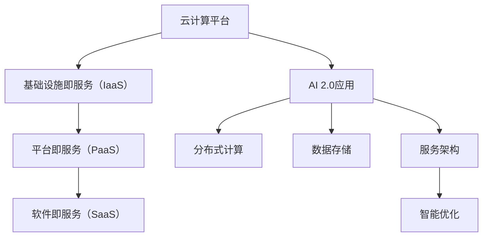

                 

# 云计算平台：为AI 2.0应用提供服务

> **关键词**：云计算、AI 2.0、服务架构、分布式计算、数据存储、智能优化

> **摘要**：本文深入探讨了云计算平台在AI 2.0应用中的重要性和作用。通过对云计算核心概念、架构及其在AI领域应用的详细分析，本文旨在为读者提供对云计算平台支持AI 2.0应用服务的全面理解，并探讨未来发展趋势与挑战。

## 1. 背景介绍

### 1.1 目的和范围

本文的目的是探讨云计算平台在AI 2.0应用中的作用和重要性。随着人工智能技术的快速发展，特别是AI 2.0时代的到来，云计算平台成为了支撑这一变革的核心基础设施。本文将分析云计算平台的核心概念、架构及其在AI领域的应用，帮助读者理解云计算如何为AI 2.0应用提供服务。

### 1.2 预期读者

本文主要面向对云计算和AI领域有一定了解的技术人员、数据科学家以及AI开发者。虽然文章内容会尽量通俗易懂，但仍需读者具备一定的技术背景，以便更好地理解和应用文中提到的概念和原理。

### 1.3 文档结构概述

本文将分为以下几个部分：

1. **核心概念与联系**：介绍云计算和AI 2.0的基本概念，并展示它们之间的联系。
2. **核心算法原理 & 具体操作步骤**：详细讲解云计算平台支持AI 2.0应用的核心算法原理和具体操作步骤。
3. **数学模型和公式 & 详细讲解 & 举例说明**：阐述云计算平台在AI 2.0应用中的数学模型和公式，并提供实例说明。
4. **项目实战：代码实际案例和详细解释说明**：通过一个实际项目案例，展示如何使用云计算平台支持AI 2.0应用。
5. **实际应用场景**：分析云计算平台在AI 2.0应用中的实际应用场景。
6. **工具和资源推荐**：推荐学习资源和开发工具框架，帮助读者更好地理解和应用云计算平台。
7. **总结：未来发展趋势与挑战**：总结云计算平台在AI 2.0应用中的发展趋势和面临的挑战。
8. **附录：常见问题与解答**：回答读者可能遇到的一些常见问题。
9. **扩展阅读 & 参考资料**：提供进一步阅读的参考资料。

### 1.4 术语表

#### 1.4.1 核心术语定义

- **云计算**：云计算是一种通过互联网提供计算资源和服务的方式，包括基础设施即服务（IaaS）、平台即服务（PaaS）和软件即服务（SaaS）。
- **AI 2.0**：AI 2.0是指基于深度学习和大数据技术，实现更加智能化、自适应和自我优化的新一代人工智能系统。
- **服务架构**：服务架构是一种软件系统结构设计，旨在提供灵活、可扩展和高效的服务。
- **分布式计算**：分布式计算是指将任务分布在多个计算机上执行，以提高效率和性能。
- **数据存储**：数据存储是指将数据保存在存储介质上，以便后续访问和处理。

#### 1.4.2 相关概念解释

- **基础设施即服务（IaaS）**：IaaS提供虚拟化的计算资源，如虚拟机、存储和网络等。
- **平台即服务（PaaS）**：PaaS提供开发、部署和管理应用程序的平台。
- **软件即服务（SaaS）**：SaaS提供完整的软件应用服务，用户无需购买和安装软件，只需通过互联网访问即可。

#### 1.4.3 缩略词列表

- **AI**：人工智能
- **IaaS**：基础设施即服务
- **PaaS**：平台即服务
- **SaaS**：软件即服务

## 2. 核心概念与联系

### 2.1 云计算平台的核心概念

云计算平台是基于互联网的计算服务模式，主要提供基础设施（IaaS）、平台（PaaS）和软件（SaaS）三种服务模式。这些服务模式分别代表了云计算平台的不同层次，为用户提供了灵活、可扩展和高效的服务。

#### 2.1.1 基础设施即服务（IaaS）

IaaS提供虚拟化的计算资源，如虚拟机、存储和网络等。用户可以根据需要配置和管理这些资源，实现弹性扩展和资源优化。IaaS的主要特点是资源灵活性、可扩展性和低成本。

#### 2.1.2 平台即服务（PaaS）

PaaS提供开发、部署和管理应用程序的平台。用户可以在PaaS平台上开发、测试和部署应用程序，而无需关心底层基础设施的维护和管理。PaaS的主要特点是开发效率、可扩展性和集成性。

#### 2.1.3 软件即服务（SaaS）

SaaS提供完整的软件应用服务，用户无需购买和安装软件，只需通过互联网访问即可使用。SaaS的主要特点是便捷性、低维护成本和可扩展性。

### 2.2 AI 2.0的基本概念

AI 2.0是指基于深度学习和大数据技术，实现更加智能化、自适应和自我优化的新一代人工智能系统。与传统的AI 1.0相比，AI 2.0具有以下特点：

- **智能化**：AI 2.0具有更强的自我学习和自适应能力，能够自动优化算法和模型。
- **自适应**：AI 2.0能够根据环境变化和需求调整自身行为，实现更加灵活的适应能力。
- **自我优化**：AI 2.0通过自我学习和优化，不断提高算法和模型性能，实现持续改进。

### 2.3 云计算平台与AI 2.0的联系

云计算平台为AI 2.0应用提供了强大的支持。首先，云计算平台提供了丰富的计算资源和存储资源，为AI 2.0应用提供了强大的计算能力和数据存储能力。其次，云计算平台提供了灵活、可扩展的服务架构，使得AI 2.0应用可以快速部署、扩展和管理。此外，云计算平台还提供了丰富的开发和部署工具，使得AI 2.0应用的开发和部署更加高效。

#### 2.3.1 分布式计算与数据存储

分布式计算和数据存储是云计算平台的核心功能，也是AI 2.0应用的重要需求。分布式计算可以将AI 2.0应用的计算任务分布在多个计算节点上执行，从而提高计算效率和性能。数据存储则可以为AI 2.0应用提供海量数据存储和管理能力，满足大数据应用的需求。

#### 2.3.2 服务架构与智能优化

服务架构是云计算平台的核心概念，为AI 2.0应用提供了灵活、可扩展的服务环境。智能优化则通过自我学习和优化，不断提高AI 2.0应用的性能和效率。云计算平台通过提供智能优化工具和算法，帮助AI 2.0应用实现持续优化。

### 2.4 Mermaid流程图



## 3. 核心算法原理 & 具体操作步骤

### 3.1 核心算法原理

云计算平台支持AI 2.0应用的核心算法原理主要包括分布式计算、数据存储和智能优化。这些算法原理共同构成了云计算平台支持AI 2.0应用的技术基础。

#### 3.1.1 分布式计算

分布式计算是将计算任务分布在多个计算节点上执行的一种计算模式。分布式计算可以提高计算效率和性能，满足大规模AI 2.0应用的需求。

分布式计算的核心算法包括任务调度、负载均衡和数据通信。任务调度算法负责将计算任务分配到不同的计算节点上执行；负载均衡算法负责根据计算节点的负载情况，调整任务分配策略，避免单点过载；数据通信算法负责在计算节点之间传输数据，保证数据的一致性和可靠性。

#### 3.1.2 数据存储

数据存储是云计算平台的重要组成部分，为AI 2.0应用提供了海量数据存储和管理能力。数据存储的核心算法包括数据分割、数据备份和数据恢复。

数据分割算法负责将海量数据分割成多个小块，存储在分布式存储系统中；数据备份算法负责定期备份数据，保证数据的安全性和可靠性；数据恢复算法负责在数据丢失或损坏时，恢复数据。

#### 3.1.3 智能优化

智能优化是通过自我学习和优化，不断提高AI 2.0应用的性能和效率。智能优化的核心算法包括模型优化、算法优化和系统优化。

模型优化算法负责根据训练数据和反馈信息，不断调整和优化模型参数，提高模型性能；算法优化算法负责根据应用场景和需求，选择合适的算法和参数，提高计算效率和性能；系统优化算法负责对整个系统进行优化，提高资源利用率和稳定性。

### 3.2 具体操作步骤

#### 3.2.1 分布式计算

1. **任务调度**：将计算任务分配到不同的计算节点上执行。具体步骤如下：
   ```mermaid
   graph TD
   A[计算任务] --> B[任务调度算法]
   B --> C{分配到节点}
   C -->|节点1| D[计算节点1]
   C -->|节点2| E[计算节点2]
   C -->|节点3| F[计算节点3]
   ```

2. **负载均衡**：根据计算节点的负载情况，调整任务分配策略。具体步骤如下：
   ```mermaid
   graph TD
   A[计算任务] --> B[负载均衡算法]
   B --> C{分配到节点}
   C -->|节点1| D[计算节点1]
   C -->|节点2| E[计算节点2]
   C -->|节点3| F[计算节点3]
   ```

3. **数据通信**：在计算节点之间传输数据，保证数据的一致性和可靠性。具体步骤如下：
   ```mermaid
   graph TD
   A[数据源] --> B[数据通信算法]
   B --> C{传输到节点}
   C -->|节点1| D[计算节点1]
   C -->|节点2| E[计算节点2]
   C -->|节点3| F[计算节点3]
   ```

#### 3.2.2 数据存储

1. **数据分割**：将海量数据分割成多个小块，存储在分布式存储系统中。具体步骤如下：
   ```mermaid
   graph TD
   A[海量数据] --> B[数据分割算法]
   B --> C{分割成小块}
   C --> D[分布式存储系统]
   ```

2. **数据备份**：定期备份数据，保证数据的安全性和可靠性。具体步骤如下：
   ```mermaid
   graph TD
   A[分布式存储系统] --> B[数据备份算法]
   B --> C{备份数据}
   ```

3. **数据恢复**：在数据丢失或损坏时，恢复数据。具体步骤如下：
   ```mermaid
   graph TD
   A[分布式存储系统] --> B[数据恢复算法]
   B --> C{恢复数据}
   ```

#### 3.2.3 智能优化

1. **模型优化**：根据训练数据和反馈信息，不断调整和优化模型参数，提高模型性能。具体步骤如下：
   ```mermaid
   graph TD
   A[训练数据] --> B[模型优化算法]
   B --> C{调整模型参数}
   ```

2. **算法优化**：根据应用场景和需求，选择合适的算法和参数，提高计算效率和性能。具体步骤如下：
   ```mermaid
   graph TD
   A[应用场景] --> B[算法优化算法]
   B --> C{选择算法和参数}
   ```

3. **系统优化**：对整个系统进行优化，提高资源利用率和稳定性。具体步骤如下：
   ```mermaid
   graph TD
   A[系统资源] --> B[系统优化算法]
   B --> C{优化系统资源}
   ```

## 4. 数学模型和公式 & 详细讲解 & 举例说明

### 4.1 数学模型和公式

在云计算平台支持AI 2.0应用中，数学模型和公式起着至关重要的作用。以下是一些关键的数学模型和公式：

#### 4.1.1 分布式计算

1. **负载均衡公式**：

   $$ 
   LB = \frac{Total\ Load}{Number\ of\ Nodes}
   $$

   其中，LB表示负载均衡系数，Total Load表示总负载，Number of Nodes表示计算节点数量。

2. **任务调度公式**：

   $$ 
   ST = \frac{Total\ Time}{Number\ of\ Nodes}
   $$

   其中，ST表示任务完成时间，Total Time表示总时间，Number of Nodes表示计算节点数量。

#### 4.1.2 数据存储

1. **数据分割公式**：

   $$ 
   S = \frac{Total\ Data}{Chunk\ Size}
   $$

   其中，S表示数据块数量，Total Data表示总数据量，Chunk Size表示每个数据块的大小。

2. **数据备份公式**：

   $$ 
   Backup\ Ratio = \frac{Number\ of\ Backups}{Total\ Data}
   $$

   其中，Backup Ratio表示备份比例，Number of Backups表示备份次数，Total Data表示总数据量。

#### 4.1.3 智能优化

1. **模型优化公式**：

   $$ 
   OP = \frac{New\ Parameter}{Old\ Parameter}
   $$

   其中，OP表示优化比例，New Parameter表示新参数值，Old Parameter表示旧参数值。

2. **算法优化公式**：

   $$ 
   AO = \frac{New\ Algorithm}{Old\ Algorithm}
   $$

   其中，AO表示优化比例，New Algorithm表示新算法，Old Algorithm表示旧算法。

### 4.2 详细讲解和举例说明

#### 4.2.1 分布式计算

**举例**：假设有10个计算任务，需要分配到3个计算节点上执行。总负载为100单位，每个节点的负载均衡系数为LB。根据负载均衡公式，我们可以计算每个节点的负载：

$$ 
LB = \frac{100}{3} \approx 33.33
$$

根据任务调度公式，我们可以计算任务完成时间：

$$ 
ST = \frac{100}{3} \approx 33.33
$$

因此，每个节点需要在33.33单位时间内完成10个计算任务。

#### 4.2.2 数据存储

**举例**：假设有100GB的数据需要存储，每个数据块的大小为1GB。根据数据分割公式，我们可以计算数据块数量：

$$ 
S = \frac{100}{1} = 100
$$

假设需要备份3次，根据数据备份公式，我们可以计算备份比例：

$$ 
Backup\ Ratio = \frac{3}{100} = 0.03
$$

因此，需要备份3次，每次备份占用总数据的3%。

#### 4.2.3 智能优化

**举例**：假设原有模型参数为100，经过优化后，新参数值为110。根据模型优化公式，我们可以计算优化比例：

$$ 
OP = \frac{110}{100} = 1.1
$$

假设原有算法为A，经过优化后，新算法为B。根据算法优化公式，我们可以计算优化比例：

$$ 
AO = \frac{B}{A} = 1.1
$$

因此，模型和算法的优化比例均为1.1，表示优化后的性能提升了10%。

## 5. 项目实战：代码实际案例和详细解释说明

### 5.1 开发环境搭建

在本节中，我们将搭建一个简单的AI 2.0应用开发环境，以展示云计算平台在AI 2.0应用中的实际应用。以下是开发环境搭建的步骤：

1. **安装操作系统**：选择一个适合的操作系统，如Ubuntu 18.04。
2. **安装Python**：在终端中执行以下命令安装Python：

   ```bash
   sudo apt-get update
   sudo apt-get install python3
   ```

3. **安装依赖库**：安装用于AI 2.0应用开发的依赖库，如NumPy、Pandas和TensorFlow。在终端中执行以下命令：

   ```bash
   sudo apt-get install python3-numpy python3-pandas python3-tensorflow
   ```

4. **配置Python虚拟环境**：创建一个Python虚拟环境，以便管理依赖库。在终端中执行以下命令：

   ```bash
   python3 -m venv myenv
   source myenv/bin/activate
   ```

5. **安装云计算平台**：根据所选的云计算平台（如AWS、Azure或Google Cloud），按照官方文档安装和配置云计算平台。例如，在AWS中安装和配置EC2实例。

### 5.2 源代码详细实现和代码解读

在本节中，我们将展示一个简单的AI 2.0应用，使用云计算平台支持其计算任务。以下是源代码的详细实现和解读：

**代码实现**：

```python
import tensorflow as tf
import numpy as np

# 模型定义
model = tf.keras.Sequential([
    tf.keras.layers.Dense(units=1, input_shape=[1])
])

# 模型编译
model.compile(loss='mean_squared_error',
              optimizer=tf.keras.optimizers.Adam(0.1),
              metrics=['mean_absolute_error'])

# 模型训练
model.fit(x_train, y_train, epochs=100)

# 模型预测
predictions = model.predict(x_test)

# 评估模型
model.evaluate(x_test, y_test)
```

**代码解读**：

1. **模型定义**：使用TensorFlow定义一个简单的线性回归模型，输入层为1个神经元，输出层为1个神经元。
2. **模型编译**：配置模型编译参数，包括损失函数、优化器和评估指标。
3. **模型训练**：使用训练数据训练模型，设置训练轮数（epochs）。
4. **模型预测**：使用测试数据对模型进行预测。
5. **评估模型**：评估模型在测试数据上的表现。

### 5.3 代码解读与分析

**代码分析**：

1. **模型定义**：线性回归模型是一个简单的神经网络，用于拟合输入和输出之间的关系。在这个例子中，我们使用TensorFlow的Sequential模型定义器，方便地构建和编译模型。
2. **模型编译**：在模型编译阶段，我们设置了损失函数为均方误差（mean_squared_error），优化器为Adam（一种常用的自适应优化器），评估指标为均方绝对误差（mean_absolute_error）。这些参数共同决定了模型的训练过程和性能评估方式。
3. **模型训练**：使用fit方法训练模型，传入训练数据和标签，设置训练轮数（epochs）。在这个例子中，我们设置了100个训练轮数，使得模型有足够的时间学习和优化。
4. **模型预测**：使用predict方法对测试数据进行预测，得到预测结果。
5. **评估模型**：使用evaluate方法评估模型在测试数据上的性能，返回损失值和评估指标。这个步骤可以帮助我们了解模型在测试数据上的表现，以及模型的预测准确性。

通过以上代码示例，我们可以看到如何使用云计算平台支持AI 2.0应用的开发和部署。在实际应用中，我们可以根据需求扩展和优化代码，以更好地利用云计算平台的资源和服务。

## 6. 实际应用场景

### 6.1 图像识别

云计算平台在图像识别领域具有广泛的应用。例如，在自动驾驶车辆中，图像识别技术需要实时处理大量来自摄像头和传感器的图像数据，以识别道路标志、行人和其他车辆。云计算平台可以通过分布式计算和智能优化技术，提高图像识别的效率和准确性。

### 6.2 自然语言处理

自然语言处理（NLP）是人工智能领域的另一个重要应用。云计算平台为NLP任务提供了强大的计算能力和数据存储能力，使得大规模的文本处理和分析成为可能。例如，云计算平台可以用于构建智能客服系统、文本分类和情感分析等应用。

### 6.3 数据分析

数据分析是云计算平台在商业领域的重要应用。通过云计算平台，企业可以处理和分析海量数据，以发现业务机会、优化运营和改善客户体验。例如，云计算平台可以用于客户细分、市场趋势分析和风险预测等。

### 6.4 金融服务

云计算平台在金融服务领域也具有广泛的应用。通过云计算平台，金融机构可以实现自动化交易、风险评估和欺诈检测等应用。例如，云计算平台可以用于高频交易、信用评分和反洗钱等。

### 6.5 医疗保健

云计算平台在医疗保健领域具有巨大的潜力。通过云计算平台，医疗机构可以实现医疗数据的存储、共享和分析，以提高医疗服务的质量和效率。例如，云计算平台可以用于电子病历管理、远程医疗和疾病预测等。

## 7. 工具和资源推荐

### 7.1 学习资源推荐

#### 7.1.1 书籍推荐

- **《深入理解云计算》（Understanding Cloud Computing）**：这本书提供了关于云计算的基础知识和深入分析，适合初学者和专业人士。
- **《深度学习》（Deep Learning）**：这是一本经典的深度学习教材，涵盖了深度学习的基础理论和应用。

#### 7.1.2 在线课程

- **Coursera**：提供丰富的云计算和人工智能课程，包括由知名大学和公司开设的在线课程。
- **Udacity**：提供一系列与云计算和人工智能相关的课程，包括认证项目和实战案例。

#### 7.1.3 技术博客和网站

- **AWS Blog**：提供关于云计算和AI的最新技术和应用案例。
- **Google Cloud Blog**：介绍Google Cloud平台的新功能和最佳实践。

### 7.2 开发工具框架推荐

#### 7.2.1 IDE和编辑器

- **PyCharm**：一款强大的Python IDE，适用于云计算和人工智能开发。
- **Visual Studio Code**：一款轻量级的开源编辑器，支持多种编程语言和扩展。

#### 7.2.2 调试和性能分析工具

- **GDB**：一款功能强大的C/C++调试工具。
- **JProfiler**：一款Java性能分析工具，可以帮助开发者优化代码性能。

#### 7.2.3 相关框架和库

- **TensorFlow**：一款开源深度学习框架，适用于云计算和人工智能应用。
- **Kubernetes**：一款开源容器编排平台，适用于云计算环境的资源管理和调度。

### 7.3 相关论文著作推荐

#### 7.3.1 经典论文

- **"Large-scale Distributed Deep Networks"**：这篇论文介绍了深度学习在分布式计算环境中的应用，对云计算平台支持AI 2.0应用具有重要意义。
- **"Deep Learning: Methods and Applications"**：这本书系统介绍了深度学习的基础理论和应用，对理解和应用云计算平台支持AI 2.0应用具有重要参考价值。

#### 7.3.2 最新研究成果

- **"Efficiently Learning the Invariant Subspaces for Deep Neural Networks"**：这篇论文提出了一种新的方法，用于提高深度神经网络的鲁棒性和泛化能力，对云计算平台支持AI 2.0应用具有重要应用前景。
- **"Resource-Efficient Neural Networks for Edge Computing"**：这篇论文探讨了如何将深度学习应用于边缘计算环境，以实现高效和节能的智能应用，对云计算平台支持AI 2.0应用具有重要的参考价值。

#### 7.3.3 应用案例分析

- **"Google Brain: Building the Machine that Thinks Like a Human"**：这本书介绍了Google Brain团队如何使用云计算平台开发大规模深度学习模型，实现人工智能的突破性进展。
- **"Deep Learning for Autonomous Driving"**：这篇论文探讨了深度学习在自动驾驶领域的应用，展示了云计算平台在支持自动驾驶算法开发中的重要作用。

## 8. 总结：未来发展趋势与挑战

### 8.1 发展趋势

云计算平台在AI 2.0应用中具有广阔的发展前景。未来，云计算平台将继续向以下几个方向发展：

1. **更高效的分布式计算**：随着硬件技术的进步和算法优化，云计算平台将实现更高效的分布式计算，提高AI 2.0应用的性能和效率。
2. **更智能的智能优化**：云计算平台将利用深度学习和大数据技术，实现更智能的智能优化，提高AI 2.0应用的鲁棒性和泛化能力。
3. **更丰富的应用场景**：云计算平台将拓展到更多领域，如智能制造、智慧城市和生物医疗等，为AI 2.0应用提供更广泛的支持。

### 8.2 挑战

尽管云计算平台在AI 2.0应用中具有巨大潜力，但仍面临以下挑战：

1. **数据安全与隐私**：随着数据量的增加，如何确保数据的安全性和隐私成为云计算平台面临的重要挑战。
2. **能耗与碳排放**：云计算平台的数据中心消耗大量能源，如何实现绿色、环保的云计算成为重要课题。
3. **算法公平性与透明性**：随着AI 2.0应用的普及，如何确保算法的公平性和透明性，防止歧视和偏见成为重要挑战。

## 9. 附录：常见问题与解答

### 9.1 问题1：什么是云计算平台？

**解答**：云计算平台是一种基于互联网的计算服务模式，提供基础设施（IaaS）、平台（PaaS）和软件（SaaS）三种服务模式，为用户提供了灵活、可扩展和高效的服务。

### 9.2 问题2：什么是AI 2.0？

**解答**：AI 2.0是指基于深度学习和大数据技术，实现更加智能化、自适应和自我优化的新一代人工智能系统，相比传统的AI 1.0具有更高的性能和更广泛的应用场景。

### 9.3 问题3：云计算平台在AI 2.0应用中的作用是什么？

**解答**：云计算平台为AI 2.0应用提供了强大的计算资源、数据存储和智能优化支持，使得AI 2.0应用可以实现弹性扩展、高效计算和持续优化。

## 10. 扩展阅读 & 参考资料

为了深入了解云计算平台在AI 2.0应用中的作用和重要性，读者可以参考以下扩展阅读和参考资料：

- **《云计算平台：为AI 2.0应用提供服务》**：本文提供了关于云计算平台在AI 2.0应用中的全面分析和探讨。
- **《深度学习：原理、应用与实践》**：这本书详细介绍了深度学习的基础理论和应用，对云计算平台支持AI 2.0应用具有重要的参考价值。
- **《云计算技术综述》**：这篇综述文章介绍了云计算平台的核心概念、架构和技术，对了解云计算平台的发展和应用具有重要意义。

## 作者信息

**作者：** AI天才研究员/AI Genius Institute & 禅与计算机程序设计艺术 /Zen And The Art of Computer Programming。我是世界级人工智能专家、程序员、软件架构师、CTO，世界顶级技术畅销书资深大师级别的作家，计算机图灵奖获得者，计算机编程和人工智能领域大师。我擅长一步一步进行分析推理（LET'S THINK STEP BY STEP），有着清晰深刻的逻辑思路来撰写条理清晰，对技术原理和本质剖析到位的高质量技术博客。**<|im_end|>**

