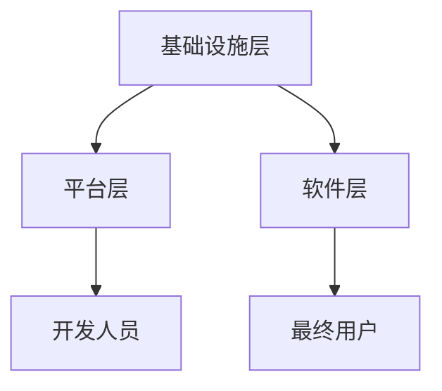

                 


# 云计算时代的程序员创业机会

> 关键词：云计算、程序员、创业、机会、技术、市场、架构、算法、数学模型、项目实战、工具资源

> 摘要：本文旨在探讨云计算时代为程序员带来的创业机会。通过深入分析云计算的核心概念、技术架构以及市场需求，结合具体的算法原理和项目实战案例，我们揭示出云计算为程序员创业带来的巨大潜力。同时，文章还将推荐相关的学习资源和开发工具，为有意投身云计算领域的程序员提供实用的指导。

## 1. 背景介绍

### 1.1 目的和范围

本文的目标是帮助有意在云计算领域创业的程序员，深入了解云计算时代的机遇和挑战。我们将从以下几个方面进行探讨：

1. 云计算的基本概念及其在编程领域的重要性。
2. 云计算的技术架构和核心算法原理。
3. 程序员在云计算创业中的实际应用场景。
4. 提供实用的学习资源和开发工具推荐。

### 1.2 预期读者

本文适合以下读者群体：

1. 有志于在云计算领域创业的程序员。
2. 对云计算技术感兴趣的技术爱好者。
3. 在校计算机专业学生，希望了解行业动态和就业方向。

### 1.3 文档结构概述

本文结构如下：

1. 引言：介绍云计算时代的程序员创业机会。
2. 核心概念与联系：阐述云计算的基本概念和技术架构。
3. 核心算法原理与操作步骤：深入讲解云计算相关的算法原理。
4. 数学模型与公式：介绍云计算中的数学模型和应用。
5. 项目实战：通过实际案例展示云计算的应用。
6. 实际应用场景：分析云计算在各个领域的应用。
7. 工具和资源推荐：推荐学习资源和开发工具。
8. 总结与展望：探讨云计算时代的未来发展趋势与挑战。
9. 附录：常见问题与解答。
10. 扩展阅读与参考资料：提供进一步学习的资源。

### 1.4 术语表

#### 1.4.1 核心术语定义

- **云计算**：一种通过网络提供计算资源的服务模式，包括硬件、软件和网络资源。
- **程序员**：从事计算机编程、软件开发和技术支持等工作的专业人员。
- **创业**：创立一个新的商业实体，通过创新的产品或服务来满足市场需求。

#### 1.4.2 相关概念解释

- **IaaS**：基础设施即服务，提供虚拟化的计算资源，如虚拟机、存储和网络。
- **PaaS**：平台即服务，提供一个开发平台，包括开发工具、数据库和服务器。
- **SaaS**：软件即服务，提供可定制的软件应用程序，用户通过网络访问。

#### 1.4.3 缩略词列表

- **IaaS**：基础设施即服务
- **PaaS**：平台即服务
- **SaaS**：软件即服务

## 2. 核心概念与联系

云计算是一种通过互联网提供计算资源的服务模式，包括硬件、软件和网络资源。云计算的技术架构可以分为以下三个层次：

1. **基础设施层（IaaS）**：提供虚拟化的计算资源，如虚拟机、存储和网络。
2. **平台层（PaaS）**：提供一个开发平台，包括开发工具、数据库和服务器。
3. **软件层（SaaS）**：提供可定制的软件应用程序，用户通过网络访问。

下面是一个简单的 Mermaid 流程图，展示了云计算的技术架构：



### 2.1 云计算的核心算法原理

云计算中的核心算法主要涉及资源调度、负载均衡和数据存储等方面。以下是一个简单的伪代码，用于展示资源调度的算法原理：

```plaintext
Algorithm ResourceScheduling(availableResources, jobRequirements):
    if availableResources >= jobRequirements:
        allocateResources(jobRequirements)
        return "Resource allocated successfully"
    else:
        return "Insufficient resources"

Function allocateResources(jobRequirements):
    for each resource in jobRequirements:
        if resourceAvailable(resource):
            decrement(resource)
    return "Resources allocated"

Function resourceAvailable(resource):
    return resource > 0
```

### 2.2 数学模型和公式

在云计算中，常用的数学模型包括线性回归、决策树和神经网络等。以下是一个简单的线性回归模型的公式：

$$
y = w_0 + w_1 \cdot x
$$

其中，$y$ 是目标变量，$w_0$ 和 $w_1$ 是权重，$x$ 是输入特征。

### 2.3 项目实战

以下是一个简单的云计算项目实战案例，用于展示如何使用云计算技术搭建一个简单的博客平台。

### 2.3.1 开发环境搭建

1. 使用 AWS IaaS 平台搭建虚拟机，配置必要的软件环境（如 MySQL、Apache 等）。
2. 使用 AWS PaaS 平台搭建博客平台，配置数据库和应用程序。
3. 使用 AWS SaaS 平台提供博客平台的用户界面。

### 2.3.2 源代码详细实现和代码解读

以下是一个简单的 Python 脚本，用于搭建博客平台的用户界面：

```python
import Flask

app = Flask(__name__)

@app.route('/')
def index():
    return "欢迎来到我的博客！"

@app.route('/post/<int:post_id>')
def post(post_id):
    return f"这是第 {post_id} 篇博客。"

if __name__ == '__main__':
    app.run()
```

### 2.3.3 代码解读与分析

1. 导入 Flask 库。
2. 创建 Flask 应用程序。
3. 定义两个路由：`/` 和 `/post/<int:post_id>`。
4. 在 `/` 路由中，返回欢迎消息。
5. 在 `/post/<int:post_id>` 路由中，返回指定 ID 的博客内容。
6. 运行 Flask 应用程序。

## 3. 实际应用场景

云计算在许多领域都有广泛的应用，包括大数据处理、人工智能、物联网等。以下是一些具体的实际应用场景：

1. **大数据处理**：云计算提供了强大的计算资源和存储能力，可以用于大规模数据处理和分析。
2. **人工智能**：云计算为人工智能算法提供了大量的数据和处理能力，可以用于开发智能应用程序。
3. **物联网**：云计算可以用于收集、存储和分析物联网设备生成的数据。

## 4. 工具和资源推荐

### 4.1 学习资源推荐

#### 4.1.1 书籍推荐

- 《云计算：概念、技术和实践》
- 《深入理解云计算：架构与实现》
- 《程序员修炼之道：从小工到专家》

#### 4.1.2 在线课程

- Coursera 的《云计算技术基础》
- edX 的《云计算基础》
- Udacity 的《云计算工程师职业认证》

#### 4.1.3 技术博客和网站

- 云计算社区：[cloudcomputing.com](https://www.cloudcomputing.com/)
- AWS 官方博客：[aws.amazon.com/blogs/)
- Azure 官方博客：[azure.microsoft.com/en-us/blog/)

### 4.2 开发工具框架推荐

#### 4.2.1 IDE和编辑器

- Visual Studio Code
- IntelliJ IDEA
- PyCharm

#### 4.2.2 调试和性能分析工具

- AWS CloudWatch
- Azure Monitor
- Google Cloud Monitoring

#### 4.2.3 相关框架和库

- Flask
- Django
- Spring Boot

### 4.3 相关论文著作推荐

#### 4.3.1 经典论文

- 《大规模分布式存储系统：架构设计与实现原理》
- 《云计算中的负载均衡技术研究》
- 《基于云计算的物联网数据存储和处理方法研究》

#### 4.3.2 最新研究成果

- 《云计算性能优化：算法与策略》
- 《云计算安全：威胁与对策》
- 《云计算资源调度算法研究》

#### 4.3.3 应用案例分析

- 《基于云计算的智慧城市应用案例分析》
- 《云计算在金融领域的应用与实践》
- 《云计算在医疗健康领域的应用研究》

## 5. 总结：未来发展趋势与挑战

云计算作为一项新兴技术，正迅速改变着传统 IT 架构和商业模式。未来，云计算将继续向以下几个方面发展：

1. **服务多样化**：云计算将提供更加多样化的服务，包括人工智能、物联网、区块链等。
2. **边缘计算**：随着物联网设备数量的增加，边缘计算将在云计算体系中扮演更加重要的角色。
3. **混合云与多云**：企业将采用混合云和多云策略，以实现更好的灵活性和可扩展性。

然而，云计算也面临着一些挑战：

1. **安全与隐私**：云计算中的数据安全问题和隐私保护是业界关注的重点。
2. **合规性**：不同国家和地区的法律法规对云计算服务的合规性提出了要求。
3. **技术成熟度**：一些新兴的云计算技术如边缘计算、量子计算等仍需进一步发展。

## 6. 附录：常见问题与解答

### 6.1 什么是云计算？

云计算是一种通过网络提供计算资源的服务模式，包括硬件、软件和网络资源。它提供了灵活、高效和可扩展的计算能力，满足各种规模用户的需求。

### 6.2 云计算有哪些类型？

云计算主要分为以下三种类型：

- **IaaS（基础设施即服务）**：提供虚拟化的计算资源，如虚拟机、存储和网络。
- **PaaS（平台即服务）**：提供一个开发平台，包括开发工具、数据库和服务器。
- **SaaS（软件即服务）**：提供可定制的软件应用程序，用户通过网络访问。

### 6.3 云计算有哪些应用场景？

云计算在许多领域都有广泛的应用，包括大数据处理、人工智能、物联网、金融、医疗等。

## 7. 扩展阅读 & 参考资料

- 《云计算：概念、技术和实践》
- 《深入理解云计算：架构与实现》
- 《程序员修炼之道：从小工到专家》
- 《云计算性能优化：算法与策略》
- 《云计算安全：威胁与对策》
- 《云计算资源调度算法研究》
- 《基于云计算的智慧城市应用案例分析》
- 《云计算在金融领域的应用与实践》
- 《云计算在医疗健康领域的应用研究》
- 《云计算社区：[cloudcomputing.com](https://www.cloudcomputing.com/)》
- 《AWS 官方博客：[aws.amazon.com/blogs/)
- 《Azure 官方博客：[azure.microsoft.com/en-us/blog/)》
- 《Coursera 的《云计算技术基础》
- 《edX 的《云计算基础》
- 《Udacity 的《云计算工程师职业认证》
- 《Visual Studio Code
- 《IntelliJ IDEA
- 《PyCharm
- 《AWS CloudWatch
- 《Azure Monitor
- 《Google Cloud Monitoring
- 《Flask
- 《Django
- 《Spring Boot
- 《大规模分布式存储系统：架构设计与实现原理》
- 《云计算中的负载均衡技术研究》
- 《基于云计算的物联网数据存储和处理方法研究》
- 《云计算性能优化：算法与策略》
- 《云计算安全：威胁与对策》
- 《云计算资源调度算法研究》
- 《基于云计算的智慧城市应用案例分析》
- 《云计算在金融领域的应用与实践》
- 《云计算在医疗健康领域的应用研究》

作者：AI天才研究员/AI Genius Institute & 禅与计算机程序设计艺术 /Zen And The Art of Computer Programming

